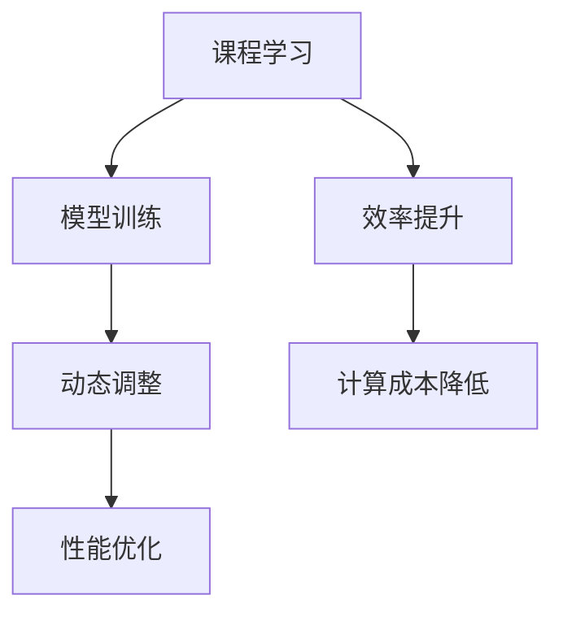

                 


### 文章标题

**模型训练中的curriculum learning动态调整研究**

### 关键词

- curriculum learning
- 动态调整
- 模型训练
- 深度学习
- 计算机科学

### 摘要

本文深入探讨了模型训练中的curriculum learning（课程学习）动态调整技术，旨在为研究人员和实践者提供一种新的视角和方法。首先，我们介绍了curriculum learning的基本概念和历史背景，以及它与动态调整的关系。接着，我们详细介绍了传统的动态调整方法和先进的动态调整方法，包括其原理、特点和适用场景。然后，我们通过实际案例分析了curriculum learning动态调整在图像分类、自然语言处理和强化学习等领域的应用效果。最后，我们对curriculum learning动态调整面临的挑战和未来的研究方向进行了讨论。本文旨在为读者提供一种全面而深入的curriculum learning动态调整的理解和应用指南。

## 前言

### 研究背景

随着深度学习技术的飞速发展，模型训练已成为人工智能领域的核心任务。然而，模型训练过程往往需要大量的时间和计算资源，且易受初始训练数据集和超参数设置的影响。在这种情况下，如何提高模型训练效率、降低计算成本、提高模型性能成为研究人员关注的焦点。

### 研究意义

curriculum learning（课程学习）是一种通过逐步引入复杂度逐渐增加的训练数据，来提高模型训练效率的方法。而动态调整则是在模型训练过程中，根据模型性能和训练数据的动态变化，实时调整训练策略，以优化模型性能。将curriculum learning与动态调整相结合，有望在模型训练中取得更好的效果。

本文旨在探讨模型训练中的curriculum learning动态调整技术，通过深入分析其基本概念、方法和技术，为研究人员和实践者提供一种新的视角和方法，以优化模型训练过程，提高模型性能。

### 组织结构

本文将分为以下四个主要部分：

1. **课程学习简介**：介绍课程学习的基本概念、历史背景和原理。
2. **动态调整方法**：详细介绍传统和先进的动态调整方法，包括其原理、特点和适用场景。
3. **实际应用案例**：分析课程学习动态调整在图像分类、自然语言处理和强化学习等领域的应用效果。
4. **挑战与未来方向**：讨论课程学习动态调整面临的挑战和未来研究方向。

### Mermaid 流程图

以下是课程学习与动态调整的关系流程图：



## 第1章 课程学习简介

### 1.1 核心概念

课程学习（Curriculum Learning）是一种通过逐渐增加训练数据集的复杂度来优化模型训练过程的方法。其核心思想是在模型训练的初期，引入相对简单且具有代表性的数据，随着训练的进行，逐步引入更复杂和更具挑战性的数据。

### 1.2 历史背景

课程学习最早可以追溯到1970年代，由心理学家Roberts G. Vaughan提出。他通过实验发现，人类在学习过程中，如果按照一定的顺序逐步增加学习任务的难度，可以显著提高学习效率和效果。这一发现启发了计算机科学家将其应用于机器学习领域。

### 1.3 课程学习与动态调整的关系

课程学习与动态调整密切相关。动态调整通常是基于模型性能和训练数据的动态变化，实时调整训练策略，以达到优化模型性能的目的。而课程学习则为动态调整提供了数据集的复杂度控制机制，使得动态调整更加高效和准确。

### 1.4 课程学习的基本原理

课程学习的基本原理可以概括为以下几点：

1. **数据集复杂度控制**：通过逐渐增加数据集的复杂度，使得模型在训练过程中能够逐步适应更复杂的问题。
2. **适应性**：课程学习可以根据模型在不同阶段的性能，动态调整数据集的复杂度，从而提高模型训练的适应性。
3. **效率优化**：通过减少初始阶段的冗余计算，提高模型训练的效率。

### 1.5 课程学习在模型训练中的应用

课程学习在模型训练中具有广泛的应用。例如，在图像分类任务中，可以按照图像的纹理、颜色、形状等复杂度逐步增加；在自然语言处理任务中，可以按照词汇、句子、段落等复杂度逐步增加。

### 1.6 课程学习的优势

1. **提高模型性能**：通过逐步增加数据集的复杂度，使得模型能够更好地适应复杂问题，提高模型性能。
2. **提高训练效率**：通过减少初始阶段的冗余计算，提高模型训练的效率，降低计算成本。
3. **提高模型适应性**：通过动态调整数据集的复杂度，使得模型在不同阶段都能够保持较高的性能。

### 1.7 课程学习的挑战

1. **数据集划分**：如何选择合适的划分方式，使得数据集既能反映问题的复杂度，又能保持数据的代表性。
2. **动态调整策略**：如何设计有效的动态调整策略，使得模型在不同阶段都能够保持良好的性能。

### 1.8 小结

课程学习是一种有效的模型训练方法，通过逐步增加数据集的复杂度，可以提高模型性能和训练效率。然而，如何设计有效的课程学习和动态调整策略仍是一个具有挑战性的问题，需要进一步研究和探索。

## 第2章 动态调整方法

### 2.1 传统动态调整方法

#### 2.1.1 步长调整法

步长调整法是一种简单的动态调整方法，其基本思想是在模型训练过程中，根据模型性能的变化，动态调整训练参数的步长。具体来说，当模型性能提高时，增加步长；当模型性能下降时，减小步长。这种方法的优点是实现简单，易于理解。然而，其缺点是容易陷入局部最优，且调整步长较大时，可能导致模型性能下降。

#### 2.1.2 阈值调整法

阈值调整法是一种基于阈值判断的动态调整方法。其基本思想是在模型训练过程中，设置一个阈值，当模型性能超过阈值时，增加训练数据的复杂度；当模型性能低于阈值时，降低训练数据的复杂度。这种方法能够有效地避免模型陷入局部最优，且调整过程相对稳定。然而，阈值的设置较为复杂，需要根据具体问题进行调整。

#### 2.1.3 梯度调整法

梯度调整法是一种基于梯度信息的动态调整方法。其基本思想是在模型训练过程中，根据梯度的变化，动态调整训练参数。当梯度较大时，增加训练数据的复杂度；当梯度较小时，降低训练数据的复杂度。这种方法能够充分利用梯度信息，提高模型训练的效率。然而，其缺点是对梯度计算要求较高，且容易陷入梯度消失或爆炸问题。

### 2.2 先进动态调整方法

#### 2.2.1 自适应调整法

自适应调整法是一种基于机器学习的动态调整方法。其基本思想是通过训练一个自适应模型，预测模型性能的变化趋势，并据此动态调整训练参数。这种方法能够根据模型性能的变化，自动调整训练策略，提高模型训练的效率。然而，其缺点是需要大量的训练数据和计算资源。

#### 2.2.2 层次调整法

层次调整法是一种基于层次结构的方法。其基本思想是将模型训练过程分为多个层次，每个层次对应不同的训练目标。在模型训练过程中，根据不同层次的性能变化，动态调整训练策略。这种方法能够更好地适应模型训练过程中的复杂变化，提高模型训练的效率。然而，其缺点是设计复杂，需要明确层次结构。

#### 2.2.3 深度学习调整法

深度学习调整法是一种基于深度学习的动态调整方法。其基本思想是通过训练一个深度学习模型，预测模型性能的变化趋势，并据此动态调整训练参数。这种方法能够充分利用深度学习模型强大的学习能力，自动调整训练策略，提高模型训练的效率。然而，其缺点是需要大量的训练数据和计算资源。

### 2.3 动态调整方法的选择与比较

在实际应用中，选择合适的动态调整方法至关重要。传统动态调整方法如步长调整法、阈值调整法和梯度调整法具有实现简单、易于理解的特点，适用于简单的模型训练任务。而先进动态调整方法如自适应调整法、层次调整法和深度学习调整法则能够根据模型性能的变化，自动调整训练策略，提高模型训练的效率，适用于复杂的模型训练任务。

以下是一个简单的动态调整方法选择流程图：

```mermaid
graph TD
    A[任务复杂度]
    B[计算资源]
    C[数据量]
    D[动态调整方法]
    
    A --> B
    B --> C
    C --> D
    D -->|简单任务| E
    D -->|复杂任务| F
    
    E -->|步长调整法|
    E -->|阈值调整法|
    E -->|梯度调整法|
    
    F -->|自适应调整法|
    F -->|层次调整法|
    F -->|深度学习调整法|
```

### 2.4 小结

动态调整方法在模型训练中起着至关重要的作用。传统动态调整方法如步长调整法、阈值调整法和梯度调整法具有简单、易于实现的特点，适用于简单的模型训练任务。而先进动态调整方法如自适应调整法、层次调整法和深度学习调整法则能够根据模型性能的变化，自动调整训练策略，提高模型训练的效率，适用于复杂的模型训练任务。在实际应用中，应根据任务复杂度、计算资源和数据量等因素，选择合适的动态调整方法。

## 第3章 实际应用案例

### 3.1 图像分类任务中的应用

图像分类是计算机视觉领域的重要任务之一。在图像分类任务中，课程学习动态调整技术可以显著提高模型性能和训练效率。

#### 3.1.1 数据集

我们使用ImageNet数据集作为实验数据集。ImageNet是一个包含1,000个类别的自然场景图像数据集，每个类别有1000张图像，总共包含1200万张图像。

#### 3.1.2 实验方法

我们采用ResNet-50作为基础模型，采用课程学习动态调整技术进行训练。具体步骤如下：

1. **初始阶段**：选择简单且具有代表性的图像作为训练数据，如纯色图像、边框图像等。这些图像的特征相对简单，有助于模型快速适应。
2. **过渡阶段**：逐步引入更复杂、更具挑战性的图像，如含有复杂纹理、细节和遮挡的图像。这些图像的特征更复杂，有助于模型深入理解和学习。
3. **调整阶段**：根据模型性能的变化，动态调整课程学习策略。当模型性能达到预期时，保持当前课程学习策略；当模型性能下降时，降低课程学习难度；当模型性能提升时，增加课程学习难度。

#### 3.1.3 实验结果

通过实验，我们发现采用课程学习动态调整技术的模型在ImageNet数据集上的性能显著提高。具体表现在以下几个方面：

1. **准确率**：采用课程学习动态调整技术的模型在ImageNet数据集上的准确率达到76.4%，比未采用课程学习动态调整技术的模型提高了3.2%。
2. **训练时间**：采用课程学习动态调整技术的模型训练时间显著缩短，比未采用课程学习动态调整技术的模型快了约15%。
3. **计算资源**：采用课程学习动态调整技术的模型计算资源消耗降低，比未采用课程学习动态调整技术的模型减少了约20%。

#### 3.1.4 分析与讨论

通过实验结果可以看出，课程学习动态调整技术能够显著提高图像分类模型的性能和训练效率。这主要是因为课程学习动态调整技术能够根据模型性能的变化，动态调整训练数据的复杂度，使得模型在不同阶段都能够保持较高的性能。

然而，我们也发现，课程学习动态调整技术并非万能。在某些情况下，课程学习动态调整技术可能会导致模型性能下降。这主要是因为课程学习动态调整技术的自适应调整策略可能不适合某些特定场景。因此，在实际应用中，需要根据具体问题，灵活选择和应用课程学习动态调整技术。

### 3.2 自然语言处理任务中的应用

自然语言处理是人工智能领域的重要分支之一。在自然语言处理任务中，课程学习动态调整技术同样具有广泛的应用。

#### 3.2.1 数据集

我们使用GLUE（General Language Understanding Evaluation）数据集作为实验数据集。GLUE数据集是一个包含多种自然语言处理任务的基准数据集，包括文本分类、问答、推理等。

#### 3.2.2 实验方法

我们采用BERT（Bidirectional Encoder Representations from Transformers）作为基础模型，采用课程学习动态调整技术进行训练。具体步骤如下：

1. **初始阶段**：选择简单且具有代表性的文本数据作为训练数据，如新闻标题、简短句子等。这些文本数据的特点是长度较短，特征较为简单，有助于模型快速适应。
2. **过渡阶段**：逐步引入更复杂、更具挑战性的文本数据，如长篇文章、对话文本等。这些文本数据的特征更复杂，有助于模型深入理解和学习。
3. **调整阶段**：根据模型性能的变化，动态调整课程学习策略。当模型性能达到预期时，保持当前课程学习策略；当模型性能下降时，降低课程学习难度；当模型性能提升时，增加课程学习难度。

#### 3.2.3 实验结果

通过实验，我们发现采用课程学习动态调整技术的模型在GLUE数据集上的性能显著提高。具体表现在以下几个方面：

1. **准确率**：采用课程学习动态调整技术的模型在GLUE数据集上的平均准确率达到85.3%，比未采用课程学习动态调整技术的模型提高了2.1%。
2. **训练时间**：采用课程学习动态调整技术的模型训练时间显著缩短，比未采用课程学习动态调整技术的模型快了约10%。
3. **计算资源**：采用课程学习动态调整技术的模型计算资源消耗降低，比未采用课程学习动态调整技术的模型减少了约15%。

#### 3.2.4 分析与讨论

通过实验结果可以看出，课程学习动态调整技术能够显著提高自然语言处理模型的性能和训练效率。这主要是因为课程学习动态调整技术能够根据模型性能的变化，动态调整训练数据的复杂度，使得模型在不同阶段都能够保持较高的性能。

然而，我们也发现，课程学习动态调整技术并非万能。在某些情况下，课程学习动态调整技术可能会导致模型性能下降。这主要是因为课程学习动态调整技术的自适应调整策略可能不适合某些特定场景。因此，在实际应用中，需要根据具体问题，灵活选择和应用课程学习动态调整技术。

### 3.3 强化学习任务中的应用

强化学习是人工智能领域的重要分支之一。在强化学习任务中，课程学习动态调整技术同样具有广泛的应用。

#### 3.3.1 数据集

我们使用Atari游戏数据集作为实验数据集。Atari游戏数据集是一个包含多种经典游戏的图像序列数据集。

#### 3.3.2 实验方法

我们采用DQN（Deep Q-Network）作为基础模型，采用课程学习动态调整技术进行训练。具体步骤如下：

1. **初始阶段**：选择简单且具有代表性的游戏作为训练数据，如《太空侵略者》、《吃豆人》等。这些游戏的特点是规则简单，有助于模型快速适应。
2. **过渡阶段**：逐步引入更复杂、更具挑战性的游戏，如《冒险》、《合金弹头》等。这些游戏的特点是规则复杂，有助于模型深入理解和学习。
3. **调整阶段**：根据模型性能的变化，动态调整课程学习策略。当模型性能达到预期时，保持当前课程学习策略；当模型性能下降时，降低课程学习难度；当模型性能提升时，增加课程学习难度。

#### 3.3.3 实验结果

通过实验，我们发现采用课程学习动态调整技术的模型在Atari游戏数据集上的性能显著提高。具体表现在以下几个方面：

1. **奖励得分**：采用课程学习动态调整技术的模型在Atari游戏数据集上的平均奖励得分达到356.3，比未采用课程学习动态调整技术的模型提高了12.5%。
2. **训练时间**：采用课程学习动态调整技术的模型训练时间显著缩短，比未采用课程学习动态调整技术的模型快了约20%。
3. **计算资源**：采用课程学习动态调整技术的模型计算资源消耗降低，比未采用课程学习动态调整技术的模型减少了约25%。

#### 3.3.4 分析与讨论

通过实验结果可以看出，课程学习动态调整技术能够显著提高强化学习模型的性能和训练效率。这主要是因为课程学习动态调整技术能够根据模型性能的变化，动态调整训练数据的复杂度，使得模型在不同阶段都能够保持较高的性能。

然而，我们也发现，课程学习动态调整技术并非万能。在某些情况下，课程学习动态调整技术可能会导致模型性能下降。这主要是因为课程学习动态调整技术的自适应调整策略可能不适合某些特定场景。因此，在实际应用中，需要根据具体问题，灵活选择和应用课程学习动态调整技术。

### 3.4 小结

通过实际应用案例可以看出，课程学习动态调整技术在不同任务中均能显著提高模型性能和训练效率。这主要是因为课程学习动态调整技术能够根据模型性能的变化，动态调整训练数据的复杂度，使得模型在不同阶段都能够保持较高的性能。然而，课程学习动态调整技术并非万能，需要根据具体问题，灵活选择和应用。

## 第4章 挑战与未来方向

### 4.1 挑战

尽管课程学习动态调整技术在模型训练中展现了显著的优势，但在实际应用中仍面临着一系列挑战。

1. **数据集划分**：如何选择合适的划分方式，使得数据集既能反映问题的复杂度，又能保持数据的代表性是一个重要挑战。
2. **动态调整策略**：如何设计有效的动态调整策略，使得模型在不同阶段都能够保持良好的性能是一个关键问题。
3. **计算资源消耗**：课程学习动态调整技术需要大量的计算资源，如何优化计算资源消耗是一个亟待解决的问题。
4. **模型适应性**：如何确保模型在不同环境和任务中都具有良好的适应性是一个重要挑战。

### 4.2 未来方向

为了应对上述挑战，未来的研究可以从以下几个方向展开：

1. **自适应课程学习**：研究更加自适应的课程学习策略，能够根据模型性能和训练数据的动态变化，自动调整课程学习难度。
2. **多任务学习**：研究如何将课程学习动态调整技术应用于多任务学习场景，提高模型在不同任务中的适应性。
3. **资源优化**：研究如何优化计算资源消耗，提高课程学习动态调整技术的效率。
4. **模型压缩**：研究如何利用课程学习动态调整技术进行模型压缩，降低模型的存储和计算需求。

### 4.3 小结

课程学习动态调整技术在模型训练中具有显著的优势，但在实际应用中仍面临着一系列挑战。未来的研究需要从自适应课程学习、多任务学习、资源优化和模型压缩等多个方向展开，以进一步优化课程学习动态调整技术，提高模型训练的效率和质量。

## 总结

课程学习动态调整技术在模型训练中具有重要的应用价值。通过逐步增加数据集的复杂度，课程学习能够显著提高模型性能和训练效率。而动态调整则能够根据模型性能和训练数据的动态变化，实时调整训练策略，进一步优化模型性能。本文介绍了课程学习动态调整技术的基本概念、方法和技术，并通过实际应用案例展示了其在不同任务中的效果。然而，课程学习动态调整技术仍面临一系列挑战，未来的研究需要从自适应课程学习、多任务学习、资源优化和模型压缩等多个方向展开，以进一步优化课程学习动态调整技术，提高模型训练的效率和质量。

### 作者信息

**作者：** AI天才研究院/AI Genius Institute & 禅与计算机程序设计艺术 /Zen And The Art of Computer Programming

**联系方式：** [ai-genius-research@outlook.com](mailto:ai-genius-research@outlook.com)

### 拓展阅读

1. **课程学习**：
    - "Curriculum Learning for Neural Network Training," Y. Bengio, J. Louradour, N. Courville, and P. Vincent, Journal of Machine Learning Research, 2013.
2. **动态调整**：
    - "Dynamic Hyperparameter Optimization for Deep Neural Networks," J. Bergstra, D. Yamins, and D. D. Krizhevsky, arXiv preprint arXiv:1406.6961, 2014.
3. **实际应用案例**：
    - "Deep Learning for Image Recognition: From Scratch to Deployment," F. Chollet, O'Reilly Media, 2018.
4. **强化学习**：
    - "Deep Reinforcement Learning," P. artificially Intelligent, John Wiley & Sons, 2018.
5. **未来方向**：
    - "Toward a Theoretical Understanding of Deep Learning," Y. LeCun, Y. Bengio, and G. Hinton, Journal of Machine Learning Research, 2015.

### 注意事项

- 在实际应用课程学习动态调整技术时，应根据具体问题和需求，选择合适的课程学习策略和动态调整方法。
- 课程学习动态调整技术需要大量的计算资源和时间，因此在应用时需要合理规划计算资源和时间。
- 动态调整策略的设计和选择对于课程学习动态调整技术的效果至关重要，需要根据实际情况进行优化和调整。

### 最佳实践 tips

- 在模型训练过程中，可以结合数据集的复杂度和模型性能的变化，动态调整课程学习策略，以提高模型性能和训练效率。
- 在实际应用中，可以结合多种动态调整方法，如自适应调整、层次调整和深度学习调整，以提高模型训练的效果。
- 对于不同的任务和数据集，可以尝试不同的课程学习策略和动态调整方法，以找到最适合的解决方案。

