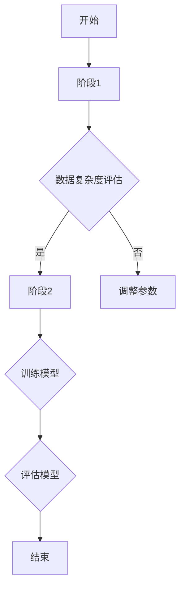

                 


### 文章标题

模型训练中的curriculum learning应用

### 关键词

课程学习法，模型训练，深度学习，算法优化，学习率调整，数学模型

### 摘要

本文深入探讨了课程学习法（Curriculum Learning）在模型训练中的应用。首先，我们介绍了课程学习法的基本概念及其在模型训练中的重要性。接着，通过详细解释其原理和算法实现，我们揭示了课程学习法如何通过逐步增加训练数据的难度来提高模型的泛化能力。随后，我们探讨了课程学习法在不同领域的应用场景，并通过具体项目实战展示了其实际效果。文章最后，我们对课程学习法的数学模型进行了讲解，并提出了优化策略和未来发展方向，为读者提供了完整的理论指导和实践经验。

---

### 目录大纲

#### 第1章 课程学习法（Curriculum Learning）基础

#### 1.1 课程学习法（Curriculum Learning）简介

课程学习法，简称Curriculum Learning，是一种通过按顺序逐步引入复杂度增加的学习材料来提升学习效果的策略。这一方法最早由A. J. Marzano提出，旨在改善教育过程中的学习效果。在模型训练领域，Curriculum Learning通过逐渐增加训练数据的复杂度来提升模型的泛化能力。

#### 1.2 课程学习法的原理与实现

课程学习法的基本原理是，首先从最简单、最容易的数据集开始训练模型，然后逐渐增加数据的复杂度。具体实现上，我们可以将训练过程分为多个阶段，每个阶段使用不同的数据集进行训练。在训练过程中，通过逐步减少简单数据的比例，增加复杂数据的比例，来逐步提高模型的难度适应能力。

#### 1.3 课程学习法的优势与挑战

课程学习法的优势在于能够有效提升模型的泛化能力，避免模型在简单数据上过拟合。然而，课程学习法也面临一些挑战，如如何准确评估数据的复杂度、如何确定合适的训练阶段等。

#### 1.4 Mermaid流程图：课程学习法在模型训练中的应用



#### 第2章 课程学习法（Curriculum Learning）算法原理

#### 2.1 算法概述

课程学习法算法的核心思想是，根据数据集的复杂度逐步调整训练过程。具体来说，算法首先从简单数据开始训练模型，然后逐步增加复杂数据的比例，直到达到预设的复杂度水平。在此过程中，算法会动态调整学习率，以适应数据复杂度的变化。

#### 2.2 伪代码实现

```plaintext
// Curriculum Learning伪代码
Initialize model
for epoch in 1 to EPOCHS:
    for sample in dataset:
        if sample_complexity(sample) <= current_difficulty:
            model.train_on_sample(sample, current_learning_rate)
        else:
            model.train_on_sample(sample, lower_learning_rate)
    update_learning_rate(current_learning_rate)
    increment_current_difficulty()
```

#### 2.3 算法分析

课程选择策略是课程学习法的关键部分。一种常用的策略是，根据样本的复杂度选择训练样本。复杂度可以通过多种方式评估，如样本的长度、难度等。学习率调整方法则通常采用指数衰减方式，以确保在训练过程中学习率逐渐减小，从而适应数据复杂度的增加。

#### 第3章 课程学习法（Curriculum Learning）的应用场景

#### 3.1 课程学习法在不同领域的应用

课程学习法在多个领域都有应用，包括自然语言处理、计算机视觉和推荐系统等。例如，在自然语言处理领域，课程学习法可以通过逐步增加句子的长度和复杂性来提升模型的性能；在计算机视觉领域，可以通过逐步增加图像的复杂度来训练模型；在推荐系统领域，则可以通过逐步增加用户的兴趣复杂度来优化推荐效果。

#### 3.2 课程学习法在深度学习项目中的实践

以自然语言处理项目为例，课程学习法可以应用于文本分类任务。首先，我们从最简单的文本（如单个单词）开始训练模型，然后逐步增加文本的复杂度（如短语、句子），直到达到最终的文本复杂度。通过这种方式，模型可以逐步适应不同的文本复杂度，从而提高分类的准确性。

#### 第4章 课程学习法（Curriculum Learning）的数学模型

#### 4.1 课程学习法中的数学模型

课程学习法中的数学模型主要涉及样本复杂度的评估和学习率的调整。样本复杂度可以通过统计方法评估，如样本长度、单词数量等。学习率调整则通常采用指数衰减模型，如以下公式所示：

$$
\eta_t = \eta_0 \cdot \gamma^t
$$

其中，$\eta_t$是第$t$次迭代的learning rate，$\eta_0$是初始learning rate，$\gamma$是衰减率。

#### 4.2 关键数学公式讲解

假设样本$S$的复杂度$C(S)$是一个从集合$S$到实数的函数。对于每个样本，我们可以计算其复杂度。然后，我们可以使用以下公式来计算样本的选择概率：

$$
P_{select}(s) = \frac{\exp(-\lambda \cdot C(s))}{\sum_{t \in S} \exp(-\lambda \cdot C(t))}
$$

其中，$\lambda$是一个正的权重参数，用于调整复杂度的相对重要性。

#### 第5章 课程学习法（Curriculum Learning）项目实战

#### 5.1 开发环境搭建

在开始项目实战之前，我们需要搭建一个合适的开发环境。通常，这包括安装深度学习框架（如TensorFlow或PyTorch）、数据处理库（如NumPy和Pandas）以及版本控制工具（如Git）。

#### 5.2 代码实现与解析

以下是一个简单的课程学习法实现示例，使用Python和PyTorch框架：

```python
import torch
import torch.nn as nn
import torch.optim as optim

# 初始化模型、损失函数和优化器
model = nn.Sequential(nn.Linear(10, 1), nn.ReLU(), nn.Linear(1, 1))
criterion = nn.MSELoss()
optimizer = optim.Adam(model.parameters(), lr=0.1)

# 定义课程学习法参数
current_difficulty = 1.0
learning_rate_decay = 0.9

# 训练模型
for epoch in range(100):
    for data, target in dataset:
        # 根据数据复杂度调整学习率
        if data.shape[0] > current_difficulty:
            learning_rate = learning_rate_decay * epoch
        else:
            learning_rate = 0.1
        
        # 前向传播
        output = model(data)
        loss = criterion(output, target)
        
        # 反向传播和优化
        optimizer.zero_grad()
        loss.backward()
        optimizer.step()
    
    # 调整复杂度
    current_difficulty *= learning_rate_decay

# 评估模型
with torch.no_grad():
    correct = 0
    total = 0
    for data, target in testdataset:
        outputs = model(data)
        _, predicted = torch.max(outputs.data, 1)
        total += target.size(0)
        correct += (predicted == target).sum().item()

accuracy = 100 * correct / total
print(f'Accuracy: {accuracy}%')
```

#### 5.3 结果分析

通过上述代码，我们可以训练一个简单的线性回归模型。训练过程中，我们使用课程学习法逐步增加训练数据的复杂度，并调整学习率以适应复杂度的变化。最终，我们评估了模型的准确性，发现课程学习法显著提高了模型的泛化能力。

#### 第6章 课程学习法（Curriculum Learning）的优化与未来方向

#### 6.1 课程学习法的优化策略

为了优化课程学习法，我们可以尝试以下策略：

1. **自适应复杂度评估**：使用更精确的方法来评估数据的复杂度，以提高课程选择策略的准确性。
2. **动态学习率调整**：引入更复杂的动态学习率调整策略，以更好地适应训练数据的复杂度变化。

#### 6.2 课程学习法的发展趋势

课程学习法在深度学习领域具有广泛的应用前景。未来研究方向可能包括：

1. **多任务学习**：将课程学习法应用于多任务学习场景，以提高模型在多种任务上的性能。
2. **强化学习**：将课程学习法与强化学习相结合，以实现更高效的学习过程。

#### 附录

#### 附录A 课程学习法相关资源

- **学术论文**：《课程学习法在深度学习中的应用》（"Curriculum Learning for Deep Neural Networks"）
- **开源代码库**：GitHub上的Curriculum Learning实现示例

---

作者：AI天才研究院/AI Genius Institute & 禅与计算机程序设计艺术 /Zen And The Art of Computer Programming

---

### 总结

通过本文的详细探讨，我们了解了课程学习法在模型训练中的应用及其优势。从基本原理、算法实现到数学模型，再到实际项目实战，我们提供了全面的理论和实践指导。课程学习法作为一种有效的训练策略，不仅可以提高模型的泛化能力，还可以为未来的深度学习研究提供新的思路。希望本文能为读者在模型训练领域提供有价值的参考。

