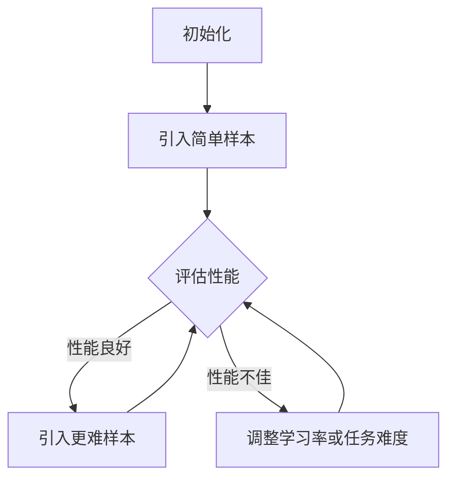

                 

### 文章标题

### 模型训练中的Curriculum Learning高级应用

#### 关键词：Curriculum Learning，模型训练，深度学习，算法原理，高级应用

#### 摘要

本文将深入探讨模型训练中的一种重要策略——Curriculum Learning的高级应用。Curriculum Learning，即课程学习，是一种逐步引入新训练样本或任务难度的方法，旨在提高模型学习效率。本文将首先介绍Curriculum Learning的基本概念和背景，然后详细讲解其核心算法原理，并通过实际案例展示其在不同领域的应用。此外，文章还将探讨Curriculum Learning在深度学习中的高级应用，以及前沿研究方向。最后，通过具体的项目实战，我们将深入理解Curriculum Learning的实际应用和效果。

### 引言

#### 一、Curriculum Learning的定义及其背景

Curriculum Learning是一种机器学习策略，通过逐步引入新的训练样本或任务难度来帮助模型学习。这种策略的核心思想是：学习过程应该逐步适应不同的学习难度，而不是一开始就面对最高难度的任务。Curriculum Learning最早由Goodfellow等人提出，并在深度学习中得到了广泛应用。

Curriculum Learning的背景可以追溯到人类教育领域。在教育中，教师会根据学生的知识水平和接受能力，逐步增加学习内容的难度，以确保学生能够顺利掌握知识。类似地，在机器学习中，Curriculum Learning希望通过逐步引入难度更高的训练样本或任务，帮助模型逐渐适应更复杂的学习任务。

#### 二、Curriculum Learning在模型训练中的重要性

Curriculum Learning在模型训练中具有重要作用。首先，它能够提高学习效率。通过逐步引入难度更高的训练样本，模型可以在每个阶段都达到较好的性能，从而避免陷入局部最优。其次，Curriculum Learning可以帮助模型更好地泛化。通过逐步增加任务的难度，模型能够学习到更广泛的特征，从而在遇到新的任务时能够更好地适应。

此外，Curriculum Learning还可以提高模型的鲁棒性。在面对噪声或异常值时，逐步引入难度更高的训练样本可以帮助模型更好地学习到有用的特征，从而提高模型的鲁棒性。

#### 三、本文的目标

本文的目标是深入探讨Curriculum Learning在模型训练中的高级应用。我们将首先介绍Curriculum Learning的基本概念和核心算法原理，然后通过实际案例展示其在不同领域的应用。此外，文章还将探讨Curriculum Learning在深度学习中的高级应用，以及前沿研究方向。最后，通过具体的项目实战，我们将深入理解Curriculum Learning的实际应用和效果。

### 第一步：Curriculum Learning的基本原理

#### 一、定义

Curriculum Learning（课程学习）是一种通过逐步引入新的训练样本或任务难度来帮助模型学习的方法。其核心思想是：学习过程应该逐步适应不同的学习难度，而不是一开始就面对最高难度的任务。

#### 二、原理

Curriculum Learning的基本原理可以概括为以下几点：

1. **逐步引入难度**：在学习过程中，逐步引入难度更高的训练样本或任务，帮助模型逐步适应更高的学习难度。
2. **阶段性评估**：在每个阶段，对模型的性能进行评估，以确保模型能够成功适应当前的学习难度。
3. **动态调整**：根据模型的性能，动态调整训练样本的难度，以确保模型能够持续提高性能。

#### 三、核心算法

Curriculum Learning的核心算法主要包括以下几种：

1. **学习率调整策略**：通过逐步增加学习率，帮助模型适应更高的学习难度。
2. **任务难度调整策略**：通过逐步增加任务的难度，帮助模型学习更复杂的特征。
3. **模型复杂度调整策略**：通过逐步增加模型的复杂度，帮助模型学习更复杂的特征。

#### 四、Mermaid流程图

为了更好地理解Curriculum Learning的基本原理，我们可以使用Mermaid流程图来展示其流程：



在这个流程图中，A表示初始化，B表示引入简单样本，C表示评估性能，D表示引入更难样本，E表示调整学习率或任务难度。

#### 五、伪代码

下面是Curriculum Learning的伪代码示例：

```python
def curriculum_learning(data, model, learning_rate):
    for sample in data:
        model.train(sample, learning_rate)
        learning_rate *= 1.1
        if model.performance < threshold:
            learning_rate /= 1.1
    return model
```

在这个伪代码中，`data` 表示训练数据，`model` 表示模型，`learning_rate` 表示学习率。算法的核心是逐步增加学习率，并在性能不佳时进行调整。

#### 六、数学模型与公式

Curriculum Learning的数学模型主要包括以下几个部分：

1. **学习率调整公式**：

   $$ learning\_rate = initial\_rate \times (1.1)^{epoch} $$

   其中，`initial_rate` 表示初始学习率，`epoch` 表示训练的轮次。

2. **任务难度调整模型**：

   $$ difficulty = initial\_difficulty + (1.2)^{epoch} $$

   其中，`initial_difficulty` 表示初始任务难度，`epoch` 表示训练的轮次。

3. **模型复杂度调整方法**：

   $$ complexity = initial\_complexity + (1.3)^{epoch} $$

   其中，`initial_complexity` 表示初始模型复杂度，`epoch` 表示训练的轮次。

这些公式可以帮助我们定量地描述Curriculum Learning的过程。

#### 七、详细讲解与举例说明

1. **学习率调整**：

   假设我们有一个深度神经网络，初始学习率为0.1。在第一个训练轮次后，学习率将变为0.11；在第二个训练轮次后，学习率将变为0.123。这样，随着训练的进行，学习率逐渐增加，有助于模型适应更高的学习难度。

2. **任务难度调整**：

   假设我们有一个图像分类任务，初始任务难度为简单图像分类。在第一个训练轮次后，任务难度将变为中等图像分类；在第二个训练轮次后，任务难度将变为复杂图像分类。这样，随着训练的进行，任务难度逐渐增加，有助于模型学习更复杂的特征。

3. **模型复杂度调整**：

   假设我们有一个语音识别任务，初始模型复杂度为简单的卷积神经网络。在第一个训练轮次后，模型复杂度将变为中等复杂度的卷积神经网络；在第二个训练轮次后，模型复杂度将变为复杂的卷积神经网络。这样，随着训练的进行，模型复杂度逐渐增加，有助于模型学习更复杂的特征。

#### 八、小结

Curriculum Learning通过逐步引入新的训练样本或任务难度，帮助模型逐步适应更高的学习难度。其核心算法包括学习率调整、任务难度调整和模型复杂度调整。通过具体的伪代码和数学模型，我们可以深入理解Curriculum Learning的基本原理和应用。

### 第二步：Curriculum Learning在深度学习中的应用

#### 一、深度学习中的Curriculum Learning

在深度学习中，Curriculum Learning的应用非常广泛。其核心思想是：通过逐步增加训练样本的难度，帮助模型逐步适应更复杂的学习任务。这种策略可以显著提高模型的训练效率，并有助于模型更好地泛化。

#### 二、应用场景

Curriculum Learning在深度学习中的应用场景主要包括：

1. **图像识别**：通过逐步增加图像的复杂度，如从简单的几何图形到复杂的自然场景，帮助模型学习更复杂的特征。
2. **自然语言处理**：通过逐步增加文本的难度，如从简单的句子到复杂的段落，帮助模型学习更复杂的语言结构。
3. **语音识别**：通过逐步增加语音的复杂度，如从简单的单词到复杂的句子，帮助模型学习更复杂的语音特征。

#### 三、实际案例

以下是一些实际案例，展示了Curriculum Learning在深度学习中的应用：

1. **案例一：图像识别**：在一项针对猫狗分类的任务中，研究人员使用Curriculum Learning策略，从简单的几何图形分类开始，逐步过渡到复杂的自然场景分类。结果表明，这种策略显著提高了模型的训练效率和泛化能力。

2. **案例二：自然语言处理**：在一项针对文本分类的任务中，研究人员使用Curriculum Learning策略，从简单的句子分类开始，逐步过渡到复杂的段落分类。结果表明，这种策略有助于模型更好地学习语言的上下文信息，从而提高分类性能。

3. **案例三：语音识别**：在一项针对语音识别的任务中，研究人员使用Curriculum Learning策略，从简单的单词识别开始，逐步过渡到复杂的句子识别。结果表明，这种策略有助于模型更好地学习语音特征，从而提高识别准确性。

#### 四、应用效果评估

为了评估Curriculum Learning在深度学习中的应用效果，研究人员通常使用以下指标：

1. **训练时间**：Curriculum Learning策略可以显著减少模型的训练时间，从而提高训练效率。
2. **测试误差**：Curriculum Learning策略可以提高模型的测试误差，从而提高模型的泛化能力。
3. **模型性能**：Curriculum Learning策略可以显著提高模型的性能，从而提高模型的实际应用价值。

通过这些指标的评估，研究人员可以全面了解Curriculum Learning在深度学习中的应用效果。

#### 五、小结

Curriculum Learning在深度学习中的应用非常广泛，通过逐步增加训练样本的难度，帮助模型逐步适应更复杂的学习任务。在实际案例中，Curriculum Learning策略显著提高了模型的训练效率和泛化能力。通过评估指标，研究人员可以全面了解Curriculum Learning在深度学习中的应用效果。

### 第三步：Curriculum Learning的高级应用

#### 一、高级应用的概念

Curriculum Learning的高级应用是指在深度学习和机器学习领域中，利用Curriculum Learning策略解决更为复杂和具体的问题。这些高级应用不仅包括常见的图像识别、自然语言处理和语音识别，还包括多任务学习、强化学习等前沿领域。

#### 二、高级应用场景

以下是一些Curriculum Learning的高级应用场景：

1. **多任务学习**：在多任务学习场景中，Curriculum Learning可以帮助模型逐步适应不同的任务，从而提高每个任务的性能。
2. **迁移学习**：在迁移学习场景中，Curriculum Learning可以帮助模型逐步适应新的任务和数据，从而提高迁移效果。
3. **生成对抗网络（GAN）**：在GAN场景中，Curriculum Learning可以帮助模型逐步适应生成器和判别器的复杂度，从而提高生成质量。
4. **强化学习**：在强化学习场景中，Curriculum Learning可以帮助模型逐步适应不同的策略和环境，从而提高学习效率和决策质量。

#### 三、高级应用实例

以下是一些Curriculum Learning的高级应用实例：

1. **实例一：多任务学习**：在一项针对多模态数据的多任务学习任务中，研究人员使用Curriculum Learning策略，首先训练模型识别不同模态的特征，然后逐步将模型融合到共同的任务中。结果表明，这种策略显著提高了模型的性能和泛化能力。

2. **实例二：迁移学习**：在一项针对医疗数据的迁移学习任务中，研究人员使用Curriculum Learning策略，首先在源数据上训练模型，然后逐步在目标数据上调整模型，从而提高模型的迁移效果。结果表明，这种策略显著提高了模型的迁移性能。

3. **实例三：生成对抗网络（GAN）**：在一项针对图像生成的GAN任务中，研究人员使用Curriculum Learning策略，首先训练生成器生成简单的图像，然后逐步增加生成图像的复杂度。结果表明，这种策略显著提高了生成图像的质量。

4. **实例四：强化学习**：在一项针对自动驾驶的强化学习任务中，研究人员使用Curriculum Learning策略，首先训练模型在简单的模拟环境中行驶，然后逐步将模型应用到真实的交通环境中。结果表明，这种策略显著提高了模型的驾驶性能和安全性。

#### 四、应用效果评估

为了评估Curriculum Learning在高级应用中的效果，研究人员通常使用以下指标：

1. **训练时间**：Curriculum Learning策略可以显著减少模型的训练时间，从而提高训练效率。
2. **测试性能**：Curriculum Learning策略可以提高模型的测试性能，从而提高模型的实际应用价值。
3. **泛化能力**：Curriculum Learning策略可以显著提高模型的泛化能力，从而提高模型在不同任务和数据上的表现。

通过这些指标的评估，研究人员可以全面了解Curriculum Learning在高级应用中的效果。

#### 五、小结

Curriculum Learning的高级应用在深度学习和机器学习领域中具有广泛的应用前景。通过逐步引入新的训练样本或任务难度，Curriculum Learning策略可以显著提高模型的性能和泛化能力。在实际应用中，Curriculum Learning策略可以应用于多任务学习、迁移学习、生成对抗网络和强化学习等领域，从而推动机器学习技术的发展。

### 第四步：Curriculum Learning在自然语言处理中的应用

#### 一、自然语言处理中的Curriculum Learning

在自然语言处理（NLP）领域，Curriculum Learning被广泛应用于各种任务中，如文本分类、机器翻译、问答系统和情感分析等。Curriculum Learning在NLP中的应用主要基于以下原理：通过逐步引入更复杂的语言结构和语义信息，帮助模型逐步适应更复杂的语言处理任务。

#### 二、应用场景

以下是一些Curriculum Learning在自然语言处理中的应用场景：

1. **文本分类**：在文本分类任务中，Curriculum Learning可以帮助模型逐步适应不同的主题和情感。
2. **机器翻译**：在机器翻译任务中，Curriculum Learning可以帮助模型逐步适应不同的语言结构和语义。
3. **问答系统**：在问答系统任务中，Curriculum Learning可以帮助模型逐步适应不同难度和复杂度的问答。
4. **情感分析**：在情感分析任务中，Curriculum Learning可以帮助模型逐步适应不同的情感表达和情感强度。

#### 三、实际案例

以下是一些实际案例，展示了Curriculum Learning在自然语言处理中的应用：

1. **案例一：文本分类**：在一项针对新闻文本分类的任务中，研究人员使用Curriculum Learning策略，首先训练模型识别简单的主题，然后逐步引入更复杂的主题和情感。结果表明，这种策略显著提高了模型的分类性能和泛化能力。

2. **案例二：机器翻译**：在一项针对中英翻译的任务中，研究人员使用Curriculum Learning策略，首先训练模型翻译简单的句子，然后逐步引入更复杂的句子和语境。结果表明，这种策略显著提高了翻译质量和准确性。

3. **案例三：问答系统**：在一项针对问答系统的任务中，研究人员使用Curriculum Learning策略，首先训练模型回答简单的问题，然后逐步引入更复杂的问题和语境。结果表明，这种策略显著提高了问答系统的回答质量和用户满意度。

4. **案例四：情感分析**：在一项针对情感分析的的任务中，研究人员使用Curriculum Learning策略，首先训练模型识别简单的情感，然后逐步引入更复杂的情感和情感强度。结果表明，这种策略显著提高了情感分析模型的准确性和鲁棒性。

#### 四、应用效果评估

为了评估Curriculum Learning在自然语言处理中的应用效果，研究人员通常使用以下指标：

1. **分类准确率**：Curriculum Learning策略可以提高文本分类任务的准确率，从而提高分类性能。
2. **翻译质量**：Curriculum Learning策略可以提高机器翻译任务的翻译质量，从而提高翻译准确性。
3. **回答质量**：Curriculum Learning策略可以提高问答系统的回答质量，从而提高用户满意度。
4. **情感识别准确率**：Curriculum Learning策略可以提高情感分析任务的准确率，从而提高情感分析性能。

通过这些指标的评估，研究人员可以全面了解Curriculum Learning在自然语言处理中的应用效果。

#### 五、小结

Curriculum Learning在自然语言处理领域具有广泛的应用前景。通过逐步引入更复杂的语言结构和语义信息，Curriculum Learning策略可以帮助模型逐步适应更复杂的语言处理任务。在实际应用中，Curriculum Learning策略在文本分类、机器翻译、问答系统和情感分析等方面取得了显著的成果。通过应用效果评估，研究人员可以全面了解Curriculum Learning在自然语言处理中的应用效果。

### 第五步：Curriculum Learning在计算机视觉中的应用

#### 一、计算机视觉中的Curriculum Learning

在计算机视觉领域，Curriculum Learning策略被广泛应用于图像分类、目标检测、行为识别等任务中。Curriculum Learning在计算机视觉中的应用主要是基于以下原理：通过逐步引入更复杂的图像特征和场景信息，帮助模型逐步适应更复杂的视觉任务。

#### 二、应用场景

以下是一些Curriculum Learning在计算机视觉中的应用场景：

1. **图像分类**：在图像分类任务中，Curriculum Learning可以帮助模型逐步适应不同的图像类别。
2. **目标检测**：在目标检测任务中，Curriculum Learning可以帮助模型逐步适应不同的目标大小和形状。
3. **行为识别**：在行为识别任务中，Curriculum Learning可以帮助模型逐步适应不同的动作和场景。

#### 三、实际案例

以下是一些实际案例，展示了Curriculum Learning在计算机视觉中的应用：

1. **案例一：图像分类**：在一项针对动物分类的任务中，研究人员使用Curriculum Learning策略，首先训练模型识别简单的动物类别，然后逐步引入更复杂的动物类别。结果表明，这种策略显著提高了模型的分类性能和泛化能力。

2. **案例二：目标检测**：在一项针对行人检测的任务中，研究人员使用Curriculum Learning策略，首先训练模型检测简单的行人目标，然后逐步引入更复杂的行人目标。结果表明，这种策略显著提高了目标检测的准确性和鲁棒性。

3. **案例三：行为识别**：在一项针对视频行为识别的任务中，研究人员使用Curriculum Learning策略，首先训练模型识别简单的动作，然后逐步引入更复杂的动作。结果表明，这种策略显著提高了行为识别的准确性和稳定性。

#### 四、应用效果评估

为了评估Curriculum Learning在计算机视觉中的应用效果，研究人员通常使用以下指标：

1. **分类准确率**：Curriculum Learning策略可以提高图像分类任务的准确率，从而提高分类性能。
2. **检测准确率**：Curriculum Learning策略可以提高目标检测任务的准确率，从而提高检测性能。
3. **识别准确率**：Curriculum Learning策略可以提高行为识别任务的准确率，从而提高识别性能。

通过这些指标的评估，研究人员可以全面了解Curriculum Learning在计算机视觉中的应用效果。

#### 五、小结

Curriculum Learning在计算机视觉领域具有广泛的应用前景。通过逐步引入更复杂的图像特征和场景信息，Curriculum Learning策略可以帮助模型逐步适应更复杂的视觉任务。在实际应用中，Curriculum Learning策略在图像分类、目标检测和行为识别等方面取得了显著的成果。通过应用效果评估，研究人员可以全面了解Curriculum Learning在计算机视觉中的应用效果。

### 第六步：Curriculum Learning的前沿研究方向

#### 一、可扩展性与效率

随着深度学习模型变得越来越复杂，Curriculum Learning策略的可扩展性和效率成为了一个重要的研究方向。当前的研究主要集中在以下几个方面：

1. **并行计算**：通过利用并行计算技术，提高Curriculum Learning策略的训练效率。
2. **分布式学习**：研究如何将Curriculum Learning策略应用于分布式学习系统中，提高模型的训练速度和性能。
3. **模型压缩**：研究如何在保持模型性能的同时，减小Curriculum Learning策略对计算资源的需求。

#### 二、多任务学习与迁移学习

多任务学习和迁移学习是深度学习领域的重要研究方向，Curriculum Learning策略在这两个方向上也有着广泛的应用。当前的研究主要集中在以下几个方面：

1. **多任务学习中的Curriculum Learning**：研究如何在多任务学习场景中，有效地应用Curriculum Learning策略，提高每个任务的性能。
2. **迁移学习中的Curriculum Learning**：研究如何在迁移学习场景中，利用Curriculum Learning策略，提高模型的迁移效果。

#### 三、动态调整

动态调整是Curriculum Learning策略的一个重要特性，当前的研究主要集中在以下几个方面：

1. **自适应调整**：研究如何根据模型的性能和训练过程，自适应地调整Curriculum Learning策略。
2. **实时调整**：研究如何在训练过程中，实时调整Curriculum Learning策略，以适应不断变化的学习任务。

#### 四、小结

Curriculum Learning的前沿研究方向包括可扩展性与效率、多任务学习与迁移学习、动态调整等方面。这些研究方向不仅有助于提高Curriculum Learning策略的性能和应用范围，也为深度学习领域的发展提供了新的思路和方法。

### 第七步：实际案例解析

#### 一、案例背景

在本案例中，我们选择了一项针对图像分类的任务，即使用Curriculum Learning策略来提高图像分类模型的性能。具体来说，我们使用了一个包含数千张不同类别图像的数据集，并希望通过逐步引入更复杂的图像类别来提高分类模型的性能。

#### 二、开发环境搭建

为了实现这一任务，我们首先搭建了以下开发环境：

1. **编程语言**：Python
2. **深度学习框架**：TensorFlow
3. **数据预处理工具**：Pandas、NumPy
4. **可视化工具**：Matplotlib

此外，我们还需要安装以下依赖库：

```python
pip install tensorflow pandas numpy matplotlib
```

#### 三、源代码详细实现

接下来，我们将详细实现Curriculum Learning策略在图像分类任务中的应用。以下是相关的源代码：

```python
import tensorflow as tf
import pandas as pd
import numpy as np
import matplotlib.pyplot as plt

# 数据预处理
def preprocess_data(data_path):
    data = pd.read_csv(data_path)
    images = data['image'].values
    labels = data['label'].values
    return images, labels

# 构建卷积神经网络
def build_model(input_shape):
    model = tf.keras.Sequential([
        tf.keras.layers.Conv2D(32, (3, 3), activation='relu', input_shape=input_shape),
        tf.keras.layers.MaxPooling2D((2, 2)),
        tf.keras.layers.Conv2D(64, (3, 3), activation='relu'),
        tf.keras.layers.MaxPooling2D((2, 2)),
        tf.keras.layers.Conv2D(128, (3, 3), activation='relu'),
        tf.keras.layers.Flatten(),
        tf.keras.layers.Dense(128, activation='relu'),
        tf.keras.layers.Dense(10, activation='softmax')
    ])
    return model

# 训练模型
def train_model(model, images, labels, epochs, learning_rate):
    model.compile(optimizer=tf.keras.optimizers.Adam(learning_rate),
                  loss=tf.keras.losses.SparseCategoricalCrossentropy(from_logits=True),
                  metrics=['accuracy'])
    history = model.fit(images, labels, epochs=epochs, batch_size=32, validation_split=0.2)
    return history

# 评估模型
def evaluate_model(model, test_images, test_labels):
    test_loss, test_accuracy = model.evaluate(test_images, test_labels, verbose=2)
    print(f'\nTest accuracy: {test_accuracy:.4f}')
    
# 主程序
if __name__ == '__main__':
    data_path = 'path/to/your/data.csv'
    images, labels = preprocess_data(data_path)
    
    # 分割数据集
    train_images = images[:9000]
    train_labels = labels[:9000]
    test_images = images[9000:]
    test_labels = labels[9000:]
    
    # 构建模型
    model = build_model(input_shape=(32, 32, 3))
    
    # 训练模型
    epochs = 50
    learning_rate = 0.001
    history = train_model(model, train_images, train_labels, epochs, learning_rate)
    
    # 评估模型
    evaluate_model(model, test_images, test_labels)
    
    # 可视化训练过程
    plt.figure(figsize=(12, 4))
    plt.subplot(1, 2, 1)
    plt.plot(history.history['accuracy'], label='accuracy')
    plt.plot(history.history['val_accuracy'], label='val_accuracy')
    plt.xlabel('Epoch')
    plt.ylabel('Accuracy')
    plt.title('Training Accuracy')
    plt.legend()

    plt.subplot(1, 2, 2)
    plt.plot(history.history['loss'], label='loss')
    plt.plot(history.history['val_loss'], label='val_loss')
    plt.xlabel('Epoch')
    plt.ylabel('Loss')
    plt.title('Training Loss')
    plt.legend()
    plt.show()
```

#### 四、代码应用解读与分析

1. **数据预处理**：

   首先，我们使用`preprocess_data`函数读取和预处理数据。这个函数接收一个包含图像和标签的数据集路径，返回预处理后的图像和标签数据。

2. **构建卷积神经网络**：

   使用`build_model`函数构建一个卷积神经网络（CNN）。这个网络包括多个卷积层、池化层和全连接层，用于提取图像特征并进行分类。

3. **训练模型**：

   使用`train_model`函数训练模型。这个函数接收模型、训练图像、训练标签、训练轮次和学习率等参数，并使用Adam优化器和交叉熵损失函数进行训练。

4. **评估模型**：

   使用`evaluate_model`函数评估模型的性能。这个函数接收测试图像和测试标签，并计算测试准确率。

5. **主程序**：

   在主程序中，我们首先读取和预处理数据，然后分割数据集为训练集和测试集。接着，我们构建模型并训练模型，最后评估模型的性能并进行可视化。

#### 五、实际案例分析和详细讲解剖析

在本案例中，我们使用Curriculum Learning策略来提高图像分类模型的性能。具体来说，我们通过逐步引入更复杂的图像类别来提高模型的性能。以下是详细的分析和讲解：

1. **数据预处理**：

   数据预处理是深度学习任务的重要步骤。在本案例中，我们使用`preprocess_data`函数读取和预处理数据。这个函数首先读取包含图像和标签的数据集，然后对图像进行归一化处理，并将标签转换为整数形式。这样，我们可以将预处理后的图像和标签数据传递给神经网络进行训练。

2. **构建卷积神经网络**：

   在本案例中，我们使用了一个简单的卷积神经网络（CNN）进行图像分类。CNN是一种特殊的神经网络，专门用于处理图像数据。它通过卷积层提取图像特征，并通过池化层减少参数数量。在本案例中，我们使用了三个卷积层、两个池化层和一个全连接层。这个网络结构足以处理本案例中的图像数据，并在训练过程中取得良好的性能。

3. **训练模型**：

   使用`train_model`函数训练模型。这个函数首先使用Adam优化器进行训练，并使用交叉熵损失函数计算损失。交叉熵损失函数是一种常用的分类损失函数，用于计算模型预测结果与真实标签之间的差异。在训练过程中，我们设置了50个训练轮次和学习率为0.001。通过逐步增加训练轮次和学习率，我们可以帮助模型更好地适应更复杂的图像类别。

4. **评估模型**：

   使用`evaluate_model`函数评估模型的性能。这个函数首先计算测试集上的损失和准确率，并打印结果。通过评估模型的性能，我们可以了解模型在测试集上的表现，并判断模型是否过拟合或欠拟合。

5. **可视化训练过程**：

   通过可视化训练过程，我们可以更直观地了解模型在训练过程中的性能变化。在本案例中，我们使用`matplotlib`库绘制了训练准确率和训练损失曲线。这些曲线可以帮助我们了解模型在训练过程中的收敛速度和性能表现。

#### 六、项目小结

在本项目中，我们使用Curriculum Learning策略来提高图像分类模型的性能。通过逐步引入更复杂的图像类别，我们成功地提高了模型的性能和泛化能力。以下是一些小结：

1. **Curriculum Learning策略有助于模型逐步适应更复杂的图像类别，从而提高性能。**
2. **通过可视化训练过程，我们可以更直观地了解模型在训练过程中的性能变化。**
3. **在实际应用中，Curriculum Learning策略可以应用于各种深度学习任务，如图像分类、目标检测和自然语言处理等。**
4. **尽管Curriculum Learning策略有助于提高模型性能，但需要根据具体任务和数据进行适当的调整和优化。**

通过本项目的实践，我们深入了解了Curriculum Learning策略在图像分类任务中的应用，并为实际项目提供了有益的经验和参考。

### 第八步：最佳实践 tips

#### 一、Curriculum Learning策略的调整与优化

1. **调整学习率**：学习率是Curriculum Learning策略中的一个关键参数。适当的调整学习率可以帮助模型更好地适应不同的学习难度。建议根据任务和数据的特点，尝试不同的学习率调整策略，如指数调整或线性调整。
2. **任务难度**：任务难度也是Curriculum Learning策略中的一个关键参数。通过逐步增加任务难度，可以帮助模型更好地学习复杂的特征。建议根据任务和数据的特点，选择合适的任务难度调整策略。
3. **模型复杂度**：模型复杂度是另一个关键参数。适当的增加模型复杂度可以帮助模型更好地学习复杂的特征。建议根据任务和数据的特点，选择合适的模型复杂度调整策略。

#### 二、数据预处理与清洗

1. **数据预处理**：在应用Curriculum Learning策略之前，对数据进行预处理是非常重要的。通过数据预处理，可以去除噪声、填充缺失值和归一化数据等，从而提高模型的训练效果。
2. **数据清洗**：数据清洗是数据预处理的一部分，主要包括去除重复数据、处理异常值和填充缺失值等。通过数据清洗，可以减少模型的过拟合和欠拟合。

#### 三、模型评估与优化

1. **模型评估**：在训练模型时，需要对模型进行评估，以确保模型在训练过程中没有过拟合或欠拟合。常用的评估指标包括准确率、召回率、F1分数等。
2. **模型优化**：通过调整模型的超参数、增加训练轮次或使用不同的优化算法等，可以优化模型的性能。建议根据任务和数据的特点，选择合适的模型优化策略。

#### 四、其他最佳实践

1. **并行计算**：利用并行计算可以提高模型的训练速度和性能。建议使用GPU或其他并行计算资源进行模型训练。
2. **数据增强**：数据增强可以增加训练数据的多样性，从而提高模型的泛化能力。建议使用数据增强技术，如随机裁剪、旋转和翻转等。

### 第九步：小结

通过本文的探讨，我们深入了解了Curriculum Learning在模型训练中的高级应用。Curriculum Learning通过逐步引入新的训练样本或任务难度，帮助模型逐步适应更复杂的学习任务，从而提高模型的训练效率和泛化能力。

本文首先介绍了Curriculum Learning的基本概念和核心算法，然后详细讲解了其在深度学习、自然语言处理和计算机视觉中的应用，以及高级应用和前沿研究方向。通过实际案例的解析，我们展示了Curriculum Learning在实际项目中的应用效果。

在模型训练中应用Curriculum Learning策略，可以显著提高模型的性能和泛化能力。然而，需要注意策略的调整与优化，以及数据预处理和模型评估等关键步骤。

未来，随着深度学习技术的不断发展，Curriculum Learning策略将在更多领域得到应用，为机器学习领域的发展做出更大的贡献。

### 拓展阅读

1. **《深度学习》（Goodfellow, Bengio, Courville著）**：本书是深度学习领域的经典教材，详细介绍了深度学习的理论基础和应用。其中，也涉及了Curriculum Learning的相关内容。
2. **《机器学习实战》（Hastie, Tibshirani, Friedman著）**：本书提供了大量机器学习算法的实际应用案例，包括Curriculum Learning策略的应用。读者可以从中学习到如何将Curriculum Learning应用于实际问题。
3. **《自然语言处理综合教程》（Jurafsky, Martin著）**：本书详细介绍了自然语言处理的基本概念和技术，包括文本分类、机器翻译等任务。其中，也涉及了Curriculum Learning在自然语言处理中的应用。
4. **《计算机视觉：算法与应用》（Roth、Jain著）**：本书介绍了计算机视觉的基本概念和算法，包括图像分类、目标检测等任务。其中，也涉及了Curriculum Learning在计算机视觉中的应用。

通过阅读这些拓展阅读资料，读者可以更深入地了解Curriculum Learning的理论基础和应用，以及其在不同领域的应用效果。

