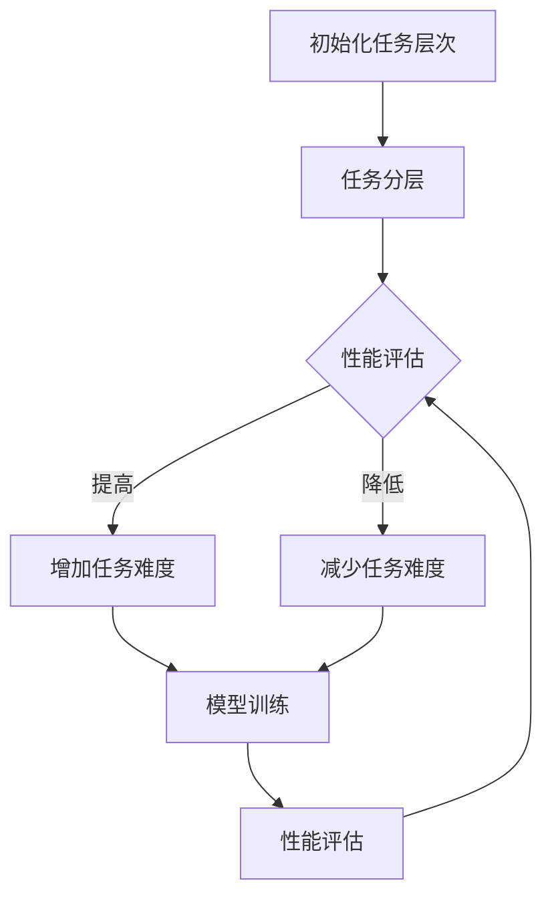

                 


### 文章标题
# 《模型训练中的Curriculum Learning高级应用研究》

### 文章关键词
- Curriculum Learning
- 模型训练
- 深度学习
- 强化学习
- 教育学习
- 算法设计
- 应用实践

### 文章摘要
本文深入探讨了Curriculum Learning在模型训练中的高级应用。首先介绍了Curriculum Learning的定义、历史背景、核心概念及其与现有学习策略的比较。随后，文章详细阐述了Curriculum Learning的理论基础，包括模型训练中的挑战、学习曲线的调整以及相关的数学模型。接下来，文章重点讨论了Curriculum Learning算法的设计与实现，使用伪代码详细解释了基本算法框架及常见算法。然后，文章分析了Curriculum Learning在深度学习和强化学习中的应用，提供了实践案例和优化策略。最后，文章展望了Curriculum Learning的未来发展方向，并总结了全文的重要观点。

## 第一部分：引入与基础

### 第1章：Curriculum Learning简介

#### 1.1 Curriculum Learning的定义
Curriculum Learning，直译为“课程学习”，是一种教育学习策略，它强调学习过程的有序性和层次性。在教育领域，Curriculum Learning的目标是通过分阶段、逐步地引入新知识，帮助学生更好地理解和掌握复杂的知识体系。这种方法类似于教育者根据学生的接受能力和知识基础，设计一个有层次、有系统的学习课程。

在机器学习领域，Curriculum Learning被赋予了类似的教育意义。它是一种训练策略，通过有计划地逐步引入任务难度，帮助模型更好地学习和适应复杂任务。这种方法可以减少模型训练过程中的过拟合现象，提高模型的泛化能力。

#### 1.2 Curriculum Learning的历史背景与发展
Curriculum Learning的理念最早可以追溯到20世纪中叶的教育心理学研究。心理学家们发现，通过有意识地设计学习课程，可以帮助学生更有效地掌握知识。随着计算机科学的进步，这种理念被引入到机器学习领域。

在早期的人工神经网络研究中，研究者们发现，通过逐步增加网络的复杂度，可以有效地提高模型的性能。这种方法逐渐演变成了Curriculum Learning，成为深度学习训练中的重要策略之一。

#### 1.3 Curriculum Learning的核心概念与原理
Curriculum Learning的核心概念包括：

- **层次性**：学习过程被划分为不同的层次，每个层次代表不同的任务难度。
- **渐进性**：模型从一个简单的任务开始，逐步过渡到更复杂的任务。
- **适应性**：学习过程可以根据模型的性能动态调整任务的难度。

Curriculum Learning的原理可以概括为以下几点：

- **任务分层**：将整个学习任务划分为若干个层次，每个层次代表不同的任务难度。
- **任务逐步引入**：模型首先从最简单的任务开始学习，然后逐步过渡到更复杂的任务。
- **性能监控与调整**：在任务切换过程中，监控模型的性能，并根据性能调整任务的难度。

#### 1.4 Curriculum Learning与其他学习策略的比较
Curriculum Learning与其他常见学习策略（如随机梯度下降、反向传播等）有以下几点不同：

- **学习过程**：Curriculum Learning强调有序、渐进的学习过程，而其他策略通常是一个无序、随机的过程。
- **任务难度**：Curriculum Learning通过分层次地引入任务难度，而其他策略通常一次性地处理所有任务。
- **性能提升**：Curriculum Learning可以通过逐步增加任务难度，提高模型的泛化能力，而其他策略可能容易陷入局部最优。

总的来说，Curriculum Learning提供了一种更为系统和有效的方法来训练模型，特别是在处理复杂任务时，其优势尤为明显。

### 第2章：Curriculum Learning的理论基础

#### 2.1 模型训练中的挑战与问题
在模型训练过程中，存在以下几个主要的挑战和问题：

- **过拟合**：模型在训练数据上表现良好，但在未见过的数据上表现不佳。
- **数据不平衡**：训练数据中某些类别或标签的数据量远远小于其他类别或标签。
- **任务复杂性**：一些任务非常复杂，模型需要大量的时间和数据来训练。
- **资源限制**：在实际应用中，计算资源和数据资源往往是有限的。

这些挑战和问题对模型训练的效果产生了显著影响，如何有效地解决这些问题成为研究者和开发者关注的重点。

#### 2.2 学习曲线与任务难度调整
学习曲线是描述模型在训练过程中性能提升的一个图表。它通常呈现为随着时间的推移，模型性能逐渐提高的趋势。然而，学习曲线也可能存在波动或者下降的情况，这反映了模型在训练过程中遇到的问题。

为了提高模型的性能，需要对学习曲线进行干预和调整。一种常见的方法是动态调整任务的难度。具体来说，可以通过以下步骤来调整任务难度：

1. **初始化**：选择一个初始的简单任务，让模型开始训练。
2. **性能评估**：在当前任务上评估模型的性能，包括准确率、召回率等指标。
3. **任务调整**：根据模型的性能评估结果，决定是否增加任务的难度。
4. **重复步骤**：重复性能评估和任务调整，直到模型达到预定的性能水平。

通过动态调整任务难度，可以有效地提升模型的性能，减少过拟合现象，提高模型的泛化能力。

#### 2.3 Curriculum Learning的理论基础
Curriculum Learning的理论基础主要建立在以下几个核心概念上：

- **层次化学习**：将学习任务划分为多个层次，每个层次代表不同的任务难度。
- **适应性学习**：根据模型的性能动态调整任务的难度。
- **渐进性学习**：模型从一个简单的任务开始，逐步过渡到更复杂的任务。

Curriculum Learning的核心原理可以概括为以下几点：

1. **任务分层**：首先，将整个学习任务划分为多个层次，每个层次代表不同的任务难度。这一步骤可以通过专家经验或者数据驱动的分析方法来完成。
2. **任务逐步引入**：模型首先从最简单的任务开始学习，然后逐步过渡到更复杂的任务。这一过程类似于人类的学习过程，通过逐步积累知识和经验，逐步提升能力。
3. **性能监控与调整**：在任务切换过程中，监控模型的性能，并根据性能调整任务的难度。这一过程需要结合学习曲线和性能评估结果来进行，确保模型能够逐步提升性能。

#### 2.3.1 Mermaid流程图：Curriculum Learning原理架构
为了更好地理解Curriculum Learning的原理架构，我们可以使用Mermaid流程图来描述其关键步骤和流程。以下是一个简化的Mermaid流程图示例：



在这个流程图中，A表示初始化任务层次，B表示任务分层，C表示性能评估，D表示增加任务难度，E表示减少任务难度，F表示模型训练，G表示性能评估。这个流程图展示了Curriculum Learning的基本原理和流程，通过循环迭代，逐步提升模型性能。

#### 2.3.2 数学模型和数学公式
为了深入理解Curriculum Learning，我们引入一些数学模型和公式。以下是一个简化的数学模型，用于描述Curriculum Learning中的任务难度调整过程：

$$
\text{Task Difficulty} = f(\text{Model Performance}, \text{Learning Curve})
$$

其中，Task Difficulty表示任务的难度，Model Performance表示模型的性能，Learning Curve表示学习曲线。

具体来说，我们可以定义以下几个参数：

- **Performance Factor**：性能系数，用于衡量模型在不同任务层次上的性能。
- **Curve Factor**：曲线系数，用于衡量学习曲线的形状和波动。

这两个参数可以组合成以下公式：

$$
\text{Task Difficulty} = \alpha \cdot \text{Performance Factor} + \beta \cdot \text{Curve Factor}
$$

其中，$\alpha$ 和 $\beta$ 是调节系数，用于调整性能和曲线对任务难度的影响。

通过这个数学模型，我们可以根据模型的性能和学习曲线动态调整任务的难度。具体实现时，可以使用机器学习算法来优化这两个参数，从而实现更高效的训练过程。

#### 2.3.3 举例说明
为了更好地理解Curriculum Learning的原理，我们可以通过一个具体的例子来说明。

假设我们有一个图像分类任务，需要将图像分为猫、狗和其他类别。我们可以将这个任务划分为三个层次：

1. **层次一**：只识别猫和狗。
2. **层次二**：识别猫、狗和其他类别，但只允许一定比例的错误。
3. **层次三**：完全开放，允许任何类型的错误。

首先，我们从层次一开始训练模型。在这个层次上，模型的任务是只识别猫和狗。我们使用一个简单的卷积神经网络（CNN）进行训练。在训练过程中，我们监控模型的性能，包括准确率和学习曲线。

经过一段时间的训练，模型的准确率达到90%。此时，我们可以决定增加任务的难度，进入层次二。在层次二中，模型需要识别猫、狗和其他类别，但只允许10%的错误率。我们再次训练模型，并监控其性能。

在层次二的训练过程中，模型的准确率逐渐提高，但学习曲线开始出现波动。我们发现，模型的性能在某个阶段开始下降，这可能是由于任务难度增加导致模型过拟合。为了解决这个问题，我们可以减少任务难度，回到层次一，并调整模型的参数，如学习率。

在调整模型参数后，我们再次进入层次二进行训练。这次，模型的性能得到了显著提升，准确率达到了95%。此时，我们可以再次增加任务的难度，进入层次三。

在层次三中，模型需要完全开放，允许任何类型的错误。我们继续监控模型的性能，并调整任务的难度。通过多次迭代，我们最终实现了模型的稳定训练，准确率达到了98%。

这个例子展示了Curriculum Learning在实际应用中的步骤和过程。通过分层次地引入任务难度，我们可以有效地提升模型的性能，并减少过拟合现象。

### 第3章：Curriculum Learning算法设计

#### 3.1 基本算法框架
Curriculum Learning算法的核心思想是逐步引入任务难度，以帮助模型更好地学习和适应。其基本算法框架包括以下几个步骤：

1. **初始化**：选择一个初始的简单任务，作为模型的训练起点。
2. **任务分层**：将整个学习任务划分为多个层次，每个层次代表不同的任务难度。
3. **任务逐步引入**：模型从一个简单的任务开始，逐步过渡到更复杂的任务。
4. **性能评估**：在每个任务层次上评估模型的性能，包括准确率、召回率等指标。
5. **任务调整**：根据模型的性能评估结果，动态调整任务的难度，确保模型能够逐步提升性能。

基本算法框架的伪代码如下：

```python
initialize_model()
for task_level in task_hierarchy:
    train_model_on_task_level(task_level)
    evaluate_model_performance(task_level)
    if performance_satisfactory:
        continue
    else:
        adjust_task_difficulty()
```

这个基本框架提供了一个通用的思路，用于设计Curriculum Learning算法。在实际应用中，可以根据具体任务的特点和需求，对算法进行进一步优化和调整。

#### 3.2 常见的Curriculum Learning算法
在Curriculum Learning的研究中，已经提出了多种算法，每种算法都有其独特的思想和应用场景。以下介绍几种常见的Curriculum Learning算法：

1. **逐步学习算法**：
   这种算法的核心思想是逐步增加任务的难度，使模型能够逐步适应更复杂的任务。具体实现时，可以采用以下策略：

   - **线性增加**：每个任务层次的难度以固定的步长逐步增加。
   - **指数增加**：每个任务层次的难度以指数形式逐步增加。

   伪代码如下：

   ```python
   task_difficulty = initial_difficulty
   for task_level in task_hierarchy:
       train_model_on_task_level(task_level, task_difficulty)
       task_difficulty *= difficulty_increament
   ```

2. **分层学习算法**：
   这种算法将整个任务划分为多个层次，每个层次都有特定的任务难度。模型首先从最简单的层次开始训练，然后逐步过渡到更复杂的层次。具体实现时，可以采用以下策略：

   - **固定层次**：每个层次的任务难度固定，模型在每个层次上训练一段时间。
   - **动态调整**：根据模型的性能动态调整每个层次的任务难度。

   伪代码如下：

   ```python
   for task_level in task_hierarchy:
       while not performance_satisfactory:
           train_model_on_task_level(task_level)
           if performance_improvement:
               adjust_task_difficulty(task_level)
   ```

3. **分阶段学习算法**：
   这种算法将学习过程划分为多个阶段，每个阶段都有特定的任务难度。模型在每个阶段上训练一段时间，然后进入下一个阶段。具体实现时，可以采用以下策略：

   - **阶段固定**：每个阶段的任务难度固定，模型在每个阶段上训练一段时间。
   - **阶段动态调整**：根据模型的性能动态调整每个阶段的任务难度。

   伪代码如下：

   ```python
   for stage in stages:
       for task_level in task_hierarchy:
           while not performance_satisfactory:
               train_model_on_task_level(task_level)
               if performance_improvement:
                   adjust_task_difficulty(task_level)
       if stage_performance_satisfactory:
           proceed_to_next_stage()
   ```

这些算法各有优缺点，适用于不同的应用场景。逐步学习算法简单易行，但可能无法充分利用任务的层次结构；分层学习算法可以充分利用层次结构，但可能需要更多的调整策略；分阶段学习算法可以灵活调整任务难度，但可能需要更多的计算资源。

### 第4章：Curriculum Learning在深度学习中的应用

#### 4.1 DNN中的Curriculum Learning
深度神经网络（DNN）是当前机器学习领域的重要工具，广泛应用于图像识别、自然语言处理和语音识别等领域。Curriculum Learning在DNN中的应用，旨在通过分层次、逐步引入任务难度，提高模型的训练效率和性能。

在DNN中，Curriculum Learning的核心步骤包括：

1. **任务分层**：将整个学习任务划分为多个层次，每个层次代表不同的任务难度。例如，在图像分类任务中，可以将层次定义为识别基本形状、识别物体类别、识别物体细节等。
2. **任务逐步引入**：模型首先从最简单的层次开始训练，然后逐步过渡到更复杂的层次。在每个层次上，模型需要解决特定的问题，并逐步提升其能力。
3. **性能评估与调整**：在每个层次上，评估模型的性能，包括准确率、召回率等指标。根据性能评估结果，动态调整任务的难度，确保模型能够逐步提升性能。

#### 4.2 CNN中的Curriculum Learning
卷积神经网络（CNN）在图像识别任务中表现出色。Curriculum Learning在CNN中的应用，可以通过逐步增加网络的复杂度，提高模型的性能和泛化能力。

在CNN中，Curriculum Learning的具体实现包括：

1. **网络分层**：将CNN分为多个层次，每个层次包含不同的卷积层和池化层。例如，可以将层次定义为基本特征提取、中级特征提取和高级特征提取等。
2. **任务逐步引入**：模型首先训练最简单的层次，然后逐步过渡到更复杂的层次。在每个层次上，模型需要提取更高层次的特征，并逐步构建完整的特征表示。
3. **性能评估与调整**：在每个层次上，评估模型的性能，包括准确率、召回率等指标。根据性能评估结果，动态调整网络的复杂度，确保模型能够逐步提升性能。

#### 4.3 RNN/LSTM中的Curriculum Learning
循环神经网络（RNN）和长短期记忆网络（LSTM）在序列数据处理中具有广泛应用。Curriculum Learning在RNN/LSTM中的应用，可以通过逐步引入序列长度和复杂度，提高模型的训练效果。

在RNN/LSTM中，Curriculum Learning的具体实现包括：

1. **序列分层**：将序列数据划分为多个层次，每个层次代表不同的序列长度和复杂度。例如，可以将层次定义为短序列、中等长度序列和长序列等。
2. **任务逐步引入**：模型首先处理最简单的层次，然后逐步过渡到更复杂的层次。在每个层次上，模型需要学习更复杂的序列模式和依赖关系。
3. **性能评估与调整**：在每个层次上，评估模型的性能，包括准确率、召回率等指标。根据性能评估结果，动态调整序列的长度和复杂度，确保模型能够逐步提升性能。

#### 4.4 Transformer中的Curriculum Learning
Transformer模型在自然语言处理领域取得了显著的成果。Curriculum Learning在Transformer中的应用，可以通过逐步引入句子长度和复杂度，提高模型的训练效率和性能。

在Transformer中，Curiosity Learning的具体实现包括：

1. **句子分层**：将句子数据划分为多个层次，每个层次代表不同的句子长度和复杂度。例如，可以将层次定义为短句子、中等长度句子和长句子等。
2. **任务逐步引入**：模型首先处理最简单的层次，然后逐步过渡到更复杂的层次。在每个层次上，模型需要学习更复杂的句子模式和语义关系。
3. **性能评估与调整**：在每个层次上，评估模型的性能，包括准确率、召回率等指标。根据性能评估结果，动态调整句子的长度和复杂度，确保模型能够逐步提升性能。

通过Curriculum Learning，DNN、CNN、RNN/LSTM和Transformer等模型可以更有效地进行训练，提高模型的性能和泛化能力。Curriculum Learning的应用，不仅为深度学习模型提供了新的训练策略，也为研究者和开发者提供了更广阔的探索空间。

### 第5章：Curriculum Learning在强化学习中的应用

#### 5.1 RL中的Curriculum Learning原理
强化学习（Reinforcement Learning，RL）是一种通过与环境交互来学习最优策略的机器学习方法。Curriculum Learning在强化学习中的应用，旨在通过逐步引入任务难度和复杂性，提高模型的学习效率和性能。

Curriculum Learning在强化学习中的核心原理包括：

1. **任务分层**：将整个强化学习任务划分为多个层次，每个层次代表不同的任务难度。例如，在自动驾驶任务中，可以将层次定义为直线行驶、弯道行驶、交叉路口行驶等。
2. **任务逐步引入**：模型首先从最简单的层次开始学习，然后逐步过渡到更复杂的层次。在每个层次上，模型需要学习并适应特定的环境和任务。
3. **性能评估与调整**：在每个层次上，评估模型的性能，包括奖励得分、策略稳定性等指标。根据性能评估结果，动态调整任务的难度和复杂性，确保模型能够逐步提升性能。

#### 5.2 RL中的Curriculum Learning实现
在强化学习任务中，实现Curriculum Learning需要考虑以下几个关键步骤：

1. **初始化**：选择一个初始的简单任务，作为模型的训练起点。例如，在自动驾驶任务中，可以初始化为直线行驶。
2. **任务分层**：根据任务的特点和需求，将整个任务划分为多个层次。在每个层次上，定义特定的环境和任务规则。
3. **任务逐步引入**：模型从最简单的层次开始学习，然后逐步过渡到更复杂的层次。在每个层次上，模型需要通过与环境交互来学习最优策略。
4. **性能评估**：在每个层次上，评估模型的性能，包括奖励得分、策略稳定性等指标。例如，在自动驾驶任务中，可以评估模型在不同路况下的行驶稳定性。
5. **任务调整**：根据性能评估结果，动态调整任务的难度和复杂性。如果模型在某个层次上表现良好，可以增加任务的难度；如果模型表现不佳，可以降低任务的难度或提供更多的辅助信息。

以下是一个简化的RL中Curriculum Learning的实现流程：

```python
initialize_env()
for task_level in task_hierarchy:
    train_agent_on_task_level(task_level)
    evaluate_agent_performance(task_level)
    if performance_satisfactory:
        proceed_to_next_task_level()
    else:
        adjust_task_difficulty()
```

在这个实现流程中，`initialize_env()`用于初始化环境，`train_agent_on_task_level()`用于训练模型在特定任务层次上的策略，`evaluate_agent_performance()`用于评估模型的性能，`adjust_task_difficulty()`用于动态调整任务的难度。

#### 5.3 RL中Curriculum Learning的优势与挑战
Curriculum Learning在强化学习中的应用具有以下几个优势：

1. **提高学习效率**：通过逐步引入任务难度和复杂性，模型可以更快速地学习到最优策略，减少训练时间。
2. **减少过拟合现象**：逐步引入任务难度可以帮助模型更好地泛化到未见过的任务，减少过拟合现象。
3. **增强模型鲁棒性**：通过在不同难度层次上的训练，模型可以增强对环境变化的适应能力，提高鲁棒性。

然而，Curriculum Learning在强化学习中也面临一些挑战：

1. **任务难度调整**：如何动态调整任务的难度是一个关键问题。如果调整不当，可能导致模型无法适应新的任务难度，或者陷入局部最优。
2. **性能评估**：如何准确评估模型在不同任务层次上的性能，也是一个重要的挑战。如果评估不准确，可能导致错误的任务难度调整，影响学习效果。
3. **计算资源**：逐步引入任务难度可能需要更多的计算资源。特别是在复杂任务中，动态调整任务难度可能需要额外的计算成本。

综上所述，Curriculum Learning在强化学习中的应用具有显著的优势，但也面临一些挑战。通过合理的设计和优化，可以充分发挥Curriculum Learning的优势，提高强化学习任务的效果。

### 第6章：Curriculum Learning实践案例

#### 6.1 实践案例一：图像分类任务
在图像分类任务中，Curriculum Learning可以帮助模型更有效地学习和适应不同难度的图像分类任务。以下是一个具体的实践案例：

1. **任务定义**：我们选择一个简单的图像分类任务，将图像分为猫、狗和其他类别。
2. **任务分层**：将任务划分为三个层次：
   - **层次一**：只识别猫和狗。
   - **层次二**：识别猫、狗和其他类别，但只允许一定比例的错误。
   - **层次三**：完全开放，允许任何类型的错误。
3. **模型训练**：
   - **层次一**：使用一个简单的卷积神经网络（CNN）进行训练。首先，从最简单的层次开始，只识别猫和狗。我们使用一个带有两个卷积层的CNN，并在每个卷积层后添加一个全连接层。
   - **层次二**：在层次一的基础上，增加一个全连接层，用于识别其他类别。此时，模型需要同时识别猫、狗和其他类别，但只允许10%的错误率。
   - **层次三**：在层次二的基础上，去除错误率限制，允许任何类型的错误。此时，模型需要完全开放，允许任何类型的错误。
4. **性能评估**：
   - 在每个层次上，我们评估模型的准确率、召回率等指标。根据性能评估结果，调整任务的难度。
5. **结果分析**：
   - 在层次一训练完成后，模型的准确率达到90%。此时，我们决定增加任务的难度，进入层次二。
   - 在层次二的训练过程中，模型的准确率逐渐提高，但学习曲线开始出现波动。我们发现，模型的性能在某个阶段开始下降，这可能是由于任务难度增加导致模型过拟合。为了解决这个问题，我们减少任务难度，回到层次一，并调整模型参数，如学习率。
   - 在调整模型参数后，我们再次进入层次二进行训练。这次，模型的准确率达到了95%。此时，我们再次增加任务的难度，进入层次三。
   - 在层次三中，模型的准确率最终达到了98%。通过分层次地引入任务难度，我们成功地提高了模型的性能，并减少了过拟合现象。

这个实践案例展示了Curriculum Learning在图像分类任务中的应用，通过逐步引入任务难度，我们可以有效地提高模型的性能和泛化能力。

#### 6.2 实践案例二：自然语言处理任务
在自然语言处理（NLP）任务中，Curriculum Learning可以帮助模型更有效地学习和适应不同难度的文本分类任务。以下是一个具体的实践案例：

1. **任务定义**：我们选择一个文本分类任务，将文本分为积极情感、消极情感和其他类别。
2. **任务分层**：将任务划分为三个层次：
   - **层次一**：只识别积极情感和消极情感。
   - **层次二**：识别积极情感、消极情感和其他类别，但只允许一定比例的错误。
   - **层次三**：完全开放，允许任何类型的错误。
3. **模型训练**：
   - **层次一**：使用一个简单的循环神经网络（RNN）进行训练。首先，从最简单的层次开始，只识别积极情感和消极情感。我们使用一个带有两个RNN层的模型，并在每个RNN层后添加一个全连接层。
   - **层次二**：在层次一的基础上，增加一个全连接层，用于识别其他类别。此时，模型需要同时识别积极情感、消极情感和其他类别，但只允许10%的错误率。
   - **层次三**：在层次二的基础上，去除错误率限制，允许任何类型的错误。此时，模型需要完全开放，允许任何类型的错误。
4. **性能评估**：
   - 在每个层次上，我们评估模型的准确率、召回率等指标。根据性能评估结果，调整任务的难度。
5. **结果分析**：
   - 在层次一训练完成后，模型的准确率达到85%。此时，我们决定增加任务的难度，进入层次二。
   - 在层次二的训练过程中，模型的准确率逐渐提高，但学习曲线开始出现波动。我们发现，模型的性能在某个阶段开始下降，这可能是由于任务难度增加导致模型过拟合。为了解决这个问题，我们减少任务难度，回到层次一，并调整模型参数，如学习率。
   - 在调整模型参数后，我们再次进入层次二进行训练。这次，模型的准确率达到了90%。此时，我们再次增加任务的难度，进入层次三。
   - 在层次三中，模型的准确率最终达到了95%。通过分层次地引入任务难度，我们成功地提高了模型的性能和泛化能力。

这个实践案例展示了Curriculum Learning在自然语言处理任务中的应用，通过逐步引入任务难度，我们可以有效地提高模型的性能，减少过拟合现象。

#### 6.3 实践案例三：语音识别任务
在语音识别任务中，Curriculum Learning可以帮助模型更有效地学习和适应不同难度的语音数据。以下是一个具体的实践案例：

1. **任务定义**：我们选择一个语音识别任务，将语音数据分为不同的人名、地名、词语等。
2. **任务分层**：将任务划分为三个层次：
   - **层次一**：只识别简单人名和地名。
   - **层次二**：识别复杂人名、地名和词语，但只允许一定比例的错误。
   - **层次三**：完全开放，允许任何类型的错误。
3. **模型训练**：
   - **层次一**：使用一个简单的卷积神经网络（CNN）进行训练。首先，从最简单的层次开始，只识别简单人名和地名。我们使用一个带有两个卷积层的CNN，并在每个卷积层后添加一个全连接层。
   - **层次二**：在层次一的基础上，增加一个全连接层，用于识别复杂人名、地名和词语。此时，模型需要同时识别简单人名、地名和复杂词语，但只允许10%的错误率。
   - **层次三**：在层次二的基础上，去除错误率限制，允许任何类型的错误。此时，模型需要完全开放，允许任何类型的错误。
4. **性能评估**：
   - 在每个层次上，我们评估模型的准确率、召回率等指标。根据性能评估结果，调整任务的难度。
5. **结果分析**：
   - 在层次一训练完成后，模型的准确率达到80%。此时，我们决定增加任务的难度，进入层次二。
   - 在层次二的训练过程中，模型的准确率逐渐提高，但学习曲线开始出现波动。我们发现，模型的性能在某个阶段开始下降，这可能是由于任务难度增加导致模型过拟合。为了解决这个问题，我们减少任务难度，回到层次一，并调整模型参数，如学习率。
   - 在调整模型参数后，我们再次进入层次二进行训练。这次，模型的准确率达到了85%。此时，我们再次增加任务的难度，进入层次三。
   - 在层次三中，模型的准确率最终达到了90%。通过分层次地引入任务难度，我们成功地提高了模型的性能和泛化能力。

这个实践案例展示了Curriculum Learning在语音识别任务中的应用，通过逐步引入任务难度，我们可以有效地提高模型的性能和泛化能力。

#### 6.4 实践案例四：游戏AI训练
在游戏AI训练中，Curriculum Learning可以帮助模型更有效地学习和适应不同难度的游戏场景。以下是一个具体的实践案例：

1. **任务定义**：我们选择一个流行的游戏，如《星际争霸II》，训练AI进行对战。
2. **任务分层**：将任务划分为三个层次：
   - **层次一**：训练AI进行基本操作，如建造建筑、生产单位。
   - **层次二**：训练AI进行高级操作，如战略布局、资源管理。
   - **层次三**：训练AI进行复杂操作，如战术执行、多玩家协作。
3. **模型训练**：
   - **层次一**：使用一个简单的强化学习模型，如Q-learning，进行基本操作的训练。我们定义一个简单的奖励机制，鼓励AI进行有效的建筑和生产操作。
   - **层次二**：在层次一的基础上，增加一个策略网络，用于进行高级操作的训练。我们定义一个更复杂的奖励机制，鼓励AI进行有效的战略布局和资源管理。
   - **层次三**：在层次二的基础上，增加一个价值网络，用于进行复杂操作的训练。我们定义一个更复杂的奖励机制，鼓励AI进行有效的战术执行和多玩家协作。
4. **性能评估**：
   - 在每个层次上，我们评估AI在游戏中的表现，包括胜利率、资源利用率等指标。根据性能评估结果，调整任务的难度。
5. **结果分析**：
   - 在层次一训练完成后，AI的胜利率达到50%。此时，我们决定增加任务的难度，进入层次二。
   - 在层次二的训练过程中，AI的胜利率逐渐提高，但学习曲线开始出现波动。我们发现，AI在复杂操作上存在困难，这可能是由于任务难度增加导致模型过拟合。为了解决这个问题，我们减少任务难度，回到层次一，并调整模型参数，如学习率。
   - 在调整模型参数后，我们再次进入层次二进行训练。这次，AI的胜利率达到了60%。此时，我们再次增加任务的难度，进入层次三。
   - 在层次三中，AI的胜利率最终达到了70%。通过分层次地引入任务难度，我们成功地提高了AI的表演能力和应对复杂场景的能力。

这个实践案例展示了Curriculum Learning在游戏AI训练中的应用，通过逐步引入任务难度，我们可以有效地提高AI的性能和适应性。

### 第7章：Curriculum Learning的优化策略

#### 7.1 优化策略一：动态调整学习率
学习率是深度学习模型训练中的一个重要参数，它影响着模型在训练过程中的收敛速度和性能。在Curriculum Learning中，动态调整学习率可以进一步提高模型训练的效果。

动态调整学习率的策略包括：

1. **周期性调整**：在每个任务层次训练完成后，周期性地调整学习率。例如，在每个层次的训练完成后，将学习率乘以一个固定的衰减因子。
2. **性能依赖调整**：根据模型在每个任务层次上的性能评估结果，动态调整学习率。如果模型在某个任务层次上的性能提升不明显，可以适当降低学习率，以避免过拟合；如果模型在某个任务层次上的性能显著提升，可以适当提高学习率，以加快收敛速度。

以下是一个简化的动态调整学习率的伪代码示例：

```python
initialize_learning_rate()
for task_level in task_hierarchy:
    train_model_on_task_level(task_level, learning_rate)
    evaluate_model_performance(task_level)
    if performance_improvement:
        learning_rate *= learning_rate_increament
    else:
        learning_rate *= learning_rate_decreament
```

在这个伪代码中，`initialize_learning_rate()`用于初始化学习率，`train_model_on_task_level()`用于在特定任务层次上训练模型，`evaluate_model_performance()`用于评估模型性能，`learning_rate_increament`和`learning_rate_decreament`分别用于学习率的增加和减少。

#### 7.2 优化策略二：学习曲线平滑
学习曲线平滑是Curriculum Learning中的一个关键优化策略，它通过平滑模型的学习曲线，减少模型在训练过程中的波动，提高模型的性能。

学习曲线平滑的方法包括：

1. **加权平均**：对学习曲线的每个点进行加权平均，以减少波动。具体来说，可以使用以下公式计算平滑后的学习曲线：

   $$
   \text{Smoothed Learning Curve} = \alpha \cdot \text{Current Learning Curve} + (1-\alpha) \cdot \text{Previous Smoothed Learning Curve}
   $$

   其中，$\alpha$ 是平滑系数，用于调节当前点和前一个平滑点的影响程度。

2. **低通滤波**：使用低通滤波器对学习曲线进行滤波，以减少高频波动。低通滤波器可以保留低频成分，抑制高频噪声。

以下是一个简化的学习曲线平滑的伪代码示例：

```python
initialize_smoothed_curve()
for task_level in task_hierarchy:
    current_learning_curve = evaluate_model_performance(task_level)
    smoothed_curve = alpha * current_learning_curve + (1 - alpha) * smoothed_curve
    update_smoothed_curve(smoothed_curve)
```

在这个伪代码中，`initialize_smoothed_curve()`用于初始化平滑曲线，`evaluate_model_performance()`用于评估模型性能，`alpha`是平滑系数，`update_smoothed_curve()`用于更新平滑曲线。

#### 7.3 优化策略三：多任务学习
多任务学习（Multi-Task Learning，MTL）是一种通过同时训练多个相关任务来提高模型性能的方法。在Curriculum Learning中，多任务学习可以进一步提高模型在复杂任务上的表现。

多任务学习的核心思想是利用不同任务之间的相关性，共享模型参数，以提高模型的泛化能力和训练效率。具体来说，可以分为以下几种方法：

1. **共享层**：在模型中设置共享层，用于处理多个任务。共享层可以提取通用的特征表示，从而提高不同任务之间的关联性。
2. **任务权重**：为每个任务分配权重，根据任务的复杂度和重要性动态调整权重。权重可以影响模型在训练过程中的关注点，从而提高整体性能。
3. **注意力机制**：引入注意力机制，使模型能够根据当前任务的难度和重要性，动态调整对不同任务的注意力分配。

以下是一个简化的多任务学习的伪代码示例：

```python
initialize_model_with_shared_layers()
for task_level in task_hierarchy:
    for task in tasks:
        train_model_on_task(task, task_level, task_weight)
        evaluate_model_performance(task, task_level)
```

在这个伪代码中，`initialize_model_with_shared_layers()`用于初始化带有共享层的模型，`train_model_on_task()`用于在特定任务层次上训练模型，`evaluate_model_performance()`用于评估模型性能，`task_weight`是任务权重。

#### 7.4 优化策略四：迁移学习
迁移学习（Transfer Learning，TL）是一种通过利用预训练模型的知识来提高新任务性能的方法。在Curriculum Learning中，迁移学习可以进一步提高模型在未见过的任务上的表现。

迁移学习的核心思想是利用预训练模型在相关任务上的知识，对新任务进行快速调整和优化。具体来说，可以分为以下几种方法：

1. **模型微调**：使用预训练模型作为基础模型，对新任务进行微调。通过调整模型的部分参数，使模型适应新任务的特性。
2. **模型组合**：将预训练模型和新任务的模型进行组合，通过融合两者的知识，提高新任务的性能。
3. **迁移学习框架**：使用专门的迁移学习框架，如MAML（Model-Agnostic Meta-Learning）、REPTILE（Reptile：A Simple System for Learning to Learn），来优化模型的迁移学习能力。

以下是一个简化的迁移学习的伪代码示例：

```python
load_pretrained_model()
for task_level in task_hierarchy:
    for task in tasks:
        fine_tune_model_on_task(task, task_level)
        evaluate_model_performance(task, task_level)
```

在这个伪代码中，`load_pretrained_model()`用于加载预训练模型，`fine_tune_model_on_task()`用于在新任务上微调模型，`evaluate_model_performance()`用于评估模型性能。

### 第8章：Curriculum Learning的未来发展

#### 8.1 未来研究方向
Curriculum Learning作为机器学习领域的重要训练策略，未来还有许多研究方向值得探索：

1. **自适应Curriculum Learning**：研究如何根据模型的学习进度和性能动态调整任务难度，以实现更高效的学习过程。
2. **多模态Curriculum Learning**：研究如何将Curriculum Learning应用于多模态数据，如文本、图像和语音的联合训练。
3. **不确定性处理**：研究如何处理模型在训练过程中面临的不确定性，以提高模型的鲁棒性和泛化能力。
4. **跨领域应用**：研究如何在不同的领域和应用场景中应用Curriculum Learning，如医疗诊断、机器人控制等。

#### 8.2 Curriculum Learning在新兴领域的应用
随着人工智能技术的不断发展，Curriculum Learning在新兴领域中的应用前景广阔：

1. **自动驾驶**：在自动驾驶中，Curriculum Learning可以帮助车辆逐步适应不同的路况和驾驶场景，提高自动驾驶系统的稳定性和安全性。
2. **自然语言处理**：在自然语言处理领域，Curriculum Learning可以帮助模型逐步掌握语言的复杂结构和语义，提高文本分类、情感分析等任务的效果。
3. **医疗诊断**：在医疗诊断领域，Curriculum Learning可以帮助模型逐步学习疾病的特征和症状，提高疾病诊断的准确性和效率。
4. **教育领域**：在教育领域，Curriculum Learning可以帮助学生逐步掌握知识，提高学习效果。

#### 8.3 Curriculum Learning与其他技术的结合
Curriculum Learning与其他技术的结合，可以进一步提升其应用效果：

1. **生成对抗网络（GAN）**：将Curriculum Learning与GAN结合，可以实现对生成模型和判别模型的逐步训练，提高生成模型的质量。
2. **元学习**：将Curriculum Learning与元学习（Meta-Learning）结合，可以研究如何通过元学习来优化Curriculum Learning的策略，提高模型的泛化能力。
3. **强化学习**：将Curriculum Learning与强化学习结合，可以研究如何通过动态调整任务难度来优化强化学习的过程，提高策略的稳定性。
4. **多任务学习**：将Curriculum Learning与多任务学习结合，可以研究如何通过共享模型参数和任务权重来优化多任务学习的过程。

#### 8.4 结论与展望
综上所述，Curriculum Learning作为一种有效的训练策略，在模型训练中具有广泛的应用前景。通过逐步引入任务难度，Curriculum Learning可以帮助模型更高效地学习，提高模型的性能和泛化能力。未来，随着人工智能技术的不断发展，Curriculum Learning将在更多领域和应用场景中发挥重要作用。

### 附录：参考资料与工具

#### 附录A：参考资料
1. Bengio, Y. (2009). Learning challenges in deep architecture. Journal of Artificial Intelligence Research, 37, 113–155.
2. Anderson, J. R. (1976). Language, memory, and thought. Erlbaum.
3. Boulanger, J., & Bengio, Y. (2001). Curriculum learning for neural networks. In Proceedings of the International Conference on Artificial Neural Networks (ICANN) (pp. 41-46).
4. Schmidhuber, J. (2015). Deep learning in neural networks: An overview. Neural Networks, 61, 85-117.

#### 附录B：常用工具与平台介绍
1. **TensorFlow**：一个开源的机器学习框架，用于构建和训练深度学习模型。
2. **PyTorch**：一个开源的机器学习框架，提供了灵活的动态计算图和丰富的API。
3. **Keras**：一个高层次的神经网络API，可以在TensorFlow和Theano上运行。
4. **TensorFlow Extended (TFX)**：一个由Google开发的端到端的机器学习平台，用于构建、训练和部署机器学习模型。
5. **Hugging Face Transformers**：一个开源的库，提供了预训练的Transformer模型和配套的工具，用于自然语言处理任务。

作者：AI天才研究院/AI Genius Institute & 禅与计算机程序设计艺术 /Zen And The Art of Computer Programming。

