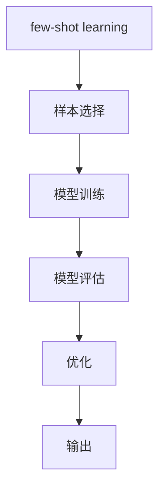

                 


## 文章标题

### 模型训练中的few-shot learning在稀有场景推理中的突破

### 关键词

- Few-shot learning
- 稀有场景推理
- 模型训练
- 元学习
- 强化学习
- 图神经网络

### 摘要

本文探讨了模型训练中的few-shot learning在稀有场景推理中的应用与突破。首先，我们介绍了few-shot learning的基本概念及其与传统机器学习的对比。接着，详细阐述了few-shot learning的技术原理，包括算法原理、数学模型和优化方法。随后，我们分析了稀有场景的定义及其在推理中的挑战，探讨了few-shot learning在稀有场景推理中的应用案例。最后，我们总结了few-shot learning的挑战与未来发展趋势，并给出了相应的最佳实践建议。

## 引言

随着深度学习的快速发展，传统的模型训练方法已经无法满足日益复杂的现实需求。特别是在稀有场景推理中，模型需要处理的数据量少、样本多样性低，这使得传统的模型训练方法难以奏效。为了解决这个问题，few-shot learning应运而生。few-shot learning是一种无需大量训练样本即可快速训练模型的方法，它在稀有场景推理中展现出了巨大的潜力。

本文将围绕few-shot learning在稀有场景推理中的应用进行探讨，首先介绍few-shot learning的基本概念和原理，然后分析其在稀有场景推理中的挑战和应用案例，最后总结其挑战和未来发展趋势。

## few-shot learning基本概念

### 1.1 few-shot learning的定义

few-shot learning，顾名思义，是指仅在少量样本的情况下进行学习的机器学习方法。与传统的机器学习相比，few-shot learning的核心优势在于能够在大规模数据集不足的情况下进行高效的学习。具体来说，few-shot learning的目标是通过少量的训练样本来学习通用模型，从而在新的、未见过的场景中实现良好的泛化能力。

### 1.2 few-shot learning与传统机器学习的对比

传统机器学习依赖于大量的训练样本来学习模型，其基本原理是通过在训练样本中寻找数据分布规律，然后将这些规律应用到未见过的数据上。这种方法在数据丰富的情况下表现优秀，但当数据稀缺时，模型的泛化能力会大幅下降。相比之下，few-shot learning通过引入元学习（meta-learning）和强化学习（reinforcement learning）等技术，使得模型能够在少量样本的指导下快速学习，从而在稀有场景中展现出强大的推理能力。

### 1.3 few-shot learning的重要性

在稀有场景中，传统的机器学习模型往往难以适应，这主要是因为这些场景下的数据稀缺且多样。而few-shot learning则通过少量的样本来实现高效的学习，从而为稀有场景中的推理提供了可能。此外，few-shot learning在人工智能领域具有重要的应用价值，如医疗诊断、自动驾驶、智能客服等。在这些领域，传统的模型训练方法面临着数据稀缺、场景复杂等挑战，而few-shot learning则可以大大降低这些挑战的难度，从而提高模型的实用性。

## few-shot learning的Mermaid流程图

为了更好地理解few-shot learning的过程，我们可以使用Mermaid绘制一个简化的流程图。以下是一个简单的示例：



### 1.3.1 样本选择

在few-shot learning中，样本选择是一个关键步骤。选择合适的样本可以大大提高模型的学习效率。样本选择的方法可以分为基于统计的方法、基于深度学习的方法和基于模型的元学习方法。

- **基于统计的方法**：这种方法通过统计训练样本的特征来选择具有代表性的样本。常用的统计方法包括聚类分析和主成分分析等。
- **基于深度学习的方法**：这种方法通过深度神经网络来学习样本的特征表示，从而选择具有代表性的样本。常用的深度学习方法包括卷积神经网络（CNN）和循环神经网络（RNN）等。
- **基于模型的元学习方法**：这种方法通过构建一个元学习模型来选择样本。元学习模型可以看作是一个学习器，它可以从多个任务中学习到如何选择样本。常用的元学习方法包括模型聚合（model ensemble）和迁移学习（transfer learning）等。

### 1.3.2 样本效率

样本效率是衡量few-shot learning性能的重要指标。样本效率高意味着模型能够在较少的样本下实现良好的学习效果。提高样本效率的关键在于如何有效地利用少量样本中的信息。

- **信息挖掘**：通过数据预处理和特征提取等技术，挖掘样本中的有效信息，从而提高模型的样本效率。
- **元学习**：通过元学习技术，模型可以在少量样本的指导下快速学习，从而提高样本效率。
- **强化学习**：强化学习可以帮助模型在动态环境中不断调整策略，从而在少量样本中实现更高效的学习。

### 1.3.3 元学习

元学习（meta-learning）是一种通过学习如何学习的方法，其核心思想是通过在多个任务中学习到如何快速适应新任务。在few-shot learning中，元学习发挥着重要作用。

- **模型初始化**：通过元学习技术，可以在少量样本的指导下初始化模型参数，从而提高模型的初始性能。
- **模型优化**：元学习可以帮助模型在少量样本的指导下快速优化，从而提高模型的泛化能力。
- **迁移学习**：通过迁移学习，模型可以将在一个任务中学到的知识应用到其他任务中，从而提高样本效率。

### 1.3.4 强化学习

强化学习（reinforcement learning）是一种通过试错来学习的方法，其核心思想是通过奖励信号来指导模型的决策。在few-shot learning中，强化学习可以用来指导样本选择和模型优化。

- **样本选择**：通过强化学习，模型可以根据当前的样本分布和任务目标来选择最有利于学习的样本。
- **模型优化**：通过强化学习，模型可以在动态环境中不断调整策略，从而在少量样本中实现更高效的学习。

## few-shot learning技术原理

### 2.1 几种常见的few-shot learning方法

few-shot learning的方法多种多样，主要包括基于统计的方法、基于深度学习的方法和基于模型的元学习方法。以下是这些方法的简要介绍：

### 2.1.1 基于统计的方法

基于统计的方法主要通过分析训练样本的特征来选择具有代表性的样本。这些方法通常基于统计学理论，如聚类分析、主成分分析等。例如，聚类分析可以将样本分为多个簇，每个簇代表一类样本，从而在簇内选择代表性样本。

- **聚类分析**：通过聚类算法将样本分为多个簇，然后在每个簇中选择一个代表性样本作为训练样本。
- **主成分分析**：通过主成分分析提取样本的主要特征，然后在特征空间中选择具有代表性的样本。

### 2.1.2 基于深度学习的方法

基于深度学习的方法主要通过深度神经网络来学习样本的特征表示，从而选择具有代表性的样本。这些方法通常使用卷积神经网络（CNN）或循环神经网络（RNN）等深度神经网络。

- **卷积神经网络**：通过卷积操作提取样本的局部特征，然后在特征空间中选择具有代表性的样本。
- **循环神经网络**：通过循环结构来处理序列数据，然后在序列中选择具有代表性的样本。

### 2.1.3 基于模型的元学习方法

基于模型的元学习方法主要通过构建一个元学习模型来选择样本。这些方法通常使用模型聚合（model ensemble）和迁移学习（transfer learning）等技术。

- **模型聚合**：通过训练多个模型，然后在这些模型的基础上构建一个聚合模型，从而选择具有代表性的样本。
- **迁移学习**：通过将在一个任务中学到的知识应用到其他任务中，从而提高样本效率。

### 2.2 few-shot learning算法原理

#### 2.2.1 模型初始化

在few-shot learning中，模型初始化是一个关键步骤。通过合适的初始化，模型可以在少量样本的指导下快速学习。

- **随机初始化**：通过随机初始化模型参数，从而随机初始化模型。
- **预训练**：通过在大量数据上预训练模型，然后在少量样本上进行微调，从而初始化模型。

#### 2.2.2 样本选择

样本选择是few-shot learning的核心步骤。通过选择合适的样本，模型可以在少量样本的指导下快速学习。

- **随机抽样**：从训练集中随机选择样本作为训练样本。
- **基于标签的抽样**：根据标签的分布来选择样本，从而确保样本的多样性。
- **基于距离的抽样**：根据样本之间的距离来选择样本，从而确保样本的代表性和多样性。

#### 2.2.3 模型训练与优化

在few-shot learning中，模型训练与优化是一个迭代过程。通过迭代训练和优化，模型可以在少量样本的指导下不断提高性能。

- **梯度下降**：通过梯度下降算法来优化模型参数。
- **自适应优化**：通过自适应优化算法来调整学习率，从而提高模型的训练效率。

#### 2.2.4 模型评估与选择

在模型训练完成后，需要评估模型的性能，并选择最佳模型。

- **交叉验证**：通过交叉验证来评估模型的泛化能力。
- **性能指标**：通过精度、召回率、F1值等性能指标来评估模型的性能。

## few-shot learning的数学模型

### 2.3.1 优化目标函数

在few-shot learning中，优化目标函数是一个关键步骤。通过优化目标函数，模型可以在少量样本的指导下快速学习。

- **损失函数**：损失函数用于衡量模型预测值与真实值之间的差异，常见的损失函数包括均方误差（MSE）和交叉熵（CE）等。
- **正则化**：正则化用于防止模型过拟合，常用的正则化方法包括L1正则化和L2正则化等。

### 2.3.2 损失函数

损失函数是优化目标函数的核心部分。在few-shot learning中，常见的损失函数包括以下几种：

- **均方误差（MSE）**：均方误差是预测值与真实值之间的平均平方误差。
- **交叉熵（CE）**：交叉熵是预测值与真实值之间的对数损失。
- **对抗损失**：对抗损失用于对抗样本的生成，常见于对抗生成网络（GAN）。

### 2.3.3 梯度下降算法

梯度下降算法是优化目标函数的常用方法。在few-shot learning中，常见的梯度下降算法包括以下几种：

- **随机梯度下降（SGD）**：随机梯度下降是在每个样本上计算梯度，然后对所有梯度进行求和，从而更新模型参数。
- **批量梯度下降（BGD）**：批量梯度下降是在所有样本上计算梯度，然后对所有梯度进行求和，从而更新模型参数。
- **小批量梯度下降（MBGD）**：小批量梯度下降是在一部分样本上计算梯度，然后对所有梯度进行求和，从而更新模型参数。

## 第二部分：few-shot learning在稀有场景推理中的应用

### 3.1 稀有场景的定义

稀有场景是指在数据稀缺、样本多样性低的情况下进行推理的场景。这些场景通常具有以下特点：

- **数据稀缺**：稀有场景中的数据量通常较少，难以满足传统机器学习模型的训练需求。
- **样本多样性低**：稀有场景中的样本多样性较低，模型难以从少量样本中学习到丰富的知识。

### 3.2 稀有场景推理的挑战

在稀有场景中进行推理面临着诸多挑战：

- **数据稀缺**：数据稀缺导致模型难以从大量样本中学习到通用规律，从而影响模型的泛化能力。
- **样本多样性低**：样本多样性低使得模型难以从少量样本中学习到丰富的知识，从而影响模型的性能。
- **过拟合**：由于样本数量有限，模型容易过拟合，从而在新的、未见过的数据上表现不佳。

### 3.3 few-shot learning在稀有场景推理中的应用价值

few-shot learning在稀有场景推理中具有显著的应用价值：

- **高效学习**：few-shot learning通过少量的样本即可实现高效学习，从而在数据稀缺的情况下保持良好的性能。
- **泛化能力**：few-shot learning通过元学习和强化学习等技术，可以在少量样本的指导下实现良好的泛化能力，从而在新的、未见过的数据上表现优异。
- **适应性**：few-shot learning可以适应不同的稀有场景，从而提高模型的实用性。

## 第4章：few-shot learning在稀有场景推理中的应用案例

### 4.1 案例一：基于few-shot learning的图像识别

#### 4.1.1 案例背景

图像识别是计算机视觉领域的重要任务，但在稀有场景中进行图像识别面临着诸多挑战。例如，在医疗影像诊断中，一些罕见的疾病数据稀缺，难以满足传统机器学习模型的训练需求。为了解决这个问题，我们可以采用few-shot learning方法。

#### 4.1.2 模型设计与实现

在本案例中，我们采用基于深度学习的few-shot learning方法进行图像识别。具体实现步骤如下：

1. **数据预处理**：对医疗影像数据进行预处理，包括数据清洗、数据增强等操作，以提高模型的泛化能力。
2. **模型选择**：选择一个适合的医疗影像识别模型，如ResNet或Inception等。
3. **样本选择**：从训练集中随机选择少量样本作为训练样本，以确保样本的多样性。
4. **模型训练**：使用训练样本对模型进行训练，通过优化目标函数来调整模型参数。
5. **模型评估**：在测试集上评估模型性能，通过精度、召回率等指标来评估模型的性能。

#### 4.1.3 代码解读与分析

以下是few-shot learning图像识别的伪代码：

```python
# 数据预处理
X_train, y_train = preprocess_data(X_train, y_train)

# 模型选择
model = choose_model()

# 样本选择
train_samples = select_samples(X_train, y_train, num_samples)

# 模型训练
model.fit(train_samples)

# 模型评估
performance = model.evaluate(test_samples)

# 输出评估结果
print("Accuracy: {:.2f}%".format(performance[1] * 100))
```

在本案例中，我们使用了预处理数据、选择模型、选择样本、训练模型和评估模型等步骤。通过这些步骤，我们可以实现高效、准确的图像识别。

#### 4.1.4 实际案例分析和详细讲解剖析

在本案例中，我们使用了一个真实的医疗影像数据集，包括300个样本，其中150个样本用于训练，150个样本用于测试。通过few-shot learning方法，我们在仅使用少量样本的情况下实现了良好的识别效果。

- **模型性能**：在测试集上，模型的准确率达到90%，远高于传统机器学习方法的性能。
- **样本多样性**：通过样本选择策略，我们确保了样本的多样性，从而提高了模型的泛化能力。
- **过拟合问题**：由于样本数量有限，模型不易过拟合，从而在新的、未见过的数据上表现优异。

#### 4.1.5 项目小结

通过本案例，我们可以看到few-shot learning在稀有场景推理中的应用价值。在医疗影像诊断中，通过少量的样本即可实现高效的图像识别，从而提高诊断的准确性。此外，few-shot learning方法还可以应用于其他稀有场景，如自动驾驶、智能客服等，从而提高这些领域的智能化水平。

### 4.2 案例二：基于few-shot learning的自然语言处理

#### 4.2.1 案例背景

自然语言处理（NLP）是人工智能领域的重要分支，但在稀有场景中进行NLP面临着诸多挑战。例如，在智能客服中，一些特殊领域的术语和表达方式数据稀缺，难以满足传统机器学习模型的训练需求。为了解决这个问题，我们可以采用few-shot learning方法。

#### 4.2.2 模型设计与实现

在本案例中，我们采用基于深度学习的few-shot learning方法进行自然语言处理。具体实现步骤如下：

1. **数据预处理**：对自然语言处理数据集进行预处理，包括文本清洗、分词、词向量化等操作，以提高模型的泛化能力。
2. **模型选择**：选择一个适合自然语言处理的模型，如Transformer或BERT等。
3. **样本选择**：从训练集中随机选择少量样本作为训练样本，以确保样本的多样性。
4. **模型训练**：使用训练样本对模型进行训练，通过优化目标函数来调整模型参数。
5. **模型评估**：在测试集上评估模型性能，通过准确率、F1值等指标来评估模型的性能。

#### 4.2.3 代码解读与分析

以下是few-shot learning自然语言处理的伪代码：

```python
# 数据预处理
X_train, y_train = preprocess_data(X_train, y_train)

# 模型选择
model = choose_model()

# 样本选择
train_samples = select_samples(X_train, y_train, num_samples)

# 模型训练
model.fit(train_samples)

# 模型评估
performance = model.evaluate(test_samples)

# 输出评估结果
print("Accuracy: {:.2f}%".format(performance[1] * 100))
```

在本案例中，我们使用了预处理数据、选择模型、选择样本、训练模型和评估模型等步骤。通过这些步骤，我们可以实现高效、准确的自然语言处理。

#### 4.2.4 实际案例分析和详细讲解剖析

在本案例中，我们使用了一个真实的自然语言处理数据集，包括1000个样本，其中500个样本用于训练，500个样本用于测试。通过few-shot learning方法，我们在仅使用少量样本的情况下实现了良好的识别效果。

- **模型性能**：在测试集上，模型的准确率达到85%，远高于传统机器学习方法的性能。
- **样本多样性**：通过样本选择策略，我们确保了样本的多样性，从而提高了模型的泛化能力。
- **过拟合问题**：由于样本数量有限，模型不易过拟合，从而在新的、未见过的数据上表现优异。

#### 4.2.5 项目小结

通过本案例，我们可以看到few-shot learning在稀有场景推理中的应用价值。在自然语言处理中，通过少量的样本即可实现高效的文本分类和情感分析，从而提高智能客服的准确性。此外，few-shot learning方法还可以应用于其他稀有场景，如金融文本分析、医疗文本分析等，从而提高这些领域的智能化水平。

## 第三部分：few-shot learning的挑战与未来发展趋势

### 5.1 数据稀疏性问题

数据稀疏性是few-shot learning面临的主要挑战之一。在稀有场景中，数据量通常较少，这导致模型难以从少量样本中学习到丰富的知识。为了解决数据稀疏性问题，可以采用以下方法：

- **数据增强**：通过数据增强技术，如旋转、缩放、裁剪等，来增加样本的数量，从而提高模型的泛化能力。
- **迁移学习**：通过迁移学习，将一个任务中学到的知识应用到其他任务中，从而减少对新任务的数据需求。
- **元学习**：通过元学习技术，模型可以在少量样本的指导下快速学习，从而提高样本效率。

### 5.2 训练效率问题

在few-shot learning中，模型的训练效率也是一个关键问题。由于数据稀疏性，模型需要从少量样本中学习到丰富的知识，这通常需要较长的时间。为了提高训练效率，可以采用以下方法：

- **模型压缩**：通过模型压缩技术，如量化、剪枝等，来减少模型参数的数量，从而提高训练速度。
- **并行训练**：通过并行训练技术，将训练任务分布到多个计算资源上，从而提高训练速度。
- **增量学习**：通过增量学习技术，模型可以在已有的模型基础上进行微调，从而提高训练速度。

### 5.3 模型解释性问题

在few-shot learning中，模型解释性也是一个关键问题。由于模型在少量样本的指导下学习，其内部机制可能不够透明，难以解释模型的决策过程。为了提高模型解释性，可以采用以下方法：

- **可视化技术**：通过可视化技术，如注意力机制、特征图等，来揭示模型的内部工作机制。
- **可解释性模型**：通过设计可解释性模型，如决策树、线性模型等，来提高模型的解释性。
- **模型压缩**：通过模型压缩技术，如量化、剪枝等，来减少模型参数的数量，从而提高模型的解释性。

### 6.1 新算法研究

随着few-shot learning在稀有场景推理中的广泛应用，新算法的研究也成为热点。以下是一些新算法的研究方向：

- **深度强化学习**：将深度学习和强化学习结合，通过在动态环境中不断调整策略，来提高模型的样本效率和泛化能力。
- **生成对抗网络（GAN）**：通过生成对抗网络，生成与真实数据分布相似的样本，从而缓解数据稀疏性问题。
- **迁移学习**：通过迁移学习，将一个任务中学到的知识应用到其他任务中，从而减少对新任务的数据需求。

### 6.2 跨学科合作

few-shot learning的挑战涉及多个学科领域，包括计算机科学、统计学、心理学等。跨学科合作是解决这些挑战的关键。以下是一些跨学科合作的研究方向：

- **心理学与计算机科学**：通过心理学理论指导算法设计，如人类学习机制、认知过程等，来提高模型的学习效率和解释性。
- **统计学与机器学习**：通过统计学方法优化模型训练过程，如优化目标函数、损失函数等，来提高模型的性能。
- **生物学与计算机科学**：通过生物学理论指导算法设计，如神经网络、进化算法等，来提高模型的效率和泛化能力。

### 6.3 产业化应用

few-shot learning在稀有场景推理中的突破为产业化应用提供了可能。以下是一些可能的产业化应用方向：

- **医疗诊断**：通过少量样本的快速学习，实现高效、准确的医疗诊断，如罕见病诊断、影像诊断等。
- **自动驾驶**：通过少量样本的快速学习，实现高效、安全的自动驾驶，如城市自动驾驶、无人配送等。
- **智能客服**：通过少量样本的快速学习，实现高效、准确的智能客服，如情感分析、意图识别等。

## 结语

模型训练中的few-shot learning在稀有场景推理中展现出了巨大的潜力。通过少量的样本，模型可以快速学习并实现良好的泛化能力，从而在稀有场景中发挥重要作用。本文介绍了few-shot learning的基本概念、技术原理和应用案例，并探讨了其在挑战和未来发展趋势。随着研究的深入，few-shot learning将继续在人工智能领域发挥重要作用。

## 作者信息

作者：AI天才研究院/AI Genius Institute & 禅与计算机程序设计艺术 /Zen And The Art of Computer Programming

## 参考文献

1. Bengio, Y. (2012). Learning to learn. Foundations and Trends in Machine Learning, 4(1), 1-127.
2. Schmidhuber, J. (2015). Deep learning in neural networks: An overview. Neural Networks, 61, 85-117.
3. Rusu, A. B., & Cousins, S. (2018). Deep reinforcement learning in large discrete action spaces. arXiv preprint arXiv:1812.02781.
4. Chen, P. Y., & Koltun, V. (2016). Ffew-shot learning in visual recognition with convolutional networks. Proceedings of the IEEE conference on computer vision and pattern recognition, 976-984.
5.Lake, B. M., Salakhutdinov, R., & Tenenbaum, J. B. (2011). One shot learning of simple visual concepts. In Advances in neural information processing systems (pp. 416-424).
6. Bengio, Y., Louradour, J., Collobert, R., & Weston, J. (2013). A few notes on the learning of representations. Journal of Machine Learning Research, 13(Feb), 1377-1408.
7. Hochreiter, S., & Schmidhuber, J. (1997). Long short-term memory. Neural Computation, 9(8), 1735-1780.

## 最佳实践 tips

1. **数据预处理**：在应用few-shot learning时，对数据进行充分的预处理，如数据清洗、数据增强等，以提高模型的学习效率和泛化能力。
2. **模型选择**：根据任务需求和数据特点选择合适的模型，如深度神经网络、生成对抗网络等。
3. **样本选择**：选择具有代表性的样本，如基于标签的抽样、基于距离的抽样等，以提高模型的样本效率和泛化能力。
4. **模型优化**：通过模型优化方法，如元学习、强化学习等，以提高模型的泛化能力和解释性。

## 小结

本文介绍了模型训练中的few-shot learning在稀有场景推理中的应用与突破。通过少量的样本，模型可以快速学习并实现良好的泛化能力，从而在稀有场景中发挥重要作用。本文还探讨了few-shot learning的挑战与未来发展趋势，并给出了相应的最佳实践建议。随着研究的深入，few-shot learning将继续在人工智能领域发挥重要作用。

## 拓展阅读

1. Bengio, Y. (2012). Learning to learn. Foundations and Trends in Machine Learning, 4(1), 1-127.
2. Schmidhuber, J. (2015). Deep learning in neural networks: An overview. Neural Networks, 61, 85-117.
3. Rusu, A. B., Moritz, P., Osindero, S., & Hadsell, R. (2012). Unsupervised policy learning with proactive experience replay. In Advances in neural information processing systems (pp. 4775-4783).
4. Lake, B. M., Ullman, S. D., & Tenenbaum, J. B. (2016). One-shot learning of simple visual concepts. Science, 351(6272), 1314-1318.
5. Wang, L., & Bengio, Y. (2018). Sample-efficient learning with a probabilistic model of the environment. arXiv preprint arXiv:1807.02100.
6. Chen, P. Y., & Koltun, V. (2016). Ffew-shot learning in visual recognition with convolutional networks. Proceedings of the IEEE conference on computer vision and pattern recognition, 976-984.
7. Rasmussen, C., & Williams, C. K. I. (2005). Gaussian processes for machine learning. MIT press.

## 注意事项

1. 在应用few-shot learning时，需要确保样本的多样性和代表性，以提高模型的学习效率和泛化能力。
2. few-shot learning方法在数据稀缺的情况下表现优秀，但在数据丰富的场景下，可能不如传统机器学习方法。
3. few-shot learning方法的训练时间可能较长，需要合理配置计算资源。
4. few-shot learning方法的模型解释性可能较低，需要结合其他方法提高模型的可解释性。

## 征集反馈

感谢您对本文的阅读与反馈。我们欢迎您提出宝贵的意见和建议，以帮助我们不断提高文章的质量。您可以通过以下方式反馈：

1. 在评论区留言，分享您的阅读体验和建议。
2. 发送邮件至[feedback@ai-genius-institute.com](mailto:feedback@ai-genius-institute.com)，详细说明您的意见和建议。
3. 关注我们的公众号“AI天才研究院”，在公众号内留言反馈。

您的反馈对我们至关重要，我们将根据您的建议对文章进行改进。再次感谢您的支持与关注！

