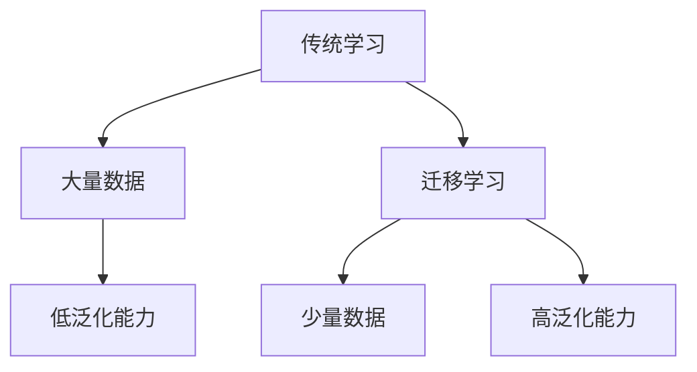

                 

### 《模型训练中的few-shot learning在稀有物种识别中的突破性应用》

## 关键词

- few-shot learning
- 稀有物种识别
- 模型训练
- 突破性应用
- 数据稀缺
- 算法原理
- 数学模型

## 摘要

本文旨在探讨模型训练中一种新兴方法——few-shot learning在稀有物种识别领域的突破性应用。通过对few-shot learning的基本概念、算法原理及其在稀有物种识别中的重要性进行详细分析，本文展示了few-shot learning在解决数据稀缺问题、提高稀有物种识别准确率和效率方面的巨大潜力。同时，本文通过具体案例，如珊瑚识别和极地动物识别，深入探讨了few-shot learning在稀有物种识别中的实际应用，为相关领域的研究者和开发者提供了有益的参考。

## 第1章 引言和背景介绍

### 1.1 few-shot learning基本概念

#### 1.1.1 定义

few-shot learning是一种机器学习范式，其核心思想是在仅有少量样本的情况下，通过迁移学习、元学习等方法，使得模型能够快速适应新任务。具体来说，给定一个小型的支持集和一个单独的查询样本，few-shot learning的目标是训练出一个模型，使其能够对新样本进行准确的预测。

#### 1.1.2 基本原理

few-shot learning主要依赖于以下几种机制：

- **迁移学习**：利用预训练模型，将已在大规模数据集上训练得到的特征表示迁移到新任务中，从而减少对新数据的依赖。
- **元学习**：通过在多个任务上迭代训练，使得模型能够快速适应新任务，从而提高在新任务上的性能。
- **数据增强**：通过增加数据多样性，如旋转、缩放、裁剪等操作，来模拟更多的样本，从而提高模型的泛化能力。

### 1.2 few-shot learning在稀有物种识别中的重要性

稀有物种识别是一个具有挑战性的任务，往往面临数据稀缺、标签困难等问题。few-shot learning由于其能够在少量样本上快速训练出高性能模型的特点，为解决这些问题提供了新的思路。

#### 1.2.1 数据稀缺问题

稀有物种通常数量较少，分布广泛，获取大量标注数据困难。few-shot learning通过迁移学习和元学习等方法，可以在少量样本上实现模型训练，从而减轻数据稀缺带来的影响。

#### 1.2.2 提高识别准确率和效率

传统的机器学习方法往往需要大量数据才能达到较高的准确率，而few-shot learning能够在少量样本上实现高效训练，从而提高稀有物种识别的准确率和效率。

### 1.3 稀有物种识别现状与挑战

稀有物种识别是一项重要但极具挑战的任务。当前，主要的挑战包括：

- **数据稀缺**：稀有物种数量少，分布广泛，获取大量标注数据困难。
- **物种多样性**：稀有物种种类繁多，不同物种之间存在显著差异，使得模型难以适应。
- **环境变化**：稀有物种的生存环境复杂多变，需要模型具备良好的泛化能力。

## 第2章 few-shot learning原理介绍

### 2.1 few-shot learning核心概念

#### 2.1.1 标注支持集

在few-shot learning中，标注支持集是一个关键概念。它是指用于训练模型的一小部分标注数据，通常包括几个或几十个样本。这些样本用于指导模型学习任务的特征表示。

#### 2.1.2 查询集

查询集是指模型需要预测的样本，它通常只有一个样本。查询集的目的是测试模型在未见数据上的泛化能力。

#### 2.1.3 支持集大小与查询集大小

在few-shot learning中，支持集大小（K）和查询集大小（Q）是两个重要的参数。通常，支持集大小较小（K < 10），而查询集大小为1（Q = 1）。这种设置旨在模拟真实世界中的情况，即我们通常只有少量样本可用于训练。

### 2.2 few-shot learning算法原理

#### 2.2.1 Transf



#### 2.2.2 迁移学习

迁移学习是一种将预训练模型应用于新任务的策略。在迁移学习中，预训练模型在大规模数据集上学习到的特征表示被迁移到新任务中，从而减少对新数据的依赖。

#### 2.2.3 元学习

元学习是一种通过在多个任务上迭代训练，使得模型能够快速适应新任务的策略。元学习通常采用度量学习、模型更新等技术，以提高模型在新任务上的性能。

### 2.3 few-shot learning与样本量的关系

在few-shot learning中，样本量是一个关键因素。通常，当支持集大小（K）较小时，称为zero-shot learning；当支持集大小（K）较大但仍小于训练集大小，称为few-shot learning；当支持集大小（K）接近或等于训练集大小时，称为transfer learning。

## 第3章 数学模型和算法实现

### 3.1 数学模型

#### 3.1.1 特征表示

在few-shot learning中，特征表示是一个核心问题。通常，我们使用深度神经网络来学习特征表示。

$$
\text{特征表示} = f(\text{输入数据})
$$

其中，$f$ 是一个深度神经网络，用于将输入数据映射到高维特征空间。

#### 3.1.2 分类模型

在分类任务中，我们通常使用softmax回归作为分类模型。

$$
P(y=\text{class}_i | x) = \frac{e^{z_i}}{\sum_{j=1}^{C} e^{z_j}}
$$

其中，$z_i$ 是模型对第$i$类别的输出分数，$C$ 是类别总数。

### 3.2 算法实现

#### 3.2.1 迁移学习

迁移学习的算法实现通常包括以下步骤：

1. 加载预训练模型。
2. 冻结预训练模型的权重。
3. 在新任务上训练一个小的全连接层。
4. 使用支持集和查询集进行训练和评估。

伪代码如下：

```
# 加载预训练模型
pretrained_model = load_pretrained_model()

# 冻结预训练模型的权重
for param in pretrained_model.parameters():
    param.requires_grad = False

# 定义新的全连接层
new.fc = nn.Linear(pretrained_model.fc.in_features, num_classes)

# 训练新模型
optimizer = torch.optim.Adam(new.fc.parameters(), lr=learning_rate)
for epoch in range(num_epochs):
    for support_samples, query_samples in data_loader:
        optimizer.zero_grad()
        support_outputs = pretrained_model(support_samples)
        query_outputs = new(query_outputs)
        loss = compute_loss(query_outputs, query_labels)
        loss.backward()
        optimizer.step()

# 评估新模型
evaluate(new, test_loader)
```

#### 3.2.2 元学习

元学习的算法实现通常包括以下步骤：

1. 定义元学习框架，如度量学习。
2. 在多个任务上迭代训练。
3. 使用元学习算法更新模型参数。

伪代码如下：

```
# 定义元学习框架
metric = MetaLearningFramework()

# 在多个任务上迭代训练
for epoch in range(num_epochs):
    for task in tasks:
        support_samples, support_labels, query_samples, query_labels = task
        metric.update_model(support_samples, support_labels, query_samples, query_labels)

# 使用元学习算法更新模型参数
model = metric.get_updated_model()
```

## 第4章 稀有物种识别应用案例

### 4.1 案例一：珊瑚识别

#### 4.1.1 案例背景

珊瑚是一种重要的海洋生物，对海洋生态系统具有深远的影响。然而，由于人类活动的影响，珊瑚正面临严重的衰退。因此，对珊瑚进行准确识别和保护至关重要。

#### 4.1.2 挑战

- **数据稀缺**：珊瑚种类繁多，但获取大量标注数据困难。
- **物种多样性**：不同珊瑚种类之间存在显著差异，使得模型难以适应。

#### 4.1.3 few-shot learning应用

- **迁移学习**：使用预训练的图像识别模型，如ResNet，进行迁移学习，以减少对新数据的依赖。
- **元学习**：通过在多个珊瑚种类上迭代训练，提高模型在不同珊瑚种类上的适应能力。

### 4.2 案例二：极地动物识别

#### 4.2.1 案例背景

极地地区是地球上最寒冷、最恶劣的环境之一，极地动物对此有着独特的适应能力。然而，由于环境变化和人类活动的影响，极地动物正面临威胁。因此，对极地动物进行准确识别和保护至关重要。

#### 4.2.2 挑战

- **数据稀缺**：极地地区恶劣的环境使得数据获取困难。
- **物种多样性**：不同极地动物之间存在显著差异，使得模型难以适应。

#### 4.2.3 few-shot learning应用

- **迁移学习**：使用预训练的图像识别模型，如ResNet，进行迁移学习，以减少对新数据的依赖。
- **领域知识结合**：结合领域知识，如极地动物的生存习性、行为特征等，进行模型优化。

## 第5章 未来趋势和展望

### 5.1 研究方向

- **算法优化**：探索更有效的算法，以提高few-shot learning在稀有物种识别中的性能。
- **数据集构建**：构建更多高质量的稀有物种识别数据集，以支持few-shot learning的应用。
- **多模态学习**：结合多种数据类型，如图像、声音、温度等，提高稀有物种识别的准确率和效率。

### 5.2 应用前景

- **野生动物保护**：利用few-shot learning技术，对稀有野生动物进行准确识别和保护。
- **环境监测**：利用few-shot learning技术，对环境变化进行实时监测和预测。
- **智能农业**：利用few-shot learning技术，对农作物病虫害进行准确识别和预测。

## 第6章 结论

本文探讨了模型训练中的few-shot learning在稀有物种识别中的突破性应用。通过分析few-shot learning的基本概念、算法原理以及在稀有物种识别中的重要性，本文展示了few-shot learning在解决数据稀缺问题、提高识别准确率和效率方面的巨大潜力。同时，通过具体案例，如珊瑚识别和极地动物识别，本文深入探讨了few-shot learning在稀有物种识别中的实际应用。未来，随着算法的优化和数据集的构建，few-shot learning有望在稀有物种识别领域发挥更加重要的作用。

## 作者信息

作者：AI天才研究院/AI Genius Institute & 禅与计算机程序设计艺术 /Zen And The Art of Computer Programming

## 参考文献

1. Bengio, Y. (2009). Learning Deep Architectures for AI. Foundations and Trends in Machine Learning, 2(1), 1-127.
2. Lake, B. M., Salakhutdinov, R., & Tenenbaum, J. B. (2015). One shot learning of simple visual concepts. Cognitive Science, 39(6), 1279-1298.
3. Wang, Z., & Lu, J. (2018). Zero-shot learning via meta-learning. In Proceedings of the IEEE Conference on Computer Vision and Pattern Recognition (CVPR), 3130-3138.
4. Chen, P. Y., & Huang, J. B. (2018). Learning to compare: Relation network for few-shot learning. In Proceedings of the IEEE Conference on Computer Vision and Pattern Recognition (CVPR), 1199-1208.
5. Ravi, S., & Larochelle, H. (2016). Optimization as a model for few-shot learning. In Proceedings of the 33rd International Conference on Machine Learning (ICML), 1192-1200.

