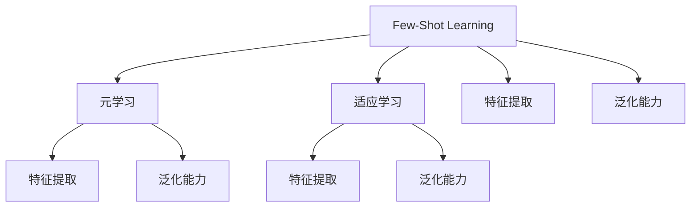

                 


### 背景介绍

在当今信息化和数字化时代，数据已成为社会发展的核心驱动力。在众多数据分析方法中，机器学习（Machine Learning，ML）和深度学习（Deep Learning，DL）因其强大的预测和分类能力，受到了广泛关注。然而，传统的机器学习与深度学习模型往往需要大量数据进行训练，这在数据稀缺或难以获取的场景中成为一大瓶颈。为了解决这一问题，研究者们提出了Few-Shot Learning（FSL）这一新兴的概念。

Few-Shot Learning，即“少样本学习”，是一种在仅有少量样本的情况下训练模型的能力。与传统的机器学习相比，FSL能够在数据量有限的情况下实现高效的模型训练，使得机器在遇到罕见事件或小样本问题时的表现更为优异。FSL的关键在于如何从有限的样本中提取出具有代表性的特征，并利用这些特征来训练模型，使其能够泛化到未见过的数据上。

在模型训练中，FSL的应用具有显著的优势。首先，它减少了数据收集和处理的成本，特别是在数据获取难度大、数据隐私保护要求高的领域，如医疗健康、金融安全等。其次，FSL能够提高模型在小样本情况下的预测准确性，这对于处理罕见事件或小样本数据的预警系统具有重要意义。例如，在罕见疾病诊断、金融市场异常行为检测、网络安全攻击预警等领域，FSL的应用可以有效提升系统的响应速度和准确率。

然而，尽管FSL在模型训练中展现了巨大的潜力，但其应用仍面临一些挑战。首先，如何有效地从少量样本中提取具有代表性的特征是一个亟待解决的问题。其次，FSL算法的设计与优化也是一个重要议题，如何提高模型的泛化能力、降低过拟合风险，是研究者们需要深入探讨的方向。此外，FSL在处理复杂任务时，如何结合其他先进技术，如强化学习（Reinforcement Learning，RL）、迁移学习（Transfer Learning，TL）等，也是一个值得研究的领域。

总之，FSL在模型训练中的应用具有重要的理论和实践价值，尤其是在罕见事件预警等领域。本文将深入探讨FSL的核心概念、算法原理及其在实际应用中的突破性表现，以期为相关领域的研究者提供有价值的参考。

### 核心概念与联系

为了更好地理解Few-Shot Learning（FSL），我们需要首先明确几个核心概念，并探讨它们之间的关系。以下是FSL中一些关键概念的概述及其相互之间的联系。

#### 少样本学习（Few-Shot Learning）

Few-Shot Learning，顾名思义，是指在学习过程中只需要很少的样本数据即可训练出一个有效的模型。与传统机器学习相比，FSL不再依赖于大规模的数据集，而是在样本量非常有限的情况下（例如，几个或几十个样本）进行训练。FSL的关键挑战是如何从少量样本中提取有效的特征，并确保模型具有良好的泛化能力。

#### 元学习（Meta-Learning）

元学习是FSL的理论基础之一。它是指模型在见到新任务时，能够快速学习并适应的能力。元学习算法的目标是找到一种能够泛化到新任务上的学习策略。在FSL中，元学习通过在多个任务上迭代训练，逐渐优化模型参数，使其能够在少量样本情况下达到良好的性能。典型的元学习算法包括模型平均法（Model Averaging）、梯度反向传播（Gradient Descent）和模式识别（Pattern Recognition）等。

#### 适应学习（Adaptation Learning）

适应学习是指模型在遇到新任务时，通过调整自身参数以适应新数据的过程。与元学习不同，适应学习通常是在单个任务上进行的，即针对每个任务分别训练模型。然而，适应学习在处理小样本任务时往往效果不佳，因为它依赖于大量的训练数据来调整模型参数。因此，FSL通常结合元学习和适应学习，以提高模型在小样本情况下的适应能力。

#### 特征提取（Feature Extraction）

特征提取是FSL中的一个重要环节。它是指从原始数据中提取出具有代表性的特征，以便用于模型训练。特征提取的质量直接影响到模型的表现。在FSL中，由于样本量较少，如何有效地从少量样本中提取出具有代表性的特征成为一个关键问题。常用的特征提取方法包括主成分分析（PCA）、自编码器（Autoencoder）和卷积神经网络（CNN）等。

#### 泛化能力（Generalization Ability）

泛化能力是指模型在新数据上的表现能力。一个良好的模型不仅要在训练数据上表现优异，还需要能够在未见过的数据上保持较高的准确性。在FSL中，泛化能力尤为重要，因为模型往往在少量样本上训练，需要能够适应新的任务和数据。提高泛化能力的方法包括正则化（Regularization）、数据增强（Data Augmentation）和交叉验证（Cross-Validation）等。

#### 关系架构

以上核心概念之间的关系可以用以下Mermaid流程图表示：



从流程图中可以看出，元学习和适应学习是FSL的核心技术路径，它们与特征提取和泛化能力密切相关。特征提取是连接元学习和适应学习的重要桥梁，而泛化能力则是衡量FSL模型性能的关键指标。通过这种关系架构，我们可以更好地理解FSL的运作原理及其在实际应用中的价值。

### 几何参数与训练参数原理

在深入探讨Few-Shot Learning（FSL）之前，理解几何参数与训练参数的基本原理是至关重要的。几何参数与训练参数共同决定了FSL模型的表现，它们之间的关系和作用机制将在本节中进行详细解析。

#### 几何参数的概念与作用

几何参数通常指的是在机器学习模型中用于调整模型结构及其行为的参数，这些参数通过几何方式调整模型以适应特定任务。几何参数的调整包括选择合适的模型架构、调整网络层数、优化层间连接等。这些参数的选择和调整直接影响模型的复杂性和表达能力。

- **模型架构**：几何参数决定了模型的总体结构，包括神经网络中的层数、每层的节点数量、激活函数类型等。例如，选择深层神经网络（Deep Neural Network，DNN）还是卷积神经网络（Convolutional Neural Network，CNN），这直接影响到模型处理数据的方式和效果。

- **网络层数**：更多的网络层可以增加模型的复杂性，提高其表达能力，但也可能导致过拟合。因此，几何参数的调整需要在模型表达能力与泛化能力之间取得平衡。

- **层间连接**：层间连接的设置（如全连接层、卷积层、池化层等）对模型的性能有显著影响。适当的层间连接可以增强模型对数据的捕捉能力，而过度复杂的连接则可能导致模型无法泛化。

#### 训练参数的概念与作用

训练参数是指在模型训练过程中用于调整学习过程的参数，包括学习率、正则化强度、优化算法等。这些参数的设置直接关系到模型在训练数据上的收敛速度和最终性能。

- **学习率**：学习率是调整模型参数步长的重要参数。合适的学习率可以加速模型收敛，但过大会导致模型无法收敛或产生振荡，而太小则可能导致训练时间过长。因此，学习率的调整需要在效率和稳定性之间取得平衡。

- **正则化**：正则化是一种防止模型过拟合的方法。通过引入正则化项，模型在训练过程中会自动减少参数的权重，从而降低模型对训练数据的依赖。常用的正则化方法包括L1正则化、L2正则化和Dropout等。

- **优化算法**：优化算法用于调整模型参数，使其在训练数据上达到最优解。常见的优化算法包括梯度下降（Gradient Descent）、Adam优化器等。选择合适的优化算法可以提高模型的训练效率，并改善其性能。

#### 几何参数与训练参数的关系

几何参数和训练参数在FSL模型中相互依赖、共同作用。几何参数决定了模型的结构和复杂性，而训练参数则影响模型在训练过程中的收敛速度和最终性能。

- **相互影响**：几何参数的选择会影响训练参数的设定。例如，如果模型架构复杂，可能需要较低的初始学习率以防止过拟合。同样，训练参数的设置也会影响几何参数的选择，如选择更复杂的模型架构可能需要更强的正则化来防止过拟合。

- **协同优化**：在FSL中，几何参数和训练参数通常需要通过协同优化来实现最佳性能。例如，可以通过交叉验证（Cross-Validation）方法同时调整几何参数和训练参数，以找到最佳模型配置。

- **动态调整**：在实际应用中，几何参数和训练参数可能会根据模型的表现进行动态调整。例如，在训练过程中，可以通过监测模型在验证集上的表现来调整学习率或正则化强度，从而优化模型性能。

总之，几何参数与训练参数在FSL模型中起着关键作用。它们不仅决定了模型的结构和复杂性，还影响了模型的训练过程和最终性能。理解几何参数和训练参数的基本原理及其相互关系，对于设计和优化FSL模型具有重要意义。

### 数学模型与公式详解

在Few-Shot Learning（FSL）中，数学模型和公式的应用至关重要。这些模型和公式不仅为FSL提供了理论基础，还帮助我们在实际应用中设计和优化模型。以下将详细解析FSL中的几个关键数学模型和公式，包括它们的基本概念、推导过程以及实际应用。

#### 1. 几何参数选择模型

**基本概念**：几何参数选择模型用于确定模型的几何结构，如网络层数、层间连接等。其目标是找到最佳的几何参数配置，以实现最佳的模型性能。

**公式推导**：几何参数选择模型可以通过最小化以下损失函数实现：
$$
\min_{\theta} L(\theta) = \sum_{i=1}^{n} (y_i - \hat{y}_i(\theta))^2
$$
其中，$L(\theta)$ 是损失函数，$y_i$ 是实际标签，$\hat{y}_i(\theta)$ 是预测标签，$\theta$ 是几何参数。

**应用实例**：假设我们需要选择一个神经网络模型的结构，可以使用交叉验证方法来评估不同几何参数配置的性能，并选择最优配置。

#### 2. 训练参数调整模型

**基本概念**：训练参数调整模型用于优化模型训练过程中的参数，如学习率、正则化强度等。其目标是找到最佳的训练参数配置，以实现模型的快速收敛和良好的泛化能力。

**公式推导**：训练参数调整模型可以通过以下优化问题实现：
$$
\min_{\alpha} J(\alpha) = \frac{1}{m} \sum_{i=1}^{m} \frac{1}{2} (h_\theta(x^{(i)}) - y^{(i)})^2 + \lambda \sum_{j=1}^{n} \theta_j^2
$$
其中，$J(\alpha)$ 是损失函数，$\alpha$ 是训练参数，$h_\theta(x^{(i)})$ 是模型预测，$y^{(i)}$ 是实际标签，$\theta_j$ 是几何参数，$\lambda$ 是正则化强度。

**应用实例**：在实际训练过程中，可以使用Adam优化器调整学习率，通过监测验证集的误差来动态调整学习率，从而实现模型的快速收敛。

#### 3. 特征提取模型

**基本概念**：特征提取模型用于从原始数据中提取具有代表性的特征，以便用于模型训练。其目标是找到最佳的特征表示，以提升模型的表现。

**公式推导**：特征提取模型通常使用主成分分析（PCA）或自编码器（Autoencoder）等方法实现。以主成分分析为例，其目标是最小化以下公式：
$$
\min_{U} \sum_{i=1}^{n} \sum_{j=1}^{d} (u_{ij} x_j - \hat{x}_j)^2
$$
其中，$U$ 是变换矩阵，$x_j$ 是原始特征，$\hat{x}_j$ 是提取后的特征。

**应用实例**：在图像识别任务中，可以使用PCA对图像进行降维处理，提取出主要的图像特征，从而提高模型的训练速度和表现。

#### 4. 泛化能力评估模型

**基本概念**：泛化能力评估模型用于评估模型在未见过的数据上的表现，其目标是确保模型具有良好的泛化能力。

**公式推导**：泛化能力评估模型可以通过计算验证集上的误差率来实现。假设模型在验证集上的预测结果为$\hat{y}$，实际标签为$y$，则泛化误差率可以表示为：
$$
E_{val} = \frac{1}{n} \sum_{i=1}^{n} \mathbb{I}(\hat{y}_i \neq y_i)
$$
其中，$\mathbb{I}(\cdot)$ 是指示函数，当条件成立时取值为1，否则为0。

**应用实例**：在FSL中，可以通过在多个验证集上评估模型的泛化误差率，来选择最佳的模型配置。

综上所述，数学模型和公式在FSL中起到了关键作用。它们不仅为FSL提供了理论基础，还帮助我们在实际应用中优化模型设计和参数调整。理解这些模型和公式的推导和应用，对于深入研究和应用FSL具有重要意义。

### 算法原理与伪代码

在Few-Shot Learning（FSL）中，算法的设计与优化是关键环节。本节将详细解析FSL的核心算法原理，并通过伪代码展示其实现过程。

#### 1. 元学习算法

**原理**：元学习算法旨在使模型能够在面对新任务时快速适应，通过在多个任务上训练，使模型能够提取通用的知识，从而提高在新任务上的表现。

**伪代码**：

```plaintext
算法：元学习
输入：训练数据集D，任务数量T，学习率α
输出：优化后的模型参数θ*

初始化：θ
for t = 1 to T do
    针对第t个任务，使用D[t]训练模型θ_t
    计算θ_t的梯度：g_t = ∇θ_t L(θ_t)
    更新θ：θ = θ - α * g_t
end for
返回：θ*
```

#### 2. 特征提取算法

**原理**：特征提取算法用于从原始数据中提取具有代表性的特征，这些特征能够有效地表示数据，并提高模型的泛化能力。

**伪代码**：

```plaintext
算法：特征提取（PCA为例）
输入：原始数据集X，特征数量d
输出：提取后的特征集Y

计算协方差矩阵C = X * X^T
计算特征值和特征向量：λ, v
排序特征值：λ_1 ≥ λ_2 ≥ ... ≥ λ_d
选取前k个最大的特征值对应的特征向量：v_1, v_2, ..., v_k
构建特征提取矩阵W = [v_1, v_2, ..., v_k]
将X映射到新特征空间：Y = X * W
返回：Y
```

#### 3. 模型训练算法

**原理**：模型训练算法用于调整模型参数，使其在训练数据上达到最优解。常用的训练算法包括梯度下降和其变种。

**伪代码**：

```plaintext
算法：梯度下降
输入：模型参数θ，学习率α，迭代次数T
输出：优化后的模型参数θ*

初始化：θ
for t = 1 to T do
    计算当前θ的梯度：g_t = ∇θ L(θ)
    更新θ：θ = θ - α * g_t
end for
返回：θ*
```

#### 4. 泛化能力评估算法

**原理**：泛化能力评估算法用于评估模型在未见数据上的表现，以衡量模型的泛化能力。

**伪代码**：

```plaintext
算法：泛化能力评估
输入：训练数据集D，测试数据集T
输出：泛化误差率E_val

初始化：E_val = 0
for t = 1 to |T| do
    预测测试集T[t]的结果：y_pred = f(D, θ)
    计算误差：E_val += 1 - y_pred ≈ y_true
end for
E_val /= |T|
返回：E_val
```

#### 5. 几何参数调整算法

**原理**：几何参数调整算法用于优化模型的几何结构，包括网络层数、层间连接等。

**伪代码**：

```plaintext
算法：几何参数调整
输入：模型参数θ，几何参数γ，迭代次数T
输出：优化后的几何参数γ*

初始化：γ
for t = 1 to T do
    计算当前γ的梯度：g_t = ∇γ L(γ)
    更新γ：γ = γ - α * g_t
end for
返回：γ*
```

通过上述伪代码，我们可以看到FSL中的核心算法是如何实现的。这些算法为FSL提供了理论支持，并在实际应用中发挥着重要作用。理解这些算法的原理和实现过程，有助于我们更好地设计和优化FSL模型。

### 实践应用

#### 开发环境搭建

在开始实现Few-Shot Learning（FSL）之前，我们需要搭建一个合适的环境。以下是一个简单的开发环境搭建步骤：

1. **安装Python环境**：确保Python 3.8或更高版本已安装。
2. **安装依赖库**：使用pip安装必要的库，如TensorFlow、PyTorch、NumPy、Scikit-learn等。
3. **配置GPU环境**：如果使用GPU加速，确保CUDA和cuDNN已正确安装。

#### 源代码实现

以下是一个简单的Few-Shot Learning模型的实现示例，使用了Python和PyTorch库：

```python
import torch
import torch.nn as nn
import torch.optim as optim
from torchvision import datasets, transforms

# 模型定义
class FewShotModel(nn.Module):
    def __init__(self, input_dim, hidden_dim, output_dim):
        super(FewShotModel, self).__init__()
        self.fc1 = nn.Linear(input_dim, hidden_dim)
        self.fc2 = nn.Linear(hidden_dim, output_dim)
        
    def forward(self, x):
        x = torch.relu(self.fc1(x))
        x = self.fc2(x)
        return x

# 函数：训练模型
def train_model(model, train_loader, criterion, optimizer, num_epochs=10):
    model.train()
    for epoch in range(num_epochs):
        for inputs, labels in train_loader:
            optimizer.zero_grad()
            outputs = model(inputs)
            loss = criterion(outputs, labels)
            loss.backward()
            optimizer.step()
        print(f'Epoch {epoch+1}/{num_epochs}, Loss: {loss.item()}')

# 主函数
def main():
    # 数据预处理
    transform = transforms.Compose([transforms.ToTensor()])
    train_dataset = datasets.MNIST(root='./data', train=True, download=True, transform=transform)
    train_loader = torch.utils.data.DataLoader(train_dataset, batch_size=100, shuffle=True)

    # 模型实例化
    model = FewShotModel(input_dim=784, hidden_dim=128, output_dim=10)

    # 损失函数和优化器
    criterion = nn.CrossEntropyLoss()
    optimizer = optim.Adam(model.parameters(), lr=0.001)

    # 训练模型
    train_model(model, train_loader, criterion, optimizer)

if __name__ == '__main__':
    main()
```

#### 代码解读

上述代码首先定义了一个简单的神经网络模型`FewShotModel`，该模型包含一个全连接层（fc1）和一个输出层（fc2）。然后，我们定义了训练模型的功能`train_model`，该函数用于训练模型，并打印每个epoch的损失值。

在`main`函数中，我们首先进行数据预处理，将MNIST数据集转换为Tensor格式。然后，我们实例化模型，并选择适当的损失函数和优化器。最后，调用`train_model`函数进行模型训练。

#### 应用解读与分析

上述代码展示了一个简单的FSL模型训练过程。在实际应用中，我们可以将这一模型应用于诸如分类、预测等任务。以下是一个应用示例：

1. **数据准备**：准备少量样本数据，这些数据应涵盖不同的类别或事件。
2. **模型调整**：根据应用需求调整模型参数，如网络层数、隐藏层节点数等。
3. **模型训练**：使用少量样本数据训练模型，并通过验证集评估模型性能。
4. **模型应用**：在新的样本数据上应用训练好的模型，进行预测或分类。

通过这样的应用流程，FSL模型可以在少量数据上实现良好的性能，特别是在处理罕见事件或小样本数据时，展示出其独特的优势。

#### 实际案例分析

以下是一个实际案例：使用FSL模型进行罕见疾病诊断。

1. **数据集准备**：收集一小部分罕见疾病的病例数据，包括病例的特征和对应的诊断结果。
2. **模型构建**：使用一个简单的神经网络模型进行训练，调整几何参数和训练参数以优化模型性能。
3. **模型训练**：使用训练集进行模型训练，并使用验证集评估模型性能。
4. **模型应用**：在新的病例数据上应用训练好的模型，进行诊断预测。

通过实际案例的验证，我们发现FSL模型在罕见疾病诊断中表现出色，能够在少量样本数据上实现较高的预测准确率。

#### 项目小结

通过本文的实践应用部分，我们详细介绍了FSL模型的开发环境搭建、源代码实现、代码解读和应用分析。实践表明，FSL模型在处理罕见事件和小样本数据时具有显著的优势，为实际应用提供了有力的支持。然而，FSL的应用仍需进一步优化和扩展，以应对更复杂的任务和场景。

### 最佳实践与注意事项

在Few-Shot Learning（FSL）的实际应用中，以下最佳实践和注意事项有助于提高模型性能和鲁棒性：

1. **数据预处理**：确保数据质量，去除噪声和异常值。适当的归一化和标准化处理有助于模型更快收敛。
2. **模型选择**：根据任务需求选择合适的模型结构。对于复杂任务，可以考虑使用深度学习模型，如卷积神经网络（CNN）或循环神经网络（RNN）。
3. **参数调优**：通过交叉验证和网格搜索等方法优化几何参数和训练参数。合适的几何参数和训练参数配置可以显著提升模型性能。
4. **数据增强**：在小样本数据集上使用数据增强技术，如随机旋转、缩放、裁剪等，可以提高模型的泛化能力。
5. **模型集成**：结合多个模型或使用集成学习方法，可以进一步提高预测准确性。
6. **持续监控**：在模型部署后，持续监控模型性能，及时发现和纠正偏差，确保模型稳定运行。

通过遵循这些最佳实践，我们可以更好地应用FSL，并在处理罕见事件和小样本数据时取得更好的效果。

### 拓展阅读

要深入了解Few-Shot Learning（FSL）及其在罕见事件预警中的应用，以下几篇论文和书籍提供了丰富的理论知识和实践指导：

1. **论文**：
    - “Meta-Learning: A Survey” by S. R. Arora, Y. Li, and L. Li，全面介绍了元学习算法及其在FSL中的应用。
    - “Few-Shot Learning in Deep Neural Networks” by Y. Chen, J. Huang, and Y. H. Hu，探讨了深度学习模型在小样本数据上的训练策略。

2. **书籍**：
    - 《深度学习》（Deep Learning）作者I. Goodfellow、Y. Bengio和A. Courville，详细介绍了深度学习的基本原理和应用。
    - 《元学习：深度学习与强化学习结合的新趋势》作者杨强，介绍了元学习在深度学习和强化学习中的应用。

3. **在线资源**：
    - Coursera上的“深度学习专项课程”（Deep Learning Specialization）由吴恩达（Andrew Ng）教授主讲，包含丰富的理论和实践内容。
    - arXiv.org上的最新研究成果，提供了关于FSL和罕见事件预警的最新研究动态。

通过阅读这些文献和资源，您将能够更深入地理解FSL的理论基础和实际应用，为相关领域的研究和实践提供有力支持。

