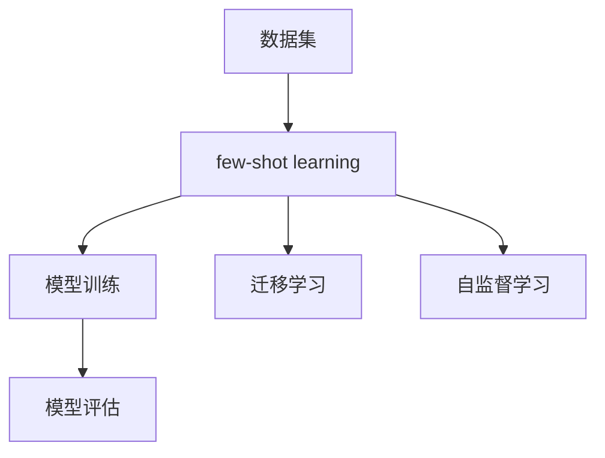

                 


### 文章标题：模型训练中的few-shot learning技术创新

#### 关键词：
- few-shot learning
- 模型训练
- 算法
- 神经网络
- 经验风险最小化

#### 摘要：
本文探讨了模型训练中的一种新兴技术——few-shot learning。通过介绍few-shot learning的基本概念、理论基础、关键算法以及实际应用，本文旨在为读者提供一个全面的视角，了解few-shot learning在人工智能领域的创新和发展。

## 第一部分：背景与概念

### 1.1 few-shot learning的基本概念

**1.1.1 定义与分类**

few-shot learning，又称零样本学习或小样本学习，是指模型能够在仅获得非常有限样本的情况下进行有效训练和泛化。与传统的大数据学习方法相比，few-shot learning在样本量稀缺的情况下展现出了独特的优势。

根据实现方式，few-shot learning可以分为两大类：

1. **基于模型的方法**：这类方法依赖于预训练的模型，通过迁移学习（Transfer Learning）或微调（Fine-Tuning）来适应新的任务。
2. **基于数据的方法**：这类方法依赖于生成或扩充新的数据，以帮助模型在样本量有限的情况下进行学习。

**1.1.2 Few-shot learning与传统学习方法的对比**

传统学习方法的典型代表是批量梯度下降（Batch Gradient Descent），该方法依赖于大量的训练数据来优化模型参数。然而，在样本量有限的情况下，传统方法往往难以达到满意的性能。

few-shot learning的优势在于：

1. **样本效率**：能够在样本量非常有限的情况下进行有效的学习。
2. **泛化能力**：能够从少量样本中学习到更一般的规律，从而提高模型在不同场景下的适应性。

然而，few-shot learning也面临着挑战，例如如何保证模型在少量样本下的泛化能力和鲁棒性。

**1.1.3 Mermaid流程图：few-shot learning的核心概念与联系**

以下是few-shot learning的核心概念与联系Mermaid流程图：



## 第二部分：关键算法与实现

### 2.1 传统few-shot learning算法

在传统few-shot learning算法中，代表性算法有基于KL散度的模型选择方法。

**2.1.1 算法原理**

基于KL散度的模型选择方法通过计算模型预测分布与真实分布之间的KL散度来评估模型的性能。具体步骤如下：

1. 预训练模型
2. 收集少量样本
3. 使用样本对模型进行微调
4. 计算KL散度并选择最小KL散度的模型

**2.1.2 伪代码讲解**

```python
# 伪代码：基于KL散度的模型选择方法
def kl_divergence(p, q):
    # 计算KL散度
    return sum(p * log(p / q) for p, q in zip(p, q))

def fine_tune_model(model, samples):
    # 对模型进行微调
    model.fit(samples)
    return model

def select_best_model(models, samples):
    # 选择最小KL散度的模型
    kl_differences = [kl_divergence(model.predict(samples), samples) for model in models]
    best_model_index = kl_differences.index(min(kl_differences))
    return models[best_model_index]

# 假设已有一个预训练模型列表models和一个样本列表samples
best_model = select_best_model(models, samples)
```

**2.1.3 数学模型与公式**

KL散度公式如下：

$$KL(p || q) = \sum_{i} p_i \log\left(\frac{p_i}{q_i}\right)$$

其中，$p$ 表示预测分布，$q$ 表示真实分布。

## 第三部分：应用与实践

### 3.1 few-shot learning在图像识别中的应用

**3.1.1 应用场景**

在图像识别领域，few-shot learning可以应用于新类别的识别。例如，在仅获得少量新类别样本的情况下，模型需要能够快速适应并准确识别这些新类别。

**3.1.2 实际案例**

以图像分类任务为例，我们可以使用few-shot learning方法来识别一个新类别。以下是一个简单的实现：

```python
# 假设我们有一个预训练的卷积神经网络模型，以及一个新类别的图像数据集

# 加载预训练模型
model = load_pretrained_model()

# 加载新类别的图像数据集
new_class_samples = load_new_class_samples()

# 对模型进行微调
model = fine_tune_model(model, new_class_samples)

# 评估模型在新类别上的性能
accuracy = model.evaluate(new_class_samples)

print(f"新类别识别准确率：{accuracy}")
```

**3.1.3 代码解读**

在上面的代码中，首先加载了一个预训练的卷积神经网络模型，然后加载了一个包含新类别图像的数据集。接下来，使用新类别图像对模型进行微调，并评估模型在新类别上的性能。

## 第四部分：未来展望与挑战

### 4.1 few-shot learning的创新趋势

未来，few-shot learning的发展将集中在以下几个方面：

1. **算法优化**：研究更高效的算法，以减少训练时间和计算成本。
2. **跨领域迁移**：探索跨领域迁移学习方法，使模型能够从一个领域迁移到另一个领域。
3. **自监督学习**：结合自监督学习方法，提高模型在少量样本下的学习能力。

### 4.2 few-shot learning面临的挑战与解决方案

few-shot learning面临的挑战主要包括：

1. **样本稀疏性**：如何从少量样本中提取出有效的信息。
2. **泛化能力**：如何保证模型在少量样本下的泛化能力。

针对这些挑战，可能的解决方案包括：

1. **数据增强**：通过数据增强方法，生成更多样化的样本。
2. **元学习**：利用元学习方法，提高模型在少量样本下的学习能力。

## 小结

few-shot learning作为一种新兴的模型训练技术，在样本量稀缺的情况下展现出了巨大的潜力。通过本文的介绍，读者可以了解到few-shot learning的基本概念、关键算法以及实际应用。未来，随着算法的不断创新，few-shot learning将在人工智能领域发挥越来越重要的作用。

### 作者信息：

作者：AI天才研究院/AI Genius Institute & 禅与计算机程序设计艺术 /Zen And The Art of Computer Programming

