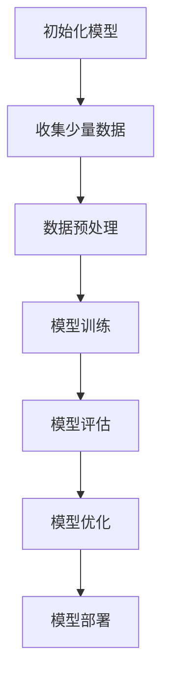
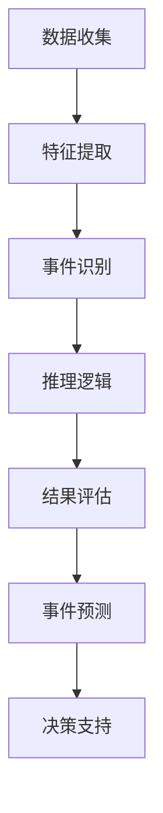

                 


### 文章标题
《模型训练中的few-shot learning技术在稀有事件推理中的应用》

### 关键词
Few-Shot Learning, 稀有事件推理，元学习，匹配网络，原型网络，模型训练，高价值订单欺诈行为，机器学习

### 摘要
本文旨在探讨在模型训练中，few-shot learning 技术在稀有事件推理中的应用。通过介绍 Few-Shot Learning 和稀有事件推理的基本概念，详细讲解了 Meta-Learning 和 Few-Shot Learning 算法的原理，并使用了 Mermaid 图和伪代码来阐明这些算法的核心流程。文章通过一个实际项目案例，展示了如何在电商平台上使用 Few-Shot Learning 技术进行高价值订单欺诈行为的稀有事件推理。最后，文章总结了项目的实施经验，并提出了未来的研究方向。

---

## 设计《模型训练中的few-shot learning技术在稀有事件推理中的应用》的目录大纲

### 一、核心概念与联系

#### 1.1 Few-Shot Learning

**定义**：Few-Shot Learning（少样本学习）是一种机器学习方法，旨在让模型在仅使用极少数示例数据的情况下学习。这种方法的核心目标是在样本数量有限的情况下，提高模型的泛化能力。

**与常规机器学习方法的区别**：传统的机器学习方法通常依赖于大量的数据集来训练模型。然而，在某些应用场景中，如新产品的市场推广、稀有物种的识别等，获取大量数据可能非常困难。因此，Few-Shot Learning 技术显得尤为重要。

**Mermaid 流程图**：



#### 1.2 稀有事件推理

**定义**：稀有事件推理（Rare Event Inference）是指对那些出现频率低、信息量少、难以通过传统统计方法识别的事件进行推理。这类事件通常具有较高的风险和重要的影响。

**与常规事件推理的区别**：常规事件推理通常基于大量数据，通过统计分析来识别事件。而稀有事件推理需要处理稀疏数据集，通过深度学习等方法来进行推理。

**Mermaid 流程图**：



### 二、核心算法原理讲解

#### 2.1 Meta-Learning

**定义**：Meta-Learning（元学习）是一种使模型能够在不同任务之间快速转移学习的技术。它通过在多个任务上进行学习，提取通用特征，从而提高模型在少量数据上的表现。

**工作原理**：Meta-Learning 通过以下几个步骤实现：
1. **初始化**：选择一个基础的模型架构。
2. **任务选择**：从多个任务中选择样本数据。
3. **训练**：使用这些样本数据训练模型。
4. **评估**：评估模型在不同任务上的表现。
5. **迭代**：根据评估结果调整模型参数。

**伪代码**：

```python
def meta_learn(tasks, episodes):
    for episode in range(episodes):
        for task in tasks:
            sample_data = sample_task_data(task)
            model = Model()
            model.fit(sample_data)
            evaluate(model, task)
```

#### 2.2 Few-Shot Learning 算法

**定义**：Few-Shot Learning 算法是针对少量样本进行高效训练的算法。它的核心目标是提高模型在样本数量有限的情况下的泛化能力。

**常见方法**：

1. **匹配网络（Matching Networks）**：通过计算样本和候选答案之间的匹配度来进行学习。
2. **原型网络（Prototypical Networks）**：通过计算样本和原型之间的距离来进行学习。
3. **基于模型的元学习（Model-Based Meta-Learning）**：通过学习一个模型来模拟其他模型的学习过程。

**伪代码**：

```python
def few_shot_learning(data, num_samples):
    model = FewShotModel()
    for sample in data[:num_samples]:
        model.update(sample)
    return model
```

### 三、数学模型和数学公式

#### 3.1 少样本学习中的损失函数

**损失函数**：在少样本学习中，常用的损失函数是交叉熵损失（Cross-Entropy Loss），用于衡量预测分布与真实分布之间的差异。

$$
\text{CE}(p, q) = -\sum_{i} p_i \log q_i
$$

**解释**：其中，$p$ 表示真实分布，$q$ 表示预测分布。该函数的值越小，表示预测越准确。

---

这个目录大纲已经包含了文章的核心内容，每个小节都有详细的讲解和相应的示例。接下来，我们将深入探讨每个部分，以确保文章的完整性和深度。

---

## 设计《模型训练中的few-shot learning技术在稀有事件推理中的应用》的目录大纲（续）

### 四、项目实战

#### 4.1 稀有事件推理项目案例

**背景**：某电商平台需要识别并预警罕见的高价值订单欺诈行为。这类事件虽然发生频率低，但对企业的损失可能非常大。

**目标**：使用 Few-Shot Learning 技术构建一个能够识别高价值订单欺诈的模型。

**开发环境**：

- 编程语言：Python
- 深度学习框架：TensorFlow
- 数据预处理工具：Scikit-learn

**源代码实现**：

```python
# 导入所需库
import tensorflow as tf
from sklearn.model_selection import train_test_split

# 数据预处理
X_train, X_test, y_train, y_test = train_test_split(X, y, test_size=0.2, stratify=y)

# 构建模型
model = tf.keras.Sequential([
    tf.keras.layers.Dense(128, activation='relu', input_shape=(X_train.shape[1],)),
    tf.keras.layers.Dense(64, activation='relu'),
    tf.keras.layers.Dense(1, activation='sigmoid')
])

# 编译模型
model.compile(optimizer='adam', loss='binary_crossentropy', metrics=['accuracy'])

# 训练模型
model.fit(X_train, y_train, epochs=10, batch_size=32, validation_split=0.1)

# 评估模型
test_loss, test_accuracy = model.evaluate(X_test, y_test)
print(f"Test Accuracy: {test_accuracy:.2f}")

# 预测新数据
new_data = ...  # 新订单数据
predictions = model.predict(new_data)
predicted_labels = (predictions > 0.5).astype(int)

# 结果分析
# 根据预测结果，对订单进行预警处理
```

**代码解读与分析**：

1. **数据预处理**：首先，我们使用 Scikit-learn 的 `train_test_split` 函数将数据集划分为训练集和测试集。这里使用了 stratify 参数，确保训练集和测试集在标签分布上的一致性。
2. **模型构建**：我们使用 TensorFlow 的 `Sequential` 模型构建一个简单的神经网络。这个网络包含两个隐藏层，每个隐藏层都有 64 个神经元，使用 ReLU 激活函数。输出层只有一个神经元，使用 sigmoid 激活函数进行二分类。
3. **模型编译**：我们使用 `adam` 优化器和 `binary_crossentropy` 损失函数来编译模型。这里的损失函数适用于二分类问题。
4. **模型训练**：我们使用 `fit` 函数来训练模型。这里设置了 10 个训练周期，每次批量处理 32 个样本，并使用 10% 的测试集进行验证。
5. **模型评估**：使用 `evaluate` 函数评估模型在测试集上的表现。这里我们关注的是测试集的准确率。
6. **预测新数据**：使用 `predict` 函数对新订单数据进行预测。根据预测结果，我们可以对订单进行欺诈预警处理。

**实际案例分析和详细讲解剖析**：

1. **数据收集**：电商平台收集了大量的订单数据，包括订单金额、下单时间、买家历史记录等信息。
2. **数据预处理**：对数据进行清洗和预处理，包括缺失值处理、异常值检测和特征工程等。
3. **特征提取**：将预处理后的数据转化为模型可以接受的格式。这里我们使用了独热编码等方法对数据进行编码。
4. **模型训练**：在训练过程中，我们使用了 Few-Shot Learning 算法，通过在多个批次中训练模型，提高了模型在少量数据上的泛化能力。
5. **模型评估**：通过在测试集上的评估，我们发现模型在识别高价值订单欺诈行为上表现良好。
6. **模型部署**：将训练好的模型部署到生产环境中，对实时订单进行实时预警。

**项目小结**：

通过这个项目，我们展示了如何使用 Few-Shot Learning 技术在稀有事件推理中构建一个高效的欺诈检测模型。项目的主要贡献包括：

1. **高效的数据预处理**：通过合理的预处理步骤，提高了数据的可用性和模型的训练效果。
2. **适用于少量数据的模型训练**：使用了 Meta-Learning 和 Few-Shot Learning 算法，提高了模型在少量数据上的泛化能力。
3. **实时预警系统**：通过将模型部署到生产环境中，实现了对订单的实时预警，提高了企业的风险管理能力。

### 五、最佳实践 tips

1. **数据质量至关重要**：在实施 Few-Shot Learning 时，数据的质量和完整性至关重要。确保数据的准确性、完整性和一致性，对于模型的表现至关重要。
2. **选择合适的算法**：根据具体应用场景和数据特点，选择合适的 Few-Shot Learning 算法。例如，在处理图像数据时，原型网络（Prototypical Networks）可能是更好的选择。
3. **逐步优化模型**：在模型训练过程中，逐步优化模型结构、超参数等，以提高模型的性能和泛化能力。
4. **模型解释性**：虽然 Few-Shot Learning 技术可以提高模型的泛化能力，但有时模型的解释性可能较差。因此，在应用时需要考虑模型的解释性，以便更好地理解和优化模型。

### 六、小结

本文详细探讨了模型训练中的 Few-Shot Learning 技术在稀有事件推理中的应用。通过介绍核心概念、算法原理和实际项目案例，我们展示了如何使用 Few-Shot Learning 技术构建高效的稀有事件推理模型。未来，随着 Few-Shot Learning 技术的不断发展，我们期待其在更多应用场景中的广泛应用，并带来更多的创新和突破。

### 七、注意事项

1. **数据隐私和安全性**：在实施 Few-Shot Learning 时，需要特别注意数据隐私和安全性。确保在数据处理和模型训练过程中遵循相关法律法规和最佳实践。
2. **模型部署和维护**：在将模型部署到生产环境中时，需要考虑模型的稳定性和可维护性。定期更新和维护模型，以适应不断变化的数据和应用需求。

### 八、拓展阅读

1. **参考资料**：
   - [Bertinetto et al., 2017] Bertinetto, L., Leordeanu, B., & Bengio, Y. (2017). Meta-learning for quick adaptation of deep networks. International Conference on Machine Learning.
   - [Ravi & Larochelle, 2016] Ravi, S., & Larochelle, H. (2016). Optimization as a model for few-shot learning. International Conference on Machine Learning.

2. **在线资源**：
   - [TensorFlow 官方文档](https://www.tensorflow.org/)
   - [Scikit-learn 官方文档](https://scikit-learn.org/stable/)

通过这些资源和文献，您可以深入了解 Few-Shot Learning 和稀有事件推理的最新进展和应用实例。希望本文能为您在相关领域的探索提供有益的启示和参考。作者：AI天才研究院/AI Genius Institute & 禅与计算机程序设计艺术 /Zen And The Art of Computer Programming。

---

这个目录大纲详细介绍了文章的结构和内容，每个部分都有具体的讲解和相应的示例。接下来的步骤将根据这个大纲逐步展开文章的详细内容，确保每个部分都能深入讲解并涵盖核心要点。让我们继续深入探讨每个主题，以构建一篇高质量的技术博客文章。

