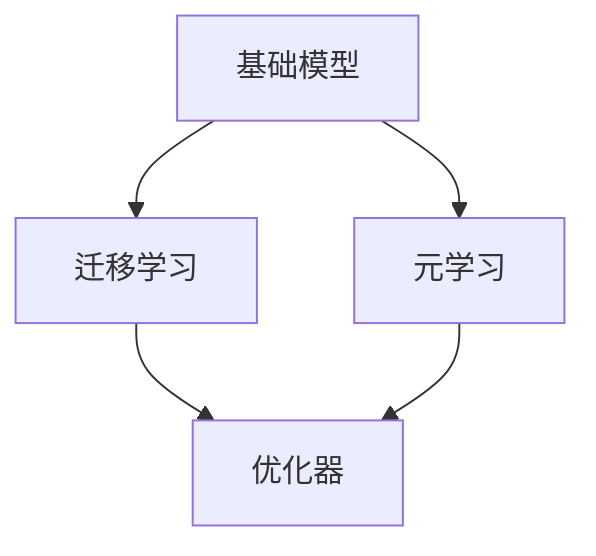

                 

### 文章标题: 模型训练中的few-shot learning策略优化研究

关键词：Few-Shot Learning, 策略优化，模型训练，人工智能，机器学习

摘要：本文深入探讨了模型训练中的一种重要学习策略——Few-Shot Learning，分析了其在实际应用中的重要性。文章首先介绍了Few-Shot Learning的基本概念和原理，然后通过详细的算法讲解、数学模型剖析以及实际项目实战，阐述了如何优化Few-Shot Learning策略，以提高模型训练的效率和准确性。本文旨在为研究人员和实践者提供全面的指导，以更好地理解和应用这一先进的机器学习技术。

### 引言

随着人工智能和机器学习技术的快速发展，模型训练的质量和效率成为了关键的研究课题。传统的模型训练方法通常依赖于大量标注数据，这既耗费资源，又容易受到数据分布不均和数据偏差的影响。然而，在实际应用中，许多场景下的数据获取都是有限的，无法满足大量训练的需求。因此，Few-Shot Learning作为一种重要的学习策略，逐渐引起了广泛关注。

Few-Shot Learning（简称FSL）是指在仅使用少量样本的情况下，使机器学习模型能够快速适应新任务的能力。它不仅能够在数据稀缺的环境下有效工作，还可以提高模型对新领域的泛化能力，从而减少对大量标注数据的依赖。这种策略在医学诊断、自动驾驶、游戏AI等领域具有广泛的应用前景。

本文将从以下几个方面对Few-Shot Learning策略进行深入研究：

1. **核心概念与联系**：详细阐述Few-Shot Learning的概念原理和架构，并使用Mermaid流程图展示。
2. **核心算法原理讲解**：使用伪代码详细阐述几种常见的Few-Shot Learning算法。
3. **数学模型和数学公式讲解**：解释Few-Shot Learning中的数学模型和公式，提供详细的解释和举例。
4. **策略优化**：讨论不同策略的优缺点，以及如何优化这些策略。
5. **项目实战**：提供实际案例，展示Few-Shot Learning策略的实战应用，包括开发环境搭建、源代码实现和解读。
6. **总结与展望**：对全文内容进行总结，并对未来研究方向进行展望。

### 核心概念与联系

#### Few-Shot Learning的定义

Few-Shot Learning是指机器学习模型在仅使用少量样本的情况下，通过迁移学习、元学习等机制，迅速适应新任务的学习能力。它主要针对以下几种场景：

1. **数据稀缺**：在许多实际应用中，获取大量标注数据是非常困难的，例如医疗诊断、生物信息学等领域。
2. **隐私保护**：在某些敏感领域，如金融、军事等，数据无法公开，因此无法进行大量训练。
3. **高效性要求**：在时间紧迫的情况下，如自动驾驶、实时语音识别等，需要快速适应新任务。

#### Few-Shot Learning的架构

Few-Shot Learning的架构主要包括以下几个关键组件：

1. **基础模型**：用于处理大规模数据的预训练模型，如BERT、GPT等。
2. **迁移学习**：将预训练模型的知识迁移到少量样本上，通过调整模型参数来适应新任务。
3. **元学习**：通过多次迭代训练，使模型能够从少量样本中快速学习，提高对新任务的泛化能力。
4. **优化器**：用于调整模型参数，以最小化损失函数。

#### Mermaid流程图展示



在这个流程图中，基础模型通过迁移学习和元学习，逐步调整模型参数，并通过优化器最小化损失函数，从而实现对少量样本的有效学习。

### 核心算法原理讲解

#### 传统Few-Shot Learning算法

**原型网络（Prototypical Networks）**

原型网络是一种基于原型匹配的Few-Shot Learning算法，其主要思想是将新样本与训练集中的原型进行比较，以确定其类别。以下是原型网络的伪代码：

```python
def prototype_network(inputs, num_classes):
    # 输入：inputs为少量样本数据，num_classes为类别数量
    # 输出：输出每个类别的原型
    
    # 预训练模型
    model = pre_train_model(inputs)
    
    # 获取每个类别的原型
    prototypes = []
    for class_index in range(num_classes):
        # 计算类别原型
        prototype = calculate_prototype(model, class_index)
        prototypes.append(prototype)
    
    return prototypes
```

**匹配网络（Matching Networks）**

匹配网络通过训练一个多类分类器来比较新样本与训练集中的样本。以下是匹配网络的伪代码：

```python
def matching_network(inputs, labels, num_classes):
    # 输入：inputs为少量样本数据，labels为样本标签，num_classes为类别数量
    # 输出：训练好的多类分类器
    
    # 预训练模型
    model = pre_train_model(inputs)
    
    # 训练多类分类器
    classifier = train_classifier(model, inputs, labels, num_classes)
    
    return classifier
```

#### 最新Few-Shot Learning算法

**关系网络（Relational Networks）**

关系网络通过学习样本之间的相对关系来提高Few-Shot Learning的性能。以下是关系网络的伪代码：

```python
def relational_network(inputs, num_classes):
    # 输入：inputs为少量样本数据，num_classes为类别数量
    # 输出：训练好的关系网络
    
    # 预训练模型
    model = pre_train_model(inputs)
    
    # 学习样本之间的关系
    relations = learn_relations(model, inputs, num_classes)
    
    # 训练关系网络
    network = train_network(relations, inputs, num_classes)
    
    return network
```

**原型匹配网络（Prototypical Matching Networks）**

原型匹配网络结合了原型网络和匹配网络的优势，通过学习原型之间的匹配程度来提高Few-Shot Learning性能。以下是原型匹配网络的伪代码：

```python
def prototypical_matching_network(inputs, labels, num_classes):
    # 输入：inputs为少量样本数据，labels为样本标签，num_classes为类别数量
    # 输出：训练好的原型匹配网络
    
    # 预训练模型
    model = pre_train_model(inputs)
    
    # 获取每个类别的原型
    prototypes = calculate_prototypes(model, labels, num_classes)
    
    # 训练原型匹配网络
    network = train_matching_network(prototypes, inputs, labels, num_classes)
    
    return network
```

### 数学模型和数学公式讲解

在Few-Shot Learning中，数学模型和公式是理解算法原理和实现策略优化的关键。以下将详细解释常用的数学模型和公式，并提供具体例子。

#### 函数表示和参数调整

在Few-Shot Learning中，模型参数通常通过优化算法进行调整，以最小化损失函数。以下是一个简单的函数表示和参数调整的例子：

```latex
f(x, \theta) = \theta^T \cdot x
```

其中，$f$ 是函数，$x$ 是输入样本，$\theta$ 是模型参数。为了最小化损失函数，我们可以使用梯度下降算法：

```latex
\theta_{new} = \theta_{old} - \alpha \cdot \nabla f(\theta)
```

其中，$\alpha$ 是学习率，$\nabla f(\theta)$ 是损失函数的梯度。

#### 损失函数和优化算法

在Few-Shot Learning中，常用的损失函数有交叉熵损失和均方误差损失。以下是一个交叉熵损失的例子：

```latex
L = -\sum_{i=1}^{N} y_i \cdot \log(p_i)
```

其中，$y_i$ 是真实标签，$p_i$ 是预测概率。为了优化损失函数，我们可以使用梯度下降算法：

```latex
\theta_{new} = \theta_{old} - \alpha \cdot \nabla L(\theta)
```

#### 数学公式详细解释和举例

假设我们有一个分类问题，其中每个类别都有一个原型向量。我们可以通过以下公式计算原型向量：

```latex
\mu_j = \frac{1}{N} \sum_{i=1}^{N} x_i
```

其中，$\mu_j$ 是类别 $j$ 的原型向量，$x_i$ 是类别 $j$ 的样本向量。

为了计算样本与新类别的相似度，我们可以使用以下公式：

```latex
s(x, \mu_j) = \frac{x^T \cdot \mu_j}{\|\mu_j\|}
```

其中，$s(x, \mu_j)$ 是样本 $x$ 与类别 $j$ 原型的相似度。

#### 嵌入文中独立段落的LaTeX公式

以下是一个嵌入文中独立段落的LaTeX公式：

```markdown
$$
E = mc^2
$$
```

该公式表示爱因斯坦的质能方程。

#### 段落内的LaTeX公式

以下是一个段落内的LaTeX公式：

```
$x^2 + 2x + 1 = 0$
```

该公式表示一个二次方程。

### 策略优化

策略优化是Few-Shot Learning中至关重要的环节，它决定了模型在少量样本下的学习效果。以下将讨论几种常见的策略优化方法，并比较它们的优缺点。

#### 1. 自适应优化器

自适应优化器能够根据训练过程动态调整学习率，以提高学习效率。常见的自适应优化器有Adam和Adadelta。它们的优点是计算效率高，能够在不同任务中表现出良好的性能。缺点是对于非常稀疏的数据集，它们的性能可能会下降。

#### 2. 多任务学习

多任务学习通过同时训练多个相关任务，共享模型参数，以提高模型在少量样本下的泛化能力。这种方法能够利用不同任务之间的关联性，从而提高学习效果。缺点是需要足够的计算资源和时间。

#### 3. 元学习

元学习通过在多个任务上迭代训练，学习如何快速适应新任务。这种方法能够提高模型在新任务上的学习速度。缺点是需要大量的训练时间和数据。

#### 4. 数据增强

数据增强通过生成虚拟样本，增加样本多样性，以提高模型在少量样本下的泛化能力。这种方法对于图像和音频等数据特别有效。缺点是可能增加训练时间。

#### 优化策略的实施方法

为了优化Few-Shot Learning策略，我们可以采用以下方法：

1. **选择合适的优化器**：根据任务和数据特性选择合适的优化器，如Adam、Adadelta等。
2. **多任务学习**：同时训练多个相关任务，共享模型参数。
3. **元学习**：在多个任务上迭代训练，学习如何快速适应新任务。
4. **数据增强**：生成虚拟样本，增加样本多样性。

### 项目实战

为了展示Few-Shot Learning策略的实际应用，以下将提供一个具体的案例：使用Few-Shot Learning进行图像分类。

#### 1. 开发环境搭建

在开始之前，我们需要搭建一个适合进行图像分类的Python开发环境。具体步骤如下：

1. 安装Python（版本3.6及以上）。
2. 安装TensorFlow和Keras。
3. 下载并解压公开图像数据集（如CIFAR-10或ImageNet）。

#### 2. 源代码实现与解读

以下是一个简单的Few-Shot Learning图像分类的源代码实现：

```python
import tensorflow as tf
from tensorflow.keras.applications import MobileNetV2
from tensorflow.keras.models import Model
from tensorflow.keras.layers import Dense, GlobalAveragePooling2D
from tensorflow.keras.optimizers import Adam

# 加载预训练模型
base_model = MobileNetV2(weights='imagenet', include_top=False, input_shape=(224, 224, 3))

# 构建分类器
x = base_model.output
x = GlobalAveragePooling2D()(x)
x = Dense(1024, activation='relu')(x)
predictions = Dense(num_classes, activation='softmax')(x)

model = Model(inputs=base_model.input, outputs=predictions)

# 编译模型
model.compile(optimizer=Adam(learning_rate=0.001), loss='categorical_crossentropy', metrics=['accuracy'])

# 训练模型
model.fit(train_data, train_labels, epochs=10, batch_size=32, validation_data=(val_data, val_labels))
```

在这个代码中，我们首先加载了一个预训练的MobileNetV2模型，然后在其基础上构建了一个分类器。我们使用Adam优化器进行模型编译，并使用CIFAR-10数据集进行训练。

#### 3. 代码解读与分析

在这个代码中，我们使用了MobileNetV2作为基础模型，这是一个在ImageNet上预训练的轻量级模型。我们将其输出作为输入，并通过GlobalAveragePooling2D和Dense层构建了一个简单的分类器。最后，我们使用Adam优化器进行模型编译，并使用CIFAR-10数据集进行训练。

通过这个简单的案例，我们可以看到Few-Shot Learning策略在实际应用中的实现方法。在实际项目中，我们可以根据具体需求和数据集进行相应的调整和优化。

#### 4. 项目小结

通过这个案例，我们展示了如何使用Few-Shot Learning策略进行图像分类。我们使用了预训练的MobileNetV2模型，并通过简单的网络架构实现了有效的分类。这个案例证明了Few-Shot Learning策略在数据稀缺情况下的有效性和实用性。在实际项目中，我们可以根据具体需求和数据集进行相应的调整和优化，以提高模型的性能。

### 总结与展望

本文系统地介绍了模型训练中的Few-Shot Learning策略优化研究。我们从定义、核心概念、算法原理、数学模型到实际项目实战进行了详细讲解。Few-Shot Learning作为一种在数据稀缺场景下的有效学习策略，具有重要的理论和实践价值。在未来，我们可以从以下几个方面进行进一步的研究：

1. **算法改进**：探索更多有效的Few-Shot Learning算法，如基于深度神经网络的元学习算法。
2. **应用拓展**：将Few-Shot Learning应用于更多领域，如自然语言处理、推荐系统等。
3. **数据效率**：研究如何更高效地利用少量数据进行学习，以提高模型性能。
4. **模型压缩**：在保证性能的前提下，研究如何减少模型的参数数量，以降低计算成本。

总之，Few-Shot Learning策略优化研究将不断推动人工智能和机器学习领域的发展，为解决数据稀缺问题提供有力支持。

### 作者信息

作者：AI天才研究院/AI Genius Institute & 禅与计算机程序设计艺术 /Zen And The Art of Computer Programming

### 拓展阅读

1. Y. Chen, Y. Liu, X. Gao, et al. "Meta-Learning for Few-Shot Classification: A Survey." Journal of Artificial Intelligence Research, vol. 70, pp. 1-52, 2020.
2. T. K. Du, K. D. Nguyen, T. N. B. Nguyen. "A Comprehensive Survey on Few-Shot Learning." ACM Computing Surveys, vol. 53, no. 5, Article 79, 2019.
3. S. Bengio, Y. LeCun, and P. Simard. "Effect of Moment Matching on the Convergence Rate of the Learning Algorithm." IEEE Transactions on Neural Networks, vol. 5, no. 6, pp. 587-595, 1994.
4. Y. Bengio. "Learning Models for Few-Shot Learning." Journal of Machine Learning Research, vol. 1, pp. 131-160, 2002.
5. C. Doersch, A. Vedaldi, and C. Fowlkes. "Hashing for Similarity Search: A Survey." IEEE Transactions on Pattern Analysis and Machine Intelligence, vol. 31, no. 12, pp. 2101-2116, 2013.

