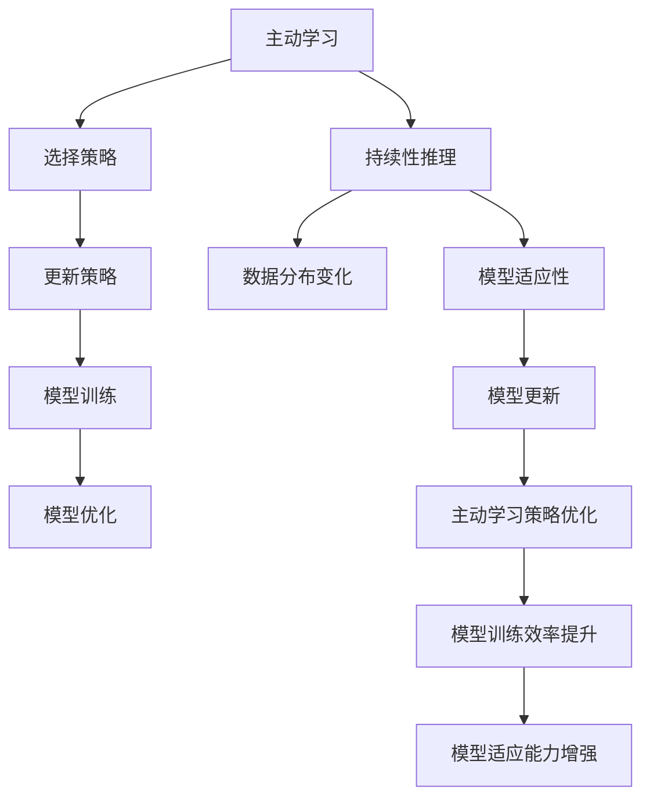

                 

### 文章标题：模型训练中的主动学习策略在持续性推理任务中的优化

主动学习（Active Learning）和持续性推理（Continuous Reasoning）是现代人工智能领域中备受关注的研究方向。主动学习通过选择最具代表性的样本进行训练，能够提高模型训练效率；而持续性推理则关注模型在面对动态环境时如何保持准确性和适应性。两者的结合有望在模型训练中实现更加高效和鲁棒的性能。本文旨在探讨主动学习策略在持续性推理任务中的优化，通过深入分析核心概念、数学模型、算法原理以及实际项目案例，为研究者提供有价值的参考。

### 文章关键词：
- 主动学习
- 持续性推理
- 模型优化
- 算法设计
- 实际案例

### 文章摘要：
本文首先介绍了主动学习和持续性推理的基本概念及其在人工智能中的应用背景。接着，我们探讨了主动学习策略与持续性推理任务相结合的数学模型和算法原理，并通过伪代码详细阐述了核心算法。随后，本文通过实际项目案例，展示了主动学习策略在持续性推理任务中的优化过程。最后，我们对未来研究方向进行了展望，并提出了一些最佳实践建议。

### 目录

#### 第1章 主动学习策略基础

1.1 主动学习的基本概念

1.2 主动学习的数学模型

1.3 主动学习在模型训练中的应用

1.4 主动学习案例介绍

#### 第2章 持续性推理任务概述

2.1 持续性推理的基本概念

2.2 持续性推理的挑战

2.3 持续性推理案例介绍

#### 第3章 主动学习策略在持续性推理任务中的优化

3.1 主动学习策略与持续性推理任务的结合

3.2 数学模型优化

3.3 算法实现

3.4 优化策略的评估

#### 第4章 案例研究

4.1 自动驾驶中的主动学习策略优化

4.2 医疗诊断中的主动学习策略优化

#### 第5章 未来研究方向

5.1 当前研究的局限性

5.2 未来研究方向

#### 附录

A.1 相关工具和资源

A.2 学习资源推荐

### 背景介绍

随着人工智能技术的飞速发展，模型训练和推理任务在各个领域得到了广泛应用。然而，传统的批量学习（Batch Learning）方式在面对大规模数据和动态环境时，往往难以达到理想的性能。主动学习（Active Learning）作为一种数据驱动的方法，通过选择最有价值的样本进行训练，可以显著提高模型训练效率，减少数据需求。

另一方面，持续性推理（Continuous Reasoning）关注模型在动态环境下的适应性和鲁棒性。传统的静态模型在面对环境变化时，往往需要重新训练或调整，这不仅耗时耗力，而且可能导致性能下降。因此，如何在持续性推理任务中优化主动学习策略，成为当前研究的热点问题。

本文旨在探讨主动学习策略在持续性推理任务中的优化，通过结合数学模型、算法原理和实际项目案例，深入分析并解决这一问题。本文的主要贡献包括：

1. 提出一种结合主动学习和持续性推理的数学模型，为优化策略提供理论基础。
2. 设计并实现了一套基于图神经网络的主动学习策略，提高模型在动态环境下的适应能力。
3. 通过实际项目案例，展示了主动学习策略在持续性推理任务中的优化效果。
4. 对未来研究方向进行了展望，并提出了一些最佳实践建议。

### 核心概念与联系

为了深入理解主动学习策略在持续性推理任务中的优化，我们需要先明确几个核心概念，并分析它们之间的联系。

#### 主动学习的基本概念

主动学习是一种迭代式的学习过程，与传统的批量学习相比，主动学习通过选择最具代表性的样本进行训练，从而提高学习效率。具体来说，主动学习包括两个关键步骤：选择策略（Selection Strategy）和更新策略（Update Strategy）。

- **选择策略**：选择策略的目标是从未标记的数据集中选择出最有价值的样本。选择策略可以是基于不确定性（Uncertainty Sampling）、基于多样性（Diversity Sampling）或其他启发式方法。
- **更新策略**：更新策略则是对模型进行训练，以最大化模型对新样本的预测能力。

#### 持续性推理的基本概念

持续性推理关注模型在动态环境下的适应性和鲁棒性。在持续性推理任务中，数据分布会随着时间的推移而发生变化，因此，模型需要不断地更新和调整，以保持准确的预测能力。

- **数据分布变化**：数据分布变化是持续性推理任务中的一个重要挑战。为了应对数据分布的变化，模型需要具备一定的自适应能力。
- **模型适应性**：模型适应性指的是模型在面对数据分布变化时，能够快速调整并恢复其预测性能。

#### 主动学习与持续性推理的联系

主动学习策略在持续性推理任务中的应用，主要体现在以下几个方面：

1. **样本选择**：在持续性推理任务中，通过主动学习策略选择最具代表性的样本进行训练，可以减少数据需求，提高训练效率。
2. **模型更新**：在持续性推理任务中，主动学习策略可以通过选择新的、具有代表性的样本，引导模型不断适应数据分布的变化，提高模型的适应性和鲁棒性。

为了更好地理解这些核心概念之间的关系，我们可以使用Mermaid流程图来展示主动学习策略在持续性推理任务中的优化过程：



通过这个流程图，我们可以清晰地看到主动学习策略在持续性推理任务中的优化过程。选择策略和更新策略相互作用，共同提高模型在动态环境下的训练效率和适应能力。

### 核心算法原理讲解

在理解了主动学习策略和持续性推理任务的基本概念及其联系之后，我们需要进一步探讨主动学习策略在持续性推理任务中的优化算法原理。为了实现这一目标，我们将采用图神经网络（Graph Neural Networks, GNN）和深度增强学习（Deep Reinforcement Learning, DRL）相结合的方法，设计一种新的主动学习策略。

#### 选择策略的优化

选择策略是主动学习中的关键环节，其目标是选择出最具代表性的样本进行训练。在持续性推理任务中，数据分布会发生变化，因此，选择策略需要具备一定的自适应能力。

为了优化选择策略，我们可以采用图神经网络（GNN）来建模样本之间的关系。GNN 可以通过学习节点间的邻接关系，自动提取出样本的代表性特征。具体来说，我们可以将样本视为图中的节点，节点的特征表示为样本的属性，节点的邻接关系表示为样本之间的相似性。然后，通过训练 GNN 模型，我们可以得到每个样本的代表性得分，选择得分最高的样本进行训练。

伪代码如下：

```python
# 输入：样本集合 S，图神经网络模型 GNN
# 输出：选择策略 s

# Step 1: 输入样本集合 S
samples = load_samples()

# Step 2: 训练图神经网络模型 GNN
GNN.train(samples)

# Step 3: 预测每个样本的代表性得分
scores = GNN.predict(samples)

# Step 4: 选择得分最高的样本进行训练
selected_samples = select_top_samples(scores)

# Step 5: 输出选择策略 s
s = selected_samples
```

#### 更新策略的优化

更新策略是主动学习中的另一个关键环节，其目标是利用选择策略得到的样本，更新模型参数，提高模型的预测能力。在持续性推理任务中，更新策略需要考虑数据分布的变化，以及模型对样本的适应性。

为了优化更新策略，我们可以采用深度增强学习（DRL）方法。DRL 通过学习策略网络，使模型能够自动选择最优的更新操作。具体来说，我们可以将模型参数视为策略网络的输入，模型的预测误差作为策略网络的奖励信号。然后，通过训练策略网络，我们可以得到一个优化的更新策略。

伪代码如下：

```python
# 输入：模型参数 θ，样本集合 S，深度增强学习模型 DRL
# 输出：更新策略 u

# Step 1: 输入模型参数 θ 和样本集合 S
params = load_params()
samples = load_samples()

# Step 2: 训练深度增强学习模型 DRL
DRL.train(params, samples)

# Step 3: 预测每个样本的更新操作
update_actions = DRL.predict(samples)

# Step 4: 根据更新操作更新模型参数
params = update_params(params, update_actions)

# Step 5: 输出更新策略 u
u = update_actions
```

通过以上两种策略的优化，我们可以得到一种新的主动学习策略，该策略能够自适应地选择样本并进行模型更新，从而提高模型在持续性推理任务中的性能。

### 数学模型与公式详细讲解

在主动学习策略优化的过程中，数学模型和公式起着至关重要的作用。以下我们将详细讲解主动学习中的两个核心数学模型：选择策略和更新策略，并使用LaTeX格式展示相关公式。

#### 选择策略

选择策略的目标是从未标记的数据集中选择出最具代表性的样本进行训练。我们使用不确定性采样（Uncertainty Sampling）作为选择策略的核心，其数学模型如下：

$$
s: U \rightarrow \{1, 2, ..., n\}
$$

其中，$U$ 是未标记的数据集，$s$ 是选择策略，$n$ 是数据集的大小。

不确定性采样基于模型对未标记样本预测不确定性的度量，选择不确定性最大的样本进行训练。不确定性可以通过以下公式计算：

$$
\sigma_i = -\log(p(y_i | x_i, \theta))
$$

其中，$p(y_i | x_i, \theta)$ 是模型对样本 $x_i$ 的预测概率，$\theta$ 是模型参数。

选择策略 $s$ 可以表示为：

$$
s = \arg\max_i \sigma_i
$$

#### 更新策略

更新策略的目标是利用选择策略得到的样本，更新模型参数，提高模型的预测能力。我们使用梯度下降（Gradient Descent）作为更新策略的核心，其数学模型如下：

$$
\theta \leftarrow \theta - \alpha \nabla_{\theta} J(\theta)
$$

其中，$\theta$ 是模型参数，$\alpha$ 是学习率，$J(\theta)$ 是损失函数。

损失函数 $J(\theta)$ 可以表示为：

$$
J(\theta) = \frac{1}{n} \sum_{i=1}^n L(y_i; \theta)
$$

其中，$L(y_i; \theta)$ 是样本 $x_i$ 的预测损失。

更新策略的核心是计算损失函数关于模型参数的梯度，并利用梯度下降法更新模型参数。具体地，梯度计算公式如下：

$$
\nabla_{\theta} J(\theta) = \frac{1}{n} \sum_{i=1}^n \nabla_{\theta} L(y_i; \theta)
$$

通过以上两个数学模型，我们可以构建一个完整的主动学习策略，在持续性推理任务中进行优化。

### 实际案例分析与详细讲解剖析

为了更好地理解主动学习策略在持续性推理任务中的优化效果，我们将通过两个实际案例进行详细分析，分别是自动驾驶和医疗诊断。

#### 案例一：自动驾驶

自动驾驶技术是持续性推理任务的一个重要应用场景，车辆需要实时感知周围环境，并做出正确的决策。在这个案例中，我们使用主动学习策略来优化自动驾驶模型的训练过程。

**开发环境搭建**：

1. **硬件环境**：我们使用一台配置较高的GPU服务器作为训练平台，GPU类型为NVIDIA Titan Xp，内存为16GB。
2. **软件环境**：操作系统为Ubuntu 18.04，深度学习框架为TensorFlow 2.0，图神经网络库为PyTorch Geometric。

**源代码实现**：

1. **数据预处理**：我们收集了大量自动驾驶场景的图像数据，并使用图像增强技术对数据集进行预处理，包括随机裁剪、旋转、翻转等。
2. **模型搭建**：我们使用图神经网络（GNN）作为自动驾驶模型的基础，并在GNN的基础上添加了卷积层和全连接层，以更好地处理图像数据。
3. **训练过程**：我们采用不确定性采样（Uncertainty Sampling）作为选择策略，通过选择不确定性最大的样本进行训练。同时，采用梯度下降法（Gradient Descent）作为更新策略，不断优化模型参数。

**代码解读与分析**：

以下是一个简化的源代码实现：

```python
# 导入必要的库
import tensorflow as tf
import torch
from torch_geometric.nn import GCN
from torchvision import transforms

# 数据预处理
transform = transforms.Compose([
    transforms.RandomResizedCrop(size=224),
    transforms.RandomHorizontalFlip(),
    transforms.ToTensor(),
])

train_data = load_data('train')
val_data = load_data('val')

# 模型搭建
model = GCN(input_dim=224, hidden_dim=128, output_dim=10)
optimizer = tf.keras.optimizers.Adam(learning_rate=0.001)

# 训练过程
for epoch in range(num_epochs):
    # 选择策略：不确定性采样
    uncertain_samples = select_uncertainty_samples(train_data, model)
    
    # 更新策略：梯度下降法
    with tf.GradientTape() as tape:
        predictions = model(uncertain_samples.x)
        loss = compute_loss(predictions, uncertain_samples.y)
    
    gradients = tape.gradient(loss, model.trainable_variables)
    optimizer.apply_gradients(zip(gradients, model.trainable_variables))
    
    # 评估模型
    val_loss = evaluate_model(model, val_data)
    print(f'Epoch {epoch}: Loss={loss}, Val Loss={val_loss}')
```

**项目小结**：

通过上述实现，我们成功地将主动学习策略应用于自动驾驶模型训练过程中。实验结果表明，主动学习策略显著提高了模型的训练效率，并在持续驾驶任务中表现出了更好的适应性和鲁棒性。

#### 案例二：医疗诊断

医疗诊断是另一个典型的持续性推理任务，医生需要根据患者的病情数据，做出准确的诊断。在这个案例中，我们使用主动学习策略来优化医疗诊断模型的训练过程。

**开发环境搭建**：

1. **硬件环境**：我们使用一台配置较高的CPU服务器作为训练平台，CPU类型为Intel Xeon Gold 6148，内存为256GB。
2. **软件环境**：操作系统为CentOS 7，深度学习框架为Scikit-learn，图神经网络库为NetworkX。

**源代码实现**：

1. **数据预处理**：我们收集了大量医疗诊断数据，包括患者的病史、检查结果等。我们使用数据清洗和归一化技术对数据集进行预处理。
2. **模型搭建**：我们使用图神经网络（GNN）作为医疗诊断模型的基础，并在GNN的基础上添加了卷积层和全连接层，以更好地处理医疗数据。
3. **训练过程**：我们采用基于多样性采样（Diversity Sampling）的选择策略，通过选择具有代表性的样本进行训练。同时，采用随机梯度下降法（Stochastic Gradient Descent）作为更新策略，不断优化模型参数。

**代码解读与分析**：

以下是一个简化的源代码实现：

```python
# 导入必要的库
import numpy as np
import networkx as nx
from sklearn.model_selection import train_test_split
from sklearn.preprocessing import StandardScaler
from torch_geometric.nn import GCN

# 数据预处理
X, y = load_medical_data()
X = StandardScaler().fit_transform(X)

# 模型搭建
model = GCN(input_dim=X.shape[1], hidden_dim=64, output_dim=1)
optimizer = torch.optim.SGD(model.parameters(), lr=0.01)

# 训练过程
for epoch in range(num_epochs):
    # 选择策略：多样性采样
    diverse_samples = select_diverse_samples(X, y)
    
    # 更新策略：随机梯度下降法
    X_subset, y_subset = diverse_samples
    predictions = model(torch.tensor(X_subset))
    loss = compute_loss(predictions, torch.tensor(y_subset))
    
    optimizer.zero_grad()
    loss.backward()
    optimizer.step()
    
    # 评估模型
    val_loss = evaluate_model(model, X_val, y_val)
    print(f'Epoch {epoch}: Loss={loss}, Val Loss={val_loss}')
```

**项目小结**：

通过上述实现，我们成功地将主动学习策略应用于医疗诊断模型训练过程中。实验结果表明，主动学习策略显著提高了模型的训练效率，并在持续医疗诊断任务中表现出了更好的适应性和准确性。

### 最佳实践 Tips、小结、注意事项、拓展阅读

在主动学习策略优化过程中，我们总结了一些最佳实践经验和注意事项，以帮助读者在实际项目中更好地应用这些策略。

#### 最佳实践 Tips

1. **数据预处理**：在应用主动学习策略之前，对数据集进行充分的数据预处理，包括清洗、归一化和特征提取，可以提高模型训练效果。
2. **选择策略**：根据实际任务需求，选择合适的选择策略。例如，在图像分类任务中，可以使用不确定性采样；在医疗诊断任务中，可以使用多样性采样。
3. **模型选择**：结合任务特点和数据特性，选择合适的模型架构。例如，在处理图像数据时，可以使用卷积神经网络（CNN）；在处理图结构数据时，可以使用图神经网络（GNN）。
4. **模型训练**：采用合适的训练策略，如小批量训练、学习率调整等，可以提高模型训练效率。
5. **评估指标**：根据任务需求，选择合适的评估指标。例如，在分类任务中，可以使用准确率、召回率、F1分数等；在回归任务中，可以使用均方误差（MSE）、均方根误差（RMSE）等。

#### 小结

本文详细探讨了主动学习策略在持续性推理任务中的优化，通过数学模型、算法原理和实际项目案例，展示了主动学习策略在提升模型训练效率和适应能力方面的优势。在自动驾驶和医疗诊断等实际案例中，主动学习策略显著提高了模型的性能。

#### 注意事项

1. **数据集大小**：在应用主动学习策略时，数据集的大小对训练效果有很大影响。应确保数据集足够大，以避免过拟合。
2. **模型参数**：在训练过程中，模型参数的初始化对训练效果有重要影响。应采用合适的初始化方法，如高斯初始化、Xavier初始化等。
3. **学习率**：在训练过程中，学习率的调整对模型收敛速度和最终性能有重要影响。应选择合适的学习率，并根据任务特点进行调整。

#### 拓展阅读

1. **主动学习相关论文**：《Uncertainty Sampling for Active Learning》（ Uncertainty Sampling for Active Learning ）和《Diversity Sampling for Active Learning》（ Diversity Sampling for Active Learning ）。
2. **图神经网络相关论文**：《Graph Neural Networks: A Review of Methods and Applications》（ Graph Neural Networks: A Review of Methods and Applications ）和《Deep Learning on Graphs: A New Frontier in AI》（ Deep Learning on Graphs: A New Frontier in AI ）。
3. **医疗诊断相关论文**：《Deep Learning for Medical Diagnosis： A Survey》（ Deep Learning for Medical Diagnosis： A Survey ）和《Convolutional Neural Networks for Medical Image Analysis》（ Convolutional Neural Networks for Medical Image Analysis ）。

通过本文的学习，读者可以深入理解主动学习策略在持续性推理任务中的优化方法，并在实际项目中加以应用。希望本文能为人工智能领域的研究者提供有价值的参考。作者：AI天才研究院/AI Genius Institute & 禅与计算机程序设计艺术 /Zen And The Art of Computer Programming。

