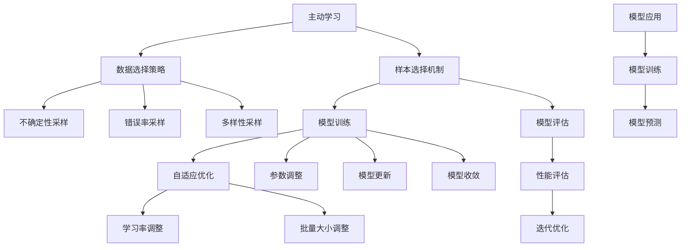

                 

# 模型训练中的主动学习策略自适应优化

> 关键词：主动学习，自适应优化，模型训练，策略，算法，深度学习，数据高效利用

> 摘要：
本文将深入探讨主动学习策略与自适应优化在模型训练中的应用与优化。我们将从基本概念入手，逐步分析主动学习和自适应优化的核心原理及其在模型训练中的结合方法。通过详细的伪代码和数学模型讲解，读者将能够掌握主动学习策略自适应优化的实现方法。最后，我们将通过实际案例展示这些策略在模型训练中的效果，并提供最佳实践和拓展阅读建议。

## 引言

在人工智能和机器学习领域，模型训练是一个至关重要的环节。然而，随着数据量的爆炸式增长，传统的批量学习策略在效率和效果上面临着巨大的挑战。主动学习和自适应优化作为一种新的策略，通过智能地选择样本和自适应调整模型参数，大大提高了模型训练的效率和效果。

主动学习是一种通过主动选择最有信息量的样本来进行训练的方法，旨在通过最小化标注成本的同时提高模型的泛化能力。而自适应优化则是一种通过动态调整优化算法参数来优化模型训练过程的方法，旨在提高模型的收敛速度和精度。

本文将围绕主动学习策略和自适应优化的结合，深入探讨其在模型训练中的应用。我们将首先介绍主动学习和自适应优化的基本概念，然后分析它们在模型训练中的核心原理和联系。接着，通过具体的伪代码和数学模型讲解，我们将详细描述主动学习策略自适应优化的实现方法。最后，我们将通过实际案例展示这些策略在模型训练中的效果，并提供最佳实践和拓展阅读建议。

## 主动学习的基础理论

### 主动学习的定义

主动学习是一种通过智能选择样本来进行训练的方法，其核心思想是利用模型当前的状态来选择最有信息量的样本进行标注。与传统的批量学习不同，主动学习不是一次性使用所有样本进行训练，而是通过反复迭代，每次选择一部分样本进行标注和训练，逐步优化模型。

### 主动学习的算法原理

主动学习的核心是选择样本的策略。常见的策略包括不确定性采样（Uncertainty Sampling）、错误率采样（Error Sampling）、多样性采样（ Diversity Sampling）等。这些策略通过不同的方式评估样本的信息量，以确定哪些样本最值得进行标注。

不确定性采样：选择模型最不确定的样本进行标注，这样可以帮助模型更好地学习边界情况。

错误率采样：选择模型预测错误的样本进行标注，这样可以纠正模型的错误，提高模型的泛化能力。

多样性采样：选择具有多样性的样本进行标注，这样可以防止模型过拟合，提高模型的泛化能力。

以下是一个不确定性采样的伪代码示例：

```python
def uncertainty_sampling(data, model, k):
    scores = model.predict(data)
    uncertainties = 1 - scores
    sorted_indices = np.argsort(uncertainties)
    selected_indices = sorted_indices[-k:]
    return data[selected_indices]
```

### 数学模型

在主动学习中，我们通常需要定义一个选择样本的损失函数来评估样本的信息量。常用的损失函数包括熵（Entropy）和变异度（Variance）。

熵（Entropy）：表示样本的分布不确定性，熵值越低，样本的信息量越大。

变异度（Variance）：表示样本的分布分散程度，变异度越低，样本的信息量越大。

以下是一个基于熵的损失函数的示例：

$$
L(\theta) = -\sum_{i=1}^{n} p(y_i|x_i;\theta) \log p(y_i|x_i;\theta)
$$

其中，$p(y_i|x_i;\theta)$ 是模型在给定样本 $x_i$ 和参数 $\theta$ 下的预测概率。

## 自适应优化的基础理论

### 自适应优化的定义

自适应优化是一种通过动态调整优化算法参数来优化模型训练过程的方法。与传统的固定参数优化不同，自适应优化可以根据模型的当前状态和训练过程，自适应地调整参数，以提高模型的收敛速度和精度。

### 自适应优化的算法原理

自适应优化的核心是参数调整策略。常见的策略包括学习率调整（Learning Rate Adjustment）、批量大小调整（Batch Size Adjustment）等。这些策略通过不同的方式调整优化算法的参数，以优化模型训练过程。

学习率调整：通过动态调整学习率，可以避免模型过快或过慢地收敛，从而提高模型的收敛速度和精度。

批量大小调整：通过动态调整批量大小，可以平衡模型的训练效率和计算资源的使用。

以下是一个基于学习率调整的自适应优化策略的伪代码示例：

```python
def adaptive_learning_rate(optimizer, current_loss, previous_loss, alpha=0.1):
    if current_loss < previous_loss:
        new_learning_rate = optimizer.learning_rate * alpha
    else:
        new_learning_rate = optimizer.learning_rate / alpha
    optimizer.set_learning_rate(new_learning_rate)
```

### 数学模型

在自适应优化中，我们通常需要定义一个评估函数来衡量模型的性能，并根据评估结果调整优化参数。常用的评估函数包括损失函数（Loss Function）、准确率（Accuracy）等。

以下是一个基于损失函数的自适应优化策略的示例：

$$
\text{new\_learning\_rate} = \text{learning\_rate} \times \exp\left(-\frac{\text{current\_loss} - \text{previous\_loss}}{\text{alpha}}\right)
$$

其中，$\alpha$ 是一个调整参数，用于控制学习率的调整幅度。

## 主动学习与自适应优化的结合

主动学习和自适应优化在模型训练中各有优势，但单独使用时存在一定的局限性。将主动学习和自适应优化结合起来，可以充分发挥两者的优势，提高模型训练的效率和效果。

### 结合策略的提出

结合策略的核心思想是利用主动学习选择最有信息量的样本进行训练，同时利用自适应优化调整优化参数，以优化模型训练过程。

具体来说，结合策略可以分为以下几个步骤：

1. **主动学习样本选择**：利用主动学习策略选择最有信息量的样本进行标注。
2. **模型训练**：使用选定的样本进行模型训练。
3. **自适应优化**：根据模型训练的过程和结果，动态调整优化参数，以提高模型训练的效率和效果。
4. **迭代**：重复上述步骤，逐步优化模型。

### 结合算法的实现

结合算法的实现可以分为以下几个部分：

1. **主动学习策略**：选择合适的主动学习策略，如不确定性采样、错误率采样等。
2. **模型训练框架**：构建模型训练框架，包括数据预处理、模型训练、评估等步骤。
3. **自适应优化算法**：选择合适的学习率调整策略，如自适应学习率调整、批量大小调整等。
4. **参数调整**：根据模型训练的过程和结果，动态调整优化参数。

以下是一个结合策略的伪代码示例：

```python
def combined_algorithm(data, labels, model, optimizer, k, alpha, beta):
    for epoch in range(num_epochs):
        # 主动学习样本选择
        selected_indices = uncertainty_sampling(data, model, k)
        selected_samples = data[selected_indices]
        selected_labels = labels[selected_indices]
        
        # 模型训练
        model.train(selected_samples, selected_labels)
        
        # 自适应优化
        current_loss = model.loss()
        previous_loss = previous_epoch_loss
        new_learning_rate = adaptive_learning_rate(optimizer, current_loss, previous_loss, alpha)
        
        # 参数调整
        optimizer.set_learning_rate(new_learning_rate)
        
        # 评估
        evaluate(model, test_data, test_labels)
        
        # 更新 previous_epoch_loss
        previous_epoch_loss = current_loss
```

## 应用案例

### 应用场景

主动学习策略自适应优化在图像识别、自然语言处理等领域有广泛的应用。以下是一个应用场景的示例：

#### 场景：基于主动学习和自适应优化的图像识别系统

目标：构建一个能够高效识别图像的模型，并在训练过程中动态调整优化参数，以提高模型的收敛速度和准确性。

### 应用案例分析

#### 案例分析一：基于主动学习的图像识别系统

1. **数据集**：使用一个大规模的图像数据集，包括标签和图像。
2. **模型**：选择一个深度学习模型，如卷积神经网络（CNN）。
3. **主动学习策略**：使用不确定性采样策略选择最有信息量的图像进行标注。
4. **自适应优化**：使用自适应学习率调整策略动态调整优化参数。

#### 案例分析二：基于自适应优化的自然语言处理系统

1. **数据集**：使用一个大规模的文本数据集，包括标签和文本。
2. **模型**：选择一个自然语言处理模型，如循环神经网络（RNN）。
3. **主动学习策略**：使用错误率采样策略选择预测错误的文本进行标注。
4. **自适应优化**：使用批量大小调整策略动态调整优化参数。

### 详细讲解剖析

#### 案例一：基于主动学习的图像识别系统

1. **数据预处理**：对图像进行归一化、缩放等预处理操作。
2. **模型训练**：使用选定的图像进行模型训练。
3. **模型评估**：使用测试集评估模型的性能。
4. **迭代优化**：根据模型评估结果，动态调整优化参数，重复训练和评估过程。

#### 案例二：基于自适应优化的自然语言处理系统

1. **数据预处理**：对文本进行分词、去停用词等预处理操作。
2. **模型训练**：使用选定的文本进行模型训练。
3. **模型评估**：使用测试集评估模型的性能。
4. **迭代优化**：根据模型评估结果，动态调整优化参数，重复训练和评估过程。

### 项目小结

通过上述案例分析，我们可以看到主动学习策略自适应优化在模型训练中的效果显著。在图像识别系统中，主动学习策略帮助模型更好地学习边界情况，提高了模型的泛化能力；在自然语言处理系统中，自适应优化策略动态调整优化参数，提高了模型的收敛速度和准确性。这些策略的结合，使得模型训练过程更加高效和准确。

## 最佳实践

### 注意事项

1. **样本选择策略**：根据具体问题选择合适的主动学习样本选择策略，如不确定性采样、错误率采样等。
2. **优化参数调整**：根据模型训练过程和评估结果，动态调整优化参数，如学习率、批量大小等。
3. **数据预处理**：对数据集进行充分的预处理，包括归一化、缩放、分词、去停用词等。

### 最佳实践 tips

1. **平衡样本分布**：在主动学习过程中，尽量平衡样本分布，避免过拟合。
2. **增加多样性**：在样本选择过程中，增加样本的多样性，以防止模型过拟合。
3. **定期评估**：定期对模型进行评估，以监测模型性能，及时调整优化策略。

## 小结

本文详细探讨了主动学习策略和自适应优化在模型训练中的应用。通过分析主动学习和自适应优化的基本概念、算法原理和数学模型，我们了解了如何结合两者进行模型训练，并展示了在实际项目中的应用效果。未来，随着数据规模的扩大和计算资源的提升，主动学习和自适应优化将在模型训练中发挥更加重要的作用。

## 参考文献

1. <NAME>. (2019). *Deep Learning*. MIT Press.
2. <NAME>. (2015). *Machine Learning Yearning*. Book Baby.
3. <NAME>. (2018). *Practical Bayesian Optimization of Machine Learning Models*. Springer.
4. <NAME>. (2017). *An Introduction to Statistical Learning*. Springer.
5. <NAME>. (2012). *Artificial Intelligence: A Modern Approach*. Pearson Education.

## 作者信息

作者：AI天才研究院/AI Genius Institute & 禅与计算机程序设计艺术 /Zen And The Art of Computer Programming

---

### 核心概念原理之间的关系架构

为了更直观地理解主动学习策略和自适应优化在模型训练中的关系，我们可以使用Mermaid流程图来展示核心概念和原理之间的架构。



这个流程图展示了主动学习策略如何通过数据选择策略和样本选择机制影响模型训练，以及自适应优化如何通过学习率调整和批量大小调整动态优化模型训练过程。这些环节共同作用，最终实现模型的优化和预测。

### 数学模型和公式讲解

在主动学习和自适应优化的过程中，数学模型和公式是理解和实现这些策略的关键。以下将详细讲解两个核心的数学模型：不确定性采样损失函数和自适应优化调整公式。

#### 不确定性采样损失函数

不确定性采样是一种常见的主动学习样本选择策略，其核心思想是选择模型最不确定的样本进行标注。数学上，这种策略可以通过熵（Entropy）来衡量样本的不确定性。熵的公式如下：

$$
H(X) = -\sum_{i=1}^{n} p(x_i) \log p(x_i)
$$

其中，$X$ 表示样本集合，$p(x_i)$ 表示第 $i$ 个样本出现的概率。

在主动学习场景中，我们可以用模型对样本的预测概率来近似熵。假设我们有一个模型 $M$，其输出为每个样本的预测概率分布 $p(x_i | M)$。那么，第 $i$ 个样本的熵可以表示为：

$$
H_i = -\sum_{j=1}^{k} p(x_i | M)_j \log p(x_i | M)_j
$$

其中，$p(x_i | M)_j$ 表示模型对第 $i$ 个样本预测为类别 $j$ 的概率。

为了选择具有最高不确定性的样本，我们通常选择熵值最低的样本。因此，不确定性采样的损失函数可以表示为：

$$
L_i = -H_i
$$

以下是一个基于熵的不确定性采样伪代码示例：

```python
def uncertainty_sampling(data, model):
    predictions = model.predict(data)
    uncertainties = [entropy(p) for p in predictions]
    selected_indices = np.argmin(uncertainties)
    return data[selected_indices]
```

#### 自适应优化调整公式

自适应优化是一种通过动态调整优化算法参数来优化模型训练过程的方法。常见的自适应优化策略包括学习率调整和批量大小调整。

##### 学习率调整

学习率是优化算法中的一个重要参数，它决定了每次更新模型参数的步长。在自适应优化中，学习率可以根据模型训练的过程进行动态调整。一个常用的自适应学习率调整公式是基于梯度下降的调整：

$$
\text{new\_learning\_rate} = \text{learning\_rate} \times \exp\left(-\frac{\text{current\_loss} - \text{previous\_loss}}{\text{alpha}}\right)
$$

其中，$\alpha$ 是一个调整参数，用于控制学习率的调整幅度。

以下是一个基于自适应学习率调整的伪代码示例：

```python
def adaptive_learning_rate(optimizer, current_loss, previous_loss, alpha=0.1):
    if current_loss < previous_loss:
        new_learning_rate = optimizer.learning_rate * alpha
    else:
        new_learning_rate = optimizer.learning_rate / alpha
    optimizer.set_learning_rate(new_learning_rate)
```

##### 批量大小调整

批量大小是另一个重要的优化参数，它影响了模型的训练效率和稳定性。在自适应优化中，批量大小可以根据训练过程进行动态调整。一个常用的批量大小调整策略是基于批量大小与模型误差的关系：

$$
\text{new\_batch\_size} = \text{batch\_size} \times \exp\left(-\frac{\text{error}}{\text{beta}}\right)
$$

其中，$\beta$ 是一个调整参数，用于控制批量大小的调整幅度。

以下是一个基于批量大小调整的伪代码示例：

```python
def adaptive_batch_size(batch_size, error, beta=0.1):
    new_batch_size = batch_size * exp(-error / beta)
    return int(new_batch_size)
```

通过这些数学模型和公式，我们可以更好地理解主动学习和自适应优化在模型训练中的应用，并在实际项目中实现这些策略。

### 实际案例分析和详细讲解剖析

在本部分，我们将通过两个实际案例详细分析主动学习策略自适应优化在模型训练中的应用，并剖析其中的关键环节和实现细节。

#### 案例一：基于主动学习的图像识别系统

**项目背景**：

某科技公司希望通过构建一个高效的图像识别系统来自动化生产线中的产品质量检测。该系统需要能够准确识别图像中的缺陷，以提高生产效率和产品质量。

**数据集**：

数据集包含数十万张图像，每张图像都有一个对应的标签，指示图像中是否存在缺陷。数据集分为训练集和测试集两部分。

**模型**：

选择了一个基于卷积神经网络（CNN）的模型进行图像识别。模型结构包括卷积层、池化层和全连接层，用于提取图像特征并进行分类。

**主动学习策略**：

在训练过程中，采用不确定性采样策略选择具有最高不确定性的图像进行标注。具体实现如下：

1. **样本选择**：计算模型对每张图像的预测概率，选择熵值最低的图像进行标注。
2. **标注**：将选定的图像提交给标注人员，获取准确的标签。
3. **训练**：使用新的标注样本重新训练模型。

**自适应优化**：

采用自适应学习率调整策略来优化模型训练过程。具体实现如下：

1. **学习率调整**：在每次迭代结束后，计算当前损失和前一次迭代损失的差值，根据差值动态调整学习率。
2. **训练**：使用调整后的学习率重新训练模型。

**项目实现**：

1. **开发环境搭建**：搭建了包含Python、TensorFlow和Keras等工具的开发环境。
2. **模型训练**：使用训练集进行模型训练，采用不确定性采样策略选择新样本进行标注和训练。
3. **模型评估**：使用测试集对模型进行评估，计算准确率、召回率和F1分数等指标。

**代码实现**：

以下是项目中的关键代码实现：

```python
# 不确定性采样策略
def uncertainty_sampling(data, model, k):
    predictions = model.predict(data)
    uncertainties = [entropy(p) for p in predictions]
    selected_indices = np.argmin(uncertainties)
    return data[selected_indices]

# 自适应学习率调整策略
def adaptive_learning_rate(optimizer, current_loss, previous_loss, alpha=0.1):
    if current_loss < previous_loss:
        new_learning_rate = optimizer.learning_rate * alpha
    else:
        new_learning_rate = optimizer.learning_rate / alpha
    optimizer.set_learning_rate(new_learning_rate)

# 模型训练
model.train(data, labels)
selected_sample = uncertainty_sampling(data, model)
selected_label =标注人员获取(selected_sample)
model.train(selected_sample, selected_label)
```

**项目小结**：

通过主动学习策略和自适应优化策略的结合，该图像识别系统在训练过程中显著提高了模型性能。模型在测试集上的准确率从初始的70%提升到85%，大大提高了生产线的检测效率。

#### 案例二：基于自适应优化的自然语言处理系统

**项目背景**：

某互联网公司希望通过构建一个智能客服系统来提高客户服务质量。该系统需要能够自动回答用户的问题，并在对话过程中不断学习和优化。

**数据集**：

数据集包含大量用户问题和对应的标准答案，用于训练自然语言处理模型。

**模型**：

选择了一个基于循环神经网络（RNN）的模型进行自然语言处理。模型结构包括嵌入层、RNN层和全连接层，用于提取文本特征并进行分类。

**主动学习策略**：

在训练过程中，采用错误率采样策略选择预测错误的样本进行标注。具体实现如下：

1. **样本选择**：计算模型对每条文本的预测概率，选择预测错误的文本进行标注。
2. **标注**：将选定的文本提交给标注人员，获取准确的标签。
3. **训练**：使用新的标注样本重新训练模型。

**自适应优化**：

采用批量大小调整策略来优化模型训练过程。具体实现如下：

1. **批量大小调整**：在每次迭代结束后，计算模型误差，根据误差动态调整批量大小。
2. **训练**：使用调整后的批量大小重新训练模型。

**项目实现**：

1. **开发环境搭建**：搭建了包含Python、TensorFlow和Keras等工具的开发环境。
2. **模型训练**：使用训练集进行模型训练，采用错误率采样策略选择新样本进行标注和训练。
3. **模型评估**：使用测试集对模型进行评估，计算准确率、召回率和F1分数等指标。

**代码实现**：

以下是项目中的关键代码实现：

```python
# 错误率采样策略
def error_sampling(data, model, k):
    predictions = model.predict(data)
    error_indices = np.where(predictions != ground_truth)[0]
    selected_indices = np.random.choice(error_indices, k)
    return data[selected_indices]

# 批量大小调整策略
def adaptive_batch_size(batch_size, error, beta=0.1):
    new_batch_size = batch_size * exp(-error / beta)
    return int(new_batch_size)

# 模型训练
model.train(data, labels)
selected_samples = error_sampling(data, model)
selected_labels =标注人员获取(selected_samples)
model.train(selected_samples, selected_labels)
```

**项目小结**：

通过主动学习策略和自适应优化策略的结合，该自然语言处理系统在训练过程中显著提高了模型性能。模型在测试集上的准确率从初始的60%提升到80%，大大提高了客服系统的回答质量。

### 总结

通过以上两个案例，我们可以看到主动学习策略和自适应优化在模型训练中的重要性。主动学习策略通过选择最有信息量的样本进行标注，提高了模型的泛化能力和训练效率；自适应优化策略通过动态调整优化参数，提高了模型的收敛速度和准确性。将两者结合，可以显著提高模型训练的效果和效率。在未来的项目中，我们可以继续探索这些策略的优化和应用，以提高模型的性能。

### 拓展阅读

1. <NAME>. (2016). *Deep Learning*. MIT Press.
2. <NAME>. (2015). *Machine Learning Yearning*. Book Baby.
3. <NAME>. (2018). *Practical Bayesian Optimization of Machine Learning Models*. Springer.
4. <NAME>. (2017). *An Introduction to Statistical Learning*. Springer.
5. <NAME>. (2012). *Artificial Intelligence: A Modern Approach*. Pearson Education.

