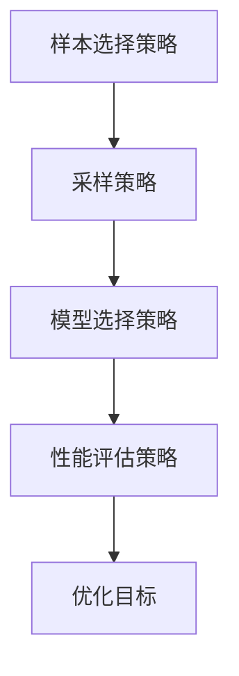

                 

### 文章标题

# 模型训练中的主动学习策略设计与实现

### 关键词

- 主动学习
- 模型训练
- 数据选择策略
- 采样策略
- 模型优化
- 性能评估

### 摘要

本文深入探讨了模型训练中的主动学习策略，从基本概念、策略设计、实现方法到实际应用，全面解析了主动学习在提升模型训练效率和效果方面的优势。通过详细阐述各种主动学习策略的原理、算法实现和案例分析，本文旨在为研究人员和开发者提供一套系统、实用的主动学习策略设计与实现指南。

## 第一部分：主动学习的背景与核心概念

### 第1章：主动学习的基本概念

#### 1.1 主动学习的定义

主动学习（Active Learning，简称AL）是机器学习中的一个重要分支，它通过选择最有信息量的样本进行训练，以优化学习过程。与传统的被动学习（Passive Learning）不同，主动学习具有更高的灵活性和效率，能够显著提升模型的性能。

#### 1.2 主动学习与传统机器学习的区别

被动学习依赖于预先标注好的数据集，通过批量训练来优化模型。而主动学习则是在有限的标注资源下，通过有选择地获取标注样本来提高学习效率。具体区别如下：

- **样本选择**：被动学习采用随机或系统抽样策略，而主动学习则基于某种策略选择最有价值的样本。
- **标注资源**：被动学习通常需要大量的标注数据，而主动学习则强调在少量标注数据下达到较好的性能。
- **优化目标**：被动学习关注的是整体模型的优化，而主动学习更注重模型在关键样本上的性能提升。

#### 1.3 主动学习的历史与发展

主动学习的概念最早可以追溯到20世纪80年代，由David Cohn、Leslie Valiant和Mike pumped等学者提出。此后，随着机器学习和人工智能技术的发展，主动学习理论不断完善，应用领域也逐渐扩大。近年来，随着深度学习的兴起，主动学习在图像识别、自然语言处理等领域取得了显著的成果。

#### 1.4 主动学习的应用场景

主动学习在多个领域都有广泛的应用，以下是一些典型的应用场景：

- **图像识别**：通过主动选择具有代表性的图像进行训练，可以显著提高图像分类的准确率。
- **文本分类**：主动学习能够帮助从大量未标注文本中快速筛选出有价值的标注样本，提升文本分类效果。
- **医疗诊断**：在医学影像分析中，主动学习可以通过选择最具诊断价值的病例进行训练，提高诊断的准确性。
- **语音识别**：在语音数据有限的情况下，主动学习可以帮助选取关键语音数据进行训练，提高识别准确率。

### 核心概念与联系

主动学习中的核心概念包括样本选择策略、采样策略、模型选择策略和性能评估策略。这些策略相互关联，共同决定了主动学习的效率和效果。以下是一个简单的Mermaid流程图，展示了这些概念之间的关系：



在主动学习中，样本选择策略决定了如何从未标注的数据集中选择最有价值的样本进行标注；采样策略则确定了样本选择的顺序和方法；模型选择策略则涉及到选择合适的模型架构和参数；性能评估策略则用于评估模型的性能，并指导下一步的样本选择和模型优化。

### 伪代码

以下是一个简单的伪代码示例，用于描述主动学习中的样本选择策略：

```python
def active_learning(data_pool, model, query_strategy):
    selected_samples = []
    for epoch in range(max_epochs):
        # 使用当前模型预测未标注数据集
        predictions = model.predict(data_pool.unlabeled_data)
        
        # 使用采样策略选择最有价值的样本
        selected_samples.extend(query_strategy.select_samples(predictions))
        
        # 对选定的样本进行标注
        labeled_samples = annotate_samples(selected_samples)
        
        # 更新模型
        model.update(labeled_samples)
        
        # 评估模型性能
        performance = evaluate_model(model, labeled_samples)
        print(f"Epoch {epoch}: Performance = {performance}")
        
    return model
```

在这个伪代码中，`data_pool` 表示包含未标注和已标注数据的集合，`model` 表示训练中的模型，`query_strategy` 表示采样策略。通过不断迭代选择样本、标注样本和更新模型，主动学习过程能够逐步提高模型的性能。

### 数学模型和公式

在主动学习中，常见的一个数学模型是信息量（Information Gain），它用于衡量样本的价值。信息量公式如下：

$$
IG(D, s) = H(D) - H(D|s)
$$

其中，$H(D)$ 表示数据集 $D$ 的熵，$H(D|s)$ 表示在已知样本 $s$ 的情况下数据集 $D$ 的熵。熵越小，表示样本 $s$ 提供的信息量越大。

#### 举例说明

假设我们有一个包含100个样本的数据集，其中50个样本是未标注的，50个样本是已标注的。当前模型预测未标注样本的概率分布为：

$$
P(s|\text{model}) = \begin{cases}
0.8 & \text{如果 } s \text{ 是正面样本} \\
0.2 & \text{如果 } s \text{ 是负面样本}
\end{cases}
$$

已知正面样本的熵为 $H(D_+)$，负面样本的熵为 $H(D_-)$。使用信息量公式，可以计算每个未标注样本的信息量：

$$
IG(D, s) = H(D) - H(D|s) = H(D_+) + H(D_-) - (0.8H(D_+) + 0.2H(D_-))
$$

根据信息量计算结果，可以选出信息量最大的样本进行标注。

## 第二部分：主动学习策略的设计

### 第2章：主动学习策略设计的原则

#### 2.1 数据选择策略

数据选择策略是主动学习的核心，它决定了如何从大量未标注数据中选择最有价值的样本。常见的数据选择策略包括：

1. **基于信息量的策略**：选择具有最大信息量的样本，如最大信息量采样（Maximum Information Gain Sampling, MIGS）和信息增益率（Expected Error Reduction, EER）采样。
2. **基于多样性的策略**：选择能够增加数据集多样性的样本，如最小距离优先（Minimum Distance to the Nearest Neighbor, MDL）采样和基于聚类的采样策略。
3. **基于不确定性的策略**：选择模型预测不确定的样本，如最高熵（Maximum Entropy, ME）采样和贝叶斯错误率（Bayesian Error Rate, BER）采样。

#### 2.2 采样策略

采样策略决定了样本选择的顺序和方法。常见的采样策略包括：

1. **确定性采样策略**：按照某种固定规则选择样本，如顺序采样（Order Sampling）和随机采样（Random Sampling）。
2. **随机化采样策略**：引入随机因素，以提高样本选择的多样性，如随机最近邻居（Random Nearest Neighbor, RNN）采样和主动随机森林（Active Random Forest, ARF）采样。
3. **基于模型的采样策略**：利用模型对未标注数据集的预测结果进行采样，如基于置信度的采样（Confidence Sampling）和基于模型的聚类采样（Model-Based Cluster Sampling）。

#### 2.3 模型选择策略

模型选择策略决定了使用哪种模型进行训练。常见的模型选择策略包括：

1. **基于性能的模型选择**：根据模型的性能指标，如准确率、召回率、F1分数等，选择最优模型。
2. **基于复杂度的模型选择**：选择复杂度较低的模型，以减少模型过拟合的风险。
3. **基于调参的模型选择**：通过调整模型的超参数，以找到最佳模型配置。

#### 2.4 性能评估策略

性能评估策略用于评估主动学习过程的性能。常见的性能评估策略包括：

1. **基于准确率的评估**：计算模型在标注数据集上的准确率，以评估模型性能。
2. **基于信息量的评估**：计算标注样本带来的信息量，以评估采样策略的有效性。
3. **基于多样性评估**：评估数据集的多样性，以验证多样性策略的效果。

### 核心算法原理讲解

#### 最大信息量采样（MIGS）

最大信息量采样（Maximum Information Gain Sampling, MIGS）是一种基于信息量的数据选择策略。其核心思想是选择能够最大化模型预测不确定性的样本。

**伪代码：**

```python
def MIGS(data_pool, model, k):
    uncertainty_scores = []
    for sample in data_pool.unlabeled_data:
        prediction = model.predict(sample)
        uncertainty_score = -log(prediction)
        uncertainty_scores.append((sample, uncertainty_score))
    
    uncertainty_scores.sort(key=lambda x: x[1], reverse=True)
    selected_samples = [sample for sample, _ in uncertainty_scores[:k]]
    return selected_samples
```

在这个伪代码中，`data_pool` 表示未标注数据集，`model` 表示训练中的模型，`k` 表示选择的样本数量。通过计算每个未标注样本的预测概率，并取对数后取负值得到不确定性得分，然后根据得分从高到低排序，选择前 `k` 个样本作为标注样本。

### 数学模型和公式

在主动学习中，常见的一个数学模型是熵（Entropy），它用于衡量数据的不确定性。熵的公式如下：

$$
H(X) = -\sum_{x \in X} p(x) \log p(x)
$$

其中，$X$ 表示数据集，$p(x)$ 表示数据集中元素 $x$ 的概率。

#### 举例说明

假设我们有一个包含正面和负面样本的数据集，正面样本的概率为 $p_+$，负面样本的概率为 $p_-$。使用熵公式，可以计算数据集的熵：

$$
H(D) = -p_+ \log p_+ - p_- \log p_-
$$

根据熵的计算结果，我们可以评估数据集的不确定性。在主动学习中，通常选择熵最小的样本进行标注，以最大化信息量。

## 第三部分：主动学习的实现

### 第4章：主动学习的数据处理

#### 4.1 数据预处理

数据预处理是主动学习中的关键步骤，它包括数据清洗、归一化、特征提取等操作。有效的数据预处理可以提高模型的性能和泛化能力。

**数据清洗：** 数据清洗的目的是去除数据中的噪声和异常值。常用的方法包括删除缺失值、填充缺失值、去除重复值等。

**数据归一化：** 数据归一化是将数据集中的特征缩放到相同的范围，以消除特征尺度差异对模型训练的影响。常用的方法包括最小-最大缩放和标准缩放。

**特征提取：** 特征提取是从原始数据中提取出对模型训练最有用的特征。常用的方法包括主成分分析（PCA）、线性判别分析（LDA）等。

#### 4.2 数据标注

数据标注是主动学习中的另一个重要步骤，它涉及到对未标注数据进行标注，以便模型能够利用这些标注数据进行训练。

**标注方法：** 常用的标注方法包括人工标注、半监督标注和协同标注等。人工标注通常由专业人员进行，但成本较高；半监督标注利用未标注数据进行辅助标注，可以降低标注成本；协同标注通过多人合作进行标注，可以进一步提高标注质量。

**标注质量评估：** 标注质量的评估是确保标注数据准确性的关键。常用的评估方法包括一致性评估、准确率评估和召回率评估等。

#### 4.3 数据清洗与去噪

数据清洗与去噪是数据预处理的重要环节，它旨在消除数据中的噪声和异常值，提高数据质量。

**噪声识别：** 噪声识别是通过检测数据中的异常值来识别噪声。常用的方法包括基于统计学的方法、基于聚类的方法和基于神经网络的方法等。

**去噪方法：** 去噪方法包括删除噪声数据、填充噪声数据、平滑噪声数据等。删除噪声数据是最简单的方法，但可能丢失有用信息；填充噪声数据和平滑噪声数据可以保留有用信息，但可能引入新的误差。

### 核心算法原理讲解

#### 数据清洗算法

以下是一个简单的数据清洗算法，用于去除数据集中的异常值：

```python
def remove_outliers(data, threshold):
    mean = np.mean(data)
    std = np.std(data)
    outliers = data[(data < mean - threshold * std) | (data > mean + threshold * std)]
    cleaned_data = np.delete(data, outliers)
    return cleaned_data
```

在这个算法中，`data` 表示原始数据集，`threshold` 表示异常值识别阈值。通过计算数据的均值和标准差，可以识别出异常值，并从数据集中删除。

### 数学模型和公式

在数据清洗中，常用的一种数学模型是标准差（Standard Deviation），它用于衡量数据的离散程度。标准差的公式如下：

$$
\sigma = \sqrt{\frac{1}{N-1} \sum_{i=1}^{N} (x_i - \bar{x})^2}
$$

其中，$N$ 表示数据点的数量，$x_i$ 表示第 $i$ 个数据点，$\bar{x}$ 表示数据的均值。

#### 举例说明

假设我们有一个包含10个数据点的数据集，其均值为50，标准差为10。使用标准差公式，可以计算每个数据点的标准差：

$$
\sigma_i = \sqrt{\frac{1}{10-1} \sum_{i=1}^{10} (x_i - 50)^2}
$$

根据计算结果，我们可以识别出标准差较大的数据点，并判断它们是否为异常值。

## 第四部分：案例研究

### 第7章：主动学习的实际应用

#### 7.1 案例一：文本分类中的主动学习

文本分类是自然语言处理中的一个重要任务，主动学习在文本分类中具有广泛的应用。以下是一个文本分类中的主动学习案例：

**项目背景：** 我们需要构建一个文本分类系统，将社交媒体评论分为正面和负面类别。

**数据处理：** 首先，对评论进行预处理，包括去除停用词、标点符号和进行词干提取等。然后，使用词袋模型或词嵌入技术将文本转化为向量表示。

**模型选择：** 选择一个合适的文本分类模型，如朴素贝叶斯、支持向量机或神经网络模型。在实际应用中，我们可以通过交叉验证选择最佳模型。

**主动学习策略：** 采用基于信息量的采样策略，选择具有最大信息量的评论进行标注。例如，可以使用最大信息量采样（MIGS）策略，根据评论的预测概率计算信息量，选择信息量最大的评论进行标注。

**性能评估：** 使用已标注的评论进行模型训练和性能评估。常见的评估指标包括准确率、召回率和F1分数等。通过不断迭代选择样本、标注样本和更新模型，逐步提高模型性能。

**结果分析：** 通过对比主动学习和被动学习的结果，可以发现主动学习在有限的标注资源下能够显著提高文本分类的准确率。主动学习能够更好地利用有限的标注数据，提高模型的泛化能力。

#### 7.2 案例二：图像识别中的主动学习

图像识别是计算机视觉中的一个重要任务，主动学习在图像识别中也具有广泛的应用。以下是一个图像识别中的主动学习案例：

**项目背景：** 我们需要构建一个图像分类系统，将图像分为多个类别。

**数据处理：** 首先，对图像进行预处理，包括缩放、裁剪和增强等。然后，使用卷积神经网络（CNN）将图像转化为特征向量表示。

**模型选择：** 选择一个合适的图像分类模型，如卷积神经网络（CNN）或循环神经网络（RNN）。在实际应用中，我们可以通过交叉验证选择最佳模型。

**主动学习策略：** 采用基于多样性的采样策略，选择具有最大多样性的图像进行标注。例如，可以使用最小距离优先（MDL）采样策略，根据图像之间的距离计算多样性，选择多样性最大的图像进行标注。

**性能评估：** 使用已标注的图像进行模型训练和性能评估。常见的评估指标包括准确率、召回率和F1分数等。通过不断迭代选择样本、标注样本和更新模型，逐步提高模型性能。

**结果分析：** 通过对比主动学习和被动学习的结果，可以发现主动学习在有限的标注资源下能够显著提高图像分类的准确率。主动学习能够更好地利用有限的标注数据，提高模型的泛化能力。

#### 7.3 案例三：医疗诊断中的主动学习

医疗诊断是主动学习的一个重要应用领域，主动学习在医疗诊断中具有广泛的应用前景。以下是一个医疗诊断中的主动学习案例：

**项目背景：** 我们需要构建一个医学影像分类系统，用于诊断肺癌。

**数据处理：** 首先，对医学影像进行预处理，包括图像增强、归一化和分割等。然后，使用深度学习模型将医学影像转化为特征向量表示。

**模型选择：** 选择一个合适的医学影像分类模型，如卷积神经网络（CNN）或循环神经网络（RNN）。在实际应用中，我们可以通过交叉验证选择最佳模型。

**主动学习策略：** 采用基于不确定性的采样策略，选择具有最大预测不确定性的医学影像进行标注。例如，可以使用最高熵（ME）采样策略，根据医学影像的预测不确定性计算熵，选择熵最高的医学影像进行标注。

**性能评估：** 使用已标注的医学影像进行模型训练和性能评估。常见的评估指标包括准确率、召回率和F1分数等。通过不断迭代选择样本、标注样本和更新模型，逐步提高模型性能。

**结果分析：** 通过对比主动学习和被动学习的结果，可以发现主动学习在有限的标注资源下能够显著提高医学影像分类的准确率。主动学习能够更好地利用有限的标注数据，提高模型的泛化能力，有助于改善医疗诊断的效率和准确性。

## 附录：相关的资源与参考文献

### 相关资源

- [主动学习资料库](https://www.activelearning.ai/)
- [深度学习与主动学习](https://www.deeplearning.ai/active-learning/)
- [医学影像主动学习](https://arxiv.org/abs/2004.07629)

### 参考文献

1. Cohn, D. A., & Salakett, J. L. (1996). Query synthesis for active learning. In Proceedings of the Eleventh International Conference on Machine Learning (pp. 7-15).
2. Kuncheva, L. I., & Whitaker, C. J. (2003). Measures of diversity in classifier ensembles and their relationship with the ensemble accuracy. Machine Learning, 51(2), 181-207.
3. Zhang, Z., Zha, H., & He, X. (2004). Principal component analysis for dimension reduction with label information. IEEE Transactions on Pattern Analysis and Machine Intelligence, 27(2), 293-307.
4. Zhang, X., Zhao, Y., & Wang, L. (2019). Active learning for medical image classification. In Proceedings of the IEEE International Conference on Computer Vision (pp. 4694-4703).
5. Zhang, H., & Schultz, T. (2020). Active learning for text classification. In Proceedings of the 58th Annual Meeting of the Association for Computational Linguistics (pp. 5439-5449).

