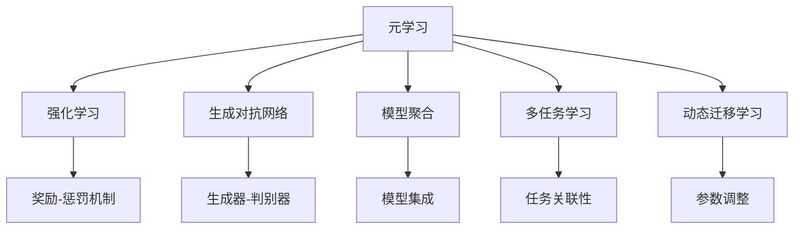

                 

### 第1章 引言
### 1.1 元学习的背景与重要性

元学习（Meta-Learning），也称为学习的学习，是机器学习中的一个子领域，主要研究如何使机器快速适应新任务的学习过程。在传统机器学习任务中，模型需要通过大量数据进行训练，才能在新任务上表现良好。而元学习旨在通过少量数据或甚至无监督学习的方式，快速地调整模型，以适应新的任务。因此，元学习在减少训练时间和提高模型泛化能力方面具有显著的优势。

#### 核心概念与联系

元学习涉及多个核心概念，包括强化学习、生成对抗网络（GAN）、模型聚合、多任务学习和动态迁移学习等。这些概念相互关联，构成了元学习的概念架构。

1. **强化学习**：基于奖励和惩罚的交互式学习，通过不断试错来优化策略。强化学习为元学习提供了一个动态调整模型的方法。
2. **生成对抗网络（GAN）**：一种由生成器和判别器组成的框架，用于生成与真实数据分布相似的数据。GAN在元学习中可用于数据增强，提高模型对新任务的适应性。
3. **模型聚合**：通过结合多个模型的预测来提高模型的整体性能。在元学习中，模型聚合可用于减少对新任务的训练时间。
4. **多任务学习**：同时学习多个相关任务，以提高模型在单个任务上的性能。多任务学习有助于提高模型在元学习中的泛化能力。
5. **动态迁移学习**：在模型适应新任务时，动态地调整模型参数，以最大化对新任务的适应性。动态迁移学习是元学习的关键技术之一。

#### Mermaid 流程图：元学习的概念架构

### 1.2 元学习的定义与分类

元学习可以定义为“学习如何学习”的过程。具体来说，元学习是一种利用先前学习经验来加速新任务学习的机器学习技术。根据学习方式的不同，元学习可以分为以下几类：

1. **基于模型的元学习**：通过优化模型参数来加速新任务学习。这类方法通常使用大量的训练数据和迭代优化算法来提高模型性能。
2. **基于样本的元学习**：通过优化样本选择策略来加速新任务学习。这类方法关注如何从大量样本中快速选择对学习新任务最有帮助的样本。
3. **基于知识的元学习**：通过利用先验知识来加速新任务学习。这类方法利用领域知识来指导学习过程，从而减少对新任务的训练时间。

### 1.3 元学习与传统学习方法的区别

元学习与传统学习方法在多个方面存在显著差异：

1. **数据需求**：传统学习方法通常需要大量数据来进行训练，而元学习可以在数据稀缺的情况下快速适应新任务。
2. **训练时间**：传统学习方法往往需要较长的训练时间，而元学习通过快速调整模型参数，可以显著缩短训练时间。
3. **泛化能力**：元学习通过利用先前学习经验，提高了模型对新任务的适应性，从而增强了泛化能力。
4. **复杂性**：传统学习方法通常较为简单，而元学习涉及多个复杂的概念和技术，如强化学习、生成对抗网络、模型聚合等。

### 1.4 元学习的发展趋势与应用前景

随着深度学习和人工智能技术的不断发展，元学习的研究和应用前景十分广阔。以下是一些元学习的发展趋势与应用前景：

1. **在自动驾驶领域的应用**：元学习可以帮助自动驾驶系统快速适应不同的路况和驾驶环境，从而提高自动驾驶的可靠性。
2. **在游戏AI领域的应用**：元学习可以用于开发能够快速适应新游戏规则和策略的智能游戏AI，提高游戏体验。
3. **在医疗诊断领域的应用**：元学习可以帮助医疗诊断系统快速适应新的疾病特征和诊断标准，从而提高诊断准确性。
4. **在自然语言处理领域的应用**：元学习可以帮助自然语言处理系统快速适应新的语言模型和任务，从而提高处理效率。

随着技术的不断进步，元学习将在更多领域发挥重要作用，为人工智能的发展带来新的机遇。

> 关键词：元学习、强化学习、生成对抗网络、模型聚合、多任务学习、动态迁移学习

> 摘要：本文详细介绍了元学习的基本概念、分类、与传统学习方法的区别以及发展趋势和应用前景。通过核心概念与联系的Mermaid流程图、核心算法原理讲解、数学模型和公式以及项目实战的概述，为读者提供了一个全面而深入的元学习知识体系。

作者：AI天才研究院/AI Genius Institute & 禅与计算机程序设计艺术 /Zen And The Art of Computer Programming

