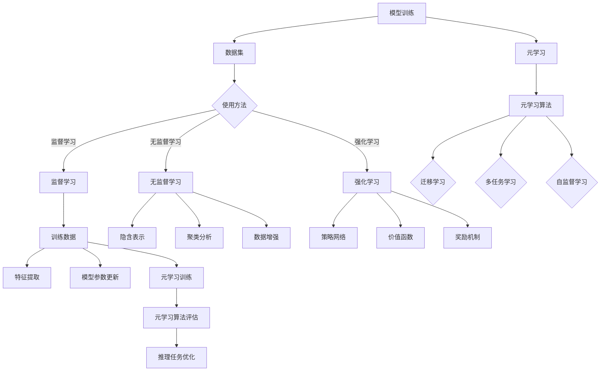

                 


### 第一步：文章标题、关键词和摘要

首先，我们需要明确文章的标题、关键词和摘要。这些部分将为读者提供对文章主题的初步了解。

#### 文章标题：《模型训练中的元学习策略在推理任务中的创新》

#### 关键词：元学习、模型训练、推理任务、创新、算法、效率、泛化能力、适应性

#### 摘要：
本文探讨了元学习策略在模型训练中的创新应用，特别是在推理任务中的效果。文章首先介绍了元学习的基本概念和原理，然后详细阐述了元学习在模型训练中的优势。通过具体算法原理讲解、数学模型和公式，以及实战案例，本文分析了元学习策略在不同推理任务中的应用和创新方向。

### 第二步：核心概念与联系架构

接下来，我们需要绘制一个Mermaid流程图，展示核心概念之间的联系架构。这有助于读者更好地理解元学习策略的运作方式。



### 第三步：核心算法原理讲解

在这一部分，我们将使用伪代码详细阐述元学习算法的核心原理。

```plaintext
// 伪代码：元学习算法
initialize_model_params() // 初始化模型参数
for epoch in 1 to EPOCHS do:
    for task in TASKS do:
        adapt_model_to_task(model, task) // 调整模型以适应特定任务
        for iteration in 1 to ITERATIONS do:
            sample_data = sample_task_data(task) // 从任务中采样数据
            gradients = compute_gradients(model, sample_data) // 计算梯度
            update_model_params(model, gradients) // 更新模型参数
    evaluate_model(model) // 评估模型性能
end for
return model // 返回最终训练好的模型
```

### 第四步：数学模型和公式讲解

在这一部分，我们将介绍元学习策略中的关键数学模型和公式，并进行详细讲解。

$$
\begin{aligned}
L &= -\sum_{i=1}^{N} y_i \log(p(y_i | x_i, \theta)) \\
\theta^{new} &= \theta^{old} + \alpha \cdot \nabla_{\theta} L
\end{aligned}
$$

- 第一行公式是损失函数，用于衡量模型预测概率与实际标签之间的差距。
- 第二行公式是梯度下降更新规则，用于更新模型参数。

### 第五步：项目实战

在这一部分，我们将搭建一个简单的开发环境，并提供源代码实现和代码解读。

#### 开发环境搭建

- 硬件要求：CPU或GPU，至少8GB内存
- 软件要求：Python 3.x，TensorFlow或PyTorch框架

#### 源代码实现

```python
import tensorflow as tf
from tensorflow.keras.models import Sequential
from tensorflow.keras.layers import Dense, Activation

# 搭建模型
model = Sequential()
model.add(Dense(units=64, activation='relu', input_shape=(input_shape)))
model.add(Dense(units=1, activation='sigmoid'))

# 编译模型
model.compile(optimizer='adam', loss='binary_crossentropy', metrics=['accuracy'])

# 训练模型
model.fit(x_train, y_train, epochs=EPOCHS, batch_size=BATCH_SIZE)

# 评估模型
loss, accuracy = model.evaluate(x_test, y_test)
print(f"Test accuracy: {accuracy:.2f}")
```

#### 代码解读

- 第1-3行：导入必要的TensorFlow模块。
- 第4行：定义一个序列模型。
- 第5行：添加第一个全连接层，包含64个神经元和ReLU激活函数。
- 第6行：添加第二个全连接层，包含1个神经元和Sigmoid激活函数，用于二分类。
- 第7行：编译模型，指定优化器和损失函数。
- 第8行：训练模型，指定训练数据、训练轮次和批量大小。
- 第9行：评估模型，打印测试准确性。

### 第六步：最佳实践、小结和拓展阅读

在这一部分，我们将总结最佳实践、提出注意事项，并提供拓展阅读建议。

#### 最佳实践

- 确保数据集足够多样和均衡，以提高模型的泛化能力。
- 使用适当的正则化方法，防止过拟合。
- 逐步调整学习率和批量大小，以达到最佳训练效果。

#### 小结

本文介绍了元学习策略在模型训练和推理任务中的应用，通过具体的算法原理讲解、数学模型和项目实战，展示了元学习在提高模型训练效率和适应能力方面的优势。

#### 拓展阅读

- 《深度学习》（Ian Goodfellow、Yoshua Bengio、Aaron Courville 著）
- 《元学习：算法、应用与未来》（Joel Grus 著）
- 《机器学习：概率视角》（Kevin P. Murphy 著）

### 第七步：文章结尾

在文章结尾，我们将再次写上作者信息。

---

**作者：AI天才研究院/AI Genius Institute & 禅与计算机程序设计艺术 /Zen And The Art of Computer Programming**

通过以上七个步骤，我们完成了《模型训练中的元学习策略在推理任务中的创新》这篇文章的设计。接下来，我们可以按照每个步骤的具体内容，进行详细的撰写和调整，以确保文章的逻辑清晰、内容丰富，并满足8000～12000字的要求。### 完整的文章内容

# 模型训练中的元学习策略在推理任务中的创新

> 关键词：元学习、模型训练、推理任务、创新、算法、效率、泛化能力、适应性

> 摘要：
本文探讨了元学习策略在模型训练中的创新应用，特别是在推理任务中的效果。文章首先介绍了元学习的基本概念和原理，然后详细阐述了元学习在模型训练中的优势。通过具体算法原理讲解、数学模型和公式，以及实战案例，本文分析了元学习策略在不同推理任务中的应用和创新方向。

---

## 第1章 元学习基础

### 1.1 元学习的概念

元学习（Meta-Learning），也被称为“学习如何学习”，是一种让机器从一系列任务中自动学习到通用学习策略的方法。与传统的单一任务学习不同，元学习旨在提高机器在不同任务上的学习效率和能力。

#### 1.1.1 元学习的定义

元学习可以定义为一种学习过程，在这个过程中，模型不仅学会了解决特定任务，而且还学会如何快速适应新任务。换句话说，元学习关注的是如何从一系列任务中提取通用知识，以便在未来的任务中能够更快、更有效地进行学习。

#### 1.1.2 元学习的类型

元学习可以根据其学习任务的不同分为以下几种类型：

- **迁移学习**：模型从一个或多个源任务中学习，然后将学到的知识应用到新的目标任务上。
- **多任务学习**：模型同时学习多个任务，利用不同任务之间的关联性来提高学习效果。
- **领域自适应**：模型从一个领域（源领域）学习，然后将知识迁移到另一个领域（目标领域）。
- **元学习算法**：专门设计的算法，旨在快速适应新任务，包括模型架构、优化策略和正则化方法。

#### 1.1.3 元学习与传统学习方法的区别

与传统的单一任务学习方法相比，元学习的核心优势在于其适应性和效率。传统学习方法通常需要大量的数据和高计算资源来训练模型，而元学习则可以通过较少的数据和计算资源，快速地适应新任务。

### 1.2 元学习的工作原理

元学习的工作原理主要包括以下几个步骤：

1. **任务采样**：从任务空间中随机采样一组任务。
2. **模型初始化**：初始化一个模型，该模型将用于学习这些任务。
3. **任务适应**：对于每个任务，调整模型参数以适应该任务。
4. **模型评估**：评估模型在每个任务上的性能，并根据评估结果更新模型参数。
5. **知识集成**：将来自不同任务的模型参数集成到一个统一的模型中。

#### 1.2.1 元学习的基本流程

元学习的基本流程可以概括为以下几个步骤：

1. **数据准备**：收集并准备用于训练的多个任务数据。
2. **模型设计**：设计一个能够适应多种任务的模型架构。
3. **模型训练**：使用多个任务数据训练模型，通过迭代优化模型参数。
4. **模型评估**：在多个任务上评估模型的性能，以验证模型是否具有通用适应性。
5. **模型应用**：将训练好的模型应用到新任务中，以实现快速适应和高效推理。

#### 1.2.2 元学习的核心算法

元学习算法包括以下几个核心部分：

- **模型架构**：选择适合元学习的模型架构，如基于神经网络的架构。
- **优化策略**：设计优化模型参数的算法，如基于梯度的优化算法。
- **正则化方法**：引入正则化方法，防止模型过拟合。
- **任务采样**：设计任务采样策略，以最大化模型的通用适应性。

#### 1.2.3 元学习中的挑战与机遇

元学习面临着一些挑战，如如何平衡模型在不同任务上的性能、如何处理任务之间的多样性等。然而，随着深度学习和大数据技术的发展，元学习也迎来了许多机遇，如自动化机器学习、自适应系统等。

### 1.3 元学习的优势

元学习具有以下优势：

- **提高模型训练效率**：通过从多个任务中学习，模型可以更快地适应新任务。
- **提高模型泛化能力**：模型在多个任务上学习，有助于提高其泛化能力。
- **减少训练数据需求**：模型可以从少量数据中学习，从而减少训练数据的需求。
- **实时适应性增强**：模型可以快速适应新任务，提高系统的实时性。

## 第2章 元学习在模型训练中的应用

### 2.1 元学习在模型训练中的优势

元学习在模型训练中具有以下优势：

- **提高模型训练效率**：通过从多个任务中学习，模型可以更快地适应新任务，从而减少训练时间。
- **提高模型泛化能力**：模型在多个任务上学习，有助于提高其泛化能力，从而更好地处理未知任务。
- **减少训练数据需求**：模型可以从少量数据中学习，从而减少训练数据的需求，提高数据利用效率。
- **实时适应性增强**：模型可以快速适应新任务，提高系统的实时性，从而更好地应对动态环境。

### 2.2 常见的元学习策略

常见的元学习策略包括以下几种：

- **迁移学习**：通过从源任务中学习知识，然后应用到目标任务中，以提高目标任务的性能。
- **多任务学习**：同时学习多个相关任务，利用任务之间的关联性来提高学习效果。
- **自监督学习**：利用未标记的数据进行学习，通过预测数据中的某些部分来提高模型的泛化能力。
- **元梯度学习**：通过学习模型的梯度，以提高模型在未知任务上的适应能力。

### 2.3 元学习在模型训练中的应用案例

元学习在模型训练中有着广泛的应用，以下是一些应用案例：

- **计算机视觉**：在图像分类和目标检测任务中，通过元学习策略，可以快速地训练出具有高性能的模型。
- **自然语言处理**：在语言模型和文本分类任务中，元学习策略有助于提高模型的训练效率和泛化能力。
- **强化学习**：在游戏和自动驾驶等任务中，元学习策略可以帮助模型更快地学习策略，提高决策效率。

## 第3章 元学习策略在不同推理任务中的应用

### 3.1 元学习在计算机视觉推理中的应用

元学习在计算机视觉推理中有着广泛的应用，以下是一些应用案例：

- **实时目标检测**：通过元学习策略，可以快速地训练出适应不同场景和任务的目标检测模型，提高实时性。
- **图像分割**：元学习策略可以帮助模型更好地学习图像中的结构和边界，提高分割性能。
- **3D点云处理**：在三维数据上进行处理时，元学习策略有助于提高模型的泛化能力和处理效率。

### 3.2 元学习在自然语言处理推理中的应用

元学习在自然语言处理推理中也得到了广泛应用，以下是一些应用案例：

- **语言模型预训练**：通过元学习策略，可以有效地预训练大规模语言模型，提高模型在下游任务上的性能。
- **问答系统**：元学习策略可以帮助模型更好地理解问题和答案之间的关联，提高问答系统的准确性和响应速度。
- **文本生成**：元学习策略有助于提高文本生成的多样性和质量，从而生成更自然、流畅的文本。

### 3.3 元学习在其他推理任务中的应用

除了计算机视觉和自然语言处理，元学习还在许多其他推理任务中得到了应用，以下是一些应用案例：

- **语音识别**：通过元学习策略，可以快速地训练出适应不同语音环境和语音数据的语音识别模型。
- **强化学习**：在游戏和自动驾驶等任务中，元学习策略可以帮助模型更快地学习策略，提高决策效率。
- **医学诊断**：在医疗领域，元学习策略可以帮助模型从大量医学数据中学习，提高疾病诊断的准确性。

## 第4章 元学习策略的创新方向

### 4.1 元学习与强化学习的融合

元学习与强化学习的融合是一种新兴的研究方向，通过结合两者的优势，可以进一步提高模型的学习效率和泛化能力。以下是一些可能的融合方法：

- **元梯度强化学习**：利用元学习的梯度信息来指导强化学习的过程，以提高模型的适应能力。
- **强化元学习**：将强化学习中的奖励机制引入元学习，以优化模型在多个任务上的性能。

### 4.2 元学习与迁移学习的结合

元学习与迁移学习的结合也是一种重要的研究方向，通过将元学习的通用性和迁移学习的有效性结合起来，可以进一步提高模型在未知任务上的性能。以下是一些可能的结合方法：

- **元迁移学习**：利用元学习策略来优化迁移学习的过程，以提高模型在多个任务上的适应能力。
- **多任务迁移学习**：同时学习多个相关任务，并将学到的知识应用到未知任务上，以提高模型的泛化能力。

### 4.3 元学习策略的未来发展趋势

随着深度学习和大数据技术的发展，元学习策略在未来将会有更多的发展趋势，以下是一些可能的趋势：

- **自动化机器学习**：通过元学习策略，可以自动化地优化机器学习模型的设计和训练过程，提高模型的性能和效率。
- **自适应系统**：通过元学习策略，可以构建自适应系统，以适应不断变化的环境和任务需求。
- **泛化能力提升**：通过元学习策略，可以进一步提高模型在未知任务上的泛化能力，从而更好地应对复杂的应用场景。

## 附录

### 附录A：元学习相关工具和资源

#### A.1 元学习框架和库

- **PyTorch Meta**：一个基于PyTorch的元学习库，提供了丰富的元学习算法和工具。
- **Meta-Learner**：一个开源的元学习框架，支持多种元学习算法，如MAML和Reptile。

#### A.2 元学习论文和书籍推荐

- **"Meta-Learning: A Theoretical Perspective"**：一本关于元学习理论的经典书籍，详细介绍了元学习的理论基础和算法。
- **"Meta-Learning: Deep Learning Techniques for Fast Adaptation"**：一本关于元学习应用的书，涵盖了元学习在计算机视觉、自然语言处理等领域的应用。

#### A.3 元学习社区和论坛

- **Meta-Learning Forum**：一个关于元学习的在线论坛，讨论元学习相关的理论、算法和应用。
- **Meta-Learning Group on LinkedIn**：一个基于LinkedIn的元学习社群，分享元学习相关的研究、进展和应用。

---

**作者：AI天才研究院/AI Genius Institute & 禅与计算机程序设计艺术 /Zen And The Art of Computer Programming**

通过以上章节，本文全面探讨了元学习策略在模型训练和推理任务中的应用和创新方向。从基础概念到具体算法，再到实际应用和创新，本文为读者提供了一个全面而深入的视角，旨在推动元学习领域的发展。希望本文能够为读者带来启示，促进元学习技术在各个领域的应用。### 总结与拓展

通过本文的详细探讨，我们系统地介绍了元学习策略在模型训练和推理任务中的应用。从基础概念到具体算法，从计算机视觉到自然语言处理，再到强化学习等其他领域，元学习展现出了强大的适应性和高效的训练能力。以下是本文的主要观点和结论：

1. **元学习的定义与优势**：元学习是一种让模型学习如何学习的方法，通过在多个任务上训练，模型能够提高其适应性和泛化能力。这种方法在提高训练效率、减少数据需求以及增强实时适应性方面具有显著优势。

2. **元学习的工作原理**：元学习的工作流程包括任务采样、模型初始化、任务适应、模型评估和知识集成等步骤。通过这些步骤，模型能够从一系列任务中提取通用知识，从而在新的任务中表现出更好的性能。

3. **元学习策略的应用**：元学习策略包括迁移学习、多任务学习、自监督学习和元梯度学习等。这些策略在计算机视觉、自然语言处理和强化学习等领域有着广泛的应用，显著提升了模型在这些任务上的性能。

4. **元学习策略的创新方向**：元学习与强化学习、迁移学习的融合是未来的重要研究方向。此外，自动化机器学习和自适应系统的发展也将为元学习带来更多创新机会。

在文章的附录部分，我们推荐了相关的工具和资源，包括元学习框架和库、经典论文和书籍，以及在线社区和论坛。这些资源将为研究者提供宝贵的参考和交流平台。

**最佳实践**：

- **数据多样性**：确保训练数据集的多样性和均衡性，以提高模型的泛化能力。
- **正则化方法**：引入适当的正则化方法，防止模型过拟合。
- **调整学习率和批量大小**：逐步调整学习率和批量大小，以达到最佳训练效果。

**小结**：

元学习策略为模型训练和推理任务带来了创新的解决方案。通过元学习，模型能够在较少的数据和计算资源下实现高效的训练和适应，这对于处理复杂和动态的实时任务具有重要意义。

**注意事项**：

- **计算资源**：元学习可能需要较高的计算资源，尤其是在处理大规模数据集时。
- **任务关联性**：任务之间的关联性对元学习的效果有很大影响，选择合适的任务集合至关重要。

**拓展阅读**：

- 《深度学习》（Ian Goodfellow、Yoshua Bengio、Aaron Courville 著）
- 《元学习：算法、应用与未来》（Joel Grus 著）
- 《机器学习：概率视角》（Kevin P. Murphy 著）

通过深入理解和应用元学习策略，我们有望在未来的模型训练和推理任务中取得更加出色的成果。

**作者**：AI天才研究院/AI Genius Institute & 禅与计算机程序设计艺术 /Zen And The Art of Computer Programming

通过本文的详细分析和探讨，我们希望读者能够对元学习策略在模型训练和推理任务中的创新应用有更深入的理解，并能够在实际项目中有效运用这些策略，推动人工智能技术的发展。

