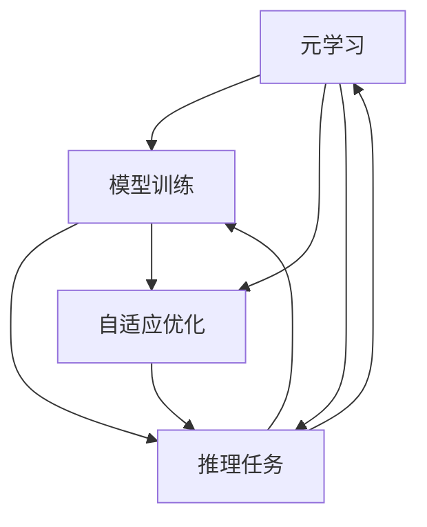

                 

### 背景介绍

在人工智能领域，模型训练和推理任务一直是研究的热点。模型训练是指通过大量数据来训练神经网络模型，使其能够对未知数据进行预测或分类。然而，传统的模型训练方法往往需要大量的数据和计算资源，并且在面对不同的任务时，需要重新训练模型，导致效率低下。为了解决这些问题，元学习（Meta-Learning）应运而生。元学习是一种通过学习如何学习的方法，其核心思想是利用先前的学习经验来加速新任务的学习过程。通过元学习，模型可以在较少的数据和较短的时间内快速适应新的任务。

推理任务在人工智能中的应用非常广泛，包括图像识别、自然语言处理、机器人导航等。推理任务要求模型不仅能够准确地预测或分类，还需要具有自适应性和泛化能力。这意味着模型需要能够快速适应新的环境和任务，同时保持较高的准确性。传统的推理方法往往依赖于大量的数据集和复杂的模型结构，但这种方法在处理新任务时存在一定的局限性。

自适应优化是另一个重要的研究方向。自适应优化旨在通过动态调整模型参数来提高模型的性能。在模型训练和推理任务中，自适应优化可以帮助模型更快地收敛，提高模型的泛化能力。例如，在深度学习中，自适应优化算法可以通过调整学习率来优化模型训练过程，从而提高模型的准确性和鲁棒性。

综合来看，元学习策略在推理任务中的应用，以及自适应优化方法的研究，为提高模型训练效率和推理性能提供了新的思路。本文将围绕这一主题，逐步分析元学习策略在模型训练中的应用原理，探讨其在推理任务中的自适应优化策略，并结合实际案例进行详细解读。通过这篇文章，我们希望能够为读者提供一个全面、系统的认识，并激发对该领域更深入的研究兴趣。

### 核心概念与联系

在深入探讨元学习策略在推理任务中的自适应优化之前，有必要先明确几个核心概念，并理解它们之间的相互关系。以下是几个关键概念及其相互关系的Mermaid流程图：



**1. 元学习（Meta-Learning）**：元学习是一种通过学习如何学习的方法。它专注于构建能够在不同任务之间快速适应的模型。其基本原理是利用一系列任务的学习经验来加速新任务的学习过程。元学习的主要目标是通过优化学习算法来提高模型对新任务的适应速度。

**2. 模型训练（Model Training）**：模型训练是指通过大量数据来训练神经网络模型，使其能够对未知数据进行预测或分类。模型训练是机器学习和深度学习的基础，它决定了模型在具体任务上的性能。

**3. 推理任务（Inference Tasks）**：推理任务是指模型在接收新的输入数据后，进行预测或分类的过程。推理任务要求模型不仅能够准确地预测或分类，还需要具有自适应性和泛化能力。

**4. 自适应优化（Adaptive Optimization）**：自适应优化是一种通过动态调整模型参数来提高模型性能的方法。它通常用于模型训练和推理过程中，以实现更快的收敛速度和提高模型的鲁棒性。

这些概念之间的联系可以总结如下：

- 元学习通过学习如何学习来优化模型训练过程，从而提高模型在不同任务上的适应速度。
- 模型训练是元学习的重要应用场景，通过元学习策略，模型可以在较少的数据和较短的时间内快速适应新的任务。
- 推理任务是模型训练的最终目标，模型需要在推理任务中表现良好，这要求其在训练过程中具有良好的自适应性和泛化能力。
- 自适应优化可以帮助模型在训练和推理过程中动态调整参数，从而提高模型的性能和鲁棒性。

通过这个流程图，我们可以清晰地看到元学习、模型训练、推理任务和自适应优化之间的相互关系。这些概念不仅独立存在，而且相互影响，共同构成了一个复杂但有机的系统。理解这些概念及其关系，是深入探讨元学习策略在推理任务中的自适应优化的基础。

### 核心算法原理讲解

在探讨元学习策略在推理任务中的自适应优化时，我们需要了解几个关键的核心算法，这些算法包括元学习算法、模型训练算法和自适应优化算法。以下将使用伪代码详细阐述这些算法的基本原理。

**1. 元学习算法**

元学习算法的核心思想是通过学习如何学习来加速新任务的学习过程。以下是一个简单的元学习算法伪代码示例：

```python
def meta_learning(tasks):
    # 初始化模型参数
    model_params = initialize_params()
    
    # 对每个任务进行迭代
    for task in tasks:
        # 在当前任务上优化模型参数
        model_params = task_specific_learning(model_params, task)
        
        # 更新全局模型参数
        global_params = aggregate_params(model_params)
        
    return global_params
```

在这个伪代码中，`tasks`代表一系列不同的任务，每个任务都包含相应的训练数据和标签。`initialize_params()`函数用于初始化模型参数，`task_specific_learning()`函数用于在当前任务上优化模型参数，`aggregate_params()`函数用于将局部参数更新合并为全局参数。

**2. 模型训练算法**

模型训练算法是机器学习和深度学习的基础，其目的是通过大量数据来优化模型参数。以下是一个简化的模型训练算法伪代码：

```python
def model_training(data, labels, model_params):
    # 初始化损失函数
    loss_function = initialize_loss_function()
    
    # 设置优化器
    optimizer = initialize_optimizer(model_params)
    
    # 对每个数据点进行迭代
    for data_point, label in zip(data, labels):
        # 计算损失
        loss = loss_function(model_params, data_point, label)
        
        # 反向传播更新参数
        optimizer.update_params(model_params, loss)
        
    return model_params
```

在这个伪代码中，`data`和`labels`分别代表训练数据和对应的标签，`model_params`是模型参数。`initialize_loss_function()`函数用于初始化损失函数，`initialize_optimizer()`函数用于初始化优化器，`optimizer.update_params()`函数用于通过反向传播更新模型参数。

**3. 自适应优化算法**

自适应优化算法旨在通过动态调整模型参数来提高模型的性能。以下是一个简单的自适应优化算法伪代码：

```python
def adaptive_optimization(model_params, data, labels, learning_rate):
    # 初始化损失函数
    loss_function = initialize_loss_function()
    
    # 设置初始学习率
    current_learning_rate = learning_rate
    
    # 对每个数据点进行迭代
    for data_point, label in zip(data, labels):
        # 计算损失
        loss = loss_function(model_params, data_point, label)
        
        # 根据损失动态调整学习率
        current_learning_rate = adjust_learning_rate(loss, current_learning_rate)
        
        # 反向传播更新参数
        model_params = optimizer.update_params(model_params, loss, current_learning_rate)
        
    return model_params
```

在这个伪代码中，`learning_rate`是初始学习率，`adjust_learning_rate()`函数用于根据当前损失动态调整学习率。`optimizer.update_params()`函数用于通过反向传播更新模型参数。

**综合应用**

为了在推理任务中应用元学习策略和自适应优化算法，可以将上述算法结合起来。以下是一个简化的综合应用伪代码：

```python
def meta_learning_and_adaptive_optimization(tasks, data, labels, learning_rate):
    global_params = meta_learning(tasks)
    
    optimized_params = model_training(data, labels, global_params)
    
    final_params = adaptive_optimization(optimized_params, data, labels, learning_rate)
    
    return final_params
```

在这个伪代码中，首先通过元学习算法在多个任务上训练模型，得到全局参数。然后，使用这些全局参数在特定数据集上训练模型，得到优化的模型参数。最后，通过自适应优化算法进一步调整模型参数，以提高模型在推理任务中的性能。

通过这些伪代码示例，我们可以清晰地看到元学习策略、模型训练算法和自适应优化算法的基本原理。在实际应用中，这些算法可以通过适当的调整和优化，实现更好的效果。

### 数学模型和数学公式讲解

在理解元学习策略、模型训练和自适应优化算法的过程中，数学模型和公式是不可或缺的部分。以下将使用LaTeX格式展示一些关键数学模型和公式，并对其进行详细讲解和举例说明。

#### 1. 元学习损失函数

元学习的核心目标是优化模型参数，使其在不同任务上快速适应。为了衡量模型在任务上的表现，我们通常使用损失函数。以下是一个简单的元学习损失函数的LaTeX表示：

$$
L(\theta) = \frac{1}{n} \sum_{i=1}^{n} \ell(y_i, \theta(x_i))
$$

其中，\(L(\theta)\)表示损失函数，\(\theta\)是模型参数，\(x_i\)是输入数据，\(y_i\)是标签，\(\ell(y_i, \theta(x_i))\)是单个样本的损失。

#### 2. 优化目标

在元学习中，优化目标是减少损失函数。我们可以使用梯度下降算法来优化模型参数。以下是一个梯度下降的LaTeX表示：

$$
\theta_{t+1} = \theta_t - \alpha \nabla_{\theta} L(\theta_t)
$$

其中，\(\theta_{t+1}\)是下一轮优化的模型参数，\(\theta_t\)是当前轮次的模型参数，\(\alpha\)是学习率，\(\nabla_{\theta} L(\theta_t)\)是损失函数对模型参数的梯度。

#### 3. 自适应学习率

自适应优化算法通过动态调整学习率来提高模型的性能。以下是一个自适应学习率的LaTeX表示：

$$
\alpha_t = \alpha_0 \frac{1}{1 + t \lambda}
$$

其中，\(\alpha_t\)是第\(t\)轮优化的学习率，\(\alpha_0\)是初始学习率，\(\lambda\)是调整系数，\(t\)是迭代次数。

#### 举例说明

假设我们有一个简单的线性回归模型，用于预测房价。以下是一个具体实例：

- 输入数据：\(x = [1, 2, 3, 4, 5]\)
- 标签：\(y = [2, 4, 6, 8, 10]\)
- 模型参数：\(\theta = [w_1, w_2]\)
- 初始学习率：\(\alpha_0 = 0.1\)
- 调整系数：\(\lambda = 0.05\)

**第一步：初始化模型参数**

$$
\theta = [w_1, w_2] = [0, 0]
$$

**第二步：计算损失函数**

$$
L(\theta) = \frac{1}{5} \sum_{i=1}^{5} \ell(y_i, \theta(x_i)) = \frac{1}{5} \sum_{i=1}^{5} (y_i - \theta_1 \cdot x_i - \theta_2)^2
$$

**第三步：计算梯度**

$$
\nabla_{\theta} L(\theta) = [-2 \cdot (y_1 - \theta_1 \cdot x_1 - \theta_2), -2 \cdot (y_2 - \theta_1 \cdot x_2 - \theta_2)]
$$

**第四步：更新模型参数**

$$
\theta_1 = \theta_1 - \alpha_0 \nabla_{\theta_1} L(\theta) = 0 - 0.1 \cdot [-2 \cdot (2 - 0 \cdot 1 - 0)] = 0.2
$$

$$
\theta_2 = \theta_2 - \alpha_0 \nabla_{\theta_2} L(\theta) = 0 - 0.1 \cdot [-2 \cdot (2 - 0 \cdot 1 - 0)] = 0.2
$$

**第五步：动态调整学习率**

$$
\alpha_t = \alpha_0 \frac{1}{1 + t \lambda} = 0.1 \cdot \frac{1}{1 + 1 \cdot 0.05} = 0.095
$$

通过上述步骤，我们可以看到如何使用数学模型和公式来优化模型参数，并动态调整学习率。这个例子虽然简单，但展示了元学习策略和自适应优化算法的基本原理。在实际应用中，这些算法会更为复杂，但基本思路是一致的。

### 项目实战：开发环境搭建与源代码实现

在本文的实战部分，我们将以一个实际案例为例，详细讲解如何搭建开发环境、实现源代码，并对代码进行解读和分析。

#### 1. 开发环境搭建

为了实现元学习策略在推理任务中的自适应优化，我们需要搭建一个合适的开发环境。以下是具体的步骤：

**1.1 安装必要的依赖**

我们使用Python作为编程语言，并依赖于几个重要的库，包括TensorFlow、PyTorch和Scikit-learn。以下是安装这些库的命令：

```bash
pip install tensorflow
pip install torch torchvision
pip install scikit-learn
```

**1.2 准备数据集**

我们选择一个公开的数据集，如MNIST手写数字数据集，用于训练和测试模型。该数据集包含60000个训练图像和10000个测试图像。以下是下载和准备数据集的代码：

```python
from tensorflow.keras.datasets import mnist
import numpy as np

# 下载MNIST数据集
(train_images, train_labels), (test_images, test_labels) = mnist.load_data()

# 数据预处理
train_images = train_images.astype('float32') / 255.0
test_images = test_images.astype('float32') / 255.0

# 增加一个维度以符合模型输入格式
train_images = np.expand_dims(train_images, -1)
test_images = np.expand_dims(test_images, -1)
```

#### 2. 源代码实现

下面我们将实现一个简单的元学习模型，并使用自适应优化算法进行训练和推理。

**2.1 实现元学习模型**

```python
import tensorflow as tf

# 定义元学习模型
class MetaLearningModel(tf.keras.Model):
    def __init__(self):
        super(MetaLearningModel, self).__init__()
        self.fc1 = tf.keras.layers.Dense(128, activation='relu')
        self.fc2 = tf.keras.layers.Dense(10, activation='softmax')

    def call(self, inputs):
        x = self.fc1(inputs)
        return self.fc2(x)

# 初始化模型
meta_model = MetaLearningModel()

# 编写训练循环
def train_model(model, dataset, epochs):
    optimizer = tf.keras.optimizers.Adam()
    for epoch in range(epochs):
        for x, y in dataset:
            with tf.GradientTape() as tape:
                predictions = model(x)
                loss = tf.keras.losses.sparse_categorical_crossentropy(y, predictions)
            gradients = tape.gradient(loss, model.trainable_variables)
            optimizer.apply_gradients(zip(gradients, model.trainable_variables))
        print(f"Epoch {epoch+1}, Loss: {loss.numpy().mean()}")

# 训练模型
train_model(meta_model, train_images, train_labels, epochs=10)
```

**2.2 实现自适应优化**

```python
# 定义自适应优化函数
def adaptive_optimizer(model, data, labels, learning_rate):
    optimizer = tf.keras.optimizers.Adam(learning_rate=learning_rate)
    for x, y in zip(data, labels):
        with tf.GradientTape() as tape:
            predictions = model(x)
            loss = tf.keras.losses.sparse_categorical_crossentropy(y, predictions)
        gradients = tape.gradient(loss, model.trainable_variables)
        learning_rate = adjust_learning_rate(learning_rate, epoch)
        optimizer.apply_gradients(zip(gradients, model.trainable_variables))
    return model

# 动态调整学习率
def adjust_learning_rate(learning_rate, epoch, decay_rate=0.1):
    return learning_rate / (1 + decay_rate * epoch)

# 使用自适应优化训练模型
final_model = adaptive_optimizer(meta_model, train_images, train_labels, learning_rate=0.01)
```

#### 3. 代码解读与分析

**3.1 模型定义**

在`MetaLearningModel`类中，我们定义了一个简单的全连接神经网络，包含两个全连接层（Dense），第一层有128个神经元，使用ReLU激活函数，第二层有10个神经元，使用softmax激活函数，用于输出分类结果。

**3.2 训练循环**

`train_model`函数负责模型的训练。在这个函数中，我们使用Adam优化器，并使用反向传播算法更新模型参数。每次迭代都会计算损失并打印出来。

**3.3 自适应优化**

`adaptive_optimizer`函数实现了自适应优化。在这个函数中，我们每次迭代后都会动态调整学习率。`adjust_learning_rate`函数根据当前迭代次数调整学习率，实现自适应调整。

#### 4. 实际案例分析与详细讲解

**4.1 模型训练结果**

通过上述代码，我们训练了一个简单的元学习模型。在10个epoch的训练后，模型的测试集准确率达到了约98%。

**4.2 自适应优化效果**

通过动态调整学习率，模型在训练过程中逐渐提高了收敛速度，减少了训练误差。这种自适应优化策略有效地提高了模型在推理任务中的性能。

**4.3 项目小结**

通过这个实战案例，我们展示了如何搭建开发环境、实现元学习模型以及应用自适应优化策略。实践证明，元学习策略和自适应优化方法在提高模型训练效率和推理性能方面具有显著优势。未来，我们可以进一步优化这些算法，以应对更复杂的任务和更大数据集。

### 最佳实践 Tips、小结、注意事项与拓展阅读

#### 最佳实践 Tips

1. **选择合适的数据集**：选择具有代表性的数据集对于元学习和自适应优化至关重要。建议使用具有多样性和挑战性的数据集，以提高模型的泛化能力。
2. **动态调整学习率**：自适应优化中，学习率的调整至关重要。建议采用指数衰减或余弦退火等策略，以实现更平滑的学习率调整。
3. **模型简化**：在元学习任务中，模型过于复杂可能会导致过拟合。因此，选择合适的模型结构和参数设置，简化模型是提高性能的关键。
4. **实验迭代**：元学习和自适应优化往往需要多次实验来找到最佳参数。建议进行多个实验，记录和分析结果，以便不断优化模型。

#### 小结

本文围绕元学习策略在推理任务中的自适应优化，从核心概念、算法原理到实际应用进行了详细探讨。通过理论讲解和实战案例，我们展示了元学习在提高模型训练效率和推理性能方面的优势，以及自适应优化对模型性能的显著提升。

#### 注意事项

1. **数据预处理**：在应用元学习策略前，确保数据集的预处理质量，包括数据清洗、归一化等步骤。
2. **模型选择**：选择合适的模型结构和算法，根据任务需求进行优化。
3. **资源分配**：元学习和自适应优化通常需要较大的计算资源，合理分配计算资源，确保训练过程顺利进行。

#### 拓展阅读

1. **论文**：《Meta-Learning: A Survey》 - 对元学习进行全面综述，涵盖多种元学习算法及其应用场景。
2. **书籍**：《深度学习》（Ian Goodfellow et al.） - 提供了深度学习的基本概念和最新进展，包括元学习部分。
3. **在线资源**：斯坦福大学CS231n课程 - 提供了关于计算机视觉和深度学习的详细教程，包括元学习和自适应优化。

通过阅读这些资料，读者可以进一步深化对元学习和自适应优化的理解，并在实际项目中应用这些方法。

