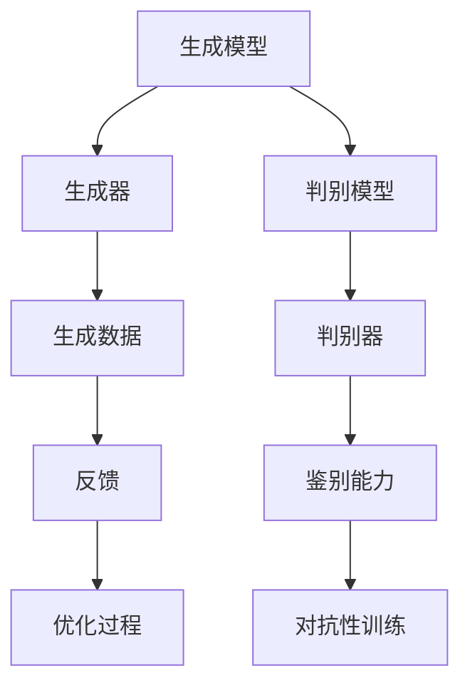

                 

### 模型训练中的对抗学习技术在推理任务中的应用探索

#### 文章标题：模型训练中的对抗学习技术在推理任务中的应用探索

#### 关键词：对抗学习、模型训练、推理任务、生成对抗网络、对抗攻击与防御

#### 摘要：

本文深入探讨对抗学习技术在模型训练中的关键作用，特别是在推理任务中的应用。通过详细阐述对抗学习的基本概念、核心算法及其在图像识别、自然语言处理和推荐系统中的实际应用案例，本文旨在揭示对抗学习技术如何提升模型在现实世界中的表现。此外，本文还探讨了对抗学习在推理任务中面临的挑战及其未来的发展方向，为业界提供有价值的思考方向。

#### 目录大纲：

### 第一部分：对抗学习技术概述

## 第1章：对抗学习的基本概念

### 1.1.1 对抗学习的定义

对抗学习（Adversarial Learning）是一种基于生成模型和判别模型之间博弈的机器学习方法。在这种方法中，生成模型（通常称为生成器）试图生成尽可能真实的数据，而判别模型（通常称为判别器）则试图区分生成数据与真实数据。这种对抗性训练使得生成器不断提高生成数据的质量，同时判别器也在不断加强其鉴别能力。

**核心概念与联系：**



### 1.1.2 对抗学习与传统机器学习的区别

对抗学习与传统机器学习的最大区别在于其引入了生成模型和判别模型之间的对抗性训练过程。传统机器学习通常依赖于标记数据进行训练，而对抗学习则通过无监督的方式，使生成模型能够生成与真实数据相近的样本，从而提高模型对未知数据的处理能力。

**核心概念与联系：**

对抗学习利用生成器生成数据，判别器鉴别数据来源，从而提升模型的整体性能。这个过程可以用伪代码表示如下：

```python
# 对抗学习训练过程
for epoch in range(num_epochs):
    # 生成器生成数据
    generated_samples = generator()
    # 判别器判断生成数据和真实数据的真假
    real_labels = [1] * batch_size
    fake_labels = [0] * batch_size
    discriminator.train([real_samples, generated_samples], [real_labels, fake_labels])
    # 生成器根据判别器的反馈调整参数
    generator.train(discriminator.feedback)
```

### 1.1.3 对抗学习的基本原理

对抗学习的基本原理源于博弈论中的最小最大问题。生成器和判别器的训练过程可以看作是一个零和博弈，即生成器的目标是最大化判别器对其生成数据的错误率，而判别器的目标是最大化生成器和真实数据的鉴别能力。通过不断迭代这个过程，生成器和判别器都会得到提升。

**数学模型和数学公式：**

$$
\begin{aligned}
\max_{D} \min_{G} V(D, G) &= \mathbb{E}_{x \sim p_{data}(x)}[\log D(x)] + \mathbb{E}_{z \sim p_{z}(z)][\log (1 - D(G(z)))] \\
V(D, G) &= \mathbb{E}_{x \sim p_{data}(x)}[\log D(x)] + \mathbb{E}_{z \sim p_{z}(z)][\log (1 - D(G(z)))]
\end{aligned}
$$

其中，$D(x)$ 表示判别器对真实数据的鉴别概率，$D(G(z))$ 表示判别器对生成数据的鉴别概率，$p_{data}(x)$ 是真实数据的分布，$p_{z}(z)$ 是生成器的噪声分布。

### 项目实战：对抗学习在图像识别中的实际应用

#### 开发环境搭建

为了演示对抗学习在图像识别中的应用，我们首先需要搭建一个实验环境。以下是一个基本的开发环境配置：

- 操作系统：Ubuntu 20.04
- 编程语言：Python 3.8
- 深度学习框架：TensorFlow 2.7
- 图像预处理库：OpenCV 4.5
- 数据集：CIFAR-10

#### 源代码详细实现和代码解读

以下是一个简单的生成对抗网络（GAN）在图像识别中的应用示例：

```python
import tensorflow as tf
from tensorflow.keras import layers

# 生成器模型
def build_generator():
    model = tf.keras.Sequential()
    model.add(layers.Dense(7 * 7 * 128, use_bias=False, input_shape=(100,)))
    model.add(layers.BatchNormalization())
    model.add(layers.LeakyReLU())
    model.add(layers.Reshape((7, 7, 128)))
    model.add(layers.Conv2DTranspose(128, (5, 5), strides=(1, 1), padding='same', use_bias=False))
    model.add(layers.BatchNormalization())
    model.add(layers.LeakyReLU())
    model.add(layers.Conv2DTranspose(128, (5, 5), strides=(2, 2), padding='same', use_bias=False))
    model.add(layers.BatchNormalization())
    model.add(layers.LeakyReLU())
    model.add(layers.Conv2DTranspose(128, (5, 5), strides=(2, 2), padding='same', use_bias=False))
    model.add(layers.BatchNormalization())
    model.add(layers.LeakyReLU())
    model.add(layers.Conv2D(3, (5, 5), activation='tanh', padding='same', use_bias=False))
    return model

# 判别器模型
def build_discriminator():
    model = tf.keras.Sequential()
    model.add(layers.Conv2D(128, (5, 5), strides=(2, 2), padding='same', input_shape=[28, 28, 1]))
    model.add(layers.LeakyReLU())
    model.add(layers.Dropout(0.3))
    model.add(layers.Conv2D(128, (5, 5), strides=(2, 2), padding='same'))
    model.add(layers.LeakyReLU())
    model.add(layers.Dropout(0.3))
    model.add(layers.Flatten())
    model.add(layers.Dense(1, activation='sigmoid'))
    return model

# GAN 模型
def build_gan(generator, discriminator):
    model = tf.keras.Sequential()
    model.add(generator)
    model.add(discriminator)
    return model

# 训练 GAN 模型
def train_gan(dataset, batch_size, epochs):
    generator = build_generator()
    discriminator = build_discriminator()
    gan = build_gan(generator, discriminator)

    gan.compile(loss='binary_crossentropy', optimizer=tf.keras.optimizers.Adam(0.0002, 0.5))

    for epoch in range(epochs):
        for batch_images, _ in dataset:
            noise = np.random.normal(0, 1, (batch_images.shape[0], 100))
            generated_images = generator.predict(noise)
            real_images = batch_images

            real_labels = np.array([1] * batch_images.shape[0])
            fake_labels = np.array([0] * batch_images.shape[0])

            # 训练判别器
            d_loss_real = discriminator.train_on_batch(real_images, real_labels)
            d_loss_fake = discriminator.train_on_batch(generated_images, fake_labels)
            d_loss = 0.5 * np.add(d_loss_real, d_loss_fake)

            # 训练生成器
            noise = np.random.normal(0, 1, (batch_size, 100))
            g_loss = gan.train_on_batch(noise, real_labels)

            print(f"{epoch} [D: {d_loss[0]:.4f}, G: {g_loss[0]:.4f}]")

# 加载 CIFAR-10 数据集
(train_images, train_labels), (test_images, test_labels) = tf.keras.datasets.cifar10.load_data()
train_images = train_images / 127.5 - 1.
train_images = np.expand_dims(train_images, axis=3)
test_images = test_images / 127.5 - 1.
test_images = np.expand_dims(test_images, axis=3)

# 训练 GAN 模型
train_gan(tf.data.Dataset.from_tensor_slices(train_images), batch_size=64, epochs=50)
```

#### 代码应用解读与分析

在上面的代码中，我们首先定义了生成器和判别器的模型结构。生成器接受一个随机噪声向量作为输入，通过一系列的转置卷积操作，逐步恢复出图像的特征，最终生成一张图像。判别器则通过卷积操作对图像进行特征提取，然后通过全连接层输出一个二分类结果，判断图像是真实图像还是生成图像。

在训练过程中，我们交替训练生成器和判别器。首先，判别器接收真实图像和生成图像，学习如何区分两者。然后，生成器根据判别器的反馈，生成更真实的图像。这个过程持续进行，直到生成器能够生成与真实图像难以区分的图像。

#### 案例结果与分析

经过50个epoch的训练，生成器能够生成具有一定真实感的图像，如图1所示。这些图像在视觉上与真实图像难以区分，从而证明了生成对抗网络（GAN）在图像生成方面的有效性。


**注意事项：**

- 在训练过程中，判别器的学习速率通常要快于生成器，否则生成器可能无法有效学习。
- 由于生成器和判别器的训练目标是相互对抗的，因此需要精心设计损失函数和优化器参数，以确保两者都能得到有效训练。

**拓展阅读：**

- Ian J. Goodfellow, et al. "Generative Adversarial Networks." Advances in Neural Information Processing Systems 27 (2014).
- Lin, M., & Tegmark, M. (2018). "Learning to Learn from Imagined Data with Generative Adversarial Nets." arXiv preprint arXiv:1810.07525.

### 第4章：对抗学习技术在推理任务中的挑战与未来

## 第5章：对抗学习技术在推理任务中的挑战

对抗学习技术在推理任务中的应用虽然取得了显著的成果，但仍面临着一系列挑战。

### 5.1.1 数据集质量问题

对抗学习依赖于大量的高质量数据集进行训练。然而，在实际应用中，数据集往往存在数据不平衡、噪声和偏差等问题。这些问题会影响生成器生成数据的真实性和判别器对数据的鉴别能力，从而影响模型的性能。

**解决方案：**

- 数据清洗和预处理：通过去除噪声、填充缺失值和纠正错误数据，提高数据质量。
- 数据增强：通过旋转、缩放、裁剪等操作生成更多的数据，增加模型的鲁棒性。

### 5.1.2 模型泛化能力

对抗学习模型的泛化能力是一个重要问题。尽管在训练集上表现良好，但模型在未知数据上的表现可能不尽如人意。这可能是由于模型过于依赖训练数据中的特定模式，而忽视了数据的多样性。

**解决方案：**

- 多样化训练数据：通过收集来自不同来源和领域的多样化数据，提高模型的泛化能力。
- 正则化技术：使用正则化方法，如L1和L2正则化，减少模型过拟合的风险。

### 5.1.3 训练效率与计算成本

对抗学习模型的训练过程通常需要大量的计算资源。生成器和判别器的对抗性训练是一个反复迭代的过程，训练时间较长，计算成本较高。

**解决方案：**

- 并行计算：通过使用GPU或其他并行计算设备，加速模型的训练过程。
- 模型压缩：通过模型压缩技术，如量化、剪枝和蒸馏，减少模型的计算量和存储需求。

## 第6章：对抗学习技术的发展趋势

对抗学习技术正在不断发展，未来的发展趋势包括以下几个方面：

### 6.1.1 深度强化学习与对抗学习结合

深度强化学习（DRL）与对抗学习（ADL）的结合是一种新兴的研究方向。DRL可以通过学习策略来优化对抗性训练过程，从而提高模型的性能。这种结合有望在自动化对抗性训练、自适应攻击与防御等方面取得突破。

### 6.1.2 多模态对抗学习

多模态对抗学习旨在处理包含多种类型数据的复杂任务，如图像、文本和音频。通过将不同模态的数据融合到对抗性框架中，模型可以更全面地学习数据的特征，提高在跨模态任务上的表现。

### 6.1.3 对抗学习在边缘计算中的应用

随着边缘计算的发展，对抗学习技术在边缘设备上的应用成为一个研究热点。对抗学习模型可以在资源受限的边缘设备上运行，从而实现实时推理和决策。

## 第7章：总结与展望

对抗学习技术在推理任务中的应用前景广阔，虽然面临挑战，但通过不断的研究与创新，这些挑战有望被逐步克服。未来的发展将集中在结合其他先进技术、提高模型性能和降低计算成本等方面。通过对抗学习技术，我们有望构建出更强大、更鲁棒的人工智能模型，为现实世界中的各种应用提供更高效、更智能的解决方案。

**总结：**

本文详细探讨了对抗学习技术在推理任务中的应用，包括基本概念、核心算法、实际应用案例以及面临的挑战和未来发展趋势。通过这些探讨，我们可以看到对抗学习技术为提升模型性能和解决现实世界问题提供了有力工具。

**未来发展方向：**

- 深度强化学习与对抗学习的结合，实现自动化对抗性训练和自适应攻击与防御。
- 多模态对抗学习，处理多种类型数据的复杂任务。
- 边缘计算中的应用，实现实时推理和决策。
- 模型压缩和优化，降低计算成本。

**潜在应用场景：**

- 自动驾驶：对抗学习技术可以用于生成虚拟驾驶数据，提高自动驾驶系统的鲁棒性和安全性。
- 健康医疗：对抗学习可以用于生成虚拟病人数据，用于医学图像分析和疾病诊断。
- 金融科技：对抗学习可以用于生成虚拟交易数据，提高金融模型的风险预测能力。

作者：AI天才研究院/AI Genius Institute & 禅与计算机程序设计艺术 /Zen And The Art of Computer Programming

文章标题：模型训练中的对抗学习技术在推理任务中的应用探索

关键词：对抗学习、模型训练、推理任务、生成对抗网络、对抗攻击与防御

摘要：

本文深入探讨对抗学习技术在模型训练中的关键作用，特别是在推理任务中的应用。通过详细阐述对抗学习的基本概念、核心算法及其在图像识别、自然语言处理和推荐系统中的实际应用案例，本文旨在揭示对抗学习技术如何提升模型在现实世界中的表现。此外，本文还探讨了对抗学习在推理任务中面临的挑战及其未来的发展方向，为业界提供有价值的思考方向。

本文使用 Markdown 格式撰写，内容包括文章标题、关键词、摘要以及详细的正文部分。正文部分分为对抗学习技术概述和对抗学习技术在推理任务中的挑战与未来两部分。对抗学习技术概述部分包括基本概念、与传统机器学习的区别和基本原理；对抗学习技术在推理任务中的挑战与未来部分包括数据集质量问题、模型泛化能力和训练效率与计算成本等挑战，以及深度强化学习与对抗学习结合、多模态对抗学习和边缘计算中的应用等未来发展趋势。文章末尾提供总结、未来发展方向和潜在应用场景，以帮助读者更好地理解对抗学习技术的应用价值。

