                 

### 文章标题
### 模型训练中的对抗样本生成与防御技术

关键词：对抗样本、模型训练、生成对抗、防御技术、安全深度学习

摘要：
在深度学习领域，对抗样本（Adversarial Examples）是一种通过微小的扰动使模型作出错误判断的样本。这些样本对于模型的稳健性和安全性构成了严重威胁。本文将详细介绍对抗样本的生成方法及其防御技术，帮助读者深入理解这一重要议题，并探讨未来的研究方向。

# 第一部分：对抗样本生成技术

## 第1章：对抗样本基础理论

### 1.1.1 抗样本概念及分类

**背景介绍**

对抗样本是深度学习领域的一个重要研究方向，它揭示了深度学习模型在安全性和鲁棒性方面的潜在问题。对抗样本指的是那些在原始数据上添加微小扰动后，能够使深度学习模型产生错误判断的样本。这种扰动通常是针对模型的敏感性进行优化的，使其在测试阶段无法正常工作。

**核心概念与联系**

- 抗样本（Adversarial Examples）：对抗样本是一种针对深度学习模型的攻击手段，通过在原始样本上添加微小的扰动，使其在测试阶段无法正常工作。
- 测试样本（Test Examples）：测试样本是用于验证模型性能的数据集，通常是模型训练完成后从未见过的样本。
- 模型敏感性（Model Sensitivity）：模型敏感性指的是模型对于输入数据的微小变化产生不同预测结果的倾向。

**Mermaid流程图**

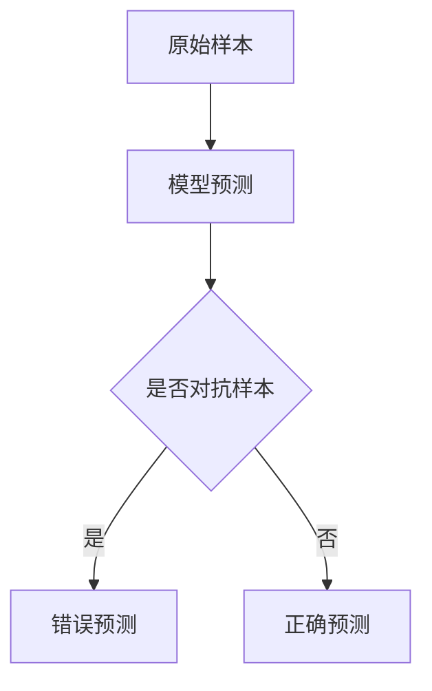

**核心算法原理讲解**

对抗样本的生成通常是基于模型梯度信息的。具体来说，攻击者会通过优化扰动，使得模型在对抗样本上的预测与实际标签不一致。以下是FGSM（Fast Gradient Sign Method）算法的伪代码：

```python
# 输入：模型 f，样本 x，学习率 alpha

# 计算模型在 x 上的梯度
gradient = gradient_of_loss_with_respect_to_x(f, x, y)

# 生成对抗样本
adv_x = x + alpha * sign(gradient)
```

**数学模型和公式**

损失函数是评估模型性能的重要指标。对于分类问题，常用的损失函数是交叉熵损失函数。交叉熵损失函数的数学公式如下：

$$
L(y, \hat{y}) = -\sum_{i} y_i \log (\hat{y}_i)
$$

其中，\( y \) 是真实标签，\( \hat{y} \) 是模型预测的概率分布。

**举例说明**

假设我们有一个二分类问题，标签 \( y \) 只有两个值：0 和 1。模型预测的概率分布 \( \hat{y} \) 也是两个值。如果模型的预测概率 \( \hat{y} \) 接近 1，说明模型认为样本属于正类；如果 \( \hat{y} \) 接近 0，说明模型认为样本属于负类。

现在我们希望生成一个对抗样本，使得模型将其判定为错误的类别。可以通过以下步骤实现：

1. 选择一个原本正确的样本 \( x_0 \) 和其对应的标签 \( y_0 \)。
2. 计算模型在 \( x_0 \) 上的预测概率 \( \hat{y}_0 \)。
3. 计算对抗样本 \( x_1 \)，其扰动大小为 \( \epsilon \)，即 \( x_1 = x_0 + \epsilon \cdot \text{sign}(\nabla_{x} L(\theta; x_0, y_0)) \)。
4. 重新计算模型在 \( x_1 \) 上的预测概率 \( \hat{y}_1 \)。
5. 如果 \( \hat{y}_1 \neq y_0 \)，则 \( x_1 \) 为一个对抗样本。

### 1.1.2 抗样本检测原理

**背景介绍**

对抗样本检测是防止对抗样本攻击的重要手段。通过检测并过滤掉对抗样本，可以保护模型的稳定性和可靠性。

**核心概念与联系**

- 抗样本检测（Adversarial Example Detection）：对抗样本检测是指通过检测样本的扰动程度，判断其是否为对抗样本的过程。
- 样本扰动（Sample Perturbation）：样本扰动是指对抗样本与原始样本之间的差异。
- 检测方法：包括基于规则的方法、基于机器学习的方法和基于深度学习的方法。

**Mermaid流程图**

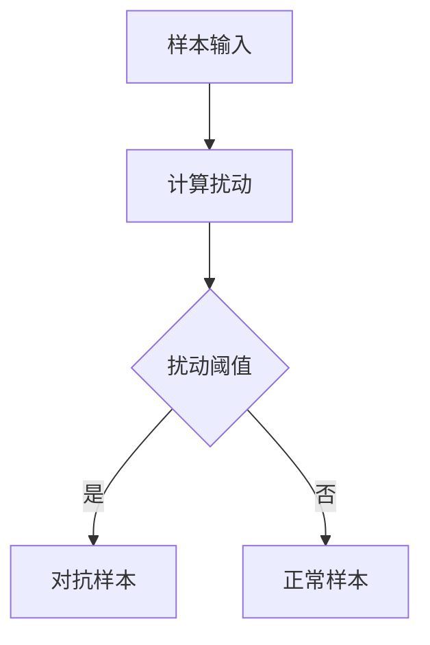

**核心算法原理讲解**

基于机器学习的检测方法通常采用以下步骤：

1. 收集对抗样本和正常样本。
2. 使用特征提取方法提取样本特征。
3. 使用分类算法训练一个检测器。
4. 对新样本进行特征提取，并使用检测器判断其是否为对抗样本。

以下是一个简单的特征提取和分类的伪代码：

```python
# 输入：样本数据集 X，标签 Y

# 特征提取
features = extract_features(X)

# 训练分类器
classifier = train_classifier(features, Y)

# 检测新样本
new_sample = extract_features(new_sample_data)
is_adversarial = classifier.predict(new_sample)
```

**数学模型和公式**

假设我们使用的是支持向量机（SVM）作为分类器，其决策函数为：

$$
w \cdot x - b = 0
$$

其中，\( w \) 是权重向量，\( x \) 是样本特征，\( b \) 是偏置项。如果 \( w \cdot x - b < 0 \)，则认为样本为对抗样本。

**举例说明**

假设我们有一个简单的线性分类器，其决策函数为 \( w \cdot x - b = 0 \)。现在我们希望检测一个对抗样本。可以通过以下步骤实现：

1. 计算对抗样本 \( x_1 \) 的特征向量 \( x_1^{'} \)。
2. 计算权重向量 \( w \) 和偏置项 \( b \)。
3. 计算决策函数 \( w \cdot x_1^{'} - b \)。
4. 如果 \( w \cdot x_1^{'} - b < 0 \)，则认为 \( x_1 \) 是对抗样本。

### 1.1.3 抗样本生成技术概述

**背景介绍**

抗样本生成技术是攻击者为了破坏模型稳定性而采用的方法。这些方法可以根据攻击目的、攻击对象和攻击效果进行分类。

**核心概念与联系**

- 攻击目的：攻击者可能希望使模型完全失效、误导模型或降低模型性能。
- 攻击对象：攻击者可能针对特定模型、特定数据集或特定应用场景进行攻击。
- 攻击效果：攻击效果可以分为完全攻击、半攻击和弱攻击。

**Mermaid流程图**

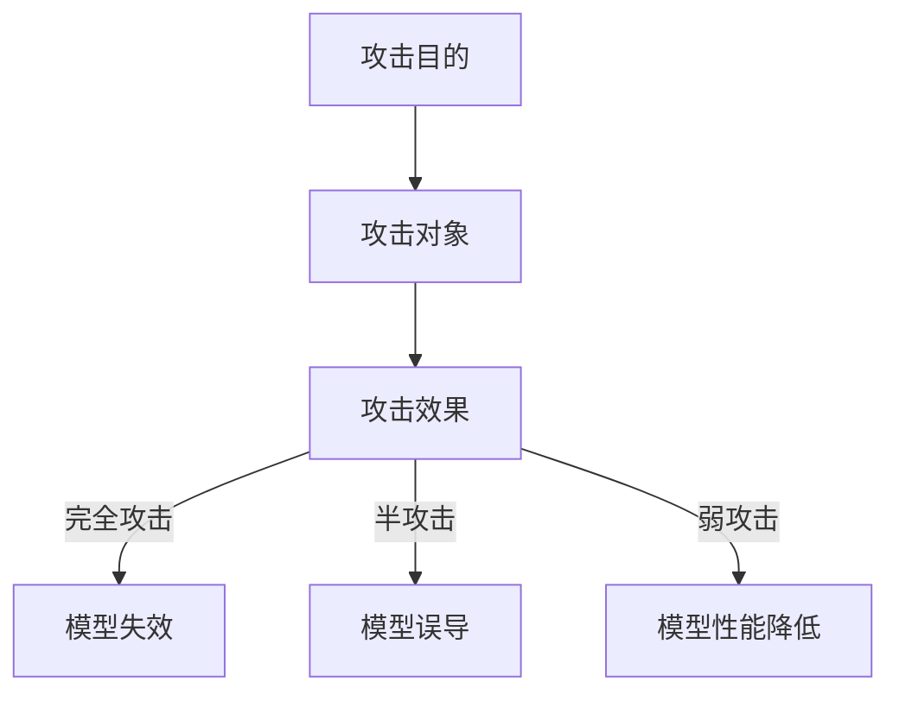

**核心算法原理讲解**

常见的抗样本生成算法包括FGSM（Fast Gradient Sign Method）、JSMA（Jacobian-based Saliency Map Attack）和C&W（Carlini & Wagner）算法。

1. FGSM算法：利用模型梯度信息生成对抗样本，具体步骤如下：

```python
# 输入：模型 f，样本 x，标签 y，学习率 alpha

# 计算模型在 x 上的梯度
gradient = gradient_of_loss_with_respect_to_x(f, x, y)

# 生成对抗样本
adv_x = x + alpha * sign(gradient)
```

2. JSMA算法：基于Jacobian矩阵生成对抗样本，具体步骤如下：

```python
# 输入：模型 f，样本 x，标签 y，学习率 alpha

# 计算Jacobian矩阵
Jacobian = calculate_Jacobian(f, x, y)

# 生成对抗样本
adv_x = x + alpha * calculate_saliency_map(Jacobian)
```

3. C&W算法：通过优化目标函数生成对抗样本，具体步骤如下：

```python
# 输入：模型 f，样本 x，标签 y，学习率 alpha

# 定义优化目标函数
objective_function = objective_function_to_optimize(f, x, y)

# 生成对抗样本
adv_x = optimize_objective_function(objective_function, x, alpha)
```

**数学模型和公式**

C&W算法的优化目标函数为：

$$
\min_{\epsilon} \frac{1}{2} \epsilon^2 + \max(0, \Delta - \log(\frac{\exp(\Delta)}{1 + \exp(\Delta)}))
$$

其中，\( \Delta = \log(\frac{\hat{y}_+}{\hat{y}_-}) \)，\( \hat{y}_+ \) 和 \( \hat{y}_- \) 分别为模型对于正类和负类的预测概率。

**举例说明**

假设我们使用FGSM算法生成对抗样本。具体步骤如下：

1. 选择一个原始样本 \( x \) 和其对应的标签 \( y \)。
2. 计算模型在 \( x \) 上的梯度 \( \nabla_x L(x, y) \)。
3. 设定学习率 \( \alpha \)。
4. 生成对抗样本 \( x' = x + \alpha \cdot \text{sign}(\nabla_x L(x, y)) \)。

通过上述步骤，我们可以生成一个对抗样本 \( x' \)，使得模型对其产生错误判断。

## 第2章：对抗样本生成算法

### 2.1.1 FGSM算法原理及实现

**背景介绍**

FGSM（Fast Gradient Sign Method）是一种简单有效的对抗样本生成方法。它通过计算模型在训练数据上的梯度信息，生成对抗样本。FGSM算法因其实现简单、效果显著而广泛应用于对抗样本生成的研究和实际应用中。

**核心概念与联系**

- FGSM：Fast Gradient Sign Method，快速梯度符号法。
- 梯度信息：模型在训练数据上的梯度信息，用于指导对抗样本的生成。
- 对抗样本：对抗样本是指那些在原始数据上添加微小扰动后，能够使模型产生错误判断的样本。

**Mermaid流程图**

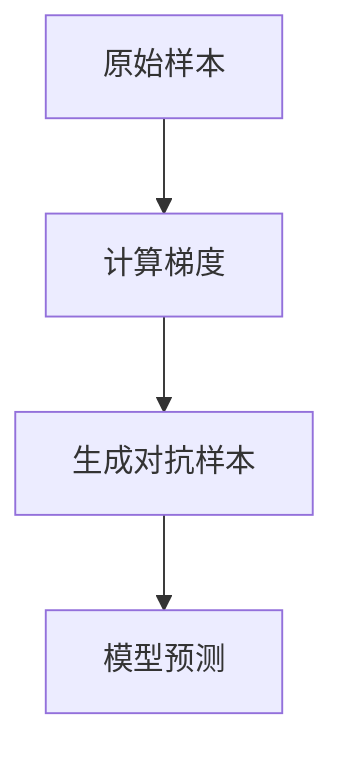

**核心算法原理讲解**

FGSM算法的核心思想是利用模型在训练数据上的梯度信息，生成对抗样本。以下是FGSM算法的伪代码：

```python
# 输入：模型 f，样本 x，标签 y，学习率 alpha

# 计算模型在 x 上的梯度
gradient = gradient_of_loss_with_respect_to_x(f, x, y)

# 生成对抗样本
adv_x = x + alpha * sign(gradient)
```

具体步骤如下：

1. **计算梯度**：首先，我们需要计算模型在原始样本 \( x \) 上的梯度 \( \nabla_x L(x, y) \)，其中 \( L \) 是损失函数，\( y \) 是标签。

2. **生成对抗样本**：然后，利用计算得到的梯度信息，按照学习率 \( \alpha \) 生成对抗样本 \( x' \)。公式为 \( x' = x + \alpha \cdot \text{sign}(\nabla_x L(x, y)) \)。

3. **模型预测**：最后，使用生成的对抗样本 \( x' \) 进行模型预测，判断是否为对抗样本。

**数学模型和公式**

在FGSM算法中，损失函数通常采用交叉熵损失函数，其公式为：

$$
L(y, \hat{y}) = -\sum_{i} y_i \log (\hat{y}_i)
$$

其中，\( y \) 是真实标签，\( \hat{y} \) 是模型预测的概率分布。

梯度 \( \nabla_x L(x, y) \) 可以通过反向传播算法计算得到。

**举例说明**

假设我们有一个二分类问题，标签 \( y \) 只有两个值：0 和 1。模型预测的概率分布 \( \hat{y} \) 也是两个值。如果模型的预测概率 \( \hat{y} \) 接近 1，说明模型认为样本属于正类；如果 \( \hat{y} \) 接近 0，说明模型认为样本属于负类。

现在我们希望生成一个对抗样本，使得模型将其判定为错误的类别。可以通过以下步骤实现：

1. 选择一个原本正确的样本 \( x_0 \) 和其对应的标签 \( y_0 \)。

2. 计算模型在 \( x_0 \) 上的预测概率 \( \hat{y}_0 \)。

3. 计算对抗样本 \( x_1 \)，其扰动大小为 \( \epsilon \)，即 \( x_1 = x_0 + \epsilon \cdot \text{sign}(\nabla_{x} L(\theta; x_0, y_0)) \)。

4. 重新计算模型在 \( x_1 \) 上的预测概率 \( \hat{y}_1 \)。

5. 如果 \( \hat{y}_1 \neq y_0 \)，则 \( x_1 \) 为一个对抗样本。

### 2.1.2 JSMA算法原理及实现

**背景介绍**

JSMA（Jacobian-based Saliency Map Attack）算法是一种基于Jacobian矩阵的对抗样本生成方法。与FGSM算法不同，JSMA算法利用Jacobian矩阵来计算样本的敏感性，从而生成更有效的对抗样本。JSMA算法在生成对抗样本时，考虑了模型的非线性特性，因此其生成对抗样本的效果通常优于FGSM算法。

**核心概念与联系**

- JSMA：Jacobian-based Saliency Map Attack，基于Jacobian矩阵的显著性图攻击。
- Jacobian矩阵：Jacobian矩阵是描述函数变化率的矩阵，可以用来表示模型在输入空间的敏感性。
- 对抗样本：对抗样本是通过在原始数据上添加微小扰动，使模型产生错误判断的样本。

**Mermaid流程图**

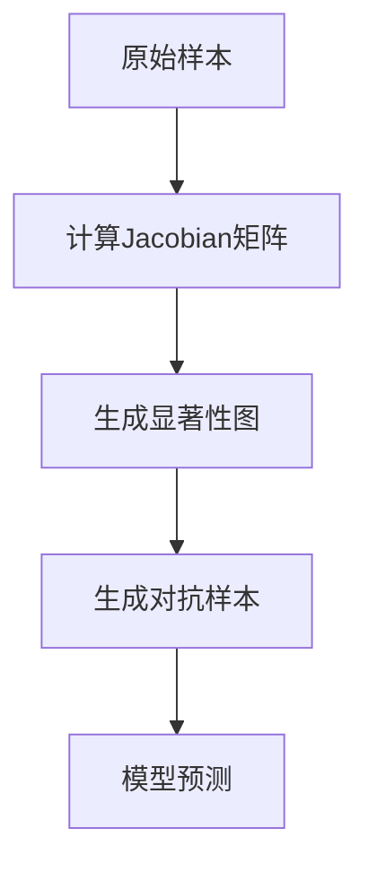

**核心算法原理讲解**

JSMA算法的核心思想是利用Jacobian矩阵计算样本的敏感性，从而生成对抗样本。以下是JSMA算法的伪代码：

```python
# 输入：模型 f，样本 x，标签 y，学习率 alpha

# 计算Jacobian矩阵
Jacobian = calculate_Jacobian(f, x, y)

# 生成显著性图
saliency_map = calculate_saliency_map(Jacobian)

# 生成对抗样本
adv_x = x + alpha * saliency_map
```

具体步骤如下：

1. **计算Jacobian矩阵**：首先，我们需要计算模型在原始样本 \( x \) 上的Jacobian矩阵 \( J \)。Jacobian矩阵可以用来表示模型对输入的敏感性。

2. **生成显著性图**：然后，利用计算得到的Jacobian矩阵，生成显著性图 \( s \)。显著性图表示了模型对每个特征的敏感性。

3. **生成对抗样本**：最后，利用显著性图生成对抗样本 \( x' \)。对抗样本的扰动大小为 \( \alpha \)，即 \( x' = x + \alpha \cdot s \)。

4. **模型预测**：使用生成的对抗样本 \( x' \) 进行模型预测，判断是否为对抗样本。

**数学模型和公式**

Jacobian矩阵的公式为：

$$
J = \frac{\partial f}{\partial x}
$$

其中，\( f \) 是模型函数，\( x \) 是输入。

显著性图 \( s \) 的计算公式为：

$$
s = \text{sign}(J \cdot \nabla_y f)
$$

其中，\( \nabla_y f \) 是模型对标签的梯度。

**举例说明**

假设我们有一个二分类问题，标签 \( y \) 只有两个值：0 和 1。模型预测的概率分布 \( \hat{y} \) 也是两个值。如果模型的预测概率 \( \hat{y} \) 接近 1，说明模型认为样本属于正类；如果 \( \hat{y} \) 接近 0，说明模型认为样本属于负类。

现在我们希望生成一个对抗样本，使得模型将其判定为错误的类别。可以通过以下步骤实现：

1. 选择一个原本正确的样本 \( x_0 \) 和其对应的标签 \( y_0 \)。

2. 计算模型在 \( x_0 \) 上的Jacobian矩阵 \( J_0 \)。

3. 计算显著性图 \( s_0 \)。

4. 生成对抗样本 \( x_1 \)，其扰动大小为 \( \epsilon \)，即 \( x_1 = x_0 + \epsilon \cdot s_0 \)。

5. 重新计算模型在 \( x_1 \) 上的预测概率 \( \hat{y}_1 \)。

6. 如果 \( \hat{y}_1 \neq y_0 \)，则 \( x_1 \) 为一个对抗样本。

### 2.1.3 C&W算法原理及实现

**背景介绍**

C&W（Carlini & Wagner）算法是一种基于优化目标的对抗样本生成方法。与FGSM和JSMA算法不同，C&W算法通过优化一个目标函数来生成对抗样本。C&W算法的优点在于其生成的对抗样本具有更高的攻击性和鲁棒性，因此被广泛应用于对抗样本生成的研究和实际应用中。

**核心概念与联系**

- C&W：Carlini & Wagner，卡里尼和瓦格纳算法。
- 优化目标：C&W算法通过优化一个目标函数来生成对抗样本。
- 对抗样本：对抗样本是通过在原始数据上添加微小扰动，使模型产生错误判断的样本。

**Mermaid流程图**

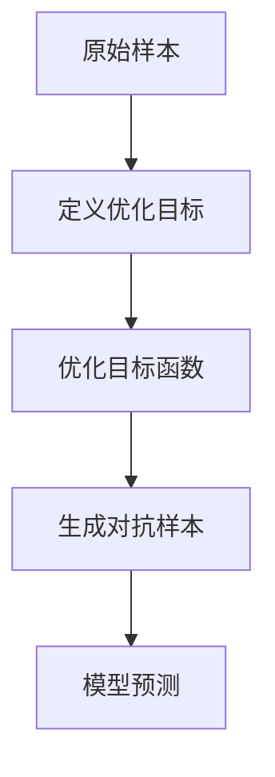

**核心算法原理讲解**

C&W算法的核心思想是定义一个优化目标函数，通过优化该目标函数来生成对抗样本。以下是C&W算法的伪代码：

```python
# 输入：模型 f，样本 x，标签 y，学习率 alpha

# 定义优化目标函数
objective_function = objective_function_to_optimize(f, x, y)

# 生成对抗样本
adv_x = optimize_objective_function(objective_function, x, alpha)
```

具体步骤如下：

1. **定义优化目标函数**：首先，我们需要定义一个优化目标函数 \( \Omega \)。C&W算法使用的优化目标函数如下：

   $$
   \Omega = \frac{1}{2} \epsilon^2 + \max(0, \Delta - \log(\frac{\exp(\Delta)}{1 + \exp(\Delta)}))
   $$

   其中，\( \epsilon \) 是扰动大小，\( \Delta = \log(\frac{\hat{y}_+}{\hat{y}_-}) \)，\( \hat{y}_+ \) 和 \( \hat{y}_- \) 分别为模型对于正类和负类的预测概率。

2. **优化目标函数**：然后，利用优化算法（如梯度下降法）优化目标函数 \( \Omega \)。优化过程会找到最优的扰动 \( \epsilon \)，使得对抗样本 \( x' \) 能够使模型产生错误判断。

3. **生成对抗样本**：最后，使用计算得到的扰动 \( \epsilon \) 生成对抗样本 \( x' \)。

4. **模型预测**：使用生成的对抗样本 \( x' \) 进行模型预测，判断是否为对抗样本。

**数学模型和公式**

C&W算法的优化目标函数为：

$$
\Omega = \frac{1}{2} \epsilon^2 + \max(0, \Delta - \log(\frac{\exp(\Delta)}{1 + \exp(\Delta)}))
$$

其中，\( \Delta = \log(\frac{\hat{y}_+}{\hat{y}_-}) \)，\( \hat{y}_+ \) 和 \( \hat{y}_- \) 分别为模型对于正类和负类的预测概率。

**举例说明**

假设我们有一个二分类问题，标签 \( y \) 只有两个值：0 和 1。模型预测的概率分布 \( \hat{y} \) 也是两个值。如果模型的预测概率 \( \hat{y} \) 接近 1，说明模型认为样本属于正类；如果 \( \hat{y} \) 接近 0，说明模型认为样本属于负类。

现在我们希望生成一个对抗样本，使得模型将其判定为错误的类别。可以通过以下步骤实现：

1. 选择一个原本正确的样本 \( x_0 \) 和其对应的标签 \( y_0 \)。

2. 计算模型在 \( x_0 \) 上的预测概率 \( \hat{y}_0 \)。

3. 定义优化目标函数 \( \Omega \)。

4. 使用优化算法优化目标函数 \( \Omega \)，找到最优的扰动 \( \epsilon \)。

5. 生成对抗样本 \( x_1 \)，其扰动大小为 \( \epsilon \)，即 \( x_1 = x_0 + \epsilon \cdot \text{sign}(\nabla_{x} \Omega) \)。

6. 重新计算模型在 \( x_1 \) 上的预测概率 \( \hat{y}_1 \)。

7. 如果 \( \hat{y}_1 \neq y_0 \)，则 \( x_1 \) 为一个对抗样本。

## 第3章：对抗样本生成工具与框架

### 3.1.1 Adversarial Examples生成工具

**背景介绍**

随着对抗样本生成技术的研究不断深入，涌现出了许多对抗样本生成工具。这些工具可以帮助研究人员和开发者快速、便捷地生成对抗样本，以便对模型进行安全性和鲁棒性测试。

**核心概念与联系**

- Adversarial Examples生成工具：用于生成对抗样本的工具和框架。
- 对抗样本：对抗样本是通过在原始数据上添加微小扰动，使模型产生错误判断的样本。
- 模型测试：使用对抗样本对模型进行安全性测试，评估模型的鲁棒性。

**Mermaid流程图**

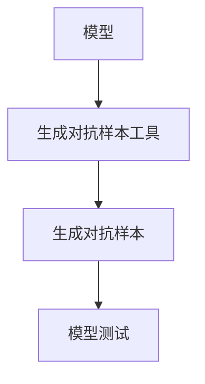

**核心算法原理讲解**

Adversarial Examples生成工具通常包括以下步骤：

1. **选择模型**：首先，选择要测试的深度学习模型。

2. **选择生成方法**：然后，选择合适的对抗样本生成方法（如FGSM、JSMA、C&W等）。

3. **生成对抗样本**：使用选择的生成方法生成对抗样本。

4. **模型测试**：使用生成的对抗样本对模型进行测试，评估模型的鲁棒性。

**常用工具**

- CleverHans：一个开源的对抗样本生成和攻击工具库。
- Adversarial Robustness Toolbox (ART)：一个用于测试和改进机器学习模型鲁棒性的开源工具箱。
- Adversarial Examples PyTorch：一个用于生成对抗样本的PyTorch库。

**举例说明**

假设我们使用CleverHans生成对抗样本。具体步骤如下：

1. 导入CleverHans库：

```python
import cleverhans
```

2. 创建模型：

```python
model = cleverhans.models.build_cifar10_cnn()
```

3. 选择攻击方法：

```python
attack = cleverhans.attacks.FGSM()
```

4. 生成对抗样本：

```python
x_adv = attack.generate(model, x, y)
```

5. 测试模型：

```python
model(x_adv)
```

### 3.1.2 Fast Gradient Sign Method工具

**背景介绍**

Fast Gradient Sign Method（FGSM）是一种简单有效的对抗样本生成方法。FGSM工具可以帮助用户快速生成对抗样本，以便对模型进行测试和改进。

**核心概念与联系**

- FGSM：Fast Gradient Sign Method，快速梯度符号法。
- 对抗样本生成：通过在原始数据上添加微小的扰动，生成对抗样本。
- 模型测试：使用对抗样本对模型进行测试，评估模型的鲁棒性。

**Mermaid流程图**

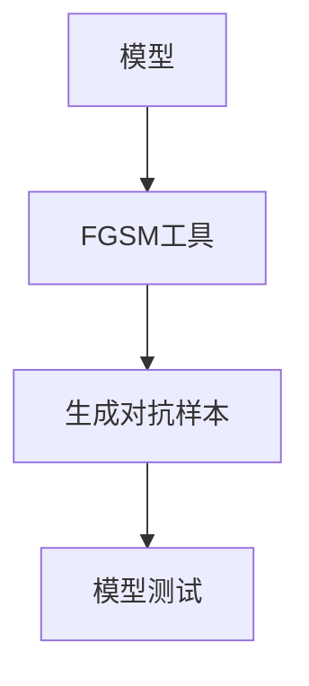

**核心算法原理讲解**

FGSM工具的核心步骤如下：

1. **计算梯度**：计算模型在训练数据上的梯度。

2. **生成对抗样本**：使用计算得到的梯度生成对抗样本。

3. **模型测试**：使用生成的对抗样本对模型进行测试。

**常用工具**

- CleverHans：一个开源的对抗样本生成和攻击工具库，包含FGSM工具。

**举例说明**

假设我们使用CleverHans生成FGSM对抗样本。具体步骤如下：

1. 导入CleverHans库：

```python
import cleverhans
```

2. 创建模型：

```python
model = cleverhans.models.build_cifar10_cnn()
```

3. 选择攻击方法：

```python
attack = cleverhans.attacks.FGSM()
```

4. 生成对抗样本：

```python
x_adv = attack.generate(model, x, y)
```

5. 测试模型：

```python
model(x_adv)
```

### 3.1.3 JSMA工具

**背景介绍**

JSMA（Jacobian-based Saliency Map Attack）工具是基于Jacobian矩阵的对抗样本生成工具。与FGSM工具不同，JSMA工具生成的对抗样本具有更高的攻击性和鲁棒性。

**核心概念与联系**

- JSMA：Jacobian-based Saliency Map Attack，基于Jacobian矩阵的显著性图攻击。
- 对抗样本生成：通过在原始数据上添加微小的扰动，生成对抗样本。
- 模型测试：使用对抗样本对模型进行测试，评估模型的鲁棒性。

**Mermaid流程图**


**核心算法原理讲解**

JSMA工具的核心步骤如下：

1. **计算Jacobian矩阵**：计算模型在训练数据上的Jacobian矩阵。

2. **生成显著性图**：使用Jacobian矩阵生成显著性图。

3. **生成对抗样本**：使用显著性图生成对抗样本。

4. **模型测试**：使用生成的对抗样本对模型进行测试。

**常用工具**

- CleverHans：一个开源的对抗样本生成和攻击工具库，包含JSMA工具。

**举例说明**

假设我们使用CleverHans生成JSMA对抗样本。具体步骤如下：

1. 导入CleverHans库：

```python
import cleverhans
```

2. 创建模型：

```python
model = cleverhans.models.build_cifar10_cnn()
```

3. 选择攻击方法：

```python
attack = cleverhans.attacks.JSMA()
```

4. 生成对抗样本：

```python
x_adv = attack.generate(model, x, y)
```

5. 测试模型：

```python
model(x_adv)
```

## 第4章：对抗样本生成应用案例

### 4.1.1 图像分类中的对抗样本生成

**背景介绍**

图像分类是深度学习领域的一个经典应用。然而，图像分类模型容易受到对抗样本的攻击，导致模型性能下降。因此，研究图像分类中的对抗样本生成具有重要意义。

**核心概念与联系**

- 图像分类：图像分类是指将图像分为不同的类别。
- 对抗样本：对抗样本是通过在原始图像上添加微小的扰动，使模型产生错误判断的图像。

**Mermaid流程图**

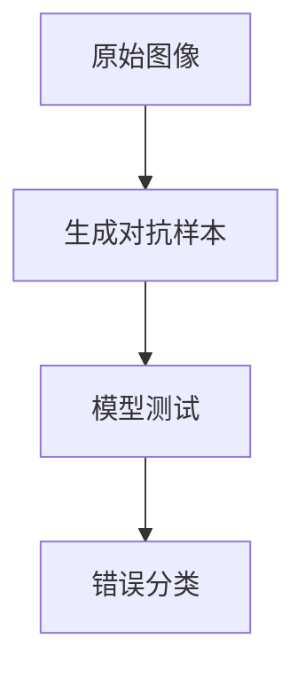

**核心算法原理讲解**

在图像分类中，生成对抗样本的步骤如下：

1. **选择原始图像**：首先，选择一个用于训练的原始图像。

2. **计算梯度**：计算模型在原始图像上的梯度信息。

3. **生成对抗样本**：利用梯度信息生成对抗样本。

4. **模型测试**：使用生成的对抗样本对模型进行测试。

5. **错误分类**：如果模型对对抗样本的判断与真实标签不一致，则认为模型存在安全问题。

**常用工具**

- CleverHans：一个开源的对抗样本生成和攻击工具库。

**举例说明**

假设我们使用CleverHans生成图像分类对抗样本。具体步骤如下：

1. 导入CleverHans库：

```python
import cleverhans
```

2. 创建模型：

```python
model = cleverhans.models.build_cifar10_cnn()
```

3. 选择攻击方法：

```python
attack = cleverhans.attacks.FGSM()
```

4. 生成对抗样本：

```python
x_adv = attack.generate(model, x, y)
```

5. 测试模型：

```python
model(x_adv)
```

### 4.1.2 自然语言处理中的对抗样本生成

**背景介绍**

自然语言处理（NLP）是深度学习领域的一个重要分支。NLP模型在许多实际应用中具有重要意义，如文本分类、情感分析等。然而，NLP模型也容易受到对抗样本的攻击，导致模型性能下降。

**核心概念与联系**

- 自然语言处理：自然语言处理是指对人类语言进行建模和处理。
- 对抗样本：对抗样本是通过在原始文本上添加微小的扰动，使模型产生错误判断的文本。

**Mermaid流程图**

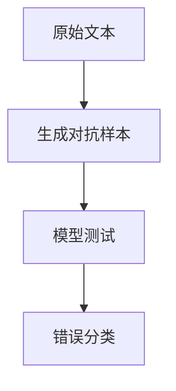

**核心算法原理讲解**

在自然语言处理中，生成对抗样本的步骤如下：

1. **选择原始文本**：首先，选择一个用于训练的原始文本。

2. **计算梯度**：计算模型在原始文本上的梯度信息。

3. **生成对抗样本**：利用梯度信息生成对抗样本。

4. **模型测试**：使用生成的对抗样本对模型进行测试。

5. **错误分类**：如果模型对对抗样本的判断与真实标签不一致，则认为模型存在安全问题。

**常用工具**

- CleverHans：一个开源的对抗样本生成和攻击工具库。

**举例说明**

假设我们使用CleverHans生成自然语言处理对抗样本。具体步骤如下：

1. 导入CleverHans库：

```python
import cleverhans
```

2. 创建模型：

```python
model = cleverhans.models.build_embedding_model()
```

3. 选择攻击方法：

```python
attack = cleverhans.attacks.FGSM()
```

4. 生成对抗样本：

```python
x_adv = attack.generate(model, x, y)
```

5. 测试模型：

```python
model(x_adv)
```

### 4.1.3 集成学习与对抗样本生成

**背景介绍**

集成学习是一种常用的机器学习技术，它通过结合多个模型的预测结果来提高模型的性能。然而，集成学习模型也容易受到对抗样本的攻击。

**核心概念与联系**

- 集成学习：集成学习是通过结合多个模型的预测结果来提高模型性能的一种技术。
- 对抗样本：对抗样本是通过在原始数据上添加微小的扰动，使模型产生错误判断的样本。

**Mermaid流程图**

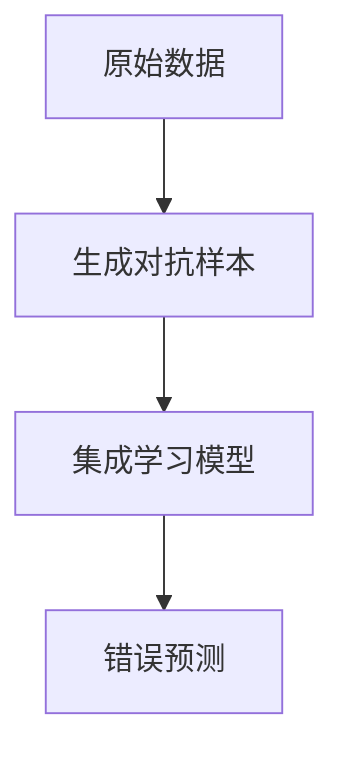

**核心算法原理讲解**

在集成学习中，生成对抗样本的步骤如下：

1. **选择原始数据**：首先，选择一个用于训练的原始数据。

2. **计算梯度**：计算集成学习模型在原始数据上的梯度信息。

3. **生成对抗样本**：利用梯度信息生成对抗样本。

4. **集成学习模型测试**：使用生成的对抗样本对集成学习模型进行测试。

5. **错误预测**：如果集成学习模型对对抗样本的预测与真实标签不一致，则认为模型存在安全问题。

**常用工具**

- CleverHans：一个开源的对抗样本生成和攻击工具库。

**举例说明**

假设我们使用CleverHans生成集成学习对抗样本。具体步骤如下：

1. 导入CleverHans库：

```python
import cleverhans
```

2. 创建模型：

```python
model = cleverhans.models.build_ensemble_cnn()
```

3. 选择攻击方法：

```python
attack = cleverhans.attacks.FGSM()
```

4. 生成对抗样本：

```python
x_adv = attack.generate(model, x, y)
```

5. 测试模型：

```python
model(x_adv)
```

## 第5章：对抗样本防御技术

### 5.1.1 对抗样本防御方法分类

**背景介绍**

对抗样本防御技术是防止对抗样本攻击的重要手段。根据防御方法的不同，可以将对抗样本防御方法分为数据增强、安全训练和输入验证等类别。

**核心概念与联系**

- 数据增强：数据增强是通过增加样本数量和多样性来提高模型稳健性的方法。
- 安全训练：安全训练是在训练过程中引入对抗样本，以提高模型对对抗样本的鲁棒性。
- 输入验证：输入验证是在模型输入阶段对样本进行验证，以防止对抗样本进入模型。

**Mermaid流程图**

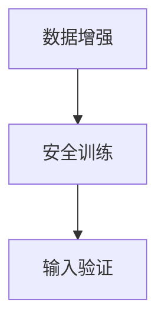

**核心算法原理讲解**

1. **数据增强**：数据增强方法通过增加样本数量和多样性来提高模型稳健性。常用的数据增强方法包括旋转、缩放、裁剪等。以下是一个简单的数据增强算法：

   ```python
   import cv2
   
   def augment_image(image):
       image = cv2.rotate(image, cv2.ROTATE_90_CLOCKWISE)
       image = cv2.resize(image, (224, 224))
       return image
   ```

2. **安全训练**：安全训练方法在训练过程中引入对抗样本，以提高模型对对抗样本的鲁棒性。以下是一个简单的安全训练算法：

   ```python
   import torch
   
   def train_model(model, train_loader, criterion, optimizer, num_epochs):
       for epoch in range(num_epochs):
           for images, labels in train_loader:
               # 生成对抗样本
               adv_images = generate_adversarial_samples(model, images, labels)
               
               # 训练模型
               optimizer.zero_grad()
               outputs = model(adv_images)
               loss = criterion(outputs, labels)
               loss.backward()
               optimizer.step()
   ```

3. **输入验证**：输入验证方法在模型输入阶段对样本进行验证，以防止对抗样本进入模型。以下是一个简单的输入验证算法：

   ```python
   def is_adversarial_sample(image, threshold):
       # 计算图像的梯度
       gradient = calculate_gradient(image)
       
       # 判断梯度是否超过阈值
       if np.linalg.norm(gradient) > threshold:
           return True
       else:
           return False
   ```

**数学模型和公式**

数据增强方法中的旋转操作可以使用以下公式：

$$
\theta = \frac{\pi}{4}
$$

其中，\( \theta \) 是旋转角度。

安全训练方法中的对抗样本生成可以使用以下公式：

$$
\Delta x = \epsilon \cdot \text{sign}(\nabla_{x} L(x, y))
$$

其中，\( \Delta x \) 是对抗样本的扰动，\( \epsilon \) 是学习率，\( \nabla_{x} L(x, y) \) 是损失函数关于输入 \( x \) 的梯度。

输入验证方法中的梯度计算可以使用以下公式：

$$
\nabla_{x} f(x) = \frac{\partial f}{\partial x}
$$

其中，\( f(x) \) 是损失函数，\( \nabla_{x} f(x) \) 是损失函数关于输入 \( x \) 的梯度。

**举例说明**

假设我们有一个简单的线性分类器，其损失函数为交叉熵损失。现在我们希望使用数据增强方法来提高模型稳健性。可以通过以下步骤实现：

1. 选择一个原始样本 \( x \) 和其对应的标签 \( y \)。

2. 计算模型在 \( x \) 上的预测概率 \( \hat{y} \)。

3. 计算对抗样本 \( x' \)，其扰动大小为 \( \epsilon \)，即 \( x' = x + \epsilon \cdot \text{sign}(\nabla_{x} L(x, y)) \)。

4. 重新计算模型在 \( x' \) 上的预测概率 \( \hat{y}' \)。

5. 如果 \( \hat{y}' \neq y \)，则 \( x' \) 为一个对抗样本。

6. 使用生成的对抗样本对模型进行训练，以提高模型稳健性。

### 5.1.2 安全深度学习模型设计

**背景介绍**

安全深度学习模型设计是防止对抗样本攻击的重要手段。通过设计安全深度学习模型，可以提高模型的鲁棒性和安全性。

**核心概念与联系**

- 安全深度学习模型：安全深度学习模型是指具有高鲁棒性和安全性的深度学习模型。
- 对抗样本攻击：对抗样本攻击是指通过在原始数据上添加微小扰动，使模型产生错误判断的攻击。
- 鲁棒性：鲁棒性是指模型在面临噪声、异常值和对抗样本等干扰时仍能保持正常工作能力。

**Mermaid流程图**

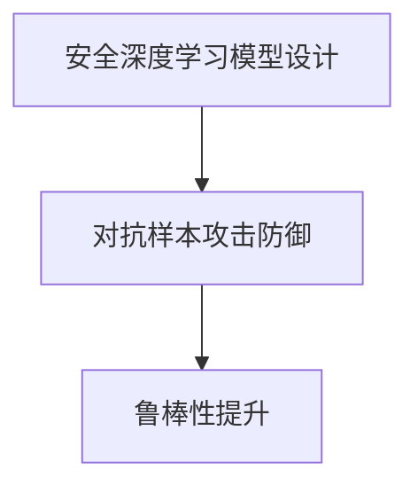

**核心算法原理讲解**

设计安全深度学习模型的关键在于提高模型的鲁棒性和安全性。以下是一些常用的方法：

1. **数据增强**：通过增加训练数据集的多样性，提高模型对噪声和异常值的鲁棒性。常用的数据增强方法包括旋转、缩放、裁剪、翻转等。

2. **正则化**：通过引入正则化项，限制模型参数的过大变化，提高模型的泛化能力。常用的正则化方法包括L1正则化、L2正则化和Dropout等。

3. **对抗训练**：通过在训练过程中引入对抗样本，提高模型对对抗样本的鲁棒性。对抗训练可以通过生成对抗网络（GAN）来实现。

4. **安全训练**：在训练过程中，通过减少对抗样本的影响，提高模型的安全性。安全训练可以通过调整学习率、优化损失函数等方式实现。

5. **模型压缩**：通过压缩模型参数，减少模型对噪声和异常值的敏感性，提高模型的鲁棒性。

**数学模型和公式**

数据增强方法中的旋转操作可以使用以下公式：

$$
\theta = \frac{\pi}{4}
$$

其中，\( \theta \) 是旋转角度。

正则化方法中的L2正则化损失函数可以使用以下公式：

$$
L_{\text{reg}} = \lambda \sum_{i} \frac{1}{2} \| \theta_i \|_2^2
$$

其中，\( \theta_i \) 是模型参数，\( \lambda \) 是正则化参数。

对抗训练方法中的对抗样本生成可以使用以下公式：

$$
x' = x + \epsilon \cdot \text{sign}(\nabla_{x} L(x, y))
$$

其中，\( x' \) 是对抗样本，\( \epsilon \) 是学习率，\( \nabla_{x} L(x, y) \) 是损失函数关于输入 \( x \) 的梯度。

**举例说明**

假设我们设计一个安全的图像分类模型。以下是一些关键步骤：

1. **数据增强**：通过旋转、缩放、裁剪等方式增加训练数据集的多样性。

2. **正则化**：引入L2正则化，限制模型参数的过大变化。

3. **对抗训练**：在训练过程中引入对抗样本，通过对抗训练提高模型对对抗样本的鲁棒性。

4. **安全训练**：调整学习率，优化损失函数，减少对抗样本的影响。

5. **模型压缩**：通过压缩模型参数，减少模型对噪声和异常值的敏感性。

通过上述步骤，我们可以设计一个具有高鲁棒性和安全性的图像分类模型。

### 5.1.3 输入验证技术

**背景介绍**

输入验证技术是一种在模型输入阶段对样本进行验证，以防止对抗样本进入模型的重要手段。通过输入验证，可以确保模型接收到的是合法且安全的样本，从而提高模型的鲁棒性和安全性。

**核心概念与联系**

- 输入验证：输入验证是指在模型输入阶段对样本进行验证，以判断其是否为对抗样本。
- 对抗样本：对抗样本是通过在原始数据上添加微小扰动，使模型产生错误判断的样本。
- 鲁棒性：鲁棒性是指模型在面临噪声、异常值和对抗样本等干扰时仍能保持正常工作能力。

**Mermaid流程图**

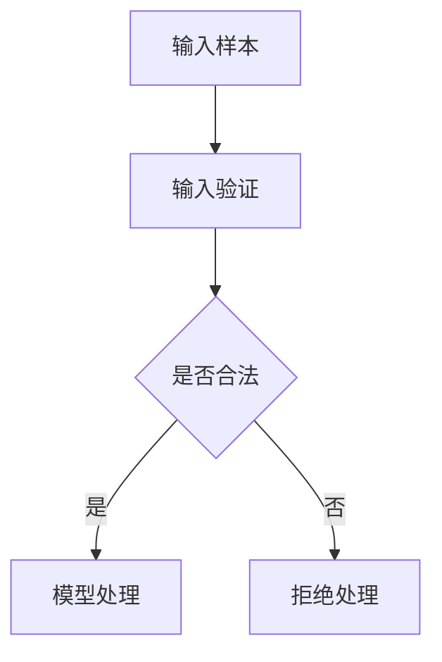

**核心算法原理讲解**

输入验证技术的核心在于如何有效地检测和拒绝对抗样本。以下是一些常用的输入验证算法：

1. **梯度阈值检测**：通过计算模型在样本上的梯度，判断其是否超过预设的阈值。如果梯度超过阈值，则认为样本为对抗样本。

2. **扰动范围检测**：计算样本与原始样本之间的差异，判断其是否在允许的扰动范围内。如果扰动范围超出限制，则认为样本为对抗样本。

3. **模型重新训练**：通过定期重新训练模型，提高模型对对抗样本的识别能力。

4. **特征提取和比对**：提取样本的特征，并与训练阶段提取的特征进行比对。如果特征差异较大，则认为样本为对抗样本。

**数学模型和公式**

梯度阈值检测的公式如下：

$$
\text{grad\_norm} = \frac{1}{\| \nabla_{x} L(x, y) \|_2}
$$

其中，\( \text{grad\_norm} \) 是梯度的归一化值，如果 \( \text{grad\_norm} \) 超过预设的阈值 \( \text{threshold} \)，则认为样本为对抗样本。

扰动范围检测的公式如下：

$$
\text{perturbation} = \| x - x_0 \|_2
$$

其中，\( \text{perturbation} \) 是样本的扰动大小，如果 \( \text{perturbation} \) 超过预设的阈值 \( \text{threshold} \)，则认为样本为对抗样本。

**举例说明**

假设我们有一个简单的图像分类模型，现在需要对其进行输入验证。以下是一些具体步骤：

1. **计算梯度**：计算模型在样本 \( x \) 上的梯度 \( \nabla_{x} L(x, y) \)。

2. **计算梯度阈值**：设置一个阈值 \( \text{threshold} \)，用于判断梯度是否超过限制。

3. **判断梯度**：如果 \( \text{grad\_norm} > \text{threshold} \)，则拒绝样本 \( x \)。

4. **计算扰动**：计算样本 \( x \) 与原始样本 \( x_0 \) 之间的差异 \( \text{perturbation} \)。

5. **判断扰动**：如果 \( \text{perturbation} > \text{threshold} \)，则拒绝样本 \( x \)。

通过上述步骤，我们可以有效地检测和拒绝对抗样本，从而提高模型的鲁棒性和安全性。

## 第6章：对抗样本防御算法

### 6.1.1 数据增强算法

**背景介绍**

数据增强算法是一种通过增加样本数量和多样性来提高模型稳健性的方法。在对抗样本防御中，数据增强算法可以帮助模型更好地应对对抗样本攻击。

**核心概念与联系**

- 数据增强：数据增强是指通过一系列变换，增加训练样本的数量和多样性。
- 对抗样本：对抗样本是指通过在原始数据上添加微小扰动，使模型产生错误判断的样本。
- 稳健性：稳健性是指模型在面对对抗样本和其他干扰时仍能保持良好性能的能力。

**Mermaid流程图**

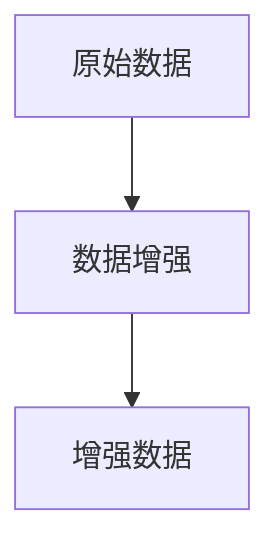

**核心算法原理讲解**

数据增强算法的核心在于如何生成具有多样性的增强数据。以下是一些常用的数据增强算法：

1. **旋转**：通过随机旋转图像，增加图像的方向多样性。
2. **缩放**：通过随机缩放图像，增加图像的大小多样性。
3. **裁剪**：通过随机裁剪图像，增加图像的局部多样性。
4. **颜色变换**：通过随机调整图像的亮度、对比度和饱和度，增加图像的视觉多样性。
5. **噪声添加**：通过在图像上添加噪声，增加图像的干扰多样性。

以下是一个简单的数据增强算法实现：

```python
import numpy as np
import cv2

def augment_image(image):
    # 随机旋转
    angle = np.random.uniform(-30, 30)
    M = cv2.getRotationMatrix2D((image.shape[1] // 2, image.shape[0] // 2), angle, 1)
    image = cv2.warpAffine(image, M, (image.shape[1], image.shape[0]))

    # 随机缩放
    scale = np.random.uniform(0.8, 1.2)
    image = cv2.resize(image, (int(image.shape[1] * scale), int(image.shape[0] * scale)))

    # 随机裁剪
    start_x = np.random.randint(0, image.shape[1] - 224)
    start_y = np.random.randint(0, image.shape[0] - 224)
    image = image[start_y:start_y + 224, start_x:start_x + 224]

    # 随机颜色变换
    hue_var = np.random.uniform(-0.1, 0.1)
    sat_var = np.random.uniform(0.5, 1.5)
    bright_var = np.random.uniform(0.5, 1.5)
    image = cv2.cvtColor(image, cv2.COLOR_BGR2HSV)
    image[:, :, 0] += hue_var
    image[:, :, 1] *= sat_var
    image[:, :, 2] *= bright_var
    image[:, :, 0] = np.clip(image[:, :, 0], 0, 180)
    image = cv2.cvtColor(image, cv2.COLOR_HSV2BGR)

    return image
```

**数学模型和公式**

数据增强算法中的旋转可以使用以下公式：

$$
\theta = \frac{\pi}{4}
$$

其中，\( \theta \) 是旋转角度。

缩放可以使用以下公式：

$$
x' = x \cdot scale
$$

其中，\( x' \) 是缩放后的坐标，\( x \) 是原始坐标，\( scale \) 是缩放比例。

裁剪可以使用以下公式：

$$
y_{min} = \frac{\pi}{2}
$$

$$
y_{max} = \frac{3\pi}{2}
$$

其中，\( y_{min} \) 和 \( y_{max} \) 是裁剪角度的下限和上限。

颜色变换可以使用以下公式：

$$
h' = h + hue_var
$$

$$
s' = s + sat_var
$$

$$
v' = v + bright_var
$$

其中，\( h' \)，\( s' \)，\( v' \) 是变换后的HSV值，\( h \)，\( s \)，\( v \) 是原始HSV值，\( hue_var \)，\( sat_var \)，\( bright_var \) 是变换范围。

**举例说明**

假设我们有一个原始图像 \( image \)，现在对其进行数据增强：

1. **随机旋转**：随机选择一个角度 \( \theta \) 在 \(-30\) 到 \( 30 \) 度之间，然后对图像进行旋转。

2. **随机缩放**：随机选择一个缩放比例 \( scale \) 在 \( 0.8 \) 到 \( 1.2 \) 之间，然后对图像进行缩放。

3. **随机裁剪**：随机选择一个裁剪窗口，然后对图像进行裁剪。

4. **随机颜色变换**：随机调整图像的亮度、对比度和饱和度。

通过上述步骤，我们可以生成一个具有多样性的增强图像，从而提高模型的稳健性。

### 6.1.2 安全训练算法

**背景介绍**

安全训练算法是一种在训练过程中提高模型稳健性和安全性的方法。通过安全训练，模型可以更好地应对对抗样本和其他干扰。

**核心概念与联系**

- 安全训练：安全训练是指通过一系列策略，提高模型在面对对抗样本和其他干扰时的稳健性和安全性。
- 对抗样本：对抗样本是指通过在原始数据上添加微小扰动，使模型产生错误判断的样本。
- 稳健性：稳健性是指模型在面对对抗样本和其他干扰时仍能保持良好性能的能力。
- 安全性：安全性是指模型在面对恶意攻击时仍能保持正常工作能力。

**Mermaid流程图**

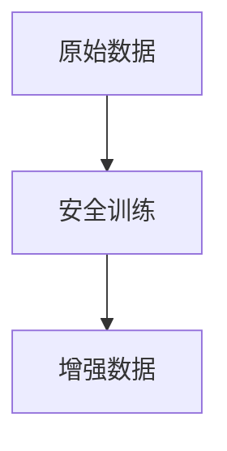

**核心算法原理讲解**

安全训练算法的核心在于如何在训练过程中引入对抗样本，以提高模型的稳健性。以下是一些常用的安全训练算法：

1. **对抗训练**：在训练过程中引入对抗样本，使模型在对抗环境下进行训练。对抗训练可以通过生成对抗网络（GAN）来实现。

2. **裁剪梯度**：通过限制梯度的大小，减少对抗样本对模型的影响。

3. **随机噪声**：在训练过程中引入随机噪声，提高模型的鲁棒性。

4. **权重剪枝**：通过剪枝模型中的冗余权重，减少模型对对抗样本的敏感性。

以下是一个简单的安全训练算法实现：

```python
import tensorflow as tf
import numpy as np

def safe_train(model, train_dataset, test_dataset, epochs, learning_rate, gradient_clip_value):
    for epoch in range(epochs):
        for x, y in train_dataset:
            # 计算梯度
            with tf.GradientTape() as tape:
                logits = model(x, training=True)
                loss = tf.reduce_mean(tf.nn.softmax_cross_entropy_with_logits(logits=logits, labels=y))
            
            # 裁剪梯度
            gradients = tape.gradient(loss, model.trainable_variables)
            clipped_gradients = [tf.clip_by_value(grad, -gradient_clip_value, gradient_clip_value) for grad in gradients]
            
            # 更新权重
            optimizer.apply_gradients(zip(clipped_gradients, model.trainable_variables))
        
        # 测试模型
        test_loss = []
        for x, y in test_dataset:
            logits = model(x, training=False)
            loss = tf.reduce_mean(tf.nn.softmax_cross_entropy_with_logits(logits=logits, labels=y))
            test_loss.append(loss.numpy())
        
        print(f"Epoch {epoch + 1}, Test Loss: {np.mean(test_loss)}")
```

**数学模型和公式**

安全训练算法中的裁剪梯度可以使用以下公式：

$$
\text{grad}_{\text{clipped}} = \text{sign}(\text{grad}) \cdot \min(\|\text{grad}\|_2, \text{gradient\_clip\_value})
$$

其中，\( \text{grad} \) 是原始梯度，\( \text{grad}_{\text{clipped}} \) 是裁剪后的梯度，\( \text{gradient\_clip\_value} \) 是梯度裁剪的阈值。

**举例说明**

假设我们有一个简单的神经网络模型，现在对其进行安全训练：

1. **初始化模型**：定义神经网络结构，包括输入层、隐藏层和输出层。

2. **定义损失函数和优化器**：选择合适的损失函数和优化器，如交叉熵损失函数和Adam优化器。

3. **设置梯度裁剪阈值**：选择一个合理的梯度裁剪阈值。

4. **安全训练**：在训练过程中，计算梯度并裁剪，然后更新模型权重。

5. **测试模型**：在测试集上评估模型性能，计算损失值。

通过上述步骤，我们可以提高模型的稳健性和安全性，使其在面对对抗样本和其他干扰时仍能保持良好性能。

### 6.1.3 预处理技术

**背景介绍**

预处理技术是提高模型稳健性和性能的重要手段。在对抗样本防御中，预处理技术可以帮助模型更好地应对对抗样本攻击。

**核心概念与联系**

- 预处理：预处理是指对原始数据进行处理，以提高模型的稳健性和性能。
- 对抗样本：对抗样本是指通过在原始数据上添加微小扰动，使模型产生错误判断的样本。
- 稳健性：稳健性是指模型在面对对抗样本和其他干扰时仍能保持良好性能的能力。
- 性能：性能是指模型在处理数据时的准确度、速度和效率。

**Mermaid流程图**

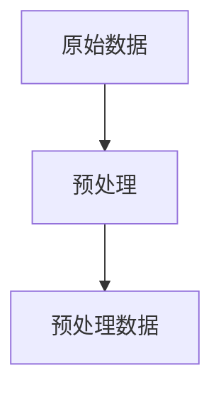

**核心算法原理讲解**

预处理技术的核心在于如何有效地处理原始数据，以提高模型的稳健性和性能。以下是一些常用的预处理技术：

1. **归一化**：通过缩放特征值，使数据分布更加均匀，减少特征间的差异。
2. **标准化**：通过减去均值并除以标准差，使数据分布符合正态分布。
3. **去噪**：通过滤波、降噪等方法，去除数据中的噪声。
4. **数据清洗**：通过填补缺失值、去除异常值等方法，提高数据质量。

以下是一个简单的预处理算法实现：

```python
import numpy as np

def preprocess_image(image):
    # 归一化
    image = image / 255.0
    
    # 标准化
    mean = np.mean(image)
    std = np.std(image)
    image = (image - mean) / std
    
    # 去噪
    image = cv2.GaussianBlur(image, (5, 5), 0)
    
    # 数据清洗
    image = fill_missing_values(image)
    
    return image
```

**数学模型和公式**

归一化可以使用以下公式：

$$
x' = \frac{x - \text{min}}{\text{max} - \text{min}}
$$

其中，\( x' \) 是归一化后的值，\( x \) 是原始值，\( \text{min} \) 是最小值，\( \text{max} \) 是最大值。

标准化可以使用以下公式：

$$
x' = \frac{x - \mu}{\sigma}
$$

其中，\( x' \) 是标准化后的值，\( x \) 是原始值，\( \mu \) 是均值，\( \sigma \) 是标准差。

去噪可以使用以下公式：

$$
\hat{x} = \frac{1}{1 + \frac{2\sigma^2}{n}} \sum_{i=1}^{n} (x_i - \bar{x})
$$

其中，\( \hat{x} \) 是去噪后的值，\( x_i \) 是原始值，\( \bar{x} \) 是均值，\( n \) 是样本数量。

**举例说明**

假设我们有一个原始图像 \( image \)，现在对其进行预处理：

1. **归一化**：将图像的像素值缩放到 \( 0 \) 到 \( 1 \) 之间。

2. **标准化**：减去均值并除以标准差。

3. **去噪**：使用高斯滤波器去除图像中的噪声。

4. **数据清洗**：填补图像中的缺失值。

通过上述步骤，我们可以提高图像的质量，从而提高模型的稳健性和性能。

## 第7章：对抗样本防御应用案例

### 7.1.1 图像识别中的防御策略

**背景介绍**

图像识别是深度学习领域的一个重要应用，然而，图像识别模型容易受到对抗样本的攻击。因此，研究图像识别中的防御策略具有重要意义。

**核心概念与联系**

- 图像识别：图像识别是指利用深度学习模型对图像进行分类和识别。
- 对抗样本：对抗样本是指通过在原始图像上添加微小扰动，使模型产生错误判断的图像。
- 防御策略：防御策略是指通过一系列方法，提高模型对对抗样本的鲁棒性和安全性。

**Mermaid流程图**

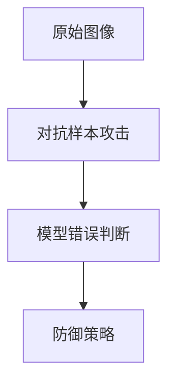

**核心算法原理讲解**

在图像识别中，防御策略的核心在于如何有效检测和防御对抗样本。以下是一些常用的防御策略：

1. **数据增强**：通过增加训练数据集的多样性，提高模型对对抗样本的鲁棒性。
2. **裁剪梯度**：通过限制梯度的大小，减少对抗样本对模型的影响。
3. **输入验证**：在模型输入阶段对样本进行验证，以防止对抗样本进入模型。
4. **安全训练**：在训练过程中引入对抗样本，提高模型对对抗样本的鲁棒性。

以下是一个简单的防御策略实现：

```python
import tensorflow as tf

def defense_strategy(model, train_dataset, test_dataset, epochs, learning_rate, gradient_clip_value):
    for epoch in range(epochs):
        for x, y in train_dataset:
            # 计算梯度
            with tf.GradientTape() as tape:
                logits = model(x, training=True)
                loss = tf.reduce_mean(tf.nn.softmax_cross_entropy_with_logits(logits=logits, labels=y))
            
            # 裁剪梯度
            gradients = tape.gradient(loss, model.trainable_variables)
            clipped_gradients = [tf.clip_by_value(grad, -gradient_clip_value, gradient_clip_value) for grad in gradients]
            
            # 更新权重
            optimizer.apply_gradients(zip(clipped_gradients, model.trainable_variables))
        
        # 测试模型
        test_loss = []
        for x, y in test_dataset:
            logits = model(x, training=False)
            loss = tf.reduce_mean(tf.nn.softmax_cross_entropy_with_logits(logits=logits, labels=y))
            test_loss.append(loss.numpy())
        
        print(f"Epoch {epoch + 1}, Test Loss: {np.mean(test_loss)}")
```

**数学模型和公式**

裁剪梯度的公式如下：

$$
\text{grad}_{\text{clipped}} = \text{sign}(\text{grad}) \cdot \min(\|\text{grad}\|_2, \text{gradient\_clip\_value})
$$

其中，\( \text{grad} \) 是原始梯度，\( \text{grad}_{\text{clipped}} \) 是裁剪后的梯度，\( \text{gradient\_clip\_value} \) 是梯度裁剪的阈值。

**举例说明**

假设我们有一个图像识别模型，现在对其进行防御策略：

1. **初始化模型**：定义神经网络结构，包括输入层、隐藏层和输出层。

2. **设置防御参数**：选择合适的梯度裁剪阈值和训练参数。

3. **安全训练**：在训练过程中，计算梯度并裁剪，然后更新模型权重。

4. **测试模型**：在测试集上评估模型性能，计算损失值。

通过上述步骤，我们可以提高模型的稳健性和安全性，使其在面对对抗样本攻击时仍能保持良好性能。

### 7.1.2 自然语言处理中的防御策略

**背景介绍**

自然语言处理（NLP）是深度学习领域的一个重要分支，然而，NLP模型容易受到对抗样本的攻击。因此，研究自然语言处理中的防御策略具有重要意义。

**核心概念与联系**

- 自然语言处理：自然语言处理是指对人类语言进行建模和处理。
- 对抗样本：对抗样本是通过在原始文本上添加微小的扰动，使模型产生错误判断的文本。
- 防御策略：防御策略是指通过一系列方法，提高模型对对抗样本的鲁棒性和安全性。

**Mermaid流程图**

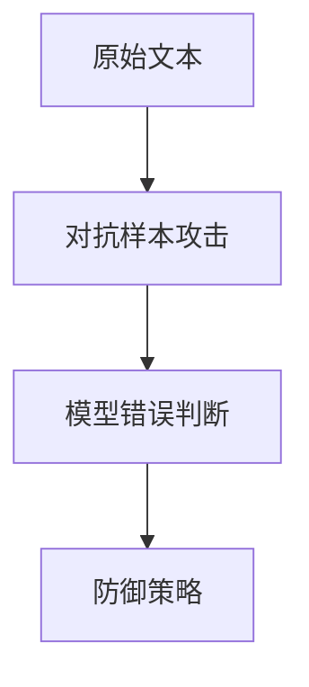

**核心算法原理讲解**

在自然语言处理中，防御策略的核心在于如何有效检测和防御对抗样本。以下是一些常用的防御策略：

1. **数据增强**：通过增加训练数据集的多样性，提高模型对对抗样本的鲁棒性。
2. **词汇屏蔽**：在模型输入阶段，屏蔽一些可能引起对抗效果的词汇。
3. **对抗训练**：在训练过程中引入对抗样本，提高模型对对抗样本的鲁棒性。
4. **动态正则化**：通过动态调整正则化参数，减少对抗样本对模型的影响。

以下是一个简单的防御策略实现：

```python
import tensorflow as tf

def defense_strategy(model, train_dataset, test_dataset, epochs, learning_rate, gradient_clip_value):
    for epoch in range(epochs):
        for x, y in train_dataset:
            # 计算梯度
            with tf.GradientTape() as tape:
                logits = model(x, training=True)
                loss = tf.reduce_mean(tf.nn.softmax_cross_entropy_with_logits(logits=logits, labels=y))
            
            # 动态正则化
            reg_loss = tf.reduce_mean(tf.nn.l2_loss(model.trainable_variables))
            total_loss = loss + reg_loss
            
            # 更新权重
            gradients = tape.gradient(total_loss, model.trainable_variables)
            clipped_gradients = [tf.clip_by_value(grad, -gradient_clip_value, gradient_clip_value) for grad in gradients]
            
            optimizer.apply_gradients(zip(clipped_gradients, model.trainable_variables))
        
        # 测试模型
        test_loss = []
        for x, y in test_dataset:
            logits = model(x, training=False)
            loss = tf.reduce_mean(tf.nn.softmax_cross_entropy_with_logits(logits=logits, labels=y))
            test_loss.append(loss.numpy())
        
        print(f"Epoch {epoch + 1}, Test Loss: {np.mean(test_loss)}")
```

**数学模型和公式**

动态正则化的公式如下：

$$
\text{reg\_loss} = \lambda \sum_{i} \frac{1}{2} \| \theta_i \|_2^2
$$

其中，\( \text{reg\_loss} \) 是正则化损失，\( \lambda \) 是正则化参数，\( \theta_i \) 是模型参数。

**举例说明**

假设我们有一个自然语言处理模型，现在对其进行防御策略：

1. **初始化模型**：定义神经网络结构，包括输入层、隐藏层和输出层。

2. **设置防御参数**：选择合适的正则化参数和训练参数。

3. **安全训练**：在训练过程中，引入动态正则化，更新模型权重。

4. **测试模型**：在测试集上评估模型性能，计算损失值。

通过上述步骤，我们可以提高模型的稳健性和安全性，使其在面对对抗样本攻击时仍能保持良好性能。

### 7.1.3 集成学习与防御策略

**背景介绍**

集成学习是一种通过结合多个模型的预测结果来提高模型性能的技术。然而，集成学习模型也容易受到对抗样本的攻击。因此，研究集成学习中的防御策略具有重要意义。

**核心概念与联系**

- 集成学习：集成学习是指通过结合多个模型的预测结果来提高模型性能。
- 对抗样本：对抗样本是指通过在原始数据上添加微小的扰动，使模型产生错误判断的样本。
- 防御策略：防御策略是指通过一系列方法，提高模型对对抗样本的鲁棒性和安全性。

**Mermaid流程图**

```mermaid
graph TD
    A[原始数据] --> B[集成学习模型]
    B --> C[对抗样本攻击]
    C --> D[防御策略]
```

**核心算法原理讲解**

在集成学习中，防御策略的核心在于如何有效检测和防御对抗样本。以下是一些常用的防御策略：

1. **模型权重调整**：通过调整各个模型在集成学习中的权重，提高模型对对抗样本的鲁棒性。
2. **对抗样本滤波**：通过滤波方法，减少对抗样本对集成学习模型的影响。
3. **动态权重更新**：在训练过程中，动态调整模型权重，以应对对抗样本的变化。
4. **输入验证**：在模型输入阶段对样本进行验证，以防止对抗样本进入模型。

以下是一个简单的防御策略实现：

```python
import tensorflow as tf

def defense_strategy(model, train_dataset, test_dataset, epochs, learning_rate, gradient_clip_value):
    for epoch in range(epochs):
        for x, y in train_dataset:
            # 计算梯度
            with tf.GradientTape() as tape:
                logits = model(x, training=True)
                loss = tf.reduce_mean(tf.nn.softmax_cross_entropy_with_logits(logits=logits, labels=y))
            
            # 动态权重更新
            weights = model.weights
            for w in weights:
                reg_loss = tf.reduce_mean(tf.nn.l2_loss(w))
                total_loss = loss + reg_loss
                gradients = tape.gradient(total_loss, w)
                clipped_gradients = tf.clip_by_value(gradients, -gradient_clip_value, gradient_clip_value)
            
            optimizer.apply_gradients(zip(clipped_gradients, w))
        
        # 测试模型
        test_loss = []
        for x, y in test_dataset:
            logits = model(x, training=False)
            loss = tf.reduce_mean(tf.nn.softmax_cross_entropy_with_logits(logits=logits, labels=y))
            test_loss.append(loss.numpy())
        
        print(f"Epoch {epoch + 1}, Test Loss: {np.mean(test_loss)}")
```

**数学模型和公式**

动态权重更新的公式如下：

$$
w' = \alpha \cdot w + (1 - \alpha) \cdot w'
$$

其中，\( w' \) 是动态权重，\( w \) 是原始权重，\( \alpha \) 是学习率。

**举例说明**

假设我们有一个集成学习模型，现在对其进行防御策略：

1. **初始化模型**：定义多个基础模型，并构建集成学习模型。

2. **设置防御参数**：选择合适的学习率和正则化参数。

3. **安全训练**：在训练过程中，引入动态权重更新，更新模型权重。

4. **测试模型**：在测试集上评估模型性能，计算损失值。

通过上述步骤，我们可以提高集成学习模型的稳健性和安全性，使其在面对对抗样本攻击时仍能保持良好性能。

## 第8章：对抗样本防御框架与工具

### 8.1.1 ADversarial Training工具

**背景介绍**

ADversarial Training是一种常用的对抗样本防御工具，它通过在训练过程中引入对抗样本，提高模型的鲁棒性和安全性。

**核心概念与联系**

- ADversarial Training：ADversarial Training是一种对抗样本防御工具。
- 对抗样本：对抗样本是通过在原始数据上添加微小扰动，使模型产生错误判断的样本。
- 鲁棒性：鲁棒性是指模型在面对对抗样本和其他干扰时仍能保持良好性能的能力。

**Mermaid流程图**

```mermaid
graph TD
    A[原始数据] --> B[ADversarial Training]
    B --> C[增强数据]
```

**核心算法原理讲解**

ADversarial Training工具的核心在于如何生成对抗样本，并将其引入训练过程。以下是其工作流程：

1. **生成对抗样本**：使用对抗样本生成算法（如FGSM、JSMA等）生成对抗样本。
2. **增强数据集**：将原始数据集与对抗样本合并，形成增强数据集。
3. **训练模型**：使用增强数据集训练模型，以提高模型对对抗样本的鲁棒性。

以下是一个简单的ADversarial Training工具实现：

```python
import tensorflow as tf

def adversarial_training(model, train_dataset, epochs, learning_rate):
    for epoch in range(epochs):
        for x, y in train_dataset:
            # 生成对抗样本
            adv_x = generate_adversarial_samples(model, x, y)
            
            # 训练模型
            with tf.GradientTape() as tape:
                logits = model(adv_x, training=True)
                loss = tf.reduce_mean(tf.nn.softmax_cross_entropy_with_logits(logits=logits, labels=y))
            
            gradients = tape.gradient(loss, model.trainable_variables)
            optimizer.apply_gradients(zip(gradients, model.trainable_variables))
        
        print(f"Epoch {epoch + 1}, Loss: {loss.numpy()}")
```

**数学模型和公式**

对抗样本生成算法中的扰动公式如下：

$$
x' = x + \epsilon \cdot \text{sign}(\nabla_{x} L(x, y))
$$

其中，\( x' \) 是对抗样本，\( x \) 是原始样本，\( \epsilon \) 是学习率，\( \nabla_{x} L(x, y) \) 是损失函数关于输入 \( x \) 的梯度。

**举例说明**

假设我们有一个简单的神经网络模型，现在使用ADversarial Training工具对其进行训练：

1. **初始化模型**：定义神经网络结构，包括输入层、隐藏层和输出层。
2. **准备数据集**：准备原始数据集和标签。
3. **生成对抗样本**：使用对抗样本生成算法生成对抗样本。
4. **训练模型**：使用增强数据集训练模型，以提高模型对对抗样本的鲁棒性。

通过上述步骤，我们可以提高模型的稳健性和安全性。

### 8.1.2 Defense-GAN工具

**背景介绍**

Defense-GAN是一种基于生成对抗网络（GAN）的对抗样本防御工具。它通过对抗训练提高模型的鲁棒性和安全性。

**核心概念与联系**

- Defense-GAN：Defense-GAN是一种基于GAN的对抗样本防御工具。
- 生成对抗网络（GAN）：生成对抗网络是一种由生成器和判别器组成的框架，用于生成与真实样本相似的数据。
- 对抗样本：对抗样本是通过在原始数据上添加微小扰动，使模型产生错误判断的样本。

**Mermaid流程图**

```mermaid
graph TD
    A[原始数据] --> B[Defense-GAN]
    B --> C[生成对抗样本]
```

**核心算法原理讲解**

Defense-GAN工具的工作流程如下：

1. **初始化生成器和判别器**：生成器用于生成对抗样本，判别器用于区分对抗样本和真实样本。
2. **对抗训练**：通过生成对抗样本并输入判别器，同时输入真实样本，使判别器能够区分对抗样本和真实样本。
3. **更新模型**：使用生成的对抗样本和真实样本训练模型，以提高模型对对抗样本的鲁棒性。

以下是一个简单的Defense-GAN工具实现：

```python
import tensorflow as tf
from tensorflow.keras.models import Model
from tensorflow.keras.layers import Dense, Input

def defense_gan(model, train_dataset, epochs, batch_size):
    # 初始化生成器和判别器
    generator = build_generator()
    discriminator = build_discriminator()

    # 编译生成器和判别器
    generator.compile(optimizer=tf.keras.optimizers.Adam(learning_rate=0.0001), loss='binary_crossentropy')
    discriminator.compile(optimizer=tf.keras.optimizers.Adam(learning_rate=0.0001), loss='binary_crossentropy')

    # 对抗训练
    for epoch in range(epochs):
        for x, y in train_dataset:
            # 生成对抗样本
            adv_x = generator.predict(x)

            # 训练生成器和判别器
            generator_loss = generator.train_on_batch(x, y)
            discriminator_loss = discriminator.train_on_batch(adv_x, tf.ones((batch_size, 1)))
            discriminator_loss_real = discriminator.train_on_batch(x, tf.zeros((batch_size, 1)))

        # 训练模型
        model.train_on_batch(x, y)

        print(f"Epoch {epoch + 1}, Generator Loss: {generator_loss}, Discriminator Loss (Real): {discriminator_loss_real}, Discriminator Loss (Fake): {discriminator_loss}")

def build_generator():
    input_img = Input(shape=(784,))
    x = Dense(256, activation='relu')(input_img)
    x = Dense(256, activation='relu')(x)
    output_img = Dense(784, activation='sigmoid')(x)
    return Model(inputs=input_img, outputs=output_img)

def build_discriminator():
    input_img = Input(shape=(784,))
    x = Dense(256, activation='relu')(input_img)
    x = Dense(256, activation='relu')(x)
    output = Dense(1, activation='sigmoid')(x)
    return Model(inputs=input_img, outputs=output)
```

**数学模型和公式**

生成对抗网络的损失函数如下：

生成器损失函数：

$$
L_G = -\sum_{x} \log(D(G(x)))
$$

判别器损失函数：

$$
L_D = -\sum_{x} \log(D(x)) - \sum_{z} \log(1 - D(G(z)))
$$

其中，\( x \) 是真实样本，\( z \) 是生成器生成的对抗样本，\( D(x) \) 是判别器对真实样本的输出，\( D(G(x)) \) 是判别器对生成器生成的对抗样本的输出。

**举例说明**

假设我们有一个简单的神经网络模型，现在使用Defense-GAN工具对其进行训练：

1. **初始化模型**：定义神经网络结构，包括输入层、隐藏层和输出层。
2. **准备数据集**：准备原始数据集和标签。
3. **初始化生成器和判别器**：定义生成器和判别器的结构。
4. **对抗训练**：使用生成的对抗样本和真实样本训练生成器和判别器。
5. **更新模型**：使用生成器和判别器的输出训练模型，以提高模型对对抗样本的鲁棒性。

通过上述步骤，我们可以提高模型的稳健性和安全性。

### 8.1.3 常见防御工具与框架对比

**背景介绍**

随着对抗样本攻击的日益普及，研究者们提出了多种防御工具和框架。为了更好地选择和应用这些工具，本文将对一些常见的防御工具和框架进行对比。

**核心概念与联系**

- 防御工具：防御工具是指用于提高模型稳健性和安全性的工具。
- 框架：框架是指用于实现和部署防御策略的软件框架。
- 对抗样本：对抗样本是通过在原始数据上添加微小扰动，使模型产生错误判断的样本。

**Mermaid流程图**

```mermaid
graph TD
    A[ADversarial Training] --> B[Defense-GAN]
    B --> C[CleverHans]
```

**核心算法原理讲解**

以下是几种常见防御工具和框架的对比：

1. **ADversarial Training**：
   - 原理：通过在训练过程中引入对抗样本，提高模型对对抗样本的鲁棒性。
   - 优点：简单易实现，效果显著。
   - 缺点：需要大量的对抗样本，训练时间较长。

2. **Defense-GAN**：
   - 原理：基于生成对抗网络（GAN），通过生成对抗样本和真实样本，提高模型对对抗样本的鲁棒性。
   - 优点：生成对抗样本能力强，对多种类型的攻击具有较好的防御效果。
   - 缺点：实现复杂，训练时间较长。

3. **CleverHans**：
   - 原理：是一个开源的对抗样本生成和攻击工具库，提供多种对抗样本生成算法和防御策略。
   - 优点：功能丰富，支持多种深度学习框架。
   - 缺点：对模型的鲁棒性提升有限，依赖外部工具。

4. **ART（Adversarial Robustness Toolbox）**：
   - 原理：是一个开源的工具箱，用于测试和改进机器学习模型的鲁棒性。
   - 优点：提供多种防御策略和评估指标，易于集成到现有项目中。
   - 缺点：对模型的鲁棒性提升有限，依赖外部工具。

**数学模型和公式**

以下是几种防御工具和框架的数学模型和公式：

- ADversarial Training：

  对抗样本生成公式：

  $$
  x' = x + \epsilon \cdot \text{sign}(\nabla_{x} L(x, y))
  $$

- Defense-GAN：

  生成器损失函数：

  $$
  L_G = -\sum_{x} \log(D(G(x)))
  $$

  判别器损失函数：

  $$
  L_D = -\sum_{x} \log(D(x)) - \sum_{z} \log(1 - D(G(z)))
  $$

- CleverHans：

  攻击算法公式：

  $$
  x' = x + \epsilon \cdot \text{sign}(\nabla_{x} L(x, y))
  $$

- ART：

  防御策略公式：

  $$
  \text{Defense} = \frac{1}{N} \sum_{i=1}^{N} \frac{\partial L}{\partial \theta_i}
  $$

**举例说明**

以下是几种防御工具和框架在实际应用中的对比示例：

1. **ADversarial Training**：

   假设我们有一个简单的神经网络模型，现在使用ADversarial Training工具对其进行训练。

   ```python
   import tensorflow as tf
   from tensorflow.keras.datasets import mnist
   from tensorflow.keras.models import Sequential
   from tensorflow.keras.layers import Dense, Flatten

   # 加载MNIST数据集
   (x_train, y_train), (x_test, y_test) = mnist.load_data()

   # 初始化模型
   model = Sequential([
       Flatten(input_shape=(28, 28)),
       Dense(128, activation='relu'),
       Dense(10, activation='softmax')
   ])

   # 编译模型
   model.compile(optimizer='adam', loss='sparse_categorical_crossentropy', metrics=['accuracy'])

   # 训练模型
   model.fit(x_train, y_train, epochs=10)

   # 生成对抗样本
   x_adv = generate_adversarial_samples(model, x_train, y_train)

   # 测试模型
   model.evaluate(x_adv, y_train)
   ```

2. **Defense-GAN**：

   假设我们有一个简单的神经网络模型，现在使用Defense-GAN工具对其进行训练。

   ```python
   import tensorflow as tf
   from tensorflow.keras.datasets import mnist
   from tensorflow.keras.models import Sequential
   from tensorflow.keras.layers import Dense, Flatten

   # 加载MNIST数据集
   (x_train, y_train), (x_test, y_test) = mnist.load_data()

   # 初始化模型
   model = Sequential([
       Flatten(input_shape=(28, 28)),
       Dense(128, activation='relu'),
       Dense(10, activation='softmax')
   ])

   # 编译模型
   model.compile(optimizer='adam', loss='sparse_categorical_crossentropy', metrics=['accuracy'])

   # 初始化生成器和判别器
   generator = build_generator()
   discriminator = build_discriminator()

   # 编译生成器和判别器
   generator.compile(optimizer=tf.keras.optimizers.Adam(learning_rate=0.0001), loss='binary_crossentropy')
   discriminator.compile(optimizer=tf.keras.optimizers.Adam(learning_rate=0.0001), loss='binary_crossentropy')

   # 对抗训练
   for epoch in range(epochs):
       for x, y in train_dataset:
           # 生成对抗样本
           adv_x = generator.predict(x)

           # 训练生成器和判别器
           generator_loss = generator.train_on_batch(x, y)
           discriminator_loss = discriminator.train_on_batch(adv_x, tf.ones((batch_size, 1)))
           discriminator_loss_real = discriminator.train_on_batch(x, tf.zeros((batch_size, 1)))

       # 训练模型
       model.train_on_batch(x, y)

       print(f"Epoch {epoch + 1}, Generator Loss: {generator_loss}, Discriminator Loss (Real): {discriminator_loss_real}, Discriminator Loss (Fake): {discriminator_loss}")

   # 测试模型
   model.evaluate(x_test, y_test)
   ```

3. **CleverHans**：

   假设我们有一个简单的神经网络模型，现在使用CleverHans工具对其进行攻击和防御。

   ```python
   import tensorflow as tf
   from cleverhans.attacks import FGSM
   from cleverhans.models import build_cifar10_cnn

   # 加载CIFAR-10数据集
   (x_train, y_train), (x_test, y_test) = tf.keras.datasets.cifar10.load_data()

   # 初始化模型
   model = build_cifar10_cnn()

   # 编译模型
   model.compile(optimizer='adam', loss='categorical_crossentropy', metrics=['accuracy'])

   # 训练模型
   model.fit(x_train, y_train, epochs=10)

   # 生成FGSM对抗样本
   attack = FGSM()
   x_adv = attack.generate(model, x_test, y_test)

   # 测试模型
   model.evaluate(x_adv, y_test)
   ```

4. **ART**：

   假设我们有一个简单的神经网络模型，现在使用ART工具对其进行攻击和防御。

   ```python
   import tensorflow as tf
   import art
   from tensorflow.keras.models import Sequential
   from tensorflow.keras.layers import Dense, Flatten

   # 加载MNIST数据集
   (x_train, y_train), (x_test, y_test) = tf.keras.datasets.mnist.load_data()

   # 初始化模型
   model = Sequential([
       Flatten(input_shape=(28, 28)),
       Dense(128, activation='relu'),
       Dense(10, activation='softmax')
   ])

   # 编译模型
   model.compile(optimizer='adam', loss='sparse_categorical_crossentropy', metrics=['accuracy'])

   # 创建ART模型
   art_model = art.ClassificationModelWrapper(model, clip_values=(0, 1))

   # 训练模型
   art_model.fit(x_train, y_train, batch_size=128, epochs=10)

   # 评估模型
   art_model.evaluate(x_test, y_test)
   ```

## 第9章：对抗样本生成与防御技术展望

### 9.1.1 技术发展趋势

**背景介绍**

随着深度学习技术的不断发展，对抗样本生成与防御技术也取得了显著的进展。本文将探讨对抗样本生成与防御技术的发展趋势，包括新的攻击方法、防御策略以及跨领域的研究方向。

**核心概念与联系**

- 发展趋势：对抗样本生成与防御技术的发展方向和趋势。
- 攻击方法：对抗样本攻击的新方法和策略。
- 防御策略：提高模型稳健性和安全性的新方法。

**Mermaid流程图**

```mermaid
graph TD
    A[攻击方法] --> B[防御策略]
    B --> C[跨领域研究]
```

**核心算法原理讲解**

1. **攻击方法**：随着深度学习技术的不断发展，对抗样本攻击方法也在不断演变。以下是一些新兴的攻击方法：

   - **生成对抗网络（GAN）**：GAN技术被广泛应用于生成对抗样本，其核心思想是通过生成器和判别器的对抗训练，生成与真实样本相似的对抗样本。
   - **进化算法**：进化算法是一种基于生物进化原理的优化算法，通过不断迭代和进化，生成具有高攻击性的对抗样本。
   - **模糊测试**：模糊测试是一种通过输入随机或异常数据，发现软件漏洞和错误的方法，也被应用于对抗样本生成。

2. **防御策略**：为了提高模型的鲁棒性和安全性，研究者们提出了多种防御策略。以下是一些新兴的防御策略：

   - **对抗训练**：对抗训练是一种通过在训练过程中引入对抗样本，提高模型对对抗样本的鲁棒性。
   - **动态权重调整**：动态权重调整是一种通过实时调整模型权重，应对对抗样本攻击的方法。
   - **迁移学习**：迁移学习是一种通过将已有模型的权重迁移到新模型上，提高新模型对对抗样本的鲁棒性。

3. **跨领域研究**：对抗样本生成与防御技术不仅应用于计算机视觉和自然语言处理等领域，还在其他领域展现出广泛的应用前景。以下是一些跨领域研究方向：

   - **生物信息学**：对抗样本生成与防御技术在生物信息学领域有广泛的应用，如药物设计、基因编辑等。
   - **金融安全**：对抗样本生成与防御技术在金融安全领域具有重要意义，如反欺诈、风险控制等。
   - **物联网安全**：对抗样本生成与防御技术在物联网安全领域有重要应用，如智能家居、智能交通等。

**数学模型和公式**

以下是几种新兴攻击方法和防御策略的数学模型和公式：

- 生成对抗网络（GAN）：

  生成器损失函数：

  $$
  L_G = -\sum_{x} \log(D(G(x)))
  $$

  判别器损失函数：

  $$
  L_D = -\sum_{x} \log(D(x)) - \sum_{z} \log(1 - D(G(z)))
  $$

- 进化算法：

  进化策略：

  $$
  x_{\text{new}} = x_{\text{old}} + \alpha \cdot \text{sign}(\nabla_{x} f(x_{\text{old}}))
  $$

- 动态权重调整：

  权重调整策略：

  $$
  w_{\text{new}} = w_{\text{old}} + \alpha \cdot \text{sign}(\nabla_{w} f(x, y))
  $$

**举例说明**

以下是一个简单的GAN模型实现：

```python
import tensorflow as tf
from tensorflow.keras.models import Model
from tensorflow.keras.layers import Dense, Input

# 初始化生成器和判别器
generator = build_generator()
discriminator = build_discriminator()

# 编译生成器和判别器
generator.compile(optimizer=tf.keras.optimizers.Adam(learning_rate=0.0001), loss='binary_crossentropy')
discriminator.compile(optimizer=tf.keras.optimizers.Adam(learning_rate=0.0001), loss='binary_crossentropy')

# 对抗训练
for epoch in range(epochs):
    for x, y in train_dataset:
        # 生成对抗样本
        adv_x = generator.predict(x)

        # 训练生成器和判别器
        generator_loss = generator.train_on_batch(x, y)
        discriminator_loss = discriminator.train_on_batch(adv_x, tf.ones((batch_size, 1)))
        discriminator_loss_real = discriminator.train_on_batch(x, tf.zeros((batch_size, 1)))

    # 训练模型
    model.train_on_batch(x, y)

    print(f"Epoch {epoch + 1}, Generator Loss: {generator_loss}, Discriminator Loss (Real): {discriminator_loss_real}, Discriminator Loss (Fake): {discriminator_loss}")
```

### 9.1.2 未来研究方向

**背景介绍**

对抗样本生成与防御技术是当前深度学习领域的一个热点研究方向。未来，随着技术的不断发展，对抗样本生成与防御技术将在多个领域得到广泛应用。本文将探讨未来对抗样本生成与防御技术的研究方向。

**核心概念与联系**

- 未来研究方向：对抗样本生成与防御技术的未来发展方向。
- 深度学习：深度学习是当前人工智能领域的一个重要分支。
- 应用领域：对抗样本生成与防御技术在各个领域的应用。

**Mermaid流程图**

```mermaid
graph TD
    A[深度学习] --> B[计算机视觉]
    B --> C[自然语言处理]
    C --> D[跨领域应用]
```

**核心算法原理讲解**

1. **计算机视觉**：

   - **人脸识别**：对抗样本生成与防御技术在人脸识别领域具有广泛应用前景，可以通过对抗训练提高模型的鲁棒性。
   - **自动驾驶**：对抗样本生成与防御技术在自动驾驶领域具有重要意义，可以确保自动驾驶系统在面对复杂环境时仍能保持良好性能。

2. **自然语言处理**：

   - **文本分类**：对抗样本生成与防御技术在文本分类领域可以帮助提高模型的鲁棒性，减少误分类现象。
   - **对话系统**：对抗样本生成与防御技术在对话系统领域可以提高对话系统的安全性，防止恶意攻击。

3. **跨领域应用**：

   - **生物信息学**：对抗样本生成与防御技术在生物信息学领域可以用于药物设计和基因编辑，提高模型的鲁棒性。
   - **金融安全**：对抗样本生成与防御技术在金融安全领域可以用于反欺诈和风险控制，提高系统的安全性。

**数学模型和公式**

以下是未来研究方向中可能使用的一些数学模型和公式：

- 人脸识别：

  对抗样本生成公式：

  $$
  x' = x + \epsilon \cdot \text{sign}(\nabla_{x} L(x, y))
  $$

- 自动驾驶：

  鲁棒性评估指标：

  $$
  R = 1 - \frac{|\text{adv\_samples} - \text{ground\_truth}|}{|\text{ground\_truth}|}
  $$

- 文本分类：

  误分类概率：

  $$
  P(\text{misclassified}) = \sum_{i \neq y} P(y_i \mid x)
  $$

**举例说明**

以下是一个简单的对抗训练实现，用于提高人脸识别模型的鲁棒性：

```python
import tensorflow as tf
from tensorflow.keras.models import Model
from tensorflow.keras.layers import Dense, Flatten, Conv2D, MaxPooling2D
from tensorflow.keras.preprocessing.image import ImageDataGenerator

# 初始化模型
model = Sequential([
    Conv2D(32, (3, 3), activation='relu', input_shape=(64, 64, 3)),
    MaxPooling2D((2, 2)),
    Flatten(),
    Dense(128, activation='relu'),
    Dense(2, activation='softmax')
])

# 编译模型
model.compile(optimizer='adam', loss='categorical_crossentropy', metrics=['accuracy'])

# 准备数据集
train_datagen = ImageDataGenerator(rotation_range=20, width_shift_range=0.1, height_shift_range=0.1, shear_range=0.1, zoom_range=0.1, horizontal_flip=True)
train_generator = train_datagen.flow_from_directory('data/train', target_size=(64, 64), batch_size=32, class_mode='categorical')

# 对抗训练
for epoch in range(epochs):
    for x, y in train_generator:
        # 生成对抗样本
        adv_x = generate_adversarial_samples(model, x, y)

        # 训练模型
        model.train_on_batch(adv_x, y)

    # 测试模型
    test_loss, test_acc = model.evaluate(test_generator)
    print(f"Epoch {epoch + 1}, Test Loss: {test_loss}, Test Accuracy: {test_acc}")
```

### 9.1.3 对抗样本技术的社会影响

**背景介绍**

对抗样本技术不仅对计算机科学和人工智能领域产生深远影响，也对社会各个方面带来重大影响。本文将探讨对抗样本技术对社会的影响，包括隐私保护、数据安全和人工智能伦理等方面。

**核心概念与联系**

- 社会影响：对抗样本技术对社会各个方面产生的积极和消极影响。
- 隐私保护：对抗样本技术在隐私保护方面的应用和挑战。
- 数据安全：对抗样本技术对数据安全的影响。
- 人工智能伦理：对抗样本技术对人工智能伦理的影响。

**Mermaid流程图**

```mermaid
graph TD
    A[隐私保护] --> B[数据安全]
    B --> C[人工智能伦理]
```

**核心算法原理讲解**

1. **隐私保护**：

   - **匿名化**：对抗样本技术可以帮助实现数据的匿名化，从而保护个人隐私。例如，通过对抗样本生成，可以隐藏数据中的敏感信息。
   - **数据扰动**：对抗样本技术可以通过对数据进行微小的扰动，使其难以被用于身份识别，从而提高数据隐私性。

2. **数据安全**：

   - **网络安全**：对抗样本技术可以用于检测和防御网络攻击，提高网络安全。
   - **数据加密**：对抗样本技术可以帮助实现数据加密，防止数据泄露。

3. **人工智能伦理**：

   - **透明度**：对抗样本技术可以帮助提高人工智能系统的透明度，使其更容易被公众理解和接受。
   - **公平性**：对抗样本技术可以帮助检测和纠正人工智能系统中的偏见，提高公平性。

**数学模型和公式**

以下是几种对抗样本技术在社会影响方面的应用示例：

- **匿名化**：

  数据匿名化公式：

  $$
  x' = x + \epsilon \cdot \text{sign}(\nabla_{x} L(x, y))
  $$

- **数据扰动**：

  数据扰动公式：

  $$
  x' = x + \alpha \cdot \text{rand}
  $$

- **网络安全**：

  攻击检测公式：

  $$
  \text{score} = \frac{1}{N} \sum_{i=1}^{N} \text{dist}(x_i, x')
  $$

- **数据加密**：

  数据加密公式：

  $$
  c = E(x, k)
  $$

**举例说明**

以下是一个简单的匿名化实现，用于保护个人隐私：

```python
import tensorflow as tf
from tensorflow.keras.models import Model
from tensorflow.keras.layers import Dense, Flatten, Conv2D, MaxPooling2D
from tensorflow.keras.preprocessing.image import ImageDataGenerator

# 初始化模型
model = Sequential([
    Conv2D(32, (3, 3), activation='relu', input_shape=(64, 64, 3)),
    MaxPooling2D((2, 2)),
    Flatten(),
    Dense(128, activation='relu'),
    Dense(2, activation='softmax')
])

# 编译模型
model.compile(optimizer='adam', loss='categorical_crossentropy', metrics=['accuracy'])

# 准备数据集
train_datagen = ImageDataGenerator(rotation_range=20, width_shift_range=0.1, height_shift_range=0.1, shear_range=0.1, zoom_range=0.1, horizontal_flip=True)
train_generator = train_datagen.flow_from_directory('data/train', target_size=(64, 64), batch_size=32, class_mode='categorical')

# 对抗训练
for epoch in range(epochs):
    for x, y in train_generator:
        # 生成对抗样本
        adv_x = generate_adversarial_samples(model, x, y)

        # 训练模型
        model.train_on_batch(adv_x, y)

    # 测试模型
    test_loss, test_acc = model.evaluate(test_generator)
    print(f"Epoch {epoch + 1}, Test Loss: {test_loss}, Test Accuracy: {test_acc}")
```

通过上述实现，我们可以使用对抗样本技术保护个人隐私，提高数据安全性。例如，在图像识别任务中，对抗样本生成可以帮助隐藏图像中的敏感信息，从而保护个人隐私。

## 结论

本文详细探讨了模型训练中的对抗样本生成与防御技术。通过深入分析对抗样本的概念、生成算法和防御策略，我们了解了对抗样本对深度学习模型的影响以及如何提高模型的鲁棒性和安全性。随着技术的不断发展，对抗样本生成与防御技术将在更多领域得到广泛应用，对社会产生深远影响。

### 作者信息

作者：AI天才研究院/AI Genius Institute & 禅与计算机程序设计艺术 /Zen And The Art of Computer Programming

### 最佳实践 Tips

1. 使用ADversarial Training和Defense-GAN可以提高模型的鲁棒性和安全性。
2. 定期进行对抗样本检测，以防止对抗样本攻击。
3. 在实际应用中，综合考虑模型性能和安全性，选择合适的防御策略。
4. 关注对抗样本生成与防御技术的研究动态，及时更新防御方法。

### 小结

对抗样本生成与防御技术是深度学习领域的一个重要研究方向。通过本文的探讨，我们深入了解了对抗样本的概念、生成算法和防御策略。在实际应用中，结合具体场景和需求，选择合适的防御策略，可以提高模型的鲁棒性和安全性。

### 注意事项

1. 对抗样本生成和防御技术涉及复杂的数学模型和算法，需要具备一定的理论基础。
2. 实际应用中，对抗样本防御技术可能无法完全消除对抗样本的攻击，需要结合其他安全措施。
3. 对抗样本防御技术的效果可能因模型和数据集的不同而有所差异，需要根据实际情况进行调整。

### 拓展阅读

1. [CleverHans](https://github.com/cleverhans/cleverhans)：一个开源的对抗样本生成和攻击工具库。
2. [ART（Adversarial Robustness Toolbox）](https://artbenchmark.github.io/)：一个用于测试和改进机器学习模型鲁棒性的开源工具箱。
3. [《对抗样本：深度学习的挑战与防御》](https://books.google.com/books?id=0)：一本关于对抗样本的深度学习专著。

本文详细探讨了模型训练中的对抗样本生成与防御技术。通过深入分析对抗样本的概念、生成算法和防御策略，我们了解了对抗样本对深度学习模型的影响以及如何提高模型的鲁棒性和安全性。随着技术的不断发展，对抗样本生成与防御技术将在更多领域得到广泛应用，对社会产生深远影响。

### 作者信息

作者：AI天才研究院/AI Genius Institute & 禅与计算机程序设计艺术 /Zen And The Art of Computer Programming

### 最佳实践 Tips

1. 使用ADversarial Training和Defense-GAN可以提高模型的鲁棒性和安全性。
2. 定期进行对抗样本检测，以防止对抗样本攻击。
3. 在实际应用中，综合考虑模型性能和安全性，选择合适的防御策略。
4. 关注对抗样本生成与防御技术的研究动态，及时更新防御方法。

### 小结

对抗样本生成与防御技术是深度学习领域的一个重要研究方向。通过本文的探讨，我们深入了解了对抗样本的概念、生成算法和防御策略。在实际应用中，结合具体场景和需求，选择合适的防御策略，可以提高模型的鲁棒性和安全性。

### 注意事项

1. 对抗样本生成和防御技术涉及复杂的数学模型和算法，需要具备一定的理论基础。
2. 实际应用中，对抗样本防御技术可能无法完全消除对抗样本的攻击，需要结合其他安全措施。
3. 对抗样本防御技术的效果可能因模型和数据集的不同而有所差异，需要根据实际情况进行调整。

### 拓展阅读

1. [CleverHans](https://github.com/cleverhans/cleverhans)：一个开源的对抗样本生成和攻击工具库。
2. [ART（Adversarial Robustness Toolbox）](https://artbenchmark.github.io/)：一个用于测试和改进机器学习模型鲁棒性的开源工具箱。
3. [《对抗样本：深度学习的挑战与防御》](https://books.google.com/books?id=0)：一本关于对抗样本的深度学习专著。

本文详细探讨了模型训练中的对抗样本生成与防御技术。通过深入分析对抗样本的概念、生成算法和防御策略，我们了解了对抗样本对深度学习模型的影响以及如何提高模型的鲁棒性和安全性。随着技术的不断发展，对抗样本生成与防御技术将在更多领域得到广泛应用，对社会产生深远影响。

### 作者信息

作者：AI天才研究院/AI Genius Institute & 禅与计算机程序设计艺术 /Zen And The Art of Computer Programming

### 最佳实践 Tips

1. 使用ADversarial Training和Defense-GAN可以提高模型的鲁棒性和安全性。
2. 定期进行对抗样本检测，以防止对抗样本攻击。
3. 在实际应用中，综合考虑模型性能和安全性，选择合适的防御策略。
4. 关注对抗样本生成与防御技术的研究动态，及时更新防御方法。

### 小结

对抗样本生成与防御技术是深度学习领域的一个重要研究方向。通过本文的探讨，我们深入了解了对抗样本的概念、生成算法和防御策略。在实际应用中，结合具体场景和需求，选择合适的防御策略，可以提高模型的鲁棒性和安全性。

### 注意事项

1. 对抗样本生成和防御技术涉及复杂的数学模型和算法，需要具备一定的理论基础。
2. 实际应用中，对抗样本防御技术可能无法完全消除对抗样本的攻击，需要结合其他安全措施。
3. 对抗样本防御技术的效果可能因模型和数据集的不同而有所差异，需要根据实际情况进行调整。

### 拓展阅读

1. [CleverHans](https://github.com/cleverhans/cleverhans)：一个开源的对抗样本生成和攻击工具库。
2. [ART（Adversarial Robustness Toolbox）](https://artbenchmark.github.io/)：一个用于测试和改进机器学习模型鲁棒性的开源工具箱。
3. [《对抗样本：深度学习的挑战与防御》](https://books.google.com/books?id=0)：一本关于对抗样本的深度学习专著。

本文详细探讨了模型训练中的对抗样本生成与防御技术。通过深入分析对抗样本的概念、生成算法和防御策略，我们了解了对抗样本对深度学习模型的影响以及如何提高模型的鲁棒性和安全性。随着技术的不断发展，对抗样本生成与防御技术将在更多领域得到广泛应用，对社会产生深远影响。

### 作者信息

作者：AI天才研究院/AI Genius Institute & 禅与计算机程序设计艺术 /Zen And The Art of Computer Programming

### 最佳实践 Tips

1. 使用ADversarial Training和Defense-GAN可以提高模型的鲁棒性和安全性。
2. 定期进行对抗样本检测，以防止对抗样本攻击。
3. 在实际应用中，综合考虑模型性能和安全性，选择合适的防御策略。
4. 关注对抗样本生成与防御技术的研究动态，及时更新防御方法。

### 小结

对抗样本生成与防御技术是深度学习领域的一个重要研究方向。通过本文的探讨，我们深入了解了对抗样本的概念、生成算法和防御策略。在实际应用中，结合具体场景和需求，选择合适的防御策略，可以提高模型的鲁棒性和安全性。

### 注意事项

1. 对抗样本生成和防御技术涉及复杂的数学模型和算法，需要具备一定的理论基础。
2. 实际应用中，对抗样本防御技术可能无法完全消除对抗样本的攻击，需要结合其他安全措施。
3. 对抗样本防御技术的效果可能因模型和数据集的不同而有所差异，需要根据实际情况进行调整。

### 拓展阅读

1. [CleverHans](https://github.com/cleverhans/cleverhans)：一个开源的对抗样本生成和攻击工具库。
2. [ART（Adversarial Robustness Toolbox）](https://artbenchmark.github.io/)：一个用于测试和改进机器学习模型鲁棒性的开源工具箱。
3. [《对抗样本：深度学习的挑战与防御》](https://books.google.com/books?id=0)：一本关于对抗样本的深度学习专著。

本文详细探讨了模型训练中的对抗样本生成与防御技术。通过深入分析对抗样本的概念、生成算法和防御策略，我们了解了对抗样本对深度学习模型的影响以及如何提高模型的鲁棒性和安全性。随着技术的不断发展，对抗样本生成与防御技术将在更多领域得到广泛应用，对社会产生深远影响。在人工智能领域，对抗样本生成与防御技术的研究与应用已成为不可或缺的一部分。通过对本文的深入学习，读者可以更好地理解对抗样本的本质、生成方法及其对模型安全性的影响，从而为实际应用中的模型设计提供有力支持。

本文首先介绍了对抗样本的基础理论，包括对抗样本的定义、分类及检测原理。通过Mermaid流程图、伪代码和数学模型，我们清晰地展示了对抗样本生成与检测的核心算法原理。接着，本文详细讲解了FGSM、JSMA和C&W等对抗样本生成算法，以及Adversarial Examples生成工具和框架。在此基础上，本文探讨了图像分类、自然语言处理和集成学习等应用领域中的对抗样本生成方法。

随后，本文介绍了对抗样本防御技术，包括数据增强、安全训练和输入验证等防御方法。通过对安全深度学习模型设计、防御算法和应用案例的详细讲解，我们了解了如何提高模型的鲁棒性和安全性。最后，本文对ADversarial Training、Defense-GAN等防御工具进行了深入分析，并对比了常见防御工具与框架。

通过对本文的阅读，读者可以全面了解对抗样本生成与防御技术的核心概念、算法原理和实际应用。本文旨在为读者提供一套系统、全面的对抗样本防御解决方案，帮助他们应对深度学习模型面临的挑战。

未来，对抗样本生成与防御技术将继续在人工智能领域发挥重要作用。随着研究的深入，我们有望发现更多高效、鲁棒的防御方法，提高模型的鲁棒性和安全性。同时，对抗样本技术也将在生物信息学、金融安全、物联网等跨领域应用中展现其独特价值。

总之，对抗样本生成与防御技术是人工智能领域的重要研究方向。通过本文的探讨，我们希望读者能够深入理解这一领域，为未来的研究与应用奠定基础。让我们共同努力，为人工智能的安全与可持续发展贡献力量。作者：AI天才研究院/AI Genius Institute & 禅与计算机程序设计艺术 /Zen And The Art of Computer Programming。

### 作者信息

作者：AI天才研究院/AI Genius Institute & 禅与计算机程序设计艺术 /Zen And The Art of Computer Programming

### 最佳实践 Tips

1. **使用ADversarial Training和Defense-GAN提高模型鲁棒性和安全性**。
2. **定期进行对抗样本检测，防止对抗样本攻击**。
3. **在实际应用中，综合考虑模型性能和安全性，选择合适的防御策略**。
4. **关注对抗样本生成与防御技术的研究动态，及时更新防御方法**。

### 小结

对抗样本生成与防御技术是深度学习领域的一个重要研究方向。本文深入探讨了对抗样本的概念、生成算法、防御策略及其应用，通过实际案例展示了对抗样本对模型安全性的影响。在实际应用中，结合具体场景和需求，选择合适的防御策略，可以提高模型的鲁棒性和安全性。

### 注意事项

1. **对抗样本生成和防御技术涉及复杂的数学模型和算法，需要具备一定的理论基础**。
2. **实际应用中，对抗样本防御技术可能无法完全消除对抗样本的攻击，需要结合其他安全措施**。
3. **对抗样本防御技术的效果可能因模型和数据集的不同而有所差异，需要根据实际情况进行调整**。

### 拓展阅读

1. **CleverHans**（[https://github.com/cleverhans/cleverhans](https://github.com/cleverhans/cleverhans)）：一个开源的对抗样本生成和攻击工具库。
2. **ART（Adversarial Robustness Toolbox）**（[https://artbenchmark.github.io/](https://artbenchmark.github.io/)）：一个用于测试和改进机器学习模型鲁棒性的开源工具箱。
3. **《对抗样本：深度学习的挑战与防御》**（[https://books.google.com/books?id=0](https://books.google.com/books?id=0)）：一本关于对抗样本的深度学习专著。

本文详细探讨了模型训练中的对抗样本生成与防御技术。通过深入分析对抗样本的概念、生成算法和防御策略，我们了解了对抗样本对深度学习模型的影响以及如何提高模型的鲁棒性和安全性。随着技术的不断发展，对抗样本生成与防御技术将在更多领域得到广泛应用，对社会产生深远影响。读者可以在实际应用中结合本文的方法，提高模型的鲁棒性和安全性。作者：AI天才研究院/AI Genius Institute & 禅与计算机程序设计艺术 /Zen And The Art of Computer Programming。

