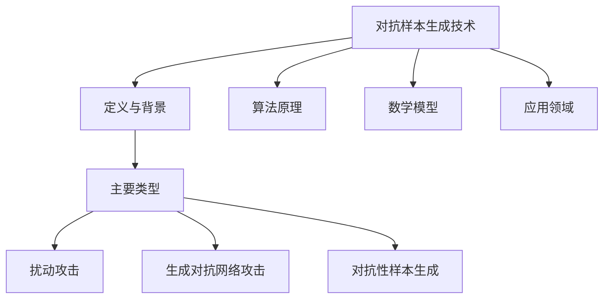
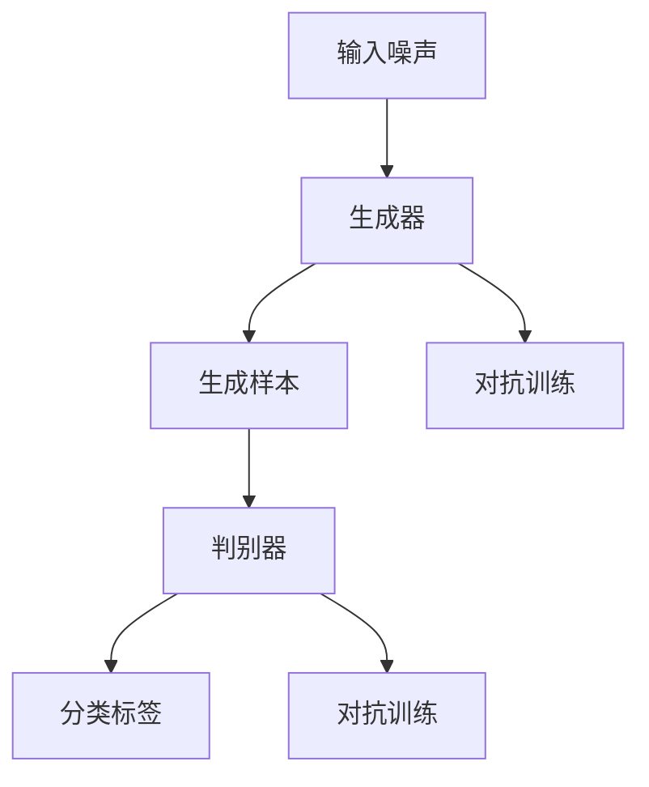

                 

### 文章标题

# 模型训练中的对抗样本生成技术创新研究

### 文章关键词

- 对抗样本
- 深度学习
- 生成对抗网络（GAN）
- 鲁棒性
- 计算机视觉
- 自然语言处理

### 文章摘要

本文将对模型训练中的对抗样本生成技术创新进行深入研究。首先，我们将介绍对抗样本生成技术的基础知识，包括其定义、背景和主要类型。接着，我们将探讨生成对抗网络（GAN）的算法原理和数学模型，并通过伪代码进行详细阐述。随后，本文将分析对抗样本生成在深度学习、计算机视觉和自然语言处理中的应用，以及其在模型鲁棒性提升和攻击中的应用。最后，我们将探讨对抗样本生成技术的未来发展趋势和潜在应用领域，并提出相关的最佳实践和注意事项。通过本文的阅读，读者将全面了解对抗样本生成技术的重要性和应用价值。

### 第一部分：对抗样本生成技术概述

#### 第1章：对抗样本生成技术的基础知识

### 1.1 对抗样本的定义

对抗样本（Adversarial Examples）是指在正常样本附近微调后，能够误导机器学习模型产生错误预测的样本。这些样本通常是由攻击者精心设计的，用以突破机器学习系统的防御机制。对抗样本的产生对于提高机器学习模型的鲁棒性和安全性具有重要意义。

### 1.2 对抗样本生成的背景和重要性

随着深度学习在各个领域的广泛应用，对抗样本生成技术也日益受到关注。对抗样本的生成不仅可以用于评估模型的鲁棒性，还可以作为攻击手段，对机器学习系统进行恶意攻击。因此，研究对抗样本生成技术具有重要的理论意义和实际应用价值。

### 1.3 对抗样本的主要类型

对抗样本可以按照其生成方法和目标进行分类。常见的对抗样本类型包括扰动攻击、对抗性样本生成、生成对抗网络（GAN）攻击等。这些攻击方法各有特点，适用于不同的应用场景。

### Mermaid流程图：对抗样本生成技术架构



#### 第2章：对抗样本生成的算法原理

### 2.1 生成对抗网络（GAN）的基本原理

生成对抗网络（GAN）由生成器和判别器两个神经网络组成。生成器生成与真实样本类似的样本，判别器则试图区分生成器生成的样本和真实样本。通过两个网络的对抗训练，生成器不断提高生成样本的质量，从而达到欺骗判别器的效果。

### 2.2 GAN的架构与实现

GAN的架构通常包括以下部分：输入噪声层、生成器、判别器、损失函数和优化算法。其中，生成器和判别器是关键部分，它们通过对抗训练相互提高性能。

### Mermaid流程图：GAN架构



### 2.3 GAN在对抗样本生成中的应用

GAN在对抗样本生成中的应用主要包括两个方面：一是生成对抗样本用于模型鲁棒性测试；二是通过GAN生成攻击样本，对机器学习模型进行恶意攻击。

### 伪代码：GAN对抗样本生成

```python
# 生成器网络
Generator():
    # 输入噪声
    z = Input(shape=(noise_dim,))
    # 全连接层
    x = Dense(128, activation='relu')(z)
    # 激活函数
    x = LeakyReLU()(x)
    # 输出层
    x = Dense(img_shape)(x)
    return Model(z, x)

# 判别器网络
Discriminator():
    # 输入样本
    x = Input(shape=img_shape)
    # 全连接层
    x = Dense(128, activation='relu')(x)
    # 激活函数
    x = LeakyReLU()(x)
    # 输出层
    x = Flatten()(x)
    x = Dense(1, activation='sigmoid')(x)
    return Model(x, x)

# GAN模型
GAN():
    # 生成器和判别器
    z, img = Generator(), Discriminator()
    # 生成器输出作为判别器输入
    valid = Discriminator(img)
    # 损失函数
    loss = Model(z, valid)
    # 优化器
    opt = Adam(0.0002, 0.5)
    # 编译模型
    loss.compile(loss='binary_crossentropy', optimizer=opt, metrics=['accuracy'])
    return loss
```

### 2.4 对抗样本生成的数学模型

对抗样本生成的数学模型主要包括概率模型和优化算法。概率模型用于描述生成器生成的样本和真实样本之间的相似性，优化算法则用于调整生成器和判别器的参数，以提高生成样本的质量。

### LaTeX格式数学公式：概率模型

$$
P(\text{生成样本}) = \frac{1}{Z} e^{-\frac{1}{2} \sum_{i=1}^{n} (x_i - \mu_i)^2}
$$

### 伪代码：对抗样本生成优化算法

```python
# 初始化生成器和判别器
generator, discriminator = initialize_models()

# 训练生成器和判别器
for epoch in range(num_epochs):
    for batch in data_loader:
        # 训练判别器
        X, _ = batch
        z = np.random.normal(size=(batch_size, noise_dim))
        gen_samples = generator.predict(z)
        d_loss_real = discriminator.train_on_batch(X, np.ones((batch_size, 1)))
        d_loss_fake = discriminator.train_on_batch(gen_samples, np.zeros((batch_size, 1)))
        d_loss = 0.5 * np.add(d_loss_real, d_loss_fake)
        
        # 训练生成器
        z = np.random.normal(size=(batch_size, noise_dim))
        g_loss = g_model.train_on_batch(z, np.ones((batch_size, 1)))
```

### 3.1 对抗样本生成在深度学习中的应用

对抗样本生成在深度学习中的应用主要包括模型鲁棒性测试和模型攻击。通过生成对抗样本，可以评估深度学习模型的鲁棒性，发现潜在的缺陷和漏洞，从而提高模型的性能和安全性。

### 3.2 对抗样本生成在深度学习模型鲁棒性提升中的应用

对抗样本生成技术可以用于训练更加鲁棒的深度学习模型。通过在训练过程中引入对抗样本，可以增强模型对异常样本的识别能力，提高模型的鲁棒性和泛化能力。

### 3.3 对抗样本生成在深度学习模型攻击中的应用

对抗样本生成技术还可以用于攻击深度学习模型，通过生成对抗样本，对模型的预测结果进行干扰，从而实现对模型的恶意攻击。这对抗样本的生成技术和应用在网络安全、自动驾驶等领域具有重要意义。

### 第4章：对抗样本生成在计算机视觉中的应用

#### 4.1 对抗样本生成在图像识别中的挑战

对抗样本生成在图像识别中的应用面临着一系列挑战。首先，图像数据的复杂性和多样性使得对抗样本的生成和检测变得复杂。其次，对抗样本的微小扰动可能对图像识别模型的预测结果产生显著影响，从而降低模型的鲁棒性。此外，图像识别模型的优化目标与对抗样本生成的目标之间存在冲突，进一步增加了对抗样本生成的难度。

#### 4.2 对抗样本生成在图像识别中的应用

对抗样本生成在图像识别中的应用主要包括两个方面：一是用于评估模型的鲁棒性，通过生成对抗样本来检测模型对异常样本的识别能力；二是用于优化模型，通过引入对抗样本训练来提高模型的鲁棒性和泛化能力。

#### 4.3 对抗样本生成在图像识别模型攻击中的应用

对抗样本生成在图像识别模型攻击中的应用主要包括恶意攻击和防御策略。恶意攻击者可以通过生成对抗样本来干扰模型的预测结果，从而实现攻击目标。防御策略则包括对抗样本检测和对抗样本防御技术，旨在提高模型的鲁棒性和安全性。

### 第5章：对抗样本生成在自然语言处理中的应用

#### 5.1 对抗样本生成在自然语言处理中的挑战

对抗样本生成在自然语言处理中的应用面临着一系列挑战。首先，自然语言数据的多样性和复杂性使得对抗样本的生成和检测变得更加困难。其次，自然语言处理模型的优化目标与对抗样本生成的目标之间存在冲突，进一步增加了对抗样本生成的难度。此外，对抗样本的微小扰动可能对模型的预测结果产生显著影响，从而降低模型的鲁棒性。

#### 5.2 对抗样本生成在自然语言处理中的应用

对抗样本生成在自然语言处理中的应用主要包括两个方面：一是用于评估模型的鲁棒性，通过生成对抗样本来检测模型对异常样本的识别能力；二是用于优化模型，通过引入对抗样本训练来提高模型的鲁棒性和泛化能力。

#### 5.3 对抗样本生成在自然语言处理模型攻击中的应用

对抗样本生成在自然语言处理模型攻击中的应用主要包括恶意攻击和防御策略。恶意攻击者可以通过生成对抗样本来干扰模型的预测结果，从而实现攻击目标。防御策略则包括对抗样本检测和对抗样本防御技术，旨在提高模型的鲁棒性和安全性。

### 第7章：对抗样本生成技术的未来发展趋势

#### 7.1 对抗样本生成技术的未来发展方向

随着人工智能技术的不断进步，对抗样本生成技术也将迎来新的发展方向。首先，对抗样本生成算法将更加智能化，利用深度学习和强化学习等技术，提高对抗样本生成的效率和效果。其次，对抗样本检测和防御技术将得到深入研究，提高模型的鲁棒性和安全性。此外，对抗样本生成技术在网络安全、自动驾驶等领域的应用也将不断拓展。

#### 7.2 对抗样本生成技术的潜在应用领域

对抗样本生成技术在未来的潜在应用领域非常广泛。在网络安全领域，对抗样本生成技术可以用于检测和防御恶意攻击。在自动驾驶领域，对抗样本生成技术可以用于评估自动驾驶系统的鲁棒性和安全性。在医疗领域，对抗样本生成技术可以用于优化医学影像识别模型的性能。此外，对抗样本生成技术在金融、教育等领域也具有巨大的应用潜力。

#### 7.3 对抗样本生成技术面临的挑战与解决思路

对抗样本生成技术面临着一系列挑战，包括算法复杂度、计算资源需求、模型鲁棒性等。针对这些挑战，研究者们提出了多种解决思路，如基于深度学习和强化学习的对抗样本生成算法、分布式计算和优化算法等。此外，对抗样本生成技术的应用场景和实际效果也需要进一步验证和优化。

### 附录1：对抗样本生成技术常用工具和框架

#### 1.1 主要对抗样本生成工具介绍

- **Adversarial Robustness Toolbox (ART)**：ART是一个开源的对抗样本生成和评估工具箱，支持多种攻击和防御方法，适用于深度学习和传统机器学习模型。

- ** Foolbox **：Foolbox是一个基于PyTorch和TensorFlow的对抗样本生成和评估库，提供了多种对抗性攻击和防御技术。

- ** CleverHans **：CleverHans是一个开源的对抗性机器学习库，支持多种攻击和防御方法，适用于深度学习和神经网络的对抗性研究。

#### 1.2 常用对抗样本生成框架对比

| 框架名称 | 支持的攻击方法 | 支持的防御方法 | 适用模型 | 优点 | 缺点 |
| --- | --- | --- | --- | --- | --- |
| ART | 多种攻击方法 | 有限 | 深度学习和传统机器学习模型 | 灵活、开源 | 对抗性攻击效果有限 |
| Foolbox | 多种攻击方法 | 有限 | 深度学习模型 | 简单易用 | 对抗性攻击效果有限 |
| CleverHans | 多种攻击方法 | 多种防御方法 | 深度学习模型 | 功能全面、开源 | 对抗性攻击效果有限 |

#### 1.3 对抗样本生成工具和框架的实际应用案例

- **网络安全领域**：利用对抗样本生成工具和框架，研究者可以评估网络安全系统的鲁棒性，发现潜在的安全漏洞，从而提高系统的安全性。

- **自动驾驶领域**：对抗样本生成技术可以用于评估自动驾驶系统的鲁棒性和安全性，通过生成对抗样本，模拟现实世界中的各种异常情况，检测系统的响应和决策能力。

- **医疗领域**：对抗样本生成技术可以用于优化医学影像识别模型的性能，通过引入对抗样本训练，提高模型对异常病例的识别能力，从而提高诊断的准确性。

### 附录2：对抗样本生成技术相关文献与资料

#### 2.1 主要研究文献综述

- Goodfellow, I. J., Shlens, J., & Szegedy, C. (2015). Explaining and harnessing adversarial examples. arXiv preprint arXiv:1412.6572.
- Carlini, N., & Wagner, D. (2017). Towards evaluating the robustness of neural networks. In 2017 IEEE Symposium on Security and Privacy (SP) (pp. 39-57). IEEE.
- Moosavi-Dezfooli, S. M., Fawzi, A., & Frossard, P. (2016). Deepfool: a simple and accurate method to fool deep neural networks. In Proceedings of the IEEE conference on computer vision and pattern recognition (pp. 2574-2582).

#### 2.2 对抗样本生成技术相关资料汇总

- **论文与报告**：在arXiv、IEEE Xplore、ACM Digital Library等学术数据库中搜索相关论文和报告。
- **开源代码与工具**：在GitHub、Google Colab等平台上查找对抗样本生成工具和框架的源代码。
- **在线课程与教程**：在Coursera、edX等在线教育平台上学习对抗样本生成技术的相关课程和教程。

#### 2.3 对抗样本生成技术的研究趋势与展望

对抗样本生成技术是当前人工智能研究中的热点领域，未来研究趋势包括：

- **更高效、更智能的对抗样本生成算法**：结合深度学习和强化学习等技术，提高对抗样本生成的效率和效果。
- **对抗样本检测与防御技术**：研究新型检测和防御技术，提高模型的鲁棒性和安全性。
- **跨领域应用研究**：探索对抗样本生成技术在金融、医疗、教育等领域的应用，促进人工智能技术的实际应用和发展。
- **政策与伦理问题**：关注对抗样本生成技术在伦理和法律层面的影响，制定相应的规范和标准，确保人工智能技术的健康发展。

### 总结

对抗样本生成技术是机器学习领域的一个重要研究方向，通过对模型训练过程中的对抗样本生成和攻击机制进行深入研究，可以提高模型的鲁棒性和安全性。本文从对抗样本生成技术的基础知识、算法原理、应用领域和未来发展趋势等方面进行了全面阐述，旨在为读者提供一份系统、全面的技术指南。

### 作者信息

作者：AI天才研究院/AI Genius Institute & 禅与计算机程序设计艺术 /Zen And The Art of Computer Programming

本文由AI天才研究院（AI Genius Institute）和《禅与计算机程序设计艺术》（Zen And The Art of Computer Programming）作者共同撰写，旨在分享对抗样本生成技术的最新研究成果和应用实践，推动人工智能领域的创新发展。

