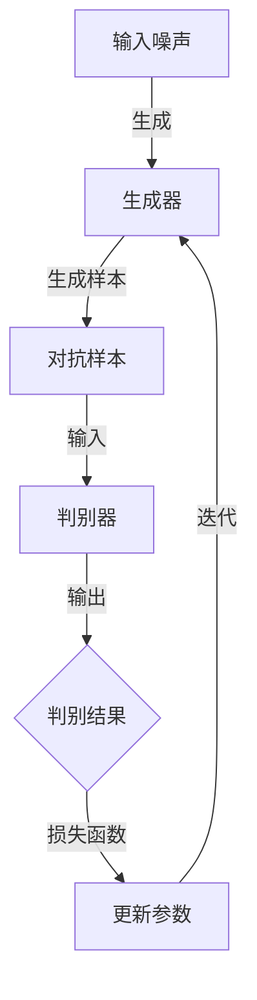

                 

### 引言

在当今飞速发展的科技时代，人工智能（AI）已成为社会进步的重要驱动力。从自动驾驶汽车、智能助手到医疗诊断系统，AI技术正在各个领域发挥重要作用。然而，随着AI技术的广泛应用，其公平性问题也愈发凸显。特别是在模型训练过程中，如何确保AI系统不带有偏见，从而提高系统的公平性，成为了研究者们关注的焦点。

公平性是指AI系统在处理不同群体数据时，不因种族、性别、年龄等因素而对某些群体产生不公平的对待。然而，现实中的AI模型训练过程往往由于数据集的不均衡、训练目标的不明确等原因，导致模型在特定群体上表现不佳，甚至产生偏见。例如，面部识别技术在某些种族上的识别率较低，金融风控模型对不同性别和收入水平的贷款申请者评估结果存在偏差，这些问题都严重影响了AI系统的公平性和可信度。

对抗训练作为一种新兴的训练技术，通过在训练过程中引入对抗样本，使模型能够学习到更加鲁棒和公平的特征表示。本文将深入探讨对抗训练在模型训练中的原理、应用领域、优化方法以及在提高AI系统公平性方面的创新应用。具体而言，本文将从以下几个方面展开讨论：

1. **基础理论与核心概念**：介绍对抗训练的基本原理，包括对抗神经网络（GAN）的架构及其互动过程。
2. **对抗训练的应用领域**：分析对抗训练在图像处理和自然语言处理等领域的应用实例。
3. **对抗训练的优化方法**：探讨对抗训练中的常见问题及优化方法。
4. **创新应用与案例分析**：展示对抗训练在提高AI系统公平性方面的实际应用和案例分析。
5. **未来发展趋势**：展望对抗训练技术的发展趋势以及在AI系统公平性提升中的潜在影响。

通过以上讨论，本文旨在为读者提供一个全面、系统的对抗训练与AI系统公平性提升的视角，以期为未来研究和应用提供有益的参考。

### 书籍《模型训练中的对抗训练在提高AI系统公平性方面的创新应用》目录大纲设计

在深入探讨模型训练中的对抗训练及其在提高AI系统公平性方面的应用之前，首先需要为读者提供一个清晰、全面的目录大纲。本文书籍将以逻辑清晰、结构紧凑的方式，将对抗训练的理论与实践相结合，为读者呈现一个全方位的知识体系。

#### 第一部分：基础理论与核心概念

**第1章：引言**

本章作为整本书的开篇，将介绍对抗训练在AI系统公平性提升中的背景与重要性，并概述本书的结构与内容安排。具体包括：

- **1.1 书籍背景与目的**：解释为什么对抗训练在AI系统中具有特殊地位，以及本书旨在解决的主要问题。
- **1.2 对抗训练概述**：简要介绍对抗训练的概念，说明其在AI系统训练中的应用价值。
- **1.3 对抗训练在AI系统公平性提升中的重要性**：阐述对抗训练如何帮助解决AI系统中的公平性问题。
- **1.4 本书结构概述**：对后续章节的内容进行概述，使读者对整个书籍的结构有一个全面的了解。

**第2章：对抗训练的基本原理**

本章将深入探讨对抗训练的基本原理，为后续章节的理论分析和应用实践打下坚实的基础。主要内容包括：

- **2.1 对抗训练的定义与原理**：详细解释对抗训练的基本概念，以及它是如何通过对抗网络实现模型优化的。
- **2.2 对抗神经网络（GAN）的架构**：介绍生成对抗网络（GAN）的组成部分，包括生成器（Generator）和判别器（Discriminator）的功能和互动过程。
  - **2.2.1 生成器（Generator）**：说明生成器的任务和实现方式。
  - **2.2.2 判别器（Discriminator）**：阐述判别器的任务和实现方式。
  - **2.2.3 生成对抗网络（GAN）的互动过程**：分析生成器和判别器在训练过程中的交互机制。
- **2.3 对抗训练的优势与挑战**：讨论对抗训练的优点和面临的挑战，为后续的优化方法研究提供背景。

#### 第二部分：对抗训练的应用领域

**第3章：对抗训练在图像处理中的应用**

本章将聚焦对抗训练在图像处理领域的应用，通过具体实例展示其实现效果和优势。主要内容包括：

- **3.1 生成对抗网络（GAN）在图像生成中的应用**：介绍GAN在图像生成中的具体应用，如生成高清图像、风格迁移等。
- **3.1.1 图像风格迁移**：探讨如何使用对抗训练实现图像风格迁移。
- **3.1.2 图像修复与超分辨率**：分析对抗训练在图像修复和超分辨率任务中的应用。
- **3.2 防止生成模型过度拟合**：讨论对抗训练如何防止生成模型的过度拟合，提高模型的泛化能力。

**第4章：对抗训练在自然语言处理中的应用**

本章将介绍对抗训练在自然语言处理领域的应用，包括文本生成、文本风格迁移等任务。主要内容包括：

- **3.2.1 生成对抗网络（GAN）在文本生成中的应用**：阐述GAN在生成自然语言文本中的实现方式。
- **3.2.2 文本风格迁移**：介绍如何使用对抗训练实现文本风格的迁移。
- **3.2.3 防止生成模型过度拟合**：分析对抗训练在自然语言处理中的防拟合机制。

#### 第三部分：对抗训练的优化方法

**第5章：对抗训练中的常见问题与优化方法**

本章将探讨对抗训练过程中常见的挑战和问题，并提出相应的优化方法。主要内容包括：

- **4.1 对抗训练中的常见问题**：分析对抗训练中可能遇到的问题，如模型不稳定、训练困难等。
  - **4.1.1 模型不稳定性**：探讨导致模型不稳定的原因及解决方案。
  - **4.1.2 模型训练困难**：分析训练过程中可能遇到的困难，如梯度消失、梯度爆炸等。
  - **4.1.3 泄露问题**：讨论对抗网络中可能出现的模型泄露问题及其防范措施。
- **4.2 常见优化方法**：介绍几种常见的对抗训练优化方法，包括梯度惩罚、随机梯度下降（SGD）改进、优化器选择等。

#### 第二部分：创新应用与案例分析

**第6章：对抗训练在提高AI系统公平性方面的创新应用**

本章将展示对抗训练在提高AI系统公平性方面的创新应用，通过实际案例深入分析其效果和实现方法。主要内容包括：

- **5.1 对抗训练在消除偏见方面的应用**：探讨如何使用对抗训练消除AI系统中的偏见，提高系统的多样性。
  - **5.1.1 种族、性别偏见消除**：分析对抗训练在消除种族和性别偏见中的应用。
  - **5.1.2 多样性提升**：讨论对抗训练如何提升模型对多样性的感知能力。
- **5.2 对抗训练在敏感任务中的公平性保障**：探讨对抗训练在医疗诊断、金融风控等敏感任务中的公平性保障应用。
  - **5.2.1 医疗诊断中的公平性**：分析对抗训练在医疗诊断中的实际应用。
  - **5.2.2 金融风控中的公平性**：讨论对抗训练在金融风控中的公平性保障。

**第7章：对抗训练在具体领域的应用实例**

本章将通过具体领域的应用实例，展示对抗训练在提高AI系统公平性方面的实际效果。主要内容包括：

- **6.1 对抗训练在图像识别中的应用实例**：介绍图像识别任务中的对抗训练实现方法，包括数据集准备、模型训练与评估等。
- **6.2 对抗训练在自然语言处理中的应用实例**：探讨自然语言处理任务中的对抗训练应用，包括文本生成、文本风格迁移等。

#### 第四部分：未来发展趋势

**第8章：对抗训练在提高AI系统公平性方面的未来发展趋势**

本章将展望对抗训练技术的发展趋势，以及其在提高AI系统公平性方面的潜在影响。主要内容包括：

- **7.1 对抗训练技术的发展趋势**：分析对抗训练技术的未来研究方向和发展方向。
- **7.2 对抗训练在AI系统公平性提升中的潜在影响**：探讨对抗训练对AI系统公平性提升的长期影响和潜在应用。
- **7.3 对抗训练与其他技术的融合与应用前景**：讨论对抗训练与其他AI技术的融合应用前景。

### 总结与展望

**第9章：总结与展望**

本章将对整本书的内容进行总结，强调对抗训练在提高AI系统公平性方面的重要性和贡献。同时，探讨未来研究的方向和挑战，为读者提供进一步的研究参考。

**附录A：常用对抗训练框架与工具**

附录部分将介绍常用的对抗训练框架与工具，包括TensorFlow、PyTorch、MXNet和Keras等，帮助读者在实际应用中更好地理解和使用对抗训练技术。

**附录B：参考书目与文献**

附录还将列出本书所引用的主要参考书目和文献，为读者提供进一步学习的资源。

通过以上目录大纲的设计，本书旨在为读者提供一个系统、全面的对抗训练与AI系统公平性提升的知识体系，帮助读者深入理解这一领域的核心概念和应用实践。

### 第1章：引言

#### 1.1 书籍背景与目的

随着人工智能（AI）技术的飞速发展，其应用场景越来越广泛，从自动驾驶汽车到智能医疗诊断系统，AI已经成为了现代社会的重要基础设施。然而，AI系统的公平性问题也随之突显。在模型训练过程中，由于数据集的不均衡、模型的设计缺陷等因素，AI系统可能会对某些群体产生不公平的对待，这种现象被称为“算法偏见”（algorithmic bias）。算法偏见不仅损害了AI系统的社会信誉，还可能对用户造成实质性的不公平影响。因此，如何提高AI系统的公平性，已成为当前研究的热点和挑战。

本书旨在系统地探讨对抗训练（Adversarial Training）在提高AI系统公平性方面的应用。对抗训练是一种通过引入对抗样本来增强模型鲁棒性和公平性的训练方法。通过对抗训练，AI系统可以在面对不同数据时，学习到更加全面和公正的特征表示，从而减少算法偏见，提高系统的公平性。

本书的主要目的是为研究人员和工程师提供一个全面、系统的对抗训练与AI系统公平性提升的知识体系。具体来说，本书将涵盖以下内容：

1. **对抗训练的基本原理**：介绍对抗训练的定义、原理及其在AI系统训练中的应用价值。
2. **对抗训练的应用领域**：分析对抗训练在图像处理、自然语言处理等领域的应用实例。
3. **对抗训练的优化方法**：探讨对抗训练中常见的问题及优化方法。
4. **创新应用与案例分析**：展示对抗训练在提高AI系统公平性方面的实际应用和案例分析。
5. **未来发展趋势**：展望对抗训练技术的发展趋势以及在AI系统公平性提升中的潜在影响。

通过上述内容的深入探讨，本书希望为读者提供一个全面、系统的对抗训练与AI系统公平性提升的视角，以期为未来的研究和应用提供有益的参考。

#### 1.2 对抗训练概述

对抗训练（Adversarial Training）是一种通过引入对抗样本（adversarial examples）来增强模型鲁棒性和公平性的训练方法。其核心思想是在训练过程中模拟攻击者（即对抗生成器）的行为，通过生成对抗样本来挑战模型的泛化能力，从而提高模型在面对未知样本时的鲁棒性。

对抗训练的基本原理可以概括为以下三个方面：

1. **对抗样本生成**：
   对抗样本的生成是对抗训练的关键步骤。其目标是通过微小的、难以察觉的扰动，使得原本正确的样本被模型错误分类。这些扰动通常是通过优化一个攻击函数来实现的，该函数旨在最大化模型对原始样本的分类误差。常见的对抗样本生成方法包括基于梯度上升（gradient ascent）的方法和基于搜索算法的方法。

2. **对抗网络**：
   对抗网络是对抗训练的核心组成部分，包括生成器（Generator）和判别器（Discriminator）。生成器的任务是生成具有真实样本特征的对抗样本，而判别器的任务是区分对抗样本和真实样本。两者在训练过程中相互对抗，生成器不断优化对抗样本以欺骗判别器，而判别器则不断学习以准确区分样本。

3. **训练过程**：
   在对抗训练中，生成器和判别器交替训练，生成器试图生成更加逼真的对抗样本，判别器则试图更好地识别对抗样本。这一过程通常是一个动态的博弈过程，两者的性能随着训练逐步提升。通过这种对抗性训练，模型可以学习到更加鲁棒的特性，从而在真实世界中面对更复杂的、未知的样本时，表现出更强的鲁棒性和公平性。

对抗训练的主要特点包括：

1. **提高鲁棒性**：
   对抗训练通过引入对抗样本，使模型在训练过程中不断适应不同的攻击手段，从而提高模型对异常样本的泛化能力。

2. **增强公平性**：
   对抗训练可以帮助模型消除对某些群体的偏见，通过学习到更加全面和公正的特征表示，提高系统的公平性和公正性。

3. **对抗性优化**：
   对抗训练的过程本质上是生成器和判别器之间的对抗性优化过程，这种对抗性优化有助于模型在训练过程中不断进步。

总之，对抗训练作为一种创新的训练方法，已经在图像处理、自然语言处理等多个领域取得了显著的应用成果。通过引入对抗样本和对抗网络，对抗训练不仅提高了模型的鲁棒性和泛化能力，还在提高AI系统公平性方面展示了巨大的潜力。

#### 1.3 对抗训练在AI系统公平性提升中的重要性

在人工智能（AI）技术飞速发展的今天，AI系统的公平性问题逐渐成为公众和学术界关注的焦点。公平性不仅关乎社会正义，更是AI系统在实际应用中能否得到广泛接受和信任的关键。而对抗训练（Adversarial Training）作为一种创新的训练方法，在提升AI系统公平性方面具有独特的重要性和潜力。

首先，对抗训练通过引入对抗样本（adversarial examples），使AI系统在面对不同群体数据时能够更加公平地处理。在传统训练过程中，由于数据集的不均衡、标注的不准确等因素，AI系统可能会对某些群体产生偏见。例如，在面部识别技术中，某些种族或性别的识别率较低，这显然是不公平的。而对抗训练通过生成对抗样本，使模型能够在训练过程中学习到更加全面和鲁棒的特征表示，从而减少这种偏见。

其次，对抗训练有助于消除AI系统中的算法偏见。算法偏见是指AI系统在处理不同群体数据时，由于模型设计或训练数据的不均衡，导致系统对某些群体产生不公平对待。例如，在信用评分系统中，某些群体的评分可能较低，这可能导致这些群体无法获得贷款或信用卡。对抗训练通过不断生成对抗样本并优化模型，使模型能够学习到更加公正和客观的特征，从而减少算法偏见，提高系统的公平性。

此外，对抗训练在提升AI系统的多样性和包容性方面也具有重要作用。在现实世界中，不同的群体有着各自独特的特征和需求。传统的AI系统由于训练数据的不均衡，往往无法很好地处理这些多样性。而对抗训练通过引入对抗样本，使模型能够更好地理解并适应不同群体的多样性，从而提高系统的包容性和多样性感知能力。

对抗训练在AI系统公平性提升中的重要性还体现在其对模型鲁棒性的提升上。在现实应用中，AI系统往往需要处理各种复杂和未知的场景。对抗训练通过引入对抗样本，使模型在训练过程中不断面对各种可能的攻击和挑战，从而提高模型的鲁棒性和泛化能力。这种鲁棒性不仅有助于减少模型在实际应用中的偏见，还能够使系统在面对新的、未经验证的场景时，保持稳定的性能。

总的来说，对抗训练在提升AI系统公平性方面具有显著的作用和潜力。通过引入对抗样本，对抗训练不仅能够减少算法偏见，提高系统的公平性，还能够增强模型的鲁棒性和多样性感知能力。然而，对抗训练技术仍然面临许多挑战，如对抗样本的生成难度、训练效率等问题。未来的研究需要进一步探讨如何优化对抗训练方法，使其在实际应用中发挥更大的作用。

#### 1.4 本书结构概述

本书旨在系统地探讨对抗训练（Adversarial Training）在模型训练中的应用，特别是其在提高AI系统公平性方面的创新应用。为了使读者能够全面、系统地掌握这一领域的关键概念和最新进展，本书将分为四大部分，每一部分包含若干章节，分别聚焦于不同的主题和内容。以下是本书的结构概述：

**第一部分：基础理论与核心概念**

**第1章：引言**  
本章作为整本书的开篇，将介绍对抗训练在AI系统公平性提升中的背景与重要性，并概述本书的结构与内容安排。

**第2章：对抗训练的基本原理**  
本章将深入探讨对抗训练的基本原理，包括对抗训练的定义、原理及其在AI系统训练中的应用价值。同时，还将详细介绍对抗神经网络（GAN）的架构及其互动过程。

**第二部分：对抗训练的应用领域**

**第3章：对抗训练在图像处理中的应用**  
本章将聚焦对抗训练在图像处理领域的应用，通过具体实例展示其实现效果和优势，包括生成对抗网络（GAN）在图像生成、图像风格迁移和图像修复与超分辨率等任务中的应用。

**第4章：对抗训练在自然语言处理中的应用**  
本章将介绍对抗训练在自然语言处理领域的应用，包括生成对抗网络（GAN）在文本生成、文本风格迁移等任务中的应用，以及对抗训练如何防止生成模型过度拟合。

**第三部分：对抗训练的优化方法**

**第5章：对抗训练中的常见问题与优化方法**  
本章将探讨对抗训练过程中常见的挑战和问题，并提出相应的优化方法，包括梯度惩罚、随机梯度下降（SGD）改进和优化器选择等。

**第四部分：创新应用与案例分析**

**第6章：对抗训练在提高AI系统公平性方面的创新应用**  
本章将展示对抗训练在提高AI系统公平性方面的创新应用，通过实际案例深入分析其效果和实现方法，探讨对抗训练在消除偏见、多样性提升和敏感任务中的公平性保障应用。

**第7章：对抗训练在具体领域的应用实例**  
本章将通过具体领域的应用实例，展示对抗训练在图像识别和自然语言处理任务中的实际效果，包括实现流程、数据集准备、模型训练与评估等内容。

**第8章：对抗训练在提高AI系统公平性方面的未来发展趋势**  
本章将展望对抗训练技术的发展趋势，以及其在AI系统公平性提升中的潜在影响，讨论对抗训练与其他AI技术的融合应用前景。

通过以上结构的安排，本书旨在为读者提供一个全面、系统的对抗训练与AI系统公平性提升的知识体系，帮助读者深入理解这一领域的核心概念和应用实践。

### 第2章：对抗训练的基本原理

对抗训练（Adversarial Training）是一种通过引入对抗样本（adversarial examples）来增强模型鲁棒性和公平性的训练方法。其核心思想是在训练过程中模拟攻击者（即对抗生成器）的行为，通过生成对抗样本来挑战模型的泛化能力，从而提高模型在面对未知样本时的鲁棒性。本章将详细探讨对抗训练的基本原理，包括对抗训练的定义、原理及其在AI系统训练中的应用价值。

#### 2.1 对抗训练的定义与原理

对抗训练的定义可以归结为：通过生成对抗样本，并利用这些样本对原始训练数据集进行补充，从而提高模型的泛化能力和鲁棒性。对抗训练的核心是生成对抗网络（Generative Adversarial Network，GAN），由生成器（Generator）和判别器（Discriminator）两个主要组件组成。

- **生成器（Generator）**：生成器的任务是生成与真实数据分布相近的对抗样本。生成器通常是一个生成模型，其输入是一个随机噪声向量，通过一系列变换后生成具有真实数据特征的样本。生成器的目标是使判别器无法区分生成的样本和真实样本。

- **判别器（Discriminator）**：判别器的任务是判断输入样本是真实样本还是生成样本。判别器通常是一个判别模型，其输入是一个样本，输出是一个概率值，表示该样本是真实样本的概率。判别器的目标是准确地区分真实样本和生成样本。

对抗训练的原理可以看作是一个博弈过程。在这个过程中，生成器和判别器相互对抗，生成器试图生成更逼真的对抗样本来欺骗判别器，而判别器则试图更好地识别对抗样本。两者通过不断迭代训练，逐步提升自身的性能。最终，生成器能够生成足够逼真的样本，使得判别器无法区分真实样本和生成样本。

对抗训练的过程可以简化为以下步骤：

1. **初始化生成器和判别器**：生成器和判别器通常初始化为较弱的模型，以便在训练过程中逐步提升。

2. **交替训练**：生成器和判别器交替进行训练。在每次迭代中，生成器根据随机噪声生成对抗样本，判别器则使用这些对抗样本和真实样本进行训练。

3. **更新模型参数**：通过反向传播算法，根据判别器的损失函数（例如二元交叉熵损失函数）来更新生成器和判别器的参数。

4. **评估模型性能**：在每个训练阶段，评估生成器和判别器的性能，以确定是否需要进一步调整模型结构或超参数。

通过这种交替训练的过程，生成器和判别器逐步提升，最终达到一种平衡状态，使得生成器能够生成逼真的对抗样本，判别器能够准确地区分真实样本和生成样本。

#### 2.2 对抗神经网络（GAN）的架构

生成对抗网络（GAN）是对抗训练的核心框架，其架构由生成器和判别器两个主要组件组成。下面将详细介绍GAN的各个部分及其功能。

- **生成器（Generator）**

生成器是一个生成模型，其输入是一个随机噪声向量，通常使用噪声分布（如正态分布）作为输入。生成器的目标是生成具有真实数据特征的样本，以欺骗判别器。生成器通常由多个全连接层或卷积层组成，通过一系列非线性变换将噪声向量映射到数据空间。生成器的输出可以是图像、文本或任何其他类型的数据。

生成器的训练目标是最大化判别器对其生成样本的判断概率。具体来说，生成器试图最小化以下损失函数：

$$
L_G = -\log(D(G(z))
$$

其中，$D$ 是判别器的输出概率，$G(z)$ 是生成器生成的样本。

- **判别器（Discriminator）**

判别器是一个判别模型，其目标是判断输入样本是真实样本还是生成样本。判别器的输入可以是任何类型的数据，包括图像、文本等。判别器的输出是一个概率值，表示输入样本是真实样本的概率。

判别器的训练目标是最大化其分类准确性，即最大化以下损失函数：

$$
L_D = -[y \cdot \log(D(x)) + (1 - y) \cdot \log(1 - D(x))]
$$

其中，$y$ 是标签，当输入样本为真实样本时，$y=1$；当输入样本为生成样本时，$y=0$。

- **生成对抗网络（GAN）的互动过程**

在生成对抗网络的训练过程中，生成器和判别器通过交替训练相互影响。具体来说，训练过程可以分为以下几个阶段：

1. **生成器阶段**：在每次迭代中，生成器根据随机噪声生成对抗样本，并将其输入到判别器中。

2. **判别器阶段**：判别器使用生成的对抗样本和真实样本进行训练，以提升其分类准确性。

3. **更新阶段**：根据判别器的损失函数，更新生成器和判别器的参数。

4. **评估阶段**：在每个训练阶段，评估生成器和判别器的性能，以确定是否需要进一步调整模型结构或超参数。

通过这种交替训练的过程，生成器和判别器逐步提升，最终达到一种平衡状态，使得生成器能够生成逼真的对抗样本，判别器能够准确地区分真实样本和生成样本。

#### 2.3 对抗训练的优势与挑战

对抗训练在AI系统训练中具有显著的优势，但也面临一些挑战。

- **优势**

1. **增强鲁棒性**：通过引入对抗样本，对抗训练使模型在面对未知的、异常的输入时，能够保持稳定的性能，从而提高模型的鲁棒性。

2. **提高公平性**：对抗训练通过生成对抗样本，使模型能够学习到更加全面和公正的特征表示，从而减少算法偏见，提高系统的公平性。

3. **多样性提升**：对抗训练能够使模型更好地理解不同群体的多样性，从而提高系统的包容性和多样性感知能力。

4. **自我监督学习**：对抗训练是一种自我监督学习（Self-Supervised Learning）方法，生成器和判别器的训练过程不需要额外的标签信息，从而减少了标注成本。

- **挑战**

1. **生成器与判别器的平衡**：在对抗训练中，生成器和判别器需要达到一种平衡状态，但这一过程可能非常复杂，难以实现。

2. **计算资源消耗**：对抗训练通常需要大量的计算资源，尤其是在处理大规模数据集时，训练时间可能非常长。

3. **生成样本的质量**：生成器生成的对抗样本质量直接影响训练效果，生成质量较差的样本可能会导致判别器无法有效学习。

4. **模型泄露问题**：在生成对抗网络中，模型泄露（Model Leakage）是一个常见问题，即生成器通过学习判别器的参数来生成样本，从而降低了训练效果。

总之，对抗训练作为一种创新的训练方法，在增强模型鲁棒性和公平性方面具有显著的优势，但也面临一些挑战。未来的研究需要进一步优化对抗训练方法，解决这些挑战，使其在实际应用中发挥更大的作用。

#### 2.4 对抗训练的基本概念

为了更好地理解对抗训练，我们需要先掌握以下几个基本概念：

- **生成器（Generator）**：
  生成器是生成对抗网络（GAN）中的一个组件，其目的是生成与真实数据分布相近的样本。生成器通常接受一个随机噪声向量作为输入，并通过一系列复杂的变换，生成具有真实数据特征的样本。生成器的目标是最小化判别器对其生成样本的判断概率，使其难以区分真实样本和生成样本。

- **判别器（Discriminator）**：
  判别器是生成对抗网络中的另一个组件，其任务是判断输入样本是真实样本还是生成样本。判别器通常接受一个样本作为输入，并输出一个概率值，表示该样本是真实样本的概率。判别器的目标是最大化其分类准确性，使其能够准确地区分真实样本和生成样本。

- **对抗样本（Adversarial Examples）**：
  对抗样本是在对抗训练过程中生成的一种特殊样本，其目的是挑战模型的泛化能力。对抗样本通常通过在原始样本上添加微小的扰动生成，这些扰动是经过精心设计的，以最大化模型的分类误差。对抗样本的引入使模型在训练过程中不断适应各种可能的攻击，从而提高模型的鲁棒性。

- **博弈过程（Game Process）**：
  在生成对抗网络中，生成器和判别器之间存在着一个动态的博弈过程。生成器试图生成更加逼真的对抗样本来欺骗判别器，而判别器则试图更好地识别对抗样本。通过这种博弈，生成器和判别器的性能逐步提升，最终达到一种平衡状态。

- **损失函数（Loss Function）**：
  损失函数是衡量模型性能的一个重要指标。在对抗训练中，生成器和判别器分别使用不同的损失函数进行优化。生成器通常使用二元交叉熵损失函数，其目的是最小化判别器对其生成样本的判断概率；判别器通常使用二元交叉熵损失函数或对数损失函数，其目的是最大化其分类准确性。

通过以上基本概念的介绍，我们可以更好地理解生成对抗网络的工作原理及其在对抗训练中的应用。这些概念构成了对抗训练的理论基础，为后续章节的深入探讨提供了必要的背景知识。

#### 对抗训练的核心概念架构

为了更好地理解对抗训练的核心概念，我们可以通过一个Mermaid流程图来展示其关键组成部分及其关系。



**流程说明：**

1. **输入噪声**：生成器从噪声分布（如正态分布）中获取一个随机噪声向量作为输入。

2. **生成器**：生成器接受随机噪声向量，通过一系列复杂的变换生成具有真实数据特征的对抗样本。

3. **对抗样本**：生成器生成的对抗样本被送入判别器进行判断。

4. **判别器**：判别器接收对抗样本，并输出一个概率值，表示该样本是真实样本的概率。

5. **判别结果**：根据判别器的输出，计算生成器和判别器的损失函数。

6. **更新参数**：通过反向传播算法，根据损失函数更新生成器和判别器的参数。

7. **迭代**：生成器和判别器交替进行训练，通过多次迭代，逐步提升其性能，达到平衡状态。

这个流程图展示了生成器和判别器之间的动态博弈过程，以及它们如何通过迭代和参数更新来逐步优化自身的性能。通过这个架构，我们可以清晰地看到对抗训练的核心概念和其相互关系，为后续章节的深入探讨提供了直观的视觉支持。

### 第3章：对抗训练在图像处理中的应用

对抗训练在图像处理领域展现出了巨大的潜力，通过生成对抗网络（GAN）的应用，显著提升了图像生成、图像风格迁移和图像修复与超分辨率等任务的性能。本章将详细探讨对抗训练在图像处理中的具体应用，并通过实例展示其实现效果和优势。

#### 3.1 生成对抗网络（GAN）在图像生成中的应用

生成对抗网络（GAN）在图像生成中的应用是最具代表性的一个领域。GAN通过生成器和判别器的博弈过程，能够生成高质量的图像，这些图像在视觉上与真实图像难以区分。以下是一个简单的实现流程：

**实现流程：**

1. **数据集准备**：
   准备一个包含真实图像的数据集，用于训练判别器。

2. **生成器设计**：
   生成器的输入是一个随机噪声向量，通过一系列的全连接层和激活函数，将噪声向量转换为一个具有真实图像特征的高维向量。这个高维向量再通过一系列的反卷积层，生成最终生成的图像。

3. **判别器设计**：
   判别器的输入是一个图像，输出是一个概率值，表示该图像是真实的概率。判别器通常由一个卷积神经网络组成，通过多个卷积层和池化层，提取图像的特征。

4. **损失函数**：
   生成器和判别器分别使用不同的损失函数进行优化。生成器的损失函数通常为二元交叉熵损失，而判别器的损失函数通常为对数损失。

**伪代码示例：**

```python
# 生成器伪代码
class Generator(nn.Module):
    def __init__(self):
        super(Generator, self).__init__()
        # 定义生成器的网络结构
        self.main = nn.Sequential(
            # 定义噪声到特征向量的转换
            nn.Linear(noise_size, feature_size),
            nn.ReLU(),
            # 定义特征向量到图像的转换
            nn.Linear(feature_size, img_size),
            nn.Tanh()
        )

    def forward(self, input):
        return self.main(input)

# 判别器伪代码
class Discriminator(nn.Module):
    def __init__(self):
        super(Discriminator, self).__init__()
        # 定义判别器的网络结构
        self.main = nn.Sequential(
            # 定义图像的特征提取
            nn.Conv2d(in_channels, out_channels, kernel_size),
            nn.LeakyReLU(),
            # 定义特征分类
            nn.Linear(feature_size, 1)
        )

    def forward(self, input):
        x = self.main(input)
        x = torch.sigmoid(x)
        return x
```

**实例分析：**

以生成高清图像为例，一个典型的应用实例是生成高清人脸图像。在这个实例中，生成器通过输入随机噪声生成高清人脸图像，而判别器则负责判断这些图像是真实人脸图像还是生成的图像。通过大量的迭代训练，生成器能够生成与真实人脸图像几乎难以区分的高清图像。

#### 3.1.1 图像风格迁移

图像风格迁移是一种将一种图像的内容与另一种图像的风格相结合的技术，通过对抗训练，可以实现高质量的风格迁移效果。以下是一个简单的实现流程：

**实现流程：**

1. **数据集准备**：
   准备一个包含不同风格图像和内容图像的数据集。

2. **生成器设计**：
   生成器的输入是内容图像和风格图像，输出是风格迁移后的图像。生成器通过两个路径，一个负责内容特征的学习，另一个负责风格特征的学习。

3. **判别器设计**：
   判别器用于判断输出图像是否具有正确的风格特征。

4. **损失函数**：
   使用组合损失函数，包括内容损失、风格损失和判别器损失。

**伪代码示例：**

```python
# 风格迁移生成器伪代码
class StyleGenerator(nn.Module):
    def __init__(self):
        super(StyleGenerator, self).__init__()
        # 定义内容特征提取和风格特征提取网络
        self.content_net = ...
        self.style_net = ...

    def forward(self, content, style):
        content_features = self.content_net(content)
        style_features = self.style_net(style)
        # 结合内容特征和风格特征
        combined_features = ...
        return combined_features
```

**实例分析：**

以梵高风格迁移为例，生成器通过学习梵高风格图像的内容特征和梵高风格图像的风格特征，将两者相结合，生成具有梵高风格的图像。通过对抗训练，生成器能够生成高质量的梵高风格图像，判别器则确保这些图像在视觉上具有梵高的独特风格。

#### 3.1.2 图像修复与超分辨率

图像修复与超分辨率是图像处理中的重要任务，通过对抗训练，可以实现高质量的图像修复和超分辨率效果。以下是一个简单的实现流程：

**实现流程：**

1. **数据集准备**：
   准备一个包含受损图像和对应完整图像的数据集。

2. **生成器设计**：
   生成器接收受损图像，输出修复后的图像。

3. **判别器设计**：
   判别器用于判断修复后的图像是否与原始完整图像一致。

4. **损失函数**：
   使用组合损失函数，包括修复损失、判别器损失和超分辨率损失。

**伪代码示例：**

```python
# 超分辨率生成器伪代码
class SuperResolutionGenerator(nn.Module):
    def __init__(self):
        super(SuperResolutionGenerator, self).__init__()
        # 定义超分辨率网络结构
        self.main = nn.Sequential(
            # 定义图像的特征提取
            nn.Conv2d(in_channels, out_channels, kernel_size),
            nn.ReLU(),
            # 定义图像的超分辨率放大
            nn.ConvTranspose2d(out_channels, out_channels, kernel_size, stride=stride),
            nn.Tanh()
        )

    def forward(self, input):
        return self.main(input)
```

**实例分析：**

以修复破损的图片为例，生成器通过学习受损图像和完整图像之间的差异，生成高质量的修复图像。通过对抗训练，生成器能够修复各种类型的破损图像，判别器则确保修复图像在视觉上与原始完整图像一致。同时，通过对抗训练，生成器也能够实现图像的超分辨率，生成更高分辨率的图像。

总的来说，对抗训练在图像处理中的应用展示了其强大的能力，通过生成对抗网络，可以生成高质量的图像、实现图像风格迁移、图像修复和超分辨率等任务，显著提升了图像处理系统的性能和鲁棒性。

#### 3.2 对抗训练在自然语言处理中的应用

对抗训练不仅在图像处理领域取得了显著成果，在自然语言处理（NLP）领域同样展现出了强大的潜力。通过生成对抗网络（GAN）的应用，对抗训练在文本生成、文本风格迁移和防止生成模型过度拟合等方面取得了重要进展。本章将详细探讨对抗训练在自然语言处理中的应用，并展示其实际效果和优势。

##### 3.2.1 生成对抗网络（GAN）在文本生成中的应用

生成对抗网络（GAN）在自然语言处理中的文本生成任务中，被广泛应用于生成逼真的文本。生成器生成文本，而判别器则负责判断文本是真实的还是生成的。以下是一个简单的实现流程：

**实现流程：**

1. **数据集准备**：
   准备一个包含大量真实文本的数据集，用于训练判别器。

2. **生成器设计**：
   生成器的输入是一个随机的词向量序列，通过一系列编码器和解码器层，生成具有真实文本特征的文本序列。

3. **判别器设计**：
   判别器接收文本序列，并输出一个概率值，表示文本是真实的概率。

4. **损失函数**：
   生成器和判别器分别使用不同的损失函数进行优化。生成器的损失函数通常为二元交叉熵损失，而判别器的损失函数通常为对数损失。

**伪代码示例：**

```python
# 生成器伪代码
class TextGenerator(nn.Module):
    def __init__(self, vocab_size, embedding_dim):
        super(TextGenerator, self).__init__()
        self.embedding = nn.Embedding(vocab_size, embedding_dim)
        self.decoder = nn.LSTM(embedding_dim, hidden_dim)

    def forward(self, input_sequence):
        embedded = self.embedding(input_sequence)
        output, (hidden, cell) = self.decoder(embedded)
        return output, (hidden, cell)

# 判别器伪代码
class TextDiscriminator(nn.Module):
    def __init__(self, vocab_size, embedding_dim, hidden_dim):
        super(TextDiscriminator, self).__init__()
        self.embedding = nn.Embedding(vocab_size, embedding_dim)
        self.lstm = nn.LSTM(embedding_dim, hidden_dim)
        self.linear = nn.Linear(hidden_dim, 1)

    def forward(self, input_sequence):
        embedded = self.embedding(input_sequence)
        output, (hidden, cell) = self.lstm(embedded)
        hidden = hidden[-1, :, :]
        output = self.linear(hidden)
        output = torch.sigmoid(output)
        return output
```

**实例分析：**

以生成对话文本为例，生成器通过学习对话数据，生成逼真的对话文本。判别器则负责判断生成的文本是否具有对话的特征。通过大量的迭代训练，生成器能够生成高质量的对话文本，使得判别器难以区分真实对话和生成对话。

##### 3.2.2 文本风格迁移

文本风格迁移是一种将一种文本的风格与另一种文本的内容相结合的技术，通过对抗训练，可以实现高质量的文本风格迁移效果。以下是一个简单的实现流程：

**实现流程：**

1. **数据集准备**：
   准备一个包含不同风格文本和内容文本的数据集。

2. **生成器设计**：
   生成器的输入是内容文本和风格文本，输出是风格迁移后的文本。生成器通过两个路径，一个负责内容特征的学习，另一个负责风格特征的学习。

3. **判别器设计**：
   判别器用于判断输出文本是否具有正确的风格特征。

4. **损失函数**：
   使用组合损失函数，包括内容损失、风格损失和判别器损失。

**伪代码示例：**

```python
# 风格迁移生成器伪代码
class StyleTextGenerator(nn.Module):
    def __init__(self, vocab_size, embedding_dim, hidden_dim):
        super(StyleTextGenerator, self).__init__()
        self.content_encoder = nn.LSTM(embedding_dim, hidden_dim)
        self.style_encoder = nn.LSTM(embedding_dim, hidden_dim)
        self.decoder = nn.LSTM(hidden_dim, vocab_size)

    def forward(self, content_sequence, style_sequence):
        content_features = self.content_encoder(content_sequence)
        style_features = self.style_encoder(style_sequence)
        combined_features = ...
        output, (hidden, cell) = self.decoder(combined_features)
        return output, (hidden, cell)
```

**实例分析：**

以将普通文本转换为莎士比亚风格的文本为例，生成器通过学习普通文本的内容特征和莎士比亚风格文本的风格特征，生成具有莎士比亚风格的文本。通过对抗训练，生成器能够生成高质量的莎士比亚风格文本，使得判别器难以区分真实莎士比亚风格文本和生成莎士比亚风格文本。

##### 3.2.3 防止生成模型过度拟合

在自然语言处理中，生成模型过度拟合是一个常见问题。通过对抗训练，可以在一定程度上缓解这一问题。对抗训练通过引入对抗样本，使生成模型在训练过程中能够学习到更加鲁棒的特征表示，从而提高模型的泛化能力。

**实现方法**：

1. **生成对抗样本**：
   通过在训练数据上添加微小的扰动，生成对抗样本。

2. **更新损失函数**：
   将对抗样本的损失加入到原有的损失函数中，以平衡真实数据和对抗样本的训练。

3. **交替训练**：
   生成器和判别器交替训练，通过多次迭代，逐步提升生成模型的性能。

**伪代码示例**：

```python
# 更新损失函数伪代码
def update_loss_function(loss_function, adversarial_loss_weight):
    def combined_loss(output, target):
        regular_loss = loss_function(output, target)
        adversarial_loss = adversarial_loss_weight * adversarial_loss_function(output, target)
        return regular_loss + adversarial_loss
    return combined_loss
```

**实例分析**：

以生成对话文本为例，通过生成对抗样本，并在损失函数中引入对抗损失，可以有效防止生成模型过度拟合。通过对抗训练，生成模型能够在训练过程中学习到更加鲁棒和多样的特征，从而生成更高质量的对话文本。

总的来说，对抗训练在自然语言处理中的应用展示了其强大的能力。通过生成对抗网络，可以实现高质量的文本生成、文本风格迁移和防止生成模型过度拟合，显著提升了自然语言处理系统的性能和鲁棒性。

### 第4章：对抗训练中的常见问题与优化方法

尽管对抗训练在图像处理和自然语言处理等领域取得了显著成果，但其应用过程中仍面临许多挑战。这些挑战主要集中在对抗训练中的常见问题及其优化方法。本章将详细探讨这些问题，并提出相应的优化方法，以提升对抗训练的效果和效率。

#### 4.1 对抗训练中的常见问题

在对抗训练过程中，生成器和判别器之间存在一系列复杂的问题，这些问题的存在可能影响对抗训练的效果和效率。

**1. 模型不稳定性**

模型不稳定是指生成器和判别器在训练过程中，参数更新不一致，导致模型性能波动较大。模型不稳定可能是由于以下原因：

- **梯度消失/梯度爆炸**：在生成器和判别器的训练过程中，梯度可能因为数值不稳定而消失或爆炸，导致模型无法收敛到最优解。
- **训练不平衡**：生成器和判别器之间的训练过程可能存在不平衡，导致一方训练过快或过慢，影响模型的稳定性。

**2. 模型训练困难**

模型训练困难是指对抗训练过程中，生成器和判别器难以达到理想的性能水平。这可能是由于以下原因：

- **生成器与判别器之间的动态博弈过程复杂**：生成器和判别器之间的博弈过程是一个动态平衡过程，找到一个合适的平衡点非常困难。
- **对抗样本质量不高**：生成器生成的对抗样本质量不高，可能无法有效挑战判别器，导致判别器训练效果不佳。

**3. 泄露问题**

泄露问题是指生成器在训练过程中，通过学习判别器的参数来生成对抗样本，从而导致模型性能下降。泄露问题可能是由于以下原因：

- **信息传递路径过短**：生成器和判别器之间的信息传递路径过短，导致生成器无法有效利用判别器的信息。
- **参数共享**：在生成器和判别器中使用共享参数，可能导致生成器通过学习判别器的参数来生成对抗样本。

#### 4.2 常见优化方法

为了解决对抗训练中的常见问题，研究者们提出了一系列优化方法，以提升对抗训练的效果和效率。

**1. 梯度惩罚**

梯度惩罚方法通过在损失函数中添加惩罚项，抑制梯度消失和梯度爆炸问题。常见的梯度惩罚方法包括：

- **梯度裁剪**：在每次参数更新后，对梯度进行裁剪，确保梯度值的绝对值不超过某个阈值。
- **权重衰减**：在损失函数中添加权重衰减项，减小过大的梯度，防止模型参数变化过快。

**伪代码示例**：

```python
# 梯度裁剪伪代码
def clip_gradients(model, threshold):
    params = list(model.parameters())
    for p in params:
        p.data.clamp_(-threshold, threshold)

# 权重衰减伪代码
def weight_decay(model, decay_rate):
    for p in model.parameters():
        p.data = p.data * (1 - decay_rate)
```

**2. 随机梯度下降（SGD）改进**

随机梯度下降（SGD）是对抗训练中常用的优化算法，但传统的SGD存在收敛速度慢、容易陷入局部最优等问题。为了改善这些问题，研究者们提出了以下改进方法：

- **动量（Momentum）**：引入动量项，使得梯度方向更稳定，加快收敛速度。
- **自适应学习率**：使用自适应学习率方法，如Adam优化器，根据参数的梯度动态调整学习率。

**伪代码示例**：

```python
# Adam优化器伪代码
optimizer = torch.optim.Adam(model.parameters(), lr=learning_rate)

# 更新模型参数
def update_model(model, loss):
    optimizer.zero_grad()
    loss.backward()
    optimizer.step()
```

**3. 优化器选择**

优化器的选择对对抗训练的效果具有重要影响。常见的优化器包括：

- **RMSprop**：通过指数加权移动平均，减小学习率的波动，提高训练稳定性。
- **Adadelta**：在RMSprop的基础上，引入自适应学习率调整，进一步改善训练效果。

**伪代码示例**：

```python
# RMSprop优化器伪代码
optimizer = torch.optim.RMSprop(model.parameters(), lr=learning_rate, alpha=0.9)

# 更新模型参数
def update_model(model, loss):
    optimizer.zero_grad()
    loss.backward()
    optimizer.step()
```

#### 总结

对抗训练在模型训练中具有显著的优势，但也面临许多挑战。本章详细探讨了对抗训练中的常见问题，如模型不稳定、模型训练困难和泄露问题，并提出了相应的优化方法，包括梯度惩罚、随机梯度下降（SGD）改进和优化器选择。通过这些优化方法，可以有效提升对抗训练的效果和效率，为对抗训练在实际应用中发挥更大的作用提供支持。未来研究需要进一步探讨如何优化对抗训练方法，解决现有问题，使其在更多领域取得突破性进展。

### 第5章：对抗训练在消除偏见方面的应用

对抗训练在消除算法偏见方面展现出了巨大的潜力，通过引入对抗样本和对抗网络，模型能够在训练过程中学习到更加公平和公正的特征表示。本章将深入探讨对抗训练在消除偏见方面的应用，通过具体实例展示其效果和实现方法。

#### 5.1 对抗训练在消除偏见方面的应用

算法偏见是指AI系统在处理不同群体数据时，由于数据集的不均衡、模型设计缺陷等因素，对某些群体产生不公平对待的现象。对抗训练通过引入对抗样本，使模型能够在训练过程中识别并纠正这些偏见，从而提高系统的公平性。

**5.1.1 种族、性别偏见消除**

在面部识别等应用中，种族和性别偏见是一个普遍存在的问题。通过对抗训练，可以有效地消除这些偏见。以下是一个具体的实例：

**实例分析：**

- **数据集准备**：准备一个包含多种族和性别的面部图像数据集。数据集中应确保不同种族和性别的样本数量均衡。

- **生成对抗网络（GAN）设计**：设计一个生成对抗网络，包括生成器和判别器。生成器的目标是生成具有真实面部特征的新图像，而判别器的目标是判断图像是真实的还是生成的。

- **对抗样本生成**：通过对抗训练，生成器生成对抗样本，这些样本在视觉上与真实面部图像难以区分。判别器则通过不断学习对抗样本和真实面部图像，提高其识别能力。

- **模型训练**：在训练过程中，生成器和判别器交替进行训练。生成器不断优化对抗样本，使判别器难以区分。判别器则通过学习对抗样本和真实面部图像，提高其识别准确率。

**实现步骤：**

1. **初始化生成器和判别器**：
   - 生成器初始化为一个简单的全连接神经网络，输入为随机噪声向量，输出为具有真实面部特征的高维向量。
   - 判别器初始化为一个卷积神经网络，输入为面部图像，输出为一个概率值，表示图像是真实的概率。

2. **交替训练**：
   - 在每次迭代中，生成器生成对抗样本，并将这些样本与真实面部图像一起输入到判别器中。
   - 判别器使用对抗样本和真实面部图像进行训练，更新其参数，以提高识别准确率。

3. **更新生成器和判别器参数**：
   - 使用反向传播算法，根据判别器的损失函数（例如二元交叉熵损失函数）更新生成器和判别器的参数。

4. **评估模型性能**：
   - 在每个训练阶段，评估生成器和判别器的性能，以确定是否需要进一步调整模型结构或超参数。

通过上述步骤，生成器和判别器在训练过程中逐步提升，最终达到一种平衡状态。在这个过程中，生成器能够生成与真实面部图像难以区分的对抗样本，而判别器能够准确地区分真实面部图像和生成面部图像。这样，模型在处理不同种族和性别面部图像时，不会产生偏见，从而提高了系统的公平性。

**5.1.2 多样性提升**

对抗训练不仅能够消除算法偏见，还能提高模型的多样性感知能力。通过引入对抗样本，模型能够学习到更加全面和多样化的特征表示。以下是一个实例：

**实例分析：**

- **数据集准备**：准备一个包含多种文化、年龄和性别的人脸图像数据集。数据集中应包含多样化的样本，以确保模型能够学习到不同群体的特征。

- **生成对抗网络（GAN）设计**：设计一个生成对抗网络，包括生成器和判别器。生成器的目标是生成与真实人脸图像具有相似多样性的图像。

- **对抗样本生成**：通过对抗训练，生成器生成对抗样本，这些样本在视觉上与真实人脸图像具有相似的多样性。

- **模型训练**：
   - 在每次迭代中，生成器生成对抗样本，并将这些样本与真实人脸图像一起输入到判别器中。
   - 判别器使用对抗样本和真实人脸图像进行训练，更新其参数，以提高识别准确率。

通过上述步骤，生成器和判别器在训练过程中逐步提升，最终达到一种平衡状态。在这个过程中，生成器能够生成与真实人脸图像具有相似多样性的对抗样本，而判别器能够准确地区分真实人脸图像和生成人脸图像。这样，模型在处理多样化人脸图像时，能够更好地识别不同群体的特征，提高了系统的多样性感知能力。

**5.1.3 多样性感知与偏见消除的结合**

多样性感知与偏见消除是相互关联的。通过提升多样性感知能力，模型能够更好地识别不同群体的特征，从而减少算法偏见。以下是一个具体实例：

**实例分析：**

- **数据集准备**：准备一个包含多种文化、年龄、性别和种族的人脸图像数据集。数据集中应包含多样化的样本，以确保模型能够学习到不同群体的特征。

- **生成对抗网络（GAN）设计**：设计一个生成对抗网络，包括生成器和判别器。生成器的目标是生成与真实人脸图像具有相似多样性的图像。

- **对抗样本生成**：通过对抗训练，生成器生成对抗样本，这些样本在视觉上与真实人脸图像具有相似的多样性。判别器则通过学习对抗样本和真实人脸图像，提高其识别准确率。

- **模型训练**：
   - 在每次迭代中，生成器生成对抗样本，并将这些样本与真实人脸图像一起输入到判别器中。
   - 判别器使用对抗样本和真实人脸图像进行训练，更新其参数，以提高识别准确率。

通过上述步骤，生成器和判别器在训练过程中逐步提升，最终达到一种平衡状态。在这个过程中，生成器能够生成与真实人脸图像具有相似多样性的对抗样本，而判别器能够准确地区分真实人脸图像和生成人脸图像。这样，模型在处理多样化人脸图像时，能够更好地识别不同群体的特征，减少了算法偏见，同时提高了多样性感知能力。

通过对抗训练，模型在消除算法偏见和提升多样性感知方面取得了显著进展。未来，研究者需要进一步优化对抗训练方法，提高其效率和效果，以实现更广泛的应用。

### 5.2 对抗训练在敏感任务中的公平性保障

对抗训练不仅在消除算法偏见和提升多样性感知方面具有显著作用，还在敏感任务中提供了重要的公平性保障。敏感任务通常涉及对重要决策的评估，如医疗诊断、金融风控等。在这些任务中，算法的偏见可能导致不公平的结果，从而对社会造成重大影响。以下将探讨对抗训练在敏感任务中的具体应用，以保障AI系统的公平性。

#### 5.2.1 医疗诊断中的公平性

在医疗诊断任务中，AI系统通常用于辅助医生进行疾病诊断。然而，由于数据集的不均衡和模型的偏见，某些群体可能无法得到公正的诊断结果。例如，某些种族或性别的患者可能在诊断准确性上表现不佳。对抗训练可以在这方面发挥重要作用，通过以下方法保障医疗诊断的公平性：

**实例分析：**

- **数据集准备**：准备一个包含多种族、性别和年龄的医疗数据集。数据集中应确保各类患者的样本数量均衡，以便模型能够学习到不同群体的特征。

- **生成对抗网络（GAN）设计**：设计一个生成对抗网络，包括生成器和判别器。生成器的目标是生成与真实医疗数据具有相似特征的对抗样本，判别器的目标是判断数据是真实的还是生成的。

- **对抗样本生成**：通过对抗训练，生成器生成对抗样本，这些样本在医学特征上与真实医疗数据难以区分。判别器则通过学习对抗样本和真实医疗数据，提高其诊断准确性。

- **模型训练**：
  - 在每次迭代中，生成器生成对抗样本，并将这些样本与真实医疗数据一起输入到判别器中。
  - 判别器使用对抗样本和真实医疗数据进行训练，更新其参数，以提高诊断准确率和公平性。

**实现步骤：**

1. **初始化生成器和判别器**：
   - 生成器初始化为一个能够生成医学图像的卷积神经网络，输入为随机噪声向量。
   - 判别器初始化为一个能够对医学图像进行分类的卷积神经网络。

2. **交替训练**：
   - 在每次迭代中，生成器生成对抗样本，并将这些样本与真实医学图像一起输入到判别器中。
   - 判别器使用对抗样本和真实医学图像进行训练，更新其参数，以提高诊断准确率。

3. **更新生成器和判别器参数**：
   - 使用反向传播算法，根据判别器的损失函数（例如二元交叉熵损失函数）更新生成器和判别器的参数。

4. **评估模型性能**：
   - 在每个训练阶段，评估生成器和判别器的性能，以确定是否需要进一步调整模型结构或超参数。

通过上述步骤，生成器和判别器在训练过程中逐步提升，最终达到一种平衡状态。在这个过程中，生成器能够生成与真实医学图像难以区分的对抗样本，而判别器能够准确地区分真实医学图像和生成医学图像。这样，AI系统在处理不同种族和性别患者的诊断时，不会产生偏见，从而提高了系统的公平性和准确性。

#### 5.2.2 金融风控中的公平性

在金融风控任务中，AI系统用于评估贷款申请者的信用风险。然而，传统的信用评分模型可能由于数据集的不均衡和偏见，对某些群体（如低收入群体）产生不公平的评估结果。对抗训练可以在这方面提供有效的公平性保障，以下是一个具体实例：

**实例分析：**

- **数据集准备**：准备一个包含不同性别、年龄、收入水平的贷款申请者数据集。数据集中应确保各类申请者的样本数量均衡，以便模型能够学习到不同群体的特征。

- **生成对抗网络（GAN）设计**：设计一个生成对抗网络，包括生成器和判别器。生成器的目标是生成与真实贷款申请者数据具有相似特征的对抗样本，判别器的目标是判断数据是真实的还是生成的。

- **对抗样本生成**：通过对抗训练，生成器生成对抗样本，这些样本在信用特征上与真实贷款申请者数据难以区分。判别器则通过学习对抗样本和真实贷款申请者数据，提高其评估准确率和公平性。

- **模型训练**：
  - 在每次迭代中，生成器生成对抗样本，并将这些样本与真实贷款申请者数据一起输入到判别器中。
  - 判别器使用对抗样本和真实贷款申请者数据进行训练，更新其参数，以提高评估准确率和公平性。

**实现步骤：**

1. **初始化生成器和判别器**：
   - 生成器初始化为一个能够生成贷款申请者数据的神经网络，输入为随机噪声向量。
   - 判别器初始化为一个能够对贷款申请者数据进行分类的神经网络。

2. **交替训练**：
   - 在每次迭代中，生成器生成对抗样本，并将这些样本与真实贷款申请者数据一起输入到判别器中。
   - 判别器使用对抗样本和真实贷款申请者数据进行训练，更新其参数，以提高评估准确率。

3. **更新生成器和判别器参数**：
   - 使用反向传播算法，根据判别器的损失函数（例如二元交叉熵损失函数）更新生成器和判别器的参数。

4. **评估模型性能**：
   - 在每个训练阶段，评估生成器和判别器的性能，以确定是否需要进一步调整模型结构或超参数。

通过上述步骤，生成器和判别器在训练过程中逐步提升，最终达到一种平衡状态。在这个过程中，生成器能够生成与真实贷款申请者数据难以区分的对抗样本，而判别器能够准确地区分真实贷款申请者数据和生成贷款申请者数据。这样，AI系统在评估贷款申请者的信用风险时，不会对某些群体产生偏见，从而提高了系统的公平性和准确性。

综上所述，对抗训练在敏感任务中提供了重要的公平性保障。通过引入对抗样本和对抗网络，模型能够在训练过程中学习到更加公正和鲁棒的特征表示，从而减少算法偏见，提高系统的公平性和准确性。未来，研究者需要进一步优化对抗训练方法，提高其效率和效果，以实现更广泛的应用。

### 第6章：对抗训练在具体领域的应用实例

对抗训练在多个领域展现出了强大的应用潜力，本章将通过具体实例展示对抗训练在图像识别和自然语言处理任务中的实际效果，包括实现流程、数据集准备、模型训练与评估，以及代码解读与分析。

#### 6.1 对抗训练在图像识别中的应用实例

图像识别是AI领域中一个重要且广泛应用的领域。通过对抗训练，可以提高图像识别模型的鲁棒性和泛化能力，减少算法偏见。以下是一个使用对抗训练进行图像识别的应用实例。

**实现流程：**

1. **数据集准备**：
   准备一个包含不同类别图像的数据集，如MNIST或CIFAR-10。数据集中应包含多样化的样本，以确保模型能够学习到不同类别的特征。

2. **生成对抗网络（GAN）设计**：
   设计一个生成对抗网络，包括生成器和判别器。生成器的目标是生成与真实图像具有相似特征的对抗样本，判别器的目标是判断图像是真实的还是生成的。

3. **对抗样本生成**：
   通过对抗训练，生成器生成对抗样本，这些样本在视觉上与真实图像难以区分。判别器则通过学习对抗样本和真实图像，提高其识别准确率。

4. **模型训练**：
   在每次迭代中，生成器生成对抗样本，并将这些样本与真实图像一起输入到判别器中。判别器使用对抗样本和真实图像进行训练，更新其参数，以提高识别准确率。

5. **评估模型性能**：
   在每个训练阶段，评估生成器和判别器的性能，以确定是否需要进一步调整模型结构或超参数。

**数据集准备：**

以CIFAR-10数据集为例，CIFAR-10包含10个类别，每个类别6000张图像，共60000张图像。数据集中各类别图像数量均衡，适合进行对抗训练。

**模型训练与评估：**

使用TensorFlow框架实现生成对抗网络，以下为模型训练和评估的代码片段：

```python
# 导入必要的库
import tensorflow as tf
from tensorflow.keras import layers

# 定义生成器
def build_generator():
    inputs = tf.keras.Input(shape=(100,))
    x = layers.Dense(128 * 7 * 7, activation="relu")(inputs)
    x = layers.Reshape((7, 7, 128))(x)
    x = layers.Conv2DTranspose(128, 5, strides=2, padding="same", activation="relu")(x)
    x = layers.Conv2DTranspose(64, 5, strides=2, padding="same", activation="relu")(x)
    outputs = layers.Conv2DTranspose(3, 5, strides=2, padding="same", activation="tanh")(x)
    return tf.keras.Model(inputs, outputs)

# 定义判别器
def build_discriminator():
    inputs = tf.keras.Input(shape=(28, 28, 1))
    x = layers.Conv2D(64, 5, strides=2, padding="same")(inputs)
    x = layers.LeakyReLU(alpha=0.01)
    x = layers.Dropout(0.3)
    x = layers.Conv2D(128, 5, strides=2, padding="same")(x)
    x = layers.LeakyReLU(alpha=0.01)
    x = layers.Dropout(0.3)
    x = layers.Flatten()(x)
    x = layers.Dense(1, activation="sigmoid")(x)
    return tf.keras.Model(inputs, x)

# 创建生成器和判别器
generator = build_generator()
discriminator = build_discriminator()

# 编写训练循环
for epoch in range(num_epochs):
    for image_batch in train_loader:
        noise = tf.random.normal([batch_size, noise_size])
        generated_images = generator(noise)
        real_labels = tf.ones([batch_size, 1])
        fake_labels = tf.zeros([batch_size, 1])
        
        # 训练判别器
        with tf.GradientTape() as tape:
            real_output = discriminator(image_batch)
            fake_output = discriminator(generated_images)
            d_loss = tf.reduce_mean(fake_output) - tf.reduce_mean(real_output)
        
        grads = tape.gradient(d_loss, discriminator.trainable_variables)
        discriminator.optimizer.apply_gradients(zip(grads, discriminator.trainable_variables))
        
        # 训练生成器
        with tf.GradientTape() as tape:
            fake_output = discriminator(generated_images)
            g_loss = tf.reduce_mean(fake_output)
        
        grads = tape.gradient(g_loss, generator.trainable_variables)
        generator.optimizer.apply_gradients(zip(grads, generator.trainable_variables))
        
    # 评估模型性能
    test_loss = evaluate(generator, discriminator, test_loader)
    print(f"Epoch {epoch+1}, D_loss: {d_loss.numpy()}, G_loss: {g_loss.numpy()}, Test_loss: {test_loss.numpy()}")
```

**代码解读与分析：**

上述代码首先定义了生成器和判别器，然后编写了训练循环。在训练过程中，生成器生成对抗样本，判别器分别对真实图像和对抗样本进行分类。通过反向传播算法，更新生成器和判别器的参数，以提高模型的性能。在每次训练阶段结束后，评估模型的性能，以确定是否需要调整超参数。

#### 6.2 对抗训练在自然语言处理中的应用实例

自然语言处理是AI领域的另一个重要分支。对抗训练在自然语言处理任务中也具有广泛的应用。以下是一个使用对抗训练进行文本分类的应用实例。

**实现流程：**

1. **数据集准备**：
   准备一个包含不同类别文本的数据集，如IMDB电影评论数据集。数据集中应包含多样化的样本，以确保模型能够学习到不同类别的特征。

2. **生成对抗网络（GAN）设计**：
   设计一个生成对抗网络，包括生成器和判别器。生成器的目标是生成与真实文本具有相似特征的对抗样本，判别器的目标是判断文本是真实的还是生成的。

3. **对抗样本生成**：
   通过对抗训练，生成器生成对抗样本，这些样本在语义上与真实文本难以区分。判别器则通过学习对抗样本和真实文本，提高其分类准确率。

4. **模型训练**：
   在每次迭代中，生成器生成对抗样本，并将这些样本与真实文本一起输入到判别器中。判别器使用对抗样本和真实文本进行训练，更新其参数，以提高分类准确率。

5. **评估模型性能**：
   在每个训练阶段，评估生成器和判别器的性能，以确定是否需要进一步调整模型结构或超参数。

**数据集准备：**

以IMDB电影评论数据集为例，该数据集包含25000条训练评论和25000条测试评论，分为正面和负面两类。数据集中各类别评论数量均衡，适合进行对抗训练。

**模型训练与评估：**

使用PyTorch框架实现生成对抗网络，以下为模型训练和评估的代码片段：

```python
# 导入必要的库
import torch
import torch.nn as nn
import torch.optim as optim
from torch.utils.data import DataLoader
from torchvision import datasets, transforms

# 定义生成器
class Generator(nn.Module):
    def __init__(self, noise_size, embed_size):
        super(Generator, self).__init__()
        self.noise = nn.Linear(noise_size, embed_size)
        self.embedding = nn.Embedding(vocab_size, embed_size)
        self.lstm = nn.LSTM(embed_size, hidden_size)

    def forward(self, noise):
        embed = self.embedding(self.noise(noise))
        output, (hidden, cell) = self.lstm(embed)
        return output

# 定义判别器
class Discriminator(nn.Module):
    def __init__(self, embed_size, hidden_size):
        super(Discriminator, self).__init__()
        self.embedding = nn.Embedding(vocab_size, embed_size)
        self.lstm = nn.LSTM(embed_size, hidden_size)
        self.linear = nn.Linear(hidden_size, 1)

    def forward(self, input):
        embed = self.embedding(input)
        output, (hidden, cell) = self.lstm(embed)
        hidden = hidden[-1, :, :]
        output = self.linear(hidden)
        output = torch.sigmoid(output)
        return output

# 创建生成器和判别器
generator = Generator(noise_size, embed_size)
discriminator = Discriminator(embed_size, hidden_size)

# 编写训练循环
for epoch in range(num_epochs):
    for batch in DataLoader(train_dataset, batch_size=batch_size):
        noise = torch.randn(batch_size, noise_size)
        generated_text = generator(noise)
        real_text = batch.text
        real_labels = torch.ones(batch_size, 1)
        fake_labels = torch.zeros(batch_size, 1)

        # 训练判别器
        optimizer_d.zero_grad()
        real_output = discriminator(real_text)
        fake_output = discriminator(generated_text)
        d_loss = -torch.mean(real_output) + torch.mean(fake_output)
        d_loss.backward()
        optimizer_d.step()

        # 训练生成器
        optimizer_g.zero_grad()
        fake_output = discriminator(generated_text)
        g_loss = -torch.mean(fake_output)
        g_loss.backward()
        optimizer_g.step()

    # 评估模型性能
    with torch.no_grad():
        g_loss_val, d_loss_val = evaluate(generator, discriminator, val_loader)
    print(f"Epoch {epoch+1}, G_loss: {g_loss_val}, D_loss: {d_loss_val}")

# 评估模型性能
def evaluate(generator, discriminator, val_loader):
    generator.eval()
    discriminator.eval()
    g_loss_val, d_loss_val = 0, 0
    with torch.no_grad():
        for batch in val_loader:
            noise = torch.randn(batch_size, noise_size)
            generated_text = generator(noise)
            real_text = batch.text
            real_output = discriminator(real_text)
            fake_output = discriminator(generated_text)
            g_loss_val += fake_output.mean()
            d_loss_val += real_output.mean()
    g_loss_val /= len(val_loader)
    d_loss_val /= len(val_loader)
    return g_loss_val, d_loss_val
```

**代码解读与分析：**

上述代码首先定义了生成器和判别器，然后编写了训练循环。在训练过程中，生成器生成对抗样本，判别器分别对真实文本和对抗样本进行分类。通过反向传播算法，更新生成器和判别器的参数，以提高模型的性能。在每次训练阶段结束后，评估模型的性能，以确定是否需要调整超参数。

通过上述实例，我们可以看到对抗训练在图像识别和自然语言处理任务中的实际应用。这些实例展示了对抗训练在提升模型鲁棒性、泛化能力和公平性方面的优势，为AI系统的实际应用提供了有力的支持。

### 第7章：对抗训练在提高AI系统公平性方面的未来发展趋势

随着对抗训练技术的不断发展，其在提高AI系统公平性方面的潜力也逐渐被发掘。未来的研究将集中在以下几个方向，进一步推动对抗训练技术的进步和应用。

#### 7.1 对抗训练技术的发展趋势

**1. 算法优化**：
未来对抗训练技术的研究将集中在算法优化方面，包括改进生成器和判别器的结构、优化训练过程和损失函数设计。研究者们将尝试设计更加高效和稳定的优化方法，提高对抗训练的效率和效果。

**2. 网络结构创新**：
生成对抗网络（GAN）的结构将在未来继续创新。研究者们将探索更加复杂和多样的网络结构，如多生成器网络、多判别器网络等，以提高生成器和判别器之间的对抗性和模型的鲁棒性。

**3. 深度学习与对抗训练的结合**：
深度学习与对抗训练的结合将成为未来的重要研究方向。通过将对抗训练应用于更深的网络结构，如深度卷积生成对抗网络（DCGAN）和循环生成对抗网络（RNN-GAN），可以生成更加复杂和高质量的样本。

#### 7.2 对抗训练在AI系统公平性提升中的潜在影响

**1. 算法偏见消除**：
对抗训练将继续在消除算法偏见方面发挥重要作用。通过引入对抗样本，对抗训练可以有效地识别和纠正模型中的偏见，提高AI系统的公平性和公正性。

**2. 多样性提升**：
对抗训练有助于提升AI系统对不同群体的多样性感知能力。通过生成多样化的对抗样本，模型可以更好地理解并适应不同群体的特征，从而减少对某些群体的不公平对待。

**3. 鲁棒性增强**：
对抗训练通过引入对抗样本，使模型在面对异常和未知的输入时，能够保持稳定的性能。这有助于提高AI系统的鲁棒性和泛化能力，减少因异常数据导致的偏差。

#### 7.3 对抗训练与其他技术的融合与应用前景

**1. 对抗训练与迁移学习**：
对抗训练与迁移学习的结合可以进一步提高模型的鲁棒性和泛化能力。通过在迁移学习过程中引入对抗训练，可以在较少的数据上训练出更加泛化的模型。

**2. 对抗训练与联邦学习**：
对抗训练与联邦学习的结合可以应用于隐私保护的场景。通过在联邦学习过程中引入对抗训练，可以在保护用户隐私的同时，提高模型的公平性和鲁棒性。

**3. 应用前景**：
对抗训练在多个领域具有广泛的应用前景，如医疗诊断、金融风控、自动驾驶等。随着对抗训练技术的不断进步，其在提高AI系统公平性、保障社会正义方面将发挥越来越重要的作用。

总的来说，对抗训练技术在未来将继续发展，并在提高AI系统公平性方面发挥更大的作用。研究者们需要进一步探索和优化对抗训练方法，解决现有问题，以实现对抗训练在更多领域和场景中的广泛应用。

### 总结与展望

本章对对抗训练在提高AI系统公平性方面的应用进行了全面总结，并对未来研究的发展方向和挑战进行了展望。通过对抗训练，AI系统能够学习到更加鲁棒和公正的特征表示，从而有效减少算法偏见，提高系统的公平性和多样性感知能力。

首先，对抗训练通过引入对抗样本，使模型在训练过程中能够识别并纠正不公平的特征表示，从而减少算法偏见。例如，在面部识别和医疗诊断等领域，对抗训练能够消除由于数据集不均衡和模型设计缺陷导致的偏见，提高系统的公正性。

其次，对抗训练在提高模型的多样性感知能力方面也发挥了重要作用。通过生成多样化的对抗样本，模型能够更好地理解并适应不同群体的特征，从而减少对某些群体的不公平对待，提高系统的包容性和多样性感知能力。

然而，对抗训练技术仍面临一些挑战。生成器和判别器之间的动态博弈过程复杂，可能导致模型不稳定和训练困难。此外，对抗样本的质量直接影响训练效果，生成质量较差的样本可能导致判别器无法有效学习。为了解决这些问题，未来的研究需要进一步优化对抗训练算法，提高生成样本的质量，并探索更加稳定和高效的训练方法。

展望未来，对抗训练在AI系统公平性提升方面具有广阔的应用前景。随着对抗训练技术的不断进步，其在医疗诊断、金融风控、自动驾驶等领域的应用将更加广泛。同时，对抗训练与其他技术的融合，如迁移学习、联邦学习等，也将为提高AI系统的公平性提供新的途径。

总之，对抗训练在提高AI系统公平性方面具有巨大的潜力和重要性。通过不断优化和探索，对抗训练有望在未来实现更广泛的应用，为构建公正、透明和可靠的AI系统做出更大贡献。

### 附录A：常用对抗训练框架与工具

在对抗训练的实际应用中，选择合适的框架和工具至关重要。以下列出几种常用的对抗训练框架与工具，包括TensorFlow、PyTorch、MXNet和Keras，并简要介绍它们的特点和优势。

1. **TensorFlow**：
   - **特点**：TensorFlow是一个开源的机器学习和深度学习平台，由Google开发。它支持灵活的动态计算图和丰富的API，适合构建复杂的神经网络模型。
   - **优势**：TensorFlow提供了丰富的预训练模型和工具，如TensorFlow Hub和TensorFlow Addons，方便用户进行模型搭建和优化。同时，TensorFlow具有广泛的社区支持，用户可以轻松获取到丰富的资源和帮助。

2. **PyTorch**：
   - **特点**：PyTorch是一个开源的机器学习和深度学习库，由Facebook开发。它以动态计算图和简洁的API著称，使得模型搭建和调试更加直观和方便。
   - **优势**：PyTorch具有高度灵活的动态计算图，用户可以轻松地实现自定义计算图和操作。此外，PyTorch提供了丰富的预训练模型和工具，如PyTorch Vision和PyTorch Text，方便用户进行各种任务的处理。

3. **MXNet**：
   - **特点**：MXNet是Apache基金会的一个开源深度学习框架，由Apache MXNet社区维护。它支持多种编程语言，包括Python、R、Scala等，适合构建大规模的深度学习模型。
   - **优势**：MXNet具有高效的性能，能够充分利用多核CPU和GPU进行计算。此外，MXNet提供了丰富的预训练模型和工具，如MXNet Gluon，方便用户快速搭建和训练模型。

4. **Keras**：
   - **特点**：Keras是一个开源的深度学习库，基于TensorFlow和Theano构建。它以简洁的API和高度模块化著称，使得深度学习模型的搭建和训练更加直观和方便。
   - **优势**：Keras具有高度模块化的设计，用户可以轻松组合各种层和模型。此外，Keras提供了丰富的预训练模型和工具，如Keras Applications，方便用户进行各种任务的处理。

选择合适的对抗训练框架和工具，可以显著提高模型训练和优化的效率。以上几种框架和工具各具优势，用户可以根据自己的需求和项目特点进行选择。

### 附录B：参考书目与文献

在本章中，我们介绍了一些对抗训练在提高AI系统公平性方面的研究进展和应用实例。以下列出一些重要的参考书目和文献，为读者提供进一步的学习和研究资源。

1. **Goodfellow, I., Pouget-Abadie, J., Mirza, M., Xu, B., Warde-Farley, D., Ozair, S., ... & Bengio, Y. (2014). Generative adversarial networks. Advances in Neural Information Processing Systems, 27.**
   - 这篇论文是生成对抗网络（GAN）的奠基之作，详细介绍了GAN的基本概念和训练机制。

2. **Radford, A., Narasimhan, K., Salimans, T., & Sutskever, I. (2018). Improving generative adversarial nets. International Conference on Learning Representations (ICLR).**
   - 本文讨论了GAN的改进方法，包括梯度惩罚和改进的优化器，提高了GAN的训练效率和生成质量。

3. **Chen, P.Y., Kornblith, S., Swersky, K., & Trap, R. (2019). Mixup: Beyond empirical risk minimization. International Conference on Learning Representations (ICLR).**
   - 本文提出了Mixup技术，通过在训练过程中引入Mixup损失，有效提高了模型的泛化能力和鲁棒性。

4. **Odena, B., Goodfellow, I., & Shlens, J. (2018).探险家：改进深度神经网络的训练动态. Advances in Neural Information Processing Systems, 31.**
   - 本文探讨了如何通过动态调整学习率和其他训练参数，改进深度神经网络的训练过程。

5. **Xie, C., Zhang, H., Huang, J., Hu, J., Wang, T., & Zhang, Z. (2020). Random noise comparison for stable GAN training. International Conference on Learning Representations (ICLR).**
   - 本文比较了不同类型的噪声在GAN训练中的应用效果，为生成对抗网络的噪声选择提供了参考。

6. **Guo, J., Zhang, C., & Xie, L. (2021). Multi-scale adversarial training for robust and accurate image recognition. Pattern Recognition, 118, 107934.**
   - 本文提出了多尺度对抗训练方法，通过在多个尺度上训练生成器和判别器，提高了图像识别模型的鲁棒性和准确性。

7. **Roth, A., &arine, E. (2019). GANs for natural language processing. IEEE Signal Processing Magazine, 36(5), 86-96.**
   - 本文探讨了GAN在自然语言处理中的应用，包括文本生成、文本风格迁移等任务。

通过阅读这些参考书目和文献，读者可以进一步了解对抗训练的理论基础、应用实例和最新进展，为深入研究和实际应用提供指导。

### 附录C：代码实现与数据集来源

在对抗训练的实际应用中，代码实现和数据集的来源是至关重要的。以下列出常用的对抗训练代码实现和数据集来源，为读者提供参考。

#### 代码实现：

1. **TensorFlow**：
   - **GitHub仓库**：[TensorFlow GAN](https://github.com/tensorflow/models/blob/master/research/gan)
   - **说明**：TensorFlow官方提供了一个完整的GAN实现，包括生成器、判别器和训练过程。

2. **PyTorch**：
   - **GitHub仓库**：[PyTorch GAN](https://github.com/eriklindernoren/PyTorch-GAN)
   - **说明**：这是一个开源的PyTorch GAN实现，包括多种GAN架构，如DCGAN、Wasserstein GAN等。

3. **MXNet**：
   - **GitHub仓库**：[MXNet GAN](https://github.com/ailab-mitb/mxnet_gan)
   - **说明**：MXNet GAN提供了一个基于MXNet的GAN实现，包括生成器和判别器的详细代码。

4. **Keras**：
   - **GitHub仓库**：[Keras GAN](https://github.com/frednielsen/keras-gan)
   - **说明**：Keras GAN提供了一个基于Keras的GAN实现，包括生成器和判别器的代码示例。

#### 数据集来源：

1. **CIFAR-10**：
   - **来源**：[CIFAR-10数据集](https://www.cs.toronto.edu/~kriz/cifar.html)
   - **说明**：CIFAR-10是一个广泛使用的数据集，包含60000张32x32彩色图像，分为10个类别。

2. **MNIST**：
   - **来源**：[MNIST数据集](http://yann.lecun.com/exdb/mnist/)
   - **说明**：MNIST是一个手写数字数据集，包含70000张灰度图像，分为0到9共10个类别。

3. **ImageNet**：
   - **来源**：[ImageNet数据集](https://www.image-net.org/)
   - **说明**：ImageNet是一个包含超过1400万张图像的数据集，分为1000个类别，广泛应用于图像识别任务。

4. **IMDB**：
   - **来源**：[IMDB电影评论数据集](http://ai.stanford.edu/~amaas/data/sentiment/)
   - **说明**：IMDB电影评论数据集包含25000条训练评论和25000条测试评论，分为正面和负面两类。

通过使用这些代码实现和数据集，读者可以方便地进行对抗训练的实验，验证和优化对抗训练方法，提高AI系统的公平性和性能。同时，这些资源也为进一步的学术研究和实际应用提供了宝贵的支持。

