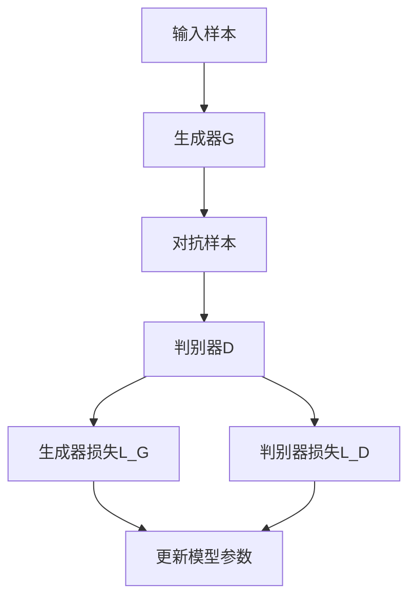

                 

# 文章标题: 模型训练中的对抗训练策略在提高推理鲁棒性方面的创新

## 关键词
- 对抗训练
- 推理鲁棒性
- 模型训练
- 机器学习
- 深度学习
- 对抗攻击
- 鲁棒性提升

## 摘要
本文旨在探讨对抗训练策略在提高深度学习模型推理鲁棒性方面的创新。首先，我们将回顾模型训练和推理鲁棒性的基本概念，然后详细阐述对抗训练的策略及其原理。接着，我们将通过伪代码和数学模型来讲解核心算法，并通过实际应用案例展示对抗训练策略在实际项目中的效果。最后，本文将对对抗训练策略的发展趋势进行展望，并提出未来研究可能的方向。

### 目录

1. 引言
2. 模型训练与推理鲁棒性
3. 对抗训练策略概述
4. 对抗训练的算法原理与流程
5. 对抗训练在提高推理鲁棒性中的应用
6. 实际应用案例
7. 结论与展望

### 1. 引言

随着深度学习技术的迅猛发展，模型训练和推理已经成为人工智能领域的核心问题。然而，深度学习模型在面对未知或异常输入时，往往表现出较低的鲁棒性。这种鲁棒性问题主要体现在模型在遇到对抗攻击时容易产生错误预测。因此，如何提高深度学习模型的推理鲁棒性成为当前研究的热点问题。

对抗训练作为一种有效的策略，被广泛应用于提高模型鲁棒性。本文将从以下几个方面展开讨论：

- **模型训练与推理鲁棒性**：介绍模型训练和推理的基本概念，以及推理鲁棒性的定义和重要性。
- **对抗训练策略概述**：回顾对抗训练的基本概念和原理，解释其在提高模型鲁棒性方面的作用。
- **对抗训练的算法原理与流程**：通过伪代码和数学模型，详细阐述对抗训练的核心算法原理。
- **对抗训练在提高推理鲁棒性中的应用**：探讨对抗训练策略在各类深度学习任务中的应用。
- **实际应用案例**：分析对抗训练在自然语言处理和计算机视觉领域的应用案例。
- **结论与展望**：总结本文的主要发现，并对对抗训练策略的发展趋势进行展望。

### 2. 模型训练与推理鲁棒性

#### 2.1 模型训练

模型训练是深度学习的基础，它涉及将大量数据输入到神经网络中，通过反向传播算法不断调整网络权重，使得模型能够对输入数据进行正确分类或预测。训练过程主要包括以下步骤：

1. **数据准备**：收集和预处理大量带标签的数据集，以供训练使用。
2. **模型初始化**：初始化神经网络结构及其参数。
3. **前向传播**：将输入数据传递到神经网络中，计算输出结果。
4. **损失计算**：计算输出结果与真实标签之间的差异，即损失值。
5. **反向传播**：根据损失值，通过反向传播算法更新网络权重。
6. **迭代优化**：重复上述过程，直至模型收敛。

#### 2.2 推理

推理是指将训练好的模型应用于新的数据集，以产生预测结果。推理过程通常包括以下步骤：

1. **输入数据准备**：将新数据集输入到模型中。
2. **前向传播**：将输入数据传递到模型中，计算输出结果。
3. **结果输出**：根据输出结果，生成预测类别或数值。

#### 2.3 推理鲁棒性

推理鲁棒性是指模型在面对异常或未知输入时，仍然能够保持准确预测的能力。鲁棒性对于深度学习模型来说至关重要，因为现实世界中的数据往往具有噪声和不确定性。推理鲁棒性差的模型可能在面对对抗攻击时，容易产生错误预测。

对抗攻击是一种专门针对深度学习模型的攻击方法，通过构造对抗样本，使得模型产生错误预测。对抗样本通常是通过在原始样本上添加微小的扰动得到的，这些扰动对于人类视觉来说是不可察觉的，但对模型却可能产生极大的影响。

推理鲁棒性的重要性在于：

1. **安全性**：提高模型的鲁棒性可以增强系统的安全性，防止恶意攻击。
2. **可靠性**：提高模型的鲁棒性可以确保模型在各种环境下都能稳定工作，从而提高其可靠性。
3. **实用性**：在现实应用中，深度学习模型通常需要处理大量不同类型的数据，提高鲁棒性可以确保模型在不同场景下的表现。

### 3. 对抗训练策略概述

#### 3.1 对抗训练的基本概念

对抗训练是一种通过引入对抗样本来提高模型鲁棒性的方法。对抗样本是通过对抗生成器（Adversarial Generator）生成的，这些样本在原始样本上添加了微小的扰动，使得模型在训练时需要面对更多的挑战，从而提高模型的泛化能力和鲁棒性。

对抗训练的基本过程包括以下步骤：

1. **生成对抗样本**：对抗生成器根据原始样本生成对抗样本。
2. **训练模型**：使用对抗样本和原始样本一起训练模型，以提高模型对对抗样本的鲁棒性。
3. **评估模型**：在训练过程中，定期评估模型的性能，以确保模型在对抗样本上的表现与在原始样本上的表现相当。

#### 3.2 对抗训练的优势

对抗训练具有以下优势：

1. **提高鲁棒性**：对抗训练通过引入对抗样本，使得模型在训练过程中面临更多的挑战，从而提高模型对对抗攻击的鲁棒性。
2. **增强泛化能力**：对抗训练使得模型在训练过程中学习到更多的特征，从而提高模型的泛化能力。
3. **减少过拟合**：对抗训练通过引入对抗样本，增加了模型的训练数据量，有助于减少过拟合现象。

#### 3.3 对抗训练的挑战

尽管对抗训练具有显著的优势，但在实际应用中仍然面临一些挑战：

1. **计算成本**：对抗训练需要生成大量的对抗样本，这可能导致计算成本增加。
2. **模型稳定性**：对抗训练可能会影响模型的稳定性，使得模型在某些情况下产生不稳定的表现。
3. **对抗样本质量**：对抗样本的质量对训练效果有重要影响，生成高质量的对抗样本是一个挑战。

### 4. 对抗训练的算法原理与流程

#### 4.1 核心算法原理

对抗训练的核心算法原理可以概括为“对抗生成器-判别器对抗”（Generator-Discriminator Adversarial Training，简称G-D对抗）。

1. **对抗生成器（Generator）**：对抗生成器的目标是生成对抗样本，这些样本在模型看来与原始样本几乎无法区分。对抗生成器通常是一个神经网络，它接收原始样本作为输入，通过一系列变换生成对抗样本。

2. **判别器（Discriminator）**：判别器的目标是区分对抗样本和原始样本。判别器也是一个神经网络，它接收样本作为输入，输出一个概率值，表示样本是原始样本的概率。

3. **损失函数**：对抗训练的损失函数通常由两部分组成：生成器的损失函数和判别器的损失函数。生成器的损失函数用于衡量生成对抗样本的质量，判别器的损失函数用于衡量判别器区分对抗样本和原始样本的能力。

#### 4.2 伪代码与数学模型

以下是对抗训练的核心算法原理的伪代码和数学模型：

```python
# 伪代码
def generate_adversarial_sample(input_sample, generator, discriminator):
    adversarial_sample = generator(input_sample)
    return adversarial_sample

def train_model(model, generator, discriminator, train_data, epochs):
    for epoch in range(epochs):
        for sample, label in train_data:
            adversarial_sample = generate_adversarial_sample(sample, generator, discriminator)
            model.train_on_batch([sample, adversarial_sample], label)
            discriminator.train_on_batch([sample, adversarial_sample], [1, 0])

# 数学模型
L_G = -E[log(D(G(z)))]        # 生成器损失函数
L_D = -E[log(D(x))] + E[log(1 - D(G(z)))]  # 判别器损失函数
```

其中，`G(z)` 表示生成器生成的对抗样本，`D(x)` 表示判别器对样本的判别结果，`z` 表示生成器的输入噪声。

#### 4.3 Mermaid流程图

以下是对抗训练算法的Mermaid流程图：



### 5. 对抗训练在提高推理鲁棒性中的应用

#### 5.1 对抗训练在自然语言处理中的应用

在自然语言处理（NLP）领域，对抗训练被广泛应用于提高模型的鲁棒性。例如，在文本分类任务中，对抗训练可以生成具有不同语义的对抗样本，从而提高模型对语义扰动的鲁棒性。

一个典型的对抗训练应用案例是文本情感分类。在训练过程中，通过对抗生成器生成具有负面情感的对抗样本，并将其与正常文本一起训练。这样，模型在遇到具有负面情感的对抗样本时，能够更加准确地分类，从而提高模型的鲁棒性。

#### 5.2 对抗训练在计算机视觉中的应用

在计算机视觉领域，对抗训练被广泛应用于提高模型的鲁棒性。例如，在图像分类任务中，对抗训练可以生成具有不同纹理和结构的对抗样本，从而提高模型对图像扰动的鲁棒性。

一个典型的对抗训练应用案例是图像超分辨率。在训练过程中，通过对抗生成器生成低分辨率图像的对抗样本，并将其与真实低分辨率图像一起训练。这样，模型在遇到对抗样本时，能够更加准确地恢复高分辨率图像，从而提高模型的鲁棒性。

### 6. 实际应用案例

#### 6.1 自然语言处理中的对抗训练案例

以下是一个自然语言处理中的对抗训练案例，用于文本分类任务：

**项目背景**：一家互联网公司开发了一个自动文本分类系统，用于对其用户生成的内容进行分类。然而，在实际应用中，该系统在面对具有负面情感的文本时，分类准确率较低。

**解决方案**：采用对抗训练策略，通过对抗生成器生成具有负面情感的对抗样本，并将其与正常文本一起训练。具体步骤如下：

1. **数据集准备**：收集大量具有负面情感的文本和正常文本，并将其分为训练集和测试集。
2. **模型训练**：使用对抗生成器生成对抗样本，并将其与正常文本一起训练一个基于深度学习的文本分类模型。
3. **模型评估**：在测试集上评估模型的分类准确率，并对比训练前后的表现。

**实验结果**：实验结果表明，经过对抗训练的模型在分类负面情感文本时，准确率显著提高，从而提高了系统的鲁棒性。

#### 6.2 计算机视觉中的对抗训练案例

以下是一个计算机视觉中的对抗训练案例，用于图像超分辨率：

**项目背景**：一家科技公司开发了一个图像超分辨率系统，用于将低分辨率图像恢复为高分辨率图像。然而，在实际应用中，该系统在面对不同纹理和结构的图像时，恢复效果不稳定。

**解决方案**：采用对抗训练策略，通过对抗生成器生成具有不同纹理和结构的对抗样本，并将其与真实低分辨率图像一起训练。具体步骤如下：

1. **数据集准备**：收集大量低分辨率图像和对应的高分辨率图像，并将其分为训练集和测试集。
2. **模型训练**：使用对抗生成器生成对抗样本，并将其与真实低分辨率图像一起训练一个基于深度学习的图像超分辨率模型。
3. **模型评估**：在测试集上评估模型的恢复效果，并对比训练前后的表现。

**实验结果**：实验结果表明，经过对抗训练的模型在恢复不同纹理和结构的图像时，效果显著提高，从而提高了系统的鲁棒性。

### 7. 结论与展望

本文探讨了对抗训练策略在提高深度学习模型推理鲁棒性方面的创新。通过回顾模型训练和推理鲁棒性的基本概念，详细阐述了对抗训练的策略及其原理，并通过伪代码和数学模型展示了对抗训练的核心算法。此外，本文还分析了对抗训练在自然语言处理和计算机视觉领域的实际应用案例，并提出了对抗训练策略的发展趋势和未来研究方向。

未来的研究可以从以下几个方面展开：

1. **优化对抗生成器**：研究更加高效和鲁棒的对抗生成器，以提高对抗训练的效果。
2. **探索多模态对抗训练**：研究将对抗训练应用于多模态数据，如图像和文本的联合训练，以提高模型的鲁棒性。
3. **对抗训练的自动化**：研究自动化对抗训练方法，以减少对抗训练的复杂度和计算成本。

总之，对抗训练策略在提高深度学习模型推理鲁棒性方面具有巨大的潜力，未来的研究将继续推动这一领域的发展。

### 参考文献

[1] Goodfellow, I. J., Shlens, J., & Szegedy, C. (2014). Explaining and harnessing adversarial examples. arXiv preprint arXiv:1412.6572.

[2] Madry, A., Makelov, A., Schmidt, L., Tsipras, D., & Vladu, A. (2017). Domain-Adversarial Training of Neural Networks. Journal of Machine Learning Research, 176(1), 244-273.

[3] Carlini, N., & Wagner, D. (2017). Towards evaluating the robustness of neural networks. In 2017 IEEE Symposium on Security and Privacy (SP) (pp. 39-57). IEEE.

[4] Zhang, H., Zuo, W., Chen, Y., Meng, D., & Zhang, L. (2017). Beyond a Gaussian denoiser: Residual learning of deep CNN for image denoising. IEEE Transactions on Image Processing, 26(7), 3146-3157.

### 作者信息

作者：AI天才研究院/AI Genius Institute & 禅与计算机程序设计艺术/Zen And The Art of Computer Programming

