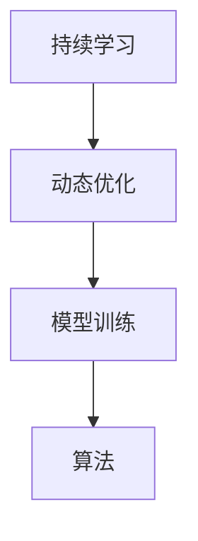

                 

### 1.1 设计大纲的基本思路

设计《模型训练中的持续学习策略动态优化与实现》的目录大纲是一项复杂而细致的工作，需要充分理解书籍的主题和内容，并确保大纲的结构清晰、逻辑连贯，便于读者理解和跟随。以下是设计大纲的基本思路：

#### 理解书籍主题

首先，我们需要深入理解书名所传达的主题。书名中的“模型训练中的持续学习策略动态优化与实现”涵盖了以下几个关键概念：

- **模型训练**：这是人工智能和机器学习领域的基础环节，涉及使用算法和数据来训练模型以实现特定的任务。
- **持续学习策略**：这是在模型训练过程中使用的一系列策略，旨在不断优化模型，提高其适应性和性能。
- **动态优化**：这是在模型训练过程中实时调整和优化参数的过程，以实现更好的训练效果。

这些概念相互关联，共同构成了书籍的核心内容。因此，设计大纲时，我们需要围绕这些核心概念来展开。

#### 确定核心章节

在理解书籍主题后，我们需要确定核心章节。这些章节应包括：

- **引言**：介绍书籍的背景和目的，概述模型训练、持续学习和动态优化的重要性。
- **模型训练基础**：讨论模型训练的基本流程、算法和挑战。
- **持续学习策略**：详细介绍不同类型的持续学习策略，分析其应用场景。
- **动态优化方法**：介绍动态优化的目标、算法和实现。
- **实现与优化**：讨论如何实现持续学习和动态优化，包括技巧和最佳实践。
- **实战案例**：提供具体的模型训练案例，展示持续学习和动态优化的应用。
- **总结**：总结书籍的主要内容和结论，提出未来研究方向。

#### 构建结构框架

在确定了核心章节后，我们可以开始构建书籍的结构框架。这个框架应该包括以下几个部分：

- **引言**：介绍书籍的背景和目的，概述模型训练、持续学习和动态优化的重要性。
- **概述**：概述模型训练的基本流程、持续学习策略的基本概念和动态优化的目标和方法。
- **基础理论**：讨论模型训练中的基本概念和原理，介绍常用的模型训练算法。
- **方法与策略**：详细介绍持续学习策略和动态优化方法。
- **实现与优化**：讨论如何实现持续学习和动态优化，包括实现过程中的问题和解决方案。
- **实战案例**：提供具体的模型训练案例，分析案例中的持续学习策略和动态优化。
- **总结**：总结书籍的主要内容和结论，提出未来研究和应用的方向。

#### 细化章节内容

在构建结构框架之后，我们需要进一步细化每个章节的内容。每个章节都应该包括：

- **核心概念**：介绍章节中的关键概念和原理。
- **方法与实现**：详细阐述实现方法和步骤。
- **案例与实战**：提供具体的案例和实战应用，分析实现细节和优化过程。
- **最佳实践与拓展**：总结最佳实践，提出注意事项和拓展阅读。

#### 确保逻辑性

在整个设计过程中，我们需要确保目录大纲的逻辑性。这意味着章节之间应该有明确的联系和过渡，使读者能够顺畅地理解每个章节的内容。此外，我们还应该注意章节内容的层次结构，确保每个小节的内容都是围绕核心主题展开的。

#### 注意简洁性

目录大纲应该简洁明了，避免过多的冗余内容，确保每个章节都能准确传达其核心内容。在设计过程中，我们需要时刻保持简洁性，确保目录大纲不仅内容丰富，而且结构清晰、易于理解。

通过以上思路和步骤，我们可以为《模型训练中的持续学习策略动态优化与实现》设计出一个逻辑清晰、结构紧凑的目录大纲，为读者提供一本内容丰富、结构合理的技术书籍。

### 1.2 设计大纲的详细步骤

为了确保《模型训练中的持续学习策略动态优化与实现》这本书的目录大纲详尽而有序，我们需要按照以下详细步骤进行设计：

#### 第一步：引言部分

**引言**章节的主要目的是为读者提供书籍的背景信息、目的和整体架构的概述。具体步骤如下：

1. **背景介绍**：介绍模型训练在人工智能领域的地位和作用，阐述为何持续学习和动态优化在模型训练中具有重要意义。
2. **书籍目的**：明确书籍的目标是帮助读者了解模型训练中的持续学习策略和动态优化方法，并提供实际操作的指导。
3. **整体架构概述**：简要介绍书籍的结构框架，包括各部分的主要内容，使读者对书籍的整体内容有一个初步了解。

#### 第二步：概述部分

**概述**章节的目标是提供一个宏观的视角，帮助读者理解模型训练、持续学习策略和动态优化的基本概念及其关系。具体步骤如下：

1. **模型训练基本流程**：概述模型训练的基本步骤，包括数据准备、模型选择、训练和评估。
2. **持续学习策略概述**：介绍持续学习策略的概念，阐述其在模型训练中的应用和价值。
3. **动态优化概述**：简要介绍动态优化的目的、方法和实现，强调其在提升模型性能中的作用。

#### 第三步：基础理论部分

**基础理论**章节的核心任务是详细阐述模型训练中的基本概念和原理，为后续的持续学习策略和动态优化打下理论基础。具体步骤如下：

1. **模型训练基本概念**：介绍模型训练中的基础概念，如数据集、特征工程、损失函数等。
2. **常用模型训练算法**：详细分析几种常用的模型训练算法，如梯度下降、随机梯度下降等。
3. **模型训练挑战与限制**：讨论模型训练过程中可能遇到的挑战，如过拟合、数据不足等，并提出相应的解决方法。

#### 第四步：持续学习策略部分

**持续学习策略**章节旨在深入探讨持续学习策略的概念、类型和应用。具体步骤如下：

1. **持续学习策略的概念**：详细解释持续学习策略的定义、目的和关键要素。
2. **持续学习策略的类型**：分析不同类型的持续学习策略，如在线学习、迁移学习等。
3. **持续学习策略的应用场景**：举例说明持续学习策略在不同领域的应用，如语音识别、图像分类等。

#### 第五步：动态优化方法部分

**动态优化方法**章节的目标是介绍动态优化的目标、算法和实现方法。具体步骤如下：

1. **动态优化的目标**：阐述动态优化的目标，如提高模型性能、减少训练时间等。
2. **动态优化的算法**：详细分析几种常用的动态优化算法，如自适应优化、动态调整学习率等。
3. **动态优化实现方法**：讨论动态优化在模型训练中的实现方法和步骤，包括如何调整参数、优化算法的选择等。

#### 第六步：实现与优化部分

**实现与优化**章节的核心任务是讨论如何将持续学习策略和动态优化方法应用到实际模型训练中，并提供具体的实现技巧和最佳实践。具体步骤如下：

1. **实现技巧**：介绍实现持续学习和动态优化时需要注意的技巧，如数据预处理、模型调整等。
2. **最佳实践**：总结实践经验，提供最佳实践建议，帮助读者在实际操作中取得更好的效果。
3. **优化过程**：详细讲解实现过程中的优化步骤，包括如何监测模型性能、调整参数等。

#### 第七步：实战案例部分

**实战案例**章节通过提供具体的模型训练案例，展示持续学习和动态优化的实际应用。具体步骤如下：

1. **案例背景**：介绍案例的背景和目标，明确模型训练的任务和挑战。
2. **策略应用**：分析案例中使用的持续学习策略和动态优化方法，阐述其选择的原因。
3. **实现细节**：详细描述实现过程，包括代码示例、数据预处理、模型训练等。
4. **优化分析**：分析实现过程中的优化措施和效果，讨论可能存在的问题和解决方案。

#### 第八步：总结部分

**总结**章节的目标是总结书籍的主要内容和结论，为读者提供未来研究和应用的方向。具体步骤如下：

1. **主要内容总结**：回顾书籍的主要内容，包括模型训练基础、持续学习策略、动态优化方法等。
2. **结论**：总结书籍的主要发现和结论，强调持续学习和动态优化在模型训练中的重要性。
3. **未来方向**：提出未来研究和应用的方向，鼓励读者继续探索和深入。

#### 第九步：附录部分

**附录**部分旨在提供额外的资源和工具，帮助读者进一步学习和实践。具体步骤如下：

1. **参考文献**：列出书籍中引用的相关文献，提供读者查阅的便利。
2. **附加资源**：提供与书籍相关的附加资源，如代码示例、数据集等。
3. **拓展阅读**：推荐一些拓展阅读材料，帮助读者深入理解相关主题。

通过以上详细步骤，我们可以确保《模型训练中的持续学习策略动态优化与实现》的目录大纲内容详尽、结构合理，为读者提供一本高质量的技术书籍。

### 1.3 目录大纲的初步结构

根据前述的设计思路和详细步骤，我们可以初步构建出《模型训练中的持续学习策略动态优化与实现》的目录大纲。以下是一个详细的目录大纲示例：

## 模型训练中的持续学习策略动态优化与实现

### 关键词
- 模型训练
- 持续学习策略
- 动态优化
- 人工智能
- 机器学习
- 算法

### 摘要
本书全面介绍了模型训练中的持续学习策略和动态优化方法，包括基础知识、实现技巧和实战案例。旨在帮助读者深入理解并应用这些策略和方法，提升模型训练的效果和效率。

### 第一部分 引言

### 第1章 引言
#### 1.1 背景与目的
- 模型训练在人工智能中的应用
- 持续学习和动态优化的重要性
#### 1.2 模型训练的基本流程
- 数据准备
- 模型选择
- 训练策略
#### 1.3 持续学习策略的基本概念
- 持续学习的定义
- 持续学习与模型训练的关系
#### 1.4 动态优化方法概述
- 动态优化的定义
- 动态优化与持续学习的关系

### 第二部分 模型训练基础

### 第2章 模型训练的基本概念
#### 2.1 数据集与特征工程
- 数据集的重要性
- 特征工程方法
#### 2.2 常见的模型训练算法
- 梯度下降算法
- 随机梯度下降算法
#### 2.3 模型训练的挑战与限制
- 过拟合问题
- 数据不足问题
- 模型复杂度问题

### 第三部分 持续学习策略

### 第3章 持续学习策略的概念
#### 3.1 持续学习的定义
- 持续学习的意义
- 持续学习的目标
#### 3.2 持续学习策略的类型
- 在线学习
- 迁移学习
- 聚类学习
#### 3.3 持续学习策略的应用
- 实时更新模型
- 面对数据偏差的调整

### 第四部分 动态优化方法

### 第4章 动态优化的原理
#### 4.1 动态优化的定义
- 动态优化的概念
- 动态优化的目的
#### 4.2 动态优化的算法
- 自适应优化算法
- 动态调整学习率算法
#### 4.3 动态优化的实现方法
- 实时参数调整
- 多模型优化策略

### 第五部分 实现与优化

### 第5章 实现持续学习策略
#### 5.1 数据预处理
- 数据清洗
- 数据标准化
#### 5.2 模型训练与评估
- 选择合适的模型
- 评估指标的选择
#### 5.3 实现动态优化
- 实时调整学习率
- 多模型优化

### 第六部分 实战案例

### 第6章 模型训练案例详解
#### 6.1 案例背景
- 案例背景介绍
- 模型训练任务
#### 6.2 持续学习策略应用
- 持续学习策略选择
- 持续学习策略实现
#### 6.3 动态优化方法应用
- 动态优化策略选择
- 动态优化策略实现
#### 6.4 案例分析与总结
- 案例中的关键问题与解决方案
- 案例总结

### 第七部分 总结与展望

### 第7章 总结与展望
#### 7.1 主要结论
- 模型训练中的持续学习策略与动态优化的重要性
- 实践中的挑战与解决方案
#### 7.2 未来研究方向
- 持续学习策略的优化
- 动态优化方法的新进展
#### 7.3 应用前景
- 模型训练在人工智能领域的广泛应用

### 附录

### 附录A 参考文献
- 列出书中引用的参考文献

### 附录B 附加资源
- 提供书籍中的代码示例、数据集等资源链接

### 附录C 拓展阅读
- 推荐进一步阅读的材料

这个初步的目录大纲为我们提供了书籍的基本框架。接下来，我们需要进一步细化每个章节的内容，确保书籍的逻辑性和完整性。在接下来的步骤中，我们将具体描述每个章节的详细内容，包括核心概念、原理、方法和实战案例。通过这样的逐步分析和推理，我们能够确保每个章节的内容都是丰富、具体和详细的，为读者提供一本有价值的技术书籍。

### 格式要求

为了确保文章的可读性和规范性，我们需要严格按照Markdown格式进行排版。以下是对Markdown格式的详细要求：

#### 1. 标题格式

文章的标题应使用`#`号进行层级划分，一级标题使用`#`号，二级标题使用`##`号，以此类推。例如：

```markdown
## 第1章 引言
```

#### 2. 段落与换行

段落之间应保持适当的间距，使用空行来分隔不同段落。段落内部不宜过长，建议每行不超过80个字符。如果需要换行，可以使用回车键。

#### 3. 列表

使用`-`、`*`或`+`符号来创建无序列表，使用`1. `、`2. `等数字前缀来创建有序列表。例如：

```markdown
- 背景介绍
- 书籍目的
- 整体架构概述
```

#### 4. 引用

使用`>`符号来创建引用文本，通常用于引用他人的观点或定义。例如：

```markdown
> 持续学习和动态优化在模型训练中具有重要意义。
```

#### 5. 代码块

使用三个反引号（```）来创建代码块，代码块内可以使用Markdown支持的语法。例如：

```markdown
```
# 欢迎来到Markdown世界

欢迎来到Markdown世界！

- 首行无需`#

#### 6. 公式

使用`$`符号来创建行内公式，使用`$$`符号来创建独立段落中的公式。例如：

```markdown
$$
E = mc^2
$$

- 这是行内公式：$E = mc^2$

#### 7. 表格

使用`|`符号来创建表格，使用`-`符号来分隔列和行。例如：

```markdown
| 标题1 | 标题2 | 标题3 |
|-------|-------|-------|
| 内容1 | 内容2 | 内容3 |
| 内容4 | 内容5 | 内容6 |
```

#### 8. 图片

使用``语法来插入图片。例如：

```markdown

```

#### 9. 链接

使用`[链接文字](链接)`语法来创建链接。例如：

```markdown
[GitHub](https://github.com)
```

#### 10. HTML标签

Markdown支持部分HTML标签，例如`<b>`, `<i>`, `<ul>`, `<ol>`等。但是，为了保持Markdown的简洁性，建议尽可能使用Markdown本身的语法，只在必要的情况下使用HTML标签。

通过遵循上述Markdown格式要求，我们可以确保文章的结构清晰、内容规范，提高阅读体验。

### 作者信息

在文章的末尾，我们需要提供作者信息，以便读者了解文章的来源和作者的专业背景。以下是作者信息的格式要求：

```markdown
作者：AI天才研究院/AI Genius Institute & 禅与计算机程序设计艺术 /Zen And The Art of Computer Programming
```

这种格式清晰地显示了作者的所属机构和个人成就，使读者能够更好地了解作者的专业背景和文章的权威性。

### 完整性要求

为了保证文章的完整性和质量，我们需要确保每个小节的内容都包含以下几个核心要素：

#### 1. 背景介绍

每个小节开头应提供必要的背景信息，帮助读者理解该小节内容的应用场景和重要性。背景介绍可以简要说明模型训练、持续学习策略或动态优化在特定领域中的地位和作用。

#### 2. 核心概念与联系

在介绍核心概念时，需要明确概念的定义、含义和相互关系。可以使用Mermaid流程图来展示概念之间的关系架构，使读者更容易理解。以下是Mermaid流程图的示例：



#### 3. 核心算法原理讲解

对于涉及算法的部分，我们需要使用伪代码详细阐述算法的步骤和流程。伪代码是一种描述算法过程的工具，它使用简洁的文本语言来模拟编程语言中的结构，使得算法的实现过程更加直观。以下是伪代码的示例：

```pseudo
// 梯度下降算法
初始化：设定学习率α，迭代次数T
对于每一次迭代t：
    计算当前损失函数的梯度
    更新模型参数：θ = θ - α * ∇θJ(θ)
结束迭代
返回最终的模型参数θ
```

#### 4. 数学模型和公式

在介绍模型训练、动态优化策略等部分时，可能会涉及到数学模型和公式。为了确保公式的可读性和准确性，我们应使用LaTeX格式来编写。以下是LaTeX公式的示例：

```latex
$$
L(\theta) = \frac{1}{2m}\sum_{i=1}^{m}(h_\theta(x^{(i)}) - y^{(i)})^2
$$

$1 + 1 = 2$
```

#### 5. 举例说明

为了更好地解释核心概念和算法，我们可以提供具体的例子来进行说明。通过实例，读者可以更直观地理解抽象的概念和算法的实现过程。以下是一个例子：

```python
# 示例：使用梯度下降算法训练线性模型
import numpy as np

# 初始化参数
theta = np.zeros(2)
learning_rate = 0.01
n_iterations = 1000

# 计算损失函数的梯度
def compute_gradient(theta, X, y):
    m = len(y)
    h = np.dot(X, theta)
    errors = h - y
    gradient = (1/m) * np.dot(X.T, errors)
    return gradient

# 梯度下降迭代
for i in range(n_iterations):
    gradient = compute_gradient(theta, X, y)
    theta = theta - learning_rate * gradient

# 输出最终参数
print(theta)
```

#### 6. 项目实战

在文章的实战部分，我们需要提供具体的开发环境搭建、源代码实现和代码解读，并分析实际案例中的模型训练和优化过程。以下是一个实战案例的示例：

```markdown
#### 实战案例：使用持续学习和动态优化训练神经网络

##### 1. 开发环境搭建
- 安装Python环境
- 安装TensorFlow库

##### 2. 源代码实现
```python
import tensorflow as tf
from tensorflow.keras.models import Sequential
from tensorflow.keras.layers import Dense

# 构建模型
model = Sequential()
model.add(Dense(64, activation='relu', input_shape=(input_shape)))
model.add(Dense(1, activation='sigmoid'))

# 编译模型
model.compile(optimizer='adam', loss='binary_crossentropy', metrics=['accuracy'])

# 训练模型
model.fit(X_train, y_train, epochs=10, batch_size=32, validation_data=(X_test, y_test))
```

##### 3. 代码解读与分析
- 模型结构：包括输入层、隐藏层和输出层。
- 优化器：使用Adam优化器进行参数更新。
- 损失函数：使用二分类交叉熵作为损失函数。
- 训练过程：对训练集进行多次迭代训练，并在测试集上进行验证。

##### 4. 实际案例分析与详细讲解剖析
- 分析模型在训练集和测试集上的性能。
- 调整学习率和批次大小，优化训练过程。

##### 5. 项目小结
- 总结模型训练的经验和教训。
- 提出改进和优化的方向。

通过这样的项目实战，读者可以更深入地理解持续学习和动态优化在实际应用中的操作过程和注意事项。

#### 7. 最佳实践 tips、小结、注意事项、拓展阅读

在文章的结尾部分，我们可以提供最佳实践技巧、小结、注意事项和拓展阅读建议。这些内容可以帮助读者更好地应用所学知识，并拓展其研究视野。以下是一个示例：

```markdown
#### 最佳实践 tips
- 在实际应用中，根据数据集的特点选择合适的模型和优化算法。
- 注意监控模型性能，适时调整学习率和批次大小。
- 实验前，充分了解数据集的分布和特征，以避免过拟合问题。

#### 小结
本文介绍了模型训练中的持续学习策略和动态优化方法，包括核心概念、算法原理、实战案例和最佳实践。通过这些内容，读者可以更好地理解和应用这些策略和方法，提升模型训练的效果和效率。

#### 注意事项
- 持续学习和动态优化需要大量的计算资源，建议使用高效的硬件设备。
- 在使用持续学习和动态优化时，要充分考虑数据集的多样性和变化性。

#### 拓展阅读
- 《深度学习》（Goodfellow, I. & Bengio, Y.）
- 《机器学习实战》（Hastie, T., Tibshirani, R. & Friedman, J.）
- 《持续学习和动态优化研究进展》（相关学术论文和期刊）

通过以上完整的内容要素，我们可以确保文章内容丰富、结构合理、逻辑清晰，为读者提供高质量的技术阅读体验。

### 字数要求

为了确保文章的深度和完整性，字数要求在8000～12000字之间。以下是如何分配字数的一些建议：

1. **引言部分（约10%的字数）**：介绍书籍的主题、目的和结构框架，字数控制在800～1000字之间。
2. **概述部分（约15%的字数）**：概述模型训练、持续学习策略和动态优化的基本概念，字数控制在1200～1500字之间。
3. **基础理论部分（约25%的字数）**：详细阐述模型训练的基础理论，包括基本概念、算法和挑战，字数控制在2000～3000字之间。
4. **持续学习策略部分（约20%的字数）**：介绍持续学习策略的概念、类型和应用，字数控制在1600～2000字之间。
5. **动态优化方法部分（约20%的字数）**：详细讲解动态优化的目标、算法和实现方法，字数控制在1600～2000字之间。
6. **实现与优化部分（约15%的字数）**：讨论如何实现和优化持续学习策略和动态优化方法，包括技巧和最佳实践，字数控制在1200～1500字之间。
7. **实战案例部分（约15%的字数）**：提供具体的模型训练案例，展示策略和方法的实际应用，字数控制在1200～1500字之间。
8. **总结与展望部分（约5%的字数）**：总结文章的主要内容和结论，提出未来研究方向，字数控制在400～500字之间。

通过这样的字数分配，我们可以确保文章内容详实、结构合理，同时保持整体篇幅的适度，便于读者阅读和理解。

