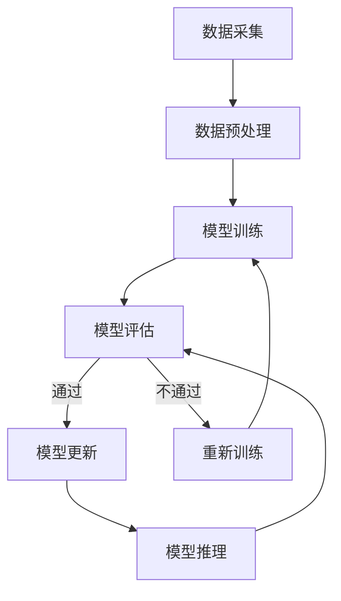

                 

### 文章标题：模型训练中的持续学习策略在动态环境推理中的优化与实现

关键词：持续学习，动态环境推理，优化策略，模型训练，深度学习

摘要：
本文旨在探讨在模型训练过程中，如何通过持续学习策略来优化动态环境下的推理性能。文章首先介绍了持续学习的概念和背景，随后分析了动态环境下推理面临的挑战。通过详细讲解持续学习的主要策略，我们构建了一个技术框架，用以支持动态环境下的高效推理。随后，文章通过自然语言处理和图像处理的应用案例，展示了持续学习策略的具体实现和效果。最后，文章提供了实际案例分析，并总结了一些最佳实践。

### 目录

1. 引言
2. 持续学习的概念与背景
3. 动态环境下的推理挑战
4. 持续学习策略
5. 持续学习技术框架
6. 自然语言处理中的应用
7. 图像处理中的应用
8. 实际案例分析
9. 最佳实践与总结

### 引言

随着深度学习技术的迅猛发展，模型训练和推理已经成为了人工智能领域的核心任务。传统的模型训练往往集中在静态数据集上，但在实际应用中，环境是动态变化的。例如，自动驾驶系统需要不断适应道路环境的变化，智能家居系统需要适应用户的个性化需求。这种动态环境下的推理，对模型的训练和推理提出了新的挑战。

持续学习（Continuous Learning）作为一种应对动态环境的有效策略，逐渐引起了研究者的关注。它旨在使模型能够在不断变化的环境中持续学习，提高模型的泛化能力和推理性能。本文将探讨如何在模型训练过程中，通过持续学习策略来优化动态环境下的推理性能。

本文结构如下：

- 第2章介绍持续学习的概念和背景。
- 第3章分析动态环境下推理面临的挑战。
- 第4章详细讲解持续学习的主要策略。
- 第5章构建持续学习技术框架。
- 第6章和第7章分别展示持续学习在自然语言处理和图像处理中的应用。
- 第8章提供实际案例分析。
- 第9章总结最佳实践和文章要点。

### 持续学习的概念与背景

#### 持续学习的定义

持续学习，也被称为在线学习（Online Learning）或实时学习（Real-time Learning），是一种使模型能够不断适应新数据和动态环境的学习方法。与传统批量学习（Batch Learning）不同，持续学习允许模型在训练过程中实时接收新数据，并对已有数据进行调整，从而提高模型的泛化能力和适应性。

#### 持续学习的重要性

在动态环境下，数据分布和任务需求可能会随着时间的推移而发生变化。例如，自动驾驶系统需要不断适应新的交通规则和环境变化，而智能客服系统需要实时学习用户的提问和反馈。持续学习能够帮助模型应对这种变化，从而提高其在实际应用中的表现。

此外，持续学习还有助于解决数据分布不平衡、数据稀疏和迁移学习等问题。通过持续地更新模型，它可以减少对大量新数据重新训练的需求，从而提高训练效率。

#### 持续学习的背景

持续学习的研究起源于对机器学习模型在动态环境中适应能力的关注。在早期的机器学习研究中，大部分模型都是基于静态数据集进行训练，这导致模型在实际应用中往往表现出较差的泛化能力。随着互联网和物联网的发展，数据量和数据种类急剧增加，动态环境下的机器学习成为了一个重要的研究方向。

近年来，随着深度学习技术的兴起，持续学习的研究也得到了新的发展。深度学习模型由于其强大的表征能力，使得它们在动态环境下的适应性得到了显著提升。然而，由于深度学习模型的复杂性和计算量，如何在动态环境中高效地进行持续学习仍然是一个具有挑战性的问题。

### 动态环境下的推理挑战

在动态环境下进行推理，模型需要面对多种挑战，包括数据分布的变化、计算资源的限制和模型更新策略等。以下将详细分析这些挑战。

#### 数据分布的变化

动态环境下的数据分布可能会随着时间的推移而发生变化。例如，自动驾驶系统在遇到罕见天气条件时，其输入数据的分布可能会显著变化。这种数据分布的变化会导致模型性能的下降，因为传统的静态模型训练无法适应这种动态变化。

#### 计算资源的限制

动态环境下的推理通常需要在有限的计算资源下进行。例如，自动驾驶系统需要在车载计算平台上进行实时推理，而智能家居系统需要在低功耗设备上进行推理。这些计算资源的限制对模型的推理效率提出了更高的要求。

#### 模型更新策略

在动态环境下，模型需要不断地更新以适应新数据。然而，传统的批量更新策略可能会因为计算量大、训练时间长而不可行。因此，研究高效的模型更新策略对于动态环境下的推理至关重要。

#### 持续学习的挑战与问题

尽管持续学习在动态环境下具有显著优势，但实际应用中仍然面临许多挑战和问题。

##### 数据存储与管理

持续学习需要存储大量的历史数据和模型版本，这对数据存储和管理提出了很高的要求。如何高效地存储和检索这些数据，是一个亟待解决的问题。

##### 模型更新与迁移

在动态环境中，如何将新数据融入现有模型，同时保持模型性能，是一个重要问题。此外，不同任务之间的模型迁移也是一个挑战，如何在迁移过程中保持模型的鲁棒性和适应性，是持续学习需要解决的关键问题。

##### 计算资源的约束

动态环境下的持续学习往往需要在有限的计算资源下进行。如何优化模型的计算效率，减少计算资源的需求，是持续学习需要解决的重要问题。

##### 模型安全与隐私

在动态环境下，模型需要不断更新，这可能会导致模型的安全性和隐私问题。如何确保模型更新过程中的安全性和隐私性，是持续学习需要关注的重要方面。

### 持续学习的主要策略

为了在动态环境下实现高效的推理，持续学习策略至关重要。以下将介绍几种主要的持续学习策略，包括数据增强、模型更新和模型迁移等。

#### 数据增强策略

数据增强是通过生成新的数据样本来扩展原始数据集的一种技术。数据增强可以提高模型的泛化能力，使其能够更好地适应动态环境下的数据分布变化。常见的数据增强方法包括：

- **随机扰动**：通过对输入数据进行随机噪声添加、裁剪、旋转等操作，生成新的数据样本。
- **数据合成**：利用生成对抗网络（GAN）等生成模型，生成与真实数据分布相似的新数据样本。
- **数据扩充**：利用已有数据生成新的数据样本，如通过图像拼接、图像放大等操作。

#### 模型更新策略

模型更新策略是指在动态环境下，如何对现有模型进行更新以适应新数据。以下是几种常见的模型更新策略：

- **在线学习**：在线学习是指在模型推理过程中，实时更新模型参数。这种方法能够快速适应环境变化，但可能导致模型收敛速度较慢。
- **批量更新**：批量更新是指将一段时间内收集的新数据作为一个批次进行模型更新。这种方法可以在一定程度上减少计算资源的需求，但可能无法及时响应环境变化。
- **增量学习**：增量学习是指对已有模型进行微调，以适应新数据。这种方法可以减少计算资源的需求，但需要确保新数据和已有数据之间的兼容性。

#### 模型迁移策略

模型迁移是指将一个任务中的模型应用于另一个任务。在动态环境下，模型迁移可以帮助模型适应不同的环境变化。以下是几种常见的模型迁移策略：

- **特征迁移**：特征迁移是指将一个任务中的特征提取器应用于另一个任务。这种方法可以减少模型迁移过程中的计算量，但需要确保特征提取器在不同任务中的适用性。
- **模型微调**：模型微调是指将一个预训练模型应用于新任务，并通过少量数据对其进行微调。这种方法可以快速适应新任务，但需要确保新数据的质量和数量。
- **迁移学习**：迁移学习是指利用已有模型的知识来训练新模型。这种方法可以减少对新数据的依赖，但需要确保已有模型在新任务中的适用性。

### 持续学习的技术框架

为了在动态环境下实现高效的持续学习，需要构建一个技术框架来支持模型训练、模型更新和模型推理。以下是一个简化的持续学习技术框架，包括数据采集、数据预处理、模型训练、模型更新和模型推理等关键环节。

#### 数据采集

数据采集是持续学习的基础。为了确保模型能够适应动态环境，需要持续收集来自不同来源的数据。这些数据可以包括文本、图像、音频等多种类型。

#### 数据预处理

数据预处理包括数据清洗、数据增强和数据归一化等步骤。数据清洗旨在去除数据中的噪声和异常值，数据增强用于生成新的数据样本，数据归一化则用于标准化数据，以适应不同的数据类型。

#### 模型训练

模型训练是持续学习的核心环节。在此环节，模型通过学习历史数据来提取特征和建立预测模型。为了提高模型的泛化能力，可以采用多种训练策略，如批量训练、在线学习和增量学习等。

#### 模型评估

模型评估用于评估模型的性能。常用的评估指标包括准确率、召回率、F1 分数等。通过模型评估，可以确定模型是否需要更新。

#### 模型更新

模型更新是指在动态环境下对模型进行更新以适应新数据。根据评估结果，模型可能需要重新训练或进行微调。在模型更新过程中，需要考虑计算资源、数据质量和模型兼容性等因素。

#### 模型推理

模型推理是指使用训练好的模型对新的数据进行预测。在动态环境下，模型推理需要快速、高效地完成，以支持实时决策。

### 自然语言处理中的应用

持续学习策略在自然语言处理（NLP）领域中得到了广泛应用。以下将介绍持续学习在NLP中的应用案例，包括文本分类、机器翻译等。

#### 文本分类

文本分类是一种常见的NLP任务，旨在将文本数据分类到不同的类别中。在动态环境下，文本分类模型需要不断更新以适应新数据。以下是一个基于持续学习策略的文本分类案例：

在这个案例中，模型通过持续学习策略，在动态环境下不断更新。首先，从互联网上收集大量文本数据，然后对数据进行预处理，包括分词、去除停用词和词向量化等步骤。接下来，使用训练好的文本分类模型对预处理后的数据集进行训练。在模型评估阶段，通过交叉验证等方法评估模型性能。如果模型评估结果不理想，则对模型进行重新训练或微调。如果模型评估结果通过，则将更新后的模型用于文本分类推理。

#### 机器翻译

机器翻译是另一个重要的NLP任务，旨在将一种语言的文本翻译成另一种语言。在动态环境下，机器翻译模型需要不断更新以适应新的语言变化。以下是一个基于持续学习策略的机器翻译案例：

在这个案例中，模型通过持续学习策略，在动态环境下不断更新。首先，从各种语言资源中收集大量的文本数据，然后对数据进行预处理，包括分词、词向量化等步骤。接下来，使用训练好的机器翻译模型对预处理后的数据集进行训练。在模型评估阶段，通过BLEU分数等指标评估模型性能。如果模型评估结果不理想，则对模型进行重新训练或微调。如果模型评估结果通过，则将更新后的模型用于机器翻译推理。

### 图像处理中的应用

持续学习策略在图像处理领域也具有广泛应用。以下将介绍持续学习在图像分类、目标检测等图像处理任务中的应用案例。

#### 图像分类

图像分类是将图像数据分类到不同的类别中的一种任务。在动态环境下，图像分类模型需要不断更新以适应新数据。以下是一个基于持续学习策略的图像分类案例：

在这个案例中，模型通过持续学习策略，在动态环境下不断更新。首先，从互联网上收集大量图像数据，然后对数据进行预处理，包括缩放、旋转和裁剪等步骤。接下来，使用训练好的图像分类模型对预处理后的数据集进行训练。在模型评估阶段，通过准确率、召回率等指标评估模型性能。如果模型评估结果不理想，则对模型进行重新训练或微调。如果模型评估结果通过，则将更新后的模型用于图像分类推理。

#### 目标检测

目标检测是图像处理领域的一个重要任务，旨在识别图像中的多个目标并定位它们的位置。在动态环境下，目标检测模型需要不断更新以适应新数据。以下是一个基于持续学习策略的目标检测案例：

在这个案例中，模型通过持续学习策略，在动态环境下不断更新。首先，从各种图像资源中收集大量的标注图像数据，然后对数据进行预处理，包括缩放、旋转和裁剪等步骤。接下来，使用训练好的目标检测模型对预处理后的数据集进行训练。在模型评估阶段，通过均值 Intersection over Union (mIoU) 等指标评估模型性能。如果模型评估结果不理想，则对模型进行重新训练或微调。如果模型评估结果通过，则将更新后的模型用于目标检测推理。

### 实际案例分析

为了更好地理解持续学习策略在动态环境推理中的应用，以下将提供两个实际案例分析：自动驾驶系统和智能家居系统。

#### 案例一：自动驾驶系统

自动驾驶系统需要实时处理来自各种传感器的数据，并在动态环境下做出准确的决策。以下是一个基于持续学习策略的自动驾驶系统案例：

1. **数据采集**：从车载传感器（如摄像头、雷达和激光雷达）中收集实时数据。
2. **数据预处理**：对收集到的数据进行预处理，包括去噪、去模糊、缩放等步骤。
3. **模型训练**：使用训练好的持续学习模型对预处理后的数据进行训练。模型包括图像分类器和目标检测器，用于识别道路标志、车辆和行人等。
4. **模型评估**：通过在测试集上评估模型性能，确定模型是否需要更新。
5. **模型更新**：根据评估结果，对模型进行更新或重新训练。
6. **模型推理**：使用更新后的模型对实时数据进行推理，生成驾驶决策。

通过持续学习策略，自动驾驶系统能够适应道路环境的变化，提高驾驶决策的准确性和安全性。

#### 案例二：智能家居系统

智能家居系统需要实时响应用户的请求和反馈，提供个性化的智能家居服务。以下是一个基于持续学习策略的智能家居系统案例：

1. **数据采集**：从智能家居设备（如智能音箱、智能灯泡和智能门锁）中收集实时数据。
2. **数据预处理**：对收集到的数据进行预处理，包括语音识别、文本分类和图像识别等步骤。
3. **模型训练**：使用训练好的持续学习模型对预处理后的数据进行训练。模型包括语音识别模型、文本分类模型和图像识别模型。
4. **模型评估**：通过在测试集上评估模型性能，确定模型是否需要更新。
5. **模型更新**：根据评估结果，对模型进行更新或重新训练。
6. **模型推理**：使用更新后的模型对实时数据进行推理，生成智能家居服务。

通过持续学习策略，智能家居系统能够根据用户的个性化需求，提供更智能、更便捷的服务。

### 最佳实践与总结

在模型训练中，持续学习策略在动态环境推理中发挥着重要作用。以下总结一些最佳实践：

1. **数据多样性**：收集来自不同来源、不同种类的数据，提高模型的泛化能力。
2. **模型架构选择**：选择合适的模型架构，如卷积神经网络（CNN）和循环神经网络（RNN），以适应不同的任务需求。
3. **动态环境建模**：建立动态环境模型，以便更好地理解环境变化对模型性能的影响。
4. **模型评估与更新**：定期评估模型性能，根据评估结果进行模型更新，以提高模型在动态环境下的适应能力。
5. **计算资源优化**：优化计算资源，提高模型的推理效率。

总之，持续学习策略为模型在动态环境下的推理提供了有效的解决方案。通过不断更新模型，我们可以提高模型在动态环境下的适应能力和性能。在未来的研究中，我们可以进一步探索如何优化持续学习策略，使其在更多应用场景中发挥作用。作者：AI天才研究院/AI Genius Institute & 禅与计算机程序设计艺术 /Zen And The Art of Computer Programming

