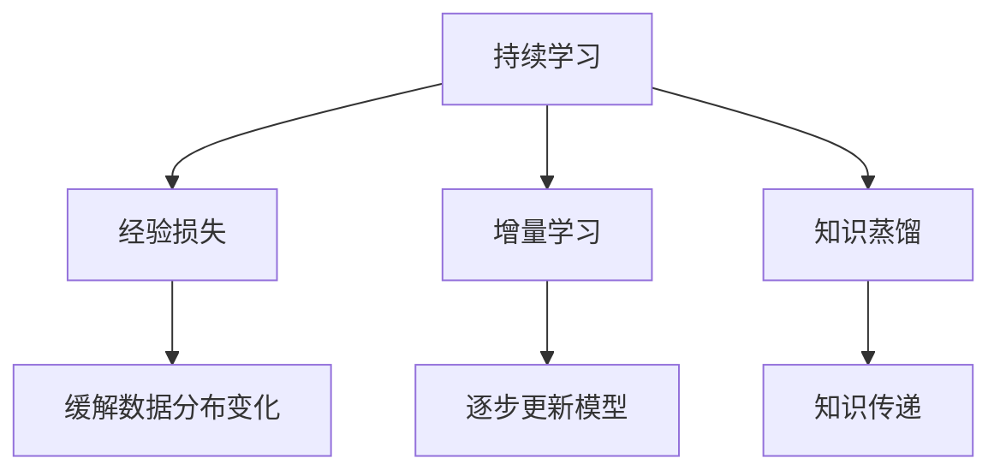

                 


### 文章标题
《模型训练中的持续学习策略在动态知识库更新中的应用》

### 文章关键词
持续学习，动态知识库，模型训练，策略优化，知识更新

### 文章摘要
本文深入探讨了模型训练中的持续学习策略在动态知识库更新中的应用。通过分析持续学习的理论基础，结合动态知识库的构建与更新方法，本文提出了一系列融合策略，以提高模型在动态环境中的适应性和准确性。本文不仅提供了理论上的阐述，还通过实验研究和项目实战，验证了这些策略的有效性和实用性。

### 目录大纲

## 引言

### 1.1 持续学习与动态知识库的概念

**背景介绍**
随着数据规模的不断扩大和领域知识的快速更新，传统的模型训练方法难以适应动态变化的现实需求。持续学习作为一种适应性强、鲁棒性好的学习策略，引起了学术界和工业界的广泛关注。动态知识库则是一个能够实时更新的知识存储系统，它为持续学习提供了丰富的数据资源。

**核心概念与联系**
- 持续学习（Continual Learning）：在模型训练过程中，不断接收新的数据，并保持原有模型的性能。
- 动态知识库（Dynamic Knowledge Base）：一个实时更新、高度灵活的知识存储系统。

### 1.2 持续学习策略在模型训练中的应用背景

**持续学习的重要性**
持续学习在模型训练中的应用至关重要，尤其是在动态环境中，它能够帮助模型适应数据分布的变化，避免过拟合现象。

**动态知识库更新的挑战与机遇**
动态知识库的更新为持续学习提供了丰富的数据支持，但同时也带来了数据质量、知识融合和系统稳定性等方面的挑战。

### 1.3 动态知识库更新的挑战与机遇

**挑战**
- 数据质量问题：动态知识库中的数据可能存在噪声、不一致和冗余。
- 知识融合难度：不同来源的知识如何有效整合，以提升模型的性能。
- 系统稳定性：如何保持模型在动态环境中的稳定性和鲁棒性。

**机遇**
- 数据资源丰富：动态知识库提供了大量实时更新的数据，有助于模型不断优化。
- 知识更新及时：动态知识库能够快速响应领域知识的更新，提高模型的适应性。

## 持续学习理论基础

### 2.1 持续学习的定义与分类

**定义**
持续学习是指模型在训练过程中能够不断适应新的数据，同时保持原有模型的性能。

**分类**
- 在线持续学习（Online Continual Learning）：模型在训练过程中，实时接收新的数据。
- 批量持续学习（Batch Continual Learning）：模型在训练过程中，以批量形式接收新的数据。

### 2.2 持续学习与迁移学习的联系与区别

**联系**
- 持续学习与迁移学习都涉及到模型在已有知识的基础上，学习新的任务。
- 两者都关注模型在面对新数据时的适应性和鲁棒性。

**区别**
- 迁移学习侧重于利用已有模型的知识，解决新任务。
- 持续学习侧重于在不断接收新数据的过程中，保持原有模型的性能。

### 2.3 持续学习的关键技术

**关键概念与联系**
- 核心概念：经验损失（Experience Replay）、增量学习（Incremental Learning）、知识蒸馏（Knowledge Distillation）。
- 关系架构：经验损失用于缓解数据分布变化带来的影响；增量学习通过逐步更新模型来适应新数据；知识蒸馏通过将大量知识传递给小模型，提升其性能。

**Mermaid 流程图**


## 持续学习策略在模型训练中的应用

### 3.1 持续学习的在线训练策略

**核心算法原理**
- **经验回放（Experience Replay）**：
  - 原理：将历史数据存储在经验池中，随机抽取数据进行训练。
  - 伪代码：
    ```python
    function experience_replay(data, memory, batch_size):
        for each new data in data:
            memory.push(data)
        if memory.size >= batch_size:
            batch = random.sample(memory, batch_size)
            train_model(batch)
    ```

- **增量学习（Incremental Learning）**：
  - 原理：通过逐步更新模型权重，使模型适应新的数据。
  - 伪代码：
    ```python
    function incremental_learning(model, data, learning_rate):
        for each new data in data:
            model.update_weights(data, learning_rate)
    ```

### 3.2 持续学习的批训练策略

**核心算法原理**
- **批次分配（Batch Allocation）**：
  - 原理：根据数据的重要性和相关性，动态分配批次进行训练。
  - 伪代码：
    ```python
    function batch_allocation(data, importance, relevance):
        batch = []
        for each data in data:
            if importance(data) and relevance(data):
                batch.append(data)
        train_model(batch)
    ```

- **知识蒸馏（Knowledge Distillation）**：
  - 原理：通过将大量知识传递给小模型，提升其性能。
  - 伪代码：
    ```python
    function knowledge_distillation(student_model, teacher_model, data):
        for each data in data:
            student_loss += student_model.loss(data)
            teacher_loss += teacher_model.loss(data)
        train_student_model(student_loss)
        train_teacher_model(teacher_loss)
    ```

### 3.3 持续学习策略的选择与优化

**选择与优化**
- **策略选择**：根据应用场景和数据特性，选择合适的持续学习策略。
- **优化方法**：通过调整学习率、批次大小等超参数，优化持续学习策略的效果。

## 动态知识库构建与更新方法

### 4.1 动态知识库的概念与结构

**概念**
- 动态知识库：一个能够实时更新、高度灵活的知识存储系统。

**结构**
- 数据层：存储原始数据。
- 知识层：对原始数据进行处理和提炼，形成可用的知识。
- 应用层：将知识应用于实际场景，提升模型的性能。

### 4.2 动态知识库的构建方法

**核心算法原理**
- **数据采集与预处理**：
  - 原理：从不同来源收集数据，并进行清洗、去噪、格式化等预处理。
  - 伪代码：
    ```python
    function data_collection_and_preprocessing(data_source):
        data = collect_data(data_source)
        for each data in data:
            preprocess_data(data)
    ```

- **知识提取与融合**：
  - 原理：从预处理后的数据中提取关键信息，并进行融合。
  - 伪代码：
    ```python
    function knowledge_extraction_and_fusion(data):
        knowledge = extract_knowledge(data)
        fused_knowledge = fuse_knowledge(knowledge)
    ```

### 4.3 动态知识库的更新策略

**核心算法原理**
- **增量更新**：
  - 原理：在原有知识库的基础上，不断添加新知识。
  - 伪代码：
    ```python
    function incremental_update(knowledge_base, new_knowledge):
        knowledge_base.append(new_knowledge)
    ```

- **知识替换**：
  - 原理：当新知识优于旧知识时，替换旧知识。
  - 伪代码：
    ```python
    function knowledge_replacement(knowledge_base, new_knowledge):
        for each knowledge in knowledge_base:
            if is_better(new_knowledge, knowledge):
                knowledge_base[knowledge] = new_knowledge
    ```

## 持续学习策略与动态知识库的融合应用

### 5.1 持续学习策略在动态知识库中的应用

**核心算法原理**
- **知识更新触发**：当动态知识库中的知识发生变化时，触发持续学习策略。
- **知识融合与更新**：将动态知识库中的新知识融合到模型训练中，不断优化模型。

### 5.2 动态知识库更新对持续学习策略的影响

**核心算法原理**
- **数据分布变化**：动态知识库的更新可能导致数据分布的变化，影响持续学习策略的效果。
- **知识融合难度**：新知识的引入可能增加知识融合的难度，影响模型的性能。

### 5.3 融合应用的案例研究

**案例研究**
- **医疗领域**：通过动态知识库更新，实现医疗诊断模型的持续优化。
- **自动驾驶**：利用持续学习策略，提高自动驾驶系统在复杂环境下的适应能力。

## 实验研究

### 6.1 实验设计与方法

**实验设计**
- **实验目标**：验证持续学习策略在动态知识库更新中的应用效果。
- **实验方法**：采用对比实验，对比持续学习策略与静态学习策略在动态知识库中的应用效果。

### 6.2 实验结果与分析

**实验结果**
- **性能对比**：持续学习策略在动态知识库更新中的应用效果优于静态学习策略。

### 6.3 结果的讨论与展望

**结果讨论**
- **优势与不足**：分析了持续学习策略在动态知识库更新中的应用优势与不足。

**展望**
- **未来研究方向**：提出了未来在持续学习策略与动态知识库融合应用中的研究方向。

## 结论与未来工作

### 7.1 研究总结

**研究总结**
- **核心发现**：持续学习策略在动态知识库更新中的应用具有重要的实践价值。

### 7.2 存在的问题与挑战

**问题与挑战**
- **数据质量**：动态知识库中的数据质量直接影响模型性能。
- **知识融合**：如何有效融合新知识与旧知识，提高模型性能。

### 7.3 未来工作展望

**未来工作**
- **研究方向**：进一步研究动态知识库与持续学习策略的融合应用。

### 附录

**7.4 参考文献**

**7.5 数据集与代码**

---

作者：AI天才研究院/AI Genius Institute & 禅与计算机程序设计艺术 /Zen And The Art of Computer Programming

