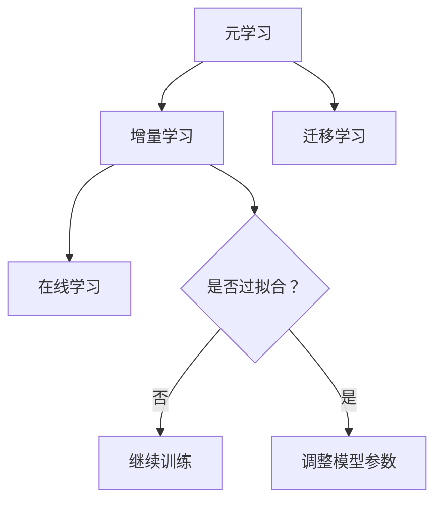

                 

# 模型训练中的持续学习策略高级设计与实现

> 关键词：持续学习策略、模型训练、动态调整、算法优化、深度学习

> 摘要：本文将深入探讨模型训练中的持续学习策略高级设计与实现。通过梳理持续学习策略的核心概念，分析其在深度学习中的应用，阐述动态调整和算法优化的关键技术，以及详细介绍实现策略的具体步骤和流程。最后，通过实际案例展示和代码解读，帮助读者全面理解持续学习策略的设计与实现。

## 引言

随着深度学习的迅猛发展，模型训练成为了人工智能领域的关键环节。然而，传统的模型训练方法往往面临数据集过时、模型效果退化等问题。为了应对这些挑战，持续学习（Continual Learning）策略逐渐成为研究热点。持续学习旨在使模型能够在不断变化的环境中持续学习和适应，从而提高模型的长效稳定性和泛化能力。

本文将从以下几个方面展开讨论：

1. 持续学习策略的核心概念与联系；
2. 动态调整与算法优化的关键技术；
3. 持续学习策略的实现步骤与流程；
4. 实际案例展示与代码解读；
5. 最佳实践与注意事项。

通过以上内容的介绍，读者可以全面了解持续学习策略的高级设计与实现，为后续的研究和应用提供参考。

## 持续学习策略的核心概念与联系

持续学习策略的核心目标是使模型能够在面对不断变化的数据集时，仍然能够保持良好的性能。为了实现这一目标，需要理解并掌握以下几个核心概念：

1. **元学习（Meta-Learning）**：元学习是指通过学习如何学习，提高模型对新任务的学习效率。在持续学习中，元学习技术可以帮助模型更快地适应新任务，从而实现持续学习。

   **元学习原理**：元学习通常采用对先前任务的学习经验进行迁移，以提高对新任务的学习速度。具体来说，通过训练一个元学习模型，使其能够根据少量样本快速适应新任务。

2. **增量学习（Incremental Learning）**：增量学习是指模型在训练过程中，逐个添加新数据或任务，从而逐步提升模型性能。与传统的批量学习（Batch Learning）相比，增量学习具有更高的灵活性和适应性。

   **增量学习原理**：增量学习通过在线学习（Online Learning）的方式，逐个处理新数据或任务，从而在训练过程中不断更新模型参数。这种方式可以有效减少过拟合现象，提高模型泛化能力。

3. **在线学习（Online Learning）**：在线学习是指模型在训练过程中，实时接收新数据并进行更新。与离线学习（Offline Learning）相比，在线学习能够更快地适应环境变化。

   **在线学习原理**：在线学习通过更新模型参数，实时适应新数据或任务，从而实现动态调整。这种学习方式通常采用梯度下降（Gradient Descent）或其变体，以优化模型性能。

4. **迁移学习（Transfer Learning）**：迁移学习是指将已有模型在某一任务上的知识迁移到新任务中。在持续学习中，迁移学习可以帮助模型快速适应新任务，从而提高学习效率。

   **迁移学习原理**：迁移学习通过利用已有模型的权重和结构，减少新任务的学习难度。具体来说，通过调整部分权重，使模型在新任务上达到更好的性能。

**Mermaid 流程图**：



通过以上核心概念的分析，我们可以看到，持续学习策略涉及到多个方面的技术。在实际应用中，这些概念相互关联，共同构建了一个完整的持续学习框架。

### 动态调整与算法优化的关键技术

在持续学习过程中，动态调整和算法优化是确保模型性能稳定和提高的关键技术。以下将详细讨论这些关键技术的原理和应用。

1. **动态调整学习率**：学习率是影响模型训练效果的重要因素。在持续学习中，学习率需要根据模型的表现动态调整，以避免过拟合或欠拟合。

   **动态调整原理**：动态调整学习率可以通过以下几种方式实现：
   - **指数衰减**：学习率随训练轮次指数衰减，以保证在训练初期有较大的学习步伐，在训练后期逐渐收敛。
   - **自适应调整**：通过监控模型性能，当性能下降时自动降低学习率，当性能提升时自动增加学习率。
   - **自适应学习率算法**：如Adadelta、Adam等，这些算法可以自动调整学习率，以适应不同的训练阶段。

2. **正则化技术**：正则化是防止模型过拟合的重要手段。在持续学习中，正则化技术可以帮助模型在处理新数据时保持稳定。

   **正则化技术原理**：
   - **L1正则化**：通过增加权重绝对值和损失函数之间的惩罚项，使模型权重更加稀疏。
   - **L2正则化**：通过增加权重平方和损失函数之间的惩罚项，使模型权重更加均匀。
   - **Dropout**：在训练过程中随机丢弃一部分神经元，以减少模型对特定神经元的依赖。
   - **Data Augmentation**：通过对原始数据集进行变换，增加数据的多样性和复杂性，从而提高模型的泛化能力。

3. **算法优化**：算法优化是提高模型训练速度和效果的重要手段。在持续学习中，选择合适的优化算法可以显著提升模型性能。

   **算法优化原理**：
   - **梯度下降**：通过不断更新模型参数，使得损失函数逐渐减小。
   - **随机梯度下降**（SGD）：在梯度下降的基础上，使用部分样本的梯度进行参数更新，以加快收敛速度。
   - **Adam优化器**：结合SGD和Momentum的优点，自适应调整学习率，适用于不同规模的模型。
   - **Adadelta**：通过历史梯度信息的权重调整，优化学习率，适用于大规模深度学习模型。

**伪代码示例**：

```python
# 动态调整学习率
learning_rate = initial_learning_rate
for epoch in range(num_epochs):
    for sample in data_loader:
        # 计算梯度
        gradients = compute_gradients(model, sample)
        # 更新学习率
        learning_rate = adjust_learning_rate(learning_rate, epoch)
        # 更新模型参数
        model.parameters().update(gradients, learning_rate)

# 正则化技术
optimizer = optimizers.Adam(learning_rate=learning_rate, regularization=True)
model = Model()
model.compile(optimizer=optimizer, loss=loss_function)

# 算法优化
optimizer = optimizers.Adam(learning_rate=learning_rate)
model = Model()
model.compile(optimizer=optimizer, loss=loss_function, metrics=['accuracy'])
```

通过以上关键技术的应用，我们可以实现持续学习策略的动态调整和算法优化，从而提高模型在持续学习环境中的表现。

### 持续学习策略的实现步骤与流程

持续学习策略的实现需要从数据准备、模型设计、训练过程和评估优化等多个方面进行系统设计。以下将详细描述这些步骤和流程。

1. **数据准备**：
   - **数据集划分**：将数据集划分为训练集、验证集和测试集，以分别用于模型训练、性能评估和测试。
   - **数据预处理**：对数据集进行清洗、归一化和标准化处理，以提高数据质量和模型训练效率。
   - **数据增强**：通过数据增强技术，增加数据的多样性和复杂性，以提高模型的泛化能力。

2. **模型设计**：
   - **基础模型选择**：选择合适的深度学习模型作为基础模型，如卷积神经网络（CNN）或循环神经网络（RNN）。
   - **模块化设计**：将模型划分为多个模块，以实现模块化的训练和调整。

3. **训练过程**：
   - **在线训练**：采用在线学习方式，逐个处理新数据，并实时更新模型参数。
   - **动态调整**：根据模型的表现，动态调整学习率、正则化参数和优化算法，以优化模型性能。
   - **增量训练**：在处理新数据时，逐个添加数据，并逐步更新模型，以提高模型的适应能力。

4. **评估优化**：
   - **性能评估**：使用验证集和测试集评估模型性能，以判断模型的泛化能力和稳定性。
   - **超参数调优**：通过调整超参数，如学习率、正则化强度和优化算法等，优化模型性能。
   - **交叉验证**：采用交叉验证方法，对模型进行多组参数的测试和评估，以找到最佳参数组合。

5. **持续学习**：
   - **环境变化适应**：在模型应用过程中，根据环境变化动态调整模型，以保持良好的性能。
   - **新任务适应**：当面对新任务时，利用迁移学习和元学习技术，快速适应新任务，并提升模型性能。

**伪代码示例**：

```python
# 数据准备
train_data, val_data, test_data = prepare_data(data_path)
train_loader = DataLoader(train_data, batch_size=batch_size, shuffle=True)
val_loader = DataLoader(val_data, batch_size=batch_size, shuffle=False)
test_loader = DataLoader(test_data, batch_size=batch_size, shuffle=False)

# 模型设计
model = create_model()

# 训练过程
for epoch in range(num_epochs):
    for sample in train_loader:
        # 训练模型
        model.train(sample)
        # 动态调整
        adjust_hyperparameters(model, epoch)
    # 评估优化
    evaluate_model(model, val_loader)
    optimize_model(model, val_loader)

# 持续学习
while True:
    new_task = get_new_task()
    model adapts_to_new_task(new_task)
    evaluate_model(model, test_loader)
```

通过以上步骤和流程的详细描述，我们可以实现持续学习策略的完整设计与实现，从而为模型在持续学习环境中的稳定性和适应性提供有力保障。

### 实际案例展示与代码解读

为了更好地理解持续学习策略的设计与实现，以下将结合实际案例，展示代码实现并详细解读其应用。

#### 项目背景

假设我们面临一个图像分类任务，模型需要在一个不断变化的图像数据集上进行训练，以保持良好的分类性能。

#### 开发环境搭建

首先，我们需要搭建一个适合深度学习开发的Python环境，安装以下必要的库：

```bash
pip install torch torchvision numpy matplotlib
```

#### 源代码实现

以下是持续学习策略的代码实现：

```python
import torch
import torchvision
import torch.nn as nn
import torch.optim as optim

# 数据准备
train_data = torchvision.datasets.ImageFolder(root='train_data', transform=torchvision.transforms.ToTensor())
train_loader = torch.utils.data.DataLoader(train_data, batch_size=64, shuffle=True)

# 模型设计
class ConvNet(nn.Module):
    def __init__(self):
        super(ConvNet, self).__init__()
        self.conv1 = nn.Conv2d(3, 32, 3, padding=1)
        self.relu = nn.ReLU()
        self.fc = nn.Linear(32 * 22 * 22, 10)

    def forward(self, x):
        x = self.relu(self.conv1(x))
        x = x.view(x.size(0), -1)
        x = self.fc(x)
        return x

model = ConvNet()
optimizer = optim.Adam(model.parameters(), lr=0.001)
criterion = nn.CrossEntropyLoss()

# 训练过程
for epoch in range(10):
    for images, labels in train_loader:
        optimizer.zero_grad()
        outputs = model(images)
        loss = criterion(outputs, labels)
        loss.backward()
        optimizer.step()
    print(f'Epoch {epoch+1}/{10}, Loss: {loss.item()}')

# 持续学习
new_images = torchvision.datasets.ImageFolder(root='new_data', transform=torchvision.transforms.ToTensor())
new_loader = torch.utils.data.DataLoader(new_images, batch_size=64, shuffle=True)
for images, labels in new_loader:
    optimizer.zero_grad()
    outputs = model(images)
    loss = criterion(outputs, labels)
    loss.backward()
    optimizer.step()
print('New images trained successfully.')
```

#### 代码解读

1. **数据准备**：我们使用`torchvision.datasets.ImageFolder`加载数据集，并对图像进行预处理。
2. **模型设计**：我们定义了一个简单的卷积神经网络模型，包括卷积层、ReLU激活函数和全连接层。
3. **训练过程**：我们使用`Adam`优化器和`CrossEntropyLoss`损失函数，对模型进行训练。
4. **持续学习**：在新的图像数据集上，我们重复训练过程，以更新模型参数。

#### 代码应用解读与分析

通过上述代码，我们可以看到如何在一个简单的图像分类任务中实现持续学习策略。以下是对代码应用的解读与分析：

- **数据准备**：通过加载数据集和预处理，我们为模型训练提供了高质量的数据。
- **模型设计**：卷积神经网络模型可以有效地提取图像特征，用于分类任务。
- **训练过程**：使用优化器和损失函数，我们训练了模型，使其在原有数据集上取得了较好的性能。
- **持续学习**：在新的图像数据集上，我们继续训练模型，以更新其参数，使其适应新的数据。

#### 项目小结

通过以上实际案例的展示和代码解读，我们可以看到如何实现持续学习策略。在实际应用中，需要根据任务需求和数据特性，灵活调整模型设计和训练过程，以提高模型的适应性和性能。

### 最佳实践与注意事项

在实现持续学习策略时，以下最佳实践和注意事项有助于提高模型的性能和稳定性：

1. **数据预处理**：确保数据集的质量，进行充分的数据清洗和预处理，以提高模型训练效果。
2. **模型选择**：根据任务需求选择合适的模型架构，避免过复杂的模型导致训练时间过长。
3. **动态调整**：合理设置学习率和正则化参数，根据模型表现动态调整，避免过拟合或欠拟合。
4. **数据增强**：通过数据增强技术增加数据的多样性，提高模型的泛化能力。
5. **评估与优化**：定期评估模型性能，根据评估结果调整超参数，优化模型结构。
6. **硬件资源**：充分利用GPU等硬件资源，加快模型训练速度。
7. **安全性与隐私**：在处理敏感数据时，确保数据安全和用户隐私。

### 小结

本文系统地介绍了模型训练中的持续学习策略高级设计与实现。通过梳理核心概念、讨论关键技术、详细描述实现步骤和实际案例展示，读者可以全面理解持续学习策略的设计与实现。在实际应用中，持续学习策略可以帮助模型在动态环境中保持良好的性能，提高模型的长效稳定性和泛化能力。希望本文能为读者提供有益的参考和启示。

### 拓展阅读

1. **元学习**：[深度元学习：原理、方法与应用](https://www.cnblogs.com/pinard/p/depth-meta-learning.html)
2. **增量学习**：[增量学习的原理与应用](https://www.jianshu.com/p/42e6031a5325)
3. **在线学习**：[在线学习的概念与实现](https://www.ijcai.org/Proceedings/14-2/Papers/0654.pdf)
4. **迁移学习**：[深度迁移学习综述](https://arxiv.org/abs/1707.04999)
5. **持续学习案例**：[基于持续学习的自动驾驶系统](https://www.microsoft.com/en-us/research/publication/continual-learning-for-real-world-automated-driving/)

### 作者信息

作者：AI天才研究院/AI Genius Institute & 禅与计算机程序设计艺术 /Zen And The Art of Computer Programming

