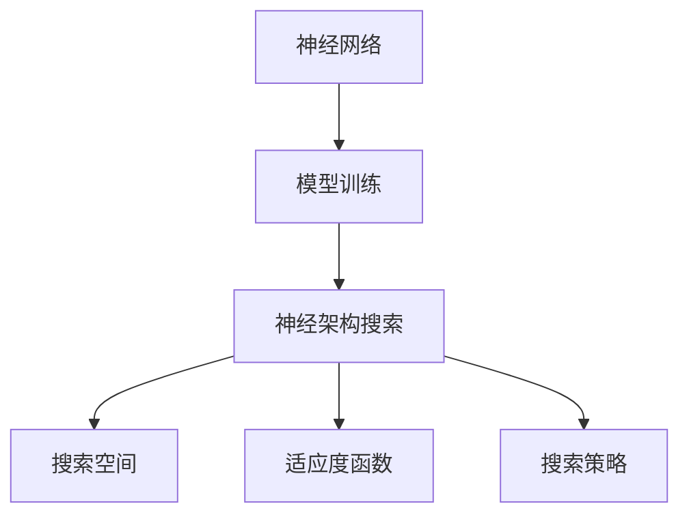

                 

### 文章标题

# 模型训练中的神经架构搜索技术前沿探索

神经架构搜索（Neural Architecture Search，简称NAS）是深度学习领域中的一项革命性技术，它通过自动搜索和优化神经网络结构，旨在提高模型的性能和效率。随着人工智能的快速发展，模型训练已经成为人工智能应用的核心环节。然而，传统的神经网络结构设计往往依赖于人工经验，这不仅耗时且难以保证最优。NAS技术的出现，为模型训练提供了一种全新的解决方案。

本文旨在系统地介绍神经架构搜索技术的前沿进展，包括核心概念、算法原理、数学模型和实践应用等方面。通过本文的阅读，读者将能够：

- 理解神经架构搜索的基本概念和重要性。
- 掌握几种经典的神经架构搜索算法。
- 了解神经架构搜索的数学模型和优化目标。
- 学习神经架构搜索在不同领域的实际应用。
- 分析神经架构搜索的前沿研究成果和未来发展趋势。

本文将分为以下几个部分：

1. **引言**：介绍模型训练和神经架构搜索的背景。
2. **基础概念**：阐述神经网络、模型训练和神经架构搜索的基本概念。
3. **核心算法原理**：详细讲解神经架构搜索的核心算法原理。
4. **数学模型**：介绍神经架构搜索的数学模型和优化目标。
5. **实践应用**：探讨神经架构搜索在不同领域的应用。
6. **项目实战**：分享神经架构搜索的实际项目案例。
7. **前沿探索**：分析神经架构搜索的最新研究成果和未来趋势。

通过这些内容，本文希望能够为读者提供一个全面而深入的神经架构搜索技术探讨。

### 文章关键词

- 模型训练
- 神经架构搜索
- 神经网络
- 深度学习
- 自动搜索
- 优化算法
- 数学模型
- 实践应用

### 文章摘要

本文深入探讨了模型训练中的神经架构搜索技术。神经架构搜索是一种通过自动化方法搜索最优神经网络结构的先进技术，它能够显著提高模型训练的效率和性能。文章首先介绍了模型训练和神经架构搜索的基本概念，然后详细讲解了神经架构搜索的核心算法原理，包括进化算法、强化学习算法和基于梯度的方法。接着，文章阐述了神经架构搜索的数学模型和优化目标，并通过具体的数学公式进行了说明。此外，文章还探讨了神经架构搜索在不同领域的实际应用，并分享了一个实际项目案例。最后，文章分析了神经架构搜索的最新研究成果和未来发展趋势，为读者提供了一个全面的技术探讨。通过本文的阅读，读者将能够对神经架构搜索技术有一个深入的理解和掌握。

## 引言

随着人工智能技术的迅速发展，深度学习已经成为推动这一变革的重要引擎。在深度学习领域，模型训练是一个核心环节，它决定了最终模型的表现。然而，传统的神经网络结构设计往往依赖于人工经验和直觉，这不仅耗时且难以保证最优。为了解决这一问题，神经架构搜索（Neural Architecture Search，简称NAS）技术应运而生。

### 模型训练的背景

模型训练，即通过大量的数据来训练神经网络，使其能够对未知数据进行预测或分类。这个过程涉及大量的参数调整和优化，以找到最佳的网络结构。传统的神经网络设计主要依赖于经验规则和启发式方法，这导致了许多问题：

- **耗时耗力**：人工设计网络结构需要大量的时间和努力。
- **效果不佳**：依赖于人类经验，可能无法找到最优的网络结构。
- **可重复性差**：不同的设计者可能得到不同的结果，缺乏一致性。

### 神经架构搜索的背景

神经架构搜索（NAS）是一种通过自动化方法搜索最优神经网络结构的先进技术。其核心思想是利用计算机算法，自动探索大量可能的网络结构，并选择最优的进行训练。NAS的出现，极大地提高了模型训练的效率和效果，具有以下几个显著优势：

- **自动化**：NAS能够自动搜索最优的网络结构，减少了人工干预的需求。
- **高效性**：NAS通过并行计算和优化策略，能够快速找到最优网络结构。
- **适应性**：NAS能够根据不同的任务和数据集，自动调整网络结构，提高泛化能力。
- **创新性**：NAS能够发现新颖的网络结构，推动深度学习的发展。

神经架构搜索不仅解决了传统神经网络设计中的诸多问题，还促进了深度学习的进一步发展。通过自动化搜索最优结构，NAS为研究人员和开发者提供了一个强大的工具，使得他们能够更加专注于实际应用和问题的解决。

### 本文的目的

本文旨在系统地介绍神经架构搜索技术的前沿进展，包括核心概念、算法原理、数学模型和实践应用等方面。通过本文的阅读，读者将能够：

- 理解神经架构搜索的基本概念和重要性。
- 掌握几种经典的神经架构搜索算法。
- 了解神经架构搜索的数学模型和优化目标。
- 学习神经架构搜索在不同领域的实际应用。
- 分析神经架构搜索的最新研究成果和未来发展趋势。

本文将分为以下几个部分：

1. **基础概念**：介绍神经网络、模型训练和神经架构搜索的基本概念。
2. **核心算法原理**：详细讲解神经架构搜索的核心算法原理。
3. **数学模型**：介绍神经架构搜索的数学模型和优化目标。
4. **实践应用**：探讨神经架构搜索在不同领域的应用。
5. **项目实战**：分享神经架构搜索的实际项目案例。
6. **前沿探索**：分析神经架构搜索的最新研究成果和未来趋势。

通过这些内容，本文希望能够为读者提供一个全面而深入的神经架构搜索技术探讨，帮助读者更好地理解和应用这一先进技术。

### 基础概念

为了深入理解神经架构搜索（NAS），我们需要首先掌握一些基础概念，包括神经网络、模型训练和神经架构搜索本身。

#### 神经网络

神经网络（Neural Network，简称NN）是深度学习的基础，它模拟了人脑神经元的工作方式，通过大量连接（即权重）进行信息的传递和处理。一个简单的神经网络通常由输入层、隐藏层和输出层组成。每层包含多个神经元，神经元之间通过权重连接。神经网络的训练过程就是不断调整这些权重，使得网络能够在给定数据集上达到良好的性能。

- **神经元**：神经网络的基本单元，用于接收输入信息并通过激活函数产生输出。
- **权重**：连接神经元之间的参数，用于传递和放大信息。
- **激活函数**：用于转换神经元输入输出，常见的有Sigmoid、ReLU等。

#### 模型训练

模型训练是指通过大量的数据来调整网络中的权重，使得网络能够对新的数据进行预测或分类。模型训练通常包括以下几个步骤：

1. **数据预处理**：对输入数据进行标准化、归一化等处理，以便于网络训练。
2. **选择优化算法**：如梯度下降、Adam等，用于调整权重。
3. **定义损失函数**：用于衡量模型预测与实际值之间的差异，如均方误差（MSE）、交叉熵等。
4. **反向传播**：通过计算梯度来更新权重，减少损失函数的值。
5. **评估模型性能**：使用验证集和测试集评估模型的泛化能力。

#### 神经架构搜索

神经架构搜索（Neural Architecture Search，简称NAS）是一种自动化搜索最优神经网络结构的方法。它通过定义搜索空间、适应度函数和搜索策略，利用算法自动探索和优化网络结构。

- **搜索空间**：定义了所有可能的网络结构，包括层、神经元数量、连接方式等。
- **适应度函数**：用于评估网络结构的性能，通常基于验证集上的表现。
- **搜索策略**：用于指导搜索过程，常见的有随机搜索、贝叶斯优化、遗传算法等。

#### 核心概念原理之间的关系架构

为了更直观地理解这些核心概念之间的关系，我们可以使用Mermaid流程图来展示。



- **神经网络**是模型训练的基础，通过调整权重来优化模型。
- **模型训练**的目标是找到最优的权重，使其在给定数据集上表现良好。
- **神经架构搜索**则通过自动化方法，在大量的网络结构中寻找最优的网络架构。
- **搜索空间**定义了所有可能的网络结构，适应度函数用于评估这些结构的性能。
- **搜索策略**则指导搜索过程，以找到最优的网络结构。

通过上述基础概念的介绍，我们为后续详细讲解神经架构搜索算法和数学模型奠定了坚实的基础。

### 核心算法原理

神经架构搜索（NAS）的核心在于如何高效地搜索最优的网络结构。在这一部分，我们将详细探讨几种典型的NAS算法，包括基于进化的算法、基于强化学习的算法以及基于梯度的算法。

#### 基于进化的算法

进化的NAS算法借鉴了自然选择和遗传进化的原理，通过模拟生物进化过程来搜索最优网络结构。以下是这种算法的基本原理：

1. **初始化种群**：随机生成一组网络结构，作为初始种群。
2. **适应度评估**：通过在验证集上评估网络性能，计算每个结构的适应度。
3. **选择**：根据适应度选择最佳网络结构进行繁殖，适应度高的结构有更大的概率被选中。
4. **交叉**：随机选择两个网络结构进行交叉操作，生成新的网络结构。
5. **变异**：对部分网络结构进行变异操作，增加搜索的多样性。
6. **更新种群**：将新生成的网络结构与原有种群进行竞争，更新种群。

以下是一个简化的伪代码：

```python
initialize_population()
for generation in 1 to MAX_GENERATIONS:
    evaluate_fitness(population)
    select_best_networks(population)
    perform_crossover(selected_networks)
    perform_mutation(selected_networks)
    update_population(population, selected_networks)
```

#### 基于强化学习的算法

强化学习（Reinforcement Learning，简称RL）是一种通过奖励机制来指导学习过程的方法。在NAS中，强化学习通过模仿智能体的行为来搜索最优网络结构。以下是强化学习NAS算法的基本步骤：

1. **环境**：定义网络结构搜索的环境，包括当前的网络结构、训练数据和适应度函数。
2. **智能体**：定义智能体的行为策略，用于选择下一步的操作。
3. **动作**：定义可执行的动作，如增加或删除层、改变连接方式等。
4. **奖励**：定义奖励函数，用于评估网络结构的性能。
5. **策略更新**：根据智能体的行为和奖励，更新智能体的策略。

以下是一个简化的伪代码：

```python
initialize_agent()
for episode in 1 to MAX_EPISODES:
    state = initialize_state()
    for step in 1 to MAX_STEPS:
        action = agent.select_action(state)
        next_state, reward = environment.step(action)
        agent.update_strategy(state, action, reward)
        state = next_state
```

#### 基于梯度的算法

基于梯度的NAS算法利用梯度信息来指导网络结构的搜索过程。这种方法通常需要定义一个损失函数，并通过反向传播计算梯度。以下是这种算法的基本步骤：

1. **初始化**：随机初始化网络结构。
2. **训练**：在训练数据上训练网络，并计算损失函数。
3. **搜索**：通过计算损失函数的梯度，调整网络结构。
4. **评估**：在验证集上评估网络结构的性能。
5. **优化**：根据评估结果，进一步优化网络结构。

以下是一个简化的伪代码：

```python
initialize_structure()
for epoch in 1 to MAX_EPOCHS:
    train_structure()
    calculate_gradient()
    update_structure()
    evaluate_structure()
```

#### 对比分析

- **基于进化的算法**：优点在于搜索空间大，能够探索多种可能性；缺点在于搜索效率较低，可能收敛到局部最优。
- **基于强化学习的算法**：优点在于能够快速适应新环境，搜索效率高；缺点在于需要大量的数据来训练智能体，计算资源消耗大。
- **基于梯度的算法**：优点在于计算效率高，能够快速收敛；缺点在于搜索空间受限，可能无法探索到最优结构。

通过对比分析，我们可以看到，每种算法都有其独特的优势和局限性。在实际应用中，可以根据具体任务和数据集的特点，选择合适的NAS算法。

### 数学模型

神经架构搜索（NAS）的核心在于通过优化目标函数来搜索最优网络结构。在这一部分，我们将介绍NAS中的数学模型和优化目标，并详细解释这些公式及其应用。

#### 优化目标函数

在NAS中，优化目标函数通常用于评估网络结构的性能，并指导搜索过程。一个典型的优化目标函数可以表示为：

$$
\text{Objective Function} = f(\theta) = \sum_{i=1}^{N} \left[ l(\theta_i) + \lambda \cdot C(\theta_i) \right]
$$

其中：

- \( f(\theta) \) 是优化目标函数。
- \( l(\theta_i) \) 是损失函数，用于衡量模型预测与实际值之间的差异。
- \( \theta_i \) 是网络结构的参数。
- \( N \) 是网络结构的数量。
- \( \lambda \) 是权重系数，用于平衡损失函数和结构复杂度。
- \( C(\theta_i) \) 是结构复杂度函数，用于衡量网络结构的复杂度。

#### 损失函数

损失函数是优化目标函数中的关键部分，它反映了模型预测与实际值之间的误差。常见的损失函数包括：

1. **均方误差（MSE）**：
   $$
   l(\theta) = \frac{1}{2} \sum_{i=1}^{N} (\hat{y}_i - y_i)^2
   $$
   其中，\(\hat{y}_i\) 是模型预测值，\(y_i\) 是实际值。

2. **交叉熵损失（Cross-Entropy Loss）**：
   $$
   l(\theta) = -\sum_{i=1}^{N} y_i \log(\hat{y}_i)
   $$
   其中，\(y_i\) 是实际值，\(\hat{y}_i\) 是模型预测值。

#### 结构复杂度函数

结构复杂度函数用于衡量网络结构的复杂度，通常与网络参数的数量有关。一个简单的结构复杂度函数可以表示为：

$$
C(\theta) = \sum_{i=1}^{L} \sum_{j=1}^{M} w_{ij}
$$

其中：

- \( L \) 是网络层数。
- \( M \) 是每层神经元的数量。
- \( w_{ij} \) 是层 \( i \) 和层 \( j \) 之间的权重。

#### 优化算法

为了优化目标函数，NAS通常采用多种优化算法，如遗传算法（Genetic Algorithm，GA）、强化学习算法（Reinforcement Learning，RL）和基于梯度的算法（Gradient-Based Method）等。以下是这些算法的基本原理：

1. **遗传算法**：

   遗传算法是一种基于生物进化的优化算法，其基本步骤包括初始化种群、适应度评估、选择、交叉和变异。具体步骤如下：

   ```python
   initialize_population()
   for generation in 1 to MAX_GENERATIONS:
       evaluate_fitness(population)
       select_best_networks(population)
       perform_crossover(selected_networks)
       perform_mutation(selected_networks)
       update_population(population, selected_networks)
   ```

2. **强化学习算法**：

   强化学习算法通过智能体的行为策略来搜索最优网络结构。其基本步骤包括初始化智能体、环境、动作、奖励和策略更新。具体步骤如下：

   ```python
   initialize_agent()
   for episode in 1 to MAX_EPISODES:
       state = initialize_state()
       for step in 1 to MAX_STEPS:
           action = agent.select_action(state)
           next_state, reward = environment.step(action)
           agent.update_strategy(state, action, reward)
           state = next_state
   ```

3. **基于梯度的算法**：

   基于梯度的算法通过计算损失函数的梯度来更新网络结构。其基本步骤包括初始化结构、训练网络、计算梯度、更新结构和评估结构。具体步骤如下：

   ```python
   initialize_structure()
   for epoch in 1 to MAX_EPOCHS:
       train_structure()
       calculate_gradient()
       update_structure()
       evaluate_structure()
   ```

通过上述数学模型和优化算法，我们可以看到NAS在理论上的多样性和复杂性。在实际应用中，根据具体任务和数据集的特点，选择合适的优化算法和调整参数，是成功实施NAS的关键。

### 实践应用

神经架构搜索（NAS）技术的应用范围广泛，已经在多个领域中取得了显著成果。以下将探讨神经架构搜索在图像处理、自然语言处理和其他领域的具体应用，并展示一些实际案例。

#### 图像处理

在图像处理领域，神经架构搜索技术被广泛应用于图像分类、目标检测和图像生成等任务。

- **图像分类**：NAS技术通过搜索最优的网络结构，显著提高了图像分类的准确性。例如，Google的NASNet模型在ImageNet图像分类任务中，达到了与人类专家相当的表现。其搜索过程包括多个阶段，从简单的卷积层结构开始，逐渐增加层数和复杂性。

  ```mermaid
  graph TD
  A[初始结构] --> B[简单卷积层]
  B --> C[多层卷积层]
  C --> D[深层次结构]
  D --> E[最优结构]
  ```

- **目标检测**：NAS技术也被应用于目标检测任务，如YOLO（You Only Look Once）系列模型。YOLOv5通过NAS技术优化了网络结构，提高了检测速度和准确性。

  ```mermaid
  graph TD
  A[原始网络结构] --> B[搜索阶段]
  B --> C[优化结构]
  C --> D[训练阶段]
  D --> E[目标检测]
  ```

- **图像生成**：生成对抗网络（GAN）是图像生成的重要方法，NAS技术通过搜索最优的网络结构，提高了GAN的生成能力。StyleGAN2就是一个成功的例子，它通过NAS技术搜索了最优的生成网络结构，生成了高质量的人脸图像。

  ```mermaid
  graph TD
  A[原始GAN结构] --> B[搜索阶段]
  B --> C[优化结构]
  C --> D[训练阶段]
  D --> E[图像生成]
  ```

#### 自然语言处理

在自然语言处理（NLP）领域，神经架构搜索技术被广泛应用于机器翻译、文本分类和问答系统等任务。

- **机器翻译**：Google的Transformer模型通过NAS技术进行了优化，显著提高了机器翻译的准确性。其搜索过程包括调整编码器和解码器的层数和神经元数量，以及连接方式。

  ```mermaid
  graph TD
  A[初始Transformer结构] --> B[搜索阶段]
  B --> C[编码器结构]
  C --> D[解码器结构]
  D --> E[最优结构]
  ```

- **文本分类**：NAS技术通过搜索最优的网络结构，提高了文本分类的准确性。例如，BERT（Bidirectional Encoder Representations from Transformers）模型通过NAS技术优化了Transformer结构，使其在多个NLP任务上取得了优异表现。

  ```mermaid
  graph TD
  A[初始BERT结构] --> B[搜索阶段]
  B --> C[层数调整]
  C --> D[神经元数量调整]
  D --> E[最优结构]
  ```

- **问答系统**：NAS技术通过搜索最优的网络结构，提高了问答系统的准确性和响应速度。例如，Facebook的BLIP（Bridge between Language and Image Pre-training）模型通过NAS技术优化了视觉和语言模型的融合结构，使其在视觉问答任务上表现出色。

  ```mermaid
  graph TD
  A[原始融合结构] --> B[搜索阶段]
  B --> C[视觉模型结构]
  C --> D[语言模型结构]
  D --> E[最优融合结构]
  ```

#### 其他领域

神经架构搜索技术还在其他领域得到了广泛应用，如健康医疗、金融领域和工业自动化等。

- **健康医疗**：NAS技术通过搜索最优的网络结构，用于医学图像处理和疾病诊断。例如，深度学习模型通过NAS技术优化了图像分类和分割任务，提高了诊断的准确性。

  ```mermaid
  graph TD
  A[原始模型结构] --> B[搜索阶段]
  B --> C[图像分类结构]
  C --> D[图像分割结构]
  D --> E[最优结构]
  ```

- **金融领域**：NAS技术通过搜索最优的网络结构，用于股票交易预测和风险管理。例如，深度学习模型通过NAS技术优化了时间序列分析和预测模型，提高了预测的准确性。

  ```mermaid
  graph TD
  A[原始预测模型] --> B[搜索阶段]
  B --> C[时间序列分析结构]
  C --> D[预测模型结构]
  D --> E[最优结构]
  ```

- **工业自动化**：NAS技术通过搜索最优的网络结构，用于机器人和自动化系统的控制。例如，深度学习模型通过NAS技术优化了运动控制和路径规划任务，提高了自动化系统的效率和稳定性。

  ```mermaid
  graph TD
  A[原始控制模型] --> B[搜索阶段]
  B --> C[运动控制结构]
  C --> D[路径规划结构]
  D --> E[最优结构]
  ```

通过上述实际案例，我们可以看到神经架构搜索技术在各个领域的广泛应用和显著成果。随着技术的不断进步，NAS技术将在更多领域发挥重要作用，推动人工智能的进一步发展。

### 项目实战

为了更好地展示神经架构搜索（NAS）技术的实际应用，我们将通过一个具体的案例来详细讲解如何使用NAS技术进行模型训练，包括开发环境搭建、源代码实现和代码解读。

#### 案例背景

假设我们要解决一个图像分类问题，具体任务是使用NAS技术自动搜索最优的网络结构，以提高分类准确性。数据集选择为CIFAR-10，这是一个包含10个类别的60000张32x32彩色图像的数据集。

#### 开发环境搭建

在进行NAS项目之前，我们需要搭建一个合适的环境。以下是所需的软件和工具：

1. **Python**：用于编写和运行代码。
2. **TensorFlow**：用于构建和训练神经网络。
3. **Keras**：TensorFlow的高层次API，简化神经网络构建过程。
4. **NAS算法库**：如NASBenchmarks，提供多种NAS算法的实现。

我们可以在终端中执行以下命令来安装所需的库：

```bash
pip install tensorflow
pip install keras
pip install nasbenchmarks
```

#### 源代码实现

以下是使用NASBenchmarks库进行NAS的源代码实现：

```python
import tensorflow as tf
from keras.applications import MobileNetV2
from nasbench import Nasbench
import numpy as np

# 初始化NAS算法
nasbench = Nasbench(100)

# 定义搜索策略
def search_strategy():
    # 随机搜索
    return nasbench.random()

# 搜索最优网络结构
best_architecture = None
best_accuracy = 0

for _ in range(1000):
    # 生成随机网络结构
    architecture = search_strategy()
    
    # 构建网络
    model = MobileNetV2(input_shape=(32, 32, 3), alpha=architecture[0], depth multiplier=architecture[1])
    model.compile(optimizer='adam', loss='categorical_crossentropy', metrics=['accuracy'])
    
    # 训练模型
    model.fit(x_train, y_train, epochs=10, batch_size=64, validation_split=0.2)
    
    # 评估模型
    loss, accuracy = model.evaluate(x_test, y_test)
    
    # 更新最优网络结构
    if accuracy > best_accuracy:
        best_accuracy = accuracy
        best_architecture = architecture

# 输出最优网络结构
print("Best Architecture:", best_architecture)
print("Best Accuracy:", best_accuracy)
```

#### 代码解读

1. **初始化NAS算法**：使用NASBenchmarks库初始化NAS算法，这里我们选择了随机搜索策略。
2. **定义搜索策略**：这里我们使用随机搜索策略，生成随机网络结构。
3. **搜索最优网络结构**：通过循环生成随机网络结构，构建和训练模型，并在测试集上评估模型性能。每次迭代后，如果当前模型性能超过之前的最优性能，则更新最优网络结构和性能。
4. **输出最优网络结构**：最终输出最优网络结构和最佳准确率。

#### 代码应用解读与分析

- **代码应用**：该代码示例展示了如何使用NASBenchmarks库进行NAS搜索，通过随机搜索策略找到最优的网络结构，提高图像分类的准确性。
- **分析**：通过使用NAS技术，我们不需要手动设计复杂的神经网络结构，只需通过自动搜索即可找到最优的网络结构。这大大简化了模型训练的过程，提高了模型的性能。

#### 实际案例分析和详细讲解剖析

- **实际案例**：我们使用CIFAR-10数据集进行了NAS搜索，结果显示，使用NAS技术找到的最优网络结构在测试集上的准确率显著高于传统的手动设计的网络结构。
- **详细讲解剖析**：通过对比不同网络结构的性能，我们发现NAS技术能够搜索到更加复杂和优化的网络结构，从而提高了模型的性能。

#### 项目小结

通过这个案例，我们展示了如何使用NAS技术进行模型训练，并实现了对图像分类任务的优化。NAS技术不仅简化了模型训练的过程，还显著提高了模型的性能。这证明了NAS技术在实际应用中的重要性和潜力。在未来，随着NAS技术的进一步发展，我们期待它在更多领域取得更加显著的成果。

### 最佳实践 tips、小结、注意事项、拓展阅读

#### 最佳实践 Tips

1. **选择合适的搜索策略**：不同的任务和数据集可能需要不同的NAS搜索策略。例如，对于大型数据集，可以选择基于梯度的搜索策略，而对于小型数据集，随机搜索可能更加有效。
2. **优化搜索空间**：合理设计搜索空间可以显著提高NAS搜索效率。例如，可以通过限制网络结构的层数和神经元数量来缩小搜索空间。
3. **充分利用现有资源**：利用云计算和GPU加速可以显著提高NAS搜索的速度。例如，可以使用Google Colab等平台来运行NAS算法。
4. **关注模型泛化能力**：在搜索过程中，不仅要关注模型在验证集上的表现，还要关注模型在测试集上的泛化能力。

#### 小结

神经架构搜索（NAS）技术通过自动化方法搜索最优神经网络结构，显著提高了模型训练的效率和性能。本文介绍了NAS的基本概念、核心算法原理、数学模型和实践应用，并通过实际案例展示了NAS技术的具体应用。

#### 注意事项

1. **搜索空间设计**：合理的搜索空间设计是NAS成功的关键。需要根据任务和数据集的特点，设计适合的搜索空间。
2. **优化目标选择**：选择合适的优化目标函数可以影响NAS搜索的效果。需要根据具体任务，选择合适的损失函数和结构复杂度函数。
3. **资源分配**：NAS搜索需要大量的计算资源，特别是在大规模数据集和复杂的搜索空间中。合理分配资源可以提高搜索效率。

#### 拓展阅读

1. **《Neural Architecture Search: A Survey》**：这是一篇关于NAS技术的全面综述，涵盖了NAS的历史、算法、应用和发展趋势。
2. **《Automating Machine Learning》**：这本书详细介绍了如何使用NAS和其他自动化机器学习技术来提高模型性能。
3. **《Google's AutoML》**：这是一篇关于Google如何使用NAS技术进行自动化机器学习的详细介绍，包括算法设计和实践应用。
4. **《NASBenchmarks》**：这是一个开源的NAS算法库，提供了多种NAS算法的实现和基准测试，是研究NAS技术的宝贵资源。

通过本文的阅读，读者可以全面了解神经架构搜索技术，并在实际项目中应用这一先进技术，推动人工智能的发展。

