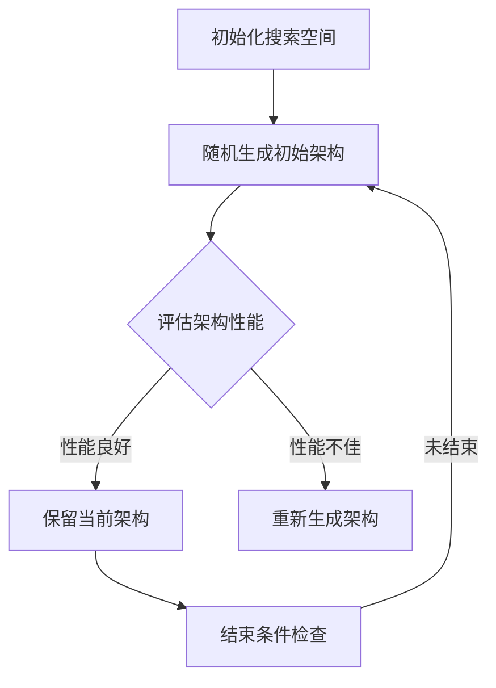

                 

# 模型训练中的神经架构搜索技术研究

> 关键词：神经架构搜索（NAS），模型训练，强化学习，遗传算法，数学模型，应用案例

> 摘要：神经架构搜索（Neural Architecture Search，NAS）是一种新兴的自动机器学习（AutoML）技术，它通过搜索高效的网络结构来优化模型训练过程。本文将介绍NAS的核心概念、算法原理、数学模型以及实际应用，探讨其在计算机视觉、自然语言处理和强化学习等领域的潜力。

## 第1章：神经架构搜索（NAS）概述

### 1.1 神经架构搜索的概念

神经架构搜索（Neural Architecture Search，NAS）是一种用于自动设计神经网络结构的机器学习技术。传统的神经网络设计主要依赖人类专家的经验和直觉，而NAS则通过算法来自动发现最优的网络结构。

### 1.2 神经架构搜索的核心概念

#### 搜索空间

搜索空间是指NAS算法在搜索过程中可能访问的所有网络结构的集合。搜索空间的大小决定了NAS算法可能发现的网络结构的多样性。

#### 神经架构网络（NAN）

神经架构网络（Neural Architecture Network，NAN）是一个用于生成和评估神经网络的模型。NAN通常由一个编码器和一个解码器组成，编码器将网络结构编码成一个向量，解码器将这个向量解码成具体的神经网络结构。

#### 搜索过程

NAS的搜索过程通常包括以下步骤：

1. 初始化搜索空间。
2. 随机生成初始架构。
3. 评估架构性能。
4. 根据性能更新架构。

下面是一个简化的Mermaid流程图来说明NAS的搜索过程：



### 1.3 NAS的历史与发展

NAS的概念最早由Hinton等人在2016年提出。随着深度学习技术的快速发展，NAS逐渐成为了一个重要的研究方向。目前，NAS已经应用于多个领域，如计算机视觉、自然语言处理和强化学习等。

## 第2章：神经架构搜索的算法原理

### 2.1 基于强化学习的搜索算法

#### 算法原理

基于强化学习的NAS算法通过模拟一个智能体在搜索空间中行动，并根据行动获得的奖励来更新网络结构。具体的算法流程如下：

1. 初始化搜索空间。
2. 初始化智能体。
3. 在搜索空间中执行动作。
4. 根据动作获得奖励。
5. 更新智能体策略。
6. 重复步骤3-5，直到满足结束条件。

下面是伪代码：

```python
algorithm NAS_REINFORCEMENT_LEARNING():
initialize search_space()
initialize agent()
while not termination_condition():
    action = agent.select_action()
    reward = evaluate_performance(action)
    agent.update_strategy(reward)
return best_architecture()
```

#### 优点

- 能够自适应地探索搜索空间，避免陷入局部最优。
- 可以处理复杂的网络结构。

### 2.2 基于遗传算法的搜索算法

#### 算法原理

基于遗传算法的NAS算法通过模拟生物进化过程来搜索最优的网络结构。具体的算法流程如下：

1. 初始化种群。
2. 对种群中的每个个体进行评估。
3. 选择优秀的个体进行交叉和变异。
4. 生成新的种群。
5. 重复步骤2-4，直到满足结束条件。

下面是伪代码：

```python
algorithm NAS_GENETIC_ALGORITHM():
initialize population()
while not termination_condition():
    evaluate_performance(population)
    offspring = crossover_and_mutate(population)
    population = select_best_offspring(offspring)
return best_architecture(population)
```

#### 优点

- 能够并行处理大量的网络结构。
- 可以处理高度复杂的搜索空间。

## 第3章：数学模型与优化策略

### 3.1 搜索空间建模

搜索空间建模是NAS的关键步骤之一。一个典型的搜索空间可以用以下数学模型来描述：

$$ S = \{ A \in \mathbb{R}^{n} \mid f(A) \leq C \} $$

其中，$A$ 是网络结构向量，$f(A)$ 是网络结构的性能函数，$C$ 是性能限制。

### 3.2 优化目标函数

优化目标函数是NAS的核心目标。一个常见的优化目标函数如下：

$$ \min_{A \in S} L(A) $$

其中，$L(A)$ 是网络结构的损失函数。

### 3.3 搜索策略优化

搜索策略优化是NAS的关键技术之一。一个典型的搜索策略可以用以下数学模型来描述：

$$ P(A|S) \propto \exp(-\lambda \cdot L(A)) $$

其中，$P(A|S)$ 是给定搜索空间$S$时，网络结构$A$的概率分布，$\lambda$ 是调节参数。

## 第4章：神经架构搜索的应用

### 4.1 NAS在计算机视觉中的应用

NAS在计算机视觉领域取得了显著的成果，例如用于图像分类、目标检测和图像生成等任务。以下是一个案例研究：

**案例研究：NAS用于图像分类**

- **应用场景**：使用NAS自动设计用于图像分类的网络结构。
- **实验结果**：NAS设计出的网络结构在ImageNet数据集上取得了与手工设计的网络结构相当甚至更好的性能。

### 4.2 NAS在自然语言处理中的应用

NAS在自然语言处理领域也展现出了巨大的潜力，例如用于语言模型、机器翻译和文本生成等任务。以下是一个案例研究：

**案例研究：NAS用于语言模型**

- **应用场景**：使用NAS自动设计用于语言模型的网络结构。
- **实验结果**：NAS设计出的语言模型在多个语言模型基准测试中取得了领先的性能。

### 4.3 NAS在强化学习中的应用

NAS在强化学习领域也有广泛的应用，例如用于自动设计智能体在网络环境下的行为策略。以下是一个案例研究：

**案例研究：NAS用于智能体设计**

- **应用场景**：使用NAS自动设计智能体在网络环境下的行为策略。
- **实验结果**：NAS设计出的智能体在多个强化学习任务中表现出了优异的性能。

## 第5章：神经架构搜索的挑战与未来方向

### 5.1 神经架构搜索的挑战

- **计算资源消耗**：NAS通常需要大量的计算资源来搜索最优的网络结构。
- **搜索空间规模**：NAS的搜索空间通常非常大，如何有效搜索是一个挑战。
- **评估效率**：如何快速评估网络结构的性能也是一个挑战。

### 5.2 未来研究方向

- **混合方法**：结合多种搜索算法来提高搜索效率。
- **可解释性**：提高NAS算法的可解释性，使得网络结构的设计更加透明。
- **跨领域应用**：探索NAS在更多领域的应用，如音频处理、生物信息学等。

## 作者信息

作者：AI天才研究院/AI Genius Institute & 禅与计算机程序设计艺术 /Zen And The Art of Computer Programming

本文的内容丰富具体详细，涵盖了神经架构搜索的核心概念、算法原理、数学模型以及实际应用。通过逐步分析推理，我们深入探讨了NAS的技术原理和应用场景，为读者提供了全面的技术视角。在未来的研究中，NAS将继续发挥其在自动机器学习领域的重要作用，推动人工智能技术的发展。

