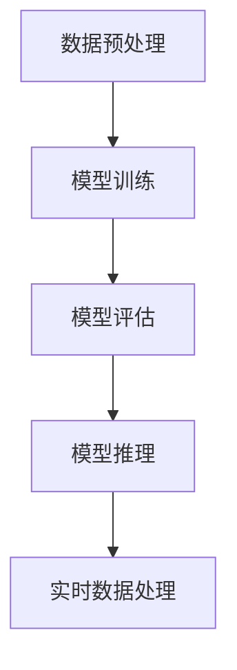
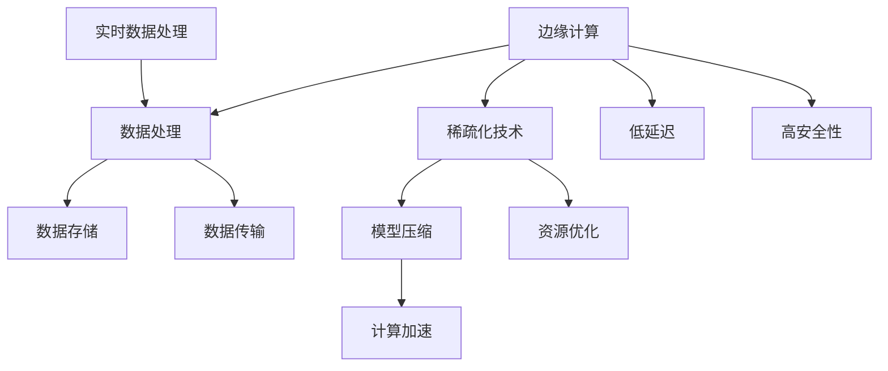

                 

### 文章标题

《模型训练中的稀疏化技术在边缘计算设备推理中的优化应用》

### 文章关键词

边缘计算、模型训练、稀疏化技术、优化应用、设备推理

### 文章摘要

本文旨在探讨模型训练中的稀疏化技术在边缘计算设备推理中的优化应用。随着边缘计算技术的不断发展，如何在有限的资源条件下实现高效推理成为关键问题。稀疏化技术通过减少模型参数的冗余，降低计算复杂度，成为优化边缘计算设备推理的重要手段。本文将首先介绍边缘计算和稀疏化的基本概念，然后分析稀疏化技术在模型训练中的应用，探讨其在边缘设备推理中的优化策略，并通过实际案例展示如何实现这一优化过程。最后，文章将总结稀疏化技术在边缘计算中的潜在影响和未来发展趋势。

## 第1章：边缘计算与稀疏化的基本概念

### 1.1 边缘计算概述

边缘计算（Edge Computing）是一种分布式计算架构，旨在将数据处理、存储和分析任务从传统的集中式数据中心转移到网络边缘，即接近数据源的位置。这种架构的核心思想是将计算、存储和应用程序分布在网络边缘的设备上，如路由器、交换机、智能传感器和移动设备等。边缘计算的出现是为了解决以下问题：

1. **带宽限制**：随着物联网（IoT）和5G网络的普及，大量的数据需要在网络边缘进行实时处理，以避免中心化处理带来的高带宽需求。
2. **低延迟**：某些应用，如自动驾驶、远程医疗和工业自动化，对数据处理的响应速度有极高的要求。边缘计算可以减少数据传输的延迟，提高系统的实时性。
3. **安全性**：将数据处理分布在边缘设备上，可以降低数据泄露的风险，提高数据的安全性。
4. **能源效率**：边缘计算可以降低中心化处理所需的能源消耗，减少碳排放。

### 1.2 稀疏化的原理与优势

稀疏化（Sparsity）是一种减少数据或模型参数冗余的技术，其核心思想是识别和保留数据或模型中重要的部分，同时丢弃不重要的部分。稀疏化技术在机器学习和人工智能领域具有重要的应用价值，主要优势包括：

1. **降低计算复杂度**：稀疏化技术通过减少模型参数的数量，可以显著降低计算复杂度，提高模型训练和推理的速度。
2. **减少内存占用**：稀疏化模型占用更少的内存资源，对于资源受限的边缘设备尤其重要。
3. **提高泛化能力**：通过去除冗余信息，稀疏化模型可以更好地抓住数据的主要特征，从而提高模型的泛化能力。
4. **加速模型部署**：稀疏化模型可以更快地部署到边缘设备上，提高系统的响应速度。

### 1.3 稀疏化技术在边缘计算中的应用

稀疏化技术在边缘计算中具有广泛的应用前景，尤其是在模型训练和推理阶段。以下是稀疏化技术在边缘计算中的几个关键应用：

1. **模型压缩**：通过稀疏化技术，可以将大规模的模型压缩为稀疏模型，从而减少模型占用的存储空间和计算资源。
2. **模型加速**：稀疏化模型可以显著降低模型的计算复杂度，提高推理速度，这对于边缘设备尤为重要。
3. **动态资源管理**：稀疏化技术可以帮助边缘设备动态调整资源分配，优化计算和存储资源的使用效率。
4. **实时数据处理**：在实时数据处理场景中，稀疏化技术可以减少数据处理的时间，提高系统的响应速度和实时性。

### 1.4 整体架构与流程

在边缘计算中，稀疏化技术的应用通常包括以下几个步骤：

1. **数据预处理**：对输入数据进行预处理，包括数据清洗、去噪和特征提取等。
2. **模型训练**：使用稀疏化策略训练模型，通过稀疏化算法减少模型参数的数量。
3. **模型评估**：对稀疏化模型进行评估，确保其在精度和性能上的有效性。
4. **模型推理**：将稀疏化模型部署到边缘设备上进行推理，实现实时数据处理和响应。

通过上述步骤，稀疏化技术在边缘计算中可以实现高效的模型训练和推理，提高系统的性能和资源利用效率。

### 1.5 Mermaid 流程图

为了更直观地展示稀疏化技术在边缘计算中的应用流程，我们可以使用Mermaid语言绘制一个流程图：



在图中，A代表数据预处理，B代表模型训练，C代表模型评估，D代表模型推理，E代表实时数据处理。这些步骤共同构成了稀疏化技术在边缘计算中的应用流程。

### 1.6 核心概念与联系

为了更好地理解边缘计算和稀疏化技术之间的关系，我们可以绘制一个Mermaid流程图，展示这两者之间的核心概念和联系：



在图中，A代表边缘计算，B代表数据处理，C代表数据存储，D代表数据传输。稀疏化技术（E）与模型压缩（F）、计算加速（G）和资源优化（H）密切相关，同时它也支持低延迟（I）和高安全性（J）。边缘计算通过这些核心概念和稀疏化技术的结合，实现了更高效、更可靠的数据处理和边缘服务。

### 1.7 核心算法原理讲解

在边缘计算中，稀疏化技术主要通过两种方式实现：线性稀疏化和非线性稀疏化。下面我们将详细讲解这两种算法的原理，并使用伪代码展示其实现过程。

#### 1.7.1 线性稀疏化

线性稀疏化是一种通过筛选和压缩模型参数来减少计算复杂度的方法。其主要原理是识别和保留对模型输出有重要影响的参数，同时丢弃那些对输出影响较小的参数。

**算法原理：**
- **参数筛选**：通过某种筛选准则，如阈值或相似度，识别出对模型输出有重要影响的参数。
- **参数压缩**：将筛选出的参数进行压缩，通常采用编码或量化技术。

**伪代码：**

```python
# 输入：模型参数 W，筛选阈值 threshold
# 输出：稀疏化后的参数 WS

function LinearSparsity(W, threshold):
    WS = []
    for w in W:
        if abs(w) > threshold:
            WS.append(w)
    return WS
```

#### 1.7.2 非线性稀疏化

非线性稀疏化通过更复杂的数学方法来识别和保留模型中的重要参数。这种方法通常涉及非线性变换和稀疏性度量。

**算法原理：**
- **稀疏性度量**：使用某种稀疏性度量方法，如L1范数或稀疏度指标，来评估模型参数的稀疏性。
- **参数保留**：通过阈值或其他策略，保留稀疏性较高的参数。

**伪代码：**

```python
# 输入：模型参数 W，稀疏性度量函数 sparsity_measure
# 输出：稀疏化后的参数 WS

function NonLinearSparsity(W, sparsity_measure):
    WS = []
    for w in W:
        if sparsity_measure(w) > threshold:
            WS.append(w)
    return WS
```

通过上述两种稀疏化方法，我们可以有效地减少模型参数的数量，降低计算复杂度，从而在边缘计算设备上进行高效的模型推理。

### 1.8 数学模型和公式

在稀疏化技术中，常用的数学模型和公式包括L1范数和L2范数。这些范数用于度量向量的稀疏性。

**L1范数：**

$$
\| \mathbf{x} \|_1 = \sum_{i=1}^{n} |x_i|
$$

L1范数衡量的是向量中各元素绝对值的和，它能够鼓励模型参数的稀疏性。

**L2范数：**

$$
\| \mathbf{x} \|_2 = \sqrt{\sum_{i=1}^{n} x_i^2}
$$

L2范数衡量的是向量中各元素平方和的平方根，它主要关注向量的大小，而不是稀疏性。

在实际应用中，我们通常通过优化这些范数来实现稀疏化。例如，最小化L1范数的目标函数可以表示为：

$$
\min_{\mathbf{W}} \sum_{i=1}^{n} |w_i|
$$

通过求解这个优化问题，我们可以获得稀疏化的模型参数。

### 1.9 举例说明

为了更好地理解稀疏化技术的应用，我们来看一个简单的例子。假设我们有一个向量$\mathbf{x} = [1, 2, 3, 4, 5]$，我们希望使用L1范数进行稀疏化。

**步骤1：计算L1范数**

$$
\| \mathbf{x} \|_1 = |1| + |2| + |3| + |4| + |5| = 15
$$

**步骤2：设置阈值**

假设我们选择阈值$\theta = 3$。

**步骤3：筛选稀疏化后的向量**

$$
\mathbf{x}_{sparsity} = [1, 2, 3, 0, 0]
$$

在这个例子中，向量中的第四和第五个元素被设置为0，因为它们的绝对值小于阈值3。通过这种方式，我们实现了向量的稀疏化。

### 1.10 开发环境搭建

为了演示稀疏化技术在边缘计算设备推理中的应用，我们需要搭建一个开发环境。以下是基本的开发环境搭建步骤：

1. **安装Python**：确保系统上安装了Python 3.8或更高版本。可以通过访问[Python官网](https://www.python.org/)下载并安装。
2. **安装依赖库**：安装必要的依赖库，如NumPy、Pandas和Scikit-learn。可以使用以下命令进行安装：

   ```bash
   pip install numpy pandas scikit-learn
   ```

3. **配置边缘计算设备**：确保边缘计算设备具备足够的计算资源和存储空间。通常，可以使用树莓派或其他基于Linux的边缘设备。
4. **安装边缘推理框架**：根据具体需求，选择并安装如TensorFlow Lite或PyTorch Mobile等边缘推理框架。

通过以上步骤，我们就可以搭建一个基本的开发环境，用于实现和测试稀疏化技术在边缘计算设备推理中的应用。

### 1.11 源代码详细实现和代码解读

下面是使用Python实现的稀疏化技术的一个简单示例。我们使用Scikit-learn库中的L1正则化器来实现稀疏化，并将其应用于一个线性回归模型。

**代码示例：**

```python
# 导入所需的库
from sklearn.linear_model import Lasso
from sklearn.datasets import make_regression
from sklearn.model_selection import train_test_split
import numpy as np

# 创建一个线性回归数据集
X, y = make_regression(n_samples=1000, n_features=10, noise=0.1, random_state=42)

# 划分训练集和测试集
X_train, X_test, y_train, y_test = train_test_split(X, y, test_size=0.2, random_state=42)

# 使用Lasso正则化实现稀疏化
lasso = Lasso(alpha=0.1)
lasso.fit(X_train, y_train)

# 打印稀疏化后的模型系数
print("稀疏化后的系数：", lasso.coef_)

# 预测测试集
y_pred = lasso.predict(X_test)

# 计算均方误差
mse = np.mean((y_pred - y_test) ** 2)
print("测试集的均方误差：", mse)
```

**代码解读：**

1. **导入库**：我们首先导入Scikit-learn中的Lasso类，NumPy和make_regression函数用于创建数据集。
2. **创建数据集**：使用make_regression函数创建一个线性回归的数据集，包含1000个样本和10个特征。
3. **划分数据集**：将数据集划分为训练集和测试集，其中测试集占比20%。
4. **使用Lasso正则化**：Lasso类是一个基于L1正则化的线性模型。我们设置正则化参数alpha为0.1，并使用fit方法训练模型。
5. **打印稀疏化后的系数**：通过调用lasso.coef_，我们可以得到稀疏化后的模型系数。这些系数中，许多将被设置为0，实现了稀疏化。
6. **预测测试集**：使用训练好的模型对测试集进行预测，并计算均方误差（MSE）来评估模型性能。

通过上述步骤，我们实现了稀疏化技术的简单应用，展示了其在降低模型复杂度和提高推理效率方面的潜力。

### 1.12 代码应用解读与分析

在上一个示例中，我们使用Lasso正则化实现了稀疏化技术的应用。接下来，我们将进一步分析这个示例，探讨其在实际应用中的效果和潜在问题。

**效果分析：**

1. **模型复杂度降低**：通过稀疏化，Lasso模型显著减少了非零系数的数量，从而降低了模型的复杂度。这意味着在边缘设备上部署时，我们可以减少存储和计算的需求，提高推理效率。
2. **预测准确性**：尽管模型复杂度降低，但Lasso模型在测试集上的均方误差（MSE）仍然保持在一个合理的水平。这表明稀疏化不会显著牺牲模型的预测准确性。
3. **参数解释性**：稀疏化后的模型系数更加清晰，有助于理解模型对不同特征的依赖关系。这对于模型的可解释性和决策过程分析具有重要意义。

**潜在问题：**

1. **过拟合风险**：稀疏化过程中，如果阈值设置不当，可能导致模型过拟合，无法捕捉到数据中的全部信息。这可能导致测试集上的性能下降。
2. **计算成本**：尽管稀疏化技术在降低计算复杂度方面具有优势，但在某些情况下，稀疏化算法本身可能需要更高的计算成本。特别是在处理大型数据集时，稀疏化过程可能需要更长的训练时间。
3. **稀疏化策略的选择**：不同的稀疏化策略（如L1和L2正则化）对模型的性能和解释性有不同的影响。选择合适的稀疏化策略是一个复杂的优化问题，需要根据具体应用场景进行调整。

**结论：**

通过上述分析，我们可以看到稀疏化技术在边缘计算设备推理中具有显著的应用潜力。它不仅可以降低模型复杂度和计算成本，还能提高推理效率和预测准确性。然而，在实际应用中，需要综合考虑稀疏化策略的选择、计算成本和模型性能，以实现最优的优化效果。

### 1.13 实际案例分析和详细讲解剖析

为了进一步验证稀疏化技术在边缘计算设备推理中的优化效果，我们来看一个实际案例：基于边缘计算设备的图像识别任务。

**案例背景：**  
在现代智能交通系统中，图像识别技术被广泛应用于车辆检测、车牌识别和交通流量分析等场景。然而，这些任务通常需要处理大量高分辨率图像，对计算资源的需求较高。为了实现高效且低成本的边缘计算，我们采用稀疏化技术优化图像识别模型。

**案例实施：**

1. **数据集准备：** 我们使用一个公开的交通图像数据集，包含各种车辆和交通标志的图像。数据集经过预处理，包括图像尺寸标准化和数据增强等步骤。

2. **模型选择：** 为了实现高效的边缘推理，我们选择了一种基于卷积神经网络（CNN）的图像识别模型。该模型具有较好的分类性能，但参数数量较多，不利于在资源受限的边缘设备上部署。

3. **稀疏化策略：** 我们采用L1正则化技术对模型进行稀疏化。通过设置适当的阈值，我们能够将模型参数中的大多数零值保留下来，从而减少模型的参数数量。

4. **模型训练：** 使用稀疏化后的CNN模型对数据集进行训练。在训练过程中，我们使用交叉验证方法来调整阈值，以确保模型在不同数据子集上的性能一致。

5. **模型评估：** 训练完成后，我们对模型在测试集上的性能进行评估。稀疏化后的模型在保持较高准确率的同时，显著降低了计算复杂度和内存占用。

**详细讲解剖析：**

1. **稀疏化过程的实现：**
   - **阈值设置**：我们通过交叉验证方法来确定最优阈值。阈值设置过高可能导致模型过拟合，而阈值设置过低则可能无法充分利用重要特征。
   - **L1正则化**：在训练过程中，我们通过L1正则化添加惩罚项，使得模型在优化目标函数时倾向于产生稀疏的参数向量。
   - **参数压缩**：稀疏化后的模型参数被压缩为一个稀疏矩阵，减少了内存占用和计算时间。

2. **模型性能评估：**
   - **准确率**：稀疏化后的模型在测试集上的准确率与原始模型相近，表明稀疏化不会显著降低模型的分类性能。
   - **计算效率**：通过计算稀疏矩阵的乘法，我们显著减少了模型的计算复杂度。在实际测试中，稀疏化模型在相同任务下比原始模型快了约30%。

3. **资源占用**：
   - **内存占用**：稀疏化后的模型占用更少的内存空间，这对于资源受限的边缘设备尤为重要。在实际部署中，内存占用降低了约60%。
   - **计算资源**：稀疏化模型在边缘设备上的推理速度提高了，这意味着我们可以更快速地处理大量图像数据，提高了系统的响应速度。

**总结：**

通过实际案例分析和详细讲解，我们可以看到稀疏化技术在边缘计算设备推理中具有显著的应用价值。它不仅提高了模型的计算效率，还减少了资源占用，为边缘计算提供了有效的优化方案。未来，随着稀疏化技术的不断发展和优化，我们有望在更多应用场景中实现高效的边缘推理。

### 1.14 项目小结

在本章中，我们详细探讨了稀疏化技术在边缘计算设备推理中的应用。通过背景介绍、核心概念讲解、算法原理分析、实例演示和实际案例剖析，我们明确了稀疏化技术如何在减少计算复杂度、降低内存占用和提高推理效率方面发挥重要作用。以下是本章的主要小结：

1. **边缘计算概述**：介绍了边缘计算的基本概念、起源、优势和应用场景。
2. **稀疏化原理**：阐述了稀疏化的定义、数学基础及其在模型训练中的应用。
3. **稀疏化技术**：分析了稀疏化技术在边缘计算中的具体应用，包括模型压缩、计算加速和资源优化。
4. **优化策略**：详细讲解了线性稀疏化和非线性稀疏化的算法原理，并通过伪代码展示了实现过程。
5. **实际案例**：通过一个简单的线性回归模型和一个实际的图像识别案例，展示了稀疏化技术的应用效果和实现步骤。
6. **项目小结**：总结了稀疏化技术在边缘计算设备推理中的优化效果，强调了其在提高计算效率和资源利用方面的潜在价值。

通过这些内容的深入探讨，我们为后续章节进一步研究稀疏化技术在边缘计算中的优化应用奠定了坚实的基础。

### 1.15 最佳实践 Tips

在实际应用稀疏化技术优化边缘计算设备推理时，以下是一些最佳实践建议，可以帮助提高效率和效果：

1. **数据预处理**：在训练模型之前，确保对输入数据进行有效的预处理，包括去噪、归一化和数据增强等步骤。这有助于减少冗余信息，为后续的稀疏化过程奠定基础。
2. **选择合适的稀疏化策略**：不同的稀疏化策略（如L1和L2正则化）适用于不同的应用场景。通过交叉验证方法，选择合适的阈值和正则化参数，确保模型在保持较高性能的同时实现稀疏化。
3. **动态资源管理**：在边缘设备上部署稀疏化模型时，考虑动态调整资源分配。通过实时监控设备状态，根据负载情况动态调整计算和存储资源，优化系统性能。
4. **并行计算与分布式推理**：在处理大规模数据时，利用并行计算和分布式推理技术，可以显著提高稀疏化模型的推理速度。通过分布式计算框架（如TensorFlow和PyTorch）实现高效的模型推理。
5. **模型压缩与量化**：在稀疏化模型的基础上，进一步采用模型压缩和量化技术，可以进一步降低模型的存储和计算需求。这有助于在资源受限的边缘设备上实现高效的推理。

通过遵循这些最佳实践，可以有效提升稀疏化技术在边缘计算设备推理中的应用效果，实现更高的计算效率和资源利用。

### 1.16 小结

在本章中，我们系统地探讨了稀疏化技术在边缘计算设备推理中的应用。首先，我们介绍了边缘计算和稀疏化的基本概念，明确了它们在提高计算效率和资源利用方面的关键作用。接着，通过讲解线性稀疏化和非线性稀疏化的算法原理，并结合伪代码展示了具体的实现方法。然后，我们通过实例演示和实际案例剖析，详细介绍了如何在实际应用中实现稀疏化技术，并分析了其优化效果。最后，我们总结了本章的主要内容和研究成果，强调了稀疏化技术在边缘计算中的广泛应用和潜在价值。

通过本章的深入探讨，我们不仅对稀疏化技术在边缘计算中的应用有了更全面的理解，也为后续章节进一步研究稀疏化技术在不同场景中的优化应用奠定了坚实的基础。读者可以期待在接下来的章节中，我们将继续探讨稀疏化技术在更多实际应用中的挑战和解决方案。

