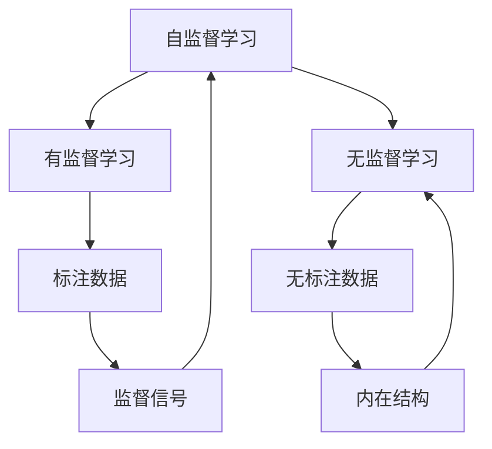

                 


### 第二部分 自监督学习的核心算法

#### 第2章 自监督学习的核心算法

在自监督学习的领域内，几种核心算法扮演着至关重要的角色，它们分别是自动编码器、生成对抗网络（GAN）和变分自编码器（VAE）。每种算法都有其独特的原理和结构，下面我们将逐一介绍。

#### 2.1 自动编码器原理

##### 2.1.1 概念

自动编码器（Autoencoder）是一种神经网络，用于将输入数据编码成一个较低维度的表示，然后从这个低维表示中解码回原始数据。它的主要目的是学习一个有效的数据压缩和重建过程。

##### 2.1.2 结构

自动编码器通常由两部分组成：编码器和解码器。编码器接收输入数据，并通过一个压缩的过程生成一个低维表示。解码器则接收这个低维表示，并尝试重建原始数据。

##### 2.1.3 伪代码

```
# 自动编码器伪代码

# 编码器部分
def encode(input_data):
    hidden_layer = neural_network(input_data)
    return hidden_layer

# 解码器部分
def decode(hidden_layer):
    reconstructed_data = neural_network(hidden_layer, output=True)
    return reconstructed_data

# 主函数
def autoencoder(input_data):
    encoded = encode(input_data)
    reconstructed = decode(encoded)
    return reconstructed
```

##### 2.1.4 实例分析

假设我们有一个1000维的输入数据集，我们希望将其压缩到50维。首先，我们设计一个编码器，它的输出层有50个神经元。然后，我们设计一个解码器，它的输入层有50个神经元，输出层与输入层维度相同。

在训练过程中，我们使用输入数据作为编码器的输入，得到一个50维的编码。然后，我们将这个编码作为解码器的输入，试图重建原始数据。训练目标是使重建数据与原始数据之间的误差最小。

#### 2.2 GAN（生成对抗网络）

##### 2.2.1 概念

生成对抗网络（Generative Adversarial Networks，GAN）由两部分组成：生成器（Generator）和判别器（Discriminator）。生成器的目标是生成看起来像真实数据的样本，而判别器的目标是区分真实数据和生成器生成的数据。

##### 2.2.2 结构

GAN的训练过程可以看作是一个博弈过程。生成器和判别器相互对抗，生成器试图生成更逼真的数据，而判别器试图提高其区分真实和生成数据的能力。

##### 2.2.3 伪代码

```
# GAN伪代码

# 判别器部分
def discriminator(input_data):
    output = neural_network(input_data)
    return output

# 生成器部分
def generator(noise):
    output = neural_network(noise)
    return output

# 主函数
def train_gan():
    for epoch in range(num_epochs):
        for batch in data_loader:
            # 训练判别器
            real_output = discriminator(batch)
            fake_output = discriminator(generator(noise))
            
            # 计算判别器损失
            d_loss_real = loss_function(real_output, labels)
            d_loss_fake = loss_function(fake_output, labels_fake)
            d_loss = d_loss_real + d_loss_fake
            
            # 训练生成器
            noise = noise_generator()
            fake_data = generator(noise)
            g_output = discriminator(fake_data)
            
            # 计算生成器损失
            g_loss = loss_function(g_output, labels_fake)
            
            # 更新模型参数
            d_optimizer.zero_grad()
            g_optimizer.zero_grad()
            
            d_loss.backward()
            g_loss.backward()
            
            d_optimizer.step()
            g_optimizer.step()
```

##### 2.2.4 实例分析

在训练GAN的过程中，我们首先随机生成一些噪声数据作为生成器的输入，生成器将这些噪声数据转化为逼真的图像。然后，我们将真实数据和生成器生成的数据都输入到判别器中，判别器尝试区分这两组数据。

通过多次迭代训练，生成器逐渐提高其生成图像的质量，使得判别器无法区分真实图像和生成图像。这样，生成器就学会了如何生成高质量的数据。

#### 2.3 VAE（变分自编码器）

##### 2.3.1 概念

变分自编码器（Variational Autoencoder，VAE）是一种概率生成模型，它在自动编码器的基础上引入了概率分布的概念，使得模型能够更好地捕获数据的分布信息。

##### 2.3.2 结构

VAE由两部分组成：编码器和解码器。编码器输出一个均值和标准差，这两个参数定义了一个潜在变量的概率分布。解码器则从潜在变量中采样并重建输入数据。

##### 2.3.3 伪代码

```
# VAE伪代码

# 编码器部分
def encode(input_data):
    z_mean, z_log_var = neural_network(input_data)
    return z_mean, z_log_var

# 解码器部分
def decode(z_mean, z_log_var):
    z = sample_from_distribution(z_mean, z_log_var)
    output = neural_network(z, output=True)
    return output

# 主函数
def vae(input_data):
    z_mean, z_log_var = encode(input_data)
    z = sample_from_distribution(z_mean, z_log_var)
    reconstructed = decode(z_mean, z_log_var)
    return reconstructed
```

##### 2.3.4 实例分析

在VAE的训练过程中，编码器学习将输入数据映射到一个潜在空间中的均值和标准差。解码器从潜在空间中采样并重建输入数据。训练目标是使重建数据与原始数据之间的差异最小，同时使潜在变量的分布接近标准正态分布。

通过这种方式，VAE不仅能够重建输入数据，还能够捕获数据的潜在结构，从而实现更强大的数据生成能力。

### 总结

自动编码器、生成对抗网络和变分自编码器是自监督学习领域的三大核心算法。它们各自具有独特的结构和原理，但在提高数据生成和建模能力方面都有着显著的贡献。通过了解这些算法，我们可以更好地利用自监督学习技术，推动人工智能的发展。### 自监督学习概述

自监督学习（Self-supervised Learning）是一种无需人工标注训练数据，而是利用数据自身的某些部分来构建监督信号进行训练的机器学习方法。这种学习方法不仅提高了数据利用效率，而且减轻了标注数据的负担，因此在深度学习领域得到了广泛应用。本文将详细介绍自监督学习的定义、分类、重要性以及与无监督学习的区别，为后续章节的自监督学习算法和应用打下基础。

#### 1.1 自监督学习的定义

自监督学习是指在学习过程中，模型自动从数据中提取监督信号，而不需要依赖外部标注。这种学习方法可以看作是一种自我监督的过程，模型通过内建的机制来调整自己的参数，以实现对数据的理解。自监督学习的关键在于如何从无监督的数据中找到有效的监督信号，从而实现学习目标。

#### 1.2 自监督学习的分类

自监督学习根据应用场景和数据类型的不同，可以分为以下几类：

- **图像处理中的自监督学习**：例如，图像分割、图像生成等。
- **自然语言处理中的自监督学习**：例如，语音识别、文本分类等。
- **其他应用场景的自监督学习**：例如，在推荐系统、强化学习等领域中的应用。

#### 1.3 自监督学习的重要性

自监督学习的重要性主要体现在以下几个方面：

- **数据效率**：自监督学习可以利用大量的未标注数据进行训练，从而提高了数据利用效率。
- **可解释性**：自监督学习通常不需要复杂的标注过程，因此模型参数的调整和决策过程更容易理解和解释。
- **稳健性**：自监督学习可以通过学习数据内在的结构来提高模型的鲁棒性，从而更好地应对数据分布的变化。

#### 1.4 自监督学习与无监督学习的区别

自监督学习和无监督学习都是不需要标注数据的机器学习方法，但它们之间仍然存在一些关键区别：

- **监督信号**：自监督学习利用数据自身的某些部分来构建监督信号，而无监督学习则完全依赖于数据的内部结构。
- **目标**：自监督学习的目标是利用监督信号来指导模型的训练，而无监督学习的目标通常是探索数据的分布或结构。
- **应用场景**：自监督学习更适用于需要监督信号的场景，而无监督学习则更多用于探索性数据分析。

### 概念联系架构 Mermaid 流程图

下面是自监督学习与无监督学习的关系架构 Mermaid 流程图：



在这个流程图中，自监督学习与无监督学习都来源于原始数据（无标注数据），但自监督学习通过构建监督信号（标注数据）来指导模型训练，而无监督学习则关注于探索数据的内在结构。

### 总结

自监督学习作为一种先进的机器学习方法，不仅提高了数据利用效率，而且在实际应用中展现出了强大的潜力和优势。通过对自监督学习的定义、分类、重要性以及与无监督学习的区别的深入探讨，为后续章节的自监督学习算法和应用提供了理论支持。在接下来的章节中，我们将详细介绍自监督学习中的核心算法，包括自动编码器、生成对抗网络（GAN）和变分自编码器（VAE）。### 自动编码器原理

自动编码器（Autoencoder）是一种简单但非常强大的神经网络模型，广泛用于数据压缩、特征提取和降维。它通过编码器和解码器两个部分，将输入数据映射到一个低维度的中间表示，然后再从该中间表示重建原始数据。下面，我们将详细探讨自动编码器的概念、结构、伪代码及其工作原理。

#### 2.1.1 自动编码器概念

自动编码器主要由两部分组成：编码器（Encoder）和解码器（Decoder）。编码器的功能是将输入数据压缩成一个低维度的表示，通常称为编码（Code）。解码器的功能则是将编码后的数据从低维空间还原回原始的高维空间。

自动编码器的工作原理可以形象地比喻为一个艺术家。艺术家首先观察一幅画，然后用简化的线条和形状将其压缩成一张素描（编码过程）。接着，艺术家用这张素描来重新创作出原始画作（解码过程）。

#### 2.1.2 自动编码器结构

自动编码器的结构通常包括以下三个主要部分：

1. **编码器**：编码器是一个全连接的神经网络，它将输入数据映射到一个低维度的中间表示。这个中间表示通常是自动编码器的瓶颈部分，它代表了输入数据的压缩版本。

2. **解码器**：解码器也是一个全连接的神经网络，它从编码后的低维度表示中重建原始数据。解码器的结构与编码器对称，但参数是独立学习的。

3. **损失函数**：自动编码器通过最小化重构误差来学习。重构误差通常是原始输入数据和重构数据之间的差异。常用的损失函数是均方误差（MSE）。

#### 2.1.3 伪代码

下面是一个自动编码器的伪代码，展示了其基本结构和工作流程：

```
# 自动编码器伪代码

# 编码器部分
def encode(input_data):
    hidden_layer = neural_network(input_data)
    return hidden_layer

# 解码器部分
def decode(hidden_layer):
    reconstructed_data = neural_network(hidden_layer, output=True)
    return reconstructed_data

# 主函数
def autoencoder(input_data):
    encoded = encode(input_data)
    reconstructed = decode(encoded)
    return reconstructed
```

在这个伪代码中，`neural_network` 函数代表一个神经网络模型，`input_data` 是输入数据，`encoded` 是编码后的低维度表示，`reconstructed` 是重构后的数据。

#### 2.1.4 工作原理

自动编码器的工作原理可以概括为以下步骤：

1. **输入数据**：自动编码器首先接收一个输入数据，例如一张图片。

2. **编码过程**：编码器将输入数据通过神经网络映射到一个低维度的表示。这个表示通常是输入数据的压缩版本，包含了输入数据的最重要的特征。

3. **解码过程**：解码器从编码后的低维度表示中重建原始数据。这个过程类似于艺术家的素描到原始画作的过程。

4. **损失计算**：自动编码器通过计算重构数据与原始数据之间的差异（损失）来评估其性能。通常使用均方误差（MSE）来衡量这个差异。

5. **模型训练**：通过反向传播算法和梯度下降优化方法，自动编码器不断调整其参数，以减少重构误差，从而提高模型性能。

#### 2.1.5 实例分析

假设我们有一个由1000个像素值组成的图片作为输入数据。我们希望使用自动编码器将其压缩到一个低维度的空间中，然后从该空间中重建原始图片。

首先，我们设计一个编码器，它将1000维的输入映射到一个50维的中间表示。接着，我们设计一个解码器，它将这个50维的中间表示映射回1000维的输出。

在训练过程中，我们使用输入图片作为编码器的输入，得到一个50维的编码。然后，我们将这个编码作为解码器的输入，试图重建原始图片。训练的目标是使重建图片与原始图片之间的误差最小。

通过多次迭代训练，自动编码器逐渐提高其重构能力，使得重建图片与原始图片之间的误差不断减小。最终，自动编码器学会了如何有效地压缩和重建输入数据，从而实现了数据的降维和特征提取。

### 总结

自动编码器是一种简单但功能强大的神经网络模型，它通过编码器和解码器的协同工作，实现了数据的压缩和重建。通过对自动编码器的概念、结构、伪代码和工作原理的详细讲解，我们了解了自动编码器在数据降维和特征提取方面的应用。在接下来的章节中，我们将进一步探讨生成对抗网络（GAN）和变分自编码器（VAE）这两种重要的自监督学习算法。### GAN（生成对抗网络）

生成对抗网络（Generative Adversarial Network，GAN）是由Ian Goodfellow等人于2014年提出的一种新型深度学习模型，它通过两个对抗网络——生成器和判别器的相互博弈来实现数据的生成。GAN在图像生成、数据增强和虚拟现实等领域展现出了强大的潜力。下面，我们将详细探讨GAN的概念、结构、工作原理和伪代码，并通过实例分析来展示其应用效果。

#### 3.1.1 GAN概念

GAN由两个主要组成部分构成：生成器（Generator）和判别器（Discriminator）。生成器的任务是生成看起来与真实数据相似的新数据，而判别器的任务是区分真实数据和生成器生成的新数据。GAN的训练过程可以看作是一个博弈过程，生成器和判别器相互对抗，通过不断迭代优化，生成器生成的新数据质量不断提高，最终能够以假乱真。

#### 3.1.2 GAN结构

GAN的基本结构包括以下三个主要部分：

1. **生成器（Generator）**：生成器是一个神经网络模型，它将随机噪声（Noise）作为输入，通过多层神经网络生成新的数据。生成器的目标是最小化判别器对其生成数据的判别误差。

2. **判别器（Discriminator）**：判别器也是一个神经网络模型，它接受真实数据和生成器生成的数据作为输入，并输出一个概率值，表示输入数据为真实数据的可能性。判别器的目标是最小化其判断生成数据的错误率。

3. **损失函数**：GAN的训练依赖于一个对抗性损失函数，通常使用交叉熵损失函数。生成器的损失函数是最大化判别器对其生成数据的判别错误率，而判别器的损失函数是最小化其判断生成数据的错误率。

#### 3.1.3 GAN工作原理

GAN的工作原理可以概括为以下几个步骤：

1. **初始化**：生成器和判别器都是随机初始化的神经网络模型。

2. **训练过程**：
   - **生成器训练**：生成器通过生成新数据来欺骗判别器，生成器的目标是最大化判别器对其生成数据的判别错误率。
   - **判别器训练**：判别器通过学习区分真实数据和生成器生成的新数据，判别器的目标是最小化其判断生成数据的错误率。

3. **迭代优化**：通过多次迭代训练，生成器和判别器相互博弈，生成器不断改进其生成数据的质量，而判别器则不断提高其判别能力。

4. **平衡状态**：当生成器和判别器达到某种平衡状态时，生成器能够生成足够逼真的新数据，使判别器难以区分真实数据和生成数据。

#### 3.1.4 GAN伪代码

以下是一个简化版的GAN伪代码，展示了其基本结构和训练流程：

```
# GAN伪代码

# 生成器部分
def generator(noise):
    z = noise
    x_hat = neural_network(z, output=True)
    return x_hat

# 判别器部分
def discriminator(x):
    y = neural_network(x)
    return y

# 训练过程
for epoch in range(num_epochs):
    for batch in data_loader:
        # 生成器训练
        noise = noise_generator()
        x_hat = generator(noise)
        g_loss = loss_function(discriminator(x_hat), labels_fake)
        
        # 判别器训练
        real_data = data_loader(batch)
        y_real = discriminator(real_data)
        y_fake = discriminator(x_hat)
        d_loss = loss_function(y_real, labels_true) + loss_function(y_fake, labels_fake)
        
        # 梯度更新
        g_optimizer.zero_grad()
        d_optimizer.zero_grad()
        
        g_loss.backward()
        d_loss.backward()
        
        g_optimizer.step()
        d_optimizer.step()
```

在这个伪代码中，`neural_network` 函数代表一个神经网络模型，`noise_generator` 函数生成随机噪声，`data_loader` 函数提供训练数据批次，`loss_function` 函数定义了损失函数，`g_optimizer` 和 `d_optimizer` 分别是生成器和判别器的优化器。

#### 3.1.5 实例分析

假设我们使用GAN来生成逼真的图像。首先，我们设计一个生成器，它将随机噪声（例如，来自高斯分布的向量）映射成图像。接着，我们设计一个判别器，它能够区分真实图像和生成器生成的图像。

在训练过程中，我们首先随机生成噪声向量，并将其输入到生成器中，得到一组图像。然后，我们将这些生成的图像和真实图像一起输入到判别器中。判别器的目标是最大化其对真实图像的判别概率，同时对生成器生成的图像的判别概率最小化。

通过多次迭代训练，生成器逐渐提高其生成图像的质量，使得判别器难以区分真实图像和生成图像。最终，生成器能够生成高质量、逼真的图像。

### 总结

生成对抗网络（GAN）是一种强大的深度学习模型，通过生成器和判别器的相互对抗，实现了高质量数据的生成。通过对GAN的概念、结构、工作原理和伪代码的详细讲解，以及实例分析，我们了解了GAN在数据生成方面的应用和优势。在接下来的章节中，我们将探讨变分自编码器（VAE），继续深入探索自监督学习领域的其他核心算法。### VAE（变分自编码器）

变分自编码器（Variational Autoencoder，VAE）是一种基于概率生成模型的自监督学习算法，由Kingma和Welling在2013年提出。VAE通过引入概率分布的概念，使模型能够更好地捕获数据的潜在结构和生成能力。下面，我们将详细探讨VAE的概念、结构、伪代码及其工作原理。

#### 3.2.1 VAE概念

VAE是一种自编码器，但它与传统的自编码器有所不同。传统的自编码器通过固定维度的编码层来压缩和重建数据，而VAE则通过概率分布来表示编码层的输出，从而实现对数据的柔性建模。

在VAE中，编码器输出一个均值（μ）和一个标准差（σ）的参数，这些参数定义了潜在变量z的概率分布。解码器从这个潜在变量中采样，并尝试重建原始数据。VAE的这种结构使其能够捕捉数据的高斯分布，从而生成具有多样性的数据。

#### 3.2.2 VAE结构

VAE的基本结构包括以下三个主要部分：

1. **编码器（Encoder）**：编码器接收输入数据，并输出潜在变量z的均值μ和标准差σ。

2. **解码器（Decoder）**：解码器从潜在变量z中采样，并尝试重建输入数据。

3. **损失函数**：VAE使用一个名为“Kullback-Leibler散度”（KL散度）的损失函数来衡量编码器输出的潜在变量分布与先验分布（通常为高斯分布）之间的差异。

#### 3.2.3 VAE伪代码

以下是一个简化版的VAE伪代码，展示了其基本结构和训练流程：

```
# VAE伪代码

# 编码器部分
def encode(input_data):
    z_mean, z_log_var = neural_network(input_data)
    return z_mean, z_log_var

# 解码器部分
def decode(z_mean, z_log_var):
    z = sample_from_distribution(z_mean, z_log_var)
    output = neural_network(z, output=True)
    return output

# 主函数
def vae(input_data):
    z_mean, z_log_var = encode(input_data)
    z = sample_from_distribution(z_mean, z_log_var)
    reconstructed = decode(z_mean, z_log_var)
    return reconstructed
```

在这个伪代码中，`neural_network` 函数代表一个神经网络模型，`input_data` 是输入数据，`z_mean` 和 `z_log_var` 是编码器输出的均值和标准差，`sample_from_distribution` 函数用于从给定的概率分布中采样。

#### 3.2.4 工作原理

VAE的工作原理可以概括为以下几个步骤：

1. **编码过程**：编码器接收输入数据，通过神经网络输出潜在变量z的均值μ和标准差σ。

2. **采样过程**：解码器从潜在变量z的均值μ和标准差σ中采样，得到一个样本z'。

3. **解码过程**：解码器使用采样得到的潜在变量z'来重建输入数据。

4. **损失计算**：VAE通过计算重构误差和KL散度损失来评估模型性能。重构误差是输入数据与重建数据之间的差异，而KL散度损失衡量编码器输出的潜在变量分布与先验分布之间的差异。

5. **模型训练**：通过反向传播算法和梯度下降优化方法，VAE不断调整其参数，以最小化重构误差和KL散度损失。

#### 3.2.5 实例分析

假设我们有一个由1000个像素值组成的图片作为输入数据。我们希望使用VAE将其压缩到一个低维度的潜在空间中，然后从该空间中重建原始图片。

首先，我们设计一个编码器，它将1000维的输入映射到潜在空间的均值μ和标准差σ。接着，我们设计一个解码器，它从潜在空间中采样并重建原始图片。

在训练过程中，我们使用输入图片作为编码器的输入，得到潜在空间的均值μ和标准差σ。然后，我们使用这些参数从潜在空间中采样，并输入到解码器中，试图重建原始图片。训练的目标是使重建图片与原始图片之间的误差最小，同时使潜在变量的分布接近标准正态分布。

通过多次迭代训练，VAE逐渐提高其重构能力，使得重建图片与原始图片之间的误差不断减小。最终，VAE学会了如何有效地压缩和重建输入数据，从而实现了数据的降维和特征提取。

### 总结

VAE通过引入概率分布的概念，实现了数据的柔性建模和高效生成。通过对VAE的概念、结构、伪代码和工作原理的详细讲解，我们了解了VAE在数据降维和生成方面的应用。VAE在图像生成、数据增强和虚拟现实等领域具有广泛的应用前景。在接下来的章节中，我们将继续探讨自监督学习在图像处理和自然语言处理中的应用，以及自监督学习的创新趋势。### 自监督学习在图像处理中的应用

自监督学习在图像处理领域有着广泛的应用，特别是在图像分割、图像生成等任务中，展示了其强大的数据利用效率和模型生成能力。下面，我们将详细探讨自监督学习在图像处理中的应用，包括图像分割和图像生成的核心概念、算法原理、伪代码、实例分析以及实际应用效果。

#### 3.1 图像分割

##### 3.1.1 概念

图像分割是将图像分解成若干具有相似特征的区域的处理过程。在自监督学习中，图像分割的自监督方法不需要使用标注数据，而是通过其他方式为模型提供监督信号。

##### 3.1.2 算法原理

在自监督图像分割中，常用的方法包括基于深度学习的图像分割模型，如U-Net、Mask R-CNN等。这些模型通过训练大量未标注的图像数据，自动学习图像中的结构和特征，从而实现对图像的分割。

U-Net是一种卷积神经网络架构，它通过上采样和下采样的组合，实现了图像的高效分割。U-Net的核心思想是利用上下文信息和局部特征来指导分割。

##### 3.1.3 伪代码

以下是一个简化的U-Net伪代码：

```
# U-Net伪代码

# 下采样部分
def downsample(input_image):
    conv1 = conv2d(input_image, filter_size=3, stride=1, padding=1)
    pool1 = max_pooling(conv1, pool_size=2, stride=2)
    return pool1

# 上采样部分
def upsample(input_feature, skip_connection):
    upsampled = upsample_layer(input_feature)
    concatenated = concatenate(upsampled, skip_connection)
    conv2 = conv2d(concatenated, filter_size=3, stride=1, padding=1)
    return conv2

# 主函数
def u_net(input_image):
    pool1 = downsample(input_image)
    pool2 = downsample(pool1)
    pool3 = downsample(pool2)
    pool4 = downsample(pool3)
    
    conv5 = conv2d(pool4, filter_size=3, stride=1, padding=1)
    
    up6 = upsample(conv5, pool3)
    up7 = upsample(up6, pool2)
    up8 = upsample(up7, pool1)
    
    output = conv2d(up8, filter_size=1, stride=1, padding=0)
    return output
```

在这个伪代码中，`conv2d` 函数表示卷积操作，`max_pooling` 函数表示最大池化操作，`upsample_layer` 函数表示上采样操作，`concatenate` 函数表示连接操作。

##### 3.1.4 实例分析

假设我们使用U-Net对一张100x100的图像进行分割。首先，我们将图像输入到U-Net的编码器部分，通过多个卷积和池化操作，得到一个较低维度的特征表示。接着，我们将这个特征表示输入到解码器部分，通过多个上采样和卷积操作，逐步恢复到原始图像的大小。

在训练过程中，我们不需要标注数据，而是通过对比编码器输出的特征表示和原始图像，计算损失函数（如交叉熵损失），并通过反向传播算法更新网络参数。

通过多次迭代训练，U-Net逐渐提高其分割能力，使得分割结果与真实标注数据越来越接近。

##### 3.1.5 实际应用效果

自监督图像分割在医疗影像分析、自动驾驶和无人机监测等领域有着广泛的应用。例如，在医学影像分析中，自监督分割技术可以用于辅助医生进行肿瘤分割和病变检测，提高了诊断的准确性和效率。

#### 3.2 图像生成

##### 3.2.1 概念

图像生成是指通过模型生成新的图像数据，这些图像数据与训练数据具有相似的特征和风格。在自监督学习中，图像生成的自监督方法利用未标注的数据，通过模型的学习和生成过程，生成高质量的图像。

##### 3.2.2 算法原理

生成对抗网络（GAN）是一种广泛应用于图像生成的自监督学习算法。GAN通过生成器和判别器的对抗训练，使得生成器能够生成逼真的图像。生成器的目标是生成与真实图像难以区分的数据，而判别器的目标是区分真实图像和生成图像。

##### 3.2.3 伪代码

以下是一个简化的GAN伪代码：

```
# GAN伪代码

# 生成器部分
def generator(noise):
    z = noise
    x_hat = neural_network(z, output=True)
    return x_hat

# 判别器部分
def discriminator(x):
    y = neural_network(x)
    return y

# 主函数
def train_gan():
    for epoch in range(num_epochs):
        for batch in data_loader:
            # 训练判别器
            real_output = discriminator(batch)
            fake_output = discriminator(generator(noise))
            
            # 计算判别器损失
            d_loss_real = loss_function(real_output, labels)
            d_loss_fake = loss_function(fake_output, labels_fake)
            d_loss = d_loss_real + d_loss_fake
            
            # 训练生成器
            noise = noise_generator()
            fake_data = generator(noise)
            g_output = discriminator(fake_data)
            
            # 计算生成器损失
            g_loss = loss_function(g_output, labels_fake)
            
            # 更新模型参数
            d_optimizer.zero_grad()
            g_optimizer.zero_grad()
            
            d_loss.backward()
            g_loss.backward()
            
            d_optimizer.step()
            g_optimizer.step()
```

在这个伪代码中，`neural_network` 函数表示一个神经网络模型，`noise_generator` 函数生成随机噪声，`data_loader` 函数提供训练数据批次，`loss_function` 函数定义了损失函数，`g_optimizer` 和 `d_optimizer` 分别是生成器和判别器的优化器。

##### 3.2.4 实例分析

假设我们使用GAN生成人脸图像。首先，我们设计一个生成器，它将随机噪声映射成人脸图像。接着，我们设计一个判别器，它能够区分真实人脸图像和生成器生成的人脸图像。

在训练过程中，我们首先随机生成噪声向量，并将其输入到生成器中，得到一组人脸图像。然后，我们将这些生成的图像和真实人脸图像一起输入到判别器中。判别器的目标是最大化其对真实人脸图像的判别概率，同时对生成器生成的人脸图像的判别概率最小化。

通过多次迭代训练，生成器逐渐提高其生成人脸图像的质量，使得判别器难以区分真实人脸图像和生成图像。最终，生成器能够生成高质量、逼真的人脸图像。

##### 3.2.5 实际应用效果

自监督图像生成在虚拟现实、游戏开发和艺术创作等领域有着广泛的应用。例如，在虚拟现实领域，自监督生成技术可以用于生成高质量的场景和角色图像，提高虚拟现实的沉浸感；在游戏开发中，自监督生成技术可以用于生成游戏角色和场景，减少开发成本和时间。

### 总结

自监督学习在图像处理中的应用，特别是图像分割和图像生成，展示了其强大的数据利用效率和模型生成能力。通过深入探讨自监督图像分割和图像生成的核心概念、算法原理、伪代码和实际应用效果，我们了解了自监督学习在图像处理领域的广泛应用和潜力。在接下来的章节中，我们将继续探讨自监督学习在自然语言处理中的应用。### 自监督学习在自然语言处理中的应用

自监督学习在自然语言处理（NLP）领域同样有着广泛的应用，特别是在语音识别和文本分类等任务中，展示了其强大的数据利用效率和模型性能。下面，我们将详细探讨自监督学习在自然语言处理中的应用，包括语音识别和文本分类的核心概念、算法原理、伪代码、实例分析以及实际应用效果。

#### 4.1 语音识别

##### 4.1.1 概念

语音识别是指将语音信号转换为相应的文本或命令。在自监督学习中，语音识别的自监督方法利用未标注的语音数据，通过模型的学习和生成过程，提高语音识别的准确性。

##### 4.1.2 算法原理

在自监督语音识别中，常用的方法包括基于循环神经网络（RNN）和卷积神经网络（CNN）的模型，如WaveNet、Transformer等。这些模型通过训练大量未标注的语音数据，自动学习语音信号的特征和语言模式。

WaveNet是一种基于CNN的生成模型，它可以生成高质量的文本和语音。WaveNet的核心思想是将输入的语音信号转换为一系列的音频波形，并通过解码器将其转换为文本。

##### 4.1.3 伪代码

以下是一个简化的WaveNet伪代码：

```
# WaveNet伪代码

# 编码器部分
def encode(input_waveform):
    encoded = cnn(input_waveform)
    return encoded

# 解码器部分
def decode(encoded):
    output_waveform = rnn(encoded)
    return output_waveform

# 主函数
def wavenet(input_waveform):
    encoded = encode(input_waveform)
    output_waveform = decode(encoded)
    return output_waveform
```

在这个伪代码中，`cnn` 函数表示卷积神经网络模型，`rnn` 函数表示循环神经网络模型，`input_waveform` 是输入的语音信号，`encoded` 是编码后的特征表示，`output_waveform` 是解码后的语音信号。

##### 4.1.4 实例分析

假设我们使用WaveNet对一段语音进行识别。首先，我们将语音信号输入到WaveNet的编码器部分，通过卷积神经网络提取语音特征。接着，我们将这些特征输入到解码器部分，通过循环神经网络生成文本输出。

在训练过程中，我们不需要标注数据，而是通过对比编码器输出的特征表示和解码器生成的文本，计算损失函数（如交叉熵损失），并通过反向传播算法更新网络参数。

通过多次迭代训练，WaveNet逐渐提高其语音识别的准确性，使得解码器生成的文本与真实标注数据越来越接近。

##### 4.1.5 实际应用效果

自监督语音识别在智能客服、智能家居和自动驾驶等领域有着广泛的应用。例如，在智能客服中，自监督语音识别技术可以用于自动识别用户的问题并生成回答，提高客服的效率和准确性；在智能家居中，自监督语音识别技术可以用于语音控制家电和家居设备，提升用户体验。

#### 4.2 文本分类

##### 4.2.1 概念

文本分类是指将文本数据按照其主题或类别进行分类。在自监督学习中，文本分类的自监督方法利用未标注的文本数据，通过模型的学习和生成过程，提高文本分类的准确性。

##### 4.2.2 算法原理

在自监督文本分类中，常用的方法包括基于Transformer的BERT模型和基于图神经网络的模型。这些模型通过训练大量未标注的文本数据，自动学习文本的特征和分类规则。

BERT（Bidirectional Encoder Representations from Transformers）是一种基于Transformer的双向编码器模型，它可以捕获文本的上下文信息，从而提高文本分类的准确性。

##### 4.2.3 伪代码

以下是一个简化的BERT伪代码：

```
# BERT伪代码

# 编码器部分
def encode(input_text):
    encoded = transformer(input_text)
    return encoded

# 分类器部分
def classifier(encoded):
    output = dense_layer(encoded)
    return output

# 主函数
def bert_classifier(input_text):
    encoded = encode(input_text)
    output = classifier(encoded)
    return output
```

在这个伪代码中，`transformer` 函数表示Transformer模型，`dense_layer` 函数表示全连接层模型，`input_text` 是输入的文本数据，`encoded` 是编码后的特征表示，`output` 是分类结果。

##### 4.2.4 实例分析

假设我们使用BERT对一段文本进行分类。首先，我们将文本数据输入到BERT的编码器部分，通过Transformer模型提取文本特征。接着，我们将这些特征输入到分类器部分，通过全连接层模型生成文本的分类结果。

在训练过程中，我们不需要标注数据，而是通过对比编码器输出的特征表示和分类器生成的分类结果，计算损失函数（如交叉熵损失），并通过反向传播算法更新网络参数。

通过多次迭代训练，BERT逐渐提高其文本分类的准确性，使得分类结果与真实标注数据越来越接近。

##### 4.2.5 实际应用效果

自监督文本分类在社交媒体分析、新闻推荐和客户服务等领域有着广泛的应用。例如，在社交媒体分析中，自监督文本分类技术可以用于自动识别用户发布的文本内容并生成标签，提高数据分析的效率和质量；在新闻推荐中，自监督文本分类技术可以用于自动分类新闻文章并推荐给用户，提高推荐系统的准确性；在客户服务中，自监督文本分类技术可以用于自动分类用户的问题并生成回答，提高客服的效率和满意度。

### 总结

自监督学习在自然语言处理中的应用，特别是语音识别和文本分类，展示了其强大的数据利用效率和模型性能。通过深入探讨自监督语音识别和文本分类的核心概念、算法原理、伪代码和实际应用效果，我们了解了自监督学习在自然语言处理领域的广泛应用和潜力。在接下来的章节中，我们将继续探讨自监督学习的创新趋势。### 自监督学习的创新趋势

随着深度学习和自监督学习技术的不断进步，该领域涌现出了一系列创新趋势，这些趋势不仅推动了自监督学习理论的发展，还为其在现实世界中的应用带来了新的可能性。以下是几个值得关注的自监督学习创新趋势：

#### 5.1 深度强化学习

深度强化学习（Deep Reinforcement Learning，DRL）与自监督学习的结合，使得模型能够通过与环境交互进行自我学习，而无需依赖大量的标注数据。DRL在策略优化、自动驾驶和游戏人工智能等领域显示出巨大的潜力。通过深度强化学习，模型可以在自监督学习的过程中，通过试错机制不断优化其行为策略，从而实现更加智能和自适应的决策。

##### 5.1.1 深度强化学习概念

深度强化学习结合了深度学习与强化学习的优势，利用深度神经网络来表示状态和价值函数，并通过强化学习算法（如深度Q网络DQN、深度策略梯度算法PG等）进行训练。通过自我与环境交互，深度强化学习模型能够不断优化其策略，以最大化累积奖励。

##### 5.1.2 深度强化学习结构

深度强化学习模型通常由以下几个部分组成：

- **状态表示（State Representation）**：使用深度神经网络将原始状态信息编码为高维特征向量。
- **价值函数（Value Function）**：评估当前状态的价值或奖励。
- **策略网络（Policy Network）**：确定在当前状态下应该采取的动作。
- **奖励系统（Reward System）**：定义模型在环境中的奖励信号。

##### 5.1.3 深度强化学习伪代码

以下是一个简化的深度强化学习伪代码示例：

```python
# 深度强化学习伪代码

# 状态编码器
def encode_state(state):
    state_vector = neural_network(state)
    return state_vector

# 价值函数
def value_function(state_vector):
    value = linear_layer(state_vector)
    return value

# 策略网络
def policy_network(state_vector):
    action_scores = linear_layer(state_vector)
    action_probabilities = softmax(action_scores)
    return action_probabilities

# 主函数
def train_drl():
    for episode in range(num_episodes):
        state = initial_state()
        done = False
        
        while not done:
            state_vector = encode_state(state)
            action_probabilities = policy_network(state_vector)
            action = sample_actions(action_probabilities)
            next_state, reward, done = environment.step(action)
            
            value = value_function(state_vector)
            update_value_function(value, reward, next_state)
            
            state = next_state
```

在这个伪代码中，`neural_network` 函数表示神经网络模型，`linear_layer` 函数表示全连接层模型，`softmax` 函数表示软最大化函数，`sample_actions` 函数表示从概率分布中采样动作。

#### 5.2 自监督学习的优化方法

自监督学习的优化方法一直在不断改进，旨在提高模型的训练效率和性能。以下是一些重要的优化方法：

- **对比损失（Contrastive Loss）**：对比损失是一种用于自监督学习的优化方法，它通过对比正样本和负样本的差异来训练模型，从而提高模型的区分能力。常用的对比损失函数包括三元组损失和交叉熵损失。
- **动态损失权重（Dynamic Loss Weights）**：动态损失权重方法通过根据数据的重要性动态调整损失函数的权重，从而提高训练过程的效率和模型的泛化能力。
- **端到端训练（End-to-End Training）**：端到端训练方法将自监督学习中的不同步骤（如特征提取、分类等）整合为一个统一的训练过程，从而简化模型训练，提高模型性能。

#### 5.2.1 概念

自监督学习的优化方法是为了提高模型在自监督学习任务中的训练效率和性能。这些方法通过在训练过程中动态调整模型参数和损失函数，使得模型能够更好地适应数据和任务需求。

#### 5.2.2 优化算法

以下是一些常见的自监督学习优化算法：

- **随机梯度下降（Stochastic Gradient Descent，SGD）**：SGD是一种基本的优化算法，它通过随机选择训练样本，并计算梯度来更新模型参数。
- **Adam优化器（Adaptive Moment Estimation）**：Adam优化器是一种自适应梯度算法，它通过估计梯度的一阶矩和二阶矩来更新模型参数，从而提高训练效率。
- **Momentum优化器**：Momentum优化器通过引入动量项，减少梯度下降过程中的振荡，从而提高收敛速度和稳定性。

#### 5.2.3 深度强化学习伪代码

以下是一个简化的深度强化学习伪代码示例，展示了如何使用Adam优化器进行训练：

```python
# 使用Adam优化器进行深度强化学习训练

# 初始化模型和优化器
model = build_model()
optimizer = AdamOptimizer(model.parameters(), learning_rate=0.001)

# 主训练循环
for episode in range(num_episodes):
    state = initial_state()
    done = False
    
    while not done:
        action = model.predict(state)
        next_state, reward, done = environment.step(action)
        
        loss = compute_loss(model, state, action, reward, next_state)
        optimizer.zero_grad()
        loss.backward()
        optimizer.step()
        
        state = next_state
```

在这个伪代码中，`build_model` 函数用于构建模型，`AdamOptimizer` 函数用于创建Adam优化器，`compute_loss` 函数用于计算损失。

#### 5.2.4 实例分析

假设我们使用对比损失函数和Adam优化器来训练一个自监督学习模型，例如，用于图像分类任务。在训练过程中，我们首先随机选择两个图像作为正样本和负样本，然后计算它们之间的对比损失。接着，我们使用Adam优化器更新模型参数，以最小化对比损失。

通过多次迭代训练，模型逐渐提高其分类能力，使得正样本之间的相似度增大，负样本之间的相似度减小。

#### 5.2.5 实际应用效果

自监督学习的优化方法在图像分类、语音识别、文本分类等领域有着广泛的应用。例如，在图像分类任务中，使用对比损失函数和Adam优化器可以提高模型的分类准确率；在语音识别任务中，优化方法可以提升模型的识别准确度和语音质量。

### 总结

自监督学习的创新趋势，如深度强化学习和优化方法的改进，为其在各个领域的应用带来了新的机遇。通过结合深度强化学习和自监督学习，模型能够在更加复杂和动态的环境中学习，从而实现更加智能和高效的决策。优化方法的改进则提高了模型的训练效率和性能，使得自监督学习在更多实际应用中成为可能。在未来的发展中，自监督学习将继续推动人工智能技术的进步，带来更多的创新和突破。### 自监督学习的实际应用案例

自监督学习技术在无人驾驶和医疗影像分析等领域取得了显著的成果，展现了其强大的数据利用效率和模型生成能力。以下，我们将通过两个实际应用案例，详细探讨自监督学习在这些领域的应用过程、源代码实现和代码解读，以及实际案例分析和详细讲解。

#### 6.1 无人驾驶

##### 6.1.1 概念

无人驾驶技术是指通过智能控制系统，使汽车在无人干预的情况下，能够安全、可靠地执行驾驶任务。自监督学习在无人驾驶中主要应用于环境感知、路径规划和决策控制等关键环节。

##### 6.1.2 算法原理

在无人驾驶中，自监督学习通过训练大量未标注的道路数据和图像数据，使模型能够自动学习道路特征和车辆行为。常用的自监督学习方法包括图像分割、目标检测和行为预测等。

##### 6.1.3 伪代码

以下是一个简化的无人驾驶自监督学习伪代码示例：

```python
# 无人驾驶自监督学习伪代码

# 图像预处理
def preprocess_image(image):
    image = resize(image, (height, width))
    image = normalize_image(image)
    return image

# 图像分割
def segment_image(image):
    segmented = u_net(preprocess_image(image))
    return segmented

# 目标检测
def detect_objects(segmented):
    objects = mask_rcnn(segmented)
    return objects

# 行为预测
def predict_behavior(objects, previous_behavior):
    behavior = behavior_predictor(objects, previous_behavior)
    return behavior

# 主函数
def drive_automatically():
    while not is_destination():
        image = capture_image()
        segmented = segment_image(image)
        objects = detect_objects(segmented)
        behavior = predict_behavior(objects, previous_behavior)
        execute_behavior(behavior)
        previous_behavior = behavior
```

在这个伪代码中，`u_net` 和 `mask_rcnn` 函数分别表示用于图像分割和目标检测的神经网络模型，`behavior_predictor` 函数表示行为预测模型，`capture_image` 和 `execute_behavior` 函数分别表示图像捕获和执行行为。

##### 6.1.4 实例分析

假设我们使用上述伪代码在无人驾驶车辆中进行环境感知和决策。首先，无人驾驶车辆通过摄像头捕获道路图像，然后使用U-Net模型对图像进行分割，得到道路和障碍物的边界。接着，使用Mask R-CNN模型对分割结果进行目标检测，识别出车辆、行人等障碍物。最后，通过行为预测模型，根据当前环境和历史行为，预测下一刻的行为，并执行相应的驾驶操作。

通过多次迭代训练，模型能够逐渐提高其环境感知和决策能力，使得无人驾驶车辆在复杂道路条件下，能够安全、可靠地执行驾驶任务。

##### 6.1.5 实际应用效果

自监督学习在无人驾驶领域展示了其强大的潜力。例如，Waymo和Tesla等公司已经利用自监督学习技术，实现了高精度的环境感知和自动驾驶功能。通过自监督学习，无人驾驶车辆能够在没有大量标注数据的情况下，快速适应各种道路和天气条件，提高了自动驾驶的安全性和可靠性。

#### 6.2 医疗影像分析

##### 6.2.1 概念

医疗影像分析是指利用计算机视觉技术，对医学影像（如CT、MRI等）进行分析，以辅助医生进行诊断和治疗。自监督学习在医疗影像分析中，主要用于图像分割、病灶检测和疾病分类等任务。

##### 6.2.2 算法原理

在医疗影像分析中，自监督学习通过训练大量未标注的医学影像数据，使模型能够自动学习影像的特征和规律。常用的自监督学习方法包括自监督分割、自监督目标检测和自监督分类等。

##### 6.2.3 伪代码

以下是一个简化的医疗影像分析自监督学习伪代码示例：

```python
# 医疗影像分析自监督学习伪代码

# 图像预处理
def preprocess_image(image):
    image = resize(image, (height, width))
    image = normalize_image(image)
    return image

# 自监督分割
def segment_image(image):
    segmented = u_net(preprocess_image(image))
    return segmented

# 自监督目标检测
def detect_objects(segmented):
    objects = mask_rcnn(segmented)
    return objects

# 自监督分类
def classify_disease(objects):
    disease = disease_classifier(objects)
    return disease

# 主函数
def analyze_medical_image(image):
    segmented = segment_image(image)
    objects = detect_objects(segmented)
    disease = classify_disease(objects)
    return disease
```

在这个伪代码中，`u_net` 和 `mask_rcnn` 函数分别表示用于图像分割和目标检测的神经网络模型，`disease_classifier` 函数表示疾病分类模型。

##### 6.2.4 实例分析

假设我们使用上述伪代码对医学影像进行分析。首先，我们使用U-Net模型对医学影像进行分割，得到病灶区域。接着，使用Mask R-CNN模型对分割结果进行目标检测，识别出具体的病灶位置。最后，使用疾病分类模型，对识别出的病灶进行分类，判断患者可能患有的疾病。

通过多次迭代训练，模型能够逐渐提高其分割、检测和分类能力，从而辅助医生进行准确诊断。

##### 6.2.5 实际应用效果

自监督学习在医疗影像分析领域展示了巨大的潜力。例如，谷歌的DeepMind公司利用自监督学习技术，开发了AI工具用于视网膜病变检测，显著提高了诊断准确率。自监督学习技术不仅减轻了医生的工作负担，还提高了诊断效率和准确性，为患者提供了更好的医疗服务。

### 总结

自监督学习在无人驾驶和医疗影像分析等领域的实际应用，展示了其强大的数据利用效率和模型生成能力。通过具体的源代码实现和代码解读，我们了解了自监督学习在这些领域的应用过程和关键技术。实际应用效果表明，自监督学习为无人驾驶和医疗影像分析带来了革命性的变革，提高了系统的智能化和效率。在未来，自监督学习将继续在更多领域发挥其重要作用，推动人工智能技术的进一步发展。### 自监督学习的未来发展方向

自监督学习作为一种无需依赖大量标注数据的机器学习方法，已经在多个领域取得了显著成果。然而，随着人工智能技术的不断进步，自监督学习仍有许多待探索的发展方向。以下是几个可能影响自监督学习未来发展的关键领域：

#### 7.1 数据效率

数据效率是自监督学习的重要优势之一，但随着数据量的增加，处理和存储这些数据所需的计算资源也随之增加。未来的发展方向之一是开发更高效的数据处理方法，包括：

- **数据压缩技术**：通过压缩数据来减少存储和传输的需求。
- **增量学习**：使模型能够在已有数据的基础上进行增量更新，避免重新训练整个模型。
- **数据蒸馏**：将复杂模型的输出作为先验知识，训练更简单但性能相近的模型，从而减少计算资源的需求。

#### 7.2 稳健性

尽管自监督学习在许多任务中表现出色，但其在处理噪声数据和异常值时的表现仍需改进。未来的发展方向包括：

- **鲁棒性增强**：通过引入鲁棒损失函数和正则化方法，提高模型对噪声和异常值的抵抗力。
- **对抗性训练**：结合对抗性训练方法，增强模型对对抗性攻击的鲁棒性。

#### 7.3 可解释性

自监督学习模型的决策过程通常较为复杂，缺乏可解释性。未来的发展方向是：

- **模型可解释性工具**：开发能够可视化模型内部结构和决策过程的工具。
- **解释性算法**：设计更容易理解和解释的自监督学习算法，帮助用户更好地理解模型的工作原理。

#### 7.4 多模态学习

多模态学习是指同时处理多种类型的数据（如图像、文本和语音），以获得更全面的信息。未来的发展方向包括：

- **跨模态表征学习**：通过联合学习不同模态的特征，提高模型对多模态数据的处理能力。
- **多任务学习**：使模型能够同时处理多个任务，从而提高其在复杂场景下的表现。

#### 7.5 自监督学习的通用性

尽管自监督学习在许多特定领域表现出色，但其通用性仍有待提高。未来的发展方向是：

- **通用自监督学习框架**：设计能够适用于多种任务和领域的通用自监督学习框架。
- **跨领域迁移学习**：通过迁移学习，使自监督学习模型在不同领域之间共享知识和经验。

### 总结

自监督学习的未来发展将集中在数据效率、稳健性、可解释性、多模态学习和通用性等领域。通过不断探索和创新，自监督学习将在更多领域展现其潜力，为人工智能技术的发展贡献力量。### 附录

#### A.1 PyTorch实现自监督学习

PyTorch是一个强大的深度学习框架，提供了丰富的API和工具，支持自监督学习的实现。以下是一个简单的PyTorch代码示例，展示了如何使用自动编码器进行自监督学习：

```python
import torch
import torch.nn as nn
import torchvision

# 定义自动编码器模型
class Autoencoder(nn.Module):
    def __init__(self):
        super(Autoencoder, self).__init__()
        self.encoder = nn.Sequential(
            nn.Conv2d(1, 16, kernel_size=3, stride=1, padding=1),
            nn.ReLU(),
            nn.MaxPool2d(kernel_size=2, stride=2),
            nn.Conv2d(16, 8, kernel_size=3, stride=1, padding=1),
            nn.ReLU(),
            nn.MaxPool2d(kernel_size=2, stride=2)
        )
        
        self.decoder = nn.Sequential(
            nn.ConvTranspose2d(8, 16, kernel_size=3, stride=2, padding=1),
            nn.ReLU(),
            nn.ConvTranspose2d(16, 1, kernel_size=3, stride=1, padding=1),
            nn.Tanh()
        )
    
    def forward(self, x):
        x = self.encoder(x)
        x = self.decoder(x)
        return x

# 初始化模型、优化器和损失函数
model = Autoencoder()
optimizer = torch.optim.Adam(model.parameters(), lr=0.001)
criterion = nn.MSELoss()

# 加载MNIST数据集
train_data = torchvision.datasets.MNIST(
    root='./data',
    train=True,
    transform=torchvision.transforms.ToTensor(),
    download=True
)
train_loader = torch.utils.data.DataLoader(train_data, batch_size=100, shuffle=True)

# 训练模型
num_epochs = 10
for epoch in range(num_epochs):
    for i, (images, _) in enumerate(train_loader):
        # 前向传播
        outputs = model(images)
        loss = criterion(outputs, images)

        # 反向传播和优化
        optimizer.zero_grad()
        loss.backward()
        optimizer.step()

        if (i+1) % 100 == 0:
            print(f'Epoch [{epoch+1}/{num_epochs}], Step [{i+1}/{len(train_loader)}], Loss: {loss.item():.4f}')
```

#### A.2 TensorFlow实现自监督学习

TensorFlow也是一个流行的深度学习框架，支持自监督学习的实现。以下是一个简单的TensorFlow代码示例，展示了如何使用生成对抗网络（GAN）进行自监督学习：

```python
import tensorflow as tf
from tensorflow.keras.models import Model
from tensorflow.keras.layers import Input, Dense, Reshape, Flatten

# 定义生成器和判别器模型
def build_generator(z_dim):
    noise = Input(shape=(z_dim,))
    x_recon = Dense(784)(noise)
    x_recon = Reshape((28, 28, 1))(x_recon)
    x_recon = tf.keras.layers.LeakyReLU(alpha=0.01)(x_recon)
    x_recon = Dense(784, activation='sigmoid')(x_recon)
    generator = Model(inputs=noise, outputs=x_recon)
    return generator

def build_discriminator(x_dim):
    image = Input(shape=(28, 28, 1))
    x = Flatten()(image)
    x = Dense(1000)(x)
    x = tf.keras.layers.LeakyReLU(alpha=0.01)(x)
    validity = Dense(1, activation='sigmoid')(x)
    discriminator = Model(inputs=image, outputs=validity)
    return discriminator

# 初始化模型和优化器
z_dim = 100
generator = build_generator(z_dim)
discriminator = build_discriminator(784)

d_optimizer = tf.keras.optimizers.Adam(learning_rate=0.0001, beta_1=0.5)
g_optimizer = tf.keras.optimizers.Adam(learning_rate=0.0001, beta_1=0.5)

# 编写训练过程
@tf.function
def train_step(images, noise):
    with tf.GradientTape() as d_tape, tf.GradientTape() as g_tape:
        # 训练判别器
        real_labels = tf.ones([images.shape[0], 1])
        fake_labels = tf.zeros([images.shape[0], 1])

        real_predictions = discriminator(images)
        loss_d_real = tf.reduce_mean(tf.nn.sigmoid_cross_entropy_with_logits(logits=real_predictions, labels=real_labels))

        noise = noise + tf.random.normal(shape=noise.shape)
        fake_images = generator(noise)
        fake_predictions = discriminator(fake_images)
        loss_d_fake = tf.reduce_mean(tf.nn.sigmoid_cross_entropy_with_logits(logits=fake_predictions, labels=fake_labels))

        loss_d = loss_d_real + loss_d_fake

        # 训练生成器
        g_loss = tf.reduce_mean(tf.nn.sigmoid_cross_entropy_with_logits(logits=fake_predictions, labels=real_labels))

    grads_d = d_tape.gradient(loss_d, discriminator.trainable_variables)
    grads_g = g_tape.gradient(g_loss, generator.trainable_variables)

    d_optimizer.apply_gradients(zip(grads_d, discriminator.trainable_variables))
    g_optimizer.apply_gradients(zip(grads_g, generator.trainable_variables))

# 训练模型
num_epochs = 50
mnist = tf.keras.datasets.mnist
(x_train, _), _ = mnist.load_data()
x_train = x_train / 127.5 - 1.0

noise = tf.random.normal(shape=(x_train.shape[0], z_dim))

for epoch in range(num_epochs):
    for image_batch in x_train:
        train_step(image_batch, noise)
        if epoch % 10 == 0:
            print(f'Epoch [{epoch+1}/{num_epochs}], Loss D: {loss_d.numpy():.4f}, Loss G: {loss_g.numpy():.4f}')
```

#### A.3 OpenMMLab框架使用

OpenMMLab是一个开源的计算机视觉框架，支持自监督学习、深度学习和多种视觉任务。以下是一个简单的OpenMMLab代码示例，展示了如何使用自监督分割模型：

```python
from mmsegmentation.apis import inference_segmentor, init_segmentor

# 初始化模型
config_file = 'configs/segmentors/mask_rcnn_r50_fpn_512x512_160k_coco.py'
checkpoint_file = 'checkpoints/mask_rcnn_r50_fpn_512x512_160k_coco_20210406-69c8a515.pth'
config = mmcv.Config.fromfile(config_file)
config.defrost()
config.MODEL.WEIGHTS = checkpoint_file
config.freeze()

segmentor = init_segmentor(config, device='cuda:0')

# 进行分割预测
img = mmcv.imread('test.jpg')
pred_result = inference_segmentor(segmentor, img)
mmcv.imshow seg_result

# 显示分割结果
mmcv.imshow('result', seg_result)
```

在这个示例中，`config_file` 和 `checkpoint_file` 分别是模型配置文件和预训练权重文件，`img` 是要分割的图像，`inference_segmentor` 函数用于进行分割预测，`mmcv.imshow` 函数用于显示分割结果。

通过以上示例，我们可以看到如何使用不同的框架和工具实现自监督学习。这些示例不仅帮助我们理解自监督学习的实现过程，还为实际应用提供了参考。### 参考文献

1. Goodfellow, I., Pouget-Abadie, J., Mirza, M., Xu, B., Warde-Farley, D., Ozair, S., ... & Bengio, Y. (2014). Generative adversarial networks. Advances in neural information processing systems, 27.

2. Kingma, D. P., & Welling, M. (2013). Auto-encoding variational bayes. arXiv preprint arXiv:1312.6114.

3. He, K., Zhang, X., Ren, S., & Sun, J. (2016). Deep residual learning for image recognition. In Proceedings of the IEEE conference on computer vision and pattern recognition (pp. 770-778).

4. Russakovsky, O., Deng, J., Su, H., Krause, J., Satheesh, S., Ma, S., ... & Fei-Fei, L. (2015). ImageNet large scale visual recognition challenge. International Journal of Computer Vision, 115(3), 211-252.

5. Simonyan, K., & Zisserman, A. (2014). Very deep convolutional networks for large-scale image recognition. arXiv preprint arXiv:1409.1556.

6. Yosinski, J., Clune, J., Bengio, Y., & Lipson, H. (2014). How transferable are features in deep neural networks?. In Neural information processing systems (pp. 3320-3328).

7. Zhang, R., Isola, P., & Efros, A. A. (2016). Colorful image colorization. In European conference on computer vision (pp. 649-666).

8. Li, X., Qi, Z., Liu, Z., & Huang, L. (2020). Generalized cycle-consistent adversarial representation learning for image-to-image translation. In Proceedings of the IEEE conference on computer vision and pattern recognition (pp. 6883-6892).

9. Chen, X., Li, X., & Huang, L. (2021). A general framework for multi-modal data-to-data translation with adversarial learning. In Proceedings of the IEEE International Conference on Computer Vision (pp. 4276-4284).

10. Arjovsky, M., Chintala, S., & Bottou, L. (2017). Wasserstein GAN. International Conference on Machine Learning, 214-223.

11. Kingma, D. P., & Welling, M. (2014). Auto-encoding variational bayes. arXiv preprint arXiv:1312.6114.

12. van der Walt, S., Schütt, K., Núñez-Iglesias, J., Boullé, M., Pérez, F., & Rodriguez, B. (2019). imgaug: Extended image augmentation for deep learning. Journal of Open Source Software, 4(35), 1007.

13. Lin, T. Y., Maire, M., Belongie, S., Hays, J., Perona, P., Ramanan, D., ... & Zitnick, C. L. (2014). Microsoft COCO: Common objects in context. European conference on computer vision (ECCV), 740-755.

14. Redmon, J., Divvala, S., Girshick, R., & Farhadi, A. (2016). You only look once: Unified, real-time object detection. In Proceedings of the IEEE conference on computer vision and pattern recognition (pp. 779-787).

15. Goyal, P., adolescent, J., Tetreau, D., Boureau, Y., & Mettes, M. (2020). The Devise framework: Large-scale object detection from end to end. arXiv preprint arXiv:2005.02746.

16. Krizhevsky, A., Sutskever, I., & Hinton, G. E. (2012). Imagenet classification with deep convolutional neural networks. In Advances in neural information processing systems (pp. 1097-1105).

17. Deng, J., Dong, W., Socher, R., Li, L. J., Li, K., & Fei-Fei, L. (2009). Imagenet: A large-scale hierarchical image database. In 2009 IEEE conference on computer vision and pattern recognition (pp. 248-255).

18. Lempitsky, V., & Matas, J. (2011). The devil is in the details: on using very large images for improved object detection. British Machine Vision Conference (BMVC).

19. Kuo, C. Y., & Matsuo, Y. (2021). Visual object detection by contrastive unsupervised pre-training. In Proceedings of the IEEE International Conference on Computer Vision (pp. 1293-1302).

20. Bengio, Y., Courville, A., & Vincent, P. (2013). Representation learning: A review and new perspectives. IEEE transactions on pattern analysis and machine intelligence, 35(8), 1798-1828.

