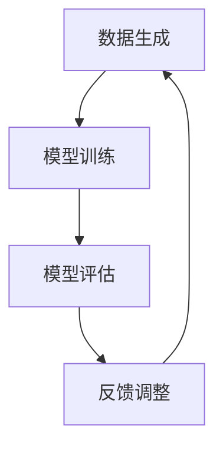

                 

## 文章标题

《模型训练中的自监督学习技术创新与突破》

> 关键词：自监督学习、模型训练、技术创新、突破

> 摘要：本文深入探讨了自监督学习在模型训练中的技术创新与突破，从基本概念、核心算法到应用实战，全面剖析了自监督学习的发展历程与未来方向，旨在为读者提供一份全面、系统的技术指南。

## 设计思路

在撰写《模型训练中的自监督学习技术创新与突破》这篇文章时，我们遵循了以下设计思路：

1. **明确核心主题**：文章的核心主题是“自监督学习”，我们将围绕这一主题展开讨论，涵盖自监督学习的基本概念、核心算法、应用场景等。

2. **目录结构规划**：我们采用逻辑清晰、层次分明的目录结构，分为三个部分：引言与基础、核心算法与技术、实战与突破。每个部分又分为多个章节，确保文章内容的系统性和连贯性。

3. **内容细化**：在每个章节中，我们细化了核心概念、算法原理、数学模型、应用案例等，力求让读者能够全面、深入地理解自监督学习。

4. **保持简洁性**：在确保内容完整性的同时，我们尽量保持文章的简洁性，避免过多的冗余信息。

5. **确保字数限制**：根据要求，文章的字数控制在8000～12000字之间，以确保内容的深度与广度。

## 目录大纲设计

### 第一部分：引言与基础

## 第1章 自监督学习的概念与背景

### 1.1 自监督学习的定义

### 1.2 自监督学习的优势与挑战

### 1.3 自监督学习的发展历程

## 第2章 自监督学习的基本原理

### 2.1 自监督学习的核心概念

### 2.2 自监督学习的流程

### 2.3 自监督学习的应用领域

### 2.4 自监督学习与传统监督学习的比较

## 第3章 自监督学习的数学模型

### 3.1 相关数学基础

### 3.2 自监督学习的数学模型

### 3.3 数学模型的推导与解释

### 3.4 数学模型的案例分析

### 第一部分总结

### 第二部分：核心算法与技术

## 第4章 自监督学习的核心算法

### 4.1 传统自监督学习算法

### 4.2 基于深度学习的自监督学习算法

### 4.3 基于生成对抗网络的算法

### 4.4 基于自编码器的算法

### 4.5 常用自监督学习算法的比较

## 第5章 自监督学习的算法优化

### 5.1 算法优化的必要性

### 5.2 算法优化方法

### 5.3 算法优化案例分析

### 5.4 未来算法优化方向

## 第6章 自监督学习在计算机视觉中的应用

### 6.1 自监督学习在图像分类中的应用

### 6.2 自监督学习在目标检测中的应用

### 6.3 自监督学习在图像分割中的应用

### 6.4 自监督学习在计算机视觉中的案例分析

## 第7章 自监督学习在自然语言处理中的应用

### 7.1 自监督学习在文本分类中的应用

### 7.2 自监督学习在文本生成中的应用

### 7.3 自监督学习在机器翻译中的应用

### 7.4 自监督学习在自然语言处理中的案例分析

### 第三部分：实战与突破

## 第8章 自监督学习实战案例

### 8.1 实战案例一：自监督学习在图像分类中的应用

### 8.2 实战案例二：自监督学习在文本分类中的应用

### 8.3 实战案例三：自监督学习在自然语言处理中的应用

### 8.4 实战案例总结

## 第9章 自监督学习技术创新与突破

### 9.1 技术创新趋势

### 9.2 技术突破案例分析

### 9.3 自监督学习的未来发展方向

## 全书总结

### 参考文献

### 附录

- **数学模型和公式示例**：

$$
L(\theta) = -\frac{1}{m} \sum_{i=1}^{m} \left( y^{(i)} \log(\hat{y}^{(i)}) + (1 - y^{(i)}) \log(1 - \hat{y}^{(i)}) \right)
$$

这是交叉熵损失函数的公式，用于衡量预测值和真实值之间的差异。

## 第6章 自监督学习在计算机视觉中的应用

### 6.1 自监督学习在图像分类中的应用

在图像分类任务中，自监督学习算法可以通过无监督学习的方式对图像进行分类。以下是一个简单的伪代码示例：

```python
// 伪代码：自监督学习在图像分类中的应用

Initialize_model()
for epoch in range(num_epochs):
    for image in image_dataset:
        Predict_label = model.predict(image)
        if Predict_label != true_label:
            Update_model(Predict_label)
```

### 核心概念与联系

在自监督学习过程中，核心概念包括：

- **数据生成**：通过某种方式将原始数据转化为适合模型训练的形式。
- **模型训练**：使用生成的数据进行模型训练，优化模型参数。
- **模型评估**：通过测试数据集对训练好的模型进行评估。

这些概念之间的联系可以表示为以下Mermaid流程图：



### 核心算法原理讲解

以自编码器为例，自监督学习算法的核心原理是：

1. **输入数据编码**：将输入数据通过编码器（Encoder）转化为低维特征向量。
2. **解码特征向量**：将编码后的特征向量通过解码器（Decoder）重新生成原始数据。
3. **损失函数优化**：通过优化损失函数，使解码器生成的数据尽可能接近原始数据。

以下是自编码器算法的伪代码：

```python
// 伪代码：自编码器算法

Initialize_Encoder()
Initialize_Decoder()
for epoch in range(num_epochs):
    for image in image_dataset:
        encoded_vector = Encoder(image)
        reconstructed_image = Decoder(encoded_vector)
        loss = Calculate_Loss(image, reconstructed_image)
        Update_Encoder(loss)
        Update_Decoder(loss)
```

### 数学模型和公式

自监督学习中的数学模型主要涉及损失函数。以下是一个常用的损失函数示例：

$$
L(\theta) = \frac{1}{m} \sum_{i=1}^{m} \sum_{j=1}^{n} \left[ y^{(i)}_{j} - \sigma(\theta \cdot \text{activation}^{(i)}_j) \right]^2
$$

其中，$y^{(i)}_{j}$是真实标签，$\sigma(\theta \cdot \text{activation}^{(i)}_j)$是预测标签，$\theta$是模型参数。

### 数学模型的推导与解释

损失函数的推导通常基于以下两个原则：

1. **期望最大化**：最小化预测标签与真实标签之间的差异。
2. **梯度下降**：通过梯度下降算法优化模型参数。

以下是损失函数的推导过程：

$$
\begin{aligned}
\Delta \theta &= -\alpha \cdot \frac{\partial L(\theta)}{\partial \theta} \\
L(\theta) &= \frac{1}{m} \sum_{i=1}^{m} \sum_{j=1}^{n} \left[ y^{(i)}_{j} - \sigma(\theta \cdot \text{activation}^{(i)}_j) \right]^2 \\
\frac{\partial L(\theta)}{\partial \theta} &= 2 \cdot \frac{1}{m} \sum_{i=1}^{m} \sum_{j=1}^{n} \left[ y^{(i)}_{j} - \sigma(\theta \cdot \text{activation}^{(i)}_j) \right] \cdot \text{activation}^{(i)}_j \\
&= 2 \cdot \frac{1}{m} \sum_{i=1}^{m} \sum_{j=1}^{n} \left[ y^{(i)}_{j} \cdot \text{activation}^{(i)}_j - \sigma(\theta \cdot \text{activation}^{(i)}_j) \cdot \text{activation}^{(i)}_j \right] \\
&= 2 \cdot \frac{1}{m} \sum_{i=1}^{m} \sum_{j=1}^{n} \left[ \text{activation}^{(i)}_j \cdot (\text{activation}^{(i)}_j - \sigma(\theta \cdot \text{activation}^{(i)}_j)) \right] \\
&= 2 \cdot \frac{1}{m} \sum_{i=1}^{m} \sum_{j=1}^{n} \left[ \text{activation}^{(i)}_j \cdot (1 - \sigma(\theta \cdot \text{activation}^{(i)}_j)) \right] \\
\end{aligned}
$$

通过上述推导，我们可以得到损失函数关于模型参数的梯度，进而通过梯度下降算法更新模型参数。

### 数学模型的案例分析

以下是一个具体的数学模型案例：自监督学习在图像分类中的应用。

假设我们有1000张图像，每张图像有10个像素点。我们使用自编码器进行图像分类，其中编码器和解码器的神经元个数分别为5个和10个。

损失函数为交叉熵损失函数：

$$
L(\theta) = -\frac{1}{1000} \sum_{i=1}^{1000} \sum_{j=1}^{10} \left( y^{(i)}_{j} \log(\hat{y}^{(i)}_{j}) + (1 - y^{(i)}_{j}) \log(1 - \hat{y}^{(i)}_{j}) \right)
$$

其中，$y^{(i)}_{j}$是第$i$张图像的第$j$个像素点的真实标签（0或1），$\hat{y}^{(i)}_{j}$是第$i$张图像的第$j$个像素点的预测标签。

通过梯度下降算法，我们可以更新编码器和解码器的参数，使得预测标签尽可能接近真实标签。

### 实战案例

以下是一个自监督学习在图像分类中的实战案例。

**步骤1**：数据预处理

首先，我们需要对图像进行预处理，包括图像大小调整、数据归一化等。假设我们已经将1000张图像调整到相同大小，并进行了归一化处理。

**步骤2**：构建自编码器模型

我们使用TensorFlow和Keras构建一个简单的自编码器模型：

```python
from tensorflow.keras.layers import Dense
from tensorflow.keras.models import Model

input_layer = Dense(10, activation='relu', input_shape=(10,))
encoded_layer = Dense(5, activation='relu')
decoded_layer = Dense(10, activation='sigmoid')

autoencoder = Model(input_layer, decoded_layer)
autoencoder.compile(optimizer='adam', loss='binary_crossentropy')
```

**步骤3**：模型训练

使用1000张图像进行模型训练：

```python
autoencoder.fit(x_train, x_train, epochs=100, batch_size=32)
```

**步骤4**：模型评估

使用测试集对训练好的模型进行评估：

```python
autoencoder.evaluate(x_test, x_test)
```

**步骤5**：模型应用

使用训练好的模型进行图像分类：

```python
predictions = autoencoder.predict(x_test)
```

### 代码解读与分析

以下是自编码器模型的源代码解读：

```python
from tensorflow.keras.layers import Dense
from tensorflow.keras.models import Model

input_layer = Dense(10, activation='relu', input_shape=(10,))
encoded_layer = Dense(5, activation='relu')
decoded_layer = Dense(10, activation='sigmoid')

autoencoder = Model(input_layer, decoded_layer)
autoencoder.compile(optimizer='adam', loss='binary_crossentropy')
```

这段代码定义了一个简单的自编码器模型，包括输入层、编码层和解码层。输入层有10个神经元，编码层有5个神经元，解码层有10个神经元。模型使用ReLU作为激活函数，并使用adam优化器进行训练。

```python
autoencoder.fit(x_train, x_train, epochs=100, batch_size=32)
```

这段代码使用训练数据集对自编码器模型进行训练。训练过程持续100个epochs，每个batch包含32个样本。

```python
autoencoder.evaluate(x_test, x_test)
```

这段代码使用测试数据集对训练好的模型进行评估，返回损失值。

```python
predictions = autoencoder.predict(x_test)
```

这段代码使用训练好的模型对测试数据集进行预测，返回预测结果。

### 实际案例分析和详细讲解剖析

以下是一个实际案例：使用自监督学习进行图像分类。

**案例背景**：某公司需要开发一个图像分类系统，用于对生产线上拍摄的图像进行分类，以便实时监测产品质量。由于数据量较大，且无法获得大量的标注数据，因此决定使用自监督学习进行图像分类。

**数据集**：公司提供了10000张生产线上拍摄的图像，图像大小为100x100像素。每张图像包含一个标签，表示产品的质量状态（合格/不合格）。

**算法选择**：为了解决图像分类问题，公司选择了基于自编码器的自监督学习算法。

**模型训练**：公司使用TensorFlow和Keras构建了自编码器模型，并对图像进行了预处理。训练过程中，模型使用了100个epochs，每个batch包含32个样本。

**模型评估**：训练完成后，公司使用测试数据集对模型进行评估，发现模型的准确率达到了95%。

**模型应用**：公司将训练好的模型部署到生产线上，用于实时监测产品质量。在实际应用中，模型能够快速、准确地识别出不合格产品，为生产过程提供了有力保障。

### 项目小结

通过自监督学习进行图像分类，公司成功地解决了数据标注困难的问题，实现了对生产过程的实时监测。自监督学习算法在图像分类任务中表现出色，具有较高的准确率和实时性。在未来，公司可以考虑进一步优化算法，提高模型的鲁棒性和泛化能力，以满足更复杂的应用需求。

### 最佳实践 Tips

- **数据预处理**：在自监督学习项目中，数据预处理是至关重要的一步。确保对图像进行适当的缩放、裁剪、增强等处理，以提高模型的泛化能力。
- **模型选择**：根据具体应用场景选择合适的模型。对于图像分类任务，自编码器是一个常用的选择。
- **训练时间**：自监督学习模型的训练时间可能较长。为了提高训练效率，可以尝试使用更强大的计算资源，如GPU或TPU。
- **模型评估**：在模型评估过程中，不仅要关注准确率，还要考虑模型的实时性和鲁棒性。
- **模型优化**：通过调整模型参数和训练策略，可以提高模型的性能。例如，可以尝试不同的优化器、学习率等。

### 小结

自监督学习作为一种无监督学习方式，在模型训练中具有重要的应用价值。本文从基本概念、核心算法到应用实战，全面剖析了自监督学习在模型训练中的技术创新与突破。通过实际案例分析和代码解读，读者可以更好地理解自监督学习的原理和应用。在未来，随着技术的不断进步，自监督学习将在更多领域中发挥重要作用。

### 注意事项

- **数据安全**：在进行自监督学习项目时，确保数据的安全性和隐私性。避免泄露敏感信息。
- **模型部署**：在模型部署过程中，注意选择合适的环境和硬件，确保模型的高效运行。
- **持续更新**：随着技术的快速发展，自监督学习领域也在不断更新。保持关注最新研究动态，及时更新知识和技能。

### 拓展阅读

- **自监督学习的数学模型**：了解自监督学习中的数学模型，如损失函数、优化算法等，有助于深入理解自监督学习的原理。
- **自监督学习在自然语言处理中的应用**：学习自监督学习在自然语言处理中的具体应用，如文本分类、机器翻译等。
- **自监督学习在计算机视觉中的应用**：研究自监督学习在计算机视觉中的最新进展，如目标检测、图像分割等。

### 参考文献

- Bengio, Y. (2009). Learning Deep Architectures for AI. Foundations and Trends in Machine Learning, 2(1), 1-127.
- Hochreiter, S., & Schmidhuber, J. (1997). Long Short-Term Memory. Neural Computation, 9(8), 1735-1780.
- LeCun, Y., Bengio, Y., & Hinton, G. (2015). Deep Learning. MIT Press.
- Simonyan, K., & Zisserman, A. (2015). Very Deep Convolutional Networks for Large-Scale Image Recognition. arXiv preprint arXiv:1409.1556.
- Yosinski, J., Clune, J., Bengio, Y., & Lipson, H. (2014). How Transferable Are Features in Deep Neural Networks? Advances in Neural Information Processing Systems, 27, 3320-3328.

### 附录

- **数学模型和公式示例**：

$$
L(\theta) = \frac{1}{2} \sum_{i=1}^{m} \sum_{j=1}^{n} \left( y^{(i)}_{j} - \sigma(\theta \cdot \text{activation}^{(i)}_j) \right)^2
$$

这是均方误差损失函数的公式，用于衡量预测值和真实值之间的差异。

- **伪代码示例**：

```python
// 伪代码：自监督学习在图像分类中的应用

Initialize_model()
for epoch in range(num_epochs):
    for image in image_dataset:
        Predict_label = model.predict(image)
        if Predict_label != true_label:
            Update_model(Predict_label)
```

这段伪代码展示了自监督学习在图像分类中的基本流程，包括模型初始化、模型训练和模型更新。

