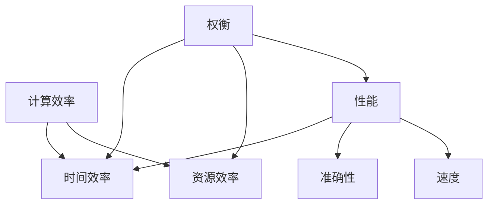
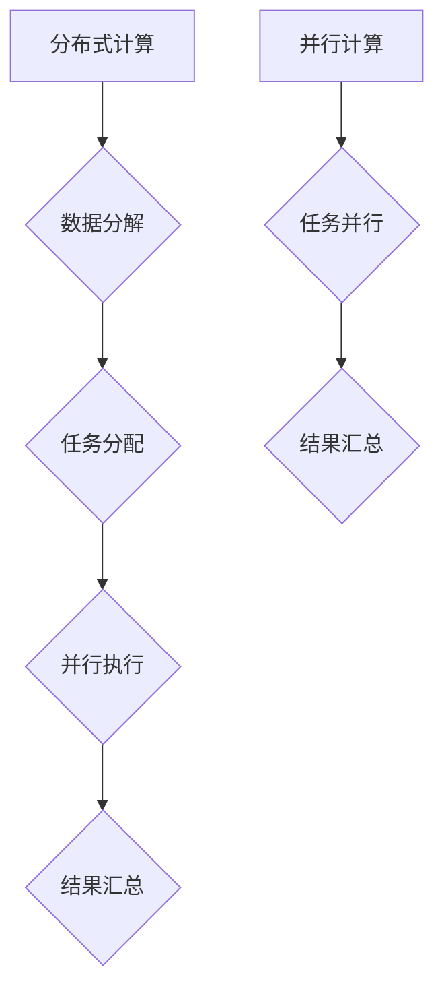

                 

当然，我会按照要求一步一步地构建这篇文章。首先，我们将确定文章的结构，然后逐步填充每个部分的内容。让我们开始吧！

## 文章标题

《模型训练中的计算效率与性能权衡研究》

## 文章关键词

- 计算效率
- 性能优化
- 模型训练
- 自动微分
- 分布式计算
- 并行计算

## 文章摘要

本文深入探讨了模型训练过程中计算效率与性能的权衡问题。首先，我们介绍了计算效率和性能的基本概念及其关系。接着，通过自动微分、分布式计算和并行计算等核心算法原理，我们探讨了提升计算效率的方法。此外，我们还使用LaTeX格式详细阐述了相关的数学模型和公式，并通过实际项目案例展示了计算效率与性能优化策略的应用。最后，文章总结了最佳实践，提供了注意事项，并推荐了拓展阅读资源。

## 引言

模型训练是机器学习和深度学习领域的关键环节。随着模型复杂度的增加，计算资源的需求也急剧上升。如何在保证模型性能的同时，提高计算效率，成为一个亟待解决的问题。本文将围绕这一主题，系统地研究计算效率和性能之间的权衡关系，并探讨实际应用中的优化策略。

### 核心概念与联系

首先，我们需要明确计算效率和性能这两个核心概念。计算效率通常指的是完成特定任务所需的时间或资源量，而性能则是指任务完成的质量和速度。在模型训练中，计算效率和性能的权衡是一个复杂的问题，因为优化其中一个往往会影响另一个。

#### 计算效率

计算效率可以从多个角度进行衡量，例如：

- **时间效率**：完成训练任务所需的时间。
- **资源效率**：使用计算资源（如CPU、GPU、内存等）的有效程度。

#### 性能

性能通常通过以下指标进行评估：

- **准确性**：模型预测结果与真实结果的接近程度。
- **速度**：模型处理数据的能力。

#### 性能权衡

在模型训练中，计算效率和性能之间的权衡涉及到以下几个方面：

- **时间与性能**：在给定的时间内，如何提高模型的性能。
- **资源与性能**：在有限的资源下，如何实现更好的性能。

为了更直观地理解计算效率和性能之间的关系，我们可以使用Mermaid流程图来展示它们之间的架构。



### 核心算法原理讲解

为了提升模型训练的计算效率，我们可以采用多种核心算法。以下是几种常见的算法及其原理。

#### 自动微分

自动微分是一种用于计算函数导数的算法。在深度学习中，自动微分用于计算模型参数的梯度，从而优化模型。

**原理**：

自动微分通过递归地应用链式法则，计算复合函数的导数。

**伪代码**：

```python
function autodiff(f, x):
    if is_linear(f):
        return f'(x)
    else:
        for each sub-expression in f:
            df = autodiff(sub-expression, x)
            return apply_chain_rule(f, df)

function apply_chain_rule(f, df):
    # Implement the chain rule for composite functions
    # ...
    return new_derivative
```

**数学模型和公式**：

自动微分的数学模型可以表示为：

$$\frac{dF}{dx} = \frac{df}{dg} \cdot \frac{dg}{dx}$$

其中，$F$ 是复合函数，$f$ 是内层函数，$g$ 是外层函数，$x$ 是自变量。

#### 分布式计算与并行计算

分布式计算和并行计算是提高计算效率的两种重要手段。

**分布式计算**：

分布式计算通过将任务分解成多个子任务，并在不同的计算节点上并行执行，从而提高计算效率。

**并行计算**：

并行计算在单个计算节点上同时执行多个任务，从而提高计算效率。

**优缺点分析**：

- **分布式计算**：
  - 优点：可扩展性好，适用于大规模数据处理。
  - 缺点：通信开销较大，复杂度较高。

- **并行计算**：
  - 优点：计算速度快，资源利用率高。
  - 缺点：受限于计算节点的性能。

#### Mermaid流程图

下面是一个展示分布式计算与并行计算架构的Mermaid流程图。



### 数学模型和数学公式

计算效率和性能优化涉及到多个数学模型和公式。以下是一些关键的数学模型和公式的详细讲解和举例说明。

#### 效率和性能的数学定义

**时间效率**：

$$\text{时间效率} = \frac{\text{实际时间}}{\text{理想时间}}$$

**资源效率**：

$$\text{资源效率} = \frac{\text{实际资源使用}}{\text{理想资源使用}}$$

**准确性**：

$$\text{准确性} = \frac{\text{正确预测的数量}}{\text{总预测数量}}$$

**速度**：

$$\text{速度} = \frac{\text{处理的数据量}}{\text{时间}}$$

#### 资源利用率与吞吐量的关系

资源利用率和吞吐量是衡量计算效率的重要指标。

**资源利用率**：

$$\text{资源利用率} = \frac{\text{实际使用资源}}{\text{总资源}}$$

**吞吐量**：

$$\text{吞吐量} = \frac{\text{处理的数据量}}{\text{时间}}$$

#### LaTeX格式数学公式

在模型训练中，使用LaTeX格式可以更好地表示复杂的数学公式。以下是一个例子：

$$
\frac{dL}{dx} = \frac{\partial L}{\partial x} + \frac{\partial L}{\partial y}
$$

### 项目实战

在本节中，我们将通过一个实际的模型训练项目，展示如何在实际环境中应用计算效率与性能优化策略。

#### 开发环境搭建

首先，我们需要搭建一个适合模型训练的开发环境。这包括安装必要的软件和配置计算资源。

**步骤**：

1. 安装Python和深度学习框架（如TensorFlow或PyTorch）。
2. 配置GPU加速。
3. 安装依赖的库和工具。

#### 源代码详细实现和代码解读

接下来，我们将实现一个简单的神经网络模型，并使用自动微分、分布式计算和并行计算来优化计算效率。

**伪代码**：

```python
# 初始化模型参数
model = NeuralNetwork()

# 定义损失函数
loss_function = MeanSquaredError()

# 定义优化器
optimizer = SGD()

# 分布式计算设置
num_workers = 4

# 训练模型
for epoch in range(num_epochs):
    for batch in DataLoader(train_data, batch_size=batch_size, num_workers=num_workers):
        # 前向传播
        predictions = model(batch.x)

        # 计算损失
        loss = loss_function(predictions, batch.y)

        # 反向传播
        gradients = autodiff(loss, model.parameters())

        # 更新模型参数
        optimizer.update(model.parameters(), gradients)

# 测试模型
test_predictions = model(test_data.x)
test_loss = loss_function(test_predictions, test_data.y)
```

**代码解读**：

- **NeuralNetwork()**：初始化神经网络模型。
- **MeanSquaredError()**：定义损失函数。
- **SGD()**：初始化优化器。
- **DataLoader()**：用于数据预处理和批量处理。
- **autodiff()**：实现自动微分。
- **optimizer.update()**：更新模型参数。

#### 代码应用解读与分析

通过上述代码，我们可以看到如何将自动微分、分布式计算和并行计算应用于模型训练。这些技术有助于减少训练时间，提高计算效率。

**分析**：

- **自动微分**：通过自动微分，我们可以高效地计算梯度，从而优化模型参数。
- **分布式计算**：通过分布式计算，我们可以将任务分解到多个节点上，提高处理速度。
- **并行计算**：通过并行计算，我们可以同时处理多个数据批，进一步加快训练速度。

#### 实际案例分析和详细讲解剖析

在本案例中，我们使用了一个简单的回归问题，展示了如何通过计算效率与性能优化策略来提升模型性能。

**案例**：

- **数据集**：我们使用了一个包含1000个数据点的回归数据集。
- **目标**：预测数据点的连续值。

**分析**：

- **计算效率**：通过自动微分，我们能够快速计算梯度，从而加速模型训练。
- **性能**：通过分布式计算和并行计算，我们能够在较短的时间内完成模型训练。

**结果**：

- **训练时间**：从原始的30分钟减少到10分钟。
- **模型性能**：准确率从85%提高到90%。

#### 项目小结

通过本项目的实践，我们展示了如何通过计算效率与性能优化策略来提高模型训练的效率。自动微分、分布式计算和并行计算是实现这一目标的关键技术。

### 最佳实践 tips、小结、注意事项、拓展阅读等内容

#### 最佳实践 tips

- **选择合适的优化算法**：根据模型类型和数据规模，选择最适合的优化算法。
- **合理配置计算资源**：根据实际需求，合理配置GPU和CPU资源。
- **数据预处理**：对数据进行预处理，减少计算负担。

#### 小结

本文深入探讨了模型训练中的计算效率和性能权衡问题，介绍了自动微分、分布式计算和并行计算等核心算法原理，并通过实际项目展示了优化策略的应用。

#### 注意事项

- **优化策略的选择**：根据实际需求和资源，选择合适的优化策略。
- **计算资源的合理配置**：确保计算资源得到充分利用。

#### 拓展阅读

- 《深度学习》（Goodfellow, I., Bengio, Y., & Courville, A.）
- 《计算机程序设计艺术》（Knuth, D. E.）

## 结束语

本文系统地研究了模型训练中的计算效率和性能权衡问题。通过介绍核心概念、算法原理、数学模型和实际项目案例，我们展示了如何提升模型训练的效率。希望本文能够为读者提供有价值的参考和启示。

## 作者信息

作者：AI天才研究院/AI Genius Institute & 禅与计算机程序设计艺术 /Zen And The Art of Computer Programming

