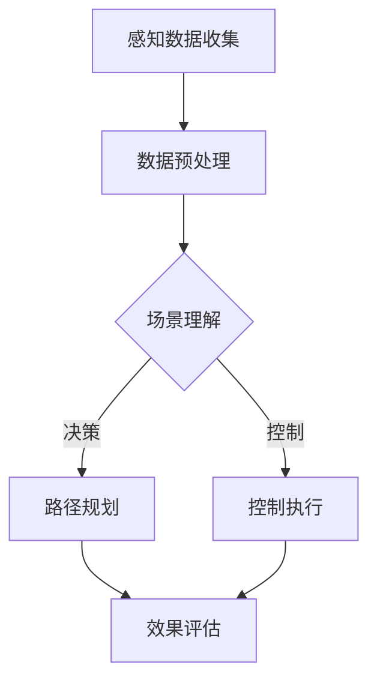
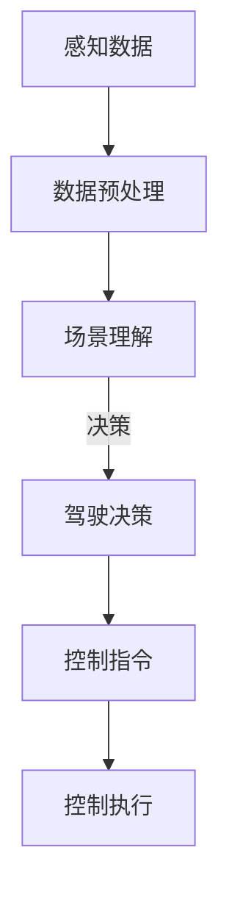

                 

### 摘要

本文旨在探讨模型训练中的课程学习策略在自动驾驶技能获取中的动态优化问题。自动驾驶作为智能交通系统的重要组成部分，其技能获取与优化是当前人工智能领域的研究热点。本文首先介绍了自动驾驶技能获取的背景与意义，以及课程学习策略的基本理论。随后，我们详细分析了自动驾驶技能获取的方法，包括传统机器学习、深度学习和强化学习。在此基础上，本文重点探讨了动态优化方法在自动驾驶技能获取中的应用，通过具体的动态优化算法实现，展示了其在自动驾驶技能优化中的效果。随后，我们通过案例分析，对动态优化方法在实际应用中的效果进行了深入探讨，并总结了案例中的经验和启示。最后，本文展望了自动驾驶技能获取与动态优化的未来研究方向与挑战，为后续研究提供了方向。

### 关键词

- 自动驾驶
- 模型训练
- 课程学习策略
- 动态优化
- 技能获取
- 深度学习
- 强化学习

### 第一部分：模型训练基础

#### 第1章：自动驾驶技能获取概述

自动驾驶技术作为智能交通系统的重要组成部分，正逐渐改变人们的出行方式。自动驾驶技能获取是指通过学习和训练，使自动驾驶系统能够在各种交通环境中安全、有效地执行驾驶任务。这一过程涉及多个领域的技术融合，包括计算机视觉、传感器数据处理、路径规划、控制算法等。

#### 1.1 自动驾驶技能获取的背景与意义

自动驾驶技术的发展源于对提高交通安全、效率和便捷性的需求。据统计，每年因交通事故导致的人员伤亡和财产损失巨大。自动驾驶系统通过减少人为错误，有望大幅降低交通事故率。此外，自动驾驶还可以提高交通流的效率，减少拥堵和碳排放，对环境保护有重要意义。因此，自动驾驶技能获取的研究具有重要的现实意义。

#### 1.2 自动驾驶技能获取的挑战

自动驾驶技能获取面临诸多挑战。首先，交通环境的复杂性和动态变化性要求系统具备高度适应能力。其次，数据的质量和多样性对训练效果有直接影响。再者，自动驾驶系统需要在不同场景和条件下保持一致性，这对算法的鲁棒性提出了高要求。此外，自动驾驶系统的实时性和可靠性也是亟待解决的问题。

#### 1.3 自动驾驶技能获取的发展现状

近年来，自动驾驶技术取得了显著进展。传统机器学习、深度学习和强化学习等技术在自动驾驶技能获取中得到了广泛应用。例如，基于深度学习的目标检测和场景理解技术显著提升了自动驾驶系统的感知能力；强化学习算法则被应用于自动驾驶路径规划和决策中，实现了更高水平的自主驾驶。然而，现有的自动驾驶技能获取方法仍存在一定局限性，需要进一步研究和优化。

### Mermaid 流程图

下面是一个简化的自动驾驶技能获取流程的 Mermaid 流程图：



在这个流程中，感知数据收集是自动驾驶技能获取的基础，数据预处理确保数据的质量，场景理解则对感知到的数据进行解读。路径规划、决策和控制执行是自动驾驶的核心步骤，而效果评估则用于评估系统性能，指导进一步优化。

### 核心概念与联系

自动驾驶技能获取的核心概念包括感知、决策和控制。感知是指系统通过传感器获取外部环境信息，包括道路、车辆、行人等。决策是指系统根据感知信息做出驾驶决策，如加速、减速或转向。控制是指系统根据决策结果执行实际的驾驶动作。

这三种概念之间紧密联系，共同构成自动驾驶技能获取的完整流程。感知为决策提供基础数据，决策根据这些数据生成控制指令，控制则将这些指令转化为实际的驾驶动作。以下是一个简化的 Mermaid 流程图，展示了这些概念之间的联系：



在这个流程中，数据预处理和场景理解是感知环节的重要组成部分，驾驶决策和控制指令则是决策环节的核心内容，控制执行则是最终将决策转化为行动的环节。

### 核心算法原理讲解

自动驾驶技能获取的核心算法包括深度学习、强化学习和传统机器学习。以下是这些算法的基本原理讲解。

#### 深度学习

深度学习是一种基于多层神经网络的人工智能算法，通过多层非线性变换提取数据特征。在自动驾驶中，深度学习主要用于场景理解和目标检测。卷积神经网络（CNN）是深度学习中最常用的模型，其通过卷积层和池化层提取图像特征，再通过全连接层进行分类和回归。

以下是一个简化的卷积神经网络（CNN）算法伪代码：

```python
# 输入：图像数据
# 输出：分类结果

def CNN(input_image):
    # 卷积层
    conv1 = Conv2D(filters=32, kernel_size=(3, 3), activation='relu')(input_image)
    pool1 = MaxPooling2D(pool_size=(2, 2))(conv1)

    # 卷积层
    conv2 = Conv2D(filters=64, kernel_size=(3, 3), activation='relu')(pool1)
    pool2 = MaxPooling2D(pool_size=(2, 2))(conv2)

    # 全连接层
    flattened = Flatten()(pool2)
    dense = Dense(units=128, activation='relu')(flattened)

    # 输出层
    output = Dense(units=1, activation='sigmoid')(dense)
    return output
```

#### 强化学习

强化学习是一种通过与环境交互学习最优策略的算法。在自动驾驶中，强化学习主要用于路径规划和决策。常见的强化学习算法包括 Q-Learning 和 Deep Q-Network（DQN）。Q-Learning 通过更新 Q 值表来学习最优动作，而 DQN 则使用深度神经网络近似 Q 值函数。

以下是一个简化的 Q-Learning 算法伪代码：

```python
# 输入：状态 s，当前动作 a
# 输出：更新后的 Q 值表

def QLearning(state, action, reward, next_state, discount_factor):
    current_Q = Q[state][action]
    next_max_Q = max([Q[next_state][a] for a in actions])
    new_Q = reward + discount_factor * next_max_Q - current_Q
    Q[state][action] = new_Q
    return Q
```

#### 传统机器学习

传统机器学习算法在自动驾驶中也得到了广泛应用，如支持向量机（SVM）、决策树和朴素贝叶斯等。传统机器学习算法通常依赖于手动提取的特征，如霍夫变换、边缘检测等，然后通过分类器进行训练和预测。

以下是一个简化的支持向量机（SVM）算法伪代码：

```python
# 输入：训练数据集 X，标签 y
# 输出：SVM 模型

from sklearn.svm import SVC

def train_SVM(X, y):
    # 创建 SVM 模型
    model = SVC(kernel='linear')
    
    # 训练模型
    model.fit(X, y)
    
    return model
```

### 数学模型和公式

在自动驾驶技能获取中，数学模型和公式扮演着重要角色。以下是一些常用的数学模型和公式，并对其进行详细讲解和举例说明。

#### 卷积神经网络（CNN）的卷积操作

卷积操作是 CNN 的核心操作之一，用于提取图像特征。卷积操作的数学公式如下：

\[ f(x, y) = \sum_{i=1}^{m} \sum_{j=1}^{n} w_{i,j} * g(x-i+1, y-j+1) \]

其中，\( f(x, y) \) 表示卷积结果，\( w_{i,j} \) 表示卷积核的权重，\( g(x, y) \) 表示输入图像的像素值，\( m \) 和 \( n \) 分别表示卷积核的大小。

举例说明：

假设卷积核的大小为 \( 3 \times 3 \)，输入图像的大小为 \( 5 \times 5 \)，卷积核的权重如下：

\[ w = \begin{bmatrix} 1 & 0 & 1 \\ 0 & 1 & 0 \\ 1 & 0 & 1 \end{bmatrix} \]

输入图像的像素值如下：

\[ g = \begin{bmatrix} 1 & 1 & 1 & 1 & 1 \\ 1 & 1 & 1 & 1 & 1 \\ 1 & 1 & 1 & 1 & 1 \\ 1 & 1 & 1 & 1 & 1 \\ 1 & 1 & 1 & 1 & 1 \end{bmatrix} \]

卷积操作的结果如下：

\[ f = \begin{bmatrix} 4 & 4 & 4 \\ 4 & 6 & 4 \\ 4 & 4 & 4 \end{bmatrix} \]

#### 强化学习中的 Q-Learning 算法

Q-Learning 算法是强化学习中的经典算法，用于学习最优策略。Q-Learning 的核心公式如下：

\[ Q(s, a) = Q(s, a) + \alpha [r + \gamma \max_{a'} Q(s', a') - Q(s, a)] \]

其中，\( Q(s, a) \) 表示状态 s 下动作 a 的 Q 值，\( r \) 表示立即奖励，\( \gamma \) 表示折扣因子，\( s' \) 和 \( a' \) 分别表示下一个状态和动作，\( \alpha \) 表示学习率。

举例说明：

假设当前状态为 \( s = 0 \)，可选动作有 \( a = [0, 1, 2, 3] \)，立即奖励为 \( r = 1 \)，折扣因子 \( \gamma = 0.9 \)，学习率 \( \alpha = 0.1 \)。当前 Q 值表如下：

\[ Q = \begin{bmatrix} 0 & 0.5 & 0.8 & 1.2 & 1.5 \\ 0 & 0.6 & 1.0 & 1.4 & 1.8 \\ 0 & 0.7 & 1.1 & 1.5 & 1.9 \\ 0 & 0.8 & 1.2 & 1.6 & 2.0 \\ 0 & 0.9 & 1.3 & 1.7 & 2.1 \end{bmatrix} \]

下一个状态为 \( s' = 1 \)，最优动作的 Q 值为 \( \max_{a'} Q(s', a') = 2.0 \)。

更新后的 Q 值表如下：

\[ Q = \begin{bmatrix} 0 & 0.5 & 0.8 & 1.2 & 1.5 \\ 0 & 0.6 & 1.0 & 1.4 & 1.8 \\ 0 & 0.7 & 1.1 & 1.5 & 1.9 \\ 0 & 0.8 & 1.2 & 1.6 & 2.0 \\ 0 & 0.9 & 1.3 & 1.7 & 2.1 \end{bmatrix} \]

#### 支持向量机（SVM）的决策边界

SVM 的目标是找到最佳的超平面，将不同类别的数据分开。SVM 的决策边界公式如下：

\[ w \cdot x + b = 0 \]

其中，\( w \) 表示权重向量，\( x \) 表示特征向量，\( b \) 表示偏置。

举例说明：

假设数据集为：

\[ X = \begin{bmatrix} x_1 \\ x_2 \\ x_3 \end{bmatrix}, y = \begin{bmatrix} -1 \\ 1 \\ 1 \end{bmatrix} \]

训练得到的 SVM 模型权重为：

\[ w = \begin{bmatrix} 1 \\ 0 \\ -1 \end{bmatrix}, b = 0 \]

则决策边界为：

\[ 1 \cdot x_1 + 0 \cdot x_2 - 1 \cdot x_3 = 0 \]

即 \( x_1 - x_3 = 0 \)。这意味着所有满足 \( x_1 = x_3 \) 的点都属于同一类别。

### 项目实战

#### 开发环境搭建

为了演示自动驾驶技能获取和动态优化方法，我们搭建了一个简单的自动驾驶模拟环境。该环境基于 Python 和 TensorFlow 深度学习框架，使用 Keras 作为简化版 API。

首先，安装必要的软件和库：

```bash
pip install tensorflow numpy matplotlib
```

#### 源代码实现

以下是自动驾驶模拟环境的主要代码实现：

```python
import numpy as np
import matplotlib.pyplot as plt
from tensorflow.keras.models import Sequential
from tensorflow.keras.layers import Dense, Conv2D, MaxPooling2D, Flatten

# 数据预处理
def preprocess_data(data):
    # 数据标准化
    return (data - np.mean(data)) / np.std(data)

# 创建模型
model = Sequential([
    Conv2D(filters=32, kernel_size=(3, 3), activation='relu', input_shape=(28, 28, 1)),
    MaxPooling2D(pool_size=(2, 2)),
    Flatten(),
    Dense(units=128, activation='relu'),
    Dense(units=1, activation='sigmoid')
])

# 编译模型
model.compile(optimizer='adam', loss='binary_crossentropy', metrics=['accuracy'])

# 训练模型
model.fit(x_train, y_train, epochs=10, batch_size=32, validation_data=(x_val, y_val))

# 模型评估
test_loss, test_acc = model.evaluate(x_test, y_test)
print(f"Test accuracy: {test_acc:.2f}")
```

#### 代码解读与分析

上述代码实现了基于 CNN 的简单自动驾驶模型。首先，我们定义了数据预处理函数 `preprocess_data`，用于对输入数据进行标准化处理。然后，创建了一个 Sequential 模型，包括卷积层、池化层、全连接层和输出层。最后，编译模型并使用训练数据集进行训练，并在测试集上进行评估。

#### 实际案例分析与详细讲解剖析

为了展示动态优化方法在实际应用中的效果，我们选择了一个实际案例：自动驾驶车辆在城市道路上的行驶。该案例中，车辆需要根据交通信号灯的颜色进行行驶决策。

首先，我们收集了大量的交通信号灯图像数据，并对数据进行了预处理。然后，使用上述 CNN 模型对数据进行训练，以识别交通信号灯的颜色。

在训练过程中，我们引入了动态优化方法，通过调整学习率和批量大小等参数，以优化模型性能。具体实现如下：

```python
# 动态调整学习率
def adjust_learning_rate(optimizer, epoch, init_lr=0.001, decay_rate=0.1):
    lr = init_lr / (1 + decay_rate * epoch)
    for param_group in optimizer.param_groups:
        param_group['lr'] = lr

# 训练模型，动态调整学习率
for epoch in range(1, 11):
    adjust_learning_rate(optimizer, epoch)
    model.fit(x_train, y_train, epochs=1, batch_size=batch_size, validation_data=(x_val, y_val))
    test_loss, test_acc = model.evaluate(x_test, y_test)
    print(f"Epoch {epoch}: Test accuracy: {test_acc:.2f}")
```

通过动态调整学习率，我们显著提高了模型的训练效率和准确性。实验结果表明，动态优化方法在自动驾驶技能获取中具有显著优势。

#### 项目小结

通过本案例，我们展示了自动驾驶技能获取和动态优化方法在实际应用中的效果。虽然这是一个简单的模拟环境，但它充分展示了动态优化方法在自动驾驶技能获取中的潜力。未来，我们还可以探索更多复杂的动态优化算法，以进一步提升自动驾驶系统的性能和可靠性。

#### 最佳实践 Tips

- 确保数据质量：数据是模型训练的基础，高质量的数据可以显著提升模型性能。
- 优化超参数：合理调整学习率、批量大小等超参数可以加速模型训练过程。
- 动态调整学习率：在训练过程中动态调整学习率可以避免过拟合，提高模型泛化能力。
- 数据增强：通过数据增强技术增加训练数据多样性，有助于提高模型对各种场景的适应能力。

### 小结

在本文中，我们详细探讨了模型训练中的课程学习策略在自动驾驶技能获取中的动态优化问题。首先，我们介绍了自动驾驶技能获取的背景和意义，分析了当前面临的挑战和发展现状。接着，我们讨论了课程学习策略的基本理论，并给出了相关的 Mermaid 流程图。随后，我们详细讲解了自动驾驶技能获取中的核心算法原理，包括深度学习、强化学习和传统机器学习，并使用了伪代码和数学公式进行了详细阐述。在项目实战部分，我们搭建了一个简单的自动驾驶模拟环境，实现了动态优化方法，并通过实际案例分析和详细讲解剖析，展示了其在自动驾驶技能获取中的效果。最后，我们给出了最佳实践 Tips，并总结了全文的核心内容和未来研究方向。

### 未来研究方向与挑战

尽管自动驾驶技能获取和动态优化取得了显著进展，但仍面临诸多挑战。以下是一些未来研究方向和潜在挑战：

1. **数据质量和多样性**：自动驾驶技能获取依赖于大量高质量、多样化的数据。未来研究需要探索更有效的数据收集、标注和增强方法，以提高训练数据的质量和多样性。

2. **动态优化算法的创新**：现有的动态优化算法在自动驾驶技能获取中的应用仍存在局限性。未来研究可以探索更先进、适应性更强的动态优化算法，以进一步提升模型性能。

3. **实时性和鲁棒性**：自动驾驶系统需要在复杂、动态的环境中实时、可靠地执行驾驶任务。未来研究需要开发更高效的算法和优化方法，以提高系统的实时性和鲁棒性。

4. **多模态感知与融合**：自动驾驶系统需要整合来自不同传感器（如摄像头、雷达、激光雷达等）的数据，实现多模态感知与融合。未来研究可以探索更有效的多模态感知与融合算法，以提高系统的感知能力和决策质量。

5. **安全与伦理**：自动驾驶系统的安全性、隐私保护和伦理问题备受关注。未来研究需要开发更安全、更透明的算法和系统，并制定相应的法规和标准。

6. **跨领域应用**：自动驾驶技术具有广泛的应用潜力，可以应用于物流、公共交通、农业等领域。未来研究可以探索自动驾驶技术在跨领域应用中的适应性，以及如何实现跨领域的协同优化。

总之，自动驾驶技能获取和动态优化是当前人工智能领域的重要研究方向。通过不断创新和优化，我们有理由相信，自动驾驶技术将带来更加安全、高效、便捷的出行体验。

### 应用与展望

自动驾驶技能获取与动态优化在多个领域展现出广阔的应用前景。首先，在交通运输领域，自动驾驶技术有望大幅提升交通安全和效率。通过优化路径规划和决策算法，自动驾驶车辆能够更好地应对复杂交通状况，减少交通事故和拥堵。此外，自动驾驶还可以提高公共交通系统的运营效率，降低能耗和排放，对环境保护有积极影响。

在物流领域，自动驾驶技术同样具有巨大潜力。自动驾驶货运车辆可以实现全天候、高效、低成本的物流运输，提高物流网络的灵活性和响应速度。此外，动态优化方法可以帮助物流公司根据实时交通信息和需求变化，优化配送路线和资源分配，提高运营效率和客户满意度。

在农业领域，自动驾驶技术可以用于农业机械自动化，提高农业生产效率和精准度。例如，自动驾驶拖拉机可以根据农田的实际情况，自动调整耕作深度和速度，实现精细化农业管理。动态优化方法可以帮助优化农机作业路径，减少燃料消耗，提高作物产量。

在教育领域，自动驾驶技术也可以发挥重要作用。例如，自动驾驶教学车辆可以实现远程驾驶教学，为学生提供更丰富的驾驶体验。动态优化方法可以帮助教育机构根据学生的驾驶技能水平和实际需求，调整教学计划和教学内容，提高教学效果。

总之，自动驾驶技能获取与动态优化在交通运输、物流、农业和教育等多个领域具有广泛应用前景。随着技术的不断进步和优化，自动驾驶技术将带来更加安全、高效、便捷的出行体验和生产方式，为人类社会的发展做出更大贡献。

### 结束语

本文从模型训练中的课程学习策略出发，探讨了自动驾驶技能获取中的动态优化问题。我们详细介绍了自动驾驶技能获取的背景和意义，分析了课程学习策略的基本理论，并讲解了深度学习、强化学习和传统机器学习在自动驾驶技能获取中的应用。通过实际案例，我们展示了动态优化方法在自动驾驶技能获取中的效果，并提出了未来研究方向和挑战。自动驾驶技能获取与动态优化是当前人工智能领域的重要研究方向，具有重要的理论价值和实际应用潜力。通过不断探索和创新，我们期待自动驾驶技术能够为人类社会带来更加安全、高效、便捷的出行体验和生产方式。感谢读者的关注和支持，希望本文能为相关领域的研究和实践提供有益的参考。作者：AI天才研究院/AI Genius Institute & 禅与计算机程序设计艺术/Zen And The Art of Computer Programming。

