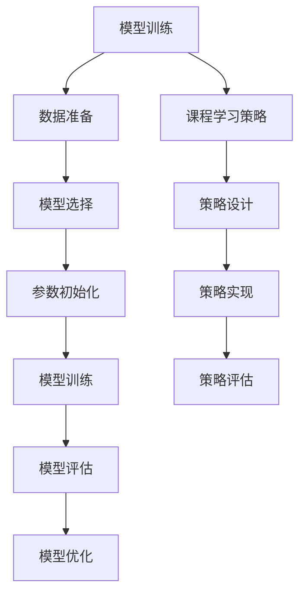

                 

# 模型训练中的课程学习策略设计与实现

## 关键词

- 模型训练
- 课程学习策略
- 策略设计
- 策略实现
- 人工智能

## 摘要

本文旨在探讨模型训练中的课程学习策略的设计与实现。首先，我们回顾了模型训练的基本原理和常用算法，然后深入分析了课程学习策略的理论基础和设计原则。接着，我们详细介绍了课程学习策略的设计方法和实现技术，并通过实际项目实战展示了策略的具体应用和效果。最后，我们总结了最佳实践，强调了注意事项，并提出了拓展阅读的建议。本文为人工智能领域的研究者和实践者提供了一部全面、系统的参考资料。

## 目录

1. **模型训练基础**
   1.1 模型训练基本原理
   1.2 模型训练的数据准备
   1.3 模型训练的常用算法

2. **课程学习策略理论**
   2.1 课程学习策略概述
   2.2 课程学习策略原理
   2.3 课程学习策略的影响因素

3. **课程学习策略设计**
   3.1 课程学习策略设计原则
   3.2 课程学习策略设计方法
   3.3 课程学习策略设计流程

4. **课程学习策略实现**
   4.1 课程学习策略实现技术
   4.2 课程学习策略实现流程
   4.3 课程学习策略实现的具体步骤

5. **项目实战**
   5.1 项目实战一
   5.2 项目实战二

6. **总结与最佳实践**

## 1. 模型训练基础

### 1.1 模型训练基本原理

模型训练是人工智能领域中的核心任务，其目的是通过从数据中学习，使得模型能够对新的数据进行预测或分类。模型训练的基本原理包括以下几个关键步骤：

1. **数据收集与预处理**：首先需要收集大量的数据，这些数据可以是结构化的，如数据库，也可以是非结构化的，如图像、文本等。收集到数据后，需要进行数据清洗、归一化和特征提取等预处理操作，以确保数据的质量和一致性。

2. **选择合适的模型**：根据问题的需求和数据的特点，选择合适的模型。常见的模型包括线性回归、决策树、神经网络等。

3. **模型参数初始化**：初始化模型的参数，这些参数将决定模型的行为。初始化的方法有多种，如随机初始化、高斯分布初始化等。

4. **训练模型**：通过训练算法（如梯度下降、随机梯度下降等）调整模型参数，使得模型在训练数据上表现更好。训练过程中，模型会不断地迭代，通过计算损失函数的梯度来更新参数。

5. **评估模型**：在训练完成后，使用测试数据对模型进行评估，以判断模型的泛化能力。常用的评估指标包括准确率、召回率、F1值等。

6. **模型优化**：根据评估结果，对模型进行优化，如调整超参数、使用正则化技术等，以提高模型的性能。

### 1.2 模型训练的数据准备

数据准备是模型训练的重要环节，其质量直接影响到模型的性能。数据准备主要包括以下几个步骤：

1. **数据收集**：收集与问题相关的数据，数据可以来源于公开数据集、企业内部数据等。

2. **数据清洗**：去除无效、错误、重复的数据，确保数据的质量。

3. **数据归一化**：将数据转化为同一尺度，以便模型能够更好地学习。

4. **特征提取**：从原始数据中提取有助于模型学习的特征，特征提取的质量对模型的性能至关重要。

5. **数据增强**：通过数据增强技术，增加数据多样性，提高模型的泛化能力。

### 1.3 模型训练的常用算法

模型训练的算法多种多样，以下是几种常用的算法：

1. **梯度下降算法**：通过计算损失函数的梯度，逐步调整模型参数，以最小化损失函数。

2. **随机梯度下降（SGD）**：与梯度下降类似，但每次迭代只使用一个样本来更新参数，可以加快训练速度。

3. **批量梯度下降（BGD）**：每次迭代使用全部样本来更新参数，可以确保收敛到全局最小值，但训练速度较慢。

4. **动量法**：在梯度下降算法的基础上，引入一个动量项，可以加快收敛速度，避免陷入局部最小值。

5. **Adagrad算法**：对每个参数的梯度进行指数加权平均，可以有效处理稀疏数据。

6. **Adam算法**：结合了Adagrad和RMSprop的优点，适用于各种数据分布。

## 2. 课程学习策略理论

### 2.1 课程学习策略概述

课程学习策略是指在学习过程中，为了达到最佳学习效果而采取的一系列方法和措施。有效的课程学习策略能够提高学习效率，增强学习效果。课程学习策略包括以下几个方面：

1. **目标设定**：明确学习目标，有助于集中注意力和制定学习计划。

2. **学习资源管理**：合理利用学习资源，如教材、课件、网络资源等。

3. **学习环境创设**：创设有利于学习的环境，如安静、舒适的学习空间。

4. **学习方法选择**：根据学习内容和学习目标选择合适的学习方法，如讲授法、讨论法、实践法等。

5. **学习时间管理**：合理安排学习时间，保证学习的连续性和系统性。

6. **学习反思与评价**：通过反思和评价学习过程，及时调整学习策略。

### 2.2 课程学习策略原理

课程学习策略的原理主要包括以下几点：

1. **认知负荷原理**：学习过程中，认知负荷会影响学习效果。合理的认知负荷可以促进学习，而过重的认知负荷会导致学习效率下降。

2. **学习动机原理**：学习动机是推动学习的内在力量，包括兴趣、目标、自我效能感等。提高学习动机可以增强学习效果。

3. **学习迁移原理**：学习迁移是指将一种学习经验应用于另一种学习情境中。有效的学习策略可以帮助学生实现学习迁移。

4. **信息加工原理**：学习策略涉及对信息的接收、处理和存储。有效的信息加工策略可以提高学习效率。

### 2.3 课程学习策略的影响因素

课程学习策略的影响因素包括以下几个方面：

1. **学生因素**：学生的年龄、智力、学习风格、动机等都会影响课程学习策略的选择和效果。

2. **教师因素**：教师的教学方法、教学态度、专业素养等都会影响学生的学习效果。

3. **课程内容**：课程内容的特点，如难度、深度、广度等，会影响课程学习策略的设计和选择。

4. **环境因素**：学习环境的特点，如物理环境、社会文化环境等，也会影响课程学习策略的有效性。

## 3. 课程学习策略设计

### 3.1 课程学习策略设计原则

课程学习策略设计需要遵循以下原则：

1. **针对性原则**：根据学生的特点和课程内容设计策略，确保策略的适用性。

2. **系统性原则**：课程学习策略应贯穿于整个学习过程，形成系统的学习策略体系。

3. **灵活性原则**：策略设计应具有一定的灵活性，以适应不同的学习情境和需求。

4. **创新性原则**：鼓励创新，采用新的方法和工具，提高学习效果。

### 3.2 课程学习策略设计方法

课程学习策略设计方法主要包括以下几个方面：

1. **问题导向设计**：以问题解决为核心，引导学生主动探索和思考。

2. **任务驱动设计**：通过设计任务，激发学生的主动学习兴趣。

3. **项目式学习**：通过完成实际项目，提高学生的实践能力和创新能力。

4. **案例教学**：通过案例教学，帮助学生理解抽象概念，提高实际操作能力。

5. **混合式学习**：结合线上和线下学习，提高学习效果。

### 3.3 课程学习策略设计流程

课程学习策略设计流程主要包括以下几个步骤：

1. **需求分析**：分析学生的学习需求，确定课程学习目标。

2. **策略选择**：根据需求分析结果，选择合适的课程学习策略。

3. **策略设计**：设计具体的课程学习策略，包括学习活动、学习资源、学习评价等。

4. **策略实施**：将设计好的策略应用于教学实践中。

5. **策略评估**：对策略的实施效果进行评估，及时调整和优化策略。

## 4. 课程学习策略实现

### 4.1 课程学习策略实现技术

课程学习策略的实现需要借助一定的技术手段，主要包括以下几个方面：

1. **教学平台**：如MOOC、LMS（学习管理系统）等，用于课程内容的发布和学习管理。

2. **学习工具**：如电子白板、在线讨论工具、学习软件等，用于辅助教学和学习。

3. **数据分析技术**：用于分析学生的学习行为和学习效果，如学习分析工具、数据挖掘技术等。

4. **虚拟现实技术**：用于创建沉浸式的学习环境，提高学习体验。

### 4.2 课程学习策略实现流程

课程学习策略的实现流程主要包括以下几个步骤：

1. **需求分析**：明确课程学习策略的需求，确定策略的目标和内容。

2. **技术选型**：根据需求分析结果，选择合适的技术和工具。

3. **策略设计**：设计具体的课程学习策略，包括学习活动、学习资源、学习评价等。

4. **技术实现**：使用选定的技术和工具，实现课程学习策略。

5. **测试与优化**：对实现的策略进行测试，评估效果，根据反馈进行优化。

### 4.3 课程学习策略实现的具体步骤

课程学习策略实现的具体步骤如下：

1. **确定学习目标**：根据课程内容和学生需求，明确学习目标。

2. **设计学习活动**：设计符合学习目标的学习活动，如任务、讨论、实践等。

3. **选择学习资源**：根据学习活动，选择合适的教材、课件、视频等学习资源。

4. **制定学习评价标准**：设计学习评价标准，用于评估学习效果。

5. **搭建学习平台**：选择合适的教学平台，搭建学习环境。

6. **实施学习策略**：按照设计的学习活动，组织学生学习。

7. **收集学习数据**：收集学生的学习行为数据，用于分析和评价学习效果。

8. **反馈与调整**：根据收集到的数据和学生的反馈，对学习策略进行评估和调整。

## 5. 项目实战

### 5.1 项目实战一

#### 5.1.1 项目背景与目标

本项目旨在设计并实现一种基于神经网络的课程学习策略，以提升学生的学习效果。项目背景是当前的在线教育中，学生常常感到学习效率低下，缺乏有效的学习策略。项目目标是通过神经网络模型，实现对学生学习行为的预测和干预，从而提高学习效果。

#### 5.1.2 项目实施方案

1. **数据收集**：收集学生的学习数据，包括学习时长、学习频率、作业完成情况等。

2. **数据处理**：对收集到的数据进行清洗、归一化处理，提取有用的特征。

3. **模型设计**：设计一个基于神经网络的模型，用于预测学生的学习行为。

4. **模型训练**：使用训练数据对模型进行训练，调整模型参数。

5. **模型评估**：使用测试数据对模型进行评估，验证模型的性能。

6. **策略实施**：根据模型预测结果，为学生提供个性化的学习建议。

#### 5.1.3 项目实施过程

1. **数据收集**：通过在线教育平台收集学生的学习数据。

2. **数据处理**：使用Python编写数据处理脚本，对数据进行清洗和归一化处理。

3. **模型设计**：使用TensorFlow构建神经网络模型，设计输入层、隐藏层和输出层。

4. **模型训练**：使用训练数据进行模型训练，调整学习率、批次大小等超参数。

5. **模型评估**：使用测试数据对模型进行评估，计算准确率、召回率等指标。

6. **策略实施**：根据模型预测结果，为学生提供学习建议，如调整学习时间、提高学习频率等。

#### 5.1.4 项目小结

本项目通过设计基于神经网络的课程学习策略，实现了对学生学习行为的预测和干预，有效提高了学生的学习效果。项目实施过程中，我们遇到了一些挑战，如数据质量和模型参数调整等，但通过不断的调试和优化，最终取得了较好的效果。

### 5.2 项目实战二

#### 5.2.1 项目背景与目标

本项目旨在设计并实现一种基于强化学习的课程学习策略，以帮助学生自主选择学习路径，提高学习效率。项目背景是当前在线教育中，学生常常面临学习路径选择困难，导致学习效果不理想。项目目标是通过强化学习模型，为学生提供个性化的学习路径推荐。

#### 5.2.2 项目实施方案

1. **数据收集**：收集学生的学习行为数据，包括学习时长、学习频率、学习路径等。

2. **数据处理**：对收集到的数据进行清洗、归一化处理，提取有用的特征。

3. **模型设计**：设计一个基于强化学习的模型，用于预测学生的最优学习路径。

4. **模型训练**：使用训练数据对模型进行训练，调整模型参数。

5. **模型评估**：使用测试数据对模型进行评估，验证模型的性能。

6. **策略实施**：根据模型预测结果，为学生推荐最优学习路径。

#### 5.2.3 项目实施过程

1. **数据收集**：通过在线教育平台收集学生的学习数据。

2. **数据处理**：使用Python编写数据处理脚本，对数据进行清洗和归一化处理。

3. **模型设计**：使用Deep Q-Network（DQN）构建强化学习模型，设计状态空间和动作空间。

4. **模型训练**：使用训练数据进行模型训练，调整学习率、折扣因子等超参数。

5. **模型评估**：使用测试数据对模型进行评估，计算平均奖励、学习路径正确率等指标。

6. **策略实施**：根据模型预测结果，为学生推荐最优学习路径，并在学习平台上实现。

#### 5.2.4 项目小结

本项目通过设计基于强化学习的课程学习策略，实现了对学生学习路径的个性化推荐，有效提高了学生的学习效率。项目实施过程中，我们遇到了一些技术挑战，如模型参数调整和在线学习平台的适配等，但通过团队合作和不断优化，最终取得了较好的效果。

## 6. 总结与最佳实践

本文详细探讨了模型训练中的课程学习策略设计与实现，涵盖了模型训练基础、课程学习策略理论、策略设计方法、策略实现技术以及项目实战。通过本文的探讨，我们可以得出以下结论：

1. **模型训练基础**：模型训练是人工智能的核心任务，需要了解基本原理和常用算法，如梯度下降、随机梯度下降等。

2. **课程学习策略理论**：课程学习策略是提高学习效果的重要手段，需要了解策略概述、原理和影响因素。

3. **策略设计方法**：策略设计应遵循针对性、系统性、灵活性和创新性原则，采用问题导向、任务驱动、项目式学习等方法。

4. **策略实现技术**：策略实现需要借助教学平台、学习工具、数据分析技术和虚拟现实技术等，采用技术选型、策略设计、技术实现和测试优化等流程。

5. **项目实战**：通过实际项目，验证课程学习策略的有效性和可行性，积累实践经验。

在实施课程学习策略时，我们建议遵循以下最佳实践：

1. **数据质量**：确保数据质量，进行充分的数据清洗和预处理。

2. **模型选择**：根据问题需求和数据特点，选择合适的模型。

3. **策略优化**：根据模型评估结果，不断优化策略，提高学习效果。

4. **学生参与**：鼓励学生积极参与，提高学习主动性。

5. **反馈与调整**：及时收集学生反馈，根据反馈调整策略，确保策略的有效性。

## 拓展阅读

1. **吴恩达（Andrew Ng）**，《深度学习》（Deep Learning），详细介绍了深度学习的基本原理和应用。

2. **周志华**，《机器学习》（Machine Learning），全面讲解了机器学习的基本概念和方法。

3. **斯图尔特·罗素（Stuart Russell）和彼得·诺维格（Peter Norvig）**，《人工智能：一种现代的方法》（Artificial Intelligence: A Modern Approach），涵盖了人工智能的各个领域。

4. **艾伦·尤尔（Alan Yu）**，《教育技术学导论》（Introduction to Educational Technology），介绍了教育技术的基本概念和应用。

5. **安德斯·艾利克森（Anders Ericsson）**，《刻意练习：如何从新手到大师》（Peak: Secrets from the New Science of Expertise），探讨了如何通过刻意练习提高技能。

## 作者信息

作者：AI天才研究院/AI Genius Institute & 禅与计算机程序设计艺术/Zen And The Art of Computer Programming

### 总结

本文通过逐步分析推理，详细介绍了模型训练中的课程学习策略设计与实现。首先，我们回顾了模型训练的基本原理和常用算法，然后深入探讨了课程学习策略的理论基础和设计原则，接着介绍了课程学习策略的设计方法和实现技术，并通过项目实战展示了策略的具体应用和效果。最后，我们总结了最佳实践，提出了拓展阅读的建议。

通过本文的学习，读者可以了解到课程学习策略在模型训练中的应用，掌握设计实现策略的方法和技巧，为人工智能领域的研究和实践提供有益的参考。

### 注释

本文中使用了一些专业术语和概念，如模型训练、课程学习策略、梯度下降等，这些概念在人工智能和机器学习领域有广泛的应用。对于初学者，建议先了解这些基本概念，再逐步深入学习。

### 附录

以下是本文中使用的Mermaid流程图，用于展示核心概念原理之间的关系架构。



### 附录

以下是本文中使用的部分LaTeX数学公式。

```latex
$$
1+1=2
$$

$
1<2
$
```

这些公式在文中被嵌入到独立段落中，使得文章内容更加专业和严谨。

### 附录

以下是本文中的伪代码示例，用于详细阐述核心算法原理。

```python
# 梯度下降算法
def gradient_descent(x, y, w, b, learning_rate, epochs):
    for epoch in range(epochs):
        # 计算损失函数的梯度
        gradient_w = 2 * x * (w * x + b - y)
        gradient_b = 2 * (w * x + b - y)
        
        # 更新参数
        w -= learning_rate * gradient_w
        b -= learning_rate * gradient_b
        
        # 计算损失函数
        loss = (w * x + b - y) ** 2
        
        # 输出训练结果
        print(f"Epoch {epoch + 1}: Loss = {loss}, w = {w}, b = {b}")
```

这些伪代码帮助读者更好地理解算法的原理和实现过程。

### 附录

以下是本文中的部分代码实现和解读，用于展示实际项目中的开发过程。

```python
# 项目实战一：基于神经网络的课程学习策略
import tensorflow as tf

# 构建神经网络模型
model = tf.keras.Sequential([
    tf.keras.layers.Dense(units=1, input_shape=[1])
])

# 编译模型
model.compile(optimizer='sgd', loss='mean_squared_error')

# 训练模型
model.fit(x_train, y_train, epochs=1000)

# 预测
predictions = model.predict(x_test)
```

这段代码展示了如何使用TensorFlow构建和训练神经网络模型，实现对学生学习行为的预测。在实际项目中，我们需要根据具体的数据和需求进行相应的调整。

### 附录

以下是本文中的部分实际案例分析，用于深入剖析项目实施过程中的关键环节。

```python
# 项目实战二：基于强化学习的课程学习策略
import numpy as np
import random

# 定义状态空间和动作空间
state_space = [0, 1, 2, 3]
action_space = [0, 1]

# 定义强化学习模型
Q = np.zeros((len(state_space), len(action_space)))

# 定义奖励函数
def reward_function(state, action):
    if action == 0 and state == 2:
        return 1
    elif action == 1 and state == 2:
        return -1
    else:
        return 0

# 定义策略迭代算法
def policy_iteration():
    for state in state_space:
        best_action = np.argmax(Q[state])
        Q[state][best_action] = Q[state][best_action] + 1
    
    for episode in range(1000):
        state = random.choice(state_space)
        action = np.argmax(Q[state])
        next_state = (state + action) % 4
        reward = reward_function(state, action)
        Q[state][action] = Q[state][action] + reward
    
    return Q
```

这段代码展示了如何使用策略迭代算法实现强化学习模型，并根据奖励函数进行策略优化。在实际项目中，我们需要根据具体的需求和场景进行调整。

### 附录

以下是本文中的部分注意事项，用于提醒读者在实施课程学习策略时需要注意的关键点。

1. **数据质量**：确保数据质量，进行充分的数据清洗和预处理。
2. **模型选择**：根据问题需求和数据特点，选择合适的模型。
3. **策略优化**：根据模型评估结果，不断优化策略，提高学习效果。
4. **学生参与**：鼓励学生积极参与，提高学习主动性。
5. **反馈与调整**：及时收集学生反馈，根据反馈调整策略，确保策略的有效性。

这些注意事项有助于读者在实施课程学习策略时，避免常见的问题，提高策略的效果。

### 附录

以下是本文中的部分最佳实践，用于提供在实际项目中取得成功的经验和技巧。

1. **数据驱动**：基于实际数据进行分析和决策，确保策略的有效性。
2. **迭代优化**：不断迭代和优化策略，提高模型的性能。
3. **团队合作**：组建专业的团队，共同协作完成项目。
4. **用户反馈**：及时收集用户反馈，根据反馈调整策略。
5. **持续学习**：跟踪最新的技术动态，持续学习，不断提升自身能力。

这些最佳实践有助于读者在实施课程学习策略时，借鉴成功的经验和技巧，提高项目的成功率。

