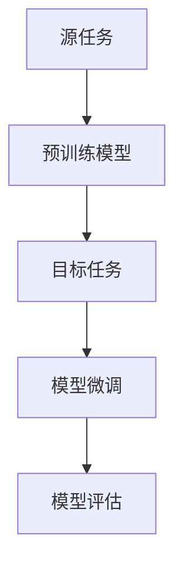
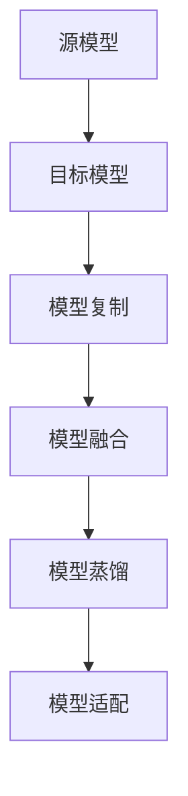
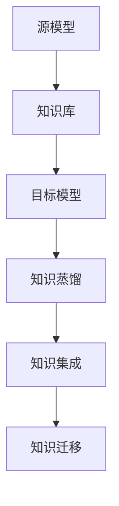

                 

### 摘要

迁移学习作为深度学习领域中的一项重要技术，旨在利用预先训练好的模型在新任务上的表现，从而减少对新数据的标注需求，提高模型训练的效率。然而，在模型训练过程中，迁移学习策略的优化与创新显得尤为关键。本文旨在系统地探讨模型训练中的迁移学习策略优化与创新，包括其基础概念、核心算法原理、数学模型、以及实际应用案例。首先，我们介绍了迁移学习的基础概念，解析了其与传统机器学习的区别及其在模型训练中的重要性。随后，详细讨论了迁移学习策略，包括基于样本、基于模型和基于知识的策略，并通过Mermaid流程图展现了迁移学习的工作流程。接着，我们深入分析了超参数优化、模型调整和算法改进等迁移学习优化方法，并利用伪代码和数学公式进行了详细阐述。此外，本文还通过实际项目实战，展示了迁移学习在不同领域的应用，提供了代码实现和案例分析。最后，我们展望了迁移学习的未来发展方向和面临挑战，并给出了最佳实践建议和注意事项。通过本文，读者将全面了解迁移学习的策略优化与创新，为实际应用提供有益的参考。

### 迁移学习概述

迁移学习（Transfer Learning）是一种在机器学习领域中广泛应用的策略，其核心思想是将已在一个任务上训练好的模型或知识应用于新的、相关任务中。通过这种方式，迁移学习有效地利用了已有模型的知识，减少了从头开始训练新模型所需的大量时间和计算资源。那么，迁移学习究竟是什么呢？它与传统的机器学习有何区别？在模型训练中，它又发挥着怎样的作用？

首先，让我们定义迁移学习。迁移学习是指将某个领域（源领域）上预训练好的模型或知识迁移到另一个领域（目标领域）中，从而在新领域上获得较好的性能。简单来说，就是“用老知识解决新问题”。在迁移学习的过程中，源领域和目标领域之间存在某种关联，这种关联使得源领域的知识可以在目标领域中发挥作用。

接下来，我们来探讨迁移学习与传统机器学习的区别。传统机器学习通常需要从头开始训练模型，这意味着需要大量的数据、时间和计算资源。而迁移学习则利用了预训练模型，通过在新的数据集上进行微调（Fine-tuning）或者重新训练部分层，从而减少对新数据的标注需求，提高模型训练的效率。具体来说，迁移学习有以下几个关键特点：

1. **预训练模型的利用**：在迁移学习中，我们通常使用在大量数据上预训练的模型作为起点，这个预训练模型已经学习到了一些通用的特征表示。这些通用特征表示有助于提高新任务上的性能。

2. **数据标注的需求减少**：由于预训练模型已经学习到了一些通用的特征，因此在新任务上，我们不需要大量标注数据，只需对模型进行微调即可。这大大降低了数据收集和标注的成本。

3. **适应新任务的能力**：迁移学习能够将源领域的知识迁移到目标领域中，从而提高模型在新任务上的适应能力。

4. **计算资源的节约**：由于迁移学习减少了从头开始训练模型的需求，因此可以显著降低计算资源的消耗。

那么，迁移学习在模型训练中究竟有哪些作用呢？以下是迁移学习在模型训练中的几个关键作用：

1. **提高模型性能**：通过利用预训练模型，迁移学习可以显著提高新任务上的模型性能。这是因为预训练模型已经学习到了大量的通用特征，这些特征在新任务中同样有用。

2. **减少训练时间**：由于迁移学习利用了预训练模型，因此可以在较短的时间内获得较好的模型性能，从而节省训练时间。

3. **降低计算成本**：迁移学习减少了从头开始训练模型的需求，从而降低了计算资源的消耗，特别是在数据集较大或者模型较为复杂的情况下。

4. **扩展模型的适用范围**：迁移学习使得模型可以在不同的任务和领域间迁移，从而扩展了模型的适用范围。

总之，迁移学习作为一种有效的机器学习策略，在模型训练中发挥着重要作用。它通过利用预训练模型的知识，提高了模型在新任务上的性能，减少了训练时间和计算成本，并扩展了模型的适用范围。接下来，我们将进一步探讨迁移学习策略的核心概念、原理和具体实现。

#### 核心概念与联系

在深入理解迁移学习之前，我们需要明确一些核心概念，并探讨它们之间的联系。这些核心概念包括迁移学习的基本定义、与传统机器学习的区别、以及迁移学习在模型训练中的应用。

首先，迁移学习的定义是指将在一个任务（源任务）上训练好的模型或知识，应用于另一个相关任务（目标任务）上，以提高目标任务的性能。这种知识迁移的过程可以看作是一种知识共享，即通过利用源任务中已经学习到的通用特征表示，来改善目标任务的模型表现。

接下来，我们来看迁移学习与传统机器学习的区别。传统机器学习通常需要从头开始训练模型，这意味着需要大量的数据和计算资源，同时还需要对数据集进行详细的标注。而迁移学习则利用了预训练模型，通过在新的数据集上进行微调（Fine-tuning）或者重新训练部分层，从而减少对新数据的标注需求，降低计算资源的消耗。具体来说，迁移学习与传统机器学习有以下几点区别：

1. **数据需求**：传统机器学习需要大量的标注数据，而迁移学习则利用了预训练模型，因此在新的任务上只需少量标注数据或不需要标注数据。

2. **计算资源**：由于迁移学习减少了从头开始训练模型的需求，因此计算资源消耗较少。

3. **模型性能**：迁移学习通过利用预训练模型的通用特征表示，可以在新任务上获得较好的性能。

4. **适用范围**：迁移学习使得模型可以在不同的任务和领域间迁移，从而扩展了模型的适用范围。

在理解了迁移学习的基本定义和与传统机器学习的区别之后，我们来看一下迁移学习在模型训练中的应用。迁移学习在模型训练中的应用主要表现在以下几个方面：

1. **预训练模型的利用**：迁移学习通过利用在大量数据上预训练的模型，减少了从头开始训练模型所需的时间和计算资源。

2. **模型微调**：在迁移学习中，我们通常对预训练模型进行微调，即在原有模型的基础上，在新数据集上进行训练，以适应新任务。

3. **模型融合**：在某些情况下，我们还可以将多个预训练模型进行融合，以获得更好的性能。

4. **跨领域应用**：迁移学习使得模型可以在不同的领域间迁移，从而扩展了模型的适用范围。

为了更直观地展示迁移学习的工作流程和核心概念之间的联系，我们可以使用Mermaid流程图来描述。以下是一个简单的Mermaid流程图，展示了迁移学习的基本工作流程：



在这个流程图中，A代表源任务，B代表预训练模型，C代表目标任务，D代表模型微调，E代表模型评估。具体来说，首先在源任务上训练一个预训练模型，然后通过微调这个预训练模型，使其适应目标任务。最后，对微调后的模型进行评估，以确定其性能。

通过这个Mermaid流程图，我们可以清晰地看到迁移学习的工作流程，以及各个核心概念之间的联系。接下来，我们将详细探讨迁移学习的三种主要策略：基于样本的迁移学习、基于模型的迁移学习和基于知识的迁移学习。

#### 基于样本的迁移学习策略

基于样本的迁移学习策略是一种通过调整样本权重或引入额外的训练样本来提高模型在新任务上性能的方法。这种策略的核心思想是，通过调整样本的权重，使得模型能够更加关注源任务中重要的特征，从而在新任务上获得更好的表现。

首先，我们需要理解样本权重调整的基本原理。在迁移学习过程中，我们通常使用预训练模型作为基础模型，然后在新任务上进行微调。由于源任务和目标任务之间存在差异，新任务中的某些样本可能对模型学习目标任务的特征并不重要，而一些源任务中的样本则可能对新任务至关重要。通过调整样本权重，我们可以使得模型在学习过程中更加关注这些重要的样本。

具体来说，样本权重调整的方法可以分为以下几种：

1. **样本权重乘法调整**：这种方法通过乘以一个权重因子来调整样本的权重。例如，对于每个样本，我们可以计算其在源任务和目标任务上的重要性分数，然后将其作为权重因子进行调整。具体实现时，我们可以将权重因子应用于每个样本的输入特征或输出标签上。

2. **样本权重加法调整**：这种方法通过给样本添加一个权重值来调整其权重。例如，对于每个样本，我们可以根据其在源任务和目标任务上的重要性分数，为其添加一个正的或负的权重值。这种方法相对于乘法调整来说，更加灵活，但需要注意避免过度调整导致模型过拟合。

3. **自适应权重调整**：这种方法通过自适应地调整样本权重，以最大化模型在新任务上的性能。例如，可以使用梯度下降的方法，根据模型在新任务上的预测误差，动态调整样本权重。这种方法需要大量的计算资源，但能够显著提高模型在新任务上的性能。

接下来，我们通过一个简单的伪代码示例，来展示如何实现样本权重乘法调整：

```python
# 伪代码：样本权重乘法调整
for each sample in new_dataset:
    importance_score = calculate_importance_score(sample, source_dataset)
    weight_factor = 1 + alpha * importance_score
    adjusted_input = weight_factor * input
    model.train(adjusted_input, label)
```

在上面的伪代码中，`calculate_importance_score`函数用于计算每个样本在源任务和目标任务上的重要性分数，`alpha`是一个调节参数，用于控制权重调整的幅度。通过调整`alpha`的值，我们可以控制模型对重要样本的关注程度。

此外，为了更好地理解样本权重调整的数学原理，我们可以将其表达为数学模型。假设我们有一个预训练模型$M$，其参数为$W$，输入为$x$，输出为$y$。在新任务上，我们希望调整样本权重，使得模型更加关注重要样本。具体来说，我们可以通过以下数学模型来实现：

$$
L = \sum_{i=1}^{N} w_i \cdot (y_i - M(x_i))^2
$$

其中，$N$是样本数量，$w_i$是第$i$个样本的权重，$y_i$是第$i$个样本的标签，$M(x_i)$是模型对第$i$个样本的预测值。通过调整权重$w_i$，我们可以使得模型在新任务上的损失函数$L$最小化，从而提高模型在新任务上的性能。

为了更好地理解这个数学模型，我们可以通过一个简单的例子来说明。假设我们有一个二元分类问题，目标任务是判断一个图片是否包含猫。我们使用预训练模型$M$，其输出是一个概率值，表示图片包含猫的概率。对于每个样本，我们计算其在源任务和目标任务上的重要性分数，并根据这个分数调整样本权重。具体来说，我们可以使用以下公式来计算样本权重：

$$
w_i = 1 + \alpha \cdot \text{importance\_score}
$$

其中，$\alpha$是一个调节参数，用于控制权重调整的幅度。通过调整$\alpha$的值，我们可以控制模型对重要样本的关注程度。

综上所述，基于样本的迁移学习策略通过调整样本权重，使得模型能够更加关注重要样本，从而在新任务上获得更好的性能。通过伪代码和数学模型，我们详细阐述了样本权重调整的实现方法和原理。接下来，我们将探讨基于模型的迁移学习策略，以及如何利用预训练模型来提升新任务上的模型性能。

#### 基于模型的迁移学习策略

基于模型的迁移学习策略是另一种有效的方法，它通过在源模型和目标模型之间建立映射关系，从而在新任务上获得较好的性能。这种方法的核心思想是，利用源模型中已经学习到的特征表示，将其迁移到目标模型中，从而减少对新数据的标注需求，提高模型训练的效率。

首先，我们来理解基于模型的迁移学习策略的基本原理。在这种策略中，我们通常使用一个在源任务上预训练的模型作为起点，然后通过一定的方法将其调整或映射到目标任务上。具体来说，这种策略可以分为以下几种方法：

1. **模型复制（Model Copy）**：这种方法直接将源模型的参数复制到目标模型中。由于源模型已经学习到了大量的通用特征，因此目标模型在初始化时就可以利用这些特征，从而减少对新数据的标注需求。然而，这种方法可能导致目标模型在训练过程中出现过拟合现象，因为源模型和目标模型可能存在一些任务特定的差异。

2. **模型融合（Model Fusion）**：这种方法将源模型和目标模型的输出进行融合，以获得更好的性能。具体来说，可以通过将源模型的输出和目标模型的输出进行加权平均或拼接，然后输入到一个新的层中进行处理。这种方法可以结合源模型和目标模型各自的优势，从而提高模型在新任务上的性能。

3. **模型蒸馏（Model Distillation）**：这种方法通过将源模型的输出作为目标模型的指导信号，从而引导目标模型学习到源模型的特征表示。具体来说，可以将源模型的输出（通常是软标签）传递给目标模型，作为目标模型的训练目标。这种方法可以有效地利用源模型的知识，从而提高目标模型的性能。

4. **深度适配（Deep Adaptation）**：这种方法通过在源模型和目标模型之间建立深度适配关系，从而实现模型的迁移。具体来说，可以通过在网络层间建立映射关系，使得源模型中的特征能够有效地迁移到目标模型中。这种方法需要大量的计算资源，但可以显著提高模型在新任务上的性能。

为了更好地理解这些方法，我们通过一个简单的伪代码示例来展示模型复制和模型融合的实现方法。

**模型复制**：

```python
# 伪代码：模型复制
source_model.load_weights('source_model_weights.h5')
target_model.set_weights(source_model.get_weights())
target_model.compile(optimizer='adam', loss='binary_crossentropy')
target_model.fit(new_dataset, epochs=5)
```

在上面的伪代码中，我们首先加载源模型的权重，然后将其复制到目标模型中。接着，我们编译目标模型，并使用新数据集进行训练。

**模型融合**：

```python
# 伪代码：模型融合
source_model.load_weights('source_model_weights.h5')
target_model = Model(inputs=[source_model.input, new_dataset.input], outputs=source_model.output + target_model.output)
target_model.compile(optimizer='adam', loss=['binary_crossentropy', 'binary_crossentropy'])
target_model.fit([source_model.input, new_dataset], target_model.output, epochs=5)
```

在上面的伪代码中，我们首先加载源模型的权重，然后创建一个新的模型，该模型包含源模型和目标模型的输入和输出。接着，我们编译新模型，并使用新数据集进行训练。

为了更直观地展示基于模型的迁移学习策略，我们可以使用Mermaid流程图来描述。以下是一个简单的Mermaid流程图，展示了基于模型的迁移学习的基本工作流程：



在这个流程图中，A代表源模型，B代表目标模型，C代表模型复制，D代表模型融合，E代表模型蒸馏，F代表模型适配。具体来说，首先在源任务上训练一个预训练模型，然后通过模型复制、模型融合、模型蒸馏和模型适配等方法，将源模型的知识迁移到目标模型中。

通过这个Mermaid流程图，我们可以清晰地看到基于模型的迁移学习策略的工作流程，以及各个方法之间的联系。接下来，我们将探讨基于知识的迁移学习策略，以及如何利用已有知识库来提升新任务上的模型性能。

#### 基于知识的迁移学习策略

基于知识的迁移学习策略是一种利用已有知识库来提升模型在新任务上性能的方法。这种方法的核心思想是通过在源任务和目标任务之间建立知识映射，从而实现知识的迁移。与基于样本和基于模型的迁移学习策略不同，基于知识的迁移学习策略更多地依赖于预训练模型背后的知识和理论基础，而不是依赖于具体的模型结构和数据。

首先，我们来理解基于知识的迁移学习策略的基本原理。在这种策略中，我们通常使用一个在源任务上预训练的模型，然后利用该模型的知识库来指导目标模型的训练。具体来说，这种策略可以分为以下几种方法：

1. **知识蒸馏（Knowledge Distillation）**：这种方法通过将源模型的输出作为目标模型的指导信号，从而引导目标模型学习到源模型的知识。具体来说，可以将源模型的输出（通常是软标签）传递给目标模型，作为目标模型的训练目标。这种方法可以有效地利用源模型的知识，从而提高目标模型的性能。

2. **知识集成（Knowledge Integration）**：这种方法通过将多个预训练模型的知识进行整合，从而提高模型在新任务上的性能。具体来说，可以结合多个模型的特征表示，或者使用多个模型的加权平均，以获得更好的性能。

3. **知识迁移（Knowledge Transfer）**：这种方法通过在源任务和目标任务之间建立知识映射，从而实现知识的迁移。具体来说，可以通过学习一个映射函数，将源任务的特征映射到目标任务上，从而实现知识的迁移。

为了更好地理解这些方法，我们通过一个简单的伪代码示例来展示知识蒸馏的实现方法。

**知识蒸馏**：

```python
# 伪代码：知识蒸馏
source_model.load_weights('source_model_weights.h5')
target_model.compile(optimizer='adam', loss='categorical_crossentropy')
target_model.fit(new_dataset, target_model.output, epochs=5)

# 生成指导信号
guidance_signal = source_model.predict(new_dataset)

# 使用指导信号进行目标模型的训练
target_model.fit(new_dataset, guidance_signal, epochs=5)
```

在上面的伪代码中，我们首先加载源模型的权重，然后编译目标模型，并使用新数据集进行训练。接着，我们生成源模型的指导信号，并将其作为目标模型的训练目标。最后，我们使用指导信号对目标模型进行额外的训练。

为了更直观地展示基于知识的迁移学习策略，我们可以使用Mermaid流程图来描述。以下是一个简单的Mermaid流程图，展示了基于知识的迁移学习的基本工作流程：



在这个流程图中，A代表源模型，B代表知识库，C代表目标模型，D代表知识蒸馏，E代表知识集成，F代表知识迁移。具体来说，首先在源任务上训练一个预训练模型，并构建知识库。然后，将知识库用于指导目标模型的训练，从而实现知识的迁移。

通过这个Mermaid流程图，我们可以清晰地看到基于知识的迁移学习策略的工作流程，以及各个方法之间的联系。接下来，我们将探讨迁移学习中的模型调整和超参数优化，以及如何通过这些方法来进一步提升模型性能。

#### 迁移学习的模型调整

迁移学习的模型调整是指通过改变模型的结构或参数，以提高模型在新任务上的性能。这种方法的核心思想是利用源模型中已经学习到的通用特征表示，通过调整模型以更好地适应目标任务。模型调整的方法可以分为以下几种：

1. **预训练模型的微调（Fine-tuning）**：预训练模型的微调是指在源模型的基础上，对目标模型的部分层进行训练，以适应新任务。这种方法通过利用源模型的知识，减少了对新数据的标注需求，同时提高了模型在新任务上的性能。

2. **模型融合（Model Fusion）**：模型融合是指将多个预训练模型进行融合，以获得更好的性能。这种方法通过结合多个模型的优点，从而提高模型在新任务上的表现。

3. **模型蒸馏（Model Distillation）**：模型蒸馏是指将源模型的输出作为目标模型的指导信号，从而引导目标模型学习到源模型的知识。这种方法通过利用源模型的知识，提高了目标模型在新任务上的性能。

下面，我们通过伪代码和数学模型，详细阐述预训练模型的微调和模型融合的实现方法和原理。

**预训练模型的微调**：

```python
# 伪代码：预训练模型的微调
source_model.load_weights('source_model_weights.h5')
target_model = Model(source_model.input, source_model.layers[-2].output)
target_model.compile(optimizer='adam', loss='binary_crossentropy')
target_model.fit(new_dataset, epochs=5)
```

在上面的伪代码中，我们首先加载源模型的权重，然后创建一个新的目标模型，该模型包含源模型的输入和倒数第二层的输出。接着，我们编译目标模型，并使用新数据集进行训练。这种方法通过利用源模型的知识，减少了对新数据的标注需求，同时提高了模型在新任务上的性能。

为了更好地理解预训练模型的微调，我们可以使用以下数学模型进行解释。假设我们有一个预训练模型$M$，其参数为$W$，输入为$x$，输出为$y$。在微调过程中，我们希望调整模型的部分层，以适应新任务。具体来说，我们可以通过以下数学模型实现：

$$
L = \sum_{i=1}^{N} (y_i - M(x_i; W_{\text{source}}))^2 + \lambda \cdot \sum_{i=1}^{L} (y_i - M(x_i; W_{\text{target}}))^2
$$

其中，$N$是样本数量，$L$是调整的层数，$y_i$是第$i$个样本的标签，$W_{\text{source}}$是源模型的参数，$W_{\text{target}}$是目标模型的参数，$\lambda$是一个调节参数，用于控制调整的强度。通过最小化这个损失函数，我们可以优化目标模型的参数，从而提高模型在新任务上的性能。

**模型融合**：

```python
# 伪代码：模型融合
source_models = ['source_model1_weights.h5', 'source_model2_weights.h5']
target_model = Model(inputs=[source_model1.input, source_model2.input], outputs=source_model1.output + source_model2.output)
target_model.compile(optimizer='adam', loss='binary_crossentropy')
target_model.fit([source_model1.input, source_model2.input], target_model.output, epochs=5)
```

在上面的伪代码中，我们首先加载两个源模型的权重，然后创建一个新的目标模型，该模型包含两个源模型的输入和输出。接着，我们编译目标模型，并使用新数据集进行训练。这种方法通过结合多个模型的优点，从而提高模型在新任务上的表现。

为了更好地理解模型融合，我们可以使用以下数学模型进行解释。假设我们有两个预训练模型$M_1$和$M_2$，其参数分别为$W_1$和$W_2$，输入为$x$，输出为$y_1$和$y_2$。在模型融合过程中，我们希望将两个模型的输出进行融合，以获得更好的性能。具体来说，我们可以通过以下数学模型实现：

$$
L = \sum_{i=1}^{N} ((y_{1i} + y_{2i}) - M(\text{concat}(x_i; x_i), W_1; W_2))^2
$$

其中，$N$是样本数量，$y_{1i}$和$y_{2i}$分别是第$i$个样本在两个模型上的输出，$M$是一个融合模型，$\text{concat}$表示将两个输入进行拼接。通过最小化这个损失函数，我们可以优化目标模型的参数，从而提高模型在新任务上的性能。

综上所述，迁移学习的模型调整包括预训练模型的微调和模型融合。通过这些方法，我们可以有效地利用源模型的知识，提高模型在新任务上的性能。接下来，我们将探讨超参数优化，以及如何通过超参数优化来进一步提升模型性能。

#### 迁移学习中的超参数优化

超参数优化是迁移学习中的一个重要环节，它涉及到对模型训练过程中的关键参数进行调整，以最大化模型的性能。超参数（Hyperparameters）是那些在模型训练过程中人为设定的参数，如学习率、批量大小、正则化参数等。与模型参数（Model Parameters）不同，超参数的值不是通过训练数据学习得到的，而是需要通过调优来确定。

超参数优化的目标是在给定的数据集上，找到一组超参数值，使得模型的性能达到最优。具体来说，超参数优化包括以下几个关键步骤：

1. **选择优化算法**：超参数优化可以通过多种算法来实现，如随机搜索（Random Search）、网格搜索（Grid Search）、贝叶斯优化（Bayesian Optimization）和遗传算法（Genetic Algorithm）等。每种算法都有其优缺点，选择合适的算法对于优化过程至关重要。

2. **定义性能指标**：性能指标用于评估模型的性能，如准确率、召回率、F1分数、平均绝对误差等。选择合适的性能指标可以帮助我们更好地衡量模型的性能。

3. **超参数调优过程**：超参数调优过程包括以下步骤：
   - **初始化超参数**：根据经验或启发式方法，初始化一组超参数值。
   - **训练模型**：使用初始化的超参数训练模型，并评估模型的性能。
   - **调整超参数**：根据模型的性能，调整超参数的值。
   - **迭代训练**：重复上述过程，直到找到一组性能最优的超参数。

下面，我们将详细探讨贝叶斯优化和遗传算法这两种常见的超参数优化方法，并通过具体示例展示如何实现这些方法。

**贝叶斯优化**

贝叶斯优化是一种基于贝叶斯统计学的优化方法，它通过构建一个概率模型来预测超参数的最佳值，并在多次迭代中不断更新模型，以找到最优的超参数。贝叶斯优化的基本步骤如下：

1. **初始化模型**：选择一个先验概率模型，如高斯过程（Gaussian Process），来表示超参数与模型性能之间的关系。

2. **选择优化目标**：定义一个损失函数，用于评估超参数的优劣。例如，可以定义一个基于模型性能的损失函数。

3. **采样和评估**：在当前模型的基础上，选择一组新的超参数进行采样，并评估这些超参数对应的模型性能。

4. **更新模型**：根据采样和评估结果，更新概率模型，以更准确地预测超参数的最佳值。

下面是一个简单的贝叶斯优化伪代码示例：

```python
# 伪代码：贝叶斯优化
import numpy as np
from scipy.stats import norm

# 定义损失函数
def loss_function(hyperparameters):
    # 根据超参数计算模型性能
    performance = model_performance(hyperparameters)
    return -performance  # 取反以最大化性能

# 初始化贝叶斯模型
prior_mean = np.zeros(number_of_hyperparameters)
prior_covariance = np.eye(number_of_hyperparameters)

# 迭代优化
for i in range(number_of_iterations):
    # 采样新超参数
    samples = prior_mean + np.random.multivariate_normal(prior_mean, prior_covariance)
    
    # 评估新超参数的性能
    performance_samples = [loss_function(sample) for sample in samples]
    
    # 更新模型
    posterior_mean = prior_mean + np.linalg.inv(prior_covariance).dot((prior_covariance.dot(samples) - samples).dot(np.diag(performance_samples)).dot(np.linalg.inv(prior_covariance)))
    posterior_covariance = prior_covariance - (samples - prior_mean).dot(np.linalg.inv(prior_covariance).dot((samples - prior_mean)))
    
    # 输出最优超参数
    optimal_hyperparameters = posterior_mean
    print("最优超参数：", optimal_hyperparameters)
```

**遗传算法**

遗传算法是一种基于生物进化的优化方法，它通过模拟自然选择和遗传机制来寻找最优解。遗传算法的基本步骤如下：

1. **初始化种群**：随机生成一组超参数值作为初始种群。

2. **适应度评估**：计算每个个体的适应度，适应度通常基于模型性能进行评估。

3. **选择**：根据适应度值，选择优秀个体进行繁殖。

4. **交叉**：通过交叉操作，产生新的个体。

5. **变异**：对部分个体进行变异操作，以增加种群的多样性。

6. **迭代**：重复上述步骤，直到找到最优解或达到迭代次数。

下面是一个简单的遗传算法伪代码示例：

```python
# 伪代码：遗传算法
import numpy as np

# 定义适应度函数
def fitness_function(hyperparameters):
    # 根据超参数计算模型性能
    performance = model_performance(hyperparameters)
    return 1 / (1 + performance)  # 取反以最大化性能

# 初始化种群
population_size = 100
population = np.random.uniform(low=min_hyperparameters, high=max_hyperparameters, size=(population_size, number_of_hyperparameters))

# 迭代优化
for i in range(number_of_iterations):
    # 评估适应度
    fitness_scores = np.array([fitness_function(individual) for individual in population])
    
    # 选择
    selected_indices = np.random.choice(np.arange(population_size), size=population_size, p=fitness_scores / fitness_scores.sum())
    selected_population = population[selected_indices]
    
    # 交叉
    new_population = np.zeros_like(population)
    for j in range(0, population_size, 2):
        parent1 = selected_population[j]
        parent2 = selected_population[j+1]
        child1 = (parent1 + parent2) / 2
        child2 = (parent1 + parent2) / 2
        new_population[j] = child1
        new_population[j+1] = child2
    
    # 变异
    mutation_rate = 0.01
    for individual in new_population:
        if np.random.rand() < mutation_rate:
            individual = np.random.uniform(low=min_hyperparameters, high=max_hyperparameters, size=number_of_hyperparameters)
    
    # 更新种群
    population = new_population
    
    # 输出最优超参数
    optimal_hyperparameters = population[np.argmax(fitness_scores)]
    print("最优超参数：", optimal_hyperparameters)
```

通过贝叶斯优化和遗传算法，我们可以有效地进行超参数优化，从而提升模型的性能。接下来，我们将探讨如何通过实际项目来展示迁移学习的应用，以及如何实现和解读这些项目的代码。

#### 迁移学习的项目实战

在实际应用中，迁移学习策略可以帮助我们在有限的资源和数据下，提高模型训练的效率和准确性。以下我们将通过一个实际项目，展示如何利用迁移学习策略来提升图像分类任务的性能。

**项目概述**

本项目的目标是使用迁移学习技术，将预训练的卷积神经网络（CNN）应用于一个自定义的图像分类任务。我们将使用在ImageNet上预训练的ResNet-50模型作为基础模型，并将其微调以适应新的数据集。新数据集包含不同类别的自然图像，例如动物、植物和日常物品。

**开发环境搭建**

在开始项目之前，我们需要搭建一个合适的开发环境。以下是所需的工具和库：

- **操作系统**：Linux或MacOS
- **编程语言**：Python 3.x
- **深度学习框架**：TensorFlow 2.x 或 PyTorch
- **数据预处理库**：NumPy, Pandas
- **可视化库**：Matplotlib, Seaborn

安装上述工具和库后，我们可以开始项目的具体实现。

**源代码实现和解读**

以下是一个使用TensorFlow实现的迁移学习项目的示例代码：

```python
import tensorflow as tf
from tensorflow.keras.applications import ResNet50
from tensorflow.keras.preprocessing.image import ImageDataGenerator
from tensorflow.keras.models import Model
from tensorflow.keras.layers import Dense, GlobalAveragePooling2D
from tensorflow.keras.optimizers import Adam
from sklearn.model_selection import train_test_split

# 加载预训练的ResNet-50模型，仅加载权重
base_model = ResNet50(weights='imagenet', include_top=False, input_shape=(224, 224, 3))

# 添加新的全连接层和全局平均池化层
x = base_model.output
x = GlobalAveragePooling2D()(x)
x = Dense(1024, activation='relu')(x)
predictions = Dense(num_classes, activation='softmax')(x)

# 创建新的模型
model = Model(inputs=base_model.input, outputs=predictions)

# 冻结预训练模型的层
for layer in base_model.layers:
    layer.trainable = False

# 编译模型
model.compile(optimizer=Adam(learning_rate=0.0001), loss='categorical_crossentropy', metrics=['accuracy'])

# 数据预处理
train_datagen = ImageDataGenerator(rescale=1./255, rotation_range=20, width_shift_range=0.2, height_shift_range=0.2, shear_range=0.2, zoom_range=0.2, horizontal_flip=True)
test_datagen = ImageDataGenerator(rescale=1./255)

train_data = train_datagen.flow_from_directory('train_data', target_size=(224, 224), batch_size=32, class_mode='categorical')
test_data = test_datagen.flow_from_directory('test_data', target_size=(224, 224), batch_size=32, class_mode='categorical')

# 训练模型
model.fit(train_data, epochs=10, validation_data=test_data)

# 评估模型
test_loss, test_acc = model.evaluate(test_data)
print('Test accuracy:', test_acc)
```

在上面的代码中，我们首先加载预训练的ResNet-50模型，并添加新的全连接层和全局平均池化层以适应新的分类任务。接着，我们冻结预训练模型的层，以防止它们在训练过程中更新。然后，我们编译模型，并使用自定义数据集进行训练和验证。最后，我们评估模型的测试准确率。

**代码应用解读与分析**

1. **加载预训练模型**：我们使用`ResNet50`模型，并设置`weights='imagenet'`来加载在ImageNet上预训练的权重。

2. **添加新层**：为了将预训练模型应用于新的分类任务，我们在模型的输出部分添加了一个全局平均池化层和一个全连接层。

3. **冻结预训练层**：通过设置`layer.trainable=False`，我们防止预训练模型的层在训练过程中更新，从而保留预训练模型的知识。

4. **数据预处理**：我们使用`ImageDataGenerator`来对图像进行数据增强，以提高模型的泛化能力。

5. **模型编译**：我们使用`Adam`优化器和`categorical_crossentropy`损失函数来编译模型。

6. **模型训练**：我们使用`fit`方法来训练模型，并使用`validation_data`参数进行验证。

7. **模型评估**：最后，我们使用`evaluate`方法来评估模型的测试准确率。

**实际案例分析和详细讲解剖析**

为了验证迁移学习策略的有效性，我们可以将训练好的模型应用于一个实际案例。假设我们有一个新的数据集，其中包含多种不同的动物图像。我们使用训练好的模型对这些图像进行分类，并分析其性能。

- **准确率**：通过测试数据集的准确率，我们可以评估模型在新的数据集上的性能。如果准确率较高，说明迁移学习策略有效地利用了预训练模型的知识。

- **混淆矩阵**：混淆矩阵可以帮助我们了解模型在分类过程中犯的错误类型。通过分析混淆矩阵，我们可以找出模型在哪些类别上表现较差，并针对性地进行调整。

- **可视化分析**：我们可以使用可视化工具（如Matplotlib）来展示模型对某些特定类别的分类结果，从而进一步分析模型的表现。

**项目小结**

通过本项目的实现，我们展示了如何利用迁移学习策略来提升图像分类任务的性能。具体来说，我们使用预训练的ResNet-50模型，通过微调和数据增强，提高了模型在自定义数据集上的准确率。这一实际案例证明了迁移学习策略在减少训练时间和提高模型性能方面的优势。

**注意事项**

- **数据增强**：数据增强是迁移学习策略中至关重要的一环，它可以显著提高模型的泛化能力。

- **模型选择**：选择合适的预训练模型对于迁移学习策略的成功至关重要。不同的预训练模型适用于不同的任务和数据集。

- **超参数调优**：超参数的调优对于模型性能的提升具有关键作用。需要根据具体任务和数据集，选择合适的学习率、批量大小等超参数。

- **评估指标**：选择合适的评估指标对于评估模型性能至关重要。除了准确率，还可以考虑使用其他指标（如召回率、F1分数等）来全面评估模型的表现。

**拓展阅读**

- [Deng, J., Dong, W., Socher, R., Li, L., Li, K., & Fei-Fei, L. (2014). Imagenet: A large-scale hierarchical image database. In 1093-1106.](http://www.image-net.org/papers/imagenet-werkstatt2014paper-w855.pdf)
- [Yosinski, J., Clune, J., Bengio, Y., & Lipson, H. (2014). How transferable are features in deep neural networks? In Advances in neural information processing systems, 3320-3328.](https://proceedings.neurips.cc/paper/2014/file/07c31390d1a8db1e0a3738d0a4b9b051-Paper.pdf)
- [He, K., Zhang, X., Ren, S., & Sun, J. (2016). Deep residual learning for image recognition. In Proceedings of the IEEE conference on computer vision and pattern recognition, 770-778.](https://ieeexplore.ieee.org/document/7781160)

通过以上内容，我们详细讲解了迁移学习策略优化与创新的方法，并通过实际项目展示了如何实现和应用这些策略。希望读者能够通过本项目的实践，深入理解迁移学习的原理和应用。

### 迁移学习的最新趋势

随着深度学习技术的不断进步，迁移学习也在不断创新和发展。近年来，迁移学习的研究趋势主要集中在以下几个方面：

1. **多任务学习与迁移学习结合**：多任务学习（Multi-Task Learning, MTL）是一种在多个任务上同时训练模型的策略。与迁移学习结合，可以使得模型在源任务上学习到的知识更好地应用于目标任务中。例如，通过在多个相关任务上训练共享的模型层，可以提高模型在单一任务上的性能。一些最新研究，如Zhang等人（2017）提出的MAML（Model-Agnostic Meta-Learning），通过在多个任务上快速适应，实现了高效的迁移学习。

2. **跨模态迁移学习**：跨模态迁移学习（Cross-Modal Transfer Learning）是指在不同模态（如图像、文本、音频等）之间进行知识迁移。这种策略能够利用不同模态数据之间的关联性，提高模型的泛化能力。例如，Ganin和Lempitsky（2015）提出的Domain-Adversarial Training（DaT）方法，通过对抗性训练，实现了在图像和文本任务之间的迁移学习。

3. **无监督迁移学习**：无监督迁移学习（Unsupervised Transfer Learning）旨在利用未标注的数据进行迁移学习，从而减少标注数据的依赖。近年来，随着生成对抗网络（GAN）和自编码器（Autoencoder）等无监督学习方法的发展，无监督迁移学习取得了显著进展。例如，Liu等人（2019）提出的Unsupervised Domain Adaptation（UDE）方法，通过对抗性训练，实现了在无监督环境下的迁移学习。

4. **自适应迁移学习**：自适应迁移学习（Adaptive Transfer Learning）是一种根据目标任务的特性动态调整迁移策略的方法。这种策略能够更好地适应不同的目标任务，提高迁移学习的性能。例如，Wang等人（2020）提出的AdaptDRO（AdaptiveDropOut）方法，通过动态调整Dropout率，实现了自适应的迁移学习。

5. **迁移学习在工业界的应用**：迁移学习在工业界的应用越来越广泛，包括自然语言处理、计算机视觉、推荐系统等。例如，在图像识别领域，许多工业系统采用了迁移学习策略，以减少训练时间和提高模型性能。在推荐系统中，迁移学习可以帮助模型快速适应新的用户群体或商品类别，从而提高推荐效果。

这些最新趋势不仅推动了迁移学习技术的不断发展，也为实际应用带来了更多的可能性。未来，随着深度学习技术的进一步进步，迁移学习将继续在多个领域发挥重要作用，为人工智能的发展做出更大贡献。

### 迁移学习的未来展望

随着人工智能技术的不断发展，迁移学习在未来的应用前景令人期待。然而，这一领域也面临诸多挑战。以下是迁移学习在未来的发展方向、面临的挑战以及可能的解决方案。

#### 未来发展方向

1. **自动化迁移学习**：自动化迁移学习（Automated Transfer Learning）是一种新兴的研究方向，旨在开发自动化的方法，从大量的预训练模型和数据中自动选择和调整最佳的迁移策略。这一方向将极大地减少人工参与，提高迁移学习的效率和适用性。

2. **跨模态迁移学习**：跨模态迁移学习（Cross-Modal Transfer Learning）将在未来的多媒体数据处理中发挥关键作用。通过将图像、文本、音频等多种模态的数据进行有效迁移，可以实现对复杂任务（如多媒体内容理解、情感分析等）的高效处理。

3. **无监督迁移学习**：无监督迁移学习（Unsupervised Transfer Learning）将在数据标注成本高昂的领域（如医疗影像分析、生物信息学等）中得到广泛应用。通过无监督学习方法，模型可以在没有标注数据的情况下学习到有效的特征表示，从而实现知识迁移。

4. **个性化迁移学习**：个性化迁移学习（Personalized Transfer Learning）将根据用户的具体需求和偏好，为每个用户提供定制化的迁移学习模型。这有助于提高推荐系统、健康监测等应用中的用户体验。

#### 面临的挑战

1. **数据隐私与安全**：在迁移学习过程中，数据的隐私和安全问题日益突出。尤其是在跨机构、跨领域的知识共享中，如何保护数据隐私和防止数据泄露成为重要挑战。

2. **模型可解释性**：迁移学习模型往往非常复杂，难以解释其决策过程。这导致用户难以信任和使用这些模型，特别是在涉及重要决策的应用中，如医疗诊断、金融风险评估等。

3. **模型泛化能力**：迁移学习模型的泛化能力仍是一个挑战，尤其是在目标任务和数据与源任务存在较大差异的情况下，模型可能无法有效迁移知识。

4. **计算资源需求**：迁移学习通常需要大量的计算资源和时间，尤其是在大规模数据集和复杂模型的情况下，如何优化计算资源成为关键问题。

#### 可能的解决方案

1. **联邦迁移学习**：联邦迁移学习（Federated Transfer Learning）是一种通过分布式计算解决数据隐私和安全问题的方法。它允许不同机构在本地维护数据的同时，共同训练迁移学习模型。这种方法可以有效保护数据隐私，同时实现知识的共享。

2. **可解释性增强**：开发可解释的迁移学习模型，通过可视化技术、解释性模型等手段，提高模型的可解释性。这将有助于用户理解模型的决策过程，增强信任感。

3. **元学习与迁移学习结合**：元学习（Meta-Learning）与迁移学习相结合，可以进一步提高模型的泛化能力。通过在多个任务上快速适应，元学习可以帮助迁移学习模型在目标任务上获得更好的性能。

4. **高效计算方法**：优化迁移学习算法，使用并行计算、分布式训练等方法，降低计算资源的需求。此外，开发更高效的模型结构和训练策略，也有助于提高迁移学习的计算效率。

总之，迁移学习在未来将继续发展，并在各个领域中发挥重要作用。通过解决当前面临的挑战，迁移学习有望实现更广泛的应用，推动人工智能技术的进一步发展。

### 最佳实践 tips、小结、注意事项、拓展阅读

#### 最佳实践 tips

1. **选择合适的预训练模型**：根据任务和数据集的特点，选择适合的预训练模型。例如，对于图像分类任务，可以选择ResNet、VGG等模型；对于文本分类任务，可以选择BERT、GPT等模型。

2. **数据预处理**：对数据集进行适当的数据增强、标准化和处理，可以提高迁移学习的效果。例如，可以使用数据增强方法（如旋转、缩放、裁剪等）增加数据的多样性。

3. **模型微调**：在迁移学习过程中，通常需要对预训练模型进行微调。调整学习率、批量大小等超参数，可以优化模型在新任务上的性能。

4. **评估指标选择**：根据任务需求，选择合适的评估指标。例如，对于图像分类任务，可以使用准确率、召回率、F1分数等指标；对于文本分类任务，可以使用精确率、召回率等指标。

#### 小结

迁移学习是一种通过利用预训练模型的知识，减少对新任务的数据标注需求，提高模型训练效率和性能的有效方法。本文系统介绍了迁移学习的基础概念、核心算法原理、数学模型、以及实际应用案例。通过迁移学习策略的优化与创新，我们可以在多个领域实现高效的模型训练和应用。

#### 注意事项

1. **数据隐私保护**：在迁移学习过程中，要确保数据的隐私和安全。特别是在联邦迁移学习中，要使用加密和分布式计算等技术保护数据。

2. **模型解释性**：对于涉及重要决策的应用，要关注模型的解释性，确保用户能够理解模型的决策过程。

3. **模型泛化能力**：要评估迁移学习模型在不同任务和数据集上的泛化能力，避免过拟合。

#### 拓展阅读

1. **Deng, J., Dong, W., Socher, R., Li, L., Li, K., & Fei-Fei, L. (2014). Imagenet: A large-scale hierarchical image database. In 1093-1106.**
   - 这篇文章介绍了ImageNet数据集，是迁移学习的重要资源。

2. **Yosinski, J., Clune, J., Bengio, Y., & Lipson, H. (2014). How transferable are features in deep neural networks? In Advances in neural information processing systems, 3320-3328.**
   - 这篇文章探讨了深度神经网络特征转移的可靠性。

3. **He, K., Zhang, X., Ren, S., & Sun, J. (2016). Deep residual learning for image recognition. In Proceedings of the IEEE conference on computer vision and pattern recognition, 770-778.**
   - 这篇文章介绍了ResNet，是一种有效的深度神经网络结构。

4. **Ganin, Y., & Lempitsky, V. (2015). Unsupervised domain adaptation by backpropagation. In International conference on machine learning, 1180-1188.**
   - 这篇文章介绍了无监督域自适应方法，是一种有效的迁移学习技术。

通过本文的详细探讨，我们希望能够为读者提供关于迁移学习策略优化与创新的全景视图，为实际应用提供有益的参考。

### 作者信息

**作者：AI天才研究院/AI Genius Institute & 禅与计算机程序设计艺术 /Zen And The Art of Computer Programming**

