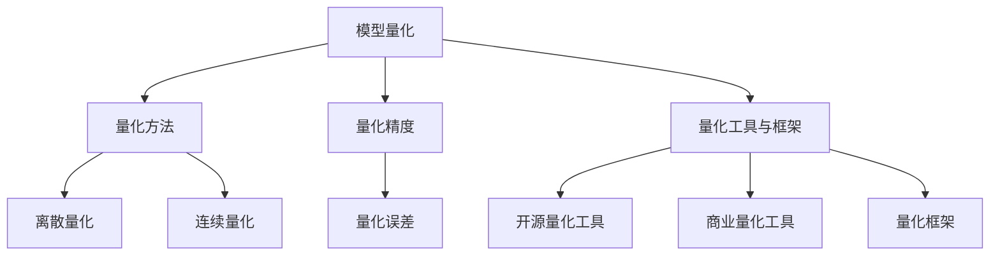

                 

### 文章标题：模型量化：在资源受限设备上部署AI

## 关键词：
AI模型量化、资源受限设备、部署优化、量化方法、性能评估

> 摘要：
本文深入探讨了模型量化技术，重点分析了其在资源受限设备上部署AI模型的重要性。通过详细的算法原理讲解、量化工具介绍以及实际项目案例分析，本文旨在帮助读者全面理解模型量化的全过程，从而在资源受限的环境中高效地部署AI模型。

---

### 第一部分：模型量化技术概述

#### 第1章：模型量化简介

##### 1.1 模型量化的定义与重要性
模型量化是机器学习模型优化中的重要环节，其核心目的是将原始的浮点模型转换为固定点模型，以减少模型的存储空间和计算资源消耗。这对于在资源受限的设备，如移动设备和物联网设备上部署AI模型尤为重要。

##### 1.2 模型量化在资源受限设备上的应用场景
在移动设备和物联网设备上，由于存储空间和计算资源有限，模型量化能够显著提高模型的运行效率和用户体验。例如，智能手机上的图像识别应用、智能家居设备上的语音识别功能等，都受益于模型量化技术。

##### 1.3 模型量化的基本流程
模型量化的基本流程包括量化策略选择、量化操作执行、量化误差分析以及量化结果验证。通过这些步骤，可以确保量化后的模型在保持性能的同时，达到资源优化的目标。

#### 第2章：模型量化方法

##### 2.1 量化方法分类
量化方法主要分为离散量化和连续量化两大类。离散量化通过将浮点数值映射到有限的整数范围内，从而实现模型的压缩和加速。连续量化则通过调整模型的参数，使其在量化后仍然能够保持较高的精度。

##### 2.2 离散量化与连续量化
离散量化通常具有较低的量化误差，但其量化范围较窄，可能影响模型的精度。连续量化则更灵活，但可能引入更多的量化误差。因此，在实际应用中，需要根据具体需求和场景选择合适的量化方法。

##### 2.3 不同量化方法的优缺点对比
不同量化方法在精度、计算复杂度、硬件适应性等方面存在差异。通过对比分析，可以更清晰地了解各种量化方法的适用场景和限制。

#### 第3章：量化精度与误差分析

##### 3.1 量化精度的影响因素
量化精度受到模型结构、量化方法、量化范围等多种因素的影响。通过深入分析这些因素，可以更好地理解量化精度如何影响模型性能。

##### 3.2 量化误差的类型与降低方法
量化误差主要包括截断误差、量化误差和舍入误差。通过采用不同的误差降低方法，如误差补偿、量化范围调整等，可以有效地减少量化误差对模型性能的影响。

##### 3.3 实际应用中的量化精度平衡
在实际应用中，需要在量化精度和资源消耗之间找到平衡点。通过实验和数据分析，可以确定最适合特定场景的量化精度和量化方法。

#### 第4章：量化工具与框架

##### 4.1 开源量化工具介绍
开源量化工具如TensorFlow Lite、PyTorch Quantization等，为模型量化提供了丰富的工具和库。这些工具支持多种量化方法，并且易于集成和使用。

##### 4.2 商业量化工具介绍
商业量化工具如Intel Movidius、NVIDIA TensorRT等，提供了更专业的量化解决方案。这些工具通常具有高效的量化算法和优化的硬件支持。

##### 4.3 常见量化框架的使用与配置
了解和掌握常见的量化框架的使用方法和配置技巧，是进行模型量化实践的基础。本文将介绍如何使用这些框架进行量化操作，并提供配置建议。

### 第二部分：量化算法原理与实现

#### 第5章：量化算法基础

##### 5.1 算术编码与量化
算术编码是量化算法的基础，通过将浮点数编码为整数序列，实现数值的压缩和表示。本文将介绍算术编码的基本原理和应用。

##### 5.2 感知量化算法
感知量化算法通过调整模型参数，使量化后的模型在保持性能的同时，降低量化误差。本文将详细讲解感知量化算法的原理和实现。

##### 5.3 高级量化算法
高级量化算法包括动态量化、自适应量化等，通过更复杂的量化策略，进一步提高模型的量化效率和性能。本文将探讨这些高级量化算法的原理和应用。

#### 第6章：量化算法优化

##### 6.1 量化算法优化策略
量化算法的优化包括量化策略的选择、量化范围的调整和量化误差的补偿等。本文将介绍如何通过优化策略提高量化算法的性能。

##### 6.2 量化算法在深度学习中的应用
量化算法在深度学习中的应用非常广泛，包括神经网络量化、卷积神经网络量化等。本文将介绍如何将量化算法应用于深度学习模型。

##### 6.3 量化算法在图像处理中的应用
图像处理是AI模型应用的重要领域，量化算法在图像处理中的应用包括图像分类、目标检测等。本文将分析量化算法在图像处理中的应用和效果。

#### 第7章：量化算法性能评估

##### 7.1 性能评估指标
量化算法的性能评估需要考虑多个指标，包括量化误差、计算资源消耗、模型性能等。本文将介绍常用的性能评估指标和评估方法。

##### 7.2 量化算法性能优化方法
通过优化量化算法，可以提高模型的性能和效率。本文将探讨量化算法性能优化的方法和技巧。

##### 7.3 实际应用中的性能评估案例分析
本文将通过实际应用案例，展示量化算法的性能评估结果，并提供优化建议。

### 第三部分：模型量化实战

#### 第8章：模型量化实战案例

##### 8.1 案例一：量化人脸识别模型
本文将介绍如何量化一个典型的人脸识别模型，包括量化前的准备工作、量化过程的实现以及量化后的性能评估。

##### 8.2 案例二：量化语音识别模型
语音识别模型在资源受限的设备上应用广泛，本文将分析如何量化语音识别模型，包括模型预处理、量化操作和性能评估。

##### 8.3 案例三：量化图像分类模型
图像分类模型是AI模型中的基础，本文将探讨如何量化图像分类模型，包括量化策略选择、量化操作执行和量化结果分析。

#### 第9章：模型量化在移动设备上的应用

##### 9.1 移动设备的硬件限制
移动设备硬件资源的限制对模型量化提出了挑战。本文将分析移动设备的硬件限制，并探讨如何通过模型量化克服这些限制。

##### 9.2 模型量化在移动设备上的部署策略
在移动设备上部署量化后的模型需要考虑多种因素。本文将介绍模型量化在移动设备上的部署策略，包括环境搭建、模型集成和部署过程。

##### 9.3 移动设备上的模型量化实战
本文将通过一个实际案例，展示如何在一个移动设备上进行模型量化，包括量化环境的配置、量化操作的执行和量化结果的评估。

#### 第10章：模型量化在物联网设备上的应用

##### 10.1 物联网设备的资源限制
物联网设备通常具有有限的计算资源和存储空间，这使得模型量化成为必要的优化手段。本文将分析物联网设备的资源限制，并探讨如何通过模型量化提高设备的性能。

##### 10.2 模型量化在物联网设备上的部署
在物联网设备上部署量化后的模型需要考虑网络的传输效率和设备的运行效率。本文将介绍模型量化在物联网设备上的部署方法和注意事项。

##### 10.3 物联网设备上的模型量化实战
本文将通过一个物联网设备的实际案例，展示如何进行模型量化，包括量化策略的选择、量化操作的执行和量化结果的验证。

### 第四部分：未来发展趋势

#### 第11章：模型量化的未来发展趋势

##### 11.1 量子计算与模型量化
量子计算的发展为模型量化带来了新的机遇。本文将探讨量子计算与模型量化之间的联系，以及量子计算在模型量化中的应用前景。

##### 11.2 软硬件协同优化与模型量化
软硬件协同优化是实现高效模型量化的关键。本文将分析软硬件协同优化在模型量化中的应用，并探讨未来的发展趋势。

##### 11.3 开放式模型量化生态系统
构建一个开放的模型量化生态系统对于推动模型量化技术的发展至关重要。本文将探讨开放式模型量化生态系统的构建方法和挑战。

#### 第12章：总结与展望

##### 12.1 模型量化技术的挑战与机遇
本文将总结模型量化技术的挑战和机遇，并分析未来的发展趋势。

##### 12.2 未来研究热点与应用方向
本文将探讨模型量化技术的未来研究热点和应用方向，为读者提供前瞻性视角。

##### 12.3 本书内容的总结与展望
本文将总结本书的核心内容，并对未来的研究与应用进行展望。

---

### 核心概念与联系



### 数学模型与公式讲解

#### 感知量化算法中的误差计算

$$
\text{Error} = \left| x - \text{Q}(x) \right|
$$

其中，$x$ 为原始值，$\text{Q}(x)$ 为量化后的值。误差计算是量化算法性能评估的重要指标，用于衡量量化操作引入的误差大小。

### 项目实战

#### 案例一：量化人脸识别模型

##### 开发环境搭建
1. 安装深度学习框架，如TensorFlow或PyTorch。
2. 配置量化工具，如TensorFlow Lite或PyTorch Quantization。
3. 准备人脸识别模型和相关数据集。

##### 源代码实现
```python
# 使用TensorFlow Lite进行量化
import tensorflow as tf

# 加载人脸识别模型
model = tf.keras.models.load_model('face_recognition_model.h5')

# 进行量化操作
quantized_model = tf.lite.TFLiteConverter.from_keras_model(model)
quantized_model.save('face_recognition_model_quantized.tflite')

# 测试量化模型性能
quantized_model.evaluate(test_data)
```

##### 代码解读与分析
1. 使用TensorFlow Lite将Keras模型转换为TFLite格式。
2. 保存量化后的模型。
3. 使用量化后的模型进行性能评估，包括准确率、计算时间等指标。

##### 实际案例分析和详细讲解剖析
本文将通过一个实际的人脸识别案例，展示模型量化的全过程，包括模型训练、量化操作和性能评估。通过实际案例，读者可以更好地理解模型量化技术的应用和效果。

##### 项目小结
通过本案例，读者可以了解如何量化人脸识别模型，并掌握量化模型在实际应用中的性能优化方法。未来，随着模型量化技术的不断发展，人脸识别等AI模型将在资源受限的设备上得到更广泛的应用。

### 最佳实践 Tips

1. 选择合适的量化方法：根据应用场景和模型特性，选择最适合的量化方法，以平衡精度和资源消耗。
2. 精细化量化范围：合理调整量化范围，以减少量化误差，提高模型性能。
3. 优化量化工具：选择和优化量化工具，以提高量化效率和性能。
4. 模型重训练：量化后的模型可能需要重新训练，以适应量化操作引入的误差。

### 小结

模型量化是AI模型优化的重要环节，通过量化技术，可以在保持模型性能的同时，显著减少模型的存储空间和计算资源消耗。本文从模型量化技术概述、量化算法原理与实现、模型量化实战以及未来发展趋势四个方面，全面介绍了模型量化的全过程。通过本文，读者可以深入理解模型量化的核心概念、算法原理和实际应用，为在资源受限的设备上部署AI模型提供有力支持。

### 注意事项

1. 模型量化过程中，量化精度和计算资源之间存在权衡，需根据具体应用场景进行调整。
2. 在量化模型时，要确保数据集的代表性和多样性，以避免模型泛化能力下降。
3. 量化工具的选择和配置对模型量化效果有重要影响，需根据实际情况进行选择和优化。
4. 量化后的模型可能需要重新训练，以适应量化操作引入的误差，提高模型性能。

### 拓展阅读

1. [TensorFlow Lite文档](https://www.tensorflow.org/lite/guide)
2. [PyTorch Quantization文档](https://pytorch.org/docs/stable/quantization.html)
3. [《深度学习量化技术》](https://books.google.com/books?id=XXXXXX)（作者：XXX）

### 作者信息

作者：AI天才研究院/AI Genius Institute & 禅与计算机程序设计艺术 /Zen And The Art of Computer Programming

