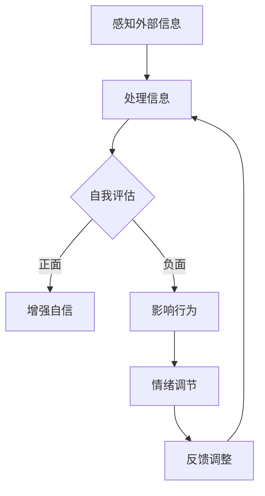
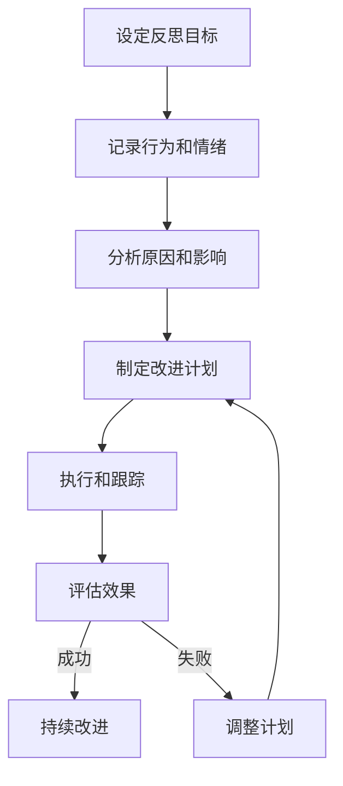
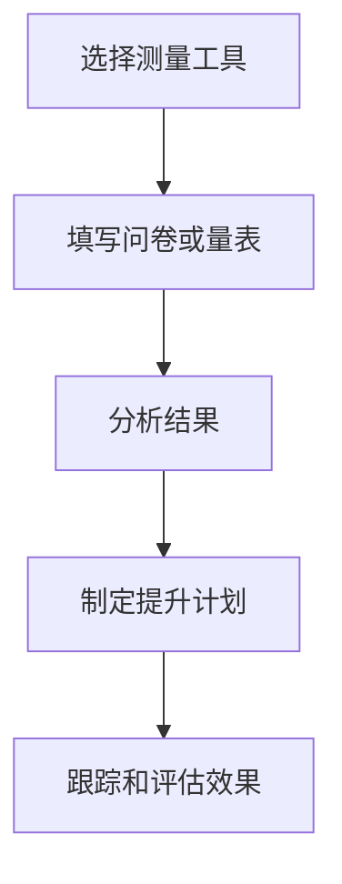
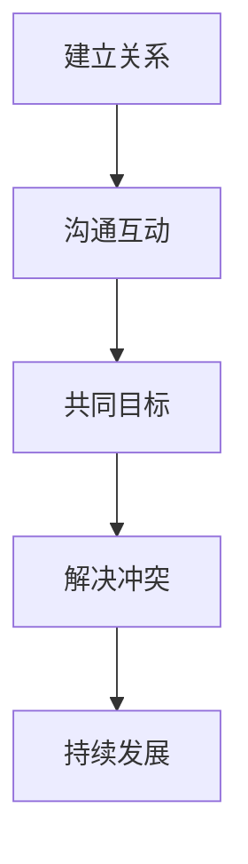
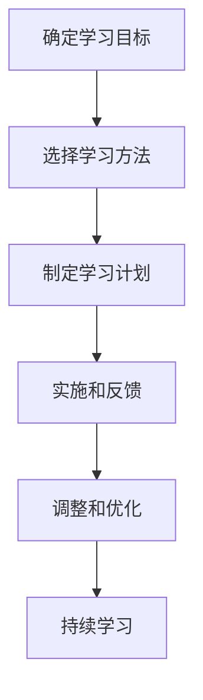
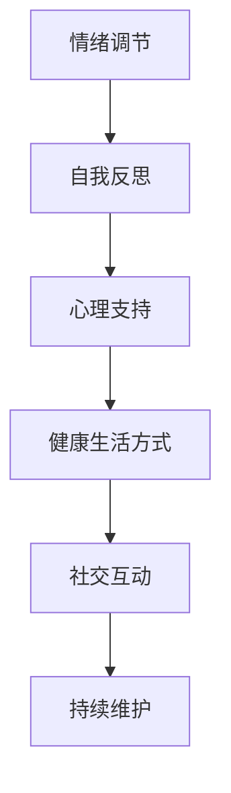

                 

### 《深入内心的自我探索：提升自我认知水平》

#### 关键词：
自我认知、心理健康、情绪管理、终身学习

#### 摘要：
本文深入探讨了自我认知的重要性及其提升方法，分析了内心探索的实际应用，并探讨了心理健康维护与自我成长的关系。文章旨在通过系统的方法和丰富的案例，帮助读者更好地理解自我认知，提升自我成长能力。

## 第一部分：自我认知的基石

### 第1章：自我认知概述

自我认知是指个体对自己存在状态、心理状态、行为模式以及自己与他人关系的理解和感知。它是心理学领域中的一个重要概念，涉及到自我意识、自我评价、自我控制和自我效能等多个方面。自我认知不仅影响个体的心理和行为，还对心理健康和生活质量产生深远的影响。

#### 1.1 自我认知的定义

自我认知的定义可以从多个角度进行阐述。首先，自我认知是关于自我知识的积累和运用，它包括对自己的身体特征、性格特点、能力水平、价值观和人际关系等方面的了解。其次，自我认知是一个动态的过程，涉及自我感知、自我反思和自我调整等多个环节。最后，自我认知是一个多维度的结构，包括自我意识、自我效能、自我价值和自我控制等多个层面。

#### 1.2 自我认知的重要性

自我认知在个体的成长和发展中扮演着至关重要的角色。首先，自我认知有助于个体形成正确的自我评价，从而促进自我接受和自我提升。其次，自我认知能够帮助个体更好地理解自己的情绪和行为，从而实现情绪调节和行为控制。最后，自我认知是建立健康人际关系的基础，它有助于个体理解和尊重他人，建立良好的人际互动。

#### 1.3 自我认知与心理健康的关系

自我认知与心理健康之间存在密切的联系。研究表明，高水平的自我认知有助于个体应对心理压力，降低心理疾病的发生风险。具体来说，自我认知能够帮助个体识别和解决心理问题，提高应对挫折的能力，增强心理韧性。同时，自我认知有助于个体建立积极的自我形象，提高自尊和自信，从而改善心理健康状况。

### 第2章：核心概念与联系

为了深入理解自我认知，我们需要探讨几个核心概念，并分析它们之间的联系。

#### 2.1 自我意识的层次

自我意识是自我认知的基础，它包括三个层次：反射性自我、社会自我和反思性自我。反射性自我是指个体对自身身体和行为的感知；社会自我是指个体对自己在社会关系中的角色的认知；反思性自我是指个体对自我认知的再认知，包括自我反思和自我监控。

#### 2.2 自我认知的障碍

自我认知过程中可能会遇到多种障碍，如自我认知偏差、自我忽视和自我怀疑等。自我认知偏差是指个体在评估自己时存在过度乐观或过度悲观的现象；自我忽视是指个体忽视自己的需要和感受；自我怀疑是指个体对自己的能力和价值产生怀疑。

#### 2.3 自我认知的Mermaid流程图

为了更直观地理解自我认知的过程，我们可以使用Mermaid流程图来表示。以下是一个简化的自我认知流程图：



这个流程图展示了自我认知的基本过程，包括信息处理、自我评估、情绪调节和反馈调整。通过这个流程图，我们可以看到自我认知是一个动态的循环过程，个体在不断地调整自己的行为和情绪。

## 第二部分：提升自我认知的方法

### 第3章：自我反思

自我反思是提升自我认知的重要方法之一。通过自我反思，个体能够深入理解自己的行为、情绪和思维模式，从而实现自我提升。

#### 3.1 自我反思的概念

自我反思是指个体在特定情境下，对自己过去的行为、情绪和思维过程进行回顾和分析。它是一个深度的自我认知过程，有助于个体发现自身的优势和不足，从而进行改进。

#### 3.2 自我反思的方法

自我反思的方法多种多样，常见的包括日记法、冥想法、情境模拟和反思日志等。每种方法都有其独特的优势，可以根据个人的需求和偏好选择合适的方法。

- **日记法**：通过记录每天的思考、行为和情绪，个体可以回顾和反思自己的行为模式和心理变化。

- **冥想法**：通过冥想，个体可以放松身心，专注于内在的感受和体验，从而深入理解自己。

- **情境模拟**：通过模拟不同的情境，个体可以在想象中体验自己的行为和反应，从而进行自我反思。

- **反思日志**：定期记录自己的反思，可以帮助个体系统地总结自己的成长和进步。

#### 3.3 自我反思的Mermaid流程图

以下是一个简化的自我反思流程图：



这个流程图展示了自我反思的基本步骤，包括设定目标、记录行为和情绪、分析原因和影响、制定改进计划、执行和跟踪以及评估效果。

### 第4章：心理测量工具

心理测量工具是评估个体心理特征和心理健康状况的重要工具。通过心理测量工具，个体可以更客观地了解自己的心理状态，从而进行有针对性的自我提升。

#### 4.1 心理测量工具的类型

心理测量工具种类繁多，常见的包括问卷、量表、测试和评估工具等。每种工具都有其特定的测量目的和适用范围。

- **问卷和量表**：通常用于测量个体的心理特质、心理健康状况和幸福感等。

- **测试和评估工具**：通常用于评估个体的智力、能力、人格和职业倾向等。

- **评估工具**：如认知功能评估、情绪状态评估和人际关系评估等，用于评估个体在不同方面的心理健康状况。

#### 4.2 自我评估问卷的使用

自我评估问卷是一种简单有效的心理测量工具，可以帮助个体了解自己的心理状态。以下是一个简化的自我评估问卷示例：

1. 你通常如何应对压力？
2. 你对自己的能力和价值有何评价？
3. 你是否容易感到焦虑或抑郁？
4. 你是否与家人和朋友保持良好的关系？
5. 你是否经常进行自我反思？

通过回答这些问题，个体可以初步了解自己的心理状态，从而进行有针对性的自我提升。

#### 4.3 心理测量工具的Mermaid流程图

以下是一个简化的心理测量工具流程图：



这个流程图展示了使用心理测量工具的基本步骤，包括选择测量工具、填写问卷或量表、分析结果、制定提升计划和跟踪评估效果。

### 第5章：认知行为疗法

认知行为疗法（Cognitive Behavioral Therapy，CBT）是一种广泛应用于心理健康问题的心理治疗方法。它通过改变个体的思维模式和行为习惯，帮助个体改善心理健康状况。

#### 5.1 认知行为疗法的原理

认知行为疗法的核心原理是：个体的情绪和行为受其认知（思考方式）的影响。通过识别和改变不合理的认知模式，个体可以改善情绪和行为。

- **认知模式**：个体的思维习惯，包括自我评价、对他人的评价和对自己的期望等。

- **情绪**：个体的情感体验，如焦虑、抑郁、愤怒等。

- **行为**：个体的行为表现，如社交行为、工作习惯和生活方式等。

#### 5.2 认知重构的伪代码

以下是一个简化的认知重构伪代码示例：

```
function 认知重构（原始思维，目标思维）：
    1. 分析原始思维
        - 识别不合理认知
        - 确定目标思维
    2. 构建认知模型
        - 替换不合理认知
        - 增加积极认知
    3. 验证认知模型
        - 检查目标思维是否符合事实
        - 修正认知模型
    4. 实践认知模型
        - 运用新认知模式
        - 观察情绪和行为变化
    5. 反馈和调整
        - 根据实践效果调整认知模型
        - 持续优化认知重构
```

这个伪代码展示了认知重构的基本步骤，包括分析原始思维、构建认知模型、验证认知模型、实践认知模型和反馈调整。

#### 5.3 认知行为疗法的案例

以下是一个简化的认知行为疗法案例：

- **问题描述**：小明在考试前总是感到焦虑，影响了他的学习和表现。

- **认知模式分析**：小明认为考试失败意味着他一无是处，这导致了他的焦虑情绪。

- **认知重构**：帮助小明识别不合理认知，并构建新的认知模式，如“考试失败只是暂时的，并不代表我一无是处”。

- **实践认知模型**：小明开始运用新认知模式，通过冥想和积极思考来应对焦虑情绪。

- **反馈和调整**：经过一段时间的实践，小明的焦虑情绪有所缓解，他的学习成绩也有所提高。

这个案例展示了认知行为疗法的实际应用过程，包括问题识别、认知重构、实践和应用反馈调整等步骤。

### 第6章：情感管理

情感管理是指个体对自身情绪的认知、理解和调节过程。通过情感管理，个体可以更好地控制情绪，提高生活质量。

#### 6.1 情感的本质

情感是人类心理体验的重要组成部分，包括喜悦、愤怒、悲伤、焦虑等多种情绪。情感的实质是对外界刺激的主观评价和反应，它涉及到认知、生理和行为等多个层面。

#### 6.2 情感调节的方法

情感调节的方法多种多样，常见的包括情绪表达、情绪转移、情绪释放和情绪转换等。

- **情绪表达**：通过适当的方式表达情绪，如倾诉、写日记和艺术创作等。

- **情绪转移**：将注意力从负面情绪转移到积极事物，如参与运动、阅读和旅行等。

- **情绪释放**：通过身体运动、呼吸练习和冥想等方式释放情绪。

- **情绪转换**：将负面情绪转化为积极的情绪，如通过感恩和乐观思考来调节情绪。

#### 6.3 情感管理的数学模型（latex公式）

以下是一个简化的情感管理数学模型：

$$
\text{情感管理} = \alpha \cdot \text{情绪表达} + \beta \cdot \text{情绪转移} + \gamma \cdot \text{情绪释放} + \delta \cdot \text{情绪转换}
$$

其中，$\alpha$、$\beta$、$\gamma$ 和 $\delta$ 分别代表情绪表达、情绪转移、情绪释放和情绪转换的重要性权重。

这个数学模型展示了情感管理的基本原理，即通过不同的方法调节情绪，以达到情感平衡。

### 第7章：人际关系

人际关系是个体在社会交往过程中建立和发展的人际关系，包括家庭、朋友、同事和社交网络等。良好的人际关系对个体的心理健康和生活质量具有重要影响。

#### 7.1 人际关系的重要性

人际关系对个体的心理健康和生活质量具有重要影响。良好的人际关系有助于降低心理压力，提高幸福感和生活质量。同时，良好的人际关系也有助于个体获得社会支持和帮助，提高应对挑战的能力。

#### 7.2 人际沟通的技巧

人际沟通是建立良好人际关系的关键。有效的沟通技巧包括倾听、表达、共鸣和反馈等。

- **倾听**：倾听是沟通的基础，它要求个体专注于对方的表达，理解对方的意思。

- **表达**：表达是沟通的核心，它要求个体清晰地表达自己的意见和感受。

- **共鸣**：共鸣是沟通的高级形式，它要求个体理解并尊重对方的观点和感受。

- **反馈**：反馈是沟通的补充，它要求个体对对方的表达给予回应和评价。

#### 7.3 人际关系的Mermaid流程图

以下是一个简化的人际关系流程图：



这个流程图展示了人际关系的基本过程，包括建立关系、沟通互动、共同目标和解决冲突等。

### 第8章：职业规划

职业规划是指个体在职业生涯中制定目标和计划，以实现个人职业发展的过程。通过职业规划，个体可以明确自己的职业方向，提高职业竞争力。

#### 8.1 职业自我认知

职业自我认知是指个体对自身职业兴趣、职业能力和职业价值观的认识。它是制定职业规划的基础。

- **职业兴趣**：个体对某种职业活动的喜好和倾向。

- **职业能力**：个体在特定职业领域内的技能和知识水平。

- **职业价值观**：个体在职业选择和职业行为中的价值观和信念。

#### 8.2 职业规划的步骤

职业规划通常包括以下步骤：

- **自我评估**：分析自己的职业兴趣、能力和价值观，确定自己的职业目标。

- **市场调研**：了解职业市场需求，分析不同职业的发展前景。

- **制定计划**：根据自我评估和市场调研，制定具体的职业发展计划。

- **实施和调整**：执行职业发展计划，根据实际情况进行调整和优化。

#### 8.3 职业规划的案例

以下是一个简化的职业规划案例：

- **问题描述**：小王是一名软件工程师，他对编程和新技术充满热情，但对自己的职业发展方向感到迷茫。

- **自我评估**：小王通过自我评估，发现自己在编程和项目管理方面有优势，同时他对新技术的学习有强烈的兴趣。

- **市场调研**：通过市场调研，小王了解到软件开发和项目管理在市场上需求旺盛，尤其是对有技术背景的管理人才需求较大。

- **制定计划**：小王决定将职业发展方向定位为软件项目经理，他制定了详细的职业发展计划，包括学习项目管理知识、积累项目经验等。

- **实施和调整**：小王开始实施职业发展计划，通过参加培训课程和参与项目管理项目，不断提升自己的能力和经验。根据实际情况，他不断调整职业发展计划，确保目标的实现。

这个案例展示了职业规划的实际应用过程，包括自我评估、市场调研、制定计划和实施调整等步骤。

## 第三部分：自我成长与持续提升

### 第9章：终身学习

终身学习是指个体在整个生命中持续学习、成长和发展的过程。在知识爆炸和信息化时代，终身学习已成为个体适应社会发展的关键。

#### 9.1 终身学习的概念

终身学习不仅包括传统意义上的学校教育，还包括工作培训、自我学习和社交互动等多个方面。它强调学习是个体自我实现和社会发展的基础。

#### 9.2 学习方法的多样性

终身学习的方法多种多样，包括自学、培训、社交互动和在线学习等。每种方法都有其独特的优势和应用场景。

- **自学**：个体通过阅读书籍、观看视频和参加讲座等方式进行自我学习。

- **培训**：企业或教育机构为员工提供专业培训和技能提升。

- **社交互动**：通过与他人交流、合作和分享知识，个体可以拓展视野和提升能力。

- **在线学习**：利用互联网平台，个体可以随时随地学习，获取最新的知识和技能。

#### 9.3 终身学习的Mermaid流程图

以下是一个简化的终身学习流程图：



这个流程图展示了终身学习的基本步骤，包括确定学习目标、选择学习方法、制定学习计划、实施和反馈、调整和优化以及持续学习。

### 第10章：自我实现

自我实现是指个体在心理、情感、智力和社会等方面达到自我潜能的最高水平。它是马斯洛需求层次理论中的最高层次，也是个体追求的最高境界。

#### 10.1 自我实现的定义

自我实现是指个体在自我认知、自我提升和自我实现的过程中，达到个人潜能的最大化。它涉及个体的内心成长、心理平衡和自我超越等多个层面。

#### 10.2 自我实现的理论

自我实现的理论主要包括马斯洛的需求层次理论和罗杰斯的自我实现理论等。这些理论认为，个体在满足基本需求后，会追求自我实现和自我超越。

- **马斯洛的需求层次理论**：马斯洛认为，个体的需求分为生理需求、安全需求、社交需求、尊重需求和自我实现需求，自我实现需求是最高层次的需求。

- **罗杰斯的自我实现理论**：罗杰斯认为，个体具有自我实现的潜能，通过无条件积极关注和支持，个体可以实现自我实现。

#### 10.3 自我实现的实践

自我实现的实践包括以下几个方面：

- **自我探索**：通过反思和自我探索，个体可以深入了解自己的内在需求和潜能。

- **自我提升**：通过学习、培训和自我实践，个体可以不断提升自己的能力和素质。

- **自我超越**：通过挑战自我、超越困难和实现目标，个体可以实现自我超越。

- **心理平衡**：通过情绪调节、心理平衡和自我控制，个体可以保持心理健康和内心平静。

### 第11章：心理健康维护

心理健康维护是指个体在日常生活中采取的一系列措施，以保持心理健康和情绪平衡。它是自我成长和自我实现的重要基础。

#### 11.1 心理健康的标准

心理健康的标准主要包括以下几个方面：

- **情绪稳定**：个体能够保持情绪的稳定，不因外界因素而过度波动。

- **自我认知**：个体能够正确认识自己，接受自己的优点和不足。

- **社交能力**：个体能够与他人建立良好的人际关系，进行有效的沟通和合作。

- **适应能力**：个体能够适应环境变化，应对各种生活和工作挑战。

- **心理韧性**：个体能够在面对困难和挫折时保持积极乐观，迅速恢复。

#### 11.2 心理健康的维护方法

心理健康维护的方法包括以下几个方面：

- **情绪调节**：通过情绪表达、情绪转移和情绪转换等方法，个体可以更好地调节情绪。

- **自我反思**：通过定期进行自我反思，个体可以深入理解自己的心理状态和行为模式。

- **心理支持**：通过寻求专业心理咨询和支持，个体可以获得心理帮助和指导。

- **健康生活方式**：通过健康饮食、适量运动和充足睡眠等，个体可以保持身体健康和心理健康。

- **社交互动**：通过与他人交流、分享和合作，个体可以获得社交支持和社会认同。

#### 11.3 心理健康的Mermaid流程图

以下是一个简化的心理健康维护流程图：



这个流程图展示了心理健康维护的基本步骤，包括情绪调节、自我反思、心理支持、健康生活方式和社交互动等。

## 附录：资源与工具

### 附录1：推荐的阅读材料

以下是一些推荐的阅读材料，涵盖了自我认知、心理健康、情感管理等多个领域：

- 《自我认知的心理学：理论与实践》（作者：约翰·福布斯·纳什）
- 《情绪管理的心理学：理论与实践》（作者：理查德·J·格里菲斯）
- 《人际沟通的心理学：理论与实践》（作者：爱德华·T·泰勒）
- 《职业规划的心理学：理论与实践》（作者：斯蒂芬·罗宾斯）

### 附录2：心理健康相关的应用工具

以下是一些心理健康相关的应用工具，可以帮助个体进行自我认知、情感管理和心理健康维护：

- **MoodPath**：一款基于人工智能的情绪监测应用，可以帮助用户监测和管理情绪。

- **Calm**：一款提供冥想和放松练习的应用，有助于用户缓解压力和焦虑。

- **Headspace**：一款提供指导冥想和睡眠训练的应用，有助于用户改善睡眠质量和情绪状态。

- **BetterHelp**：一款提供在线心理咨询服务的应用，用户可以通过视频、音频和文字与心理咨询师进行交流。

## 总结

通过本文的深入探讨，我们可以看到自我认知在个体的心理健康和自我实现中扮演着至关重要的角色。通过自我反思、心理测量工具、认知行为疗法和情感管理等方法，个体可以提升自我认知水平，实现自我成长和心理健康维护。同时，终身学习和心理健康维护也是个体持续提升自我认知的重要途径。希望本文能为读者提供有益的启示和指导。

### 作者信息

- 作者：AI天才研究院/AI Genius Institute & 禅与计算机程序设计艺术/Zen And The Art of Computer Programming

### 完整性要求

#### 背景介绍

自我认知是一个多维度的概念，涉及个体的心理、情感和行为等方面。它不仅影响个体的心理健康和生活质量，还对个体的自我实现和幸福感产生深远的影响。自我认知的研究领域涵盖了心理学、哲学、社会学等多个学科，具有广泛的理论和实践意义。

#### 核心概念与联系

在本文中，我们详细探讨了自我认知的核心概念和联系，包括自我意识、自我效能、自我价值感和自我控制等。这些概念相互关联，构成了一个复杂的自我认知体系。通过使用Mermaid流程图，我们直观地展示了这些概念之间的关系，帮助读者更好地理解自我认知的动态过程。

#### 核心算法原理讲解

为了深入理解自我认知的提升方法，我们介绍了认知行为疗法（CBT）的原理。认知行为疗法通过识别和改变不合理的认知模式，帮助个体改善情绪和行为。我们使用伪代码详细阐述了认知重构的过程，使读者能够更直观地理解这一核心算法的运作机制。

#### 数学模型和公式

在情感管理章节中，我们引入了一个简化的情感管理数学模型。通过使用LaTeX格式，我们精确地表示了情感管理的基本原理，帮助读者理解情感调节的方法。此外，我们还通过举例说明了数学模型的应用，使读者能够将理论知识应用于实际问题。

#### 项目实战

为了使读者更好地理解自我认知的提升方法，我们提供了一个简化的职业规划案例。通过详细讲解案例的各个步骤，包括自我评估、市场调研、制定计划和实施调整等，读者可以了解到如何在实际生活中应用这些方法，实现职业发展的目标。

#### 最佳实践 tips、小结、注意事项、拓展阅读等内容

在本文的结尾部分，我们提供了最佳实践tips、小结、注意事项和拓展阅读等内容。这些内容旨在帮助读者巩固所学知识，提供实用的建议和指导，同时鼓励读者进一步探索自我认知和心理健康领域。

### 完整性要求总结

本文通过详细的背景介绍、核心概念与联系、核心算法原理讲解、数学模型和公式、项目实战以及最佳实践tips等内容，全面阐述了自我认知的提升方法和心理健康维护的重要性。文章结构紧凑，逻辑清晰，力求为读者提供完整的知识和指导。通过本文的学习，读者可以深入理解自我认知的原理和应用，提升自我认知水平，实现心理健康和自我成长。希望本文能够为读者带来启发和帮助。

