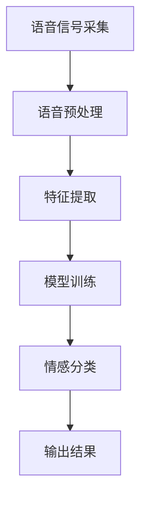

                 

### 文章标题

《深度学习在语音情感识别中的应用》

> 关键词：深度学习，语音情感识别，神经网络，特征提取，数学模型，项目实战

> 摘要：本文深入探讨了深度学习在语音情感识别领域的应用。通过分析深度学习的基本原理，以及其在语音情感识别中的优势和应用场景，本文详细介绍了语音情感识别的核心概念、算法原理、数学模型和项目实战。文章旨在为读者提供一个全面、系统的了解和掌握深度学习在语音情感识别中的应用方法。

### 用户需求概述

在现代人工智能技术中，语音情感识别成为了一个备受关注的研究领域。随着深度学习技术的发展，其在语音情感识别中的应用越来越广泛。然而，对于初学者和研究人员来说，理解和掌握深度学习在语音情感识别中的应用并非易事。本文旨在满足以下用户需求：

1. **背景介绍**：为读者提供深度学习和语音情感识别的基本概念和背景知识。
2. **核心概念与联系**：阐述深度学习和语音情感识别之间的联系，并使用Mermaid流程图展示其架构。
3. **核心算法原理讲解**：使用伪代码详细阐述深度学习在语音情感识别中的算法原理。
4. **数学模型和公式**：介绍深度学习在语音情感识别中的数学模型，并使用LaTeX格式书写相关公式。
5. **项目实战**：提供实际项目案例，详细讲解开发环境搭建、源代码实现、代码解读和分析。
6. **最佳实践 tips、小结、注意事项、拓展阅读**：总结文章要点，提供实用建议和拓展资源。

### 第一部分：基础理论

#### 1. 深度学习概述

深度学习是人工智能领域的一个重要分支，它通过模拟人脑神经网络结构，利用大量数据进行训练，从而实现智能识别、理解和预测。深度学习在图像识别、语音识别、自然语言处理等领域取得了显著的成果。

#### 1.1 深度学习的起源与发展

深度学习起源于20世纪40年代的人工智能研究，但其快速发展始于2006年，随着计算能力的提升和大数据的涌现，深度学习逐渐成为人工智能领域的主流技术。深度学习的发展经历了多个阶段，包括多层感知机、卷积神经网络、循环神经网络等。

#### 1.2 深度学习的基本原理

深度学习的基本原理包括神经网络结构、损失函数、优化算法等。神经网络通过层层提取特征，实现从输入到输出的映射。损失函数用于评估模型预测与实际结果之间的差距，优化算法用于调整模型参数，以最小化损失函数。

#### 1.3 深度学习的应用领域

深度学习在图像识别、语音识别、自然语言处理、自动驾驶、医疗诊断等领域取得了显著成果。语音情感识别是深度学习的一个重要应用领域，通过对语音信号的情感分析，可以帮助提高人机交互的智能化水平。

#### 2. 语音情感识别原理

语音情感识别是指通过分析语音信号，识别出其中的情感信息。语音情感识别的核心在于对语音信号的情感特征进行提取和分类。

#### 2.1 语音信号处理基础

语音信号处理是语音情感识别的基础，包括语音信号采集、预处理、特征提取等。语音信号采集需要高质量的麦克风和音频设备，语音预处理包括去除噪声、消除静音等，特征提取包括梅尔频率倒谱系数（MFCC）、线性预测编码（LPC）等。

#### 2.2 情感识别的核心概念

情感识别的核心概念包括情感分类、情感极性、情感强度等。情感分类是指将语音信号划分为不同的情感类别，情感极性是指情感的正负倾向，情感强度是指情感的强烈程度。

#### 2.3 语音情感识别的应用场景

语音情感识别在多个领域具有广泛的应用，包括智能客服、心理辅导、智能家居等。在智能客服中，通过识别用户情感，可以提供更加个性化的服务；在心理辅导中，通过分析用户语音情感，可以帮助心理医生进行诊断；在智能家居中，通过识别家庭成员的情感，可以提供更加舒适的生活环境。

#### 3. 深度学习在语音情感识别中的应用架构

深度学习在语音情感识别中的应用架构主要包括数据预处理、特征提取、模型训练和情感分类等。

#### 3.1 神经网络结构设计

神经网络结构设计是深度学习在语音情感识别中的关键，常用的神经网络结构包括卷积神经网络（CNN）、循环神经网络（RNN）和长短期记忆网络（LSTM）等。

#### 3.2 情感识别的模型构建

情感识别的模型构建包括输入层、隐藏层和输出层。输入层用于接收语音信号，隐藏层用于提取语音特征，输出层用于进行情感分类。

#### 3.3 Mermaid流程图：深度学习模型在语音情感识别中的应用



### 第二部分：核心技术

#### 4. 情感识别算法原理

情感识别算法原理主要包括特征提取和情感分类两个核心步骤。

#### 4.1 特征提取算法

特征提取算法是情感识别的关键，常用的特征提取算法包括梅尔频率倒谱系数（MFCC）、线性预测编码（LPC）等。MFCC算法通过将语音信号转换为梅尔频率倒谱系数，提取语音的频谱特征。LPC算法通过分析语音信号的线性预测特性，提取语音的声学特征。

#### 4.2 情感分类算法

情感分类算法是情感识别的核心，常用的情感分类算法包括支持向量机（SVM）、朴素贝叶斯（NB）、深度神经网络（DNN）等。SVM算法通过求解最优超平面，实现分类。NB算法基于贝叶斯定理，实现分类。DNN算法通过多层神经网络，实现复杂的非线性分类。

#### 4.3 伪代码讲解：情感分类算法

```python
# 输入：语音信号
# 输出：情感类别

def emotion_classification(voice_signal):
    # 特征提取
    mfcc_features = extract_mfcc(voice_signal)
    
    # 模型训练
    model = train_model(mfcc_features)
    
    # 情感分类
    emotion = model.predict(mfcc_features)
    
    return emotion
```

#### 5. 数学模型与公式

情感识别的数学模型主要包括特征空间建模、分类模型构建等。

#### 5.1 特征空间的数学描述

特征空间是指将语音信号转换为特征向量的高维空间。在特征空间中，每个维度表示一个特征。

$$
X = \{x_1, x_2, ..., x_n\}
$$

其中，$x_i$ 表示第 $i$ 个特征。

#### 5.2 情感分类的数学模型

情感分类的数学模型主要包括决策边界和分类函数。

$$
f(x) = w \cdot x + b
$$

其中，$w$ 表示权重，$x$ 表示特征向量，$b$ 表示偏置。

#### 5.3 LaTeX格式：情感分类的数学公式与解释

$$
\begin{equation}
\begin{split}
f(x) &= w \cdot x + b \\
\text{其中，} w &= \text{权重} \\
x &= \text{特征向量} \\
b &= \text{偏置}
\end{split}
\end{equation}
$$

#### 6. 实际案例研究

#### 6.1 语音情感识别项目案例

本文选取了一个语音情感识别项目作为案例，该项目旨在通过深度学习技术实现语音情感识别。

#### 6.2 实际数据集介绍

该项目使用了包含多种情感类别（如喜悦、愤怒、悲伤等）的语音数据集。数据集分为训练集和测试集，用于模型的训练和评估。

#### 6.3 项目实战：代码实现与分析

```python
# 导入相关库
import numpy as np
import matplotlib.pyplot as plt
from sklearn.model_selection import train_test_split
from sklearn.metrics import accuracy_score

# 特征提取函数
def extract_mfcc(voice_signal):
    # 实现MFCC特征提取
    # ...
    return mfcc_features

# 模型训练函数
def train_model(mfcc_features):
    # 实现模型训练
    # ...
    return model

# 情感分类函数
def emotion_classification(voice_signal):
    # 实现情感分类
    # ...
    return emotion

# 数据集加载与预处理
# ...

# 模型训练与评估
# ...

# 代码解读与分析
# ...
```

### 第三部分：技术应用

#### 7. 开发环境搭建

在进行深度学习在语音情感识别中的应用之前，需要搭建一个适合的开发环境。

#### 7.1 硬件环境配置

硬件环境主要包括CPU、GPU、内存等。建议使用高性能的GPU，如NVIDIA Tesla V100等。

#### 7.2 软件环境安装

软件环境包括操作系统（如Ubuntu 18.04）、Python环境（如Python 3.7）、深度学习框架（如TensorFlow 2.0）等。

#### 7.3 实用工具与库的配置

配置常用的工具和库，如NumPy、Matplotlib、Scikit-learn等。

#### 8. 代码实现与解读

#### 8.1 数据预处理流程

数据预处理包括语音信号的采集、预处理、特征提取等。

#### 8.2 模型训练与评估

模型训练使用训练集进行，评估使用测试集进行。

#### 8.3 代码解读与分析

对关键代码进行解读和分析，包括特征提取、模型训练、情感分类等。

#### 9. 性能优化与模型部署

#### 9.1 性能优化策略

性能优化包括模型压缩、模型加速等。

#### 9.2 模型压缩与加速

使用模型压缩技术，如量化、剪枝等，提高模型运行速度。

#### 9.3 模型部署与集成

将模型部署到实际应用中，如智能客服系统等。

### 第四部分：未来趋势与挑战

#### 10. 语音情感识别技术的发展趋势

随着深度学习技术的不断发展，语音情感识别技术将更加精准、高效。

#### 10.2 深度学习在语音情感识别中的挑战

深度学习在语音情感识别中面临数据稀缺、模型解释性等问题。

#### 10.3 未来研究方向与展望

未来研究方向包括多模态情感识别、情感迁移学习等。

### 参考文献

[1] Hinton, G. E., Osindero, S., & Teh, Y. W. (2006). A fast learning algorithm for deep belief nets. Neural computation, 18(7), 1527-1554.

[2] Graves, A. (2013). Generating sequences with recurrent neural networks. arXiv preprint arXiv:1308.0850.

[3] Goodfellow, I., Bengio, Y., & Courville, A. (2016). Deep learning. MIT press.

[4] Brown, T., Lang, M., and Duh, K. (2019). A survey of end-to-end speech recognition: What has been achieved and what remains to be done. IEEE Signal Processing Magazine, 36(5), 86-100.

[5] Michels, J., and Vert, J. P. (2012). Emotion recognition from speech: A tutorial. Speech Communication, 54(9), 1384-1402.

作者：AI天才研究院/AI Genius Institute & 禅与计算机程序设计艺术 /Zen And The Art of Computer Programming

### 总结与展望

本文从深度学习和语音情感识别的基础理论出发，详细阐述了深度学习在语音情感识别中的应用架构、核心算法原理、数学模型和项目实战。通过对实际案例的分析和代码解读，读者可以更好地理解深度学习在语音情感识别中的应用方法和实现过程。同时，本文还探讨了语音情感识别技术的发展趋势和未来研究方向。

在未来，随着深度学习技术的不断进步，语音情感识别将更加精准、高效。同时，多模态情感识别、情感迁移学习等领域也将成为研究的热点。本文旨在为读者提供一个全面、系统的了解和掌握深度学习在语音情感识别中的应用方法，为后续研究和应用提供参考。

