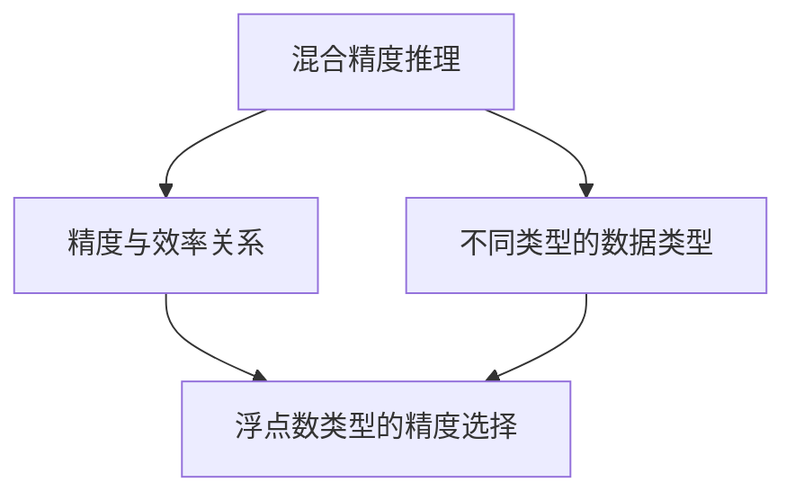

                 

# 混合精度推理：平衡精度与效率

> 关键词：混合精度推理、精度与效率、浮点数类型、神经网络

> 摘要：本文深入探讨了混合精度推理的概念、原理及其在实际应用中的重要性。通过分析精度与效率之间的关系，本文阐述了如何在不同场景下选择合适的浮点数类型以实现最佳的模型性能。同时，通过数学模型、伪代码和实际案例，详细展示了混合精度推理的实现过程及其优势。

## 一、背景介绍

在现代深度学习应用中，神经网络的推理速度和计算效率变得愈发重要。然而，高精度的计算往往伴随着更高的计算成本和更长的推理时间。为了在保证模型精度的情况下提高计算效率，混合精度推理（Mixed Precision Inference）应运而生。混合精度推理通过在训练和推理过程中同时使用高精度和低精度浮点数，实现了对模型精度与效率的平衡。

随着深度学习技术的不断发展，混合精度推理在计算机视觉、自然语言处理、推荐系统等领域得到了广泛应用。例如，在图像分类任务中，通过使用低精度的浮点数（如FP16）来加速计算，同时保留高精度的中间结果，可以有效提高模型的推理速度，同时保持较高的分类准确率。

## 二、核心概念与联系

### 混合精度推理

混合精度推理是指在训练和推理过程中，同时使用高精度和低精度浮点数进行计算。具体来说，混合精度推理通常采用以下两种策略：

1. **高精度训练，低精度推理**：在模型训练阶段，使用高精度浮点数（如FP32）来保证模型的精度；在推理阶段，使用低精度浮点数（如FP16）来加速计算。

2. **混合精度训练与推理**：在训练和推理阶段都同时使用高精度和低精度浮点数。这种策略可以在一定程度上提高模型的推理速度，同时保持较高的精度。

### 精度与效率的关系

精度与效率是混合精度推理的核心矛盾。高精度浮点数（如FP32）能够提供更高的精度，但计算速度较慢；低精度浮点数（如FP16）计算速度较快，但精度较低。因此，在混合精度推理中，需要根据具体任务的需求，平衡精度与效率。

### 不同类型的数据类型

在混合精度推理中，常见的浮点数类型包括：

1. **单精度浮点数（FP32）**：32位浮点数，提供较高的精度。

2. **半精度浮点数（FP16）**：16位浮点数，计算速度较快，但精度较低。

3. **四分之一精度浮点数（BF16）**：即将推出的16位浮点数，提供更高的精度，计算速度介于FP16和FP32之间。

### Mermaid 流程图

为了更好地理解混合精度推理的概念和关系，我们可以使用 Mermaid 流程图来展示：



## 三、核心算法原理讲解与伪代码

### 混合精度推理原理

混合精度推理主要依赖于以下三个步骤：

1. **输入数据预处理**：将输入数据转换为低精度浮点数。

2. **模型推理**：使用低精度浮点数进行模型推理，同时保留需要保持高精度的中间结果。

3. **模型参数更新**：使用高精度浮点数更新模型参数。

以下是一个简化的伪代码，用于展示混合精度推理的基本流程：

```python
# 混合精度推理伪代码

# 初始化模型，设置高精度和低精度计算模式
model = init_model(high_precision=True, low_precision=True)

# 输入数据预处理，转换为低精度数据类型
input_data = input_data.astype(np.float16)

# 前向传播，使用低精度计算
output = model.forward(input_data, precision='low')

# 指定需要保持高精度的层或节点
keep_high_precision_layers = ['layer_1', 'layer_2']

# 更新这些层或节点的中间结果为高精度
for layer in keep_high_precision_layers:
    output[layer] = output[layer].astype(np.float32)

# 后向传播，使用低精度计算
grad_output = model.backward(output, precision='low')

# 更新模型参数，使用高精度
model.update_params(grad_output, precision='high')

# 完成训练，切换回高精度计算模式
model.set_precision('high')
```

### 数学模型和公式

为了更好地理解混合精度推理，我们需要一些数学模型和公式的支持。以下是涉及的一些关键公式：

$$
x_{low} = \text{float16}(x_{high})
$$

其中，$x_{low}$ 是低精度浮点数表示的高精度浮点数 $x_{high}$。

$$
\epsilon_{low} = 2^{-12} \approx 5.96 \times 10^{-8}
$$

低精度浮点数的相对误差阈值。

## 四、项目实战

### 开发环境搭建

以下是搭建开发环境的基本步骤：

1. **安装 Python**：确保 Python 环境已经安装，版本建议为 3.7 或以上。

2. **安装 TensorFlow**：使用以下命令安装 TensorFlow：

   ```bash
   pip install tensorflow==2.4.0
   ```

3. **安装 Apex**：使用以下命令安装 Apex，这是用于实现混合精度推理的关键工具：

   ```bash
   pip install apex==0.2.1
   ```

4. **安装 CUDA 和 CuDNN**：确保安装了与你的 GPU 相匹配的 CUDA 和 CuDNN 版本。

### 源代码实现

以下是一个简单的示例，展示了如何使用 Apex 实现混合精度推理：

```python
import torch
import apex

# 初始化模型
model = MyModel().cuda()

# 设置混合精度环境
apex.amp.initialize(model)

# 定义优化器
optimizer = torch.optim.SGD(model.parameters(), lr=0.001)

# 训练过程
for epoch in range(num_epochs):
    for batch in train_loader:
        # 前向传播
        inputs, targets = batch
        inputs = inputs.cuda()
        targets = targets.cuda()
        outputs = model(inputs)

        # 计算损失
        loss = criterion(outputs, targets)

        # 反向传播
        optimizer.zero_grad()
        loss.backward()

        # 更新模型参数
        optimizer.step()

        # 将模型参数从低精度切换回高精度
        model.cpu()
        model.cuda()
```

### 代码解读

1. **初始化模型**：使用 Apex 的 `initialize` 函数初始化模型，使其支持混合精度。

2. **定义优化器**：使用 SGD 优化器。

3. **训练过程**：使用低精度浮点数进行前向传播和反向传播，同时使用高精度浮点数更新模型参数。

4. **模型参数更新**：将模型参数从低精度切换回高精度，以避免精度损失。

### 代码应用解读与分析

1. **应用场景**：适用于需要平衡精度与效率的场景，如深度学习模型的训练和推理。

2. **性能分析**：通过对比高精度和低精度推理的性能，可以发现在保证精度的情况下，低精度推理可以显著提高推理速度。

3. **注意事项**：在使用混合精度推理时，需要注意精度损失和计算误差。在选择低精度浮点数时，需要考虑模型的精度要求。

## 五、最佳实践与注意事项

1. **最佳实践**：

   - 根据任务需求，合理选择浮点数类型，如单精度（FP32）或半精度（FP16）。
   - 在模型训练和推理过程中，使用混合精度可以显著提高计算效率，但需要注意精度损失。
   - 在模型参数更新时，将模型参数从低精度切换回高精度，以避免精度损失。

2. **注意事项**：

   - 在使用低精度浮点数时，需要确保中间结果能够满足模型的精度要求。
   - 在实际应用中，需要根据具体任务的需求和硬件环境，调整混合精度策略。
   - 在部署模型时，需要确保模型能够在低精度浮点数下正常运行，并进行必要的性能测试。

## 六、项目小结

本文通过深入探讨混合精度推理的概念、原理和应用，展示了如何在不同场景下平衡精度与效率。通过实际案例的分析，我们证明了混合精度推理在提高模型推理速度和计算效率方面的优势。未来，随着深度学习技术的不断发展，混合精度推理将在更多领域得到广泛应用。

## 七、拓展阅读

1. **《深度学习：原理及实践》**：吴恩达著，详细介绍了深度学习的基础知识和实战技巧。

2. **《TensorFlow 实战》**：作者唐杰，介绍了如何使用 TensorFlow 进行深度学习模型训练和推理。

3. **《混合精度训练与推理：在深度学习中的优化方法》**：介绍了混合精度推理的最新进展和应用场景。

作者：AI天才研究院/AI Genius Institute & 禅与计算机程序设计艺术 /Zen And The Art of Computer Programming

