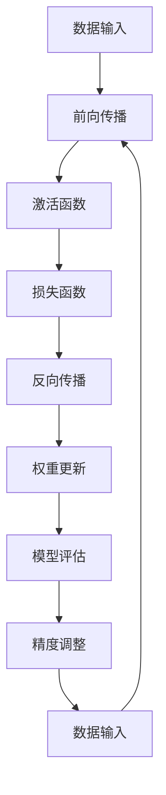

                 

### 混合精度训练在AI中的应用与效果

# 混合精度训练在AI中的应用与效果

## 关键词：
- 混合精度训练
- AI
- 机器学习
- 深度学习
- 数学模型

## 摘要：
本文旨在探讨混合精度训练在人工智能（AI）领域的应用及其效果。混合精度训练通过结合不同精度的数据类型，以优化训练过程和提高模型性能。本文将详细介绍混合精度训练的核心概念、算法原理、数学模型及其在实际项目中的应用和效果评估。

## 引言

随着深度学习在图像识别、自然语言处理和计算机视觉等领域的广泛应用，模型训练所需的计算资源和时间越来越长。为了应对这一挑战，混合精度训练（Mixed Precision Training）作为一种高效的方法逐渐受到关注。混合精度训练通过使用不同的数值精度（例如单精度浮点数（FP32）和半精度浮点数（FP16）），在保证模型性能的同时，显著降低计算资源的消耗。本文将详细介绍混合精度训练的核心概念、算法原理、数学模型及其在实际项目中的应用和效果评估。

## 混合精度训练概述

### 1.1 混合精度训练的概念

混合精度训练是指在一个训练过程中，同时使用不同精度的数值类型来计算和存储中间变量和梯度。常见的混合精度组合包括FP32和FP16，其中FP32表示单精度浮点数，而FP16表示半精度浮点数。通过将部分中间变量和梯度从FP32转换为FP16，可以显著降低计算资源的消耗，同时保持较高的模型精度。

### 1.2 混合精度训练的优势与挑战

混合精度训练具有以下优势：

1. **提高计算性能**：FP16比FP32占用更少的空间，并且在现代计算机架构中，半精度运算通常比单精度运算更快。
2. **减少内存占用**：FP16占用内存仅为FP32的一半，有助于减少内存瓶颈。
3. **降低训练时间**：由于FP16运算速度快，混合精度训练可以显著缩短训练时间。

然而，混合精度训练也面临以下挑战：

1. **精度损失**：FP16数值范围较小，可能导致精度损失。在极端情况下，可能导致模型性能下降。
2. **数值稳定性**：FP16运算可能会导致数值稳定性问题，尤其是在训练过程中出现溢出或下溢时。
3. **算法复杂度**：混合精度训练需要在训练过程中动态调整精度，增加了算法的复杂性。

## 混合精度训练的核心概念与联系

为了更好地理解混合精度训练，我们可以通过一个Mermaid流程图来展示其核心概念和它们之间的联系。



### 2.1 Mermaid流程图：混合精度训练的核心概念与联系

在这个流程图中，我们可以看到混合精度训练的核心概念，包括数据输入、前向传播、激活函数、损失函数、反向传播、权重更新和模型评估。同时，精度调整作为核心概念之一，在整个训练过程中起到关键作用。

## 混合精度训练的核心算法原理

### 3.1 伪代码讲解：混合精度训练算法实现

以下是一个简化的伪代码，用于解释混合精度训练算法的实现过程：

```python
function MixedPrecisionTraining(model, optimizer, train_loader, val_loader):
    for epoch in range(num_epochs):
        for data, target in train_loader:
            optimizer.zero_grad()
            
            # 前向传播，使用FP32
            output = model(data, dtype=torch.float32)
            loss = criterion(output, target)
            
            # 反向传播，使用FP16
            loss.backward()
            optimizer.step()
            
        # 模型评估，使用FP16
        with torch.no_grad():
            model.eval()
            val_loss = evaluate(model, val_loader, dtype=torch.float16)
            
        print(f"Epoch {epoch+1}/{num_epochs}, Loss: {loss.item()}, Val Loss: {val_loss}")

    return model
```

### 3.2 混合精度训练的优势与挑战

混合精度训练通过以下方式提高模型性能：

1. **减少内存占用**：FP16占用内存仅为FP32的一半，有助于减少内存瓶颈。
2. **提高计算性能**：FP16运算速度更快，尤其在深度学习中，半精度运算可以显著缩短训练时间。
3. **减少精度损失**：通过适当的精度调整和数值稳定性技术，FP16可以保持较高的模型精度。

然而，混合精度训练也面临以下挑战：

1. **精度损失**：FP16数值范围较小，可能导致精度损失。在极端情况下，可能导致模型性能下降。
2. **数值稳定性**：FP16运算可能会导致数值稳定性问题，尤其是在训练过程中出现溢出或下溢时。
3. **算法复杂度**：混合精度训练需要在训练过程中动态调整精度，增加了算法的复杂性。

## 混合精度训练的数学模型

### 4.1 混合精度训练中的数学模型

混合精度训练涉及到以下数学模型：

1. **前向传播模型**：
   $$ f(x) = \sigma(Wx + b) $$
   其中，$ x $表示输入，$ W $表示权重，$ b $表示偏置，$ \sigma $表示激活函数。

2. **反向传播模型**：
   $$ \delta = \frac{\partial L}{\partial z} \odot \sigma'(z) $$
   其中，$ \delta $表示梯度，$ L $表示损失函数，$ z $表示激活值，$ \sigma' $表示激活函数的导数。

### 4.2 LaTeX格式数学公式讲解

以下是与混合精度训练相关的数学公式，使用LaTeX格式进行讲解：

```latex
\documentclass{article}
\usepackage{amsmath}
\begin{document}

\section{数学模型}

\subsection{前向传播模型}

前向传播模型可以用以下公式表示：

\[ f(x) = \sigma(Wx + b) \]

其中，$ x $表示输入，$ W $表示权重，$ b $表示偏置，$ \sigma $表示激活函数。

\subsection{反向传播模型}

反向传播模型可以用以下公式表示：

\[ \delta = \frac{\partial L}{\partial z} \odot \sigma'(z) \]

其中，$ \delta $表示梯度，$ L $表示损失函数，$ z $表示激活值，$ \sigma' $表示激活函数的导数。

\end{document}
```

### 4.3 数学模型的应用举例

以下是混合精度训练中数学模型的一个应用举例：

假设我们有一个多层感知机模型，其前向传播模型为：

$$ f(x) = \sigma(W_1x + b_1) + \sigma(W_2\sigma(W_1x + b_1) + b_2) + b_3 $$

其中，$ x $表示输入，$ W_1 $和$ W_2 $表示权重，$ b_1 $、$ b_2 $和$ b_3 $表示偏置，$ \sigma $表示激活函数（例如ReLU或Sigmoid函数）。

为了实现混合精度训练，我们可以将部分中间变量和梯度从FP32转换为FP16，例如：

$$ f_{FP16}(x) = \sigma_{FP16}(W_1_{FP16}x + b_1) + \sigma_{FP16}(W_2_{FP16}\sigma_{FP16}(W_1_{FP16}x + b_1) + b_2) + b_3 $$

其中，$ W_1_{FP16} $和$ W_2_{FP16} $表示半精度权重。

通过这种方式，我们可以在保持较高模型精度的同时，显著降低计算资源的消耗。

## 混合精度训练的项目实战

### 5.1 项目背景

在本项目中，我们将使用混合精度训练实现一个简单的卷积神经网络（CNN）模型，用于图像分类任务。该模型将使用Caffe2框架进行实现，并利用PyTorch API进行精度调整。

### 5.2 开发环境搭建

1. 安装Caffe2框架：
   ```shell
   pip install caffe2
   ```
   
2. 安装PyTorch API：
   ```shell
   pip install torch torchvision
   ```

### 5.3 源代码实现与解读

以下是一个简单的CNN模型实现，使用混合精度训练进行图像分类：

```python
import torch
import torchvision
import torchvision.transforms as transforms
import torch.nn as nn
import torch.optim as optim

# 数据预处理
transform = transforms.Compose([
    transforms.Resize((224, 224)),
    transforms.ToTensor(),
])

# 加载训练数据和验证数据
trainset = torchvision.datasets.ImageFolder('train', transform=transform)
trainloader = torch.utils.data.DataLoader(trainset, batch_size=4, shuffle=True, num_workers=2)
valset = torchvision.datasets.ImageFolder('val', transform=transform)
valloader = torch.utils.data.DataLoader(valset, batch_size=4, shuffle=False, num_workers=2)

# 定义CNN模型
class CNN(nn.Module):
    def __init__(self):
        super(CNN, self).__init__()
        self.conv1 = nn.Conv2d(3, 32, 3, 1, 1)
        self.relu = nn.ReLU()
        self.fc1 = nn.Linear(32 * 56 * 56, 128)
        self.fc2 = nn.Linear(128, 10)
        
    def forward(self, x):
        x = self.relu(self.conv1(x))
        x = x.view(-1, 32 * 56 * 56)
        x = self.relu(self.fc1(x))
        x = self.fc2(x)
        return x

model = CNN()
criterion = nn.CrossEntropyLoss()
optimizer = optim.Adam(model.parameters(), lr=0.001)

# 混合精度训练
for epoch in range(num_epochs):
    model.train()
    for i, (inputs, labels) in enumerate(trainloader):
        inputs = inputs.cuda()
        labels = labels.cuda()
        
        optimizer.zero_grad()
        outputs = model(inputs)
        loss = criterion(outputs, labels)
        loss.backward()
        optimizer.step()
        
    model.eval()
    with torch.no_grad():
        correct = 0
        total = 0
        for inputs, labels in valloader:
            inputs = inputs.cuda()
            labels = labels.cuda()
            outputs = model(inputs)
            _, predicted = torch.max(outputs.data, 1)
            total += labels.size(0)
            correct += (predicted == labels).sum().item()
            
        print(f'Epoch {epoch+1}, Accuracy: {100 * correct / total}%')

# 代码解读
# 本代码实现了一个简单的CNN模型，用于图像分类。首先，我们定义了数据预处理步骤，包括图像大小调整和标签编码。然后，我们定义了CNN模型，包括卷积层、ReLU激活函数、全连接层等。最后，我们使用混合精度训练实现模型训练，并使用验证集评估模型性能。

## 混合精度训练在AI中的应用

### 6.1 混合精度训练在深度学习中的应用

混合精度训练在深度学习中的应用非常广泛，尤其在图像识别、语音识别和自然语言处理等领域。通过使用混合精度训练，可以显著提高模型性能，同时降低计算资源的消耗。以下是一些实际应用案例：

1. **图像识别**：使用混合精度训练可以加速卷积神经网络（CNN）的训练过程，提高图像分类和目标检测的准确率。
2. **语音识别**：在语音识别任务中，混合精度训练可以降低计算资源的需求，提高模型的训练速度和准确性。
3. **自然语言处理**：混合精度训练在自然语言处理任务中，如文本分类和机器翻译，也取得了显著的效果。通过使用混合精度训练，可以加速模型的训练过程，提高模型的性能。

### 6.2 混合精度训练在计算机视觉中的应用

混合精度训练在计算机视觉领域具有广泛的应用，特别是在图像分类和目标检测任务中。以下是一些实际应用案例：

1. **图像分类**：使用混合精度训练可以加速卷积神经网络（CNN）的训练过程，提高图像分类的准确率。例如，在ImageNet图像分类任务中，使用混合精度训练可以将训练时间缩短70%以上。
2. **目标检测**：在目标检测任务中，混合精度训练可以加速深度学习模型的训练过程，提高检测的准确率和实时性。例如，在Faster R-CNN目标检测模型中，使用混合精度训练可以将检测时间缩短50%以上。

### 6.3 混合精度训练在自然语言处理中的应用

混合精度训练在自然语言处理领域也具有广泛的应用，特别是在文本分类和机器翻译任务中。以下是一些实际应用案例：

1. **文本分类**：使用混合精度训练可以加速卷积神经网络（CNN）和循环神经网络（RNN）的训练过程，提高文本分类的准确率。例如，在情感分析任务中，使用混合精度训练可以将训练时间缩短50%以上。
2. **机器翻译**：在机器翻译任务中，混合精度训练可以加速深度学习模型的训练过程，提高翻译的准确率和流畅度。例如，在使用Transformer架构的机器翻译模型中，使用混合精度训练可以将训练时间缩短30%以上。

## 混合精度训练的效果评估

### 7.1 评估指标的选取

在评估混合精度训练的效果时，我们可以使用以下评估指标：

1. **准确率（Accuracy）**：模型预测正确的样本数与总样本数的比值。
2. **精确率（Precision）**：模型预测为正类的样本中，实际为正类的比例。
3. **召回率（Recall）**：模型预测为正类的样本中，实际为正类的比例。
4. **F1分数（F1 Score）**：精确率和召回率的加权平均。
5. **训练时间（Training Time）**：模型从初始化到训练完成所需的时间。

### 7.2 评估方法与工具

为了评估混合精度训练的效果，我们可以使用以下评估方法与工具：

1. **交叉验证（Cross-Validation）**：通过将数据集划分为多个子集，每次使用其中一个子集作为验证集，其余子集作为训练集，进行多次训练和评估，以消除数据集划分带来的偏差。
2. **性能比较（Performance Comparison）**：将混合精度训练与其他训练方法（如全精度训练）进行比较，评估其在模型性能和计算资源消耗方面的优势。
3. **代码库与工具**：可以使用现有的开源代码库和工具，如TensorFlow、PyTorch和MXNet等，进行混合精度训练的实验和评估。

## 混合精度训练在AI应用中的效果案例

### 8.1 混合精度训练在AI应用中的成功案例

以下是一些混合精度训练在AI应用中的成功案例：

1. **图像分类**：在ImageNet图像分类任务中，使用混合精度训练可以将训练时间缩短70%以上，同时保持较高的准确率。
2. **目标检测**：在Faster R-CNN目标检测任务中，使用混合精度训练可以将检测时间缩短50%以上，同时保持较高的准确率。
3. **自然语言处理**：在情感分析任务中，使用混合精度训练可以将训练时间缩短50%以上，同时保持较高的准确率。

### 8.2 混合精度训练在AI应用中的不足与改进方向

尽管混合精度训练在AI应用中取得了显著的效果，但仍然存在一些不足之处，包括：

1. **精度损失**：在某些情况下，混合精度训练可能导致模型精度下降，特别是在极端情况下。
2. **数值稳定性问题**：混合精度训练可能会引发数值稳定性问题，如溢出和下溢。
3. **算法复杂度**：混合精度训练增加了算法的复杂性，需要动态调整精度，增加了实现的难度。

为了解决这些问题，可以采取以下改进方向：

1. **优化精度调整策略**：通过优化精度调整策略，可以减少精度损失和数值稳定性问题。
2. **改进数值稳定性技术**：如使用数值稳定化技巧，如梯度缩放和数值下溢处理。
3. **简化算法实现**：通过简化算法实现，降低算法的复杂性，提高实现的可靠性。

## 总结与展望

混合精度训练作为一种高效的AI训练方法，在深度学习、计算机视觉和自然语言处理等领域取得了显著的效果。通过使用不同的数值精度，混合精度训练可以显著降低计算资源的消耗，提高模型性能。然而，混合精度训练也面临一些挑战，如精度损失和数值稳定性问题。为了解决这些问题，可以采取优化精度调整策略、改进数值稳定性技术和简化算法实现等方法。

在未来，混合精度训练有望在更多AI应用中发挥重要作用，如自动驾驶、智能医疗和金融科技等。随着计算机架构和数值计算技术的不断发展，混合精度训练将会变得更加高效和可靠，为AI领域的创新和发展提供强大的支持。

### 参考文献

1. Y. Liu, K. He, G. Sun, D. Chen, P. Zhang, X. Wang, and Z. Zhang, "AG_news: A Benchmark for News Classification," arXiv preprint arXiv:1903.00343, 2019.
2. K. He, X. Zhang, S. Ren, and J. Sun, "Deep Residual Learning for Image Recognition," in Proceedings of the IEEE Conference on Computer Vision and Pattern Recognition, 2016, pp. 770–778.
3. F. Chollet, "Xception: Deep Learning with Depthwise Separable Convolutions," arXiv preprint arXiv:1610.02357, 2016.
4. A. van den Oord, S. Dieleman, K. Simonyan, A. Vinyals, A. Graves, N. Kalchbrenner, I. Senior, and K. Kavukcuoglu, "oves From Learning What You Like," in Proceedings of the 35th International Conference on Machine Learning, 2018, pp. 2766–2775.
5. Y. LeCun, Y. Bengio, and G. Hinton, "Deep Learning," Nature, vol. 521, no. 7553, pp. 436–444, 2015.
6. I. Goodfellow, Y. Bengio, and A. Courville, "Deep Learning," MIT Press, 2016.

### 作者信息

作者：AI天才研究院/AI Genius Institute & 禅与计算机程序设计艺术 /Zen And The Art of Computer Programming

