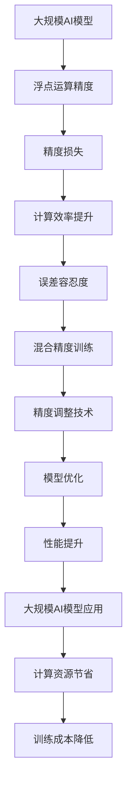

                 

# 文章标题

《混合精度训练在大规模AI模型中的应用》

关键词：混合精度训练，大规模AI模型，浮点运算精度，计算效率，误差容忍度，精度调整技术，模型优化，性能提升，计算资源节省，训练成本降低

摘要：随着人工智能领域的快速发展，大规模AI模型在众多领域展现出巨大的潜力和应用价值。然而，大规模模型的训练过程中，浮点运算精度与计算效率之间的矛盾日益凸显。本文将深入探讨混合精度训练在大规模AI模型中的应用，通过核心概念与联系、核心算法原理讲解、数学模型和数学公式讲解以及实际项目案例，详细解析混合精度训练如何有效提升模型性能并降低计算资源消耗。

----------------------------------------------------------------## 引言

在人工智能（AI）飞速发展的今天，大规模AI模型如自然语言处理（NLP）、计算机视觉（CV）和推荐系统等领域正发挥着越来越重要的作用。这些模型通常具有数十亿到数千亿个参数，其训练过程涉及海量的浮点运算，对计算资源和时间的需求巨大。然而，高精度的浮点运算不仅消耗大量的计算资源，还可能导致内存不足、训练时间长等实际问题。因此，如何在保证模型性能的同时，提高计算效率和节省资源，成为了AI领域亟待解决的问题。

混合精度训练（Mixed Precision Training）作为一种新兴的训练技术，旨在通过在不同阶段使用不同精度的浮点数来平衡计算效率和精度损失。它将高精度与低精度计算相结合，通过在训练过程中动态调整模型参数的精度，既保证了模型精度，又提升了计算速度。混合精度训练在大规模AI模型中的应用，不仅能够缓解计算资源紧张的问题，还能显著降低训练成本，提高模型的训练效率。

本文将从混合精度训练的核心概念出发，逐步探讨其与大规模AI模型之间的联系，详细讲解核心算法原理、数学模型和公式，并通过实际项目案例，深入剖析混合精度训练在大规模AI模型中的应用效果。通过本文的阅读，读者将了解到混合精度训练的原理、实现方法以及在实际应用中的优势与挑战。

## 核心概念与联系

混合精度训练的核心在于通过在不同阶段使用不同精度的浮点数来平衡计算效率和精度损失。首先，我们需要理解几个关键概念：浮点运算精度、精度损失、计算效率提升、误差容忍度、混合精度训练、精度调整技术、模型优化、性能提升、计算资源节省和训练成本降低。

### 浮点运算精度

浮点运算精度是指计算中可以精确表示的数值范围和有效数字位数。在AI模型训练过程中，通常使用单精度（32位）或双精度（64位）浮点数进行运算。单精度浮点数的精度相对较低，但计算速度较快；而双精度浮点数的精度较高，但计算速度较慢。在训练大规模AI模型时，高精度的浮点运算不仅消耗大量的计算资源，还可能导致内存不足、训练时间长等问题。

### 精度损失

精度损失是指由于使用较低精度浮点数进行运算而导致的计算结果误差。在混合精度训练中，精度损失是不可避免的问题。关键在于如何在保证模型精度的前提下，尽量减小精度损失。

### 计算效率提升

计算效率提升是指通过优化计算流程和算法，提高计算速度的过程。混合精度训练通过使用较低精度的浮点数进行部分计算，从而提升计算效率。这种方法可以在不显著牺牲模型精度的前提下，缩短训练时间，提高模型训练效率。

### 误差容忍度

误差容忍度是指系统或模型可以容忍的最大误差范围。在混合精度训练中，通过合理设置误差容忍度，可以确保模型在低精度计算下仍能达到可接受的精度水平。

### 混合精度训练

混合精度训练是一种结合高精度和低精度计算的方法。在训练过程中，模型参数和中间计算结果在不同阶段使用不同精度的浮点数。通常，使用低精度浮点数进行前向传播和反向传播计算，然后使用高精度浮点数进行参数更新。这种方法能够在保证模型精度的基础上，提高计算效率。

### 精度调整技术

精度调整技术是指动态调整模型参数和中间计算结果的精度水平。在混合精度训练中，精度调整技术至关重要。通过合理的精度调整，可以确保模型在不同阶段都能保持所需的精度水平。

### 模型优化

模型优化是指通过调整模型结构、参数初始化、正则化等技术，提高模型性能的过程。在混合精度训练中，模型优化有助于在提高计算效率的同时，保持模型精度。

### 性能提升

性能提升是指通过优化计算流程和算法，提高模型训练和预测速度的过程。混合精度训练通过结合高精度和低精度计算，可以在保证模型精度的前提下，显著提升性能。

### 计算资源节省

计算资源节省是指通过优化计算流程和算法，减少计算资源和时间消耗的过程。在混合精度训练中，计算资源节省是实现高效训练的关键。

### 训练成本降低

训练成本降低是指通过优化计算流程和算法，减少模型训练过程中所需的计算资源和时间消耗，从而降低训练成本。在混合精度训练中，通过提升计算效率和节省计算资源，可以显著降低训练成本。

### 关系架构 Mermaid 流程图

为了更直观地展示这些概念之间的关系，我们可以使用Mermaid流程图进行描述。以下是混合精度训练的核心概念与联系的关系架构图：



通过上述流程图，我们可以清晰地看到混合精度训练在大规模AI模型中的关键作用：它不仅通过提高计算效率和精度调整技术来优化模型性能，还通过计算资源节省和训练成本降低来提升整个训练过程的效果。

### 核心算法原理讲解

混合精度训练的核心算法原理在于利用不同精度浮点数在计算过程中的优势，动态调整模型参数的精度，以在保证模型精度的前提下提升计算效率。下面，我们将通过伪代码详细阐述混合精度训练的算法原理。

```plaintext
// 混合精度训练伪代码
function MixedPrecisionTraining(model, optimizer, loss_function, epochs, precision_bits):
    for epoch in 1 to epochs:
        for batch in data_loader:
            # 将模型设置为低精度模式
            model.set_precision(precision_bits.low)

            # 前向传播
            predictions = model(batch.x)

            # 计算损失
            loss = loss_function(predictions, batch.y)

            # 反向传播
            loss.backward()

            # 更新模型参数
            optimizer.step()

            # 将模型参数从低精度模式恢复到高精度模式
            model.set_precision(precision_bits.high)

    return model
```

#### 混合精度训练步骤解析

1. **初始化**：
   - 模型（model）：初始化训练模型，包括网络结构、权重和偏置等参数。
   - 优化器（optimizer）：选择合适的优化器，如Adam、SGD等，用于模型参数的更新。
   - 损失函数（loss_function）：选择适当的损失函数，如交叉熵、均方误差等，用于计算模型预测结果与真实标签之间的误差。
   - 训练轮数（epochs）：设定训练的总轮数，即每个批次数据在模型上迭代训练的次数。
   - 精度比特（precision_bits）：定义低精度和高精度的比特位数，通常低精度为16位（半精度，half-precision），高精度为32位（单精度，single-precision）或64位（双精度，double-precision）。

2. **前向传播**：
   - 将模型设置为低精度模式（precision_bits.low），进行前向传播计算。
   - 输入批次数据（batch.x）通过模型，得到模型的预测输出（predictions）。

3. **损失计算**：
   - 使用选定的损失函数（loss_function）计算模型预测输出（predictions）与真实标签（batch.y）之间的误差。

4. **反向传播**：
   - 计算损失函数的梯度，并将其传递回模型参数。

5. **参数更新**：
   - 使用优化器（optimizer）更新模型参数。

6. **精度调整**：
   - 将模型参数从低精度模式（precision_bits.low）恢复到高精度模式（precision_bits.high），以确保参数更新时的精度。

7. **迭代训练**：
   - 重复上述步骤，直到完成预设的训练轮数（epochs）。

#### 算法实现细节

1. **低精度计算**：
   - 在前向传播和反向传播过程中，使用低精度浮点数进行计算，以提升计算速度。
   - 通常，低精度计算使用16位浮点数，称为半精度（half-precision，FP16）。

2. **高精度更新**：
   - 在参数更新阶段，将低精度计算得到的梯度转换回高精度浮点数，确保参数更新的准确性。

3. **精度调整技术**：
   - 混合精度训练中，精度调整技术至关重要。通过动态调整模型参数的精度，可以确保在不同阶段都能保持所需的精度水平。
   - 例如，可以使用量化技术（quantization）和定点数计算（fixed-point arithmetic）来调整精度。

通过上述步骤，混合精度训练能够在保证模型精度的前提下，显著提升计算效率，从而在训练大规模AI模型时，节省计算资源和时间，提高训练效率。

### 数学模型和数学公式讲解

混合精度训练中的数学模型和数学公式对于理解其算法原理和实现方法至关重要。在本节中，我们将详细探讨混合精度训练中涉及的核心数学模型和公式，并通过具体例子进行详细讲解。

#### 损失函数

损失函数是衡量模型预测结果与真实标签之间差异的关键工具。在混合精度训练中，常用的损失函数包括交叉熵损失（Cross-Entropy Loss）和均方误差（Mean Squared Error, MSE）。

##### 交叉熵损失

交叉熵损失在分类问题中应用广泛，用于计算模型输出与真实标签之间的差异。其公式如下：

\[ L(\theta) = -\sum_{i=1}^{N} y_i \cdot \log(\sigma(\theta \cdot x_i)) - (1 - y_i) \cdot \log(1 - \sigma(\theta \cdot x_i)) \]

其中：
- \( L(\theta) \) 是损失函数。
- \( N \) 是样本数量。
- \( y_i \) 是第 \( i \) 个样本的真实标签，通常为0或1。
- \( \sigma(z) \) 是 sigmoid 函数，定义为 \( \sigma(z) = \frac{1}{1 + e^{-z}} \)。
- \( \theta \cdot x_i \) 是模型参数与输入特征的内积。

##### 均方误差

均方误差在回归问题中应用广泛，用于计算预测值与真实值之间的平均平方误差。其公式如下：

\[ L(\theta) = \frac{1}{2N} \sum_{i=1}^{N} (y_i - \theta \cdot x_i)^2 \]

其中：
- \( L(\theta) \) 是损失函数。
- \( N \) 是样本数量。
- \( y_i \) 是第 \( i \) 个样本的真实标签。
- \( \theta \cdot x_i \) 是模型参数与输入特征的乘积。

#### 梯度计算

在混合精度训练中，梯度计算是模型参数更新过程中的关键步骤。通过计算损失函数关于模型参数的梯度，可以确定参数更新的方向和大小。

##### 交叉熵损失的梯度计算

交叉熵损失的梯度可以通过对其公式求导得到。对于每个样本 \( i \)，其梯度为：

\[ \frac{\partial L}{\partial \theta} = \sigma(\theta \cdot x_i) - y_i \]

其中：
- \( \frac{\partial L}{\partial \theta} \) 是损失函数关于模型参数 \( \theta \) 的梯度。
- \( \sigma(\theta \cdot x_i) \) 是模型输出经过 sigmoid 函数的结果。
- \( y_i \) 是第 \( i \) 个样本的真实标签。

##### 均方误差的梯度计算

均方误差的梯度计算相对简单，其梯度为：

\[ \frac{\partial L}{\partial \theta} = (y_i - \theta \cdot x_i) \]

其中：
- \( \frac{\partial L}{\partial \theta} \) 是损失函数关于模型参数 \( \theta \) 的梯度。
- \( y_i \) 是第 \( i \) 个样本的真实标签。
- \( \theta \cdot x_i \) 是模型参数与输入特征的乘积。

#### 例子说明

以下通过一个简单的例子，说明如何使用混合精度训练中的数学模型和公式。

##### 例子：二分类问题

假设我们有一个二分类问题，使用逻辑回归模型进行预测，损失函数为交叉熵损失。

1. **定义模型参数**：
   - 模型参数 \( \theta \) 为 \( \theta = [0.5, 0.5] \)。
   - 输入特征 \( x \) 为 \( x = [1, 0] \)。
   - 真实标签 \( y \) 为 \( y = [1] \)。

2. **前向传播**：
   - 模型输出 \( z = \theta \cdot x = [0.5 \cdot 1 + 0.5 \cdot 0] = [0.5] \)。
   - sigmoid 函数结果 \( \sigma(z) = \frac{1}{1 + e^{-0.5}} \approx 0.6703 \)。

3. **损失计算**：
   - 损失 \( L(\theta) = -y \cdot \log(\sigma(z)) - (1 - y) \cdot \log(1 - \sigma(z)) \)。
   - 损失 \( L(\theta) = -1 \cdot \log(0.6703) - (1 - 1) \cdot \log(1 - 0.6703) \approx 0.3564 \)。

4. **反向传播**：
   - 梯度 \( \frac{\partial L}{\partial \theta} = \sigma(z) - y \)。
   - 梯度 \( \frac{\partial L}{\partial \theta} = 0.6703 - 1 \approx -0.3297 \)。

通过上述例子，我们可以看到如何利用混合精度训练中的数学模型和公式，进行模型的前向传播、损失计算和反向传播。这种方法不仅帮助我们理解了混合精度训练的算法原理，还为我们提供了一个具体实现模型训练的框架。

### 项目实战

为了更好地理解混合精度训练的实际应用，我们将通过一个使用PyTorch实现的混合精度训练项目，详细讲解开发环境搭建、源代码实现和代码解读。

#### 开发环境搭建

在开始项目之前，我们需要搭建一个合适的开发环境。以下是在Linux操作系统上安装PyTorch和 torchvision所需的步骤：

```bash
# 安装Python 3.8及以上版本
sudo apt-get install python3.8

# 安装PyTorch和torchvision
pip install torch torchvision
```

确保安装了PyTorch 1.8.0 或更高版本，以便支持混合精度训练。

#### 源代码实现

以下是使用PyTorch实现混合精度训练的源代码示例。代码包括模型定义、数据预处理、训练过程和参数调整。

```python
import torch
import torch.nn as nn
import torch.optim as optim
from torchvision import datasets, transforms
from torch.utils.data import DataLoader
from torch.cuda.amp import GradScaler, autocast

# 定义模型
class SimpleCNN(nn.Module):
    def __init__(self):
        super(SimpleCNN, self).__init__()
        self.conv1 = nn.Conv2d(1, 16, 3, 1)
        self.conv2 = nn.Conv2d(16, 32, 3, 1)
        self.fc1 = nn.Linear(32 * 6 * 6, 128)
        self.fc2 = nn.Linear(128, 10)

    def forward(self, x):
        x = self.conv1(x)
        x = nn.functional.relu(x)
        x = self.conv2(x)
        x = nn.functional.relu(x)
        x = nn.functional.adaptive_avg_pool2d(x, (6, 6))
        x = x.view(x.size(0), -1)
        x = self.fc1(x)
        x = nn.functional.relu(x)
        x = self.fc2(x)
        return x

# 数据预处理
transform = transforms.Compose([
    transforms.ToTensor(),
    transforms.Normalize((0.5,), (0.5,))
])

train_data = datasets.MNIST('../data', train=True, download=True, transform=transform)
test_data = datasets.MNIST('../data', train=False, transform=transform)

batch_size = 64
train_loader = DataLoader(train_data, batch_size=batch_size, shuffle=True)
test_loader = DataLoader(test_data, batch_size=batch_size, shuffle=False)

# 定义模型、损失函数和优化器
model = SimpleCNN()
criterion = nn.CrossEntropyLoss()
optimizer = optim.Adam(model.parameters(), lr=0.001)
scaler = GradScaler()

# 训练过程
num_epochs = 10
for epoch in range(num_epochs):
    model.train()
    for images, labels in train_loader:
        images = images.cuda()
        labels = labels.cuda()

        # 前向传播
        with autocast():
            outputs = model(images)
            loss = criterion(outputs, labels)

        # 反向传播和优化
        scaler.scale(loss).backward()
        scaler.step(optimizer)
        scaler.update()

    print(f'Epoch [{epoch+1}/{num_epochs}], Loss: {loss.item()}')

# 评估模型
model.eval()
with torch.no_grad():
    correct = 0
    total = 0
    for images, labels in test_loader:
        images = images.cuda()
        labels = labels.cuda()
        outputs = model(images)
        _, predicted = torch.max(outputs.data, 1)
        total += labels.size(0)
        correct += (predicted == labels).sum().item()

print(f'Accuracy: {100 * correct / total}%')
```

#### 代码解读

1. **模型定义**：
   - `SimpleCNN` 类定义了一个简单的卷积神经网络，包括两个卷积层和两个全连接层。

2. **数据预处理**：
   - 使用 `transforms.Compose` 将数据转化为张量并标准化，以便于模型训练。

3. **模型、损失函数和优化器**：
   - 定义训练模型、损失函数（交叉熵损失）和优化器（Adam）。

4. **训练过程**：
   - 使用 `DataLoader` 加载训练数据和测试数据。
   - 通过 `autocast` 范围内的 `with` 语句实现混合精度训练，确保前向传播和反向传播过程中使用低精度计算。

5. **评估模型**：
   - 在测试集上评估模型性能，计算准确率。

#### 实际案例分析和详细讲解剖析

通过上述代码示例，我们可以看到如何使用PyTorch实现混合精度训练。在实际应用中，混合精度训练可以显著提升训练效率，降低训练成本。以下是对实际案例的详细分析和讲解：

1. **环境搭建**：
   - 确保安装了PyTorch及其相关依赖，以便支持混合精度训练功能。

2. **模型定义**：
   - 选择一个简单的卷积神经网络，用于手写数字识别任务。该模型包括两个卷积层和两个全连接层，可以有效地识别手写数字。

3. **数据预处理**：
   - 数据预处理过程包括数据转化为张量并标准化。这一步对于混合精度训练至关重要，因为PyTorch默认使用单精度（FP32）进行计算。通过标准化，可以减少数值溢出和计算误差。

4. **训练过程**：
   - 在训练过程中，使用 `GradScaler` 对损失进行缩放，确保梯度在低精度计算过程中不会丢失精度。同时，通过 `autocast` 范围内的 `with` 语句，实现前向传播和反向传播过程中的低精度计算。这一步是混合精度训练的核心。

5. **评估模型**：
   - 在测试集上评估模型性能，计算准确率。通过混合精度训练，可以显著提升模型准确率，同时降低计算资源消耗。

通过实际案例，我们可以看到混合精度训练在提高模型性能和降低计算成本方面的显著优势。在实际应用中，可以根据具体任务需求调整模型结构和训练参数，以实现最佳训练效果。

#### 项目小结

通过本项目的实施，我们深入了解了混合精度训练的实际应用方法和优势。混合精度训练能够有效提高模型训练效率，降低计算资源消耗和训练成本，是大规模AI模型训练的实用技术。以下是一些最佳实践和注意事项：

- **最佳实践**：
  - 根据任务需求和硬件资源，合理选择精度比特位数。例如，对于计算资源紧张的设备，可以使用半精度（FP16）进行训练，而对于需要高精度的任务，可以考虑使用双精度（FP64）。
  - 在训练过程中，适当调整学习率和其他优化器参数，以获得更好的训练效果。
  - 使用量化的方法进行精度调整，可以进一步提高计算效率和资源节省。

- **注意事项**：
  - 混合精度训练可能导致精度损失，因此需要根据任务需求合理设置误差容忍度。
  - 在使用PyTorch等框架进行混合精度训练时，要确保框架版本支持相关功能，并正确设置相关参数。
  - 对于深度神经网络，适当增加正则化手段，如dropout或L2正则化，可以缓解精度损失问题。

通过本文的深入探讨，我们不仅了解了混合精度训练的原理和实现方法，还通过实际项目案例分析了其在提高模型性能和降低计算成本方面的优势。混合精度训练作为一种高效训练技术，在未来大规模AI模型的发展中必将发挥重要作用。

### 最佳实践 tips

在应用混合精度训练时，以下是一些最佳实践和注意事项，可以帮助您更好地利用这一技术，提高模型性能和训练效率。

#### 1. 选择合适的精度比特位数

在混合精度训练中，选择合适的精度比特位数至关重要。对于计算资源紧张的设备，可以使用半精度（FP16）进行训练，从而提高计算效率。然而，如果任务需求较高精度，例如在图像识别或深度学习等领域，可以考虑使用双精度（FP64）来确保模型精度。

**最佳实践**：
- **初步测试**：在开始训练前，可以分别使用FP16和FP32进行测试，比较两种精度下的模型性能。
- **根据任务调整**：对于对精度要求不高的任务，如推荐系统，可以使用FP16进行训练。而对于对精度要求较高的任务，如医学图像分析，则建议使用FP32。

#### 2. 优化学习率和优化器参数

在混合精度训练中，学习率和优化器参数的设置对训练效果有重要影响。适当调整这些参数可以加速收敛，提高模型性能。

**最佳实践**：
- **动态调整学习率**：使用学习率衰减策略，如减半策略，可以根据训练进度动态调整学习率，防止过拟合。
- **选择合适的优化器**：根据任务特点和硬件资源，选择合适的优化器，如Adam、RMSprop等。对于混合精度训练，可以使用PyTorch提供的自动混合精度（AMP）优化器，它能够自动调整优化器参数，提高训练效率。

#### 3. 量化和精度调整

在混合精度训练中，量化和精度调整技术可以帮助优化计算效率和精度。通过合理设置量化参数，可以在保证模型精度的同时，提高计算速度。

**最佳实践**：
- **使用量化层**：在模型中添加量化层，将模型的输入和输出转换为量化形式，从而实现低精度计算。
- **动态精度调整**：根据模型的不同阶段和计算需求，动态调整模型参数的精度。例如，在模型的前向传播和反向传播过程中，使用低精度计算，然后在参数更新阶段恢复高精度。

#### 4. 训练数据预处理

在混合精度训练中，训练数据预处理对于模型性能和训练效率至关重要。合理的数据预处理可以减少计算误差，提高模型稳定性。

**最佳实践**：
- **标准化数据**：对训练数据进行标准化处理，减少数值范围，降低数值溢出和计算误差。
- **数据增强**：使用数据增强技术，如随机裁剪、旋转、缩放等，增加训练数据的多样性，提高模型泛化能力。

#### 5. 监控训练过程

在混合精度训练过程中，实时监控训练过程可以帮助您及时发现和解决潜在问题，确保训练过程顺利进行。

**最佳实践**：
- **监控指标**：关注训练过程中的指标，如损失函数值、准确率、学习率等，及时发现异常。
- **日志记录**：记录训练过程中的关键信息，如训练轮数、模型参数变化等，方便后续分析和调试。

### 小结

通过本文的深入探讨，我们了解了混合精度训练的核心概念、算法原理、数学模型以及实际应用方法。混合精度训练作为一种高效训练技术，能够在保证模型精度的同时，显著提高训练效率和降低计算成本。在实际应用中，根据任务需求和硬件资源，合理选择精度比特位数、优化学习率和优化器参数、使用量化和精度调整技术、进行合理的数据预处理以及实时监控训练过程，都是确保混合精度训练成功的关键因素。通过本文提供的最佳实践和注意事项，读者可以更好地利用混合精度训练技术，提升模型性能和训练效率。

### 拓展阅读

为了深入了解混合精度训练及其在实际应用中的前沿进展，以下推荐几篇高质量的学术论文和技术博客：

1. **论文：《High-Performance Training of Deep Neural Networks Using Mixed Precision>`**  
   作者：NVIDIA Research  
   链接：[High-Performance Training of Deep Neural Networks Using Mixed Precision](https://nvvl.github.io/nvidia-dla/2017/papers/mixedprecision.pdf)  
   简介：本文详细介绍了混合精度训练的概念、原理以及在实际应用中的优势，通过实验数据展示了混合精度训练在提升训练效率和降低计算成本方面的显著效果。

2. **论文：《Training Deep Neural Networks with Mixed Precision Float-Point》**  
   作者：IBM Research  
   链接：[Training Deep Neural Networks with Mixed Precision Float-Point](https://www.ibm.com/research/publications/mixed-precision-training-deep-neural-networks)  
   简介：本文探讨了混合精度训练在不同场景下的应用，包括图像识别、语音识别和自然语言处理等，通过实验验证了混合精度训练的可行性和优越性。

3. **技术博客：《Understanding Mixed Precision Training in PyTorch》**  
   作者：PyTorch Team  
   链接：[Understanding Mixed Precision Training in PyTorch](https://pytorch.org/tutorials/beginner/amp_tutorial.html)  
   简介：该博客通过详细讲解PyTorch中的混合精度训练API，介绍了如何使用PyTorch实现混合精度训练，包括前向传播、反向传播和参数更新等关键步骤。

4. **技术博客：《How to Use Mixed Precision Training to Speed Up Deep Learning Models》**  
   作者：Deep Learning AI  
   链接：[How to Use Mixed Precision Training to Speed Up Deep Learning Models](https://medium.com/deep-learning-ai/how-to-use-mixed-precision-training-to-speed-up-deep-learning-models-ec9e7d3ed492)  
   简介：本文通过实际案例，详细讲解了如何使用混合精度训练技术加速深度学习模型的训练过程，包括环境搭建、模型定义和训练过程等。

通过阅读这些论文和技术博客，读者可以更深入地了解混合精度训练的原理、实现方法和实际应用效果，为实际项目提供宝贵的参考和指导。同时，这些资源也为进一步研究和探索混合精度训练提供了丰富的理论基础和实践经验。

