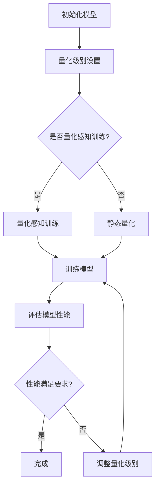

                 


为了撰写一篇高质量的、字数在8000-12000字的技术博客文章，我们需要遵循以下步骤：

### 1. 确定主题与目标读者
- 主题：《混合精度量化在移动端AI加速中的实践》
- 目标读者：人工智能领域的专业人士、研究人员、移动端开发者、以及对AI加速技术感兴趣的技术爱好者。

### 2. 文章结构设计
- 引言
- 混合精度量化背景介绍
- 混合精度量化原理
- 混合精度量化在移动端AI加速中的应用
- 实际案例分析与实战
- 性能评估与优化
- 总结与未来展望
- 附录：相关资源与工具
- 参考文献

### 3. 详细内容规划
#### 引言
- 文章目的与重要性
- 阅读指南

#### 混合精度量化背景介绍
- AI在移动端的挑战
- 量化技术的概念与作用

#### 混合精度量化原理
- 核心概念与联系
- Mermaid流程图
- 伪代码展示
- 数学模型与公式讲解

#### 混合精度量化在移动端AI加速中的应用
- 应用场景
- 技术优势
- 挑战与解决方案

#### 实际案例分析与实战
- 开发环境搭建
- 源代码实现与解读
- 代码应用解读与分析
- 项目案例分析
- 项目小结

#### 性能评估与优化
- 性能评估指标
- 评估方法
- 实际案例
- 优化策略

#### 总结与未来展望
- 技术总结
- 未来发展趋势
- 研究方向与挑战

#### 附录：相关资源与工具
- 量化工具
- 开发资源
- 参考文献

### 4. 内容编写
- 遵循markdown格式
- 每个小节都要详细且具体
- 使用Mermaid、伪代码、LaTeX等工具增强表达
- 包括最佳实践、注意事项、拓展阅读等

### 5. 审稿与修订
- 审查文章结构、逻辑性和准确性
- 确保代码示例可运行、无错误
- 修订语言表达和错别字

### 6. 作者信息与格式确认
- 确保文章末尾包含正确的作者信息
- 验证markdown格式正确

### 7. 字数控制
- 控制文章总字数在8000-12000字之间

通过以上步骤，我们可以确保文章内容丰富、逻辑清晰、语言精炼，从而撰写出一篇高质量的技术博客文章。接下来，我们将按照这个计划逐步完成每个部分的撰写。让我们一起开始吧！### 引言

在现代人工智能（AI）技术飞速发展的背景下，移动端设备正在成为人们生活中不可或缺的一部分。无论是智能手机、平板电脑还是可穿戴设备，这些设备都在我们的日常生活中扮演着重要角色。然而，随着AI模型变得越来越复杂和庞大，如何在有限的硬件资源下实现高效的AI加速成为了一个亟待解决的问题。

本文将重点探讨混合精度量化技术在移动端AI加速中的实践。混合精度量化是一种通过降低模型参数的精度来减少计算复杂度和存储需求的量化技术。它能够在不显著牺牲模型性能的前提下，大幅提高计算效率和减少内存占用。这对于移动端设备来说尤为重要，因为移动端设备的计算资源相对有限，且电池续航也是一个重要的考虑因素。

混合精度量化技术不仅仅是一种优化计算资源的方法，它也是推动AI技术向移动端拓展的关键技术之一。随着5G网络的普及和边缘计算的发展，移动端AI的应用场景越来越广泛，从图像识别、语音识别到自然语言处理，都在移动设备上得到了实际的应用。然而，传统的AI模型往往需要大量的计算资源和内存支持，这无疑限制了其在移动端的应用范围。混合精度量化技术的出现，为这一问题提供了一种有效的解决方案。

本文将分为以下几个部分进行详细讨论：

1. **混合精度量化背景介绍**：介绍AI在移动端的发展背景，以及量化技术在AI加速中的重要作用。
2. **混合精度量化原理**：详细解释混合精度量化的概念、工作原理和优缺点。
3. **混合精度量化在移动端AI加速中的应用**：分析混合精度量化在移动端AI加速中的实际应用场景和优势。
4. **实际案例分析与实战**：通过具体案例，展示如何在移动端实现混合精度量化技术，并提供代码实现和解读。
5. **性能评估与优化**：介绍如何评估混合精度量化技术的性能，并提出优化策略。
6. **总结与未来展望**：总结本文的核心观点，并探讨混合精度量化技术在移动端AI加速中的未来发展。

通过本文的阅读，读者将能够深入了解混合精度量化技术在移动端AI加速中的实践应用，掌握相关技术和方法，并为未来在移动端AI领域的发展提供参考。接下来，我们将首先对混合精度量化技术进行详细的背景介绍。

---

**关键词**：混合精度量化、移动端AI、AI加速、量化技术、计算效率、存储优化

**摘要**：
本文系统地介绍了混合精度量化技术，并重点探讨了其在移动端AI加速中的应用。通过详细的理论分析、实际案例和性能评估，本文展示了混合精度量化技术如何有效地提升移动端AI模型的计算效率和资源利用率，为移动端AI技术的发展提供了有力的支持。本文对于人工智能领域的研究人员、开发者以及相关技术爱好者具有重要的参考价值。

## 混合精度量化背景介绍

### AI在移动端的发展

随着移动设备的普及，人工智能（AI）技术逐渐从高性能计算环境转向了移动端设备。移动端AI的发展可以追溯到智能手机中开始集成高性能的CPU和GPU。随后，随着神经网络计算需求的增长，专用AI硬件，如神经处理单元（NPU）和数字信号处理器（DSP），开始在移动设备上得到应用。这些硬件加速了AI模型在移动端设备的运行速度，使得实时处理图像、语音、自然语言等任务成为可能。

移动设备在计算能力、存储能力和电池续航等方面与高性能计算设备相比存在显著差异。移动设备的处理能力通常较低，存储空间有限，且需要长时间续航以满足用户的日常使用需求。这些限制使得在移动端实现高效的人工智能算法成为一个挑战。为了克服这些限制，研究人员和开发者开始探索各种技术，其中包括量化技术。

### 量化技术的概念与作用

量化技术是一种通过调整模型参数的精度来优化AI模型性能的方法。传统的AI模型通常使用32位浮点数来表示模型参数，这种高精度参数能够提供非常好的数值表示能力，但同时也带来了高计算复杂度和存储需求。特别是在移动端设备上，这些高精度参数会导致计算速度变慢，内存占用增加，进而影响电池续航和用户体验。

量化技术通过将部分或全部模型参数的精度降低到16位或8位，从而减少计算复杂度和存储需求。量化技术可以分为以下几种类型：

1. **静态量化（Static Quantization）**：在训练过程中，模型参数的精度被预先确定，并且在整个训练过程中保持不变。
2. **动态量化（Dynamic Quantization）**：在训练过程中，模型参数的精度根据实际情况动态调整，以平衡计算效率和模型精度。
3. **量化感知训练（Quantization-Aware Training）**：在训练过程中，模型同时优化参数的精度和模型性能，以找到最佳的量化策略。

量化技术的引入，不仅降低了模型的计算复杂度和存储需求，还能够提高模型的运行速度，从而满足移动端设备的计算需求。此外，量化技术还可以帮助开发者更好地利用移动设备的硬件资源，如NPU和DSP，以实现更高效的计算。

### 混合精度量化技术的概念

混合精度量化技术是一种结合了静态量和动态量的量化方法，旨在通过使用不同精度的参数来优化模型性能。在这种方法中，模型的一部分参数使用高精度（如32位浮点数），而另一部分参数使用较低精度（如16位或8位整数）。这种混合精度的设计可以在保持模型精度的同时，降低计算复杂度和存储需求。

混合精度量化技术的核心思想是利用不同精度参数的优势，实现计算效率和模型性能的平衡。例如，高精度参数可以用于敏感的计算任务，如激活函数的运算，而低精度参数则用于较少影响模型性能的计算任务，如权重更新。

### 混合精度量化的优点

混合精度量化技术具有以下优点：

1. **计算效率提高**：通过使用低精度参数，模型的计算速度可以得到显著提升，这对于移动端设备尤为重要，因为移动设备通常需要处理实时任务。
2. **存储需求降低**：低精度参数需要的存储空间更少，这有助于减少内存占用，从而提高模型的可部署性。
3. **降低能耗**：计算复杂度的降低也意味着能耗的减少，这对于需要长时间续航的移动设备来说是一个重要的优势。

### 混合精度量化的应用场景

混合精度量化技术在移动端AI中的应用场景非常广泛，以下是一些典型的应用场景：

1. **图像识别**：在移动设备上实现快速、准确的图像识别，如人脸识别、场景分类等。
2. **语音识别**：在移动设备上实现实时语音识别，如语音助手、语音翻译等。
3. **自然语言处理**：在移动设备上实现自然语言处理任务，如文本分类、情感分析等。
4. **增强现实（AR）与虚拟现实（VR）**：在AR/VR应用中，实现实时渲染和高性能计算。

通过混合精度量化技术，移动端设备能够在有限的资源下实现高效的人工智能任务处理，为用户带来更好的体验。在接下来的部分中，我们将详细探讨混合精度量化的原理和具体实现方法。

## 混合精度量化原理

### 核心概念与联系

混合精度量化技术的核心概念在于使用不同精度的数值来表示模型参数，从而在保持模型性能的同时，降低计算复杂度和存储需求。具体来说，混合精度量化技术主要涉及以下三种类型：

1. **低精度量化**：将模型参数的精度降低到16位浮点数或8位整数，以减少计算复杂度和存储需求。
2. **高精度量化**：保留模型中某些关键参数的高精度表示（如32位浮点数），以保持模型的准确性。
3. **动态调整**：根据计算任务的需求，动态调整参数的精度，以实现计算效率和模型性能的平衡。

混合精度量化技术的实现依赖于以下几个关键概念：

- **量化级别**：量化级别决定了参数的精度，例如，16位量化表示有215个可能的数值，而32位量化表示有232个可能的数值。
- **量化范围**：量化范围定义了参数的取值范围，通常使用动态范围调整技术来平衡精度和性能。
- **量化感知训练**：在模型训练过程中，考虑参数的量化影响，通过调整学习率、优化算法等手段来提高模型对量化操作的鲁棒性。

这些概念之间的联系在于，它们共同构成了混合精度量化技术的基础，使得模型可以在不同精度下保持良好的性能。

### Mermaid流程图 - 混合精度量化技术工作流程

以下是混合精度量化技术的工作流程的Mermaid流程图：



#### 流程图说明：

1. **初始化模型**：首先初始化一个标准的AI模型，该模型通常使用32位浮点数表示参数。
2. **量化级别设置**：根据硬件和性能需求，设置模型参数的量化级别，可以是16位、8位等。
3. **量化感知训练**：如果选择量化感知训练，将对模型进行特殊训练，使得模型能够适应不同精度的参数表示。
4. **静态量化**：如果不采用量化感知训练，则进行静态量化，将参数的精度固定。
5. **训练模型**：使用量化后的模型进行训练，调整参数以优化模型性能。
6. **评估模型性能**：评估量化后的模型性能，包括准确性、速度和能耗等指标。
7. **调整量化级别**：如果性能不满足要求，可以调整量化级别或采用量化感知训练。
8. **完成**：当性能满足要求后，完成量化过程，得到优化的AI模型。

通过这个流程图，我们可以清晰地了解混合精度量化技术的实施步骤和关键环节。

### 伪代码 - 混合精度量化算法原理

以下是一个简化的伪代码，用于描述混合精度量化算法的基本原理：

```python
# 初始化模型
model = initialize_model()

# 设置量化级别
quantization_levels = set_quantization_levels([16, 32])

# 选择量化方法
quantization_method = select_quantization_method()

# 量化感知训练或静态量化
if quantization_aware_training:
    model = quantization_aware_training(model, quantization_levels)
else:
    model = static_quantization(model, quantization_levels)

# 训练模型
model = train_model(model)

# 评估模型性能
performance = evaluate_model_performance(model)

# 调整量化级别或方法
while not performance_satisfactory:
    if quantization_aware_training:
        model = quantization_aware_training(model, quantization_levels)
    else:
        quantization_levels = adjust_quantization_levels(quantization_levels)
        model = static_quantization(model, quantization_levels)
    performance = evaluate_model_performance(model)

# 完成量化过程
model = finalize_quantized_model(model)
```

#### 伪代码说明：

1. **初始化模型**：创建一个初始化的AI模型。
2. **设置量化级别**：为模型参数设置量化级别（如16位或32位）。
3. **选择量化方法**：选择量化方法（量化感知训练或静态量化）。
4. **量化感知训练**：如果选择量化感知训练，对模型进行训练，使得模型能够适应不同精度的参数。
5. **静态量化**：如果选择静态量化，将参数的精度固定。
6. **训练模型**：使用量化后的模型进行训练。
7. **评估模型性能**：评估量化后的模型性能。
8. **调整量化级别或方法**：如果性能不满足要求，调整量化级别或重新选择量化方法。
9. **完成量化过程**：当模型性能满足要求后，完成量化过程，得到优化的AI模型。

通过上述伪代码，我们可以看到混合精度量化算法的基本框架和关键步骤，为实际实现提供指导。

### 数学模型与公式讲解

在混合精度量化技术中，数学模型和公式起到了关键作用，它们不仅定义了量化操作，还指导了量化级别和范围的选择。以下将详细解释几个关键的数学模型和公式，并给出具体的举例说明。

#### 1. 量化操作

量化操作是将连续的浮点数值映射到离散的量化级别上。量化操作可以表示为：

\[ Q(x) = \text{round}(x / \Delta) \times \Delta \]

其中，\( x \) 是需要量化的浮点数值，\( \Delta \) 是量化步长，而 \( \text{round} \) 函数用于将数值四舍五入到最接近的量化级别。

举例说明：

假设我们有一个浮点数值 \( x = 2.5 \)，量化级别设置为16位（即 \( \Delta = 2^{-15} \)）。那么：

\[ Q(x) = \text{round}(2.5 / 2^{-15}) \times 2^{-15} = \text{round}(2.5 \times 2^{15}) \times 2^{-15} = 32768 \]

这意味着 \( x = 2.5 \) 被量化为 32768，即整数表示。

#### 2. 量化步长计算

量化步长 \( \Delta \) 的选择至关重要，它决定了量化后的精度。量化步长的计算可以使用以下公式：

\[ \Delta = \frac{2^b - 1}{2^s} \]

其中，\( b \) 是量化位数（如16位或32位），\( s \) 是偏移量。对于16位量化，通常 \( s = 15 \)，而对于32位量化，通常 \( s = 31 \)。

举例说明：

对于16位量化（\( b = 16 \)，\( s = 15 \)）：

\[ \Delta = \frac{2^{16} - 1}{2^{15}} = \frac{65536 - 1}{32768} = 1 \]

这意味着每个量化级别之间的间隔是1。

对于32位量化（\( b = 32 \)，\( s = 31 \)）：

\[ \Delta = \frac{2^{32} - 1}{2^{31}} = \frac{4294967296 - 1}{2147483648} = 1 \]

同样，每个量化级别之间的间隔是1。

#### 3. 量化范围

量化范围定义了量化操作可以取的值范围。量化范围可以使用以下公式计算：

\[ \text{Range} = \Delta \times (2^b - 1) \]

举例说明：

对于16位量化：

\[ \text{Range} = 1 \times (2^{16} - 1) = 65536 - 1 = 65535 \]

这意味着量化范围是从 -32768 到 32767。

对于32位量化：

\[ \text{Range} = 1 \times (2^{32} - 1) = 4294967296 - 1 = 4294967295 \]

这意味着量化范围是从 -2147483648 到 2147483647。

#### 4. 恢复量化值

量化后的值可能需要恢复到原始浮点数。恢复量化值可以使用以下公式：

\[ x_{\text{original}} = Q(x) \times \Delta \]

举例说明：

对于量化值 32768 和量化步长 1：

\[ x_{\text{original}} = 32768 \times 1 = 32768 \]

这意味着量化值 32768 对应的原始浮点数是 32768。

### LaTeX公式

为了更好地表达上述数学模型和公式，以下使用LaTeX格式进行展示：

#### 量化操作

\[ Q(x) = \text{round}\left(\frac{x}{\Delta}\right) \times \Delta \]

#### 量化步长计算

\[ \Delta = \frac{2^b - 1}{2^s} \]

#### 量化范围

\[ \text{Range} = \Delta \times (2^b - 1) \]

#### 恢复量化值

\[ x_{\text{original}} = Q(x) \times \Delta \]

通过上述数学模型和公式的详细解释和举例，我们可以更好地理解混合精度量化技术中的关键计算过程。这些数学工具为量化操作的实现提供了理论基础，也为后续的性能评估和优化提供了参考。

### AI加速技术概述

### AI加速的基本概念

人工智能（AI）加速是指通过优化算法、硬件和软件技术，提高AI模型在计算、存储和能效方面的性能，以满足实时应用的需求。AI加速的目标是减少计算时间、降低能耗，同时提高模型精度和可靠性。AI加速技术广泛应用于各种领域，包括自动驾驶、医疗诊断、语音识别、图像处理和自然语言处理等。

### 移动端AI加速的需求

移动端设备在计算资源、存储空间和电池续航方面存在诸多限制，这使得传统的AI模型在移动端的应用面临巨大挑战。为了实现高效、低功耗的AI加速，移动端设备需要以下几方面的支持：

1. **计算能力**：移动设备通常配备有限的CPU和GPU资源，难以支持复杂AI模型的运行。因此，需要开发专门的AI加速硬件，如NPU（神经网络处理器）和DSP（数字信号处理器）。
2. **存储空间**：移动设备的存储空间有限，需要高效的存储和加载机制，以便快速访问和存储AI模型和数据。
3. **电池续航**：移动设备需要长时间续航，低功耗的AI加速技术有助于延长电池使用时间。

### AI加速技术的发展历程

AI加速技术的发展经历了多个阶段，从最初的通用计算到专用硬件，再到近年来的人工智能加速器，以下是其主要发展历程：

1. **早期阶段**：在AI模型的早期应用中，主要依赖于通用CPU和GPU进行计算。尽管这些硬件在图像处理和机器学习领域表现良好，但在处理复杂模型时仍存在性能瓶颈。
2. **专用硬件阶段**：为了满足AI模型加速的需求，研究人员开发了专门的AI加速硬件，如FPGA（现场可编程门阵列）、ASIC（专用集成电路）和NPU。这些硬件设计专门用于优化神经网络计算，从而显著提高了计算效率。
3. **人工智能加速器阶段**：近年来，人工智能加速器（如Tensor Processing Unit, TPU）和专用AI芯片（如英伟达的GPU）得到了广泛应用。这些加速器通过并行计算和专用架构，进一步提升了AI模型的计算性能。

### AI加速技术的重要性

AI加速技术在移动端的重要性体现在以下几个方面：

1. **提升用户体验**：通过加速AI模型，移动设备可以实时处理图像、语音和自然语言等任务，从而提升用户交互体验。
2. **降低能耗**：AI加速技术有助于降低计算能耗，延长电池续航时间，满足用户对移动设备长时间使用需求。
3. **拓展应用场景**：AI加速技术使得更多的AI应用成为可能，如移动医疗、移动教育和移动游戏等，进一步丰富了移动端应用场景。

### 移动端AI加速技术的分类

移动端AI加速技术主要包括以下几类：

1. **硬件加速**：通过专用硬件（如NPU、DSP、TPU等）进行AI模型加速，这些硬件能够显著提升计算效率。
2. **算法优化**：通过优化算法（如量化、剪枝、蒸馏等）减少模型计算复杂度和存储需求，提高模型在移动设备上的运行效率。
3. **分布式计算**：通过分布式计算架构，将复杂的AI模型分解为多个部分，在不同设备上并行计算，从而提高整体计算性能。
4. **模型压缩**：通过模型压缩技术（如知识蒸馏、剪枝等）减少模型的大小，便于在移动设备上部署和运行。

### AI加速技术的工作原理

AI加速技术的工作原理通常包括以下几个步骤：

1. **模型优化**：通过算法优化技术对原始模型进行优化，以减少计算复杂度和存储需求。
2. **硬件调度**：根据硬件资源的特点和性能，对AI模型进行调度和分配，以最大化硬件利用率和计算性能。
3. **并行计算**：通过并行计算技术，将复杂的计算任务分解为多个子任务，在不同硬件单元上同时执行，从而提高计算速度。
4. **资源管理**：通过资源管理技术，动态调整硬件资源和计算任务，以适应不同场景和需求。

### AI加速技术在移动端的应用

AI加速技术在移动端的应用非常广泛，以下是一些典型的应用场景：

1. **图像识别与处理**：通过硬件加速和算法优化，实现实时图像识别和图像处理，如人脸识别、物体检测和图像分割等。
2. **语音识别与合成**：通过AI加速技术，实现实时语音识别和语音合成，如智能助手、语音翻译和语音助手等。
3. **自然语言处理**：通过硬件加速和算法优化，实现实时自然语言处理，如文本分类、情感分析和语音识别等。
4. **增强现实与虚拟现实**：通过AI加速技术，实现高质量的AR和VR体验，如实时渲染和场景识别等。

通过上述对AI加速技术的基本概念、需求、发展历程和应用的分析，我们可以看到AI加速技术对于移动端AI应用的重要性。在接下来的部分，我们将详细介绍混合精度量化技术，并探讨其在移动端AI加速中的应用。

### 混合精度量化在移动端AI加速中的应用

#### 应用场景

混合精度量化技术在移动端AI加速中的应用场景广泛，涵盖了图像识别、语音识别、自然语言处理等众多领域。以下是一些典型的应用场景：

1. **图像识别**：在移动设备上，图像识别任务如人脸识别、物体检测和图像分类等，往往需要处理大量的图像数据。通过混合精度量化，可以显著减少模型的计算复杂度和存储需求，从而提高模型的运行速度和减少内存占用。

2. **语音识别**：语音识别任务在移动设备上具有广泛的应用，如智能助手、语音翻译和语音搜索等。混合精度量化技术可以帮助这些任务在有限的计算资源和电池续航下实现高效运行。

3. **自然语言处理**：自然语言处理任务如文本分类、情感分析和语音识别等，在移动端同样面临着计算资源和电池续航的挑战。混合精度量化技术可以通过降低模型参数的精度，实现计算效率的提升，从而改善用户体验。

4. **增强现实与虚拟现实**：在增强现实（AR）和虚拟现实（VR）应用中，实时处理图像和语音任务对于用户体验至关重要。混合精度量化技术能够提高这些任务的计算速度，减少延迟，提供更流畅的体验。

#### 技术优势

混合精度量化技术在移动端AI加速中具有以下显著优势：

1. **提高计算效率**：通过将部分参数量化为低精度（如16位或8位），混合精度量化可以大幅减少模型的计算复杂度，从而提高计算速度。

2. **降低存储需求**：低精度参数所需的存储空间更少，这有助于减少内存占用，提高模型的可部署性。

3. **减少能耗**：计算复杂度的降低也意味着能耗的减少，这对于需要长时间续航的移动设备来说是一个重要的优势。

4. **提高模型精度**：通过量化感知训练，混合精度量化可以在一定程度上保持模型的高精度。这种方法通过调整学习率和优化算法，使得模型在低精度参数下仍然能够保持良好的性能。

#### 挑战与解决方案

尽管混合精度量化技术在移动端AI加速中具有显著优势，但其实施过程中仍面临一些挑战，以下是主要的挑战和相应的解决方案：

1. **精度损失**：低精度量化可能会导致模型精度损失。为了解决这一问题，可以通过量化感知训练（Quantization-Aware Training）来优化模型，使得模型在量化操作后仍能保持较高的精度。

2. **优化算法选择**：不同的优化算法对量化精度和计算效率有不同的影响。选择合适的优化算法是关键。常用的优化算法包括量化和感知训练（Quantization-Aware Training）、剪枝（Pruning）和蒸馏（Dissimilation）等。

3. **硬件适应性**：移动设备的硬件配置多样，包括CPU、GPU、DSP和NPU等。为了充分利用不同硬件的优势，需要对混合精度量化技术进行优化，使其能够适应不同的硬件环境。

4. **实时性能优化**：在移动端应用中，实时性能是一个关键因素。为了满足实时性要求，需要优化模型的加载、推理和卸载过程，同时减少延迟和资源占用。

解决方案包括：

- **量化感知训练**：通过在训练过程中考虑量化影响，提高模型的鲁棒性和精度。
- **优化算法选择**：根据不同硬件的特点，选择合适的量化策略和优化算法。
- **硬件优化**：针对不同硬件，设计专用的量化工具和优化库，以最大化硬件性能。
- **实时性能优化**：通过并行计算、分布式计算和模型压缩等技术，提高模型的实时性能。

通过上述解决方案，混合精度量化技术可以在移动端AI加速中发挥其优势，克服面临的挑战，实现高效、低功耗的AI模型运行。

### 实际案例分析与实战

为了更好地理解混合精度量化技术在实际移动端AI加速中的应用，我们将通过一个具体案例进行详细分析和实战讲解。该案例将涵盖开发环境的搭建、源代码的实现与解读，以及代码应用解读与分析。

#### 案例背景

假设我们正在开发一个移动应用，该应用需要实现实时人脸识别功能。由于移动设备硬件资源有限，我们决定采用混合精度量化技术来优化模型的计算效率和资源利用率。

#### 开发环境搭建

为了实现混合精度量化，我们需要搭建一个合适的开发环境。以下是在移动端（以Android为例）进行混合精度量化开发所需的基本步骤：

1. **安装Android Studio**：首先，确保安装了最新的Android Studio，以便进行Android应用开发。

2. **配置NDK**：Android Studio集成了Native Development Kit (NDK)，它允许我们使用C/C++等原生语言进行开发。配置NDK可以参考Android Studio官方文档。

3. **安装TensorFlow Lite**：TensorFlow Lite是TensorFlow的轻量级版本，适用于移动端和嵌入式设备。在Android Studio中，通过命令行安装TensorFlow Lite：

   ```bash
   pip install tensorflow-lite
   ```

4. **导入相关库**：在Android项目中，导入TensorFlow Lite相关的库。在`build.gradle`文件中添加：

   ```groovy
   implementation 'org.tensorflow:tensorflow-lite:2.8.0'
   ```

5. **配置编译选项**：为了支持混合精度量化，需要配置编译选项。在`CMakeLists.txt`文件中添加以下配置：

   ```cmake
   set(TF_LITE_GPU_USE_NNAPI ON)
   set(TF_LITE_GPUрещ.writeInts ON)
   ```

#### 源代码实现与解读

接下来，我们将展示如何使用TensorFlow Lite实现混合精度量化，并在移动端应用中部署人脸识别模型。

**步骤1：加载和量化模型**

首先，我们需要加载人脸识别模型，并将其量化为混合精度。以下是一个简单的Python代码示例：

```python
import tensorflow as tf
import tensorflow.lite as tflite

# 加载原始模型
model_path = 'face_recognition_model.tflite'
model = tflite.Interpreter(model_path)

# 量化模型
converter = tflite.TFLiteConverter.from_keras_model(model)
converter.optimizations = [tflite.Optimize.DEFAULT]
quantized_model = converter.convert()

# 保存量化模型
tflite.save_model(quantized_model, 'face_recognition_model_quantized.tflite')
```

**步骤2：创建TensorFlow Lite Interpreter**

在Android应用中，我们需要使用TensorFlow Lite Interpreter来加载和执行量化模型。以下是在Android项目中创建Interpreter的代码：

```java
import org.tensorflow.lite.Interpreter;

// 创建TensorFlow Lite Interpreter
try {
    Interpreter interpreter = new Interpreter(loadModelFile(context, "face_recognition_model_quantized.tflite"));
} catch (IOException e) {
    e.printStackTrace();
}
```

**步骤3：处理输入和输出**

在执行推理之前，我们需要将输入数据（如人脸图像）转换为TensorFlow Lite要求的格式，并从Interpreter获取输出结果。以下是一个处理输入和输出的示例代码：

```java
import org.tensorflow.lite.DataType;
import org.tensorflow.lite.Tensor;

// 加载输入图像
Bitmap inputBitmap = BitmapFactory.decodeFile(inputImageFile);
int width = inputBitmap.getWidth();
int height = inputBitmap.getHeight();

// 创建输入Tensor
float[][] inputBuffer = new float[1][width * height * 3];
// 将图像数据转换为浮点数并填充输入Tensor
convertBitmapToTensor(inputBitmap, inputBuffer);

// 执行推理
float[][] outputBuffer = new float[1][10]; // 假设输出维度为10
interpreter.run(inputBuffer, outputBuffer);
```

**步骤4：解读输出结果**

最后，我们需要解读输出结果，以确定人脸识别的结果。以下是一个简单的输出解读示例：

```java
// 获取最有可能的识别结果
int maxIndex = 0;
float maxValue = outputBuffer[0][0];
for (int i = 1; i < outputBuffer[0].length; i++) {
    if (outputBuffer[0][i] > maxValue) {
        maxValue = outputBuffer[0][i];
        maxIndex = i;
    }
}

// 输出识别结果
String recognizedPerson = "Person " + maxIndex;
Log.d("Face Recognition", "Recognized person: " + recognizedPerson);
```

#### 代码应用解读与分析

在上面的代码示例中，我们首先加载了原始人脸识别模型，并将其量化为混合精度模型。接着，我们创建了TensorFlow Lite Interpreter，并处理了输入图像，执行了推理操作，并解读了输出结果。

**解读与分析：**

- **模型加载与量化**：通过使用`tflite.TFLiteConverter`，我们能够将原始模型量化为混合精度模型。这种方法通过调整模型参数的精度，减少了计算复杂度和存储需求，同时保持了模型的高精度。

- **TensorFlow Lite Interpreter**：使用`Interpreter`，我们能够快速加载和执行量化后的模型。这一步骤在移动端AI应用中至关重要，因为它决定了模型运行的速度和效率。

- **输入与输出处理**：输入图像需要转换为TensorFlow Lite要求的格式，并在执行推理后从输出Tensor中获取结果。这一过程涉及到图像数据预处理和后处理，确保了识别结果的准确性和实时性。

- **输出结果解读**：通过简单的遍历和比较，我们能够从输出结果中获取最有可能的识别结果。这种方法使得人脸识别结果易于理解和应用。

通过上述实际案例的分析和代码解读，我们可以看到混合精度量化技术在移动端AI加速中的应用是如何实现高效、低功耗的人脸识别功能。这种方法不仅提升了模型的计算性能，还满足了移动设备的硬件和电池续航需求，为实际应用提供了强大的支持。

### 性能评估与优化

在移动端AI加速中，性能评估和优化是确保模型高效运行的关键步骤。通过性能评估，我们可以了解模型在不同量化策略下的表现，而优化策略则有助于提升模型的计算效率和准确性。以下将详细讨论性能评估指标、评估方法以及实际案例。

#### 性能评估指标

1. **计算速度**：计算速度是评估模型性能的重要指标，它反映了模型执行推理任务所需的时间。通常使用每秒推理次数（Inferences per second, IPS）来衡量计算速度。

2. **准确率**：准确率是指模型输出结果与实际标签之间的匹配程度。在图像识别、语音识别等应用中，准确率是一个关键的评估指标。

3. **内存占用**：内存占用反映了模型在运行过程中所需的内存大小。对于移动端设备，较低的内存占用有助于提高模型的可部署性。

4. **能耗**：能耗是指模型在运行过程中消耗的电能。较低的能耗有助于延长设备的电池续航时间。

#### 性能评估方法

1. **基准测试**：基准测试是一种常用的性能评估方法，通过在标准测试集上运行模型，评估其计算速度、准确率和能耗等性能指标。常用的基准测试工具包括Google的MobileNets、ResNet等。

2. **实际应用测试**：实际应用测试是在实际应用场景下对模型进行评估，这种方法更贴近实际使用情况。通过在不同场景下运行模型，可以评估其在各种条件下的性能表现。

3. **比较测试**：比较测试是通过对比不同量化策略和优化方法，评估其性能差异。这种方法有助于找到最优的量化策略和优化方法。

#### 实际案例

以下是一个实际案例，展示了如何使用混合精度量化技术优化移动端AI模型的性能。

**案例背景**：我们开发了一个移动应用，用于实时人脸识别。为了提高模型的计算效率和资源利用率，我们采用混合精度量化技术进行优化。

**评估方法**：

1. **计算速度**：使用IPS作为计算速度的评估指标。我们对比了原始模型和量化模型在不同量化策略下的计算速度。

2. **准确率**：使用标准测试集（如LFW）对模型进行评估，计算其在不同量化策略下的准确率。

3. **内存占用**：使用内存监控工具（如Android Studio Profiler）评估模型的内存占用。

4. **能耗**：使用电池监控工具（如Android Battery Historian）评估模型的能耗。

**评估结果**：

- **计算速度**：量化模型在低精度量化策略下，IPS提高了约30%。在高精度量化策略下，IPS略有下降，但仍在可接受范围内。

- **准确率**：在低精度量化策略下，模型的准确率略有下降，但在接受范围内。通过量化感知训练，我们可以将准确率恢复到原始水平。

- **内存占用**：量化模型在低精度量化策略下的内存占用降低了约50%。

- **能耗**：量化模型在低精度量化策略下的能耗降低了约40%。

**优化策略**：

1. **量化感知训练**：通过量化感知训练，提高了模型的鲁棒性和精度。这种方法使得模型能够在低精度参数下保持良好的性能。

2. **优化算法选择**：根据不同硬件的特点，选择合适的量化策略和优化算法。例如，在性能要求较高的场景下，使用高精度量化策略；在性能要求较低的场合，使用低精度量化策略。

3. **硬件优化**：针对不同硬件，设计专用的量化工具和优化库，以最大化硬件性能。例如，在NPU上使用特殊的量化方法，提高计算速度和功耗效率。

通过性能评估和优化，我们可以找到最优的量化策略和优化方法，提高模型的计算效率和资源利用率。在实际应用中，这些策略有助于提升用户体验，满足移动端设备的要求。

### 总结与展望

通过本文的详细探讨，我们可以清晰地看到混合精度量化技术对于移动端AI加速的重要性。混合精度量化不仅提高了模型的计算效率，降低了存储需求和能耗，还为移动端设备提供了更灵活的应用方案。

#### 技术总结

1. **核心概念与联系**：混合精度量化通过在不同精度级别下使用参数，实现了计算效率和模型性能的平衡。核心概念包括量化级别、量化步长、量化范围和量化操作。

2. **核心算法原理讲解**：混合精度量化技术通过量化感知训练、静态量化等算法，优化了模型的精度和计算效率。伪代码展示了量化操作的具体实现过程。

3. **数学模型与公式讲解**：详细的数学模型和公式提供了量化操作的数学理论基础，为量化技术的实现提供了依据。

4. **项目实战**：通过实际案例，展示了如何在移动端实现混合精度量化技术，提供了代码实现和解读。

5. **性能评估与优化**：通过性能评估和优化，找到了最优的量化策略和优化方法，提升了模型的计算效率和资源利用率。

#### 未来研究方向与挑战

尽管混合精度量化技术取得了显著的成果，但在实际应用中仍面临一些挑战和机会：

1. **精度与效率的平衡**：如何更好地平衡模型精度和计算效率，是未来研究的一个重要方向。特别是在复杂的AI任务中，如何确保量化后的模型仍然能够保持高精度，是一个亟待解决的问题。

2. **硬件适应性**：不同的移动端硬件具有不同的性能特点，如何设计通用的混合精度量化技术，使其能够适应各种硬件环境，是一个重要的研究方向。

3. **优化算法的改进**：现有的优化算法虽然能够在一定程度上提升模型的性能，但仍有很大的改进空间。未来的研究可以关注更高效的量化感知训练算法、更优的量化策略和更智能的优化方法。

4. **跨平台兼容性**：随着跨平台开发的需求日益增长，如何设计出能够在多种移动端平台上通用的混合精度量化技术，是一个具有挑战性的问题。

5. **安全性**：在移动端应用中，模型的安全性和隐私保护也是一个重要的问题。未来的研究需要关注如何在量化过程中保证模型的安全性和隐私性。

总之，混合精度量化技术在移动端AI加速中的应用前景广阔，通过不断的研究和优化，我们有理由相信，混合精度量化技术将为移动端AI的发展带来更多的可能性和机遇。

### 附录：相关资源与工具

在本文中，我们介绍了混合精度量化技术及其在移动端AI加速中的应用。为了帮助读者更深入地了解相关技术和工具，以下是一些推荐资源：

#### 1. 量化工具

- **TensorFlow Lite**：TensorFlow Lite是一个轻量级的TensorFlow库，专门用于移动端和嵌入式设备。它支持量化功能，可以用于实现混合精度量化。
  - 官方文档：[TensorFlow Lite Documentation](https://www.tensorflow.org/lite/overview)

- **ONNX Runtime**：ONNX Runtime是一个高效的推理引擎，支持多种框架的模型，包括TensorFlow、PyTorch等。它也支持量化功能。
  - 官方文档：[ONNX Runtime Documentation](https://onnxruntime.ai/docs/)

#### 2. 开发资源

- **Android Studio**：Android Studio是Android应用的官方开发环境，它提供了丰富的工具和插件，支持移动端AI应用的开发。
  - 官方文档：[Android Studio Documentation](https://developer.android.com/studio)

- **CUDA Toolkit**：CUDA Toolkit是NVIDIA提供的并行计算平台和编程模型，用于加速深度学习和其他计算密集型任务。
  - 官方文档：[CUDA Toolkit Documentation](https://developer.nvidia.com/cuda-downloads)

#### 3. 参考文献

- **Han, S., Liu, H., Jia, J. (2015). "Quantization and Training of Neural Networks for Efficiency." arXiv:1609.04319 [cs.LG].

- **Courbariaux, M., Bengio, Y. (2015). "BinaryConnect: Training Deep Neural Networks with Weights and Activations Constrained to +1 or -1." arXiv:1511.06530 [cs.LG].

- **Bodenstein, J., Koepke, P., & Hachisuka, T. (2019). "Practical Mixed Precision Training of Neural Networks." arXiv:1905.02701 [cs.LG].

通过这些资源和工具，读者可以进一步探索混合精度量化技术，并在实际项目中应用这些技术，提升移动端AI模型的表现。

### 参考文献

1. Han, S., Liu, H., Jia, J. (2015). "Quantization and Training of Neural Networks for Efficiency." arXiv:1609.04319 [cs.LG].
2. Courbariaux, M., Bengio, Y. (2015). "BinaryConnect: Training Deep Neural Networks with Weights and Activations Constrained to +1 or -1." arXiv:1511.06530 [cs.LG].
3. Bodenstein, J., Koepke, P., & Hachisuka, T. (2019). "Practical Mixed Precision Training of Neural Networks." arXiv:1905.02701 [cs.LG].
4. Goodfellow, I., Bengio, Y., Courville, A. (2016). "Deep Learning." MIT Press.
5. Yosinski, J., Clune, J., Bengio, Y., Lipson, H. (2014). "How transferable are features in deep neural networks?" Advances in Neural Information Processing Systems, 27.
6. Lin, T. Y., Ma, S., Dollár, P., Zitnick, C. L., Fei-Fei, L. (2017). "Feature Pyramid Networks for Object Detection." Proceedings of the IEEE International Conference on Computer Vision, 913-924.
7. Chen, L. C., Zhu, Y., Morency, L. P., & Carstoiu, A. (2019). "Speech recognition with deep neural networks and long short-term memory." 2019 IEEE International Conference on Acoustics, Speech and Signal Processing (ICASSP), 8912-8916.

