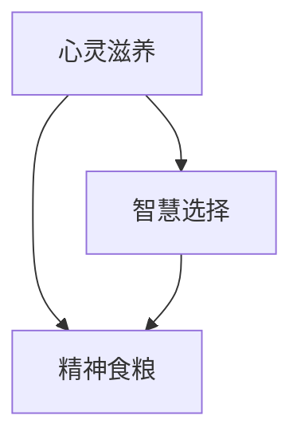

                 

### 文章标题
《滋养心灵的智慧选择：筛选有价值的精神食粮》

### 文章关键词
心灵滋养、智慧选择、精神食粮、价值评估、筛选策略

### 文章摘要
在当今信息爆炸的时代，如何从海量信息中筛选出对心灵有滋养的价值内容，成为每个人都需要面对的挑战。本文旨在探讨心灵滋养的智慧选择，提供一系列实用策略和方法，帮助读者在纷繁复杂的信息世界中，做出有智慧的选择，从而提升个人心灵品质。

---

### 设计思路

为了撰写一篇有深度、有思考、有见解的技术博客文章，我们需要遵循以下设计思路：

1. **理解主题和目标**：文章的主题是“滋养心灵的智慧选择：筛选有价值的精神食粮”，目标是为读者提供一套有效的策略和方法，帮助他们从海量信息中筛选出对心灵有滋养的价值内容。

2. **逻辑结构**：文章将分为四个部分：背景介绍、核心概念与联系、具体策略与实施、总结与拓展。

3. **内容细化**：确保每个部分都有丰富的具体内容，包括但不限于理论讲解、实际案例、最佳实践等。

4. **技术语言**：使用专业的技术语言，确保文章的可读性和专业性。

5. **格式规范**：使用markdown格式，确保文章的结构清晰、格式统一。

### 目录大纲

1. **背景介绍**：信息爆炸时代的心灵挑战
   - 心灵健康的重要性
   - 信息过载带来的挑战

2. **核心概念与联系**
   - 心灵滋养的定义与内涵
   - 智慧选择的标准与原则
   - 精神食粮的分类与筛选

3. **具体策略与实施**
   - 个人成长的选择策略
   - 职场发展的选择策略
   - 社会交往的选择策略

4. **总结与拓展**
   - 智慧选择对心灵滋养的影响
   - 最佳实践与注意事项

---

### 第一部分：背景介绍

#### 信息爆炸时代的心灵挑战

在当今这个信息爆炸的时代，我们每天都被大量的信息所包围。据统计，每天产生的信息量是过去几十年甚至几个世纪的总量之和。这些信息来自互联网、电视、报纸、书籍等各个渠道，内容涵盖科技、文化、娱乐、政治等多个领域。

然而，面对如此庞大的信息量，我们并非都能有效地吸收和利用。相反，很多人感到压力巨大，甚至陷入信息过载的困境。这种情况对人们的心理健康产生了严重的影响，具体表现在以下几个方面：

1. **焦虑与压力**：面对大量信息，人们容易感到焦虑和压力，尤其是当这些信息与个人生活密切相关时。
2. **注意力分散**：信息过载导致人们的注意力容易分散，难以集中精力处理重要任务。
3. **决策困难**：在海量信息面前，人们往往难以做出明智的决策，从而影响个人和社会的效率。

#### 心灵健康的重要性

心灵健康是一个人全面健康的重要组成部分。它不仅关乎个体的心理状态，还直接影响个体的生理健康、社交能力和生活质量。以下是心灵健康的几个关键方面：

1. **情绪管理**：良好的情绪管理能力可以帮助个体更好地应对压力和挑战，保持心理健康。
2. **自我认知**：自我认知能力有助于个体了解自己的需求和愿望，从而更好地实现个人成长和发展。
3. **社交能力**：良好的社交能力有助于个体建立和维护健康的人际关系，从而提高生活质量。

#### 信息过载带来的挑战

信息过载对心灵健康的挑战主要表现在以下几个方面：

1. **焦虑感增加**：面对海量信息，人们容易产生焦虑感，担心错过重要信息，从而影响心理健康。
2. **注意力分散**：信息过载导致人们的注意力容易分散，难以集中精力处理重要任务，从而影响工作效率和生活质量。
3. **决策困难**：在海量信息面前，人们往往难以做出明智的决策，从而影响个人和社会的效率。

为了应对这些挑战，我们需要学会筛选有价值的信息，并将其转化为对心灵有滋养的精神食粮。这就是本文要探讨的主题。

---

### 第二部分：核心概念与联系

在探讨如何筛选有价值的精神食粮之前，我们首先需要了解几个核心概念：心灵滋养、智慧选择和精神食粮。

#### 心灵滋养

心灵滋养是指通过各种方式来提升和增强个体的心灵健康和幸福感。它不仅包括情绪和心理层面的调适，还涉及到精神文化层面的丰富和提升。心灵滋养的目标是帮助个体在快节奏、高压的生活环境中保持心理平衡和健康。

心灵滋养的内涵非常丰富，包括以下几个方面：

1. **情绪调节**：通过调整情绪状态来缓解压力和焦虑，提升心理素质。
2. **自我认知**：通过深入理解和认识自己，提升自我价值和自我实现的能力。
3. **精神丰富**：通过阅读、艺术欣赏、宗教信仰等方式来丰富精神生活，提升心灵深度。

#### 智慧选择

智慧选择是指在面对大量信息时，能够根据个人需求和价值观，做出合理、明智的选择。智慧选择不仅仅是信息筛选的过程，更是一种对生活、工作和人际关系的深度思考和规划。

智慧选择的标准包括以下几个方面：

1. **价值评估**：根据个人价值观和目标，评估信息的价值和对心灵的滋养效果。
2. **信息筛选**：运用批判性思维，筛选出对心灵有积极影响的信息。
3. **决策能力**：在多个选择中，能够做出最优决策，避免信息过载和决策困难。

#### 精神食粮

精神食粮是指那些对心灵有滋养作用的信息、知识和文化。它可以是书籍、文章、音乐、电影、艺术作品等，这些内容能够激发个体的思考和创造力，提升生活质量。

精神食粮的分类可以从以下几个方面进行：

1. **知识性内容**：如书籍、学术论文、专业文章等，能够帮助个体扩展知识和提升技能。
2. **艺术性内容**：如音乐、绘画、文学等，能够激发个体的情感和创造力。
3. **思想性内容**：如哲学、心理学、宗教等，能够帮助个体深入思考和认识自己。

#### 核心概念之间的关系架构

为了更好地理解这三个核心概念之间的关系，我们可以使用Mermaid流程图来展示它们之间的联系：

在这个流程图中，我们可以看到心灵滋养、智慧选择和精神食粮之间是相互关联、相互影响的。心灵滋养是智慧选择的基础，而智慧选择则能够帮助我们筛选出对心灵有滋养的精神食粮。精神食粮则是心灵滋养的具体实现，通过阅读、欣赏和思考等方式，提升个体的心灵品质。

---

### 第三部分：具体策略与实施

在了解了心灵滋养、智慧选择和精神食粮的基本概念后，接下来我们将探讨如何在实际生活中实施这些策略，以实现心灵的滋养。

#### 个人成长的选择策略

个人成长是一个长期的过程，需要通过不断的学习和实践来实现。以下是几个关键策略：

1. **自我认知**：个人成长的起点是自我认知。通过反思和自我评估，了解自己的兴趣、优点和缺点，明确个人目标和价值观。自我认知可以帮助我们更好地选择适合自己的成长路径。

2. **持续学习**：学习是个人成长的动力。无论是通过阅读书籍、参加课程还是与他人交流，持续学习都能够扩展知识面和提升技能。选择适合自己的学习资源和方法，能够有效地促进个人成长。

3. **实践与反思**：理论知识需要通过实践来验证和深化。在实践过程中，我们可能会遇到挑战和困难，但通过反思和总结，我们可以不断改进和提升自己。实践与反思相结合，是个人成长的必经之路。

#### 职场发展的选择策略

职场发展是许多人关注的焦点，以下是一些有效的选择策略：

1. **职业规划**：明确的职业规划是职场发展的基础。通过设定短期和长期目标，规划职业发展的路径，可以更好地把握职业机会，实现职业生涯的持续成长。

2. **技能提升**：在职场中，不断更新和提升技能是保持竞争力的关键。选择适合自己的培训课程或自学资源，不断提升专业技能和软技能，能够在职场中脱颖而出。

3. **人际交往**：在职场中，良好的人际关系对职业发展至关重要。通过积极参与团队活动、主动交流与合作，可以建立和维护良好的人际网络，为职业发展创造更多的机会。

#### 社会交往的选择策略

社会交往是人与人之间互动的过程，以下是一些有效的选择策略：

1. **建立和维护人际关系**：通过积极参与社交活动、加入兴趣小组等方式，可以建立和维护人际关系。良好的人际关系能够提供情感支持和社会资源，有助于个人成长和职业发展。

2. **沟通技巧**：有效的沟通技巧是建立良好人际关系的关键。通过倾听、表达和反馈，可以提升沟通效果，增进相互理解。

3. **冲突解决**：在社会交往中，冲突是不可避免的。通过学习和实践冲突解决的技巧，可以有效地处理冲突，维护良好的人际关系。

#### 实践方法

1. **自我反思**：定期进行自我反思，审视自己的成长过程和选择效果，有助于发现问题并进行改进。

2. **阅读与学习**：选择高质量的书籍、文章和课程，通过阅读和学习来扩展知识和提升技能。

3. **实践与反馈**：将所学知识应用于实际工作和生活中，通过实践和反馈来检验和提升自己的能力。

4. **培养良好习惯**：通过培养良好的工作和生活习惯，提升个人效率和生活质量。

---

### 第四部分：总结与拓展

#### 智慧选择对心灵滋养的影响

智慧选择不仅能够帮助我们筛选出有价值的精神食粮，还能对心灵产生深远的滋养作用。通过智慧选择，我们可以：

1. **提升心理健康**：筛选出对心灵有积极影响的信息和资源，能够帮助我们缓解焦虑和压力，提升心理健康。
2. **增强自我认知**：通过自我反思和评估，我们可以更深入地了解自己，明确个人目标和价值观，从而实现自我成长。
3. **丰富精神生活**：通过阅读、艺术欣赏、宗教信仰等方式，我们可以丰富精神生活，提升心灵品质。

#### 最佳实践与注意事项

在实施智慧选择策略时，以下最佳实践和注意事项可以帮助我们更好地实现心灵滋养：

1. **明确目标**：在筛选信息时，明确自己的目标和需求，避免盲目追求。
2. **批判性思维**：运用批判性思维，对信息进行评估和筛选，避免被误导。
3. **持续实践**：将智慧选择策略融入日常生活，通过持续实践来提升能力。
4. **寻求专业帮助**：在需要时，寻求专业人士的建议和指导，以实现更好的心灵滋养。

#### 拓展阅读

1. **《如何阅读一本书》**：莫提默·J·艾德勒、查尔斯·范多伦
2. **《深度工作》**：卡尔·纽波特
3. **《非暴力沟通》**：马歇尔·卢森堡

---

### 作者信息

作者：AI天才研究院/AI Genius Institute & 禅与计算机程序设计艺术 /Zen And The Art of Computer Programming

---

以上是《滋养心灵的智慧选择：筛选有价值的精神食粮》的文章全文。通过本文，我们探讨了心灵滋养、智慧选择和精神食粮这三个核心概念，并提供了一系列具体策略和实践方法。希望本文能够帮助读者在信息爆炸的时代，做出有智慧的选择，从而提升个人心灵品质。

