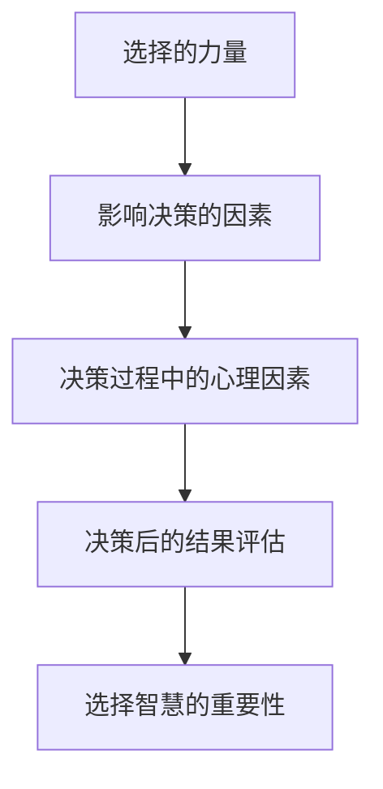

                 

## 文章标题

# 滋养心灵的智慧选择：精神食粮的筛选

## 关键词

* 心灵滋养
* 智慧选择
* 精神营养
* 心灵成长
* 决策算法

## 摘要

本文旨在探讨如何在现代快节奏生活中通过智慧选择和心灵成长找到内心的安宁和满足。通过深入分析选择的智慧、心灵成长的方法以及生活中的精神营养，本文提供了实用的指南，帮助读者在纷繁复杂的世界中找到心灵的滋养之道。本文将结合理论讲解、实际案例和数学模型，帮助读者在日常生活中实践和应用这些理念。

## 前言

### 《滋养心灵的智慧选择：精神食粮的筛选》的背景与意义

在当今高度信息化的社会中，人们面临着前所未有的选择压力和心灵挑战。日常生活中的各种决策不仅影响我们的物质生活，更深刻地影响着我们的心理状态和幸福感。在这样的背景下，如何通过智慧选择和有效的精神滋养来提升生活质量，成为一个备受关注的话题。

《滋养心灵的智慧选择：精神食粮的筛选》一书应运而生，旨在为读者提供一套系统而实用的方法，帮助他们在纷繁复杂的世界中找到心灵的安宁和智慧。本书不仅关注理论上的探讨，更强调实际操作和应用，使读者能够在日常生活中受益。

### 书中的核心主题与目标受众

本书的核心主题可以概括为以下几个方面：

1. **选择的智慧**：探讨选择的力量及其对个体决策和行为的影响，并提供实用的决策工具和策略。
2. **心灵成长的方法**：介绍自我认知、情绪管理和心理平衡等心灵成长的方法，帮助读者提升内心的韧性和智慧。
3. **精神营养的筛选**：分析书籍、音乐、艺术和自然等生活中的精神营养源，提供获取和利用这些营养的方法。

本书的主要目标受众是那些渴望内心平静、追求智慧生活的现代都市人。无论你是职场人士、学生还是家庭主妇，本书都希望为你提供一套行之有效的方法，帮助你提升生活质量，找到真正的幸福。

### 全书结构

本书共分为七个部分，每一部分都围绕一个核心主题展开。具体目录如下：

### 第1章：选择的智慧

**核心概念与联系**

选择的智慧是本书的核心概念。选择不仅影响我们的行为和决策，更深刻地影响我们的生活质量。在本章中，我们将探讨选择的力量、影响决策的因素以及决策后的结果评估。

**核心算法原理讲解**

选择算法是本章的核心内容。选择算法的基本原理包括以下几个方面：

1. **影响决策的因素**：了解影响决策的因素，包括个人价值观、环境因素和心理状态。
2. **决策过程中的心理因素**：分析决策过程中的心理因素，如风险偏好、情绪影响和认知偏差。
3. **决策后的结果评估**：评估决策结果，并调整未来决策策略。

我们将使用Mermaid流程图展示选择的原理和影响。



**核心算法原理讲解**

选择算法的基本原理将在本章中详细讨论。我们将使用伪代码来描述一个简单选择算法。

```python
# 伪代码：选择算法
function 选择算法(集合X, 目标Y):
    for每个元素x in X:
        如果 x 满足条件 Y:
            返回 x
        end if
    end for
    如果集合X中没有元素满足条件Y，则返回空
end function
```

**数学模型和数学公式 & 详细讲解 & 举例说明**

选择问题可以用概率论和统计学来建模。以下是一个简单的例子：

$$
P(A|B) = \frac{P(A \cap B)}{P(B)}
$$

这里，\( P(A|B) \) 表示在事件B发生的条件下事件A发生的概率。我们将通过一个具体例子来说明这一公式的应用。

**项目实战**

通过一个实际案例，我们将探讨如何在日常生活中应用选择智慧。例如，如何在工作与家庭之间做出最优选择。

### 第2章：心灵成长的方法

**核心概念与联系**

心灵成长的方法涉及自我认知、情绪管理和心理平衡等多个方面。自我认知是心灵成长的基础，情绪管理有助于我们更好地应对生活中的挑战，而心理平衡则是维持内心平静的关键。

**核心算法原理讲解**

本章将探讨如何在日常生活中实现心灵成长。我们将使用伪代码来描述一个简单的情绪管理算法。

```python
# 伪代码：情绪管理算法
function 情绪管理(情绪状态S):
    如果 S 是负面情绪：
        调用 减轻情绪函数()
    否则：
        调用 保持情绪稳定函数()
end function
```

**数学模型和数学公式 & 详细讲解 & 举例说明**

心理平衡可以用系统动力学模型来描述。以下是一个简单的例子：

$$
\frac{dX}{dt} = f(X, Y)
$$

这里，\( X \) 表示心理状态，\( Y \) 表示外部刺激，\( f \) 是一个描述心理状态变化的函数。我们将通过一个具体例子来说明这一公式的应用。

**项目实战**

通过一个实际案例，我们将探讨如何在职业生涯中实现心灵成长。例如，如何通过冥想和正念练习来提升心理平衡。

### 第3章：生活中的精神营养

**核心概念与联系**

生活中的精神营养包括书籍、音乐、艺术和自然等各个方面。这些精神营养不仅丰富了我们的内心世界，还为我们提供了情感支持和精神力量。

**核心算法原理讲解**

本章将探讨如何从不同渠道获取精神营养。我们将使用伪代码来描述一个简单的营养获取算法。

```python
# 伪代码：营养获取算法
function 营养获取(来源X):
    如果 来源X 是书籍：
        调用 阅读书籍函数()
    否则，如果 来源X 是音乐：
        调用 听音乐函数()
    ...
end function
```

**数学模型和数学公式 & 详细讲解 & 举例说明**

精神营养的获取可以用决策树模型来描述。以下是一个简单的例子：

```
class DecisionTree:
    def __init__(self, attribute_list):
        self.attribute_list = attribute_list
        self.tree = None

    def create_tree(self, data_set):
        # 根据数据集创建决策树
        pass

    def predict(self, instance):
        # 根据决策树预测实例
        pass
```

我们将通过一个具体例子来说明这一公式的应用。

**项目实战**

通过一个实际案例，我们将探讨如何在日常生活中获取和利用精神营养。例如，如何通过阅读和艺术创作来提升精神状态。

### 第4章：建立有效的个人目标体系

**核心概念与联系**

建立有效的个人目标体系是心灵成长的重要一环。通过设定明确的目标，我们可以更好地规划生活，提升自我实现感。

**核心算法原理讲解**

本章将探讨如何设定个人目标，并使用算法来优化目标管理。我们将使用伪代码来描述一个简单的目标设定算法。

```python
# 伪代码：目标设定算法
function 目标设定(目标集合G):
    for每个目标g in G:
        if 目标g 是 可达的：
            更新目标列表()
        end if
    end for
    返回 目标列表()
end function
```

**数学模型和数学公式 & 详细讲解 & 举例说明**

目标管理可以用优化模型来描述。以下是一个简单的例子：

$$
\min_{x} \quad f(x)
$$

这里，\( f(x) \) 表示目标函数，\( x \) 表示决策变量。我们将通过一个具体例子来说明这一公式的应用。

**项目实战**

通过一个实际案例，我们将探讨如何设定个人目标，并使用算法来优化目标管理。例如，如何通过时间管理和资源优化来实现职业目标。

### 第5章：情绪调节与压力管理

**核心概念与联系**

情绪调节与压力管理是心灵健康的基石。通过有效的情绪调节和压力管理，我们可以更好地应对生活中的挑战，保持内心的平静。

**核心算法原理讲解**

本章将探讨如何通过算法来辅助情绪调节和压力管理。我们将使用伪代码来描述一个简单的情绪调节算法。

```python
# 伪代码：情绪调节算法
function 情绪调节(情绪状态S):
    如果 S 是负面情绪：
        调用 减轻情绪函数()
    否则：
        调用 保持情绪稳定函数()
end function
```

**数学模型和数学公式 & 详细讲解 & 举例说明**

情绪调节可以用控制理论模型来描述。以下是一个简单的例子：

$$
u(t) = K_p e(t)
$$

这里，\( u(t) \) 表示控制输入，\( e(t) \) 表示误差。我们将通过一个具体例子来说明这一公式的应用。

**项目实战**

通过一个实际案例，我们将探讨如何通过情绪调节和压力管理来提升生活质量。例如，如何通过运动和冥想来缓解工作压力。

### 第6章：社交网络的优化

**核心概念与联系**

社交网络对我们的心理状态和生活质量有着重要影响。通过优化社交网络，我们可以提升人际关系的质量，增强社交支持。

**核心算法原理讲解**

本章将探讨如何通过算法来优化社交网络。我们将使用伪代码来描述一个简单的社交网络优化算法。

```python
# 伪代码：社交网络优化算法
function 社交网络优化(社交网络G):
    for每个节点n in G:
        if n 的 社交影响力 高：
            调整节点位置()
        end if
    end for
    返回 优化后的社交网络()
end function
```

**数学模型和数学公式 & 详细讲解 & 举例说明**

社交网络优化可以用图论模型来描述。以下是一个简单的例子：

$$
d(u, v) = \min_{path} \quad \sum_{i=1}^{n} w_i
$$

这里，\( d(u, v) \) 表示节点 \( u \) 和 \( v \) 之间的最短路径距离，\( w_i \) 表示路径中每一段的权重。我们将通过一个具体例子来说明这一公式的应用。

**项目实战**

通过一个实际案例，我们将探讨如何优化社交网络，提升人际关系的质量。例如，如何通过社交算法来推荐合适的朋友和社交活动。

### 第7章：实现心灵滋养的日常实践

**核心概念与联系**

日常实践是实现心灵滋养的关键。通过在日常生活中落实所学的方法和理念，我们可以逐步实现内心的平和与智慧。

**核心算法原理讲解**

本章将探讨如何将前述的理念和方法应用到日常生活中。我们将使用伪代码来描述一个简单的日常实践算法。

```python
# 伪代码：日常实践算法
function 日常实践(方法列表M):
    for每个方法m in M:
        if 方法m 可行：
            执行 方法m()
        end if
    end for
    返回 实践结果()
end function
```

**数学模型和数学公式 & 详细讲解 & 举例说明**

日常实践可以用系统动力学模型来描述。以下是一个简单的例子：

$$
\frac{dX}{dt} = f(X, Y)
$$

这里，\( X \) 表示心理状态，\( Y \) 表示外部刺激，\( f \) 是一个描述心理状态变化的函数。我们将通过一个具体例子来说明这一公式的应用。

**项目实战**

通过一个实际案例，我们将探讨如何在日常生活中实践心灵滋养的方法。例如，如何通过规律的运动、冥想和阅读来实现心灵的滋养。

### 总结与展望

《滋养心灵的智慧选择：精神食粮的筛选》一书通过七个章节的深入探讨，为读者提供了一套系统而实用的方法，帮助他们在纷繁复杂的世界中找到心灵的滋养之道。选择智慧、心灵成长、精神营养的筛选、目标体系的建立、情绪调节、社交网络优化以及日常实践，这些方法不仅具有理论上的深刻内涵，更强调实际操作和应用。

展望未来，我们相信通过智慧选择和有效的精神滋养，每个人都能在快节奏的生活中找到内心的平静与满足。让我们共同努力，在实践中不断探索和提升，实现心灵的滋养和成长。作者：AI天才研究院/AI Genius Institute & 禅与计算机程序设计艺术 /Zen And The Art of Computer Programming。

