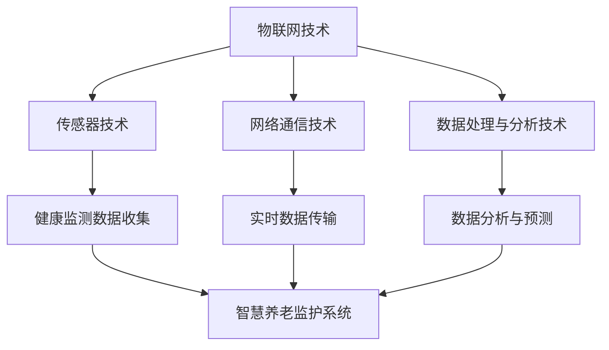
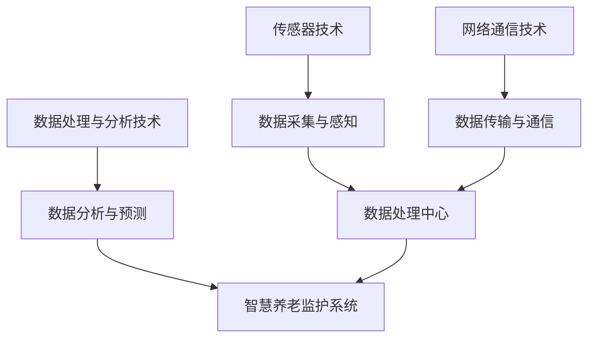
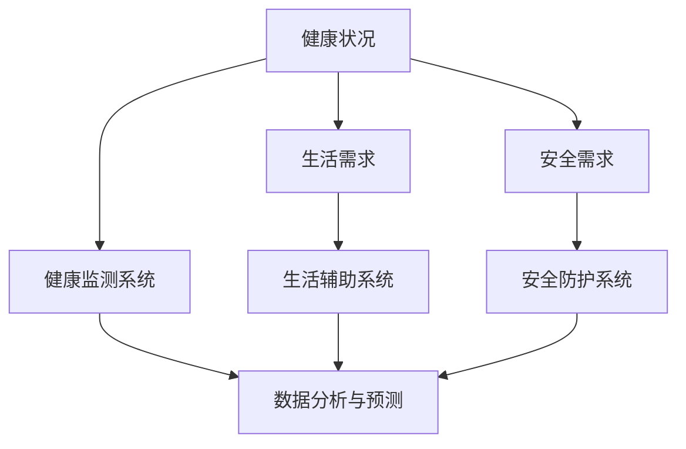
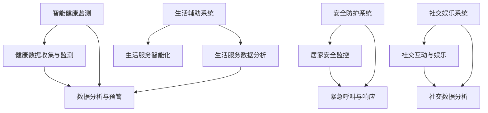
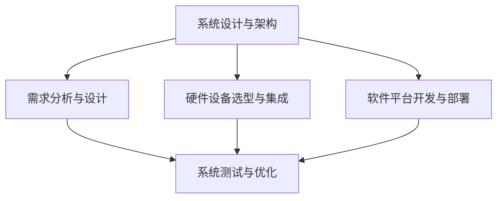
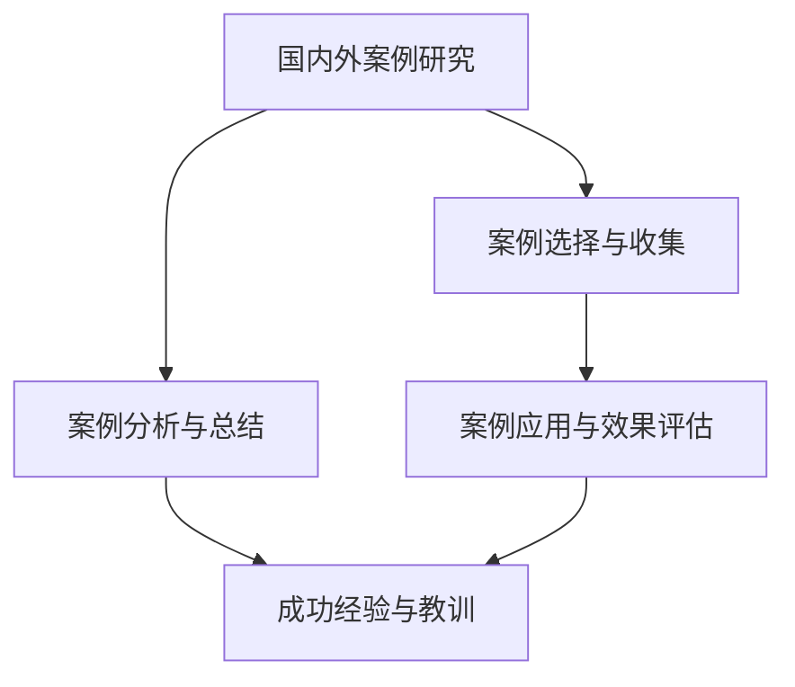

                 

### 文章标题：物联网在智慧养老监护中的全面应用

#### 关键词：物联网、智慧养老监护、技术原理、应用场景、解决方案、挑战与机遇

#### 摘要：
本文将深入探讨物联网（IoT）在智慧养老监护中的全面应用。随着人口老龄化的加剧，智慧养老监护成为社会发展的重要议题。物联网技术以其广泛的应用场景和高效的解决方案，为智慧养老监护提供了强有力的支持。本文将首先介绍物联网与智慧养老监护的背景和意义，然后详细阐述物联网技术原理、智慧养老监护需求分析、应用场景、解决方案、挑战与机遇，最后通过实际案例研究和未来展望，为物联网在智慧养老监护中的进一步发展提供指导。

### 目录

1. **物联网与智慧养老监护概述**
2. **物联网技术原理**
3. **智慧养老监护需求分析**
4. **物联网在智慧养老监护中的应用场景**
5. **物联网在智慧养老监护中的解决方案**
6. **物联网在智慧养老监护中的挑战与机遇**
7. **案例研究与未来展望**

---

### 第1章 物联网与智慧养老监护概述

#### 背景介绍

随着全球人口老龄化的不断加剧，如何有效地实现养老监护已经成为各国政府和社会广泛关注的问题。传统养老模式已无法满足老年人对生活质量和健康服务的需求，智慧养老监护作为一种新兴的模式，应运而生。智慧养老监护是指通过物联网、大数据、云计算等先进技术，实现对老年人健康、生活、安全等方面的全面监测和智能管理。

#### 核心概念与联系

物联网（IoT）是一种通过传感器、网络通信和数据处理技术，将物理世界与数字世界相结合的智能系统。它涉及多个核心技术领域，包括传感器技术、网络通信技术、数据处理与分析技术等。智慧养老监护与物联网技术的结合，实现了对老年人的实时监控、预警和干预，提升了养老服务的效率和质量。

以下是一个物联网技术在智慧养老监护中的核心概念与联系架构 Mermaid 流程图：



#### 应用

物联网技术在智慧养老监护中的应用场景十分广泛，包括智能健康监测、生活辅助系统、安全防护系统、社交娱乐系统等。通过这些应用，智慧养老监护系统能够为老年人提供全方位的关怀和服务。

### 第2章 物联网技术原理

#### 核心概念与联系

物联网技术原理主要包括传感器技术、网络通信技术、数据处理与分析技术等。传感器技术负责数据的采集和感知；网络通信技术负责数据的传输和通信；数据处理与分析技术负责对数据进行处理、分析和预测。

以下是一个物联网技术原理架构 Mermaid 流程图：



#### 核心算法原理讲解

物联网技术在智慧养老监护中涉及的核心算法包括数据采集与处理算法、预测算法、机器学习算法等。以下是一个数据采集与处理算法的伪代码：

```python
def data_collection(sensor_data):
    # 数据预处理
    preprocessed_data = preprocess_data(sensor_data)
    
    # 存储预处理后的数据
    store_data(preprocessed_data)
    
    # 返回处理后的数据
    return preprocessed_data
```

#### 数学模型和公式

在数据处理与分析中，常用的数学模型和公式包括线性回归、逻辑回归、决策树等。以下是一个线性回归模型的公式：

$$y = \beta_0 + \beta_1x_1 + \beta_2x_2 + ... + \beta_nx_n$$

#### 举例说明

假设我们需要对老年人的心率数据进行分析，以下是一个线性回归模型的举例：

$$y = \beta_0 + \beta_1x_1$$

其中，$y$ 表示心率，$x_1$ 表示运动强度。

#### 数学公式

在文章中，我们需要使用 LaTeX 格式来表示数学公式。以下是几个示例：

$$1+1=2$$

$$1<2$$

### 第3章 智慧养老监护需求分析

#### 核心概念与联系

智慧养老监护需求分析主要涉及老年人健康状况、生活需求、安全需求等方面。通过对这些需求的分析，可以明确智慧养老监护系统的功能和服务内容。

以下是一个智慧养老监护需求分析的 Mermaid 流程图：



#### 背景介绍

随着人口老龄化的加剧，老年人的健康状况、生活需求和安全感成为社会关注的焦点。智慧养老监护系统旨在通过物联网技术，实现对老年人的全面监测和智能管理，提高养老服务的质量和效率。

#### 智慧养老监护需求分析

智慧养老监护需求分析主要包括以下几个方面：

1. **健康状况监测**：包括心率、血压、血糖等生理指标监测。
2. **生活需求服务**：包括餐饮、卫生、医疗等生活服务。
3. **安全防护需求**：包括居家安全、紧急呼叫、智能安防等安全需求。

#### 智慧养老监护评价指标体系

为了全面评估智慧养老监护系统的效果，需要建立一套评价指标体系。以下是一个智慧养老监护评价指标体系的框架：

1. **健康评价指标**：包括生理指标监测准确率、健康数据异常预警及时性等。
2. **服务质量指标**：包括生活服务质量、响应速度、用户满意度等。
3. **安全防护指标**：包括安全事件发生频率、紧急呼叫响应时间等。

### 第4章 物联网在智慧养老监护中的应用场景

#### 核心概念与联系

物联网在智慧养老监护中的应用场景包括智能健康监测、生活辅助系统、安全防护系统、社交娱乐系统等。这些应用场景通过物联网技术实现，为老年人提供全方位的关怀和服务。

以下是一个物联网在智慧养老监护中的应用场景架构 Mermaid 流程图：



#### 应用

1. **智能健康监测**：通过传感器设备，实时监测老年人的生理指标，如心率、血压、血糖等，实现对健康状况的动态监控。
2. **生活辅助系统**：通过物联网技术，实现老年人的生活服务智能化，如智能家居、智能餐饮、智能卫生等，提升老年人的生活质量。
3. **安全防护系统**：通过物联网技术，实现对老年人的居家安全监控，如智能安防、紧急呼叫等，保障老年人的安全。
4. **社交娱乐系统**：通过物联网技术，实现老年人的社交互动与娱乐，如智能健身、智能音乐、智能绘画等，丰富老年人的精神生活。

### 第5章 物联网在智慧养老监护中的解决方案

#### 核心概念与联系

物联网在智慧养老监护中的解决方案主要包括系统设计与架构、硬件设备选型与集成、软件平台开发与部署等。以下是一个物联网在智慧养老监护中的解决方案架构 Mermaid 流程图：



#### 背景介绍

智慧养老监护系统的构建需要综合考虑老年人的实际需求、物联网技术的应用场景和系统的可扩展性。一个高效的解决方案能够实现对老年人的全面监测和智能管理，提高养老服务的质量和效率。

#### 系统设计与架构

系统设计与架构是智慧养老监护系统的核心。设计过程中需要考虑以下几个方面：

1. **需求分析**：根据老年人的实际需求，确定系统的功能和服务内容。
2. **技术选型**：选择合适的物联网技术，如传感器技术、网络通信技术、数据处理与分析技术等。
3. **系统架构**：设计系统的整体架构，包括前端设备、网络通信、数据处理与分析、后端服务等。

#### 硬件设备选型与集成

硬件设备选型与集成是智慧养老监护系统的关键环节。选择合适的硬件设备能够提升系统的稳定性和可靠性。以下是一个硬件设备选型与集成的流程：

1. **需求分析**：根据系统功能和服务内容，确定所需的硬件设备类型和数量。
2. **设备选型**：选择符合需求的硬件设备，如传感器、网络通信设备、数据处理设备等。
3. **设备集成**：将选定的硬件设备进行集成，确保系统能够正常运行。

#### 软件平台开发与部署

软件平台开发与部署是智慧养老监护系统的核心。一个高效的软件平台能够实现对数据的实时处理和分析，为老年人提供智能化的服务。以下是一个软件平台开发与部署的流程：

1. **需求分析**：根据系统功能和服务内容，确定软件平台的需求。
2. **开发环境搭建**：搭建软件开发环境，包括开发工具、编程语言等。
3. **平台开发**：根据需求，开发软件平台的核心功能，如数据采集、数据处理、数据分析等。
4. **平台测试**：对软件平台进行功能测试、性能测试等，确保系统稳定可靠。
5. **平台部署**：将测试通过的软件平台部署到生产环境，为老年人提供服务。

### 第6章 物联网在智慧养老监护中的挑战与机遇

#### 背景介绍

物联网在智慧养老监护中的应用带来了巨大的机遇，同时也面临着一系列的挑战。这些挑战包括技术、法律与伦理、商业模式等方面。正确认识和应对这些挑战，是物联网在智慧养老监护中发挥更大作用的关键。

#### 技术挑战

物联网在智慧养老监护中的技术挑战主要包括：

1. **数据安全与隐私保护**：物联网设备大量收集老年人的个人信息和健康数据，如何保障数据的安全和隐私成为重要挑战。
2. **网络通信可靠性**：物联网设备分布在不同的环境中，如何保证网络通信的稳定和可靠是一个重要问题。
3. **数据处理与分析能力**：随着物联网设备的增加，数据量的激增对数据处理与分析能力提出了更高的要求。

#### 法律与伦理挑战

物联网在智慧养老监护中的法律与伦理挑战主要包括：

1. **数据隐私保护**：如何确保老年人的个人信息不被泄露，是一个重要的法律和伦理问题。
2. **用户权益保障**：如何保障老年人在智慧养老监护中的知情权和选择权，是一个重要的伦理和法律问题。

#### 商业模式与政策支持

物联网在智慧养老监护中的商业模式与政策支持挑战主要包括：

1. **商业模式探索**：如何通过物联网技术实现盈利，是一个商业模式探索的问题。
2. **政策支持**：如何通过政府的政策支持，促进物联网在智慧养老监护中的应用和发展，是一个政策支持的问题。

### 第7章 案例研究与未来展望

#### 核心概念与联系

案例研究是了解物联网在智慧养老监护中实际应用的重要途径。通过分析国内外物联网智慧养老监护的案例，可以总结出成功的经验和教训，为未来的发展提供参考。

以下是一个物联网智慧养老监护案例研究架构 Mermaid 流程图：



#### 背景介绍

随着物联网技术的不断发展，国内外已有多地的智慧养老监护项目取得了显著成果。这些案例为我们提供了宝贵的经验和参考。以下是一些典型的物联网智慧养老监护案例：

1. **美国硅谷智慧养老社区**：通过物联网技术，实现了对老年人的生活、健康、安全等方面的全面监测和管理，提升了养老服务的质量和效率。
2. **中国上海市智慧养老试点**：利用物联网技术，为老年人提供了智能健康监测、生活辅助、安全防护等服务，取得了良好的社会反响。

#### 案例分析与总结

通过对这些案例的分析和总结，我们可以得出以下结论：

1. **技术优势**：物联网技术为智慧养老监护提供了强大的技术支持，能够实现对老年人的全面监测和智能管理。
2. **市场需求**：随着人口老龄化的加剧，智慧养老监护市场需求不断增长，为物联网技术的发展提供了广阔的空间。
3. **政策支持**：政府的大力支持和政策引导，为物联网在智慧养老监护中的应用提供了良好的环境和机遇。

#### 未来展望

未来，物联网在智慧养老监护中的应用将呈现出以下趋势：

1. **技术进步**：随着物联网技术的不断发展和创新，智慧养老监护将实现更加智能、高效和精准的服务。
2. **市场扩展**：随着物联网技术的普及和应用的深入，智慧养老监护市场将得到进一步拓展。
3. **政策优化**：政府将继续加大对智慧养老监护的政策支持，推动物联网技术在养老领域的广泛应用。

### 附录

#### A. 技术规范与标准

- **物联网通信协议**：如MQTT、CoAP等。
- **传感器技术标准**：如ISO/IEC 17025等。

#### B. 开发工具与平台

- **开发工具**：如Eclipse IoT、Arduino等。
- **平台**：如AWS IoT、Microsoft Azure IoT等。

#### C. 代码示例与解读

- **传感器数据采集代码**：例如使用Arduino采集心率数据。
- **数据处理与分析代码**：例如使用Python进行数据分析。

### 作者信息

作者：AI天才研究院/AI Genius Institute & 禅与计算机程序设计艺术 /Zen And The Art of Computer Programming

### 结语

物联网在智慧养老监护中的应用，不仅为老年人提供了更加智能、高效、便捷的服务，也推动了养老事业的创新发展。未来，随着物联网技术的不断进步和应用的深入，智慧养老监护将迎来更加广阔的发展空间。我们期待物联网技术在智慧养老监护中的应用能够为老年人带来更多的福祉，为社会的和谐发展贡献力量。

