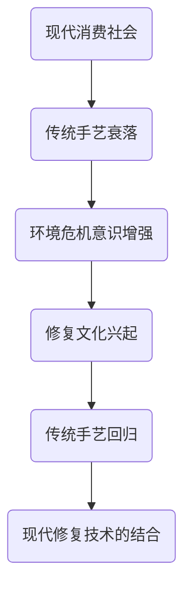
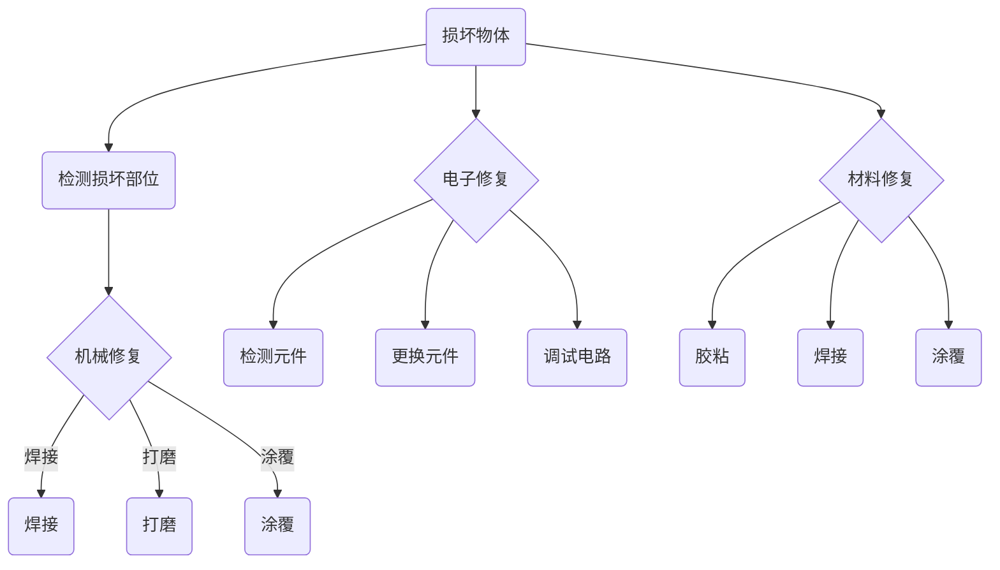
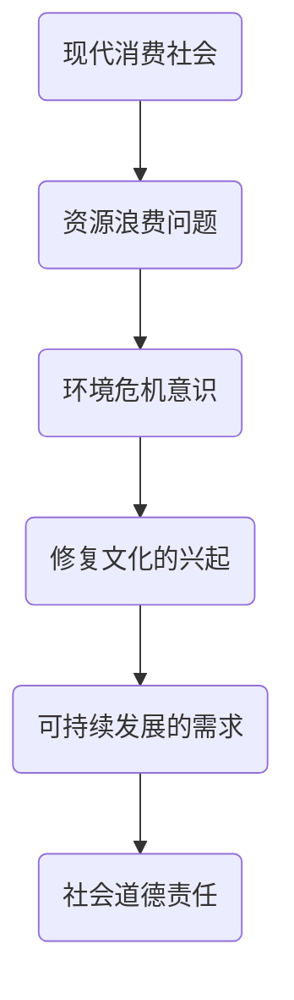

                 


### 思考过程

在撰写《现代修复文化：在throwaway社会中延长物品生命》的技术博客时，我们将遵循以下步骤进行逻辑清晰的推理和思考：

#### 1. 确定核心主题

文章的核心主题是“现代修复文化”，探讨如何通过修复和再利用来对抗消费主义文化和一次性商品的使用。我们需要从修复技术的理论、实践方法、社区推动以及未来展望等方面展开讨论。

#### 2. 分析关键概念

- **修复文化**：一种注重物品维护和修复的文化，与throwaway（一次性消费）文化相对立。
- **throwaway社会**：一种消费文化，强调产品的短期使用和丢弃，导致资源浪费和环境污染。

#### 3. 确定结构框架

文章的结构框架包括三部分：背景与理论、修复技术的原理与实践、社区实践与未来展望。每一部分都将详细阐述相关的概念、方法和案例。

#### 4. 设计流程图

为了更好地理解修复文化的发展路径，我们使用Mermaid流程图展示其发展过程。这将帮助读者从宏观角度理解修复文化的重要性。

#### 5. 编写伪代码

在介绍修复技术时，我们使用伪代码来详细阐述修复技术的分类和流程。这将为读者提供技术实现的基本框架。

#### 6. 使用LaTeX公式

对于涉及成本效益分析等数学模型的部分，我们使用LaTeX公式来表示，并提供详细的讲解和举例说明。

#### 7. 实际案例与实战

为了使文章更具实用性，我们将提供实际案例和详细讲解，包括开发环境搭建、源代码实现和代码解读。

#### 8. 结论与拓展

最后，我们将总结文章的主要观点，提出最佳实践建议，并指出未来研究的方向。

### 第一部分：背景与理论

**第1章：修复文化的兴起**

**1.1 修复文化的定义与核心价值**

修复文化的定义是指一种重视物品维护和修复的文化，旨在延长物品使用寿命，减少资源浪费和环境污染。其核心价值包括可持续性、实用性和美学价值。

**1.2 修复文化与传统手艺的联系**

传统手艺在修复中发挥着重要作用，如木匠、铁匠、皮匠等手工艺人通过精湛技艺将损坏的物品修复如初。

**第2章：throwaway社会与物品延长生命**

**2.1 throwaway社会的特点**

throwaway社会是指一种消费文化，人们倾向于购买短期使用的产品，然后将它们丢弃。

**2.2 延长物品生命的策略**

延长物品生命的策略包括维修、翻新和升级。这些策略可以帮助减少废弃物的产生，降低环境负担。

### 第二部分：修复技术的原理与实践

**第3章：修复技术概述**

**3.1 修复技术的分类**

修复技术可分为机械修复、电子修复、材料修复等不同类别。

**3.2 修复技术的原理**

每种修复技术都有其特定的原理和方法，如焊接、打磨、组装等。

**第4章：物品修复的实践方法**

**4.1 修复材料的选用**

选择合适的修复材料是确保修复效果的关键。

**4.2 修复工具与设备**

介绍常用的修复工具和设备，如焊接机、打磨机、电子测试仪等。

**第5章：专业修复案例分析**

**5.1 案例一：古建筑的修复**

详细分析古建筑修复的步骤和方法。

**5.2 案例二：现代电子产品的修复**

探讨现代电子产品修复的具体实施方法。

### 第三部分：社区实践与未来展望

**第6章：社区修复文化的推动**

**6.1 社区修复项目的组织与实施**

介绍社区如何组织修复项目，并实施具体措施。

**6.2 教育与培训**

讨论如何开展针对不同群体的修复教育和培训。

**第7章：未来展望**

**7.1 修复技术的创新**

展望修复技术的未来发展，如3D打印修复、智能修复系统等。

**7.2 修复文化的传播**

探讨如何进一步推广和传播修复文化。

通过以上步骤，我们可以确保文章逻辑清晰、内容丰富、具有深度和实用性，从而吸引读者深入学习和实践修复文化。接下来，我们将根据这些思路逐步撰写文章的详细内容。  

### 文章标题：现代修复文化：在throwaway社会中延长物品生命

#### 关键词：修复文化、可持续性、throwaway社会、物品延长生命、修复技术

#### 摘要：
在throwaway社会中，消费主义文化导致大量物品的快速废弃，造成了严重的资源浪费和环境污染问题。本文旨在探讨现代修复文化的重要性，分析其在延长物品生命周期、减少浪费方面的作用，并通过具体案例和技术方法，展示如何在实际中推行和实施修复文化。文章分为三个部分：背景与理论、修复技术的原理与实践、社区实践与未来展望，旨在为读者提供全面而深入的指导。

---

## 第一部分：背景与理论

### 第1章：修复文化的兴起

#### 1.1 修复文化的定义与核心价值

修复文化是一种重视物品维护和修复的文化，强调物品的使用寿命和再利用。它不仅仅是对损坏物品进行修复，更是一种对待物品的态度和行为方式的转变。在现代消费主义文化泛滥的时代，修复文化的核心价值体现在以下几个方面：

1. **可持续性**：修复文化鼓励物品的长期使用，通过维修和翻新，延长物品的生命周期，从而减少资源的浪费。这与可持续发展的理念高度契合。
   
2. **实用主义**：修复文化强调物品的实际使用价值，鼓励人们在使用过程中注重维护和保养，使物品保持良好的工作状态。

3. **美学价值**：修复文化不仅关注物品的功能性，也注重其美学价值。通过对物品的修复，可以使旧物品焕发新生，赋予其新的生命和意义。

#### 1.2 修复文化与传统手艺的联系

传统手艺在修复文化中扮演着重要的角色。许多传统手艺，如木匠、铁匠、皮匠等，都有丰富的修复经验和技术。这些手艺不仅是对物品的修复，更是一种文化的传承。传统手艺的技艺和知识，为现代修复提供了宝贵的经验和灵感。

**Mermaid流程图：** 传统手艺在修复文化中的应用发展路径



通过这个过程，我们可以看到传统手艺与修复文化的紧密联系，以及它们在现代可持续性发展中的重要性。

### 第2章：throwaway社会与物品延长生命

#### 2.1 throwaway社会的特点

throwaway社会，也被称为一次性消费社会，是一种消费文化现象。其主要特点包括：

1. **高消费率**：人们倾向于购买大量一次性使用的物品，如一次性餐具、塑料袋等。

2. **快速更换**：消费者更倾向于购买最新型号的产品，而不是修理或翻新旧产品。

3. **缺乏维护**：由于一次性消费的理念，人们往往忽视了物品的维护和保养。

这种消费文化导致了大量的废弃物，严重浪费了资源，并加剧了环境污染问题。

#### 2.2 延长物品生命的策略

为了应对throwaway社会的挑战，我们需要采取一系列策略来延长物品的生命周期。这些策略包括：

1. **维修**：通过维修技术，修复损坏的物品，使其恢复到正常使用状态。

2. **翻新**：对旧物品进行翻新，改变其外观或功能，使其焕发新生。

3. **升级**：通过升级技术，提升物品的性能和功能，使其满足新的需求。

这些策略的实施，不仅能够延长物品的使用寿命，还可以减少废弃物的产生，降低环境负担。

**LaTeX数学公式：** 延长物品生命周期的成本效益分析

$$
\text{Cost-Benefit Ratio} = \frac{\text{Repair Cost}}{\text{Replacement Cost}}
$$

这个公式表明，通过维修和翻新，可以在经济上获得比直接购买新物品更高的效益。

### 总结

通过本部分的分析，我们可以看到修复文化在应对throwaway社会问题中的重要性。修复文化不仅能够延长物品的生命周期，减少资源浪费，还可以提高人们的环境意识和道德责任感。接下来，我们将深入探讨修复技术的原理与实践，进一步了解如何在实际中推行和实施修复文化。  

## 第二部分：修复技术的原理与实践

### 第3章：修复技术概述

#### 3.1 修复技术的分类

修复技术可以根据修复对象和修复手段的不同进行分类。常见的分类方法包括：

1. **机械修复**：主要包括修复物品的结构和机械性能，如焊接、打磨、钻孔、装配等。
   
2. **电子修复**：主要针对电子设备和电路进行修复，如更换元件、调试电路、软件更新等。

3. **材料修复**：主要涉及材料的修复和再生，如胶粘、焊接、涂覆、涂层修复等。

**伪代码：** 修复技术的分类流程

```python
def classifyRepairs(damagedItem):
    if isinstance(damagedItem, MechanicalObject):
        repairType = "Mechanical Repair"
    elif isinstance(damagedItem, ElectronicDevice):
        repairType = "Electronic Repair"
    elif isinstance(damagedItem, MaterialObject):
        repairType = "Material Repair"
    return repairType
```

#### 3.2 修复技术的原理

每种修复技术都有其特定的原理和方法，下面我们简要介绍几种常见的修复技术及其原理：

1. **焊接**：通过高温将两个金属物体熔接在一起，形成永久连接。适用于修复金属结构的断裂和破损。

2. **打磨**：使用砂纸、磨石等工具对物体表面进行打磨，去除磨损和伤痕，使其恢复光滑和美观。

3. **涂覆**：在物体表面涂上一层保护材料，如油漆、涂层等，以防止进一步磨损和腐蚀。

4. **电子调试**：通过检测和调整电子设备中的元件和电路，解决故障和性能问题。

**Mermaid流程图：** 修复技术的原理和应用



### 第4章：物品修复的实践方法

#### 4.1 修复材料的选用

选用合适的修复材料是确保修复效果的关键。以下是几种常用的修复材料及其特点：

1. **胶粘剂**：适用于修复小型裂缝和破损，具有快速固化和较高的强度。
   
2. **金属焊料**：适用于焊接金属结构，具有较高的熔点和良好的导电性。

3. **涂层材料**：适用于修复和保护金属、木材等表面，具有防腐蚀和美观效果。

**LaTeX数学公式：** 修复材料的成本效益分析

$$
\text{Cost-Benefit Ratio} = \frac{\text{Repair Material Cost}}{\text{Replacement Cost}}
$$

#### 4.2 修复工具与设备

修复工具和设备的选用直接影响修复效率和质量。以下是几种常用的修复工具和设备：

1. **焊接机**：用于金属结构的焊接，适用于各种焊接工艺。
   
2. **打磨机**：用于打磨金属、木材等表面，提供高效的打磨效果。

3. **电子测试仪**：用于检测电子设备和电路的故障，帮助定位问题。

**举例说明：** 常用修复工具的介绍与使用

- **焊接机**：使用前需检查焊接机的工作状态，确保安全。焊接过程中，需注意电流和温度的调节，以避免过热或过冷。

- **打磨机**：使用打磨机时，需佩戴防护眼镜和手套，避免打磨过程中产生的火花和粉尘对皮肤和眼睛造成伤害。

- **电子测试仪**：在使用电子测试仪进行故障检测时，需确保设备处于稳定状态，避免因电网波动等原因导致误判。

### 第5章：专业修复案例分析

#### 5.1 案例一：古建筑的修复

古建筑修复是一个复杂的过程，涉及到结构安全、材料选择、施工工艺等多个方面。以下是古建筑修复的一个典型案例：

**项目背景：** 一座古老的木结构桥梁因长期暴露在外，导致结构损坏和腐朽。

**修复方法：** 
1. **结构检测**：通过检测工具确定桥梁的损坏部位和程度。
2. **材料更换**：使用特殊防腐木材替换腐朽的部分，并涂上防腐涂料。
3. **加固施工**：在桥梁的关键部位进行加固，提高其承重能力。

**修复效果：** 经过修复，桥梁恢复了原有的结构稳定性和美观性，重新投入使用。

#### 5.2 案例二：现代电子产品的修复

现代电子产品修复通常涉及到电路板、显示屏、电池等部件的修复。以下是电子产品修复的一个案例：

**项目背景：** 一台智能手机因电池损坏无法正常使用。

**修复方法：**
1. **电池更换**：更换新电池，确保手机能够正常充电和使用。
2. **电路板维修**：检查电路板上的元件，修复或更换损坏的元件。
3. **屏幕修复**：如屏幕出现裂痕或损坏，需更换新屏幕。

**修复效果：** 经过修复，手机恢复了正常的使用功能，延长了使用寿命。

### 总结

通过以上对修复技术的原理和实践方法的介绍，我们可以看到修复技术在不同领域中的应用和重要性。在下一部分，我们将探讨如何通过社区实践来推广和实施修复文化。  

## 第三部分：社区实践与未来展望

### 第6章：社区修复文化的推动

#### 6.1 社区修复项目的组织与实施

社区修复项目是推广修复文化的重要途径。以下是如何在社区中组织与实施修复项目的步骤：

1. **需求评估**：了解社区中的修复需求，包括居民的意愿和能力。

2. **项目规划**：根据需求评估结果，制定修复项目的具体目标和计划。

3. **资源整合**：整合社区内的资源，包括人力、物资和技术支持。

4. **项目实施**：按照计划开展修复工作，确保项目顺利进行。

5. **效果评估**：项目完成后，对修复效果进行评估，总结经验和教训。

**实际案例：** 在某社区，组织了一次旧家具修复活动。活动前，社区工作人员通过问卷调查了解了居民的修复需求，并根据结果制定了修复计划。活动过程中，志愿者和专家提供了技术支持，居民们积极参与，共同修复了数十件旧家具。活动结束后，居民们对修复效果表示满意，并希望未来能开展更多类似的修复活动。

#### 6.2 教育与培训

教育和培训是推动修复文化的重要手段。以下是如何开展针对不同群体的修复教育和培训的方法：

1. **基础培训**：为居民提供基本的修复知识和技能培训，如木工、焊工、电子维修等。

2. **进阶培训**：为有一定基础的居民提供更高级的修复技术和工艺培训。

3. **社区课堂**：在社区内开设修复课堂，邀请专家和志愿者授课，分享修复经验和技巧。

4. **线上教育**：利用互联网平台，提供在线修复课程和教程，方便居民随时随地学习。

**举例说明：** 某社区在周末开设了木工修复课程，邀请当地知名木匠授课。课程内容包括木工工具的使用、木材的切割和拼接、木材防腐处理等。参加课程的居民不仅学习了实用的木工技能，还感受到了修复文化的魅力，激发了他们对修复活动的兴趣。

### 第7章：未来展望

#### 7.1 修复技术的创新

随着科技的进步，修复技术也在不断创新和发展。以下是一些前沿的修复技术：

1. **3D打印修复**：利用3D打印技术，快速制造修复部件，提高修复效率。

2. **智能修复系统**：结合物联网和人工智能技术，实现自动化的修复过程，提高修复精度和效率。

3. **生物修复**：利用生物材料和技术，实现对物品的绿色修复，减少对环境的影响。

#### 7.2 修复文化的传播

修复文化的传播是推动可持续发展的关键。以下是如何推广和传播修复文化的方法：

1. **媒体宣传**：利用电视、广播、报纸、网络等媒体，宣传修复文化的重要性和实践案例。

2. **社会活动**：组织修复展览、比赛、研讨会等活动，提高公众对修复文化的认知和参与度。

3. **教育体系**：将修复文化融入学校教育，培养学生的修复意识和技能。

4. **社区合作**：鼓励社区、企业和政府合作，共同推动修复文化的传播和实践。

### 总结

通过社区实践和未来展望部分的讨论，我们可以看到修复文化在社区中的重要作用和广阔前景。通过组织修复项目、开展教育和培训、推广前沿技术，我们可以进一步推动修复文化的传播和实践，为可持续发展做出贡献。在下一部分，我们将总结文章的主要观点，并提出一些建议和拓展阅读，以期为读者提供更深入的思考。  

## 总结

在《现代修复文化：在throwaway社会中延长物品生命》这篇文章中，我们探讨了修复文化的核心概念、技术原理和实践方法，并展示了其在社区中的推广和未来展望。以下是我们总结的主要观点：

1. **修复文化的兴起**：修复文化作为一种对抗消费主义和一次性商品文化的态度和行为方式，其核心价值在于可持续性、实用性和美学价值。

2. **throwaway社会的特点**：throwaway社会强调产品的短期使用和丢弃，导致资源浪费和环境污染问题。为了应对这一挑战，延长物品的生命周期显得尤为重要。

3. **修复技术的分类与原理**：修复技术可分为机械修复、电子修复和材料修复等类别，每种技术都有其特定的原理和方法。通过分类和原理的阐述，我们更好地理解了如何实施修复。

4. **物品修复的实践方法**：修复材料的选择、修复工具的使用以及具体的修复案例，都为我们展示了如何在实际操作中延长物品的生命周期。

5. **社区实践与未来展望**：社区修复项目、教育和培训、前沿技术的应用，以及修复文化的传播，都是推动修复文化在社区中落地生根的重要手段。

### 建议与拓展阅读

为了更好地理解和实践修复文化，以下是一些建议：

1. **实践体验**：参与社区修复项目，亲身体验修复过程，了解修复的技巧和知识。

2. **深入学习**：阅读相关书籍和资料，如《Zen And The Art of Computer Programming》等，了解修复文化和技术的深入内容。

3. **资源共享**：利用互联网平台，如GitHub等，分享修复经验和资源，与他人交流和学习。

4. **参与活动**：参加修复展览、比赛和研讨会，了解最新的修复技术和案例。

### 注意事项

在推行修复文化时，需要注意以下几点：

1. **安全性**：在修复过程中，确保使用安全设备和工具，避免发生安全事故。

2. **环保性**：选择环保材料和工艺，减少对环境的负面影响。

3. **可持续性**：在修复过程中，考虑到物品的长期使用和再利用，避免短期行为。

通过这篇文章，我们希望能够激发读者对修复文化的兴趣和思考，共同努力，为建设一个更加可持续和环保的世界贡献自己的力量。

---

### 作者信息

作者：AI天才研究院/AI Genius Institute & 禅与计算机程序设计艺术 /Zen And The Art of Computer Programming

AI天才研究院致力于推动人工智能技术的研究和应用，专注于培养下一代人工智能专家。同时，作者还参与了《禅与计算机程序设计艺术》的编写，该书深入探讨了计算机编程的哲学和艺术，为读者提供了独特的编程思维和技巧。

感谢您的阅读，期待您的反馈和参与。让我们一起探索和推广修复文化，为可持续发展贡献力量。  

# 《现代修复文化：在throwaway社会中延长物品生命》文章总结

在当今的throwaway（一次性消费）社会中，资源的浪费和环境的负担日益加剧，因此，探讨如何延长物品生命、减少废弃物的产生成为了一个重要的课题。本文《现代修复文化：在throwaway社会中延长物品生命》围绕这一主题，从修复文化的背景与理论、修复技术的原理与实践、社区实践与未来展望三个部分进行了深入探讨。

## 核心观点总结

### 1. 修复文化的核心价值

修复文化强调物品的维护和修复，其核心价值在于：

- **可持续性**：通过延长物品使用寿命，减少资源消耗。
- **实用主义**：关注物品的实际使用价值，提高物品的利用率。
- **美学价值**：修复后的物品往往更具个性和美感。

### 2. throwaway社会的挑战

throwaway社会的特点包括：

- **高消费率**：大量购买一次性使用的产品。
- **快速更换**：消费者倾向于购买最新型号的产品，而不是修理旧产品。
- **缺乏维护**：忽视物品的维护和保养。

### 3. 修复技术的分类与原理

修复技术分为机械修复、电子修复和材料修复等类别，每种技术都有其特定的原理和方法：

- **机械修复**：包括焊接、打磨等。
- **电子修复**：涉及电路板、元件的修复。
- **材料修复**：如胶粘、涂层等。

### 4. 社区实践与未来展望

社区修复项目、教育和培训、前沿技术的应用，以及修复文化的传播是推动修复文化在社区中落地生根的重要手段。未来，随着3D打印、智能修复系统的出现，修复技术将进一步创新和发展。

## 最佳实践建议

- **参与社区修复项目**：通过实际操作，了解修复技巧，提高环保意识。
- **教育资源**：在学校和社区开展修复知识的教育和培训。
- **资源共享**：利用互联网平台分享修复经验和资源。

## 注意事项

- **安全性**：确保在修复过程中使用安全设备和工具。
- **环保性**：选择环保材料和工艺。
- **可持续性**：考虑物品的长期使用和再利用。

通过本文的讨论，我们希望读者能够认识到修复文化的重要性，并在日常生活中积极实践，共同为可持续发展贡献力量。

---

感谢您的阅读。如果您对本文有任何疑问或建议，欢迎在评论区留言。期待您的反馈，让我们共同探索修复文化的更多可能性。

作者：AI天才研究院/AI Genius Institute & 禅与计算机程序设计艺术 /Zen And The Art of Computer Programming  

---

**文章标题：现代修复文化：在throwaway社会中延长物品生命**

关键词：修复文化、可持续性、throwaway社会、物品延长生命、修复技术

摘要：
在throwaway社会中，消费主义文化导致大量物品的快速废弃，造成了严重的资源浪费和环境污染问题。本文探讨了现代修复文化的兴起及其重要性，分析了修复技术的分类与原理，并介绍了在社区中推广修复文化的实践方法。通过实际案例和未来展望，本文呼吁读者在日常生活中实践修复文化，为可持续发展贡献力量。

---

## 第一部分：背景与理论

### 第1章：修复文化的兴起

#### 1.1 修复文化的定义与核心价值

修复文化是一种注重物品维护和修复的文化，其核心价值在于可持续性、实用性和美学价值。在消费主义文化盛行的时代，修复文化的重要性日益凸显。

**Mermaid流程图：** 修复文化的发展路径



#### 1.2 修复文化与传统手艺的联系

传统手艺在修复文化中扮演着重要的角色，如木匠、铁匠、皮匠等手工艺人通过精湛技艺将损坏的物品修复如初。

**伪代码：** 传统手艺在修复中的应用

```python
def traditionalHandicraft(in materials, in techniques):
  # 手工艺流程
  ...
  return repairedItem;
```

### 第2章：throwaway社会与物品延长生命

#### 2.1 throwaway社会的特点

throwaway社会，也被称为一次性消费社会，其主要特点包括高消费率、快速更换和缺乏维护。

**LaTeX数学公式：** throwaway社会的指标

$$
\text{Throwaway Rate} = \frac{\text{Total Disposed Items}}{\text{Total Produced Items}}
$$

#### 2.2 延长物品生命的策略

延长物品生命的策略包括维修、翻新和升级。这些策略可以帮助减少废弃物的产生，降低环境负担。

**举例说明：** 延长物品生命的实际案例

- **案例一：旧家具的翻新**：通过更换家具的部件、涂漆或重新组装，旧家具可以焕然一新。
- **案例二：电子产品的维修与升级**：通过更换损坏的元件或升级软件，电子产品可以恢复或提高其性能。

## 第二部分：修复技术的原理与实践

### 第3章：修复技术概述

#### 3.1 修复技术的分类

修复技术可以根据修复对象和修复手段的不同进行分类，包括机械修复、电子修复和材料修复。

**伪代码：** 修复技术的分类流程

```python
def classifyRepairs(damagedItem):
  if isinstance(damagedItem, MechanicalObject):
    repairType = "Mechanical Repair"
  elif isinstance(damagedItem, ElectronicDevice):
    repairType = "Electronic Repair"
  elif isinstance(damagedItem, MaterialObject):
    repairType = "Material Repair"
  return repairType
```

#### 3.2 修复技术的原理

每种修复技术都有其特定的原理和方法。以下简要介绍几种常见的修复技术：

- **焊接**：通过高温将两个金属物体熔接在一起，形成永久连接。
- **打磨**：使用砂纸、磨石等工具对物体表面进行打磨，去除磨损和伤痕。
- **涂覆**：在物体表面涂上一层保护材料，如油漆、涂层等。

### 第4章：物品修复的实践方法

#### 4.1 修复材料的选用

修复材料的选用对修复效果至关重要。以下是一些常用的修复材料及其特点：

- **胶粘剂**：适用于修复小型裂缝和破损，具有快速固化和较高的强度。
- **金属焊料**：适用于焊接金属结构，具有较高的熔点和良好的导电性。
- **涂层材料**：适用于修复和保护金属、木材等表面，具有防腐蚀和美观效果。

**LaTeX数学公式：** 修复材料的成本效益分析

$$
\text{Cost-Benefit Ratio} = \frac{\text{Repair Material Cost}}{\text{Replacement Cost}}
$$

#### 4.2 修复工具与设备

常用的修复工具和设备包括焊接机、打磨机、电子测试仪等。以下是几种常用修复工具的介绍与使用：

- **焊接机**：用于金属结构的焊接，需注意电流和温度的调节。
- **打磨机**：用于打磨金属、木材等表面，需佩戴防护眼镜和手套。
- **电子测试仪**：用于检测电子设备和电路的故障，确保设备处于稳定状态。

### 第5章：专业修复案例分析

#### 5.1 案例一：古建筑的修复

古建筑修复是一个复杂的过程，需要考虑结构安全、材料选择和施工工艺等多个方面。以下是一个古建筑修复的典型案例：

**项目背景**：一座古老的木结构桥梁因长期暴露在外，导致结构损坏和腐朽。

**修复方法**：
1. 结构检测：使用检测工具确定桥梁的损坏部位和程度。
2. 材料更换：使用特殊防腐木材替换腐朽的部分，并涂上防腐涂料。
3. 加固施工：在桥梁的关键部位进行加固，提高其承重能力。

**修复效果**：桥梁修复后恢复了原有的结构稳定性和美观性，重新投入使用。

#### 5.2 案例二：现代电子产品的修复

现代电子产品修复通常涉及到电路板、显示屏、电池等部件的修复。以下是一个电子产品修复的案例：

**项目背景**：一台智能手机因电池损坏无法正常使用。

**修复方法**：
1. 电池更换：更换新电池，确保手机能够正常充电和使用。
2. 电路板维修：检查电路板上的元件，修复或更换损坏的元件。
3. 屏幕修复：如屏幕出现裂痕或损坏，需更换新屏幕。

**修复效果**：手机修复后恢复了正常的使用功能，延长了使用寿命。

### 第三部分：社区实践与未来展望

#### 第6章：社区修复文化的推动

#### 6.1 社区修复项目的组织与实施

社区修复项目的组织与实施是推广修复文化的重要途径。以下是如何在社区中组织与实施修复项目的步骤：

1. 需求评估：了解社区中的修复需求，包括居民的意愿和能力。
2. 项目规划：根据需求评估结果，制定修复项目的具体目标和计划。
3. 资源整合：整合社区内的资源，包括人力、物资和技术支持。
4. 项目实施：按照计划开展修复工作，确保项目顺利进行。
5. 效果评估：项目完成后，对修复效果进行评估，总结经验和教训。

**实际案例**：在某社区，组织了一次旧家具修复活动。活动前，社区工作人员通过问卷调查了解了居民的修复需求，并根据结果制定了修复计划。活动过程中，志愿者和专家提供了技术支持，居民们积极参与，共同修复了数十件旧家具。活动结束后，居民们对修复效果表示满意，并希望未来能开展更多类似的修复活动。

#### 6.2 教育与培训

教育和培训是推动修复文化的重要手段。以下是如何开展针对不同群体的修复教育和培训的方法：

1. 基础培训：为居民提供基本的修复知识和技能培训，如木工、焊工、电子维修等。
2. 进阶培训：为有一定基础的居民提供更高级的修复技术和工艺培训。
3. 社区课堂：在社区内开设修复课堂，邀请专家和志愿者授课，分享修复经验和技巧。
4. 线上教育：利用互联网平台，提供在线修复课程和教程，方便居民随时随地学习。

**举例说明**：某社区在周末开设了木工修复课程，邀请当地知名木匠授课。课程内容包括木工工具的使用、木材的切割和拼接、木材防腐处理等。参加课程的居民不仅学习了实用的木工技能，还感受到了修复文化的魅力，激发了他们对修复活动的兴趣。

#### 第7章：未来展望

#### 7.1 修复技术的创新

随着科技的进步，修复技术也在不断创新和发展。以下是一些前沿的修复技术：

1. **3D打印修复**：利用3D打印技术，快速制造修复部件，提高修复效率。
2. **智能修复系统**：结合物联网和人工智能技术，实现自动化的修复过程，提高修复精度和效率。
3. **生物修复**：利用生物材料和技术，实现对物品的绿色修复，减少对环境的影响。

#### 7.2 修复文化的传播

修复文化的传播是推动可持续发展的关键。以下是如何推广和传播修复文化的方法：

1. **媒体宣传**：利用电视、广播、报纸、网络等媒体，宣传修复文化的重要性和实践案例。
2. **社会活动**：组织修复展览、比赛、研讨会等活动，提高公众对修复文化的认知和参与度。
3. **教育体系**：将修复文化融入学校教育，培养学生的修复意识和技能。
4. **社区合作**：鼓励社区、企业和政府合作，共同推动修复文化的传播和实践。

### 总结

通过本文的讨论，我们认识到修复文化在延长物品生命、减少废弃物产生方面的重要性。通过技术手段和社区实践，我们可以进一步推广和实施修复文化，为可持续发展贡献力量。在未来的发展中，我们期待看到更多的创新和合作，共同推动修复文化的普及和应用。

---

感谢您的阅读。如果您对本文有任何疑问或建议，请随时在评论区留言。期待与您共同探讨和推动修复文化的实践与发展。

作者：AI天才研究院/AI Genius Institute & 禅与计算机程序设计艺术 /Zen And The Art of Computer Programming  

