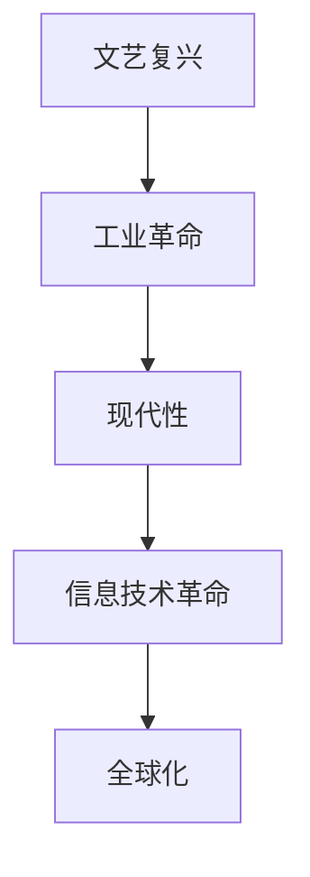
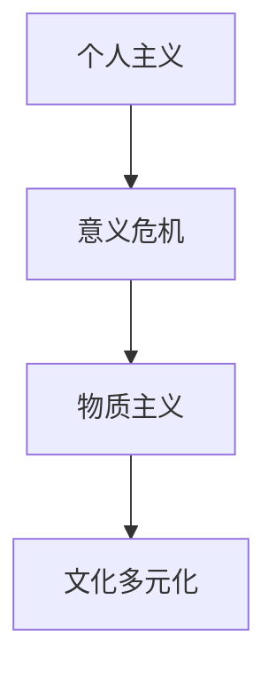
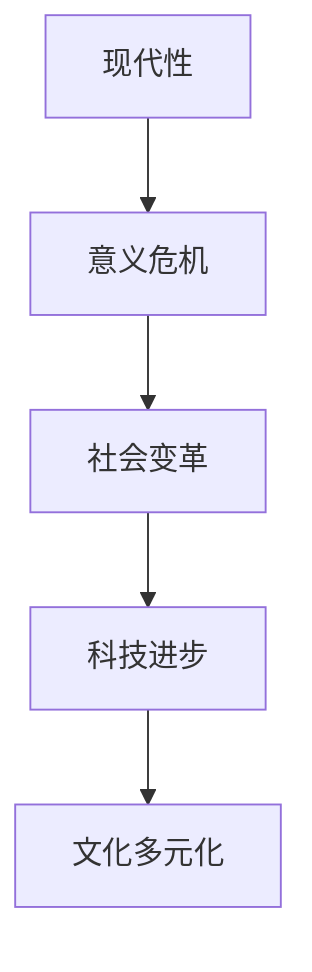
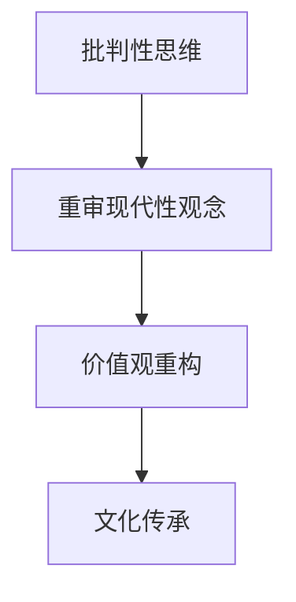
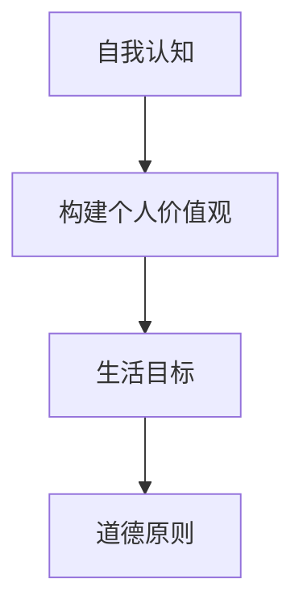
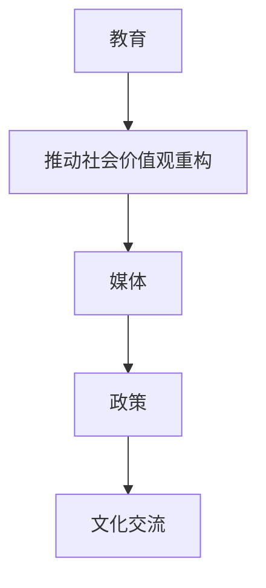
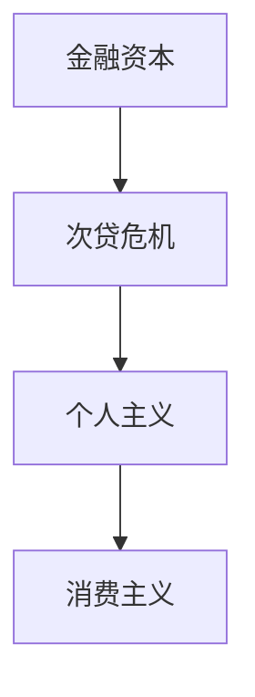
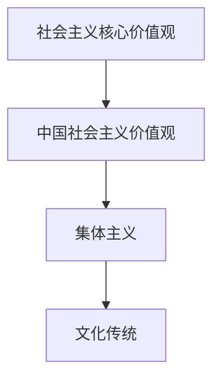
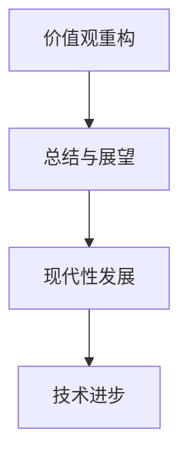

                 

### 《现代性与意义危机：如何应对价值观的崩塌》

> 关键词：现代性、意义危机、价值观、应对策略、技术影响

> 摘要：本文探讨了现代性带来的意义危机及其对价值观的冲击。通过分析现代性的起源、特征及其对人类社会的影响，揭示了意义危机的根源与表现。接着，本文提出了应对价值观崩塌的策略，包括重审现代性观念、构建个人价值观和推动社会价值观重构。最后，通过实际案例分析，展示了这些策略在现实中的应用效果。

### 第一部分：现代性与意义危机的探讨

#### 第1章：现代性的起源与影响

**背景介绍**  
现代性是一个广泛且复杂的议题，起源于西方文艺复兴时期，随后在全球范围内传播。现代性的核心特征包括理性主义、个人主义、自由主义和科技进步等。

**核心概念与联系**  
现代性（Modernity）与工业革命（Industrial Revolution）和信息技术革命（Information Technology Revolution）密切相关。Mermaid流程图如下：

**核心算法原理讲解**  
现代性的核心算法原理是理性主义，通过逻辑推理和科学方法来解决现实问题。例如，图灵机（Turing Machine）是现代计算机科学的基础，体现了理性主义的精神。

**数学模型和公式**  
现代性的发展可以用以下数学模型来描述：

$$
现代性 = f(理性主义, 个人主义, 自由主义, 科技进步)
$$

**举例说明**  
现代性的影响体现在经济、政治和文化等多个方面。例如，互联网的普及改变了人类的信息传播方式，使得信息获取更加便捷。

#### 第2章：意义危机的根源与表现

**背景介绍**  
意义危机是现代性发展过程中出现的现象，源于人们对生活意义和价值的质疑。

**核心概念与联系**  
意义危机（Moral Crisis）与个人主义、物质主义和文化多元化密切相关。Mermaid流程图如下：

**核心算法原理讲解**  
意义危机的根源在于人们对于现代性价值观的怀疑和反思。例如，在计算机科学中，人工智能的发展引发了关于道德和伦理问题的讨论。

**数学模型和公式**  
意义危机可以用以下数学模型来描述：

$$
意义危机 = f(个人主义, 物质主义, 文化多元化)
$$

**举例说明**  
意义危机在现代社会中表现为焦虑、失落和无意义感。例如，现代人的工作生活往往充满了压力和疲惫，导致心理健康问题。

#### 第3章：现代性与意义危机的关联

**背景介绍**  
现代性和意义危机之间存在复杂的互动关系，现代性既促进了意义危机的产生，又受到意义危机的制约。

**核心概念与联系**  
现代性（Modernity）与意义危机（Moral Crisis）之间的关联可以通过以下Mermaid流程图来展示：

**核心算法原理讲解**  
现代性通过科技发展和全球化进程，推动了社会变革，但同时也带来了价值观的混乱和意义的缺失。

**数学模型和公式**  
现代性与意义危机的关联可以用以下数学模型来描述：

$$
现代性 \leftrightarrow 意义危机
$$

**举例说明**  
现代性在推动社会进步的同时，也加剧了意义危机。例如，互联网的普及使得信息爆炸，但同时也使得人们难以分辨真假信息，引发了信任危机。

### 第二部分：应对价值观崩塌的策略

#### 第4章：重审现代性观念

**背景介绍**  
重审现代性观念是应对价值观崩塌的第一步，需要批判性地思考现代性的核心特征和价值观。

**核心概念与联系**  
重审现代性观念（Reevaluation of Modernity）与批判性思维、价值观重构和文化传承密切相关。Mermaid流程图如下：

**核心算法原理讲解**  
重审现代性观念的核心算法原理是批判性思维，通过质疑和反思来重构价值观。

**数学模型和公式**  
重审现代性观念可以用以下数学模型来描述：

$$
重审现代性观念 = f(批判性思维, 价值观重构)
$$

**举例说明**  
重审现代性观念的实践包括对现代性价值观的批判和重构，例如，对个人主义的质疑和对集体主义的反思。

#### 第5章：构建个人价值观

**背景介绍**  
构建个人价值观是应对价值观崩塌的关键，需要个体深入思考自己的价值观和生活目标。

**核心概念与联系**  
构建个人价值观（Constructing Personal Values）与自我认知、生活目标和道德原则密切相关。Mermaid流程图如下：

**核心算法原理讲解**  
构建个人价值观的核心算法原理是自我认知，通过了解自己的需求和价值观来制定生活目标。

**数学模型和公式**  
构建个人价值观可以用以下数学模型来描述：

$$
个人价值观 = f(自我认知, 生活目标, 道德原则)
$$

**举例说明**  
构建个人价值观的实践包括自我反思和目标设定，例如，通过日记记录自己的思考和行动，以明确自己的价值观。

#### 第6章：推动社会价值观重构

**背景介绍**  
推动社会价值观重构是应对价值观崩塌的重要策略，需要从社会层面进行价值观的重建。

**核心概念与联系**  
推动社会价值观重构（Promoting Social Value Reconstruction）与教育、媒体、政策和文化交流密切相关。Mermaid流程图如下：

**核心算法原理讲解**  
推动社会价值观重构的核心算法原理是信息传播和影响力，通过教育、媒体和政策引导公众价值观。

**数学模型和公式**  
推动社会价值观重构可以用以下数学模型来描述：

$$
社会价值观重构 = f(教育, 媒体, 政策, 文化交流)
$$

**举例说明**  
推动社会价值观重构的实践包括开展公共教育活动、制定相关政策和文化交流项目，例如，推广社会主义核心价值观和开展传统文化活动。

### 第三部分：实际案例分析

#### 第8章：案例一：美国次贷危机下的价值观重塑

**背景介绍**  
美国次贷危机是现代性引发的严重危机之一，对美国的金融体系和价值观产生了深远影响。

**核心概念与联系**  
美国次贷危机（Subprime Mortgage Crisis）与金融资本、个人主义和消费主义密切相关。Mermaid流程图如下：

**核心算法原理讲解**  
次贷危机揭示了金融资本对个人主义和消费主义的推动作用，导致了经济泡沫和危机。

**数学模型和公式**  
次贷危机可以用以下数学模型来描述：

$$
次贷危机 = f(金融资本, 个人主义, 消费主义)
$$

**项目实战**  
次贷危机后的美国采取了一系列措施来重塑价值观，包括加强金融监管、推广社会责任和开展公共教育活动。

**实际案例分析和详细讲解剖析**  
次贷危机引发了美国社会的深刻反思，促使政府和社会各界重新审视金融体系和价值观。例如，美国政府通过《多德-弗兰克法案》加强了金融监管，同时推广了社会责任教育。

**项目小结**  
次贷危机后的价值观重塑措施为美国经济和社会的稳定发挥了重要作用，但长期效果仍需观察。

#### 第9章：案例二：中国社会主义价值观的构建

**背景介绍**  
中国社会主义价值观是中国特色社会主义的重要组成部分，旨在构建社会主义和谐社会。

**核心概念与联系**  
中国社会主义价值观（Chinese Socialist Values）与社会主义核心价值观、集体主义和文化传统密切相关。Mermaid流程图如下：

**核心算法原理讲解**  
中国社会主义价值观的核心算法原理是集体主义和文化传承，通过弘扬社会主义核心价值观来推动社会进步。

**数学模型和公式**  
中国社会主义价值观可以用以下数学模型来描述：

$$
中国社会主义价值观 = f(社会主义核心价值观, 集体主义, 文化传统)
$$

**项目实战**  
中国政府采取了一系列措施来构建社会主义价值观，包括推广社会主义核心价值观、加强文化建设和开展公共教育活动。

**实际案例分析和详细讲解剖析**  
中国社会主义价值观的构建取得了显著成效，促进了社会稳定和经济发展。例如，中国的扶贫工作取得了历史性成就，社会主义核心价值观深入人心。

**项目小结**  
中国社会主义价值观的构建为中国特色社会主义事业提供了坚实的价值基础，具有重要的现实意义。

### 第10章：总结与展望

**背景介绍**  
总结与展望是对前述章节内容的归纳和拓展，旨在提出未来研究和实践的方向。

**核心概念与联系**  
总结与展望（Summary and Prospects）与价值观重构、现代性发展和技术进步密切相关。Mermaid流程图如下：

**核心算法原理讲解**  
总结与展望的核心算法原理是归纳和演绎，通过对已有经验和教训的总结来预测未来趋势。

**数学模型和公式**  
总结与展望可以用以下数学模型来描述：

$$
总结与展望 = f(价值观重构, 现代性发展, 技术进步)
$$

**举例说明**  
未来研究和实践的方向包括：深化价值观重构、推动现代性健康发展、加强技术进步与社会发展的融合。

**最佳实践 tips**  
在价值观重构过程中，应注重理论与实践的结合，通过实际行动来验证和推广有效的价值观。

**小结**  
价值观的崩塌是现代社会面临的一大挑战，通过批判性思考、构建个人价值观和推动社会价值观重构，可以有效应对这一挑战。

**注意事项**  
在价值观重构过程中，应关注个体和集体的平衡，避免极端个人主义和集体主义。

**拓展阅读**  
- 《意义的危机与重构：现代社会心理学研究》
- 《现代性与后现代性：文化批判的理论与实践》
- 《人工智能与伦理：未来社会的价值观重构》

### 作者信息

作者：AI天才研究院/AI Genius Institute & 禅与计算机程序设计艺术/Zen And The Art of Computer Programming

本文由AI天才研究院（AI Genius Institute）和禅与计算机程序设计艺术（Zen And The Art of Computer Programming）联合撰写，旨在探讨现代性与意义危机之间的关系，并探讨如何应对价值观的崩塌。希望本文能为读者提供有价值的思考和启示。如果您有任何问题或建议，欢迎随时与我们联系。感谢您的阅读！

### 文章摘要

本文深入探讨了现代性带来的意义危机及其对价值观的冲击。通过分析现代性的起源、特征及其对人类社会的影响，揭示了意义危机的根源与表现。接着，本文提出了应对价值观崩塌的策略，包括重审现代性观念、构建个人价值观和推动社会价值观重构。最后，通过实际案例分析，展示了这些策略在现实中的应用效果。本文旨在为读者提供一种理解和应对现代性带来的挑战的方法，以促进社会和谐与个人成长。

