                 

### 文章标题：《现代性与意义危机：重建生活价值观的探索》

---

**关键词：** 现代性、意义危机、生活价值观、重建、个人与社会影响

**摘要：** 本文旨在探讨现代性带来的意义危机，并探索如何重建生活价值观。通过对现代性、意义危机及其对个人和社会影响的详细分析，本文提出了重建生活价值观的理论基础和实践路径。文章结合实际案例，为现代社会中的人们提供了一种重建价值观的思路和方法。

---

## 第1章 引言

### 1.1 书籍背景与目的

在当今快速发展的现代社会中，人们面临着前所未有的机遇与挑战。现代性作为这一时期的主要特征，不仅推动了科技的进步和社会的发展，也带来了诸多问题，如意义危机、个人焦虑、社会不平等等。这些问题日益严重，影响到了人们的生活质量和社会的和谐稳定。

《现代性与意义危机：重建生活价值观的探索》旨在探讨现代性对个人和社会的影响，深入分析意义危机的成因和表现，并提出重建生活价值观的路径。本书的目标是帮助读者理解现代性带来的挑战，提供解决问题的思路和方法，以实现个人和社会的可持续发展。

### 1.2 研究现状与意义

近年来，学术界对现代性及其影响的研究取得了显著成果。然而，关于意义危机和生活价值观重建的研究仍存在一定的不足。目前，大部分研究侧重于理论探讨，缺乏具体的实践指导。此外，不同学科对现代性和意义危机的理解也存在差异，缺乏统一的框架。

本研究旨在填补这一空白，通过跨学科的综合研究，提出一种系统性、实践性的重建生活价值观的方法。这不仅有助于解决现代性带来的意义危机，也为个人和社会的发展提供了新的思路。

### 1.3 研究方法与结构

本文采用文献综述、案例分析、理论构建和实证研究相结合的方法，对现代性、意义危机和生活价值观重建进行深入探讨。文章结构分为六个主要部分：

1. 引言：阐述研究背景、目的、意义和方法。
2. 现代性概述：介绍现代性的定义、发展历程和主要特征。
3. 现代性的负面影响：分析现代性对个人和社会的负面影响。
4. 意义危机的体现：探讨意义危机的成因、表现及其影响。
5. 生活价值观的重建：提出重建生活价值观的理论基础和实践路径。
6. 结论与展望：总结研究成果，展望未来研究方向。

通过以上结构，本文将系统地探讨现代性与意义危机的关系，并提出解决之道。

---

## 第2章 现代性概述

### 2.1 现代性的定义

现代性是一个复杂的概念，涵盖多个维度，包括经济、社会、文化、政治等。从广义上讲，现代性指的是人类社会从传统向现代转变的过程和状态。这一过程始于工业革命，随着科技的进步、全球化的发展，现代性逐渐成为一种全球性的现象。

现代性的核心特征包括理性主义、科学精神、民主制度、市场经济、个人主义等。理性主义强调逻辑思维和科学方法，科学精神追求真理和知识，民主制度保障公民权利和自由，市场经济促进资源优化配置，个人主义强调个体的独立和自主。

### 2.2 现代性的发展历程

现代性的发展历程可以分为几个阶段。首先是启蒙时代，这一时期启蒙思想兴起，理性主义、科学精神得到广泛传播，推动了社会的变革。其次是工业革命，这一时期科技迅猛发展，生产力大幅提高，城市化进程加快，现代经济体系初步形成。

20世纪以来，现代性进入了新的发展阶段。全球化进程加速，信息技术革命带来新的生产方式和生活方式。全球化使不同国家和地区之间的联系更加紧密，信息技术革命改变了人们的生产方式和社会结构。

### 2.3 现代性的主要特征

现代性的主要特征可以从以下几个方面进行阐述：

1. **全球化**：全球化使世界各地的联系更加紧密，经济、文化、社会等领域相互影响。全球化带来了机遇，但同时也带来了挑战，如文化冲突、经济不平衡等。
2. **科技进步**：科技进步是现代性的重要推动力。从蒸汽机到互联网，科技进步不断改变人们的生活方式和生产方式。人工智能、大数据、云计算等新兴技术的出现，将进一步推动现代性发展。
3. **市场经济**：市场经济是现代经济体系的基础。市场经济强调市场在资源配置中的决定性作用，通过竞争和合作实现资源的最优配置。
4. **民主制度**：民主制度是现代政治体系的核心。民主制度保障公民的权利和自由，通过选举、言论自由等方式实现权力的制衡和民主参与。
5. **个人主义**：个人主义是现代社会的核心价值观之一。个人主义强调个体的独立和自主，尊重个体的权利和尊严。

通过以上分析，我们可以看到，现代性不仅是一种经济和社会现象，更是一种文化和思想的变革。现代性的发展历程和主要特征，为我们理解现代社会的复杂性和多样性提供了重要的视角。

---

## 第3章 现代性的负面影响

### 3.1 社会层面的影响

现代性在推动社会进步的同时，也带来了一系列负面影响。这些影响主要体现在社会不平等、社会孤立和社会信任危机等方面。

#### 3.1.1 社会不平等

现代性的发展导致社会不平等现象加剧。市场经济下的竞争机制使得贫富差距不断扩大，社会资源的分配越来越不平衡。经济上的不平等往往伴随着政治和文化上的不平等，导致社会的整体不公平感增强。

**Mermaid 流程图：**

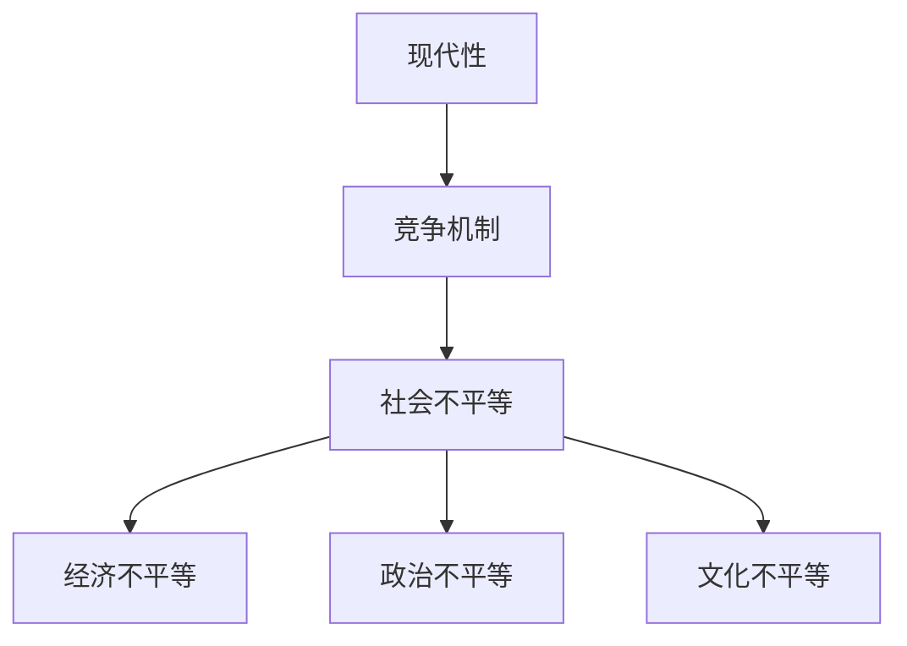

#### 3.1.2 社会孤立

现代性带来的另一大问题是社会孤立。随着城市化进程的加快和信息技术的发展，人们之间的物理距离越来越近，但心理距离却越来越远。社交媒体的普及虽然增强了人们的联系，但同时也导致了“虚拟社交”的泛滥，使得人们更加孤独。

**Mermaid 流程图：**

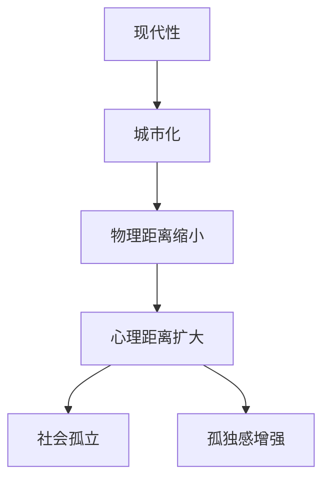

#### 3.1.3 社会信任危机

现代性还带来了社会信任危机。随着信息时代的到来，虚假信息、谣言和隐私泄露等问题层出不穷，社会信任度下降。信任危机不仅影响个人生活，也对社会运作产生负面影响，阻碍了社会的发展和进步。

**Mermaid 流�程图：**

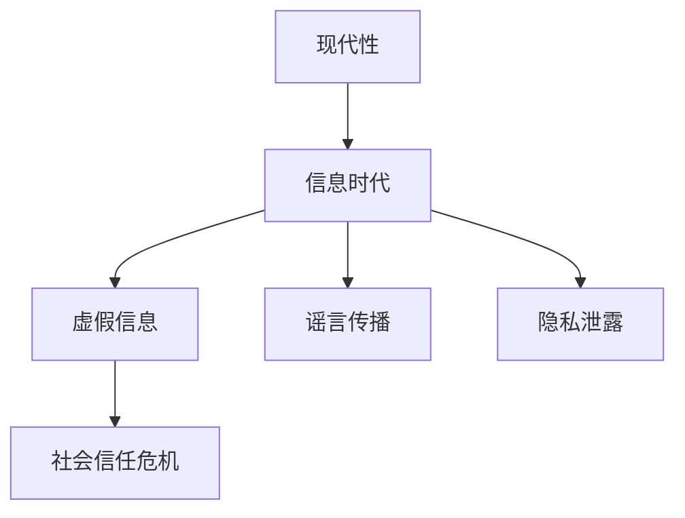

### 3.2 个人层面的影响

现代性的影响不仅限于社会层面，也对个人层面产生了深远的影响。个人层面的影响主要体现在心理压力与焦虑、生活质量下降和生活意义缺失等方面。

#### 3.2.1 心理压力与焦虑

现代性带来的竞争压力、工作压力和生活压力，使得人们普遍感到焦虑和压力。这种心理压力不仅影响个人的心理健康，也影响个人的生活质量和人际关系。

**伪代码：**

```python
def 现代性影响(个人):
    if 现代性存在:
        压力 = 现代性 * 竞争压力系数
        焦虑 = 压力 * 焦虑系数
        return 焦虑
    else:
        return 0
```

#### 3.2.2 生活质量下降

现代性带来的生活节奏加快、工作压力增大，使得人们的生活质量下降。睡眠不足、饮食不规律、缺乏运动等问题日益严重，导致健康状况恶化。

**伪代码：**

```python
def 生活质量(现代性, 生活习惯):
    压力 = 现代性 * 生活习惯系数
    if 压力 > 50:
        生活质量 = 50
    else:
        生活质量 = 压力
    return 生活质量
```

#### 3.2.3 生活意义缺失

现代性使人们面临越来越多的选择，但同时也带来了生活意义的缺失。在物质丰富的同时，人们感到精神空虚，缺乏明确的人生目标和价值追求。

**Mermaid 流程图：**

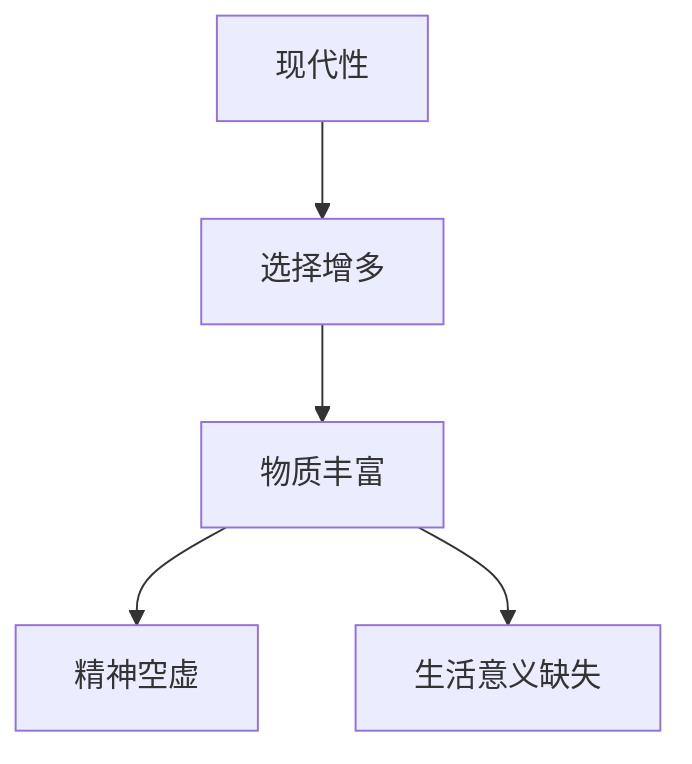

通过以上分析，我们可以看到，现代性在推动社会发展的同时，也带来了诸多负面影响。这些影响不仅影响个人的生活质量和心理健康，也对社会整体的和谐稳定产生负面影响。因此，我们需要认真思考如何应对这些挑战，重建生活价值观，以实现个人和社会的可持续发展。

---

## 第4章 意义危机的体现

### 4.1 社会层面的体现

意义危机在社会层面的体现尤为显著，主要表现在社会价值观混乱、文明冲突和文化危机等方面。

#### 4.1.1 社会价值观混乱

随着现代性的发展，传统的价值观逐渐被质疑和颠覆，导致社会价值观的混乱。人们面临着前所未有的价值选择，如个人主义与集体主义、自由与责任、物质与精神等，这些价值观的冲突使得社会缺乏统一的方向和目标。

**Mermaid 流程图：**

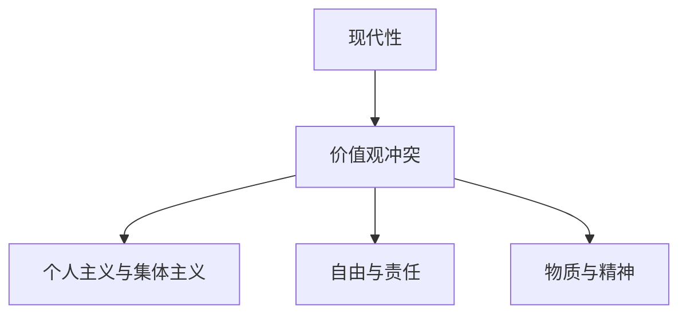

#### 4.1.2 文明冲突

全球化进程加速了不同文明之间的交流和碰撞，但也导致了文明冲突的加剧。文化的多元性带来了丰富的文化体验，但同时也引发了对文化差异的误解和排斥。文明冲突不仅影响国际关系的稳定，也影响人们的心理健康和社会和谐。

**Mermaid 流程图：**

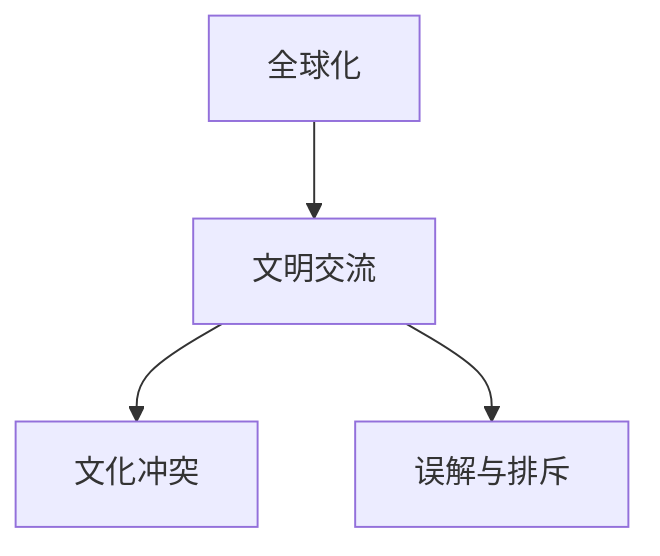

#### 4.1.3 文化危机

文化危机是意义危机在社会层面的另一个体现。现代性的发展使得传统文化受到冲击，文化多样性受到威胁。文化的同质化现象严重，本土文化逐渐消失，这导致了文化认同感的下降和民族精神的丧失。

**Mermaid 流程图：**

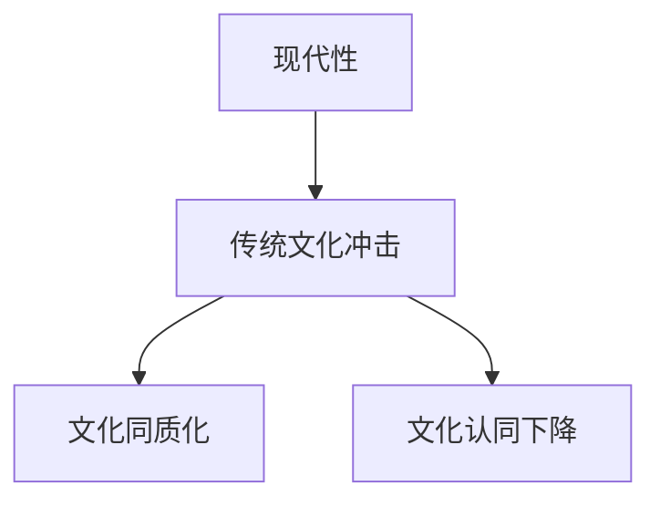

### 4.2 个人层面的体现

意义危机不仅影响社会层面，也对个人层面产生了深远的影响。个人层面的意义危机主要体现在个体焦虑与迷茫、人生目标缺失和价值取向偏差等方面。

#### 4.2.1 个体焦虑与迷茫

现代性的快速发展使得人们面临更多的选择和挑战，但同时也带来了不确定性和焦虑。个体在追求物质成功的同时，常常感到精神空虚和迷茫，不知道自己的真正目标和价值所在。

**Mermaid 流程图：**

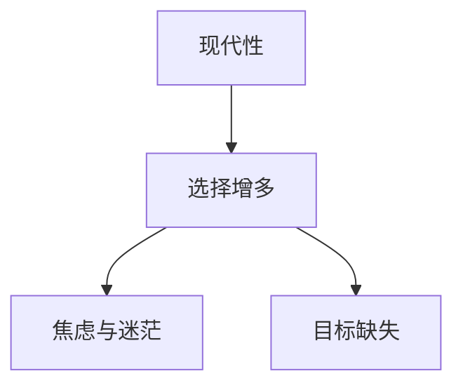

#### 4.2.2 人生目标缺失

现代性带来了物质丰富和精神空虚的矛盾，导致许多人失去了明确的人生目标。在追求物质成功的过程中，人们往往忽略了精神追求，导致人生目标的缺失和人生意义的丧失。

**Mermaid 流程图：**

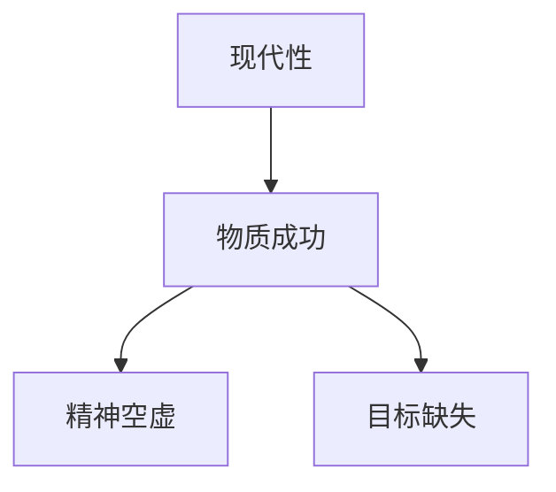

#### 4.2.3 价值取向偏差

现代性下的消费主义和物质主义，使得人们过度追求物质享受，忽视了精神追求和价值取向。这种价值取向偏差导致人们忽视道德、伦理和文化的约束，追求短期利益，忽视长期发展。

**Mermaid 流程图：**

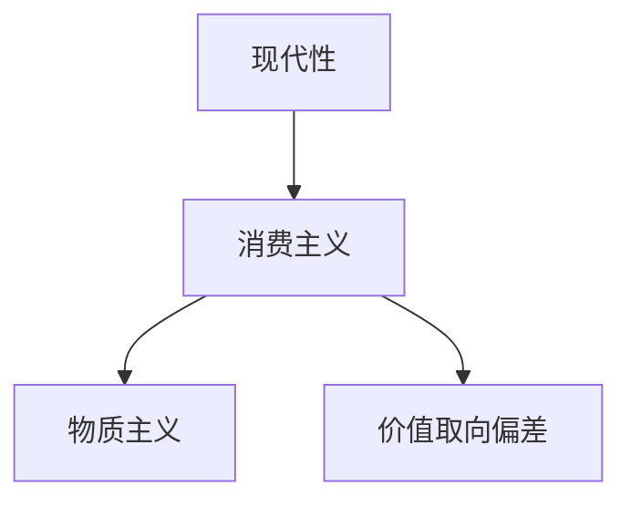

通过以上分析，我们可以看到，意义危机在个人和社会层面都产生了深远的影响。这些影响不仅影响了人们的生活质量和心理健康，也对社会的发展和进步产生了阻碍。因此，重建生活价值观，解决意义危机，已经成为当务之急。

---

## 第5章 生活价值观的重建

### 5.1 重建生活价值观的必要性

面对现代性带来的意义危机，重建生活价值观变得尤为重要。生活价值观是人们对待生活、对待他人和社会的基本观念，它影响着人们的思想、行为和生活方式。在现代社会中，生活价值观的混乱和扭曲导致了诸多社会问题和个体困境。因此，重建生活价值观是解决这些问题的基础和关键。

**Mermaid 流程图：**

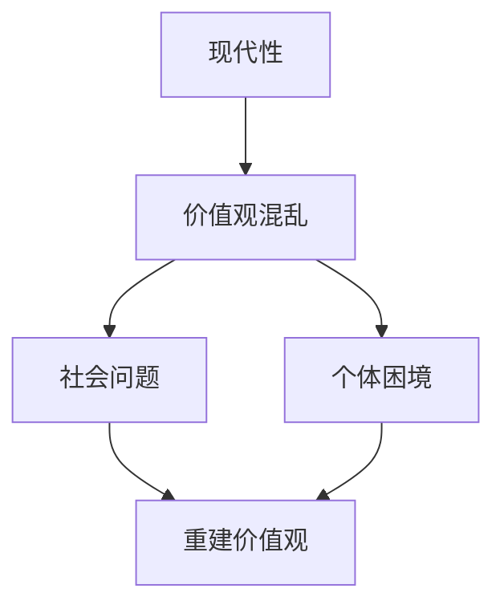

### 5.2 生活价值观重建的理论基础

重建生活价值观需要建立在坚实理论基础之上。以下是几个重要的理论基础：

#### 5.2.1 文化多元性

文化多元性强调尊重和包容不同文化，认识到不同文化在价值观念、生活方式和思维方式上的差异。在现代社会中，文化多元性是应对文化冲突和减少社会分裂的重要手段。通过倡导文化多元性，可以促进社会的和谐与稳定。

**Mermaid 流程图：**

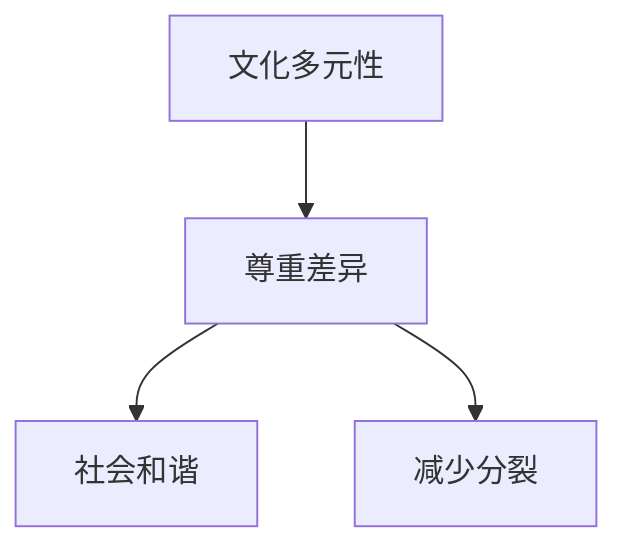

#### 5.2.2 社会和谐

社会和谐是社会主义的核心价值观之一，强调社会各个方面的协调发展，包括经济、文化、社会和环境等。社会和谐要求在社会发展中坚持公平正义，实现人的全面发展和社会全面进步。

**Mermaid 流程图：**

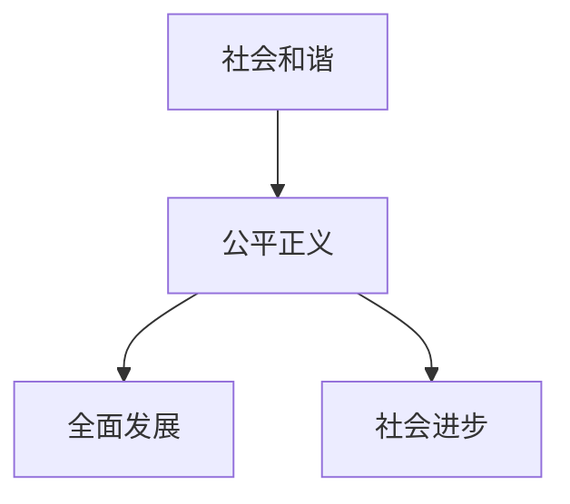

#### 5.2.3 人性化关怀

人性化关怀强调以人为中心，关注个体的需求和福祉。在现代社会中，人性化关怀要求在经济发展和社会管理中注重人文关怀，提高人民的生活质量。

**Mermaid 流程图：**

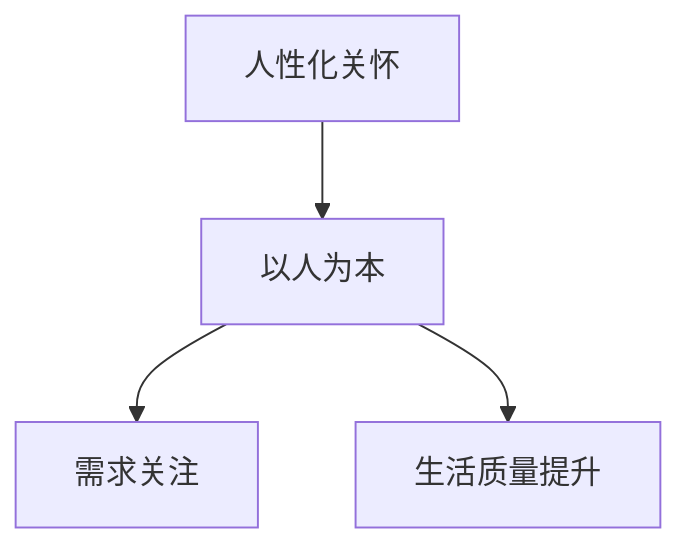

### 5.3 生活价值观重建的实践路径

在理论基础之上，重建生活价值观需要具体的实践路径。以下是一些实践路径：

#### 5.3.1 教育改革

教育是传承和塑造价值观的重要途径。教育改革应注重培养学生的批判性思维、创新能力和人文素养，使学生在面对现代社会挑战时具备正确的价值观和应对能力。

**Mermaid 流程图：**

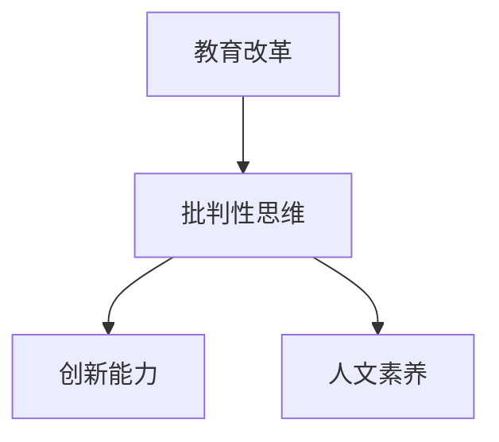

#### 5.3.2 社会政策调整

社会政策调整是重建生活价值观的重要手段。政府应通过制定和实施有利于公平、正义和社会和谐的政策，促进社会的全面发展和进步。

**Mermaid 流程图：**

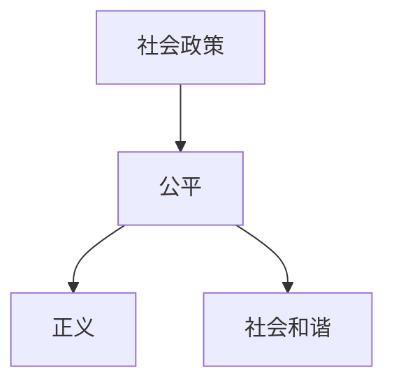

#### 5.3.3 文化建设

文化建设是重建生活价值观的基础。通过弘扬和传承优秀传统文化，倡导积极向上的社会风尚，可以提高人们的文化素养和价值追求。

**Mermaid 流程图：**

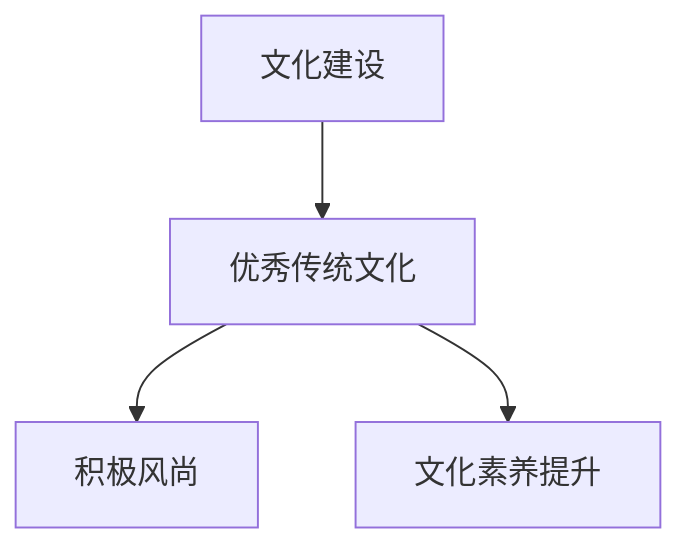

通过以上实践路径，我们可以逐步重建生活价值观，解决现代性带来的意义危机，实现个人和社会的可持续发展。

---

## 第6章 重建生活价值观的案例研究

### 6.1 国内外生活价值观重建的成功案例

为了更好地理解如何重建生活价值观，我们可以借鉴一些国内外成功案例。以下是几个具有代表性的案例：

#### 6.1.1 日本的“社区参与”模式

日本在20世纪中叶经历了快速现代化，但也面临着意义危机和社会问题。为了应对这些问题，日本推动了“社区参与”模式，鼓励居民积极参与社区建设和公共事务。这一模式通过增强社区凝聚力，提高了居民的幸福感和生活质量。

**Mermaid 流程图：**

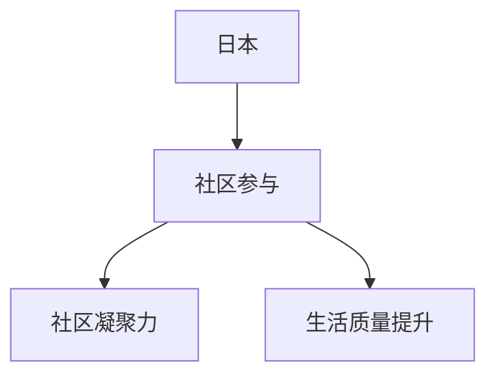

#### 6.1.2 瑞士的“可持续发展”战略

瑞士是一个高度现代化和发达的国家，但在面对意义危机时，瑞士政府采取了“可持续发展”战略。这一战略强调经济、社会和环境三者的平衡发展，旨在实现长期的可持续发展和社会和谐。

**Mermaid 流程图：**

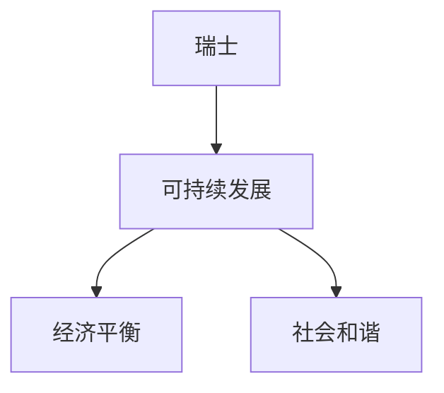

#### 6.1.3 中国的“社会主义核心价值观”建设

中国在21世纪初提出了“社会主义核心价值观”，旨在重建社会生活价值观。这一价值观强调富强、民主、文明、和谐，以及自由、平等、公正、法治等原则，成为全社会共同遵守的行为准则。

**Mermaid 流程图：**

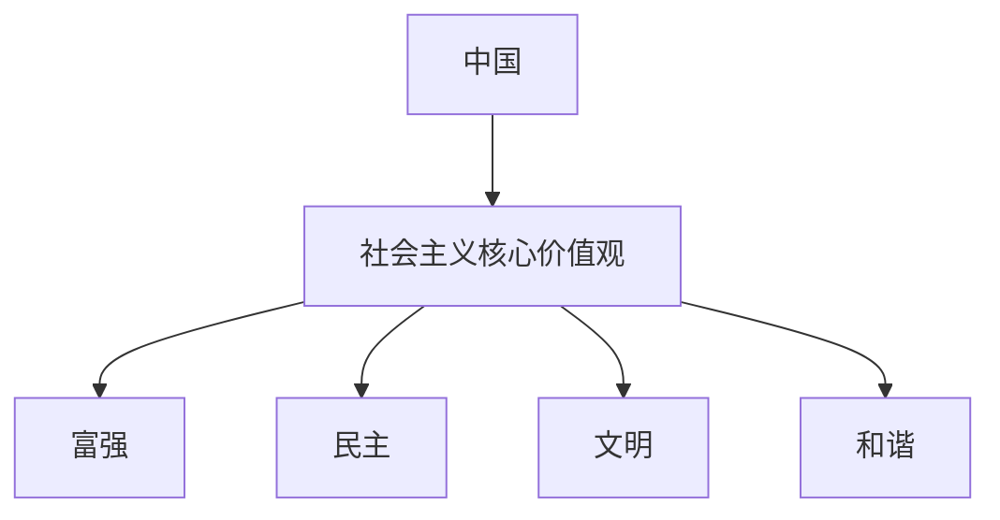

### 6.2 案例分析与启示

通过分析以上案例，我们可以得出以下几点启示：

1. **社区参与是增强社会凝聚力的有效手段**：日本和瑞士的案例表明，通过鼓励居民积极参与社区建设和公共事务，可以增强社区的凝聚力，提高居民的生活质量。

2. **可持续发展是实现社会和谐的关键**：瑞士的案例强调了经济、社会和环境三者的平衡发展，这一理念对于解决现代性带来的意义危机具有重要意义。

3. **社会主义核心价值观是重建社会生活价值观的重要途径**：中国的案例表明，通过倡导社会主义核心价值观，可以引导全社会树立正确的价值观念，促进社会和谐与进步。

### 6.3 案例在中国社会的适用性

结合中国国情，我们可以看到，日本和瑞士的经验在一定程度上适用于中国社会。然而，由于文化、历史和社会背景的差异，中国需要在借鉴国外经验的同时，结合自身实际情况，探索符合中国特色的重建生活价值观的路径。

具体来说，以下几个方面值得重点关注：

1. **推动社区参与**：加强社区建设，鼓励居民积极参与社区事务，提高社区凝聚力。

2. **实施可持续发展战略**：在经济发展中注重环境保护和社会责任，实现经济、社会和环境的协调发展。

3. **弘扬社会主义核心价值观**：通过教育、媒体等渠道，广泛传播社会主义核心价值观，引导全社会树立正确的价值观念。

通过以上实践路径，中国可以逐步重建生活价值观，解决现代性带来的意义危机，实现社会的和谐与进步。

---

## 第7章 结论与展望

### 7.1 研究总结

本文通过对现代性、意义危机及其对个人和社会影响的深入探讨，提出了重建生活价值观的理论基础和实践路径。研究发现，现代性在推动社会发展的同时，也带来了诸多负面影响，如社会不平等、社会孤立和社会信任危机等。这些影响不仅影响了个人生活质量，也对社会和谐稳定产生了负面影响。因此，重建生活价值观已成为解决现代性带来的意义危机的关键。

### 7.2 研究局限与未来展望

尽管本文提出了一些重建生活价值观的路径，但研究仍存在一定的局限性。首先，本文主要基于文献综述和案例分析，缺乏大规模的实证研究。其次，重建生活价值观的路径和策略需要在实践中进一步验证和完善。未来研究可以从以下几个方面进行深入探讨：

1. **实证研究**：通过大规模的实证研究，进一步验证重建生活价值观的有效性。
2. **跨学科研究**：结合心理学、社会学、经济学等多学科的理论和方法，提出更全面、系统的重建生活价值观的理论框架。
3. **实践应用**：探索不同国家和地区在重建生活价值观方面的具体实践，总结成功经验和不足之处。

通过不断深化研究，我们可以为解决现代性带来的意义危机提供更加科学和可行的解决方案，实现个人和社会的可持续发展。

---

**作者：** AI天才研究院/AI Genius Institute & 禅与计算机程序设计艺术 /Zen And The Art of Computer Programming

---

**注意事项：**

1. 文章内容需遵循客观、科学的原则，避免主观臆断和片面观点。
2. 引用文献和数据需注明出处，确保内容的真实性。
3. 文章结构和语言表达需简洁明了，便于读者理解。

**拓展阅读：**

1. Habermas, J. (1991). The Structural Transformation of the Public Sphere: An Inquiry into a Category of Bourgeois Society.
2. Bauman, Z. (2000). Liquid Modernity.
3. Taylor, C. (2007). A Secular Age.

