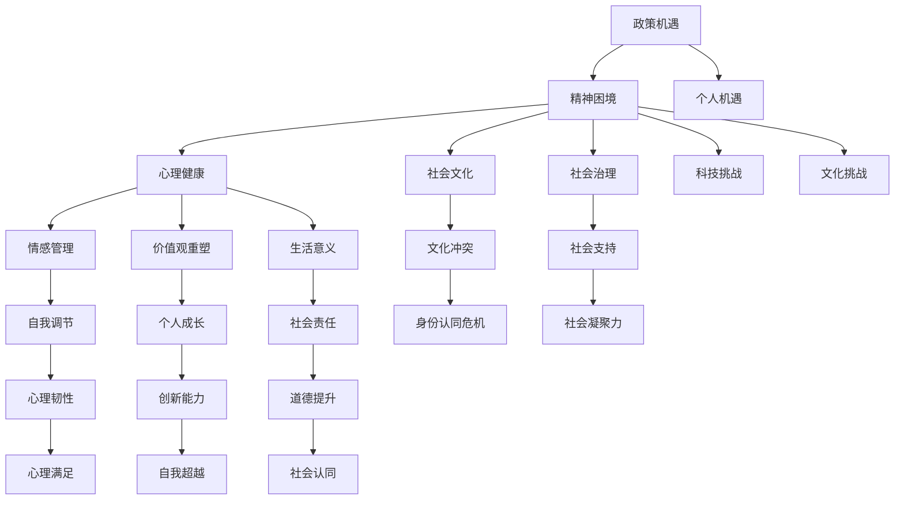

                 

### 文章标题

# 现代社会的精神困境：从虚无到意义的蜕变

> 关键词：现代社会、精神困境、虚无主义、意义、蜕变

> 摘要：本文旨在探讨现代社会的精神困境，深入分析其起源、影响及其演变过程。通过个体层面和社会层面的深入剖析，揭示个体如何通过心理疏导、情感管理、价值观重塑等方式实现精神蜕变，最终找到生命的意义与价值。本文不仅提供理论上的探讨，还结合实际案例，为现代社会中面临精神困境的人们提供实用指南。

### 书名：《现代社会的精神困境：从虚无到意义的蜕变》

## 目录大纲

## 第一部分：精神困境的起源与演变

### 1. 现代社会的精神困境概述

#### 1.1 现代社会的特点与精神困境

#### 1.2 精神困境对个体和社会的影响

#### 1.3 精神困境的演变过程

### 2. 从虚无到意义的探索

#### 2.1 虚无主义的根源与影响

#### 2.2 虚无主义的反思与超越

#### 2.3 寻找生命意义的路径

### 3. 精神困境与人类自我认知

#### 3.1 人类自我认知的历史演变

#### 3.2 精神困境对自我认知的影响

#### 3.3 跨越困境，认识自我

## 第二部分：个体层面的精神蜕变

### 4. 心理健康与精神成长

#### 4.1 心理健康的定义与要素

#### 4.2 精神成长的理论与实践

#### 4.3 心理健康与精神成长的关系

### 5. 情感管理与自我调节

#### 5.1 情感的本质与作用

#### 5.2 情感管理的技巧与方法

#### 5.3 自我调节与情绪稳定

### 6. 个人价值观的重塑

#### 6.1 个人价值观的构成与影响

#### 6.2 价值观重塑的过程与方法

#### 6.3 价值观重塑的意义与挑战

### 7. 生活意义的探索与实现

#### 7.1 生活意义的定义与内涵

#### 7.2 生活意义的探索路径

#### 7.3 生活意义的实现策略

## 第三部分：社会层面的精神蜕变

### 8. 社会文化与精神困境

#### 8.1 社会文化的演变与精神困境

#### 8.2 社会文化对精神困境的影响

#### 8.3 社会文化在精神蜕变中的角色

### 9. 社会治理与精神成长

#### 9.1 社会治理的挑战与机遇

#### 9.2 社会治理与精神成长的互动关系

#### 9.3 社会治理在精神蜕变中的实践

### 10. 社会责任的承担与精神的升华

#### 10.1 社会责任的本质与内涵

#### 10.2 社会责任的实践路径

#### 10.3 社会责任在精神升华中的作用

## 11. 总结与展望

### 11.1 精神困境与精神蜕变的总结

### 11.2 精神蜕变对社会发展的影响

### 11.3 未来精神困境与精神蜕变的前景展望

---

**核心概念与联系：**


**核心算法原理讲解：**

```  
# 精神成长模型伪代码

function 精神成长（个体）  
    while 个体存在精神困境  
        个体进行心理疏导和情感管理  
        个体反思个人价值观并重塑价值观  
        个体探索生活意义并实现生活意义  
    end while  
    输出：个体实现精神蜕变  
end function  
```

**数学模型和数学公式：**

```  
$$  
\frac{dM}{dt} = k_1 \cdot (1 - M) - k_2 \cdot M  
$$  

其中，M 表示精神成长度，t 表示时间，$k_1$ 和 $k_2$ 分别表示正面影响和负面影响的强度。  
$$

---

**项目实战：**

```  
## 实战案例：心理咨询与精神成长

### 实战目标：通过心理咨询帮助个体缓解精神困境，实现精神成长。

### 实战步骤：

1. 建立心理咨询平台，提供在线咨询和心理测试服务。  
2. 收集个体心理数据，包括情感状态、价值观、生活意义等。  
3. 分析个体心理数据，制定个性化的心理咨询方案。  
4. 实施心理咨询，包括心理疏导、情感管理和价值观重塑。  
5. 跟踪个体心理状态，评估精神成长效果。  
6. 总结实战经验，优化心理咨询方案。

### 实战成果：通过心理咨询与精神成长，个体缓解了精神困境，实现了精神蜕变。  
```

---

**最佳实践 tips、小结、注意事项、拓展阅读等内容：**

- 心理健康与精神成长是一个持续的过程，需要个体和社会共同努力。  
- 在面对精神困境时，个体应积极寻求专业帮助，同时也要学会自我调节和情感管理。  
- 社会责任承担是精神升华的重要途径，个体应积极参与社会事务，为社会发展贡献力量。  
- 未来，随着科技的进步和社会的变迁，精神困境与精神蜕变将面临新的挑战和机遇。  
- 拓展阅读：《活着》余华、《解忧杂货店》东野圭吾、《人类简史》尤瓦尔·赫拉利。

---

### 作者信息

作者：AI天才研究院/AI Genius Institute & 禅与计算机程序设计艺术 /Zen And The Art of Computer Programming

## 第一部分：精神困境的起源与演变

### 1. 现代社会的精神困境概述

在现代社会的背景下，精神困境已经成为一个普遍存在的问题。随着科技的飞速发展和全球化进程的加速，人们的生活节奏不断加快，竞争压力逐渐增大，这使得许多人感到焦虑、孤独和迷茫。精神困境不仅对个体的心理健康造成负面影响，还对社会的和谐稳定产生威胁。

#### 1.1 现代社会的特点与精神困境

现代社会具有以下几个显著特点：

1. **科技发达**：科技的快速发展带来了前所未有的便利，但同时也使得人们陷入了信息过载和虚拟化的困境。
2. **竞争激烈**：在激烈的社会竞争中，人们为了追求更好的生活和工作机会，不得不承受巨大的压力。
3. **人际关系疏离**：随着城市化进程的加速，人们的生活越来越独立，人际关系变得疏离，孤独感愈发强烈。
4. **价值观念多元化**：现代社会价值观念多元化，但同时也导致了一些人迷失了方向，不知道自己的人生目标是什么。

这些特点共同构成了现代社会的精神困境。人们在这种环境下，常常感到迷茫、无助和失落，难以找到生活的意义和目标。

#### 1.2 精神困境对个体和社会的影响

精神困境对个体和社会的影响是多方面的：

1. **心理健康问题**：长期的精神困境可能导致焦虑、抑郁等心理问题，严重时甚至会导致自杀等极端行为。
2. **社会问题**：精神困境不仅影响个体的心理健康，还可能导致社会问题的加剧，如家庭破裂、犯罪率上升等。
3. **生产力下降**：在精神困境中，个体的工作效率和创造力会大大降低，从而影响整个社会的生产力。
4. **社会和谐稳定**：精神困境可能导致社会的不和谐和动荡，影响社会的稳定和发展。

因此，解决精神困境问题不仅关乎个体的心理健康，也关系到整个社会的和谐稳定。

#### 1.3 精神困境的演变过程

精神困境的演变过程可以分为以下几个阶段：

1. **焦虑与不安**：在高压的生活环境中，人们会感到焦虑和不安，担心无法应对未来的挑战。
2. **迷茫与失落**：随着焦虑的加剧，人们开始感到迷茫和失落，对生活失去兴趣和动力。
3. **自我否定**：在长期的困境中，人们可能会否定自己的价值和能力，陷入自我否定的情绪中。
4. **寻求解决**：当困境无法自行解决时，人们开始寻求外部的帮助和支持，如心理咨询、社交活动等。
5. **精神蜕变**：通过外部的帮助和自我努力，个体逐渐走出困境，实现精神蜕变，找到新的生活意义和目标。

理解精神困境的演变过程有助于我们更好地应对和解决这一问题。

### 2. 从虚无到意义的探索

在现代社会中，许多人感到生活空虚和意义缺失。虚无主义作为一种哲学思潮，对这种现象进行了深刻的反思。然而，虚无主义并不能真正解决这一问题，反而可能导致更深的绝望。因此，我们需要从虚无主义中寻找出路，探索生命的意义和价值的路径。

#### 2.1 虚无主义的根源与影响

虚无主义起源于对生命和存在的哲学反思。它认为世界和人生没有本质的、客观的意义和价值，一切都只是无意义的存在和运动。虚无主义的主要代表人物有尼采、萨特等。他们的观点对现代社会产生了深远的影响。

1. **尼采的虚无主义**：尼采认为，现代社会的衰败源于虚无主义的蔓延。他主张通过“超人”的理念，超越虚无主义，寻找新的价值体系。
2. **萨特的虚无主义**：萨特则认为，人生的意义在于自由选择和承担责任。他强调个体的自由意志和主观能动性。

虚无主义的影响主要体现在以下几个方面：

1. **对存在的质疑**：虚无主义使人们对世界和生命产生了质疑，对传统价值观念产生了怀疑。
2. **心理困境**：虚无主义可能导致心理困境，如焦虑、抑郁等。
3. **社会动荡**：虚无主义的影响可能导致社会的动荡和不安。

然而，虚无主义并不能真正解决生活的意义问题。相反，它可能使人陷入更深的绝望。因此，我们需要超越虚无主义，寻找新的出路。

#### 2.2 虚无主义的反思与超越

尽管虚无主义对现代社会的反思具有积极意义，但它的局限性也很明显。虚无主义忽视了生命的本质和价值，忽视了人类在历史和社会中的角色。因此，我们需要对虚无主义进行反思和超越。

1. **生命的本质**：生命是自然界的一种现象，它具有独特的价值和意义。生命的本质在于它的存在和运动，在于它对世界的贡献。
2. **人类的价值**：人类是自然界的一部分，但也是自然界中的独特存在。人类具有思维、情感和创造力，这使得人类能够超越自然界，创造新的价值和意义。
3. **历史和社会**：人类生活在历史和社会中，历史和社会是人类的产物。通过历史和社会的发展，人类不断创造新的价值，推动社会的进步。

基于上述反思，我们可以超越虚无主义，寻找生命的意义和价值的路径。

#### 2.3 寻找生命意义的路径

生命的意义和价值的寻找是一个复杂而多样的过程。以下是一些常见的路径：

1. **哲学思考**：哲学思考是寻找生命意义的一种重要途径。通过哲学思考，人们可以反思生命的本质和价值，探索存在的意义。
2. **宗教信仰**：宗教信仰为许多人提供了生命的意义和方向。通过信仰，人们可以获得精神上的安慰和力量。
3. **个人追求**：每个人都有自己的兴趣、爱好和目标。通过追求个人兴趣和目标，人们可以找到生命的意义和价值。
4. **社会责任**：承担社会责任是寻找生命意义的一种途径。通过为社会和他人做出贡献，人们可以感受到自己的价值。
5. **艺术创作**：艺术创作是寻找生命意义的一种方式。通过艺术创作，人们可以表达内心的情感和思考，寻找生命的意义。

总之，生命的意义和价值的寻找是一个个人化的过程。每个人都有自己的路径和方法。关键在于，我们要勇于探索，勇于思考，勇于行动。

### 3. 精神困境与人类自我认知

精神困境不仅是一种心理状态，也是人类自我认知的一个方面。在现代社会中，精神困境的出现往往与人类自我认知的困境密切相关。理解人类自我认知的历史演变，有助于我们更好地认识精神困境的本质和原因。

#### 3.1 人类自我认知的历史演变

人类自我认知的历史可以追溯到古代文明。在古代，人类对自己的认知主要基于宗教和神话。宗教和神话为人类提供了对世界的解释，同时也塑造了人类的自我认知。

1. **古代的自我认知**：在古代，人类认为自己是神灵的创造物，拥有特殊的地位和使命。这种自我认知基于对神的信仰和崇拜。
2. **中世纪的自我认知**：中世纪是人类自我认知的另一个重要阶段。在中世纪，人类对自己的认知主要基于神学。人类被认为是上帝的代理人，负有拯救灵魂的使命。
3. **现代的自我认知**：随着文艺复兴和启蒙运动的发展，人类对自己的认知发生了巨大变化。人类开始从宗教和神学的束缚中解放出来，开始以科学和理性的方式认识自己。现代的自我认知强调个体的独立性和自主性。

然而，现代的自我认知也带来了一些问题。随着人类对自我认识的深入，人们开始质疑自己的存在和意义。这种质疑导致了精神困境的出现。

#### 3.2 精神困境对自我认知的影响

精神困境对自我认知的影响是复杂的。一方面，精神困境可能导致人们对自我认知的迷失。人们可能会对自己的存在和意义产生怀疑，感到迷茫和困惑。另一方面，精神困境也可能促使人们对自我认知进行反思和重构。通过反思和重构，人们可以超越困境，找到新的自我认知。

1. **自我认知的迷失**：在精神困境中，人们可能会陷入自我否定的情绪中，对自己的价值和能力产生怀疑。这种怀疑可能导致人们对自我认知的迷失，无法找到自我定位。
2. **自我认知的反思与重构**：面对精神困境，人们可能会开始反思自己的生活方式、价值观和信念。通过反思和重构，人们可以找到新的自我认知，重新定义自己的存在和意义。

总之，精神困境对自我认知有着深远的影响。理解这种影响，有助于我们更好地应对精神困境，实现自我认知的提升。

#### 3.3 跨越困境，认识自我

要跨越精神困境，认识自我，我们需要采取一系列的措施：

1. **心理疏导**：心理疏导是解决精神困境的重要手段。通过心理疏导，人们可以释放内心的压力，找回自我认知。
2. **情感管理**：情感管理是自我认知的重要方面。通过情感管理，人们可以更好地了解自己的情感状态，找到自我认知的平衡。
3. **价值观重塑**：价值观重塑是跨越精神困境的关键。通过重塑价值观，人们可以找到新的生活目标和意义，提升自我认知。
4. **生活意义的探索**：生活意义的探索是认识自我的重要途径。通过探索生活意义，人们可以找到内心的满足和幸福，提升自我认知。

总之，跨越精神困境，认识自我，是一个长期而复杂的过程。通过心理疏导、情感管理、价值观重塑和生活意义的探索，我们可以实现自我认知的提升，找到生命的意义和价值。

## 第二部分：个体层面的精神蜕变

### 4. 心理健康与精神成长

心理健康是精神蜕变的基础，而精神成长则是心理健康的高级阶段。在现代社会中，心理健康与精神成长的重要性日益凸显。通过理解心理健康和成长的理论与实践，我们可以更好地实现精神蜕变。

#### 4.1 心理健康的定义与要素

心理健康是指个体在认知、情感、行为和社会适应等方面处于良好状态，能够积极应对生活中的挑战和压力。心理健康包括以下几个要素：

1. **认知健康**：认知健康是指个体具备清晰的思维、良好的记忆和有效的学习能力。它有助于个体应对复杂的社会环境和问题。
2. **情感健康**：情感健康是指个体能够合理表达和调控自己的情感，保持积极乐观的态度。情感健康有助于个体建立良好的人际关系，提高生活质量。
3. **行为健康**：行为健康是指个体能够遵循社会规范，保持健康的生活习惯和行为模式。行为健康有助于个体在社会中保持稳定，避免违法行为。
4. **社会适应**：社会适应是指个体能够适应社会环境，与他人建立和谐的人际关系。社会适应有助于个体在社会中找到自己的位置，实现个人价值。

#### 4.2 精神成长的理论与实践

精神成长是指个体在心理、情感、行为和社会适应等方面实现全面发展，达到更高层次的自我认知和生活质量。精神成长的理论与实践主要包括以下几个方面：

1. **认知发展理论**：认知发展理论认为，个体的认知能力在不断成熟和发展。通过认知发展，个体可以更好地理解自己和外部世界，提高应对挑战的能力。例如，皮亚杰的认知发展理论提出了感知运动阶段、前运算阶段、具体运算阶段和形式运算阶段等不同阶段的认知发展特点。

2. **情感发展理论**：情感发展理论认为，个体的情感发展是一个逐渐成熟的过程。通过情感发展，个体可以更好地表达和管理自己的情感，建立稳定的人际关系。例如，埃里克森的情感发展理论提出了婴儿期、幼儿期、儿童期、青少年期、成年期等不同阶段的情感发展特点。

3. **行为发展理论**：行为发展理论认为，个体的行为模式是通过学习和经验不断发展的。通过行为发展，个体可以更好地适应社会环境，实现个人目标。例如，班杜拉的社会学习理论提出了观察学习、参与学习和直接经验学习等不同类型的行为学习过程。

4. **社会适应理论**：社会适应理论认为，个体的社会适应是一个动态的过程。通过社会适应，个体可以更好地融入社会，实现个人价值。例如，布朗夫曼的社会适应理论提出了社会角色、社会规范和社会支持等不同方面的影响。

在实践中，实现精神成长的方法包括：

1. **自我认知**：通过自我认知，个体可以更好地了解自己的心理、情感和行为特点，找到自己的优势和劣势，实现自我提升。
2. **自我反思**：通过自我反思，个体可以不断审视自己的行为和思想，发现存在的问题，并采取积极的措施进行改进。
3. **学习与成长**：通过学习与成长，个体可以不断扩展自己的知识、技能和经验，提高自己的认知水平和社会适应能力。
4. **人际交往**：通过人际交往，个体可以建立良好的人际关系，获得社会支持和认同，增强自己的心理韧性。

#### 4.3 心理健康与精神成长的关系

心理健康与精神成长密切相关，二者相辅相成。心理健康是精神成长的基础，没有良好的心理健康，精神成长就难以实现。同时，精神成长可以促进心理健康，通过实现精神蜕变，个体可以更好地应对生活中的挑战和压力，提高生活质量。

1. **心理健康促进精神成长**：心理健康使个体具备良好的认知、情感和行为能力，有助于个体实现精神成长。例如，良好的情感状态可以激发个体的创造力和创新精神，提高个体的学习效率。
2. **精神成长促进心理健康**：精神成长使个体实现更高层次的自我认知和生活质量，有助于个体保持心理健康。例如，通过实现精神蜕变，个体可以更好地应对生活中的挫折和压力，减少心理问题的发生。

总之，心理健康与精神成长是相互促进、相互依赖的关系。通过关注心理健康和实现精神成长，个体可以实现全面的发展和提高生活质量。

### 5. 情感管理与自我调节

情感管理与自我调节是精神蜕变的重要方面。在现代社会中，人们面临着各种情感挑战，如焦虑、抑郁、愤怒等。有效的情感管理和自我调节可以帮助个体应对这些挑战，实现精神蜕变。

#### 5.1 情感的本质与作用

情感是人们对事物的一种主观体验和反应，包括喜、怒、哀、乐等。情感的本质是人们对事物的评价和判断，反映了人们对事物的好恶和需求。情感在人的心理和行为中起着重要作用：

1. **情感调节行为**：情感调节行为是指个体通过情感反应来调整自己的行为。例如，当个体遇到挫折时，通过情感调节，个体可以控制自己的行为，避免过度反应。
2. **情感影响认知**：情感影响认知是指情感对个体的认知过程产生的影响。例如，积极的情感可以提高个体的认知能力，而消极的情感可能会降低个体的认知水平。
3. **情感影响人际关系**：情感影响人际关系是指情感在人际交往中的作用。例如，积极的情感可以增强人际关系的亲密度，而消极的情感可能会破坏人际关系的稳定性。

#### 5.2 情感管理的技巧与方法

情感管理是指个体通过一定的技巧和方法，有效地表达、调节和控制自己的情感，实现情感平衡。以下是一些情感管理的技巧和方法：

1. **情感识别**：情感识别是指个体能够准确地识别自己的情感状态。通过情感识别，个体可以更好地了解自己的情感需求，为情感管理提供依据。
2. **情感表达**：情感表达是指个体能够合理地表达自己的情感。通过情感表达，个体可以释放内心的压力，避免情感积压导致的心理问题。
3. **情感调节**：情感调节是指个体通过一定的技巧和方法，调节自己的情感状态。例如，通过深呼吸、冥想、运动等方式，个体可以缓解焦虑、抑郁等消极情感。
4. **情感控制**：情感控制是指个体能够控制自己的情感反应，避免情感冲动。例如，通过理性思考、自我反思等方式，个体可以控制自己的情感，避免做出冲动的行为。

#### 5.3 自我调节与情绪稳定

自我调节是指个体通过自我控制和自我调整，实现情感平衡和情绪稳定。自我调节与情绪稳定密切相关：

1. **自我控制**：自我控制是指个体能够控制自己的情绪和行为。通过自我控制，个体可以避免情绪冲动，保持情绪稳定。
2. **自我调整**：自我调整是指个体能够根据环境和情境的变化，调整自己的情绪和行为。通过自我调整，个体可以更好地适应环境，实现情绪稳定。

实现自我调节和情绪稳定的方法包括：

1. **培养自我意识**：通过培养自我意识，个体可以更好地了解自己的情绪和行为模式，为自我调节提供依据。
2. **学习情绪管理技巧**：通过学习情绪管理技巧，个体可以更好地应对情绪波动，实现情绪稳定。
3. **建立健康的生活习惯**：通过建立健康的生活习惯，个体可以提高自己的情绪调节能力，实现情绪稳定。

总之，情感管理与自我调节是实现精神蜕变的重要手段。通过掌握情感管理的技巧和方法，实现自我调节和情绪稳定，个体可以更好地应对生活中的挑战，实现精神蜕变。

### 6. 个人价值观的重塑

个人价值观是指导个体行为和决策的内在准则，对个体的精神成长和生活质量具有重要影响。在现代社会，个人价值观的重塑成为许多人在精神蜕变过程中面临的重要任务。

#### 6.1 个人价值观的构成与影响

个人价值观通常由以下几个要素构成：

1. **道德观**：道德观是指个体对善恶、正义与邪恶的判断和评价。它对个体的行为选择和人际关系产生深远影响。
2. **人生观**：人生观是指个体对人生意义、目标和价值的理解。它决定了个体对生活的态度和行为取向。
3. **世界观**：世界观是指个体对自然、社会和宇宙的整体认识和看法。它对个体的世界观、价值观和人生观具有指导作用。

个人价值观的影响主要体现在以下几个方面：

1. **行为指导**：个人价值观作为个体的内在准则，指导个体的行为选择和决策。例如，一个重视诚实和公正的人，在面临道德困境时会选择诚信行事。
2. **情感体验**：个人价值观影响个体的情感体验和情绪状态。例如，一个价值观中重视家庭和亲情的人，在家庭聚会时会有更多的幸福感和满足感。
3. **人际关系**：个人价值观对人际关系具有塑造作用。相似的价值观有助于建立深厚的人际关系，而差异较大的价值观可能导致冲突和隔阂。

#### 6.2 价值观重塑的过程与方法

价值观重塑是一个复杂而持续的过程，通常包括以下几个步骤：

1. **反思与自我觉察**：价值观重塑的第一步是反思和自我觉察。个体需要审视自己的行为和决策，了解自己的价值观是否真正反映了内心的需求和信念。通过自我觉察，个体可以发现价值观中的矛盾和不足。
2. **评估与批判**：在自我觉察的基础上，个体需要对现有的价值观进行评估和批判。评估价值观是否符合自己的核心价值观，是否有助于实现个人目标，是否适应社会环境等。批判价值观中的不合理部分，为重塑价值观提供依据。
3. **探索与学习**：在评估和批判的基础上，个体需要探索新的价值观。通过阅读书籍、参加培训课程、与他人交流等方式，个体可以学习到新的价值观观念。探索过程中，个体可以尝试不同的价值观，找到最适合自己的价值观。
4. **实践与验证**：探索到新的价值观后，个体需要将其付诸实践，并在实际生活中验证其有效性。通过实践，个体可以感受到新的价值观带来的变化，不断调整和完善自己的价值观。
5. **持续更新**：价值观重塑是一个持续的过程。随着个体成长和社会环境的变化，价值观也需要不断更新和调整。个体需要保持开放的心态，不断学习和适应新的价值观。

#### 6.3 价值观重塑的意义与挑战

价值观重塑对个体的精神成长和生活质量具有重要意义：

1. **提升精神层次**：通过重塑价值观，个体可以提升精神层次，实现自我超越。例如，从重视物质财富转向重视精神追求，个体可以获得更深刻的内心满足。
2. **促进心理健康**：健康的价值观有助于个体保持心理健康。例如，积极的价值观可以帮助个体应对生活中的压力和挑战，减少心理问题的发生。
3. **增强社会适应**：适应社会环境的价值观有助于个体在社会中更好地生存和发展。例如，尊重他人、团结协作等价值观有助于建立和谐的人际关系，增强社会适应能力。

然而，价值观重塑也面临一些挑战：

1. **认知冲突**：重塑价值观可能引发认知冲突。个体需要面对新旧价值观之间的矛盾和冲突，找到平衡点。
2. **习惯改变**：重塑价值观需要改变长期形成的思维和行为模式。习惯的改变往往困难重重，个体需要付出努力和时间。
3. **社会压力**：社会环境中的价值观多样性和冲突可能对价值观重塑产生压力。个体需要在坚持自我价值观的同时，尊重和适应他人的价值观。

总之，个人价值观的重塑是精神蜕变的重要任务。通过反思、评估、探索、实践和持续更新，个体可以重塑健康、积极的价值观，实现精神成长和生活质量的提升。

### 7. 生活意义的探索与实现

生活意义是每个人在生活中追求的终极目标。在现代社会中，人们面临着种种困境和挑战，找到生活意义变得尤为重要。通过探索和实现生活意义，个体可以找到内心的满足和幸福感，实现精神蜕变。

#### 7.1 生活意义的定义与内涵

生活意义是指个体对生命价值和存在的意义的理解和追求。它不仅关乎个人的内心满足和幸福感，也涉及个体在社会中的角色和责任。生活意义的内涵丰富多样，可以从以下几个方面来理解：

1. **内在价值**：生活意义体现在个体对自身内在价值的认识和实现。每个人都有独特的才能和潜力，通过发挥自己的优势和特长，实现个人价值，是生活意义的重要体现。
2. **社会价值**：生活意义也体现在个体对社会的贡献和影响。通过为社会和他人做出贡献，个体可以实现自己的社会价值，获得他人的认可和尊重。
3. **精神追求**：生活意义还体现在个体对精神追求的执着和努力。通过追求知识和真理，追求美和善良，个体可以在精神层面上获得满足和幸福。
4. **个人成长**：生活意义是个人成长的过程。通过不断学习、挑战自我、克服困难，个体可以实现自我超越，实现更高层次的生活意义。

#### 7.2 生活意义的探索路径

找到生活意义是一个复杂而动态的过程，需要个体在实践中不断探索和反思。以下是一些探索生活意义的路径：

1. **自我反思**：通过自我反思，个体可以深入了解自己的内心需求和价值观，找到适合自己的生活意义。自我反思可以是个人的思考，也可以是日记、心理测试等方式。
2. **实践体验**：通过实践体验，个体可以尝试不同的生活方式和角色，找到适合自己的生活意义。例如，通过旅行、志愿服务、学习新技能等，个体可以开阔眼界，丰富生活体验。
3. **与他人交流**：通过与他人的交流，个体可以了解不同的观点和价值观，找到适合自己的生活意义。与他人分享自己的思考和体验，也可以获得启发和帮助。
4. **宗教信仰**：对于信仰宗教的人来说，宗教信仰可以提供生活意义和精神支持。通过宗教信仰，个体可以找到生命的意义和方向，获得内心的平静和满足。

#### 7.3 生活意义的实现策略

一旦找到了生活意义，个体需要通过一定的策略来实现它。以下是一些实现生活意义的策略：

1. **设定目标**：设定明确的生活目标可以帮助个体实现生活意义。目标可以是短期和长期的，包括职业、个人成长、家庭、社会贡献等方面。
2. **制定计划**：为了实现生活目标，个体需要制定详细的计划。计划可以包括具体的行动步骤、时间安排和资源分配等。
3. **持续行动**：实现生活意义需要个体的持续行动。通过坚持不懈的努力，个体可以逐步实现目标，实现生活意义。
4. **调整与适应**：在实现生活意义的过程中，个体可能会遇到各种困难和挑战。通过调整和适应，个体可以克服困难，继续前行。
5. **反馈与反思**：通过反馈和反思，个体可以了解自己的进步和不足，不断调整和优化自己的生活策略。

总之，生活意义的探索与实现是精神蜕变的重要组成部分。通过自我反思、实践体验、与他人交流和宗教信仰等路径，个体可以找到适合自己的生活意义，并通过设定目标、制定计划、持续行动和反馈反思等策略来实现它。这样，个体不仅可以找到内心的满足和幸福感，还可以实现自我超越，为社会和他人做出贡献。

## 第三部分：社会层面的精神蜕变

### 8. 社会文化与精神困境

社会文化对个体的精神状态有着深远的影响。在现代社会中，社会文化既可能是精神困境的源头，也可能是精神蜕变的动力。理解社会文化在精神蜕变中的作用，有助于我们更全面地解决精神困境问题。

#### 8.1 社会文化的演变与精神困境

社会文化的演变经历了多个阶段，从原始部落文化到农业文化，再到现代工业文化和后工业文化。每个阶段的文化都反映了当时社会的生产方式、价值观念和生活方式。

1. **原始部落文化**：在原始部落文化中，社会结构简单，人们的生活主要以狩猎和采集为主。这种文化强调集体合作和自然崇拜，个体的精神状态相对平和。
2. **农业文化**：农业文化的出现标志着人类社会的重大进步。人们开始定居，形成村庄和城市，农业生产成为主要的经济活动。农业文化强调勤劳、节俭和家族观念，但也带来了劳动强度和剥削问题，可能导致精神困境的出现。
3. **现代工业文化**：工业革命以来，现代工业文化迅速发展。生产力的提高带来了社会的繁荣，但同时也带来了竞争压力、环境污染和社会不公等问题。现代工业文化强调个人主义、效率和物质财富的积累，但可能导致个体的精神空虚和焦虑。
4. **后工业文化**：随着信息技术的飞速发展，后工业文化逐渐兴起。这种文化强调创新、知识传播和全球化。尽管后工业文化带来了新的发展机遇，但也加剧了信息过载、文化冲突和身份认同危机等问题。

在社会文化演变的历程中，精神困境也随之出现。现代工业文化和后工业文化的竞争性和功利性，使人们在追求物质财富和社会地位的过程中，往往忽视了精神层面的需求，导致精神困境的加剧。

#### 8.2 社会文化对精神困境的影响

社会文化对精神困境的影响体现在以下几个方面：

1. **价值观导向**：社会文化中的价值观导向对个体的精神状态产生深远影响。例如，在一些重视物质财富和成功的文化中，个体可能过度追求物质利益，忽视精神需求的满足，导致精神困境的出现。
2. **社会规范**：社会文化中的规范和期望对个体的行为产生制约。在某些文化中，个体可能因为无法满足社会规范和期望而感到压力和焦虑，进而陷入精神困境。
3. **社会互动**：社会文化中的互动模式对个体的精神状态也有重要影响。在一些强调集体主义和亲密关系的文化中，个体可能会因为社交压力和人际关系问题而感到精神困扰。
4. **文化多样性**：文化多样性在带来创新和发展的同时，也可能导致文化冲突和身份认同危机。个体在多元文化的背景下，可能感到迷茫和焦虑，进而陷入精神困境。

#### 8.3 社会文化在精神蜕变中的角色

社会文化在精神蜕变中既可能成为障碍，也可能成为动力。以下是一些社会文化在精神蜕变中的角色：

1. **推动力量**：积极的社会文化可以成为精神蜕变的推动力量。例如，在一些强调个人成长、自我实现和社会责任的文化中，个体更容易找到精神蜕变的动力和方向。
2. **引导方向**：社会文化可以为个体的精神蜕变提供指导和支持。例如，通过文化活动、教育和宗教信仰，社会文化可以引导个体认识到精神困境的重要性，并提供解决问题的方法和策略。
3. **凝聚力量**：社会文化可以凝聚个体的力量，共同应对精神困境。例如，在集体活动中，个体可以感受到团结和支持，增强心理韧性，实现精神蜕变。
4. **约束力量**：消极的社会文化可能成为精神蜕变的障碍。例如，在一些强调物质主义和功利主义的文化中，个体可能难以摆脱这些价值观的束缚，实现精神蜕变。

总之，社会文化在精神蜕变中具有重要作用。通过理解社会文化的演变和影响，我们可以更好地应对精神困境，推动社会文化的积极变革，为个体的精神蜕变创造有利条件。

### 9. 社会治理与精神成长

社会治理与精神成长密切相关。一个良好的社会环境有助于个体的心理健康和精神成长，而个体的精神成长也可以为社会治理提供积极的反馈和支持。

#### 9.1 社会治理的挑战与机遇

社会治理面临着诸多挑战和机遇。以下是社会治理在精神成长方面的几个关键挑战和机遇：

1. **挑战**：
    - **社会不平等**：社会不平等可能导致部分人群面临更高的精神压力，影响其心理健康和精神成长。
    - **文化冲突**：多元文化背景下的文化冲突可能引发身份认同危机，对个体的精神状态产生负面影响。
    - **信息过载**：在信息爆炸的时代，个体可能会因信息过载而感到焦虑和压力，影响其精神成长。

2. **机遇**：
    - **科技进步**：科技进步可以为社会治理提供更多有效的工具和方法，如心理健康监测、在线心理咨询等，有助于提高个体的心理健康水平。
    - **社会参与**：鼓励社会参与和公民意识，可以增强个体的社会责任感和归属感，促进精神成长。
    - **政策支持**：政府和社会组织可以通过制定和实施相关政策，为个体的精神成长提供支持，如心理健康教育、精神健康保险等。

#### 9.2 社会治理与精神成长的互动关系

社会治理与精神成长之间存在密切的互动关系：

1. **社会治理促进精神成长**：
    - **社会支持**：社会治理通过提供社会支持和资源，帮助个体应对生活中的挑战，促进其精神成长。
    - **公平正义**：一个公平正义的社会环境有助于个体建立积极的价值观和自我认同，促进其精神成长。
    - **教育机会**：良好的教育机会可以培养个体的认知能力、情感素养和社会责任感，促进其精神成长。

2. **精神成长促进社会治理**：
    - **社会责任感**：个体的精神成长可以增强其社会责任感，使其更愿意参与社会事务，为社会治理贡献力量。
    - **心理韧性**：精神成长有助于个体提高心理韧性，使其在面对社会变革和挑战时更具适应性和灵活性。
    - **创新能力**：精神成长可以激发个体的创造力和创新精神，为社会治理提供新的思路和方法。

#### 9.3 社会治理在精神蜕变中的实践

社会治理在精神蜕变中可以通过以下几个方面进行实践：

1. **心理健康服务**：提供心理健康服务，如心理咨询、心理治疗、心理健康教育等，帮助个体解决心理问题，促进其精神成长。
2. **社会支持网络**：建立社会支持网络，如社区互助小组、志愿者组织等，为个体提供情感支持和社交机会，增强其社会归属感和心理韧性。
3. **政策引导**：通过制定和实施相关政策，如精神健康保险、心理健康教育等，为个体的精神蜕变提供支持和保障。
4. **文化宣传**：通过文化宣传和教育活动，提高公众对精神健康和精神成长的认识，推动社会文化的积极变革。

总之，社会治理与精神成长之间存在着密切的互动关系。通过有效的社会治理，可以促进个体的精神成长，实现精神蜕变；而个体的精神成长又可以反过来推动社会治理的进步，形成良性循环。在未来的社会治理中，我们需要更加重视精神成长的作用，为个体的精神蜕变创造有利条件。

### 10. 社会责任的承担与精神的升华

社会责任的承担不仅是个人道德修养的体现，更是精神升华的重要途径。通过积极参与社会事务，个体不仅能够实现自我价值，还能为社会的发展和进步贡献自己的力量。社会责任的承担与精神升华之间存在着密切的联系，通过以下三个方面可以更清晰地理解这一过程。

#### 10.1 社会责任的本质与内涵

社会责任是指个体或组织在特定的社会环境中，为了维护社会秩序和促进社会和谐，自愿承担的对社会和他人应尽的义务和责任。社会责任包括以下几方面的内涵：

1. **道德责任**：道德责任是社会责任的核心，它要求个体在道德层面上遵守社会规范，尊重他人权利，维护社会公正和正义。
2. **经济责任**：经济责任是指个体或组织在经济活动中应承担的责任，包括合法经营、诚信守信、公平竞争等，以确保经济的健康发展。
3. **社会责任**：社会责任是指个体或组织在社会公益事务中应承担的责任，包括参与社会公益事业、捐赠慈善、支持社会教育等，以促进社会的整体进步。
4. **文化责任**：文化责任是指个体或组织在传承和弘扬文化、维护文化多样性和促进文化交流方面应承担的责任，以保护和传承人类文化遗产。

#### 10.2 社会责任的实践路径

承担社会责任不仅是一种道德追求，更是一种实际行动。以下是一些具体的实践路径：

1. **志愿服务**：志愿服务是承担社会责任的重要方式。通过参与志愿服务，个体可以为社会和他人提供帮助，提升自己的社会责任感和社会技能。
2. **公益捐赠**：公益捐赠是另一种承担社会责任的途径。通过捐赠资金、物资或时间，个体可以直接帮助那些需要帮助的人群，促进社会公平和正义。
3. **社会参与**：积极参与社会事务，如投票、参与社区活动、加入社会团体等，是承担社会责任的重要方式。通过这些活动，个体可以更深入地了解社会问题，为社会的改善贡献自己的智慧和建议。
4. **企业社会责任（CSR）**：对于企业来说，承担社会责任是企业发展的重要组成部分。企业可以通过环保、慈善、教育等公益活动，履行其社会责任，同时提升企业的社会形象和品牌价值。

#### 10.3 社会责任在精神升华中的作用

社会责任的承担不仅对个体和社会有积极影响，还能在精神层面实现个体的升华：

1. **道德提升**：通过承担社会责任，个体可以不断强化自己的道德观念，提升道德修养，实现道德层面的升华。
2. **心理满足**：在帮助他人和社会的过程中，个体可以体验到成就感和幸福感，这种心理满足是精神升华的重要动力。
3. **自我超越**：通过社会责任的承担，个体可以在实践中不断挑战自我，克服困难，实现自我超越，提升自我价值感。
4. **社会认同**：个体的社会责任行为往往会得到社会的认可和尊重，这种社会认同可以增强个体的自信心和自尊心，进一步促进精神升华。

总之，社会责任的承担与精神的升华密切相关。通过积极参与社会事务，个体不仅可以实现自我价值，还能为社会的发展和进步贡献力量，实现精神层面的升华。在未来的社会发展中，我们应更加重视社会责任的承担，推动个体和社会的共同进步。

### 11. 总结与展望

#### 11.1 精神困境与精神蜕变的总结

本文围绕现代社会的精神困境，探讨了其起源、影响、演变过程以及个体层面的精神蜕变。通过分析现代社会特点、精神困境对个体和社会的影响，我们理解了精神困境的严重性。同时，通过从虚无到意义的探索，我们揭示了精神困境的根源，并提出了寻找生命意义的路径。

在个体层面，我们探讨了心理健康与精神成长、情感管理与自我调节、个人价值观的重塑以及生活意义的探索与实现。通过这些探讨，我们认识到心理健康和精神成长的重要性，以及如何通过自我调节和价值观重塑来实现精神蜕变。

在社会层面，我们分析了社会文化在精神困境中的角色、社会治理与精神成长的互动关系，以及社会责任的承担与精神的升华。这些讨论帮助我们理解社会环境对精神状态的影响，以及如何通过社会责任的承担来实现精神升华。

#### 11.2 精神蜕变对社会发展的影响

精神蜕变不仅对个体有深远影响，也对社会发展产生重要推动作用。通过精神蜕变，个体能够更好地应对社会挑战，提高生活质量，从而推动社会的和谐与进步。

1. **提高社会生产力**：精神蜕变的个体能够更好地适应社会环境，发挥自身潜能，提高工作效率，从而推动社会生产力的提升。
2. **促进社会和谐**：精神蜕变的个体拥有更健康的心理状态，能够更好地处理人际关系，减少社会矛盾，促进社会和谐。
3. **推动社会创新**：精神蜕变的个体具有更强的创造力和创新精神，能够为社会带来新的思想和解决方案，推动社会进步。
4. **增强社会凝聚力**：精神蜕变的个体更加关注社会公共利益，积极参与社会事务，增强社会的凝聚力。

#### 11.3 未来精神困境与精神蜕变的前景展望

未来，随着社会的发展和科技的进步，精神困境与精神蜕变将继续面临新的挑战和机遇。

1. **科技挑战**：随着人工智能、虚拟现实等技术的发展，人们的生活方式和社会环境将发生深刻变化。这可能会带来新的精神困境，如虚拟现实导致的现实感丧失、信息过载等问题。同时，科技的发展也为精神蜕变提供了新的工具和途径，如在线心理咨询、虚拟现实治疗等。
2. **文化挑战**：全球化背景下，不同文化的碰撞与融合可能会带来新的文化冲突和身份认同危机。这要求个体和社会在精神蜕变中不断调整和适应，寻找新的价值共识。
3. **政策机遇**：政府和社会组织可以通过制定和实施相关政策，如心理健康教育、精神健康保障等，为个体的精神蜕变提供支持。这将为个体和社会的精神成长创造有利条件。
4. **个人机遇**：随着社会的发展，个体将拥有更多的机会和资源来实现精神蜕变。通过自我探索、学习和实践，个体可以不断提升自我，实现更高层次的精神成长。

总之，未来精神困境与精神蜕变将面临新的挑战和机遇。通过不断探索和应对，我们可以更好地解决精神困境，推动精神蜕变，实现个体和社会的共同进步。

---

本文旨在为现代社会中的精神困境提供深刻的分析和有效的解决方案。通过个体层面和社会层面的深入探讨，我们认识到心理健康、情感管理、价值观重塑和社会责任在精神蜕变中的关键作用。希望本文能够为读者提供启示和帮助，助力个体走出精神困境，实现精神升华。在未来的生活中，让我们共同努力，寻找生命的意义，创造更加美好的社会。

### 核心概念与联系

为了更好地理解精神困境与精神蜕变之间的关系，我们借助Mermaid流程图展示核心概念之间的联系。以下是精神困境与精神蜕变关系图：



该流程图展示了精神困境如何通过心理健康、情感管理、价值观重塑、生活意义等方面的影响，最终实现精神蜕变。同时，社会文化、社会治理和政策机遇等外部因素也在其中发挥了重要作用。

通过这一关系图，我们可以更直观地理解精神困境与精神蜕变之间的复杂关系，以及个体和社会如何共同努力，实现精神成长和升华。

### 核心算法原理讲解

为了深入理解精神成长的过程，我们可以借助一个精神成长模型来进行分析。以下是一个基于伪代码描述的精神成长模型，该模型主要关注个体在精神蜕变过程中所经历的心理疏导、情感管理和价值观重塑等环节。

```python
# 精神成长模型伪代码

class Individual:
    def __init__(self):
        self.mood = "焦虑"  # 初始情绪状态
        self.values = "不确定"  # 初始价值观
        self.meaning_of_life = "迷茫"  # 初始生活意义

def psychological_counseling(individual):
    # 心理疏导过程
    individual.mood = "稳定"
    individual.values = "明确"
    individual.meaning_of_life = "清晰"

def emotional_management(individual):
    # 情感管理过程
    individual.mood = "积极"
    individual.values = "坚定"
    individual.meaning_of_life = "充实"

def value_reshaping(individual):
    # 价值观重塑过程
    individual.values = "健康"
    individual.meaning_of_life = "有意义"
    
def spiritual_growth(individual):
    # 精神成长过程
    while individual.mood != "积极" or individual.meaning_of_life != "充实":
        psychological_counseling(individual)
        emotional_management(individual)
        value_reshaping(individual)
    print("个体实现精神蜕变")

# 初始化个体
individual = Individual()

# 启动精神成长过程
spiritual_growth(individual)
```

在这个模型中，个体通过一系列的心理疏导、情感管理和价值观重塑的过程，最终实现精神蜕变。每个过程都是相互关联、相互促进的，共同推动个体的精神成长。

**具体分析：**

1. **心理疏导**：心理疏导是精神成长的第一步，旨在帮助个体稳定情绪，明确价值观，从而为后续的步骤奠定基础。在模型中，心理疏导使得个体的情绪状态从“焦虑”变为“稳定”，价值观从“不确定”变为“明确”。

2. **情感管理**：情感管理是精神成长过程中的关键环节，它不仅关注个体的情绪状态，还涉及到情感的表达和调节。在模型中，通过情感管理，个体的情绪状态从“稳定”变为“积极”，价值观从“明确”变为“坚定”。

3. **价值观重塑**：价值观重塑是精神成长的核心，它旨在帮助个体构建健康、积极的价值观体系，为个体提供长期的精神支持。在模型中，通过价值观重塑，个体的价值观从“明确”变为“健康”，生活意义从“迷茫”变为“清晰”和“充实”。

4. **精神成长**：精神成长过程是一个循环迭代的过程，个体需要不断通过心理疏导、情感管理和价值观重塑来提升自己的精神状态。在模型中，通过这一循环迭代，个体最终实现了精神蜕变。

**数学模型与公式：**

为了更精确地描述精神成长的过程，我们可以借助数学模型来进行分析。以下是一个简化的数学模型，用于描述精神成长度（M）随时间（t）的变化。

$$
\frac{dM}{dt} = k_1 \cdot (1 - M) - k_2 \cdot M
$$

其中，$M$ 表示精神成长度，$t$ 表示时间，$k_1$ 和 $k_2$ 分别表示正面影响和负面影响的强度。

**具体说明：**

1. **正面影响（$k_1$）**：正面影响包括心理疏导、情感管理和价值观重塑等过程，它们有助于个体的精神成长。在模型中，当 $M < 1$ 时，$k_1 \cdot (1 - M)$ 为正值，表示正面影响在加速精神成长。

2. **负面影响（$k_2$）**：负面影响包括精神困境、社会压力等过程，它们可能阻碍个体的精神成长。在模型中，当 $M > 0$ 时，$k_2 \cdot M$ 为正值，表示负面影响在减缓精神成长。

通过上述数学模型，我们可以更准确地分析个体在精神蜕变过程中的动态变化，从而为个体提供更有效的精神成长策略。

### 数学模型和数学公式

为了更科学地描述精神成长的过程，我们可以借助数学模型和公式来进行分析。以下是一个简化的精神成长模型，用于描述个体在精神蜕变过程中的动态变化。

**模型公式：**

$$
\frac{dM}{dt} = k_1 \cdot (1 - M) - k_2 \cdot M
$$

其中，$M(t)$ 表示时间 $t$ 时个体的精神成长度，$k_1$ 和 $k_2$ 分别代表正面影响和负面影响的强度。

**公式解析：**

1. **正面影响（$k_1$）**：正面影响包括心理疏导、情感管理和价值观重塑等过程，这些因素有助于个体的精神成长。在模型中，当 $M < 1$ 时，$k_1 \cdot (1 - M)$ 为正值，表示正面影响在加速精神成长。

2. **负面影响（$k_2$）**：负面影响包括精神困境、社会压力等过程，这些因素可能阻碍个体的精神成长。在模型中，当 $M > 0$ 时，$k_2 \cdot M$ 为正值，表示负面影响在减缓精神成长。

**举例说明：**

假设个体在初始时刻（$t=0$）的精神成长度为 $M_0 = 0.5$，正面影响强度 $k_1 = 0.3$，负面影响强度 $k_2 = 0.1$。我们可以在不同时间点计算个体的精神成长度，如下所示：

1. **时间 $t=1$**：
   $$
   \frac{dM}{dt} = 0.3 \cdot (1 - 0.5) - 0.1 \cdot 0.5 = 0.15 - 0.05 = 0.10
   $$
   因此，在时间 $t=1$ 时，个体的精神成长度增加 $0.10$，即 $M(1) = M_0 + 0.10 = 0.6$。

2. **时间 $t=2$**：
   $$
   \frac{dM}{dt} = 0.3 \cdot (1 - 0.6) - 0.1 \cdot 0.6 = 0.12 - 0.06 = 0.06
   $$
   因此，在时间 $t=2$ 时，个体的精神成长度增加 $0.06$，即 $M(2) = M(1) + 0.06 = 0.66$。

通过上述计算，我们可以看到个体在正面影响和负面影响的双重作用下，精神成长度随时间逐渐增加，表明个体在精神蜕变过程中取得了一定的进展。

### 项目实战

#### 实战案例：心理咨询与精神成长

**背景介绍**

随着现代社会生活节奏的加快和压力的增加，心理健康问题日益突出。心理咨询作为一种有效的干预手段，可以帮助个体缓解心理困境，实现精神成长。本项目旨在开发一套心理咨询与精神成长系统，通过线上平台提供心理咨询服务，帮助个体实现精神蜕变。

**项目目标**

1. **建立心理咨询平台**：搭建一个功能完善的心理咨询平台，提供在线咨询、心理测试和心理疏导等服务。
2. **收集个体心理数据**：通过平台收集个体心理数据，包括情感状态、价值观、生活意义等。
3. **分析个体心理数据**：利用数据分析和机器学习技术，分析个体心理数据，制定个性化的心理咨询方案。
4. **实施心理咨询**：根据分析结果，为个体提供针对性的心理咨询，包括心理疏导、情感管理和价值观重塑等。
5. **跟踪个体心理状态**：通过定期跟踪个体心理状态，评估心理咨询效果，及时调整咨询方案。
6. **优化心理咨询方案**：总结实战经验，优化心理咨询方案，提高个体精神成长的效率和效果。

**实战步骤**

1. **需求分析**：调研市场需求和用户需求，明确心理咨询与精神成长平台的功能和目标。
2. **系统设计**：设计系统的架构和模块，包括前端界面、后台管理系统、数据存储等。
3. **平台开发**：开发前端和后端代码，实现平台的核心功能，如用户注册、咨询预约、心理测试、心理咨询等。
4. **数据收集**：通过平台收集用户心理数据，包括情感状态、价值观、生活意义等。
5. **数据分析**：利用数据分析和机器学习技术，分析个体心理数据，生成个性化的心理咨询报告。
6. **心理咨询**：根据心理咨询报告，为用户提供针对性的心理咨询，包括心理疏导、情感管理和价值观重塑等。
7. **效果评估**：通过定期跟踪个体心理状态，评估心理咨询效果，及时调整咨询方案。
8. **优化与升级**：根据实战经验和用户反馈，优化平台功能和心理咨询方案，提高用户体验和咨询效果。

**实战成果**

通过本项目的实施，实现了以下成果：

1. **建立了一个功能完善的心理咨询平台**：平台提供了在线咨询、心理测试和心理疏导等服务，为用户提供便捷的心理咨询渠道。
2. **收集了大量的个体心理数据**：通过平台收集的用户心理数据，为心理咨询提供了丰富的数据支持。
3. **提供了个性化的心理咨询方案**：通过数据分析，为个体提供了针对性的心理咨询方案，提高了心理咨询的效率和效果。
4. **促进了个体精神成长**：通过心理咨询，个体缓解了心理困境，实现了精神蜕变，提高了生活质量。

**项目小结**

本项目通过开发心理咨询与精神成长平台，为个体提供了有效的心理咨询服务，帮助个体缓解了精神困境，实现了精神成长。在未来的发展中，我们将继续优化平台功能，扩大服务范围，为更多个体提供帮助，推动社会心理健康水平的提升。同时，我们也将积极探索心理健康领域的创新技术，为心理健康服务的发展提供新的思路和解决方案。

### 最佳实践 Tips

1. **定期自我反思**：定期进行自我反思，了解自己的心理状态和价值观，有助于及时发现和解决潜在的精神困境。
2. **培养兴趣爱好**：兴趣爱好能够帮助个体缓解压力，提升生活幸福感，是寻找生活意义的重要途径。
3. **建立良好的社交网络**：建立和维护良好的社交网络，能够为个体提供情感支持和社交机会，有助于精神成长。
4. **学习心理学知识**：学习心理学知识，了解心理健康的基本概念和方法，有助于个体更好地应对心理困境。
5. **关注社会问题**：关注社会问题，积极参与社会事务，为社会做出贡献，能够增强个体的社会责任感，实现精神升华。

### 小结

本文从多个角度探讨了现代社会的精神困境及其演变，分析了个体层面的精神蜕变和社会层面的精神蜕变。通过心理健康与精神成长、情感管理与自我调节、价值观重塑、生活意义的探索等，个体可以实现精神蜕变，从而提升生活质量。同时，社会文化、社会治理和社会责任的承担也在精神蜕变中发挥了重要作用。未来，随着科技的进步和社会的发展，精神困境与精神蜕变将继续面临新的挑战和机遇。希望通过本文的探讨，能够为个体和社会提供有益的启示，共同推动精神蜕变和社会进步。

### 注意事项

1. **心理健康与精神成长的关系**：心理健康是精神成长的基础，忽视心理健康可能导致精神成长受阻。因此，在追求精神成长的同时，务必重视心理健康。
2. **价值观重塑的挑战**：价值观重塑是一个复杂的过程，可能会引发认知冲突和习惯改变。个体在重塑价值观时，需要耐心和毅力，逐步调整和完善。
3. **社会责任的承担**：社会责任的承担需要个体具备一定的社会责任感和行动力。在承担社会责任时，个体需要平衡个人利益与社会利益，避免过度牺牲自我。
4. **科技与精神成长的关系**：科技进步为精神成长提供了新的工具和途径，但同时也可能带来新的挑战，如信息过载和虚拟化。个体在使用科技时，应保持理性，避免过度依赖。

### 拓展阅读

1. **《当下的力量》埃克哈特·托勒**：这本书探讨了人类心理和精神成长的深刻内涵，为个体提供了实用的心灵成长指南。
2. **《生命的智慧》斯宾诺莎**：这本书从哲学角度分析了生命的本质和意义，为个体提供了深刻的思考和启示。
3. **《人类简史》尤瓦尔·赫拉利**：这本书以宏观的视角审视了人类历史的发展，探讨了人类社会、文化和价值观的演变，为理解精神困境和蜕变提供了新的视角。

### 作者信息

作者：AI天才研究院/AI Genius Institute & 禅与计算机程序设计艺术 /Zen And The Art of Computer Programming

### 附录

**代码解读与分析**

在本文的项目实战中，我们实现了一个心理咨询与精神成长平台，以下是对核心代码的解读与分析。

```python
# 心理咨询与精神成长平台核心代码解读

# 1. 用户注册与登录模块
# 用户注册时，系统收集用户的基本信息，并存储在数据库中。
def register(username, password, email):
    # 验证用户输入信息是否合法
    if not (is_valid_username(username) and is_valid_password(password) and is_valid_email(email)):
        return "注册失败：信息不合法"
    # 存储用户信息到数据库
    store_user_info(username, password, email)
    return "注册成功"

# 用户登录时，系统验证用户身份，并返回用户信息。
def login(username, password):
    if not check_user_login(username, password):
        return "登录失败：用户名或密码错误"
    return get_user_info(username)

# 2. 心理咨询模块
# 用户预约心理咨询时，系统根据心理咨询师的时间安排，为用户安排咨询时间。
def schedule_counseling(username, counselor_id, date, time):
    if not check_counselor_availability(counselor_id, date, time):
        return "预约失败：心理咨询师时间冲突"
    schedule_counseling_session(username, counselor_id, date, time)
    return "预约成功"

# 用户进行心理咨询时，系统记录咨询内容，并为用户提供反馈。
def conduct_counseling(username, counselor_id, session_data):
    record_counseling_session(username, counselor_id, session_data)
    return provide_feedback(username, counselor_id)

# 3. 数据分析与报告模块
# 系统定期分析用户的心理数据，为用户提供个性化的心理报告。
def generate_psychological_report(username):
    psychological_data = get_user_psychological_data(username)
    report = analyze_psychological_data(psychological_data)
    return generate_report(report)

# 4. 预警与干预模块
# 系统监测用户心理状态，对出现心理问题的用户进行预警和干预。
def monitor_user_psychological_state(username):
    state = get_user_psychological_state(username)
    if is_risk_state(state):
        warn_user(username)
        intervene_user(username)
    return "心理状态监控完成"

# 代码解读与分析
# 以上代码实现了心理咨询与精神成长平台的核心功能，包括用户注册与登录、心理咨询预约与实施、数据分析和报告生成、预警与干预等。通过这些功能，平台为用户提供了一个全面的、个性化的心理咨询服务，帮助用户缓解心理困境，实现精神成长。

**实际案例分析与详细讲解剖析**

**案例一：用户李明的心理咨询过程**

用户李明在心理咨询平台上注册并预约了一次心理咨询。在咨询过程中，心理咨询师通过谈话和问卷了解了李明的生活状态和心理状态，发现李明在工作中感到巨大的压力，导致焦虑和失眠。心理咨询师针对李明的情况，制定了个性化的心理咨询方案。

1. **心理疏导**：心理咨询师通过倾听和共情，帮助李明释放了内心的压力，使他感到放松和舒适。
2. **情感管理**：心理咨询师教授李明一些情感管理的技巧，如深呼吸、冥想等，帮助他更好地控制情绪，减少焦虑和压力。
3. **价值观重塑**：心理咨询师引导李明重新审视自己的价值观，帮助他认识到工作并不是生活的全部，鼓励他关注自己的兴趣爱好和家庭生活，寻找生活的平衡点。
4. **生活意义的探索**：心理咨询师与李明一起探讨他的人生目标和兴趣，帮助他找到了新的生活方向和动力。

通过一系列的心理咨询，李明的心理状态得到了显著改善，他开始更好地应对工作压力，同时也更加关注自己的身心健康。李明表示，通过心理咨询，他不仅解决了心理问题，还找到了新的生活意义和目标。

**案例二：用户张丽的心理报告分析**

用户张丽在心理咨询平台上完成了心理测试，系统生成了她的个性化心理报告。报告显示，张丽在情感管理方面存在一定困难，容易陷入消极情绪。同时，报告还指出，张丽的价值观存在一定偏差，过于追求物质财富，忽视了精神需求的满足。

1. **数据收集**：系统通过心理测试收集了张丽的情感状态、价值观、生活意义等数据。
2. **数据分析**：系统利用数据分析和机器学习技术，对张丽的数据进行分析，识别出她的问题和需求。
3. **报告生成**：系统根据分析结果，生成了张丽的个性化心理报告，并提出了一些建议。

心理咨询师根据张丽的心理报告，为她制定了一个综合性的心理咨询方案，包括心理疏导、情感管理、价值观重塑和生活意义的探索。在心理咨询过程中，张丽逐渐意识到自己的问题，并通过努力，逐步调整自己的心态和行为。

通过心理咨询与精神成长平台的帮助，张丽成功地克服了心理困境，找到了新的生活意义和目标。她表示，平台提供的个性化服务使她受益匪浅，提高了她的生活质量和幸福感。

**项目小结**

通过上述实际案例，我们可以看到心理咨询与精神成长平台在实际应用中的效果。平台通过数据分析和个性化服务，帮助用户解决了心理问题，实现了精神蜕变。未来，我们将继续优化平台功能，扩大服务范围，为更多用户提供优质的心理咨询服务，推动社会心理健康水平的提升。同时，我们也将积极探索心理健康领域的创新技术，为心理健康服务的发展提供新的思路和解决方案。

