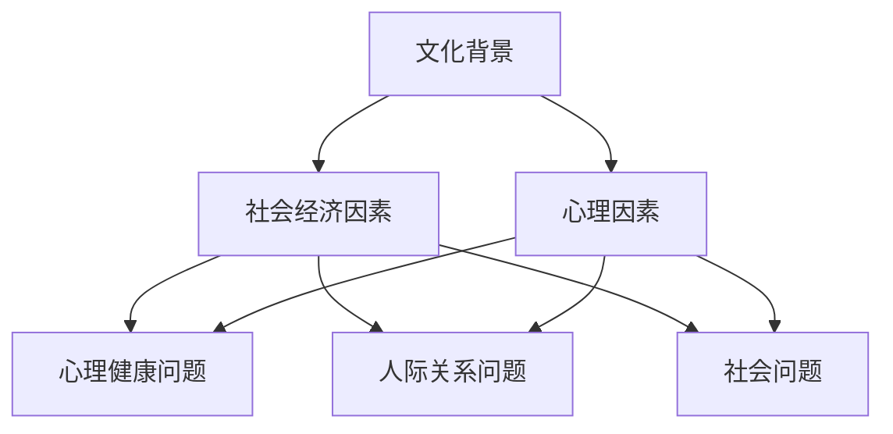
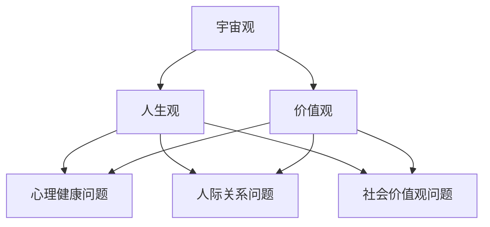
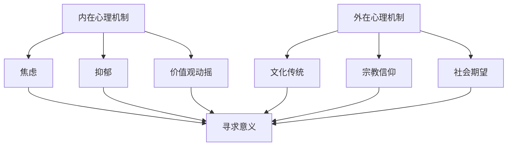

                 

### 文章标题：现代社会的精神困境：从虚无到意义的转化

> 关键词：现代社会、精神困境、虚无主义、意义转化、个人成长、社会策略

> 摘要：本文旨在探讨现代社会中普遍存在的精神困境，分析其根源与影响，并提出个人与社会层面的转化策略，帮助读者从虚无中找到意义，实现个人成长与社会进步。

---

## 第一部分：现代社会的精神困境

### 第1章：现代社会的精神困境概述

随着全球化、技术进步和社会变迁的加速，现代社会面临着前所未有的精神困境。人们普遍感到焦虑、迷茫和失落，甚至陷入虚无主义的泥沼。这一困境不仅影响个体的心理健康，也对整个社会的稳定和发展构成威胁。

#### 1.1 现代社会的特点

- **高速变化**：现代社会信息爆炸，知识更新迅速，个体难以跟上时代的步伐。
- **高度竞争**：市场经济主导下，竞争激烈，个体生存压力增大。
- **科技依赖**：信息技术的发展让人们过度依赖虚拟世界，忽视现实人际关系。
- **个人主义**：现代社会强调个人自由和自我实现，导致个体孤立感和孤独感增加。

#### 1.2 精神困境的起源

- **文化背景**：现代社会价值观的多元化与传统的精神信仰体系冲突，导致人们精神上的迷失。
- **社会经济因素**：物质主义盛行，个体追求物质财富的同时忽视了精神需求。
- **心理因素**：现代社会生活节奏快，压力大，个体心理问题普遍存在。

#### 1.3 精神困境的影响

- **心理健康问题**：焦虑、抑郁、心理障碍等心理问题增多。
- **人际关系问题**：人际关系紧张，信任缺失，社交障碍。
- **社会问题**：精神困境导致社会动荡，犯罪率上升，社会信任度降低。

### Mermaid 流程图：现代社会精神困境的起源与影响

### 第2章：虚无主义的挑战

虚无主义是现代精神困境的重要表现之一。它不仅影响个体的心理健康，还对社会价值观产生深远影响。

#### 2.1 虚无主义的定义与历史

虚无主义起源于19世纪欧洲，是对传统宗教和哲学信仰的质疑和否定。虚无主义认为，宇宙和人生缺乏意义和价值，个体的存在是毫无意义的。

#### 2.2 虚无主义的核心观点

- **宇宙观**：宇宙是随机和无序的，没有预设的目的或意义。
- **人生观**：人生是痛苦的，追求幸福和意义是徒劳的。
- **价值观**：传统道德和价值观是虚伪的，不能提供真正的指导。

#### 2.3 虚无主义的影响与应对

虚无主义对现代社会产生多方面的影响，包括心理健康、人际关系和社会价值观。应对虚无主义的关键在于重建个体和社会的意义体系。

- **心理健康**：虚无主义可能导致抑郁、焦虑和其他心理问题。通过心理治疗和心理咨询可以帮助个体走出虚无主义的阴影。
- **人际关系**：虚无主义可能导致人际关系的紧张和疏离。建立基于真诚和理解的社交关系是克服虚无主义的重要途径。
- **社会价值观**：重建社会价值观，强调个体的责任和使命感，有助于对抗虚无主义。

### Mermaid 流程图：虚无主义的核心观点与影响

### 第3章：现代社会中的意义危机

现代社会中的意义危机是精神困境的另一个重要表现。人们感到迷茫和失落，无法找到生活的意义和方向。

#### 3.1 意义的缺失与寻求

- **意义的缺失**：现代社会中，人们面临高度竞争和快节奏的生活，常常感到压力和焦虑，导致对生活意义的怀疑。
- **寻求意义**：个体为了克服意义的缺失，开始寻求个人目标、价值观和人生使命。

#### 3.2 社会结构对意义的影响

- **社会结构**：现代社会的结构包括经济、政治和文化等方面，这些结构对个体的意义感产生深远影响。
- **影响**：社会结构的变化，如全球化、市场经济和科技发展，可能导致个体对意义的质疑和困惑。

#### 3.3 意义危机的心理机制

- **内在心理机制**：个体在面临意义危机时，可能会出现焦虑、抑郁等心理问题。
- **外在心理机制**：社会环境和文化背景也对个体的意义感产生影响，如文化传统、宗教信仰和社会期望等。

### Mermaid 流程图：意义危机的内在与外在心理机制

## 第二部分：从虚无到意义的转化

### 第4章：精神困境的群体表现

现代社会的精神困境在各个群体中都有所表现，不同群体面临的困境和挑战有所不同。

#### 4.1 年轻一代的精神困境

- **学业压力**：年轻一代面临高考、考研等升学压力，对未来职业发展感到迷茫。
- **就业挑战**：就业市场竞争激烈，许多年轻人难以找到满意的工作。
- **人际关系**：年轻一代在虚拟社交中过度依赖，现实人际关系相对疏离。

#### 4.2 工作人群的精神困境

- **职业倦怠**：长期从事重复性工作，导致工作满意度下降，出现职业倦怠。
- **工作与生活平衡**：工作压力大，生活节奏快，难以实现工作与生活的平衡。
- **自我实现困境**：在工作中追求物质成功，但缺乏精神满足感。

#### 4.3 社交媒体对精神困境的影响

- **虚假满足感**：社交媒体上的虚拟成就和美好生活展示，可能导致个体产生虚假满足感。
- **社交疏离**：过度依赖社交媒体，忽视现实人际关系，导致社交疏离。
- **信息过载**：社交媒体上的信息爆炸，个体难以筛选和处理，产生信息过载。

### 第5章：个人层面的转化路径

从虚无到意义的转化首先需要从个人层面出发，通过自我认知、目标设定和心理调适来逐步实现。

#### 5.1 自我认知与接纳

- **自我认知**：通过反思和自我探索，了解自己的价值观、兴趣和潜能。
- **接纳自我**：接受自己的优点和不足，培养自我接纳和自尊。

#### 5.2 目标设定与行动

- **目标设定**：设定清晰、具体和可衡量的个人目标。
- **行动**：制定行动计划，持续努力，不断追求个人成长。

#### 5.3 心理调适与成长

- **心理调适**：学会应对压力和挫折，培养积极的心态。
- **成长**：通过学习、实践和反思，不断提升自己的能力和素质。

### 第6章：社会层面的转化策略

从虚无到意义的转化不仅需要个人层面的努力，还需要社会层面的支持与策略。

#### 6.1 社会支持系统的建立

- **心理健康服务**：提供心理健康咨询和治疗，帮助个体应对心理问题。
- **教育支持**：改革教育体系，强调素质教育，培养全面发展的人才。

#### 6.2 教育与文化的变革

- **教育变革**：注重培养学生的人文素养和道德观念，提升个体的精神追求。
- **文化变革**：倡导积极向上的社会文化，鼓励个体追求有意义的生活。

#### 6.3 社区参与与社会责任

- **社区参与**：鼓励个体积极参与社区活动，增强社会责任感。
- **社会责任**：倡导企业和社会组织承担社会责任，推动社会进步。

### 第7章：从虚无到意义的案例分析

通过具体案例，我们可以看到从虚无到意义的转化在个人、社区和组织层面的实践。

#### 7.1 个人案例：从迷茫到自我实现的转变

- **背景**：某年轻人毕业后感到迷茫，对未来职业发展无明确方向。
- **转化过程**：通过自我认知和目标设定，找到自己的兴趣和优势，逐步实现职业目标。
- **结果**：该年轻人最终找到了自己的职业方向，实现了自我价值。

#### 7.2 社会案例：从物质主义到精神富足的社区建设

- **背景**：某社区长期受物质主义影响，居民精神空虚，人际关系紧张。
- **转化过程**：通过社区活动和文化建设，鼓励居民参与社区事务，提升社区凝聚力。
- **结果**：该社区逐渐形成了精神富足的氛围，居民生活质量显著提高。

#### 7.3 组织案例：企业文化与意义构建

- **背景**：某企业长期追求经济效益，忽视了企业文化和员工精神需求。
- **转化过程**：通过企业文化变革，强调员工的使命和价值，提升员工满意度。
- **结果**：该企业员工士气高涨，工作效率提高，企业竞争力增强。

### 第8章：未来的展望

面对精神困境，我们需要对未来进行深入思考，探讨如何实现可持续的转化，促进个人和社会的精神健康。

#### 8.1 精神困境的未来趋势

- **技术发展**：科技进步对人类精神生活的影响，如虚拟现实、人工智能等。
- **全球化**：全球化对文化融合和精神需求的挑战。

#### 8.2 意义的可持续转化

- **个人层面**：如何在快速变化的世界中保持意义感。
- **社会层面**：如何建立支持个人意义追求的社会体系。

#### 8.3 社会精神健康的挑战与机遇

- **挑战**：经济压力、社会不公等对精神健康的影响。
- **机遇**：通过心理健康教育和政策支持，提升社会精神健康水平。

### 附录

#### 附录A：相关研究和文献综述

- **研究方法**：综述研究方法，如问卷调查、访谈和案例分析等。
- **研究结论**：总结国内外关于精神困境和意义转化的研究结论。

#### 附录B：转化过程中的常见误区与解决方法

- **误区**：探讨个体和社会在转化过程中可能遇到的误区。
- **解决方法**：提供具体的解决策略和建议。

---

## 总结

现代社会中普遍存在的精神困境对个人和社会都产生了深远的影响。通过自我认知、目标设定和心理调适，个体可以从虚无中找到意义，实现个人成长。同时，社会层面的支持与策略也是实现意义转化的关键。我们呼吁个人和社会共同努力，共同应对精神困境，创造一个更加有意义和健康的未来。

---

### 作者：AI天才研究院/AI Genius Institute & 禅与计算机程序设计艺术 /Zen And The Art of Computer Programming

