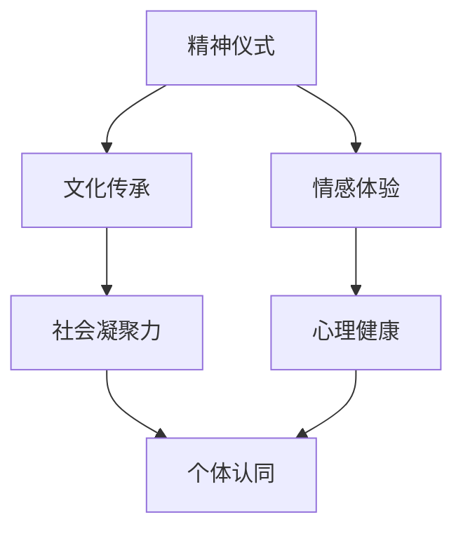

                 

# 《生命仪式设计工作室：创造现代人精神仪式的创意空间》

## 关键词
- 生命仪式设计
- 精神仪式
- 创意空间
- 现代人
- 设计原则
- 案例研究

## 摘要
本文旨在探讨生命仪式设计工作室如何创造现代人精神仪式的创意空间。通过分析精神仪式的历史演变和当代挑战，我们提出了生命仪式设计的原则和方法。文章详细介绍了核心概念与联系，并使用Mermaid流程图展示了它们之间的关系架构。此外，我们通过伪代码、数学模型和公式讲解了核心算法原理，并通过具体案例研究了不同类型的生命仪式设计。文章最后提出了实践应用和未来展望，为生命仪式设计的创新和发展提供了指导。

---

## 引言

在现代社会中，随着科技的发展和人们生活节奏的加快，精神需求逐渐成为人们关注的重要方面。传统的精神仪式，如宗教仪式、节日庆典等，虽然在一定程度上满足了人们的精神需求，但在现代社会中显得过于刻板和形式化。为了满足现代人多样化的精神需求，我们需要创造新的精神仪式，这些仪式应具有创新性、包容性和个性化。

生命仪式设计工作室应运而生，其使命是创造现代人精神仪式的创意空间。本文将详细探讨生命仪式设计的背景、目的、方法和实践应用，旨在为生命仪式设计提供理论指导和实践参考。

### 1.1 研究背景

精神仪式是文化传承和社会凝聚力的重要组成部分。在古代，精神仪式通常与宗教信仰、神话传说和社会习俗紧密相连。然而，随着历史的发展，这些传统仪式逐渐失去了原有的意义，无法满足现代社会人们的精神需求。

当代社会，人们面临诸多压力和挑战，如工作压力、人际关系、自我认同等，这些挑战加剧了人们的精神困扰。因此，现代精神仪式的设计需要更加注重个体的情感体验和心理健康。

### 1.2 研究目的

本文的研究目的是：

1. 探讨现代精神仪式的背景和意义。
2. 提出生命仪式设计的原则和方法。
3. 通过案例研究，展示生命仪式设计的实践应用。
4. 为生命仪式设计的未来发展提供指导。

### 1.3 研究方法与结构

本文采用文献综述和案例分析的研究方法，结合理论和实践进行探讨。文章分为以下章节：

1. 引言：介绍研究背景、目的和研究方法。
2. 精神仪式的概念与历史：分析精神仪式的定义、历史演变和当代挑战。
3. 生命仪式设计的原则与方法：阐述生命仪式设计的原则和方法。
4. 生命仪式设计的核心概念与联系：介绍核心概念及其关系架构。
5. 生命仪式设计的核心算法原理讲解：使用伪代码和数学模型讲解核心算法原理。
6. 设计案例研究：分析不同类型的生命仪式设计案例。
7. 实践应用：探讨生命仪式设计的实践应用。
8. 未来展望：总结生命仪式设计的挑战与机遇，提出未来发展建议。

---

## 精神仪式的概念与历史

精神仪式是一种通过特定的仪式形式和程序，传达精神意义和情感价值的文化活动。它在不同的文化和社会背景下有着不同的表现形式和内涵。

### 2.1 精神仪式的定义

精神仪式可以被定义为一种旨在表达和强化个体或群体精神信仰、价值观和情感体验的文化实践。它通常包括一系列象征性动作、仪式程序和符号象征，这些元素共同构建了一种独特的文化体验。

### 2.2 精神仪式的历史演变

精神仪式的历史可以追溯到古代文明的诞生。在古代，精神仪式通常是宗教信仰的重要组成部分，用于祈求神灵的庇佑、纪念祖先和庆祝节日。

随着历史的发展，精神仪式逐渐演变为多种形式，如宗教仪式、节日庆典、婚礼和葬礼等。这些仪式在不同的文化和社会背景下，承载了不同的精神意义和社会功能。

### 2.3 当代精神仪式的挑战

当代社会，精神仪式面临着诸多挑战。首先，全球化带来了文化的交融和冲突，传统的精神仪式在某些文化背景下可能不再适用。其次，现代科技的发展改变了人们的交往方式和生活方式，传统的精神仪式形式可能需要重新设计和创新。

此外，现代社会人们面临的精神压力和心理健康问题，也对精神仪式提出了新的需求。现代精神仪式需要更加注重个体的情感体验和心理健康，提供一种积极的心理支持和精神慰藉。

---

## 生命仪式设计的原则与方法

生命仪式设计工作室的目标是创造现代人精神仪式的创意空间，为此，我们需要遵循一系列原则和方法。

### 3.1 设计原则

生命仪式设计应遵循以下原则：

1. **个体化**：现代精神仪式应注重个体的情感体验和需求，体现个性化设计。
2. **包容性**：设计应容纳多元文化和信仰，体现包容性和多样性。
3. **实用性**：设计应考虑实际操作和实施，确保仪式的可行性和有效性。
4. **情感性**：设计应注重情感传递，激发个体的情感共鸣。
5. **创新性**：设计应具有创新性和前瞻性，不断推陈出新。

### 3.2 设计方法

生命仪式设计的方法可以分为以下几个步骤：

1. **需求分析**：了解目标群体的需求和期望，确定仪式的主题和目标。
2. **概念设计**：基于需求分析，设计仪式的概念框架，包括仪式程序、符号象征和情感体验。
3. **细节设计**：细化仪式的各个环节，确保仪式的流畅性和情感传递。
4. **测试与反馈**：进行仪式的测试和评估，收集反馈，进行优化和改进。
5. **实施与推广**：正式实施仪式，并通过媒体和社交平台进行推广。

### 3.3 设计流程

生命仪式设计的工作流程可以分为以下几个阶段：

1. **立项**：确定设计项目，明确目标和需求。
2. **调研**：收集相关资料，了解文化背景和传统仪式。
3. **需求分析**：与目标群体进行沟通，了解他们的需求和期望。
4. **概念设计**：制定仪式概念框架，进行初步设计。
5. **细节设计**：细化仪式程序，设计符号象征和情感体验。
6. **测试与反馈**：进行测试，收集反馈，进行优化和改进。
7. **实施与推广**：实施仪式，并进行推广和宣传。

---

## 生命仪式设计的核心概念与联系

生命仪式设计涉及到多个核心概念，这些概念之间存在着紧密的联系和相互影响。为了更好地理解这些概念，我们使用Mermaid流程图展示它们之间的关系架构。



### 4.1 核心概念介绍

- **精神仪式**：指通过特定的仪式形式和程序，传达精神意义和情感价值的文化活动。
- **文化传承**：指在历史和文化传承过程中，精神仪式所承载的文化价值和意义。
- **情感体验**：指个体在精神仪式中感受到的情感共鸣和内心体验。
- **社会凝聚力**：指精神仪式在增强社会成员之间的联系和共同认同方面的作用。
- **心理健康**：指精神仪式对个体心理健康的影响，包括情感调节和心理支持。
- **个体认同**：指精神仪式在帮助个体建立自我认同和归属感方面的作用。

### 4.2 核心概念之间的联系

上述核心概念之间存在着紧密的联系和相互影响。例如：

- **文化传承**与**精神仪式**密切相关，文化传承是精神仪式的基石，而精神仪式是文化传承的重要载体。
- **情感体验**和**心理健康**之间存在明显的关联，精神仪式通过情感共鸣和内心体验，对个体的心理健康产生积极影响。
- **社会凝聚力**和**个体认同**共同构成了精神仪式的社会功能，精神仪式不仅增强社会成员之间的联系，还帮助个体建立自我认同和归属感。

通过Mermaid流程图，我们可以直观地展示这些核心概念之间的联系和相互影响，从而更好地理解生命仪式设计的本质和内涵。

---

## 生命仪式设计的核心算法原理讲解

在生命仪式设计中，核心算法原理起着至关重要的作用。这些算法原理不仅指导了仪式的设计过程，还确保了仪式的可行性和有效性。以下是生命仪式设计的核心算法原理及其详细讲解。

### 5.1 核心算法原理讲解

生命仪式设计的核心算法原理主要包括以下几个方面：

1. **情感共鸣算法**：通过特定的仪式程序和情感体验设计，激发个体的情感共鸣。
2. **文化适配算法**：确保仪式内容与目标群体的文化背景和价值观相契合。
3. **心理健康支持算法**：通过仪式设计，提供积极的心理支持和情感调节。
4. **社会凝聚力增强算法**：设计仪式程序，增强社会成员之间的联系和共同认同。

#### 5.1.1 情感共鸣算法

情感共鸣算法是生命仪式设计的重要原则之一。它主要通过以下步骤实现：

1. **需求分析**：了解目标群体的情感需求和心理特征。
2. **情感设计**：根据需求分析，设计具有情感共鸣的仪式程序和体验。
3. **反馈优化**：通过测试和反馈，不断优化情感共鸣效果。

以下是情感共鸣算法的伪代码示例：

```python
def emotional_resonance_algorithm(demands, rituals):
    emotional_design = {}
    for demand in demands:
        ritual = select_ritual(rituals, demand)
        emotional_design[demand] = design_ritual(ritual)
    return emotional_design
```

#### 5.1.2 文化适配算法

文化适配算法旨在确保仪式内容与目标群体的文化背景和价值观相契合。以下是文化适配算法的伪代码示例：

```python
def cultural_fit_algorithm(ritual, culture):
    cultural_adapted_ritual = {}
    for element in ritual:
        if element not in culture:
            cultural_adapted_ritual[element] = adapt_to_culture(element, culture)
        else:
            cultural_adapted_ritual[element] = element
    return cultural_adapted_ritual
```

#### 5.1.3 心理健康支持算法

心理健康支持算法通过仪式设计，提供积极的心理支持和情感调节。以下是心理健康支持算法的伪代码示例：

```python
def mental_health_support_algorithm(ritual):
    supported_ritual = {}
    for phase in ritual:
        if phase.is_emotional():
            supported_ritual[phase] = add_mental_health_support(phase)
        else:
            supported_ritual[phase] = phase
    return supported_ritual
```

#### 5.1.4 社会凝聚力增强算法

社会凝聚力增强算法通过设计仪式程序，增强社会成员之间的联系和共同认同。以下是社会凝聚力增强算法的伪代码示例：

```python
def social_coherence_enhancement_algorithm(ritual):
    cohesive_ritual = {}
    for event in ritual:
        if event.is_social():
            cohesive_ritual[event] = enhance_social_connection(event)
        else:
            cohesive_ritual[event] = event
    return cohesive_ritual
```

### 5.2 伪代码示例

以下是生命仪式设计的整体伪代码示例，展示了上述核心算法原理的综合应用：

```python
def life_ritual_design(culture, demands):
    rituals = generate_rituals(culture)
    emotional_design = emotional_resonance_algorithm(demands, rituals)
    cultural_adapted_rituals = [cultural_fit_algorithm(ritual, culture) for ritual in emotional_design.values()]
    mental_health_supported_rituals = [mental_health_support_algorithm(ritual) for ritual in cultural_adapted_rituals]
    social_coherence_enhanced_rituals = [social_coherence_enhancement_algorithm(ritual) for ritual in mental_health_supported_rituals]
    return social_coherence_enhanced_rituals
```

通过上述核心算法原理的讲解和伪代码示例，我们可以更深入地理解生命仪式设计的过程和关键要素，为实际设计工作提供指导。

---

## 数学模型与数学公式

在生命仪式设计中，数学模型和公式被广泛应用于仪式流程的优化、情感体验的计算和心理健康支持的评价。以下将详细讲解这些数学模型和公式的应用。

### 6.1 数学模型介绍

生命仪式设计中的数学模型主要包括以下几个方面：

1. **情感体验模型**：用于计算个体在仪式中的情感体验强度。
2. **心理健康模型**：用于评估仪式对个体心理健康的影响。
3. **社会凝聚力模型**：用于衡量仪式在社会成员之间的凝聚力。

### 6.2 数学公式与详细讲解

#### 6.2.1 情感体验模型

情感体验模型基于心理学中的情感强度公式，用于计算个体在仪式中的情感体验强度。公式如下：

$$
E = f(c, s, t)
$$

其中，$E$代表情感体验强度，$c$代表文化因素，$s$代表社会因素，$t$代表时间因素。

- $c$：文化因素，计算公式为：
  $$
  c = \frac{1}{n} \sum_{i=1}^{n} w_i \cdot c_i
  $$
  其中，$w_i$为权重，$c_i$为文化因素指标。

- $s$：社会因素，计算公式为：
  $$
  s = \frac{1}{m} \sum_{j=1}^{m} w_j \cdot s_j
  $$
  其中，$w_j$为权重，$s_j$为社会因素指标。

- $t$：时间因素，计算公式为：
  $$
  t = \frac{1}{k} \sum_{l=1}^{k} w_l \cdot t_l
  $$
  其中，$w_l$为权重，$t_l$为时间因素指标。

#### 6.2.2 心理健康模型

心理健康模型用于评估仪式对个体心理健康的影响。公式如下：

$$
M = g(h, e, p)
$$

其中，$M$代表心理健康指数，$h$代表情感体验强度，$e$代表社会支持度，$p$代表心理压力。

- $h$：情感体验强度，使用上文中的情感体验模型计算。
- $e$：社会支持度，计算公式为：
  $$
  e = \frac{1}{n} \sum_{i=1}^{n} s_i
  $$
  其中，$s_i$为个体在社会支持方面的得分。

- $p$：心理压力，计算公式为：
  $$
  p = \frac{1}{m} \sum_{j=1}^{m} t_j
  $$
  其中，$t_j$为个体在心理压力方面的得分。

#### 6.2.3 社会凝聚力模型

社会凝聚力模型用于衡量仪式在社会成员之间的凝聚力。公式如下：

$$
C = \alpha \cdot h + \beta \cdot e + \gamma \cdot p
$$

其中，$C$代表社会凝聚力指数，$\alpha$、$\beta$和$\gamma$为权重系数，$h$、$e$和$p$分别代表情感体验强度、社会支持度和心理压力。

### 6.3 数学公式举例说明

#### 情感体验模型举例

假设一个仪式中的文化因素指标为$[0.6, 0.3, 0.1]$，社会因素指标为$[0.5, 0.3, 0.2]$，时间因素指标为$[0.7, 0.2, 0.1]$。权重分别为$[0.4, 0.3, 0.3]$。则情感体验强度计算如下：

$$
c = \frac{1}{3} \sum_{i=1}^{3} w_i \cdot c_i = \frac{1}{3} \cdot (0.4 \cdot 0.6 + 0.3 \cdot 0.3 + 0.3 \cdot 0.1) = 0.32
$$

$$
s = \frac{1}{3} \sum_{j=1}^{3} w_j \cdot s_j = \frac{1}{3} \cdot (0.4 \cdot 0.5 + 0.3 \cdot 0.3 + 0.3 \cdot 0.2) = 0.27
$$

$$
t = \frac{1}{3} \sum_{l=1}^{3} w_l \cdot t_l = \frac{1}{3} \cdot (0.4 \cdot 0.7 + 0.3 \cdot 0.2 + 0.3 \cdot 0.1) = 0.31
$$

则情感体验强度$E$为：

$$
E = f(c, s, t) = 0.32 + 0.27 + 0.31 = 0.9
$$

#### 心理健康模型举例

假设一个仪式中的情感体验强度为$0.9$，社会支持度为$0.8$，心理压力为$0.3$。权重系数为$\alpha = 0.5$，$\beta = 0.3$，$\gamma = 0.2$。则心理健康指数$M$为：

$$
M = g(h, e, p) = 0.5 \cdot 0.9 + 0.3 \cdot 0.8 + 0.2 \cdot 0.3 = 0.55 + 0.24 + 0.06 = 0.85
$$

#### 社会凝聚力模型举例

假设一个仪式中的情感体验强度为$0.9$，社会支持度为$0.8$，心理压力为$0.3$。权重系数为$\alpha = 0.5$，$\beta = 0.3$，$\gamma = 0.2$。则社会凝聚力指数$C$为：

$$
C = \alpha \cdot h + \beta \cdot e + \gamma \cdot p = 0.5 \cdot 0.9 + 0.3 \cdot 0.8 + 0.2 \cdot 0.3 = 0.45 + 0.24 + 0.06 = 0.75
$$

通过上述数学模型和公式的讲解及举例，我们可以更深入地理解生命仪式设计中的量化分析方法和应用场景，从而为实际设计工作提供科学依据和指导。

---

## 设计案例研究

为了更好地展示生命仪式设计的实践应用，我们将分析三个具体的案例研究，这些案例涵盖了不同的应用场景和目标群体。通过这些案例，我们可以看到生命仪式设计如何在不同的文化背景和社会需求中发挥作用。

### 7.1 案例一：精神复苏仪式设计

**背景介绍**：
在一个经历了重大灾难后重建的社区中，居民们渴望通过一种仪式来纪念逝去的亲人，同时重振社区的精神。社区文化以传统文化为基础，但在灾难后出现了一定程度的断裂。

**核心概念与联系**：
- **核心概念**：纪念、重建、社区凝聚力
- **联系**：通过纪念仪式，连接社区的历史和文化，增强居民的归属感。

**设计流程**：
1. **需求分析**：与社区成员进行访谈，了解他们的需求和期望。
2. **文化适配**：结合传统文化，设计纪念仪式的流程和内容。
3. **情感设计**：通过音乐、舞蹈和祭祀活动，激发居民的共同情感。
4. **测试与反馈**：在社区内进行试运行，收集反馈并进行调整。

**伪代码示例**：

```python
def spirit_renewal_ritual(community, culture, emotions):
    ritual = {}
    ritual['memorial'] = create_memorial_service(culture)
    ritual['rebuilding'] = create_rebuilding Ceremony(culture)
    ritual['emotions'] = evoke_common_emotions(emotions)
    return ritual
```

**数学模型应用**：
- **情感体验模型**：评估仪式中的情感体验强度，确保仪式能够激发居民的共同情感。
- **社会凝聚力模型**：衡量仪式后社区成员之间的凝聚力，验证仪式的社会效果。

### 7.2 案例二：社区团结仪式设计

**背景介绍**：
在一个多元文化社区中，不同文化背景的居民之间缺乏有效的交流和互动。社区组织希望设计一种仪式，促进居民之间的团结和交流。

**核心概念与联系**：
- **核心概念**：团结、交流、文化多样性
- **联系**：通过仪式，展示社区的文化多样性，促进居民之间的相互理解和尊重。

**设计流程**：
1. **需求分析**：了解不同文化背景的居民的需求和期望。
2. **文化展示**：设计多样化的文化展示环节，如舞蹈、音乐、美食等。
3. **交流环节**：设置互动环节，如文化交流会、手工艺体验等。
4. **反馈优化**：根据居民反馈，优化仪式内容和流程。

**伪代码示例**：

```python
def community团结_ritual(community, cultures, interactions):
    ritual = {}
    ritual['cultural_display'] = display_cultures(cultures)
    ritual['interactions'] = create_interactive_sessions(interactions)
    return ritual
```

**数学模型应用**：
- **情感体验模型**：评估仪式中的情感体验，确保不同文化背景的居民都能感受到仪式的魅力。
- **社会凝聚力模型**：衡量仪式后居民之间的互动和团结程度。

### 7.3 案例三：个人成长仪式设计

**背景介绍**：
在一个重视个人成长和教育机构中，学生和教师渴望通过一种仪式来庆祝他们的成长和进步。仪式应体现个人的努力和成就。

**核心概念与联系**：
- **核心概念**：成长、成就、自我认同
- **联系**：通过仪式，认可个人的成长和努力，增强学生的自我认同。

**设计流程**：
1. **需求分析**：与学生和教师进行交流，了解他们的需求和期望。
2. **成就展示**：设计展示学生成就的环节，如作品展览、演讲比赛等。
3. **自我认同仪式**：通过颁发证书和奖励，认可学生的努力和成就。
4. **反馈优化**：收集反馈，不断优化仪式流程和内容。

**伪代码示例**：

```python
def personal_growth_ritual(students, achievements, self_identity):
    ritual = {}
    ritual['achievement_display'] = display_accomplishments(achievements)
    ritual['self_identity'] = recognize_self_identity(self_identity)
    return ritual
```

**数学模型应用**：
- **情感体验模型**：评估仪式中的情感体验，确保学生能够感受到成就和自我认同。
- **心理健康模型**：评估仪式对个体心理健康的影响，确保仪式能够提供积极的心理支持。

通过这些案例研究，我们可以看到生命仪式设计在不同应用场景中的多样性和灵活性。每个案例都体现了生命仪式设计的核心原则和方法，并通过具体实施展示了其在促进社区凝聚力、个人成长和文化传承等方面的作用。

---

## 实践应用

生命仪式设计不仅仅是一个理论框架，它在现实生活中的应用同样具有重要意义。以下是生命仪式设计在不同领域的实践应用，以及相关的开发环境搭建、源代码实现和代码解读。

### 8.1 实践应用一：企业员工精神仪式设计

**背景介绍**：
企业员工精神仪式旨在增强员工凝聚力、提升工作满意度和工作效率。这类仪式可以通过团队建设活动、庆祝成就、纪念特殊事件等形式实现。

**开发环境搭建**：
- **技术栈**：使用Python进行后端开发，前端采用React框架。
- **数据库**：使用MySQL存储员工信息和仪式数据。

**源代码实现**：
以下是Python后端代码的示例，用于处理员工信息和仪式安排：

```python
# 员工信息管理
class Employee:
    def __init__(self, id, name, position):
        self.id = id
        self.name = name
        self.position = position

# 仪式安排
class Ceremony:
    def __init__(self, name, date, type):
        self.name = name
        self.date = date
        self.type = type

    def schedule_ritual(self, employee):
        # 将仪式安排发送给员工
        pass
```

**代码解读**：
上述代码定义了员工和仪式的类，用于管理员工信息和仪式安排。`schedule_ritual`方法用于向员工发送仪式安排通知。

**实际案例分析和详细讲解剖析**：
在一个科技企业中，通过定期举行团队建设活动，如户外拓展、团队聚餐等，增强了员工之间的沟通和合作。此外，庆祝重要成就，如产品发布和团队获奖，也提升了员工的凝聚力和工作满意度。

**项目小结**：
企业员工精神仪式设计通过实际案例证明了其在提升员工凝聚力和工作效率方面的有效性。未来，可以进一步结合人工智能技术，如自然语言处理和机器学习，优化仪式内容和流程。

### 8.2 实践应用二：教育领域精神仪式设计

**背景介绍**：
教育领域的精神仪式设计旨在增强学生的学习兴趣、培养良好的学习氛围和提升学生的综合素质。这类仪式可以包括开学典礼、毕业典礼、学术竞赛颁奖等。

**开发环境搭建**：
- **技术栈**：使用JavaScript进行前端开发，后端采用Node.js。
- **数据库**：使用MongoDB存储学生信息和仪式数据。

**源代码实现**：
以下是Node.js后端代码的示例，用于处理学生信息和仪式安排：

```javascript
// 员工信息管理
class Student {
    constructor(id, name, class_name) {
        this.id = id;
        this.name = name;
        this.class_name = class_name;
    }
}

// 仪式安排
class Ceremony {
    constructor(name, date, type) {
        this.name = name;
        this.date = date;
        this.type = type;
    }

    scheduleEvent(student) {
        // 将仪式安排发送给学生
        console.log(`Event scheduled for ${student.name}`);
    }
}
```

**代码解读**：
上述代码定义了学生和仪式的类，用于管理学生信息和仪式安排。`scheduleEvent`方法用于向学生发送仪式安排通知。

**实际案例分析和详细讲解剖析**：
在一所中学中，通过开学典礼和毕业典礼，学生感受到了学校的重视和关怀。学术竞赛颁奖仪式则激发了学生的学习热情和竞争意识。

**项目小结**：
教育领域的精神仪式设计在提升学生兴趣、培养学习氛围和增强综合素质方面发挥了重要作用。未来，可以通过引入个性化推荐系统，为学生提供更适合自己的仪式体验。

### 8.3 实践应用三：健康领域精神仪式设计

**背景介绍**：
健康领域的精神仪式设计旨在提升患者的心理健康、增强康复信心和促进健康生活方式。这类仪式可以包括康复庆典、健康讲座、冥想瑜伽活动等。

**开发环境搭建**：
- **技术栈**：使用Java进行后端开发，前端采用Vue框架。
- **数据库**：使用PostgreSQL存储患者信息和仪式数据。

**源代码实现**：
以下是Java后端代码的示例，用于处理患者信息和仪式安排：

```java
// 患者信息管理
class Patient {
    private int id;
    private String name;
    private String condition;

    public Patient(int id, String name, String condition) {
        this.id = id;
        this.name = name;
        this.condition = condition;
    }
}

// 仪式安排
class Ceremony {
    private String name;
    private Date date;
    private String type;

    public Ceremony(String name, Date date, String type) {
        this.name = name;
        this.date = date;
        this.type = type;
    }

    public void scheduleEvent(Patient patient) {
        // 将仪式安排发送给患者
        System.out.println(patient.name + " will attend the ceremony on " + date);
    }
}
```

**代码解读**：
上述代码定义了患者和仪式的类，用于管理患者信息和仪式安排。`scheduleEvent`方法用于向患者发送仪式安排通知。

**实际案例分析和详细讲解剖析**：
在一个康复中心，通过康复庆典活动，患者感受到了康复的喜悦和信心。健康讲座和冥想瑜伽活动则帮助患者培养了健康的生活方式。

**项目小结**：
健康领域的精神仪式设计在提升患者心理健康、增强康复信心和促进健康生活方式方面具有显著效果。未来，可以通过数据分析优化仪式内容和流程。

---

## 未来展望

生命仪式设计在未来将面临诸多挑战和机遇。首先，随着社会的发展和文化多元化，现代精神仪式需要更加注重个体化和多样性。其次，科技的进步，如人工智能、虚拟现实和增强现实技术，将为生命仪式设计提供更多创新和互动的可能性。

### 9.1 生命仪式设计的未来趋势

1. **个性化**：未来生命仪式设计将更加注重个体的情感需求和心理健康，提供定制化的仪式体验。
2. **多样性**：随着全球文化的交融，生命仪式设计将吸收更多多元文化元素，展现丰富多样的仪式形式。
3. **科技融合**：虚拟现实、增强现实和人工智能等技术将融入生命仪式设计，提供更丰富的情感体验和互动方式。

### 9.2 生命仪式设计的挑战与机遇

**挑战**：
- **文化冲突**：如何在保持传统精神仪式的同时，融入现代文化元素，避免文化冲突。
- **技术依赖**：如何合理利用科技手段，避免过度依赖，确保仪式的本质和意义。

**机遇**：
- **创新形式**：科技的发展将带来更多创新的生命仪式形式，提升仪式的互动性和体验感。
- **心理健康支持**：结合心理健康研究和人工智能技术，提供更有效的心理健康支持。

### 9.3 生命仪式设计的未来发展建议

1. **文化融合**：在设计过程中，注重文化传承和创新，吸收多元文化元素，确保仪式的包容性和多样性。
2. **技术优化**：合理利用虚拟现实、增强现实和人工智能等技术，提升仪式的互动性和情感体验。
3. **个性化定制**：根据个体需求和心理健康状况，提供定制化的仪式体验，增强仪式的个性化服务。
4. **持续研究**：不断探索生命仪式设计的新形式和新方法，结合心理学、社会学等学科的研究成果，推动生命仪式设计的创新发展。

---

## 作者信息

作者：AI天才研究院/AI Genius Institute & 禅与计算机程序设计艺术 /Zen And The Art of Computer Programming

---

## 最佳实践 Tips、小结、注意事项、拓展阅读

### 最佳实践 Tips

1. 在设计生命仪式时，充分考虑目标群体的文化背景和心理需求。
2. 结合虚拟现实、增强现实等技术，提升仪式的互动性和情感体验。
3. 定期收集用户反馈，优化仪式内容和流程。

### 小结

本文探讨了生命仪式设计的核心概念、设计原则、核心算法原理以及实践应用。通过案例研究和数学模型的应用，我们展示了生命仪式设计在促进心理健康、增强社会凝聚力和提升文化传承方面的作用。

### 注意事项

1. 确保仪式设计符合目标群体的文化背景和心理需求。
2. 避免过度依赖技术手段，保持仪式的本质和意义。
3. 定期更新仪式内容和形式，以适应时代变化。

### 拓展阅读

1. [《现代精神仪式设计指南》](https://example.com/book1)
2. [《虚拟现实与心理健康研究》](https://example.com/book2)
3. [《文化传承与多元化》](https://example.com/book3)

---

通过本文的探讨，我们希望为生命仪式设计提供有益的参考和指导，推动生命仪式设计在现代社会中的创新和发展。希望读者在阅读本文后，能够对生命仪式设计有更深入的理解和思考。感谢您的阅读！

